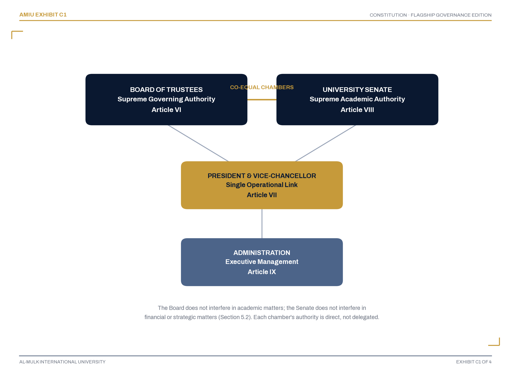
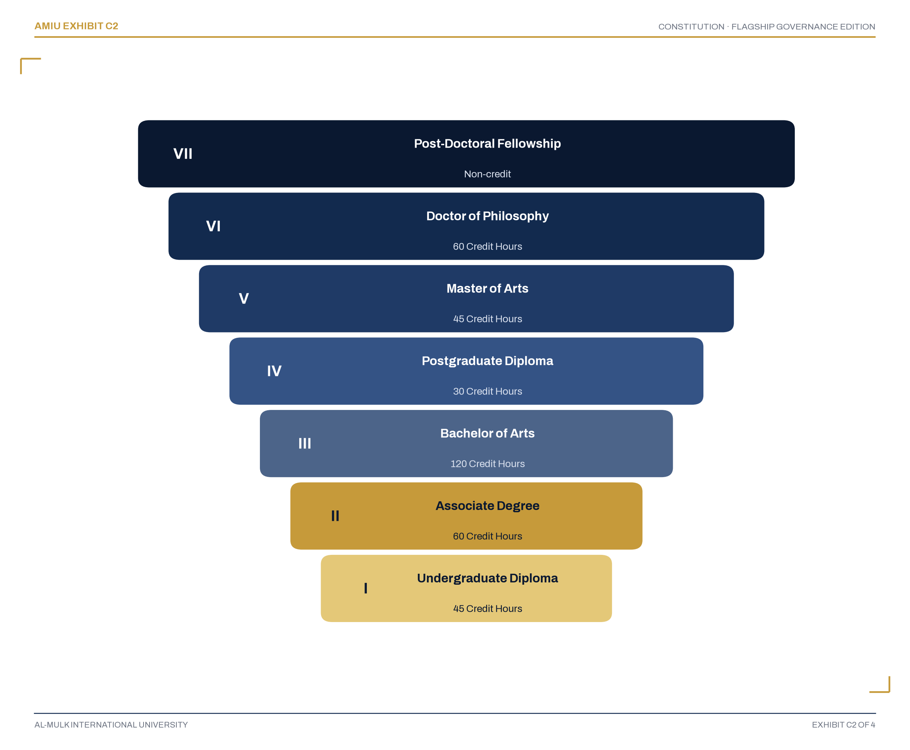
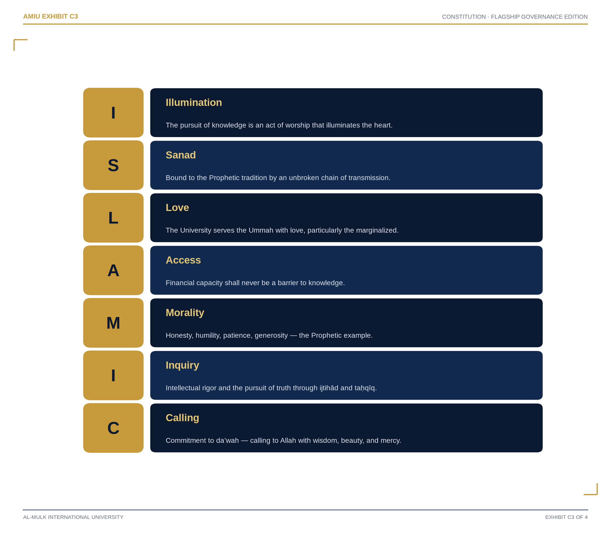

```{=openxml}
<w:tbl>
  <w:tblPr>
    <w:tblW w:w="9350" w:type="dxa"/>
    <w:tblBorders>
      <w:top w:val="single" w:sz="12" w:space="0" w:color="B08625"/>
      <w:left w:val="none" w:sz="0" w:space="0" w:color="auto"/>
      <w:bottom w:val="single" w:sz="12" w:space="0" w:color="B08625"/>
      <w:right w:val="none" w:sz="0" w:space="0" w:color="auto"/>
      <w:insideH w:val="none" w:sz="0" w:space="0" w:color="auto"/>
      <w:insideV w:val="none" w:sz="0" w:space="0" w:color="auto"/>
    </w:tblBorders>
  </w:tblPr>
  <w:tblGrid><w:gridCol w:w="9350"/></w:tblGrid>
  <w:tr>
    <w:trPr><w:trHeight w:val="13200" w:hRule="atLeast"/></w:trPr>
    <w:tc>
      <w:tcPr>
        <w:tcW w:w="9350" w:type="dxa"/>
        <w:shd w:val="clear" w:color="auto" w:fill="122A4E"/>
        <w:tcMar><w:top w:w="620" w:type="dxa"/><w:left w:w="620" w:type="dxa"/><w:bottom w:w="620" w:type="dxa"/><w:right w:w="620" w:type="dxa"/></w:tcMar>
        <w:vAlign w:val="center"/>
      </w:tcPr>
<w:p><w:pPr><w:jc w:val="center"/><w:spacing w:before="0" w:after="900"/></w:pPr>
  <w:r><w:rPr><w:rFonts w:ascii="Source Serif 4" w:hAnsi="Source Serif 4"/><w:i/><w:smallCaps/><w:color w:val="8C97AB"/><w:sz w:val="18"/><w:spacing w:val="26"/></w:rPr><w:t>Supreme Strategic Planning Council &#183; Flagship Governance Edition</w:t></w:r></w:p>
<w:p><w:pPr><w:jc w:val="center"/><w:spacing w:before="0" w:after="80"/></w:pPr>
  <w:r><w:rPr><w:rFonts w:ascii="Source Serif 4" w:hAnsi="Source Serif 4"/><w:i/><w:smallCaps/><w:b/><w:color w:val="B08625"/><w:sz w:val="26"/><w:spacing w:val="16"/></w:rPr><w:t>Al-Mulk International University</w:t></w:r></w:p>
<w:p><w:pPr><w:jc w:val="center"/><w:spacing w:before="0" w:after="200"/><w:pBdr><w:top w:val="single" w:sz="4" w:space="20" w:color="B08625"/><w:bottom w:val="single" w:sz="4" w:space="20" w:color="B08625"/></w:pBdr></w:pPr>
  <w:r><w:rPr><w:rFonts w:ascii="Fraunces Black" w:hAnsi="Fraunces Black"/><w:b/><w:color w:val="FFFFFF"/><w:sz w:val="76"/><w:spacing w:val="18"/></w:rPr><w:t>CONSTITUTION</w:t></w:r></w:p>
<w:p><w:pPr><w:jc w:val="center"/><w:spacing w:before="500" w:after="60"/></w:pPr>
  <w:r><w:rPr><w:rFonts w:ascii="Fraunces" w:hAnsi="Fraunces"/><w:i/><w:color w:val="DCE3F0"/><w:sz w:val="27"/></w:rPr><w:t>Flagship Governance Edition</w:t></w:r></w:p>
<w:p><w:pPr><w:jc w:val="center"/><w:spacing w:before="0" w:after="900"/></w:pPr>
  <w:r><w:rPr><w:rFonts w:ascii="Source Serif 4" w:hAnsi="Source Serif 4"/><w:i/><w:smallCaps/><w:color w:val="8C97AB"/><w:sz w:val="22"/><w:spacing w:val="14"/></w:rPr><w:t>2028</w:t></w:r></w:p>
<w:p><w:pPr><w:jc w:val="center"/><w:spacing w:before="0" w:after="60"/></w:pPr>
  <w:r><w:rPr><w:rFonts w:ascii="Source Serif 4" w:hAnsi="Source Serif 4"/><w:i/><w:smallCaps/><w:color w:val="8C97AB"/><w:sz w:val="18"/><w:spacing w:val="8"/></w:rPr><w:t xml:space="preserve">Document Reference  </w:t></w:r><w:r><w:rPr><w:rFonts w:ascii="Source Serif 4" w:hAnsi="Source Serif 4"/><w:b/><w:smallCaps/><w:color w:val="B08625"/><w:sz w:val="16"/></w:rPr><w:t>AMIU-CON-001</w:t></w:r></w:p>
<w:p><w:pPr><w:jc w:val="center"/><w:spacing w:before="0" w:after="0"/></w:pPr>
  <w:r><w:rPr><w:rFonts w:ascii="Source Serif 4" w:hAnsi="Source Serif 4"/><w:i/><w:smallCaps/><w:color w:val="8C97AB"/><w:sz w:val="17"/><w:spacing w:val="8"/></w:rPr><w:t>edu.amiu.com &#183; Texas-Domiciled, Religiously Exempt &#183; Incorporated 6 December 2027</w:t></w:r></w:p>
    </w:tc>
  </w:tr>
</w:tbl>
<w:p><w:r><w:br w:type="page"/></w:r></w:p>
```

## Document Control {.unnumbered}

| | |
|---|---|
| **Document Control No.** | AMIU-CON-001 |
| **Version** | 6.0 (Complete Comprehensive Edition) |
| **Effective Date** | 1 January 2028 |
| **Classification** | Public &#8212; All Stakeholders |
| **Supersedes** | All prior governing documents of Al-Mulk International University |
| **Companion Volumes** | Strategic Implementation Blueprint 2028&#8211;2050 (AMIU-SB-002); Institutional Governance Compendium (AMIU-IGC-004); Academic Handbook (AMIU-ACAH-001); Student Policies Handbook (AMIU-STUH-001); Operations Handbook (AMIU-OPSH-001) |

*This Constitution is the supreme legal document of Al-Mulk International University. All policies, regulations, and procedures adopted by the University shall be consistent with its provisions; any policy inconsistent with this Constitution is void.*

*Typesetting and Publication Design: this Constitution is set in the same three-role editorial system as the University's Strategic Implementation Blueprint &#8212; Fraunces display, Source Serif 4 reading, Archivo structural &#8212; so that every AMIU governing and planning publication reads as one institutional family, produced under one publication standard.*

```{=openxml}
<w:p><w:r><w:br w:type="page"/></w:r></w:p>
```

## Constitutional Declaration {.unnumbered}

::: {custom-style="MessageByline"}
Presented for adoption by the Board of Trustees
:::

This Constitution is declared to be the supreme governing instrument of Al-Mulk International University, binding upon its Board of Trustees, University Senate, Administration, faculty, students, and all who act in the University's name.

It was adopted in the exercise of the founding authority vested in the University's Founders under its Certificate of Formation, and it takes effect on the date stated on the Document Control page. No person, office, or subordinate policy may act contrary to its provisions, and any conflict between this Constitution and a subordinate policy is resolved in this Constitution's favor.

This is a Complete Comprehensive Edition: it consolidates, in twenty-three Articles, the full constitutional architecture of the University &#8212; its legal identity, its bicameral governance, its academic and financial structure, and the rights, responsibilities, and protections owed to every member of its community.

::: {custom-style="MessageByline"}
Certified for Executive Release &#8212; Founding-Decade Edition
:::

```{=openxml}
<w:p><w:r><w:br w:type="page"/></w:r></w:p>
```

## Preamble {.unnumbered}

```{=openxml}
<w:p><w:pPr><w:jc w:val="center"/><w:spacing w:before="0" w:after="360"/></w:pPr>
  <w:r><w:rPr><w:rFonts w:ascii="Fraunces" w:hAnsi="Fraunces"/><w:i/><w:color w:val="122A4E"/><w:sz w:val="30"/></w:rPr><w:t>In the Name of Allah, the Most Gracious, the Most Merciful.</w:t></w:r></w:p>
```

We, the Founders, Board of Trustees, and Academic Community of Al-Mulk International University, do hereby establish this Constitution to define the governance, academic, and administrative framework of the University.

This Constitution is founded upon the following principles:

1. The University exists to spread Islamic education worldwide at the minimum possible cost;
2. The University is committed to the preservation and continuation of the Prophetic tradition of knowledge transmission (*sanad*);
3. The University operates with transparency, accountability, and integrity;
4. The University is financially self-sustaining and mission-driven;
5. The University serves the global Muslim community without discrimination;
6. The University is guided by the ISLAMIC framework: Illumination, Sanad, Love, Access, Morality, Inquiry, and Calling.

This Constitution is the supreme legal document of the University. All policies, regulations, and procedures shall be consistent with its provisions. Any policy inconsistent with this Constitution shall be void.

```{=openxml}
<w:p><w:r><w:br w:type="page"/></w:r></w:p>
```

## Governance Architecture {.unnumbered}

*How authority is divided between the University's two chambers, and where they meet.*



**Figure C1. AMIU Bicameral Governance Architecture**

*The Board of Trustees and the University Senate are co-equal chambers, each supreme within its own domain; the President & Vice-Chancellor is the single operational link between them, not a layer of authority over either. Article V and Article VIII govern this relationship in full.*

```{=openxml}
<w:p><w:r><w:br w:type="page"/></w:r></w:p>
```

## Academic Framework {.unnumbered}

*The seven-tier stackable credential ladder every AMIU program sits inside.*



**Figure C2. The Academic Ladder (Article X)**

*Every credential stacks directly into the next tier with no credit lost in the climb &#8212; from the Undergraduate Diploma at the entry point to the Post-Doctoral Fellowship at its summit. Article X, Section 10.1 governs this ladder in full.*

```{=openxml}
<w:p><w:r><w:br w:type="page"/></w:r></w:p>
```

## The ISLAMIC Framework {.unnumbered}

*The seven values that govern every institutional decision this Constitution authorizes.*



**Figure C3. The ISLAMIC Framework (Article III, Section 3.3)**

*Illumination, Sanad, Love, Access, Morality, Inquiry, Calling &#8212; the framework is not aspirational language. Article III, Section 3.3.2 makes conformity to it binding on every person acting in the University's name.*

```{=openxml}
<w:p><w:r><w:br w:type="page"/></w:r></w:p>
```

## Table of Contents {.unnumbered}

| | |
|---|---:|
| **Document Control** | **2** |
| **Constitutional Declaration** | **4** |
| **Preamble** | **5** |
| **Governance Architecture** | **6** |
| **Academic Framework** | **7** |
| **The ISLAMIC Framework** | **5** |
| **Article I — Definitions** | **13** |
| **Article II — Legal Identity** | **18** |
| **Article III — Mission, Vision and Values** | **23** |
| **Article IV — Interpretation** | **28** |
| **Article V — Governance Structure** | **31** |
| **Article VI — Board of Trustees** | **38** |
| **Article VII — President & Vice-Chancellor** | **46** |
| **Article VIII — University Senate** | **50** |
| **Article IX — Administration** | **57** |
| **Article X — Academic Program** | **60** |
| **Article XI — Waqf and Endowment** | **63** |
| **Article XII — Students' Rights and Responsibilities** | **65** |
| **Article XIII — Faculty Rights and Responsibilities** | **68** |
| **Article XIV — Financial Sustainability** | **70** |
| **Article XV — Transparency and Accountability** | **72** |
| **Article XVI — Independent Officers** | **75** |
| **Article XVII — Records and Archives** | **77** |
| **Article XVIII — Amendment** | **79** |
| **Article XIX — Transitional Provisions** | **81** |
| **Article XX — Dissolution** | **83** |
| **Article XXI — Non-Political and Non-Profit Provisions** | **85** |
| **Article XXII — Indemnification** | **87** |
| **Article XXIII — Final Provisions** | **89** |
| **Adoption** | **90** |
| **Publication Certification Statement** | **91** |

```{=openxml}
<w:p><w:r><w:br w:type="page"/></w:r></w:p>
```


# Main Contents {.unnumbered}


```{=openxml}
<w:p><w:r><w:br w:type="page"/></w:r></w:p>
<w:p><w:pPr><w:pStyle w:val="Heading2"/><w:spacing w:before="0" w:after="0"/><w:pBdr><w:bottom w:val="none" w:sz="0" w:space="0" w:color="auto"/></w:pBdr><w:rPr><w:vanish/><w:sz w:val="2"/></w:rPr></w:pPr><w:r><w:rPr><w:vanish/><w:sz w:val="2"/></w:rPr><w:t>Article 1 — Definitions</w:t></w:r></w:p>
<w:tbl>
  <w:tblPr>
    <w:tblW w:w="9350" w:type="dxa"/>
    <w:tblBorders>
      <w:top w:val="single" w:sz="10" w:space="0" w:color="B08625"/>
      <w:bottom w:val="single" w:sz="10" w:space="0" w:color="B08625"/>
    </w:tblBorders>
  </w:tblPr>
  <w:tblGrid><w:gridCol w:w="9350"/></w:tblGrid>
  <w:tr>
    <w:trPr><w:trHeight w:val="12200" w:hRule="atLeast"/><w:cantSplit/></w:trPr>
    <w:tc>
      <w:tcPr>
        <w:tcW w:w="9350" w:type="dxa"/>
        <w:shd w:val="clear" w:color="auto" w:fill="122A4E"/>
        <w:tcMar><w:top w:w="620" w:type="dxa"/><w:left w:w="620" w:type="dxa"/><w:bottom w:w="620" w:type="dxa"/><w:right w:w="620" w:type="dxa"/></w:tcMar>
        <w:vAlign w:val="center"/>
      </w:tcPr>
<w:p><w:pPr><w:spacing w:before="0" w:after="120"/></w:pPr>
      <w:r><w:rPr><w:rFonts w:ascii="Source Serif 4" w:hAnsi="Source Serif 4"/><w:i/><w:smallCaps/><w:color w:val="8C97AB"/><w:sz w:val="19"/><w:spacing w:val="12"/></w:rPr><w:t>Article 1 of 23</w:t></w:r></w:p>
<w:p><w:pPr><w:spacing w:before="0" w:after="60"/></w:pPr>
      <w:r><w:rPr><w:rFonts w:ascii="Fraunces Black" w:hAnsi="Fraunces Black"/><w:color w:val="B08625"/><w:b/><w:sz w:val="100"/></w:rPr><w:t>I</w:t></w:r></w:p>
<w:p><w:pPr><w:spacing w:before="120" w:after="80"/></w:pPr>
      <w:r><w:rPr><w:rFonts w:ascii="Fraunces" w:hAnsi="Fraunces"/><w:color w:val="FFFFFF"/><w:b/><w:sz w:val="60"/></w:rPr><w:t>Definitions</w:t></w:r></w:p>
<w:p><w:pPr><w:spacing w:before="0" w:after="260"/><w:pBdr><w:bottom w:val="single" w:sz="10" w:space="8" w:color="B08625"/></w:pBdr></w:pPr>
      <w:r><w:rPr><w:rFonts w:ascii="Source Serif 4" w:hAnsi="Source Serif 4"/><w:i/><w:smallCaps/><w:color w:val="8C97AB"/><w:sz w:val="19"/><w:spacing w:val="10"/></w:rPr><w:t>Sections 1.1–1.2</w:t></w:r></w:p>
<w:p><w:pPr><w:spacing w:before="0" w:after="360"/><w:ind w:right="700"/></w:pPr>
      <w:r><w:rPr><w:rFonts w:ascii="Fraunces" w:hAnsi="Fraunces"/><w:i/><w:color w:val="DCE3F0"/><w:sz w:val="25"/></w:rPr><w:t>&#8220;Forty-six terms, defined once, binding everywhere this Constitution uses them.&#8221;</w:t></w:r></w:p>
<w:p><w:pPr><w:spacing w:before="0" w:after="140"/></w:pPr>
      <w:r><w:rPr><w:rFonts w:ascii="Source Serif 4" w:hAnsi="Source Serif 4"/><w:i/><w:smallCaps/><w:b/><w:color w:val="B08625"/><w:sz w:val="18"/><w:spacing w:val="12"/></w:rPr><w:t>Sections of this Article</w:t></w:r></w:p>
<w:p><w:pPr><w:spacing w:before="0" w:after="110"/></w:pPr>
      <w:r><w:rPr><w:rFonts w:ascii="Archivo SemiBold" w:hAnsi="Archivo SemiBold"/><w:color w:val="B08625"/><w:b/><w:sz w:val="19"/></w:rPr><w:t>1.1&#8194;</w:t></w:r><w:r><w:rPr><w:rFonts w:ascii="Archivo" w:hAnsi="Archivo"/><w:color w:val="FFFFFF"/><w:sz w:val="18"/></w:rPr><w:t>General Definitions</w:t></w:r></w:p>
<w:p><w:pPr><w:spacing w:before="0" w:after="110"/></w:pPr>
      <w:r><w:rPr><w:rFonts w:ascii="Archivo SemiBold" w:hAnsi="Archivo SemiBold"/><w:color w:val="B08625"/><w:b/><w:sz w:val="19"/></w:rPr><w:t>1.2&#8194;</w:t></w:r><w:r><w:rPr><w:rFonts w:ascii="Archivo" w:hAnsi="Archivo"/><w:color w:val="FFFFFF"/><w:sz w:val="18"/></w:rPr><w:t>Interpretation</w:t></w:r></w:p>
    </w:tc>
  </w:tr>
</w:tbl>
<w:p><w:r><w:br w:type="page"/></w:r></w:p>
```


::: {custom-style="SectionKicker"}
Article I &#183; Section 1.1
:::

## 1.1 General Definitions

In this Constitution, unless the context otherwise requires:

**1.1.1** "University" means Al-Mulk International University, a Texas-registered Nonprofit Religious Educational Corporation.

**1.1.2** "Board" means the Board of Trustees of the University.

**1.1.3** "Senate" means the University Senate of the University.

**1.1.4** "President" means the President & Vice-Chancellor of the University.

**1.1.5** "DVC Academic" means the Deputy Vice-Chancellor, Academic Affairs.

**1.1.6** "DVC Admin & Finance" means the Deputy Vice-Chancellor, Admin & Finance.

**1.1.7** "Constitution" means this Constitution.

**1.1.8** "Policy" means a rule or regulation adopted by the University.

**1.1.9** "Waqf" means charitable endowment in Islamic law.

**1.1.10** "Sanad" means documented chain of knowledge transmission.

**1.1.11** "501(c)(3)" means the section of the Internal Revenue Code governing tax-exempt organizations.

**1.1.12** "IRC" means the Internal Revenue Code of 1986, as amended.

**1.1.13** "Academic Year" means the period from 1 August to 31 July of the following year.

**1.1.14** "Semester" means an academic term of approximately fifteen weeks.

**1.1.15** "Credit Hour" means the standard unit of academic credit as defined in the Academic Catalog.

**1.1.16** "Online Learning" means the delivery of instruction through digital platforms, including synchronous and asynchronous modalities.

**1.1.17** "Distance Learning" means the delivery of instruction to students who are geographically separated from the University.

**1.1.18** "Global Student Body" means students from all regions of the world, reflecting the University's international character.

**1.1.19** "Accreditation" means formal recognition by a recognized accrediting body.

**1.1.20** "Religious Exemption" means the University's status as a religiously-exempt institution under applicable law.

**1.1.21** "Governance" means the system by which the University is directed and controlled.

**1.1.22** "Fiduciary Duty" means the legal obligation to act in the best interests of the University.

**1.1.23** "Conflict of Interest" means any situation where personal interests may compromise professional judgment.

**1.1.24** "Whistleblower" means any person who reports misconduct in good faith.

**1.1.25** "Retaliation" means any adverse action taken against a whistleblower.

**1.1.26** "Indemnification" means the protection of officers and Trustees from personal liability.

**1.1.27** "Bylaws" means the legal governing document of the University as adopted by the Board.

**1.1.28** "Certificate of Formation" means the legal incorporation document filed with the State of Texas.

**1.1.29** "Registered Agent" means the individual or entity authorized to accept legal service on behalf of the University.

**1.1.30** "Quorum" means the minimum number of members required to conduct business.

**1.1.31** "Cause" means a legally sufficient reason for removal from office.

**1.1.32** "Good Faith" means honest intention, free from malice or fraudulent intent.

**1.1.33** "Gross Negligence" means reckless disregard for the safety or interests of others.

**1.1.34** "Willful Misconduct" means intentional wrongdoing or deliberate violation of law.

**1.1.35** "Mission Drift" means any deviation from the University's core mission and Islamic identity.

**1.1.36** "Academic Probation" means a conditional enrollment status for students who fail to meet academic requirements.

**1.1.37** "Academic Dismissal" means permanent separation from the University due to academic failure.

**1.1.38** "Student Grievance" means a formal complaint raised by a student.

**1.1.39** "Faculty Grievance" means a formal complaint raised by a faculty member.

**1.1.40** "Financial Emergency" means a situation where the University's financial viability is at risk.

**1.1.41** "Contingency Plan" means a plan to address unforeseen events or emergencies.

**1.1.42** "Emergency Authority" means the authority granted to the President in emergency situations.

**1.1.43** "Academic Integrity" means honesty in all academic work.

**1.1.44** "Plagiarism" means the presentation of another person's work, ideas, or words as one's own without proper acknowledgment.

**1.1.45** "Cheating" means the use of unauthorized materials or assistance in any academic exercise.

**1.1.46** "Fabrication" means the falsification or invention of data, citations, or other information in academic work.

::: {custom-style="SectionKicker"}
Article I &#183; Section 1.2
:::

## 1.2 Interpretation

**1.2.1** Words importing the masculine gender shall include the feminine gender.

**1.2.2** Words importing the singular shall include the plural, and vice versa.

**1.2.3** The headings and titles used in this Constitution are for convenience only and shall not affect the interpretation of any provision.

**1.2.4** Unless the context otherwise requires, all references to legislation shall include any amendments, re-enactments, or substitutions.

**1.2.5** In the event of any inconsistency between the English version of this Constitution and any translation, the English version shall prevail.

**1.2.6** The terms "shall" and "must" impose a mandatory obligation.

**1.2.7** The term "may" confers discretionary authority.

**1.2.8** The term "should" indicates a recommended practice.

```{=openxml}
<w:p><w:r><w:br w:type="page"/></w:r></w:p>
<w:p><w:pPr><w:pStyle w:val="Heading2"/><w:spacing w:before="0" w:after="0"/><w:pBdr><w:bottom w:val="none" w:sz="0" w:space="0" w:color="auto"/></w:pBdr><w:rPr><w:vanish/><w:sz w:val="2"/></w:rPr></w:pPr><w:r><w:rPr><w:vanish/><w:sz w:val="2"/></w:rPr><w:t>Article 2 — Legal Identity</w:t></w:r></w:p>
<w:tbl>
  <w:tblPr>
    <w:tblW w:w="9350" w:type="dxa"/>
    <w:tblBorders>
      <w:top w:val="single" w:sz="10" w:space="0" w:color="B08625"/>
      <w:bottom w:val="single" w:sz="10" w:space="0" w:color="B08625"/>
    </w:tblBorders>
  </w:tblPr>
  <w:tblGrid><w:gridCol w:w="9350"/></w:tblGrid>
  <w:tr>
    <w:trPr><w:trHeight w:val="12200" w:hRule="atLeast"/><w:cantSplit/></w:trPr>
    <w:tc>
      <w:tcPr>
        <w:tcW w:w="9350" w:type="dxa"/>
        <w:shd w:val="clear" w:color="auto" w:fill="122A4E"/>
        <w:tcMar><w:top w:w="620" w:type="dxa"/><w:left w:w="620" w:type="dxa"/><w:bottom w:w="620" w:type="dxa"/><w:right w:w="620" w:type="dxa"/></w:tcMar>
        <w:vAlign w:val="center"/>
      </w:tcPr>
<w:p><w:pPr><w:spacing w:before="0" w:after="120"/></w:pPr>
      <w:r><w:rPr><w:rFonts w:ascii="Source Serif 4" w:hAnsi="Source Serif 4"/><w:i/><w:smallCaps/><w:color w:val="8C97AB"/><w:sz w:val="19"/><w:spacing w:val="12"/></w:rPr><w:t>Article 2 of 23</w:t></w:r></w:p>
<w:p><w:pPr><w:spacing w:before="0" w:after="60"/></w:pPr>
      <w:r><w:rPr><w:rFonts w:ascii="Fraunces Black" w:hAnsi="Fraunces Black"/><w:color w:val="B08625"/><w:b/><w:sz w:val="100"/></w:rPr><w:t>II</w:t></w:r></w:p>
<w:p><w:pPr><w:spacing w:before="120" w:after="80"/></w:pPr>
      <w:r><w:rPr><w:rFonts w:ascii="Fraunces" w:hAnsi="Fraunces"/><w:color w:val="FFFFFF"/><w:b/><w:sz w:val="60"/></w:rPr><w:t>Legal Identity</w:t></w:r></w:p>
<w:p><w:pPr><w:spacing w:before="0" w:after="260"/><w:pBdr><w:bottom w:val="single" w:sz="10" w:space="8" w:color="B08625"/></w:pBdr></w:pPr>
      <w:r><w:rPr><w:rFonts w:ascii="Source Serif 4" w:hAnsi="Source Serif 4"/><w:i/><w:smallCaps/><w:color w:val="8C97AB"/><w:sz w:val="19"/><w:spacing w:val="10"/></w:rPr><w:t>Sections 2.1–2.7</w:t></w:r></w:p>
<w:p><w:pPr><w:spacing w:before="0" w:after="360"/><w:ind w:right="700"/></w:pPr>
      <w:r><w:rPr><w:rFonts w:ascii="Fraunces" w:hAnsi="Fraunces"/><w:i/><w:color w:val="DCE3F0"/><w:sz w:val="25"/></w:rPr><w:t>&#8220;A Texas-domiciled 501(c)(3) religious educational corporation, incorporated 6 December 2027 — one name, one seal, one governing law.&#8221;</w:t></w:r></w:p>
<w:p><w:pPr><w:spacing w:before="0" w:after="140"/></w:pPr>
      <w:r><w:rPr><w:rFonts w:ascii="Source Serif 4" w:hAnsi="Source Serif 4"/><w:i/><w:smallCaps/><w:b/><w:color w:val="B08625"/><w:sz w:val="18"/><w:spacing w:val="12"/></w:rPr><w:t>Sections of this Article</w:t></w:r></w:p>
<w:p><w:pPr><w:spacing w:before="0" w:after="110"/></w:pPr>
      <w:r><w:rPr><w:rFonts w:ascii="Archivo SemiBold" w:hAnsi="Archivo SemiBold"/><w:color w:val="B08625"/><w:b/><w:sz w:val="19"/></w:rPr><w:t>2.1&#8194;</w:t></w:r><w:r><w:rPr><w:rFonts w:ascii="Archivo" w:hAnsi="Archivo"/><w:color w:val="FFFFFF"/><w:sz w:val="18"/></w:rPr><w:t>Name</w:t></w:r></w:p>
<w:p><w:pPr><w:spacing w:before="0" w:after="110"/></w:pPr>
      <w:r><w:rPr><w:rFonts w:ascii="Archivo SemiBold" w:hAnsi="Archivo SemiBold"/><w:color w:val="B08625"/><w:b/><w:sz w:val="19"/></w:rPr><w:t>2.2&#8194;</w:t></w:r><w:r><w:rPr><w:rFonts w:ascii="Archivo" w:hAnsi="Archivo"/><w:color w:val="FFFFFF"/><w:sz w:val="18"/></w:rPr><w:t>Legal Status</w:t></w:r></w:p>
<w:p><w:pPr><w:spacing w:before="0" w:after="110"/></w:pPr>
      <w:r><w:rPr><w:rFonts w:ascii="Archivo SemiBold" w:hAnsi="Archivo SemiBold"/><w:color w:val="B08625"/><w:b/><w:sz w:val="19"/></w:rPr><w:t>2.3&#8194;</w:t></w:r><w:r><w:rPr><w:rFonts w:ascii="Archivo" w:hAnsi="Archivo"/><w:color w:val="FFFFFF"/><w:sz w:val="18"/></w:rPr><w:t>Legal Domicile</w:t></w:r></w:p>
<w:p><w:pPr><w:spacing w:before="0" w:after="110"/></w:pPr>
      <w:r><w:rPr><w:rFonts w:ascii="Archivo SemiBold" w:hAnsi="Archivo SemiBold"/><w:color w:val="B08625"/><w:b/><w:sz w:val="19"/></w:rPr><w:t>2.4&#8194;</w:t></w:r><w:r><w:rPr><w:rFonts w:ascii="Archivo" w:hAnsi="Archivo"/><w:color w:val="FFFFFF"/><w:sz w:val="18"/></w:rPr><w:t>Date of Establishment</w:t></w:r></w:p>
<w:p><w:pPr><w:spacing w:before="0" w:after="110"/></w:pPr>
      <w:r><w:rPr><w:rFonts w:ascii="Archivo SemiBold" w:hAnsi="Archivo SemiBold"/><w:color w:val="B08625"/><w:b/><w:sz w:val="19"/></w:rPr><w:t>2.5&#8194;</w:t></w:r><w:r><w:rPr><w:rFonts w:ascii="Archivo" w:hAnsi="Archivo"/><w:color w:val="FFFFFF"/><w:sz w:val="18"/></w:rPr><w:t>Official Seal</w:t></w:r></w:p>
<w:p><w:pPr><w:spacing w:before="0" w:after="110"/></w:pPr>
      <w:r><w:rPr><w:rFonts w:ascii="Archivo SemiBold" w:hAnsi="Archivo SemiBold"/><w:color w:val="B08625"/><w:b/><w:sz w:val="19"/></w:rPr><w:t>2.6&#8194;</w:t></w:r><w:r><w:rPr><w:rFonts w:ascii="Archivo" w:hAnsi="Archivo"/><w:color w:val="FFFFFF"/><w:sz w:val="18"/></w:rPr><w:t>Powers of the University</w:t></w:r></w:p>
<w:p><w:pPr><w:spacing w:before="0" w:after="110"/></w:pPr>
      <w:r><w:rPr><w:rFonts w:ascii="Archivo SemiBold" w:hAnsi="Archivo SemiBold"/><w:color w:val="B08625"/><w:b/><w:sz w:val="19"/></w:rPr><w:t>2.7&#8194;</w:t></w:r><w:r><w:rPr><w:rFonts w:ascii="Archivo" w:hAnsi="Archivo"/><w:color w:val="FFFFFF"/><w:sz w:val="18"/></w:rPr><w:t>Governing Law</w:t></w:r></w:p>
    </w:tc>
  </w:tr>
</w:tbl>
<w:p><w:r><w:br w:type="page"/></w:r></w:p>
```


::: {custom-style="SectionKicker"}
Article II &#183; Section 2.1
:::

## 2.1 Name

**2.1.1** The name of the University is Al-Mulk International University.

**2.1.2** The University may use the acronym AMIU for all official purposes.

**2.1.3** The University may operate under trade names as approved by the Board of Trustees.

**2.1.4** No person shall use the University's name or acronym without proper authorization.

**2.1.5** Unauthorized use of the University's name or acronym shall constitute a violation of this Constitution and may result in legal action.

**2.1.6** The University shall register and protect its name and trademarks in all jurisdictions where it operates.

::: {custom-style="SectionKicker"}
Article II &#183; Section 2.2
:::

## 2.2 Legal Status

**2.2.1** The University is a Texas-registered Nonprofit Religious Educational Corporation.

**2.2.2** The University is established under the laws of the State of Texas, United States of America.

**2.2.3** The University is organized exclusively for charitable, religious, and educational purposes within the meaning of Section 501(c)(3) of the Internal Revenue Code.

**2.2.4** The University shall maintain its religious exemption status in accordance with applicable law.

**2.2.5** The University shall not be operated for the private benefit of any individual, Trustee, officer, or employee.

**2.2.6** No person shall use the University's tax-exempt status for personal gain.

**2.2.7** The University shall comply with all applicable federal, state, and local laws.

::: {custom-style="SectionKicker"}
Article II &#183; Section 2.3
:::

## 2.3 Legal Domicile

**2.3.1** The legal domicile of the University is the State of Texas, United States of America.

**2.3.2** The University may operate branch campuses in other jurisdictions as approved by the Board of Trustees.

**2.3.3** The University shall maintain a registered agent and registered office in Texas.

**2.3.4** The registered agent shall be an individual or entity authorized to accept legal service on behalf of the University.

**2.3.5** Any change to the registered agent or office shall be filed with the Texas Secretary of State within thirty days of the change.

**2.3.6** The University shall maintain compliance with the laws of all jurisdictions where it operates.

::: {custom-style="SectionKicker"}
Article II &#183; Section 2.4
:::

## 2.4 Date of Establishment

**2.4.1** The University was established on 6 December 2027.

**2.4.2** Academic operations commenced on 1 January 2028.

**2.4.3** The University shall commemorate its founding date annually.

**2.4.4** The University's fiscal year shall begin on 1 January and end on 31 December.

::: {custom-style="SectionKicker"}
Article II &#183; Section 2.5
:::

## 2.5 Official Seal

**2.5.1** The University shall have an official seal.

**2.5.2** The seal shall be kept in the custody of the Secretary to the Board.

**2.5.3** The seal shall be affixed to all official documents as required by law.

**2.5.4** No person shall use the seal without proper authorization.

**2.5.5** Unauthorized use of the seal shall constitute a violation of this Constitution and may result in disciplinary action.

**2.5.6** The seal shall be reproduced only in accordance with approved specifications.

::: {custom-style="SectionKicker"}
Article II &#183; Section 2.6
:::

## 2.6 Powers of the University

**2.6.1** The University shall have all the powers conferred upon it by the laws of the State of Texas.

**2.6.2** The powers of the University include, but are not limited to:

(a) Acquire, hold, and dispose of property;
(b) Enter into contracts;
(c) Accept gifts, grants, and bequests;
(d) Establish and maintain academic programs;
(e) Award degrees and certificates;
(f) Employ and dismiss staff;
(g) Conduct research;
(h) Engage in all lawful activities necessary for the fulfillment of its mission.

**2.6.3** No person shall exercise any power of the University without proper authorization.

**2.6.4** The University shall exercise its powers in accordance with its Islamic mission and values.

::: {custom-style="SectionKicker"}
Article II &#183; Section 2.7
:::

## 2.7 Governing Law

**2.7.1** This Constitution and the affairs of the University shall be governed by and construed in accordance with the laws of the State of Texas and applicable federal law.

**2.7.2** In the event of a conflict between this Constitution and applicable law, applicable law shall prevail.

**2.7.3** Any provision of this Constitution that is found to be inconsistent with applicable law shall be severed, and the remainder of the Constitution shall remain in full force and effect.

```{=openxml}
<w:p><w:r><w:br w:type="page"/></w:r></w:p>
<w:p><w:pPr><w:pStyle w:val="Heading2"/><w:spacing w:before="0" w:after="0"/><w:pBdr><w:bottom w:val="none" w:sz="0" w:space="0" w:color="auto"/></w:pBdr><w:rPr><w:vanish/><w:sz w:val="2"/></w:rPr></w:pPr><w:r><w:rPr><w:vanish/><w:sz w:val="2"/></w:rPr><w:t>Article 3 — Mission, Vision and Values</w:t></w:r></w:p>
<w:tbl>
  <w:tblPr>
    <w:tblW w:w="9350" w:type="dxa"/>
    <w:tblBorders>
      <w:top w:val="single" w:sz="10" w:space="0" w:color="B08625"/>
      <w:bottom w:val="single" w:sz="10" w:space="0" w:color="B08625"/>
    </w:tblBorders>
  </w:tblPr>
  <w:tblGrid><w:gridCol w:w="9350"/></w:tblGrid>
  <w:tr>
    <w:trPr><w:trHeight w:val="12200" w:hRule="atLeast"/><w:cantSplit/></w:trPr>
    <w:tc>
      <w:tcPr>
        <w:tcW w:w="9350" w:type="dxa"/>
        <w:shd w:val="clear" w:color="auto" w:fill="122A4E"/>
        <w:tcMar><w:top w:w="620" w:type="dxa"/><w:left w:w="620" w:type="dxa"/><w:bottom w:w="620" w:type="dxa"/><w:right w:w="620" w:type="dxa"/></w:tcMar>
        <w:vAlign w:val="center"/>
      </w:tcPr>
<w:p><w:pPr><w:spacing w:before="0" w:after="120"/></w:pPr>
      <w:r><w:rPr><w:rFonts w:ascii="Source Serif 4" w:hAnsi="Source Serif 4"/><w:i/><w:smallCaps/><w:color w:val="8C97AB"/><w:sz w:val="19"/><w:spacing w:val="12"/></w:rPr><w:t>Article 3 of 23</w:t></w:r></w:p>
<w:p><w:pPr><w:spacing w:before="0" w:after="60"/></w:pPr>
      <w:r><w:rPr><w:rFonts w:ascii="Fraunces Black" w:hAnsi="Fraunces Black"/><w:color w:val="B08625"/><w:b/><w:sz w:val="100"/></w:rPr><w:t>III</w:t></w:r></w:p>
<w:p><w:pPr><w:spacing w:before="120" w:after="80"/></w:pPr>
      <w:r><w:rPr><w:rFonts w:ascii="Fraunces" w:hAnsi="Fraunces"/><w:color w:val="FFFFFF"/><w:b/><w:sz w:val="60"/></w:rPr><w:t>Mission, Vision and Values</w:t></w:r></w:p>
<w:p><w:pPr><w:spacing w:before="0" w:after="260"/><w:pBdr><w:bottom w:val="single" w:sz="10" w:space="8" w:color="B08625"/></w:pBdr></w:pPr>
      <w:r><w:rPr><w:rFonts w:ascii="Source Serif 4" w:hAnsi="Source Serif 4"/><w:i/><w:smallCaps/><w:color w:val="8C97AB"/><w:sz w:val="19"/><w:spacing w:val="10"/></w:rPr><w:t>Sections 3.1–3.4</w:t></w:r></w:p>
<w:p><w:pPr><w:spacing w:before="0" w:after="360"/><w:ind w:right="700"/></w:pPr>
      <w:r><w:rPr><w:rFonts w:ascii="Fraunces" w:hAnsi="Fraunces"/><w:i/><w:color w:val="DCE3F0"/><w:sz w:val="25"/></w:rPr><w:t>&#8220;To spread Islamic education worldwide at the minimum possible cost — governed by the ISLAMIC framework in every decision this Constitution authorizes.&#8221;</w:t></w:r></w:p>
<w:p><w:pPr><w:spacing w:before="0" w:after="140"/></w:pPr>
      <w:r><w:rPr><w:rFonts w:ascii="Source Serif 4" w:hAnsi="Source Serif 4"/><w:i/><w:smallCaps/><w:b/><w:color w:val="B08625"/><w:sz w:val="18"/><w:spacing w:val="12"/></w:rPr><w:t>Sections of this Article</w:t></w:r></w:p>
<w:p><w:pPr><w:spacing w:before="0" w:after="110"/></w:pPr>
      <w:r><w:rPr><w:rFonts w:ascii="Archivo SemiBold" w:hAnsi="Archivo SemiBold"/><w:color w:val="B08625"/><w:b/><w:sz w:val="19"/></w:rPr><w:t>3.1&#8194;</w:t></w:r><w:r><w:rPr><w:rFonts w:ascii="Archivo" w:hAnsi="Archivo"/><w:color w:val="FFFFFF"/><w:sz w:val="18"/></w:rPr><w:t>Mission</w:t></w:r></w:p>
<w:p><w:pPr><w:spacing w:before="0" w:after="110"/></w:pPr>
      <w:r><w:rPr><w:rFonts w:ascii="Archivo SemiBold" w:hAnsi="Archivo SemiBold"/><w:color w:val="B08625"/><w:b/><w:sz w:val="19"/></w:rPr><w:t>3.2&#8194;</w:t></w:r><w:r><w:rPr><w:rFonts w:ascii="Archivo" w:hAnsi="Archivo"/><w:color w:val="FFFFFF"/><w:sz w:val="18"/></w:rPr><w:t>Vision</w:t></w:r></w:p>
<w:p><w:pPr><w:spacing w:before="0" w:after="110"/></w:pPr>
      <w:r><w:rPr><w:rFonts w:ascii="Archivo SemiBold" w:hAnsi="Archivo SemiBold"/><w:color w:val="B08625"/><w:b/><w:sz w:val="19"/></w:rPr><w:t>3.3&#8194;</w:t></w:r><w:r><w:rPr><w:rFonts w:ascii="Archivo" w:hAnsi="Archivo"/><w:color w:val="FFFFFF"/><w:sz w:val="18"/></w:rPr><w:t>Values</w:t></w:r></w:p>
<w:p><w:pPr><w:spacing w:before="0" w:after="110"/></w:pPr>
      <w:r><w:rPr><w:rFonts w:ascii="Archivo SemiBold" w:hAnsi="Archivo SemiBold"/><w:color w:val="B08625"/><w:b/><w:sz w:val="19"/></w:rPr><w:t>3.4&#8194;</w:t></w:r><w:r><w:rPr><w:rFonts w:ascii="Archivo" w:hAnsi="Archivo"/><w:color w:val="FFFFFF"/><w:sz w:val="18"/></w:rPr><w:t>Tagline</w:t></w:r></w:p>
    </w:tc>
  </w:tr>
</w:tbl>
<w:p><w:r><w:br w:type="page"/></w:r></w:p>
```


::: {custom-style="SectionKicker"}
Article III &#183; Section 3.1
:::

## 3.1 Mission

**3.1.1** The mission of the University is:

> "To spread Islamic education all over the world at the minimum possible cost, covering the needy without condition, through a rigorous, stackable, seven-tier credential ladder that never sacrifices academic seriousness for accessibility, and never sacrifices financial self-sufficiency for good intentions."

**3.1.2** The mission shall guide all institutional decision-making.

**3.1.3** No person shall deviate from the University's mission without Board approval.

**3.1.4** The mission shall be reviewed and reaffirmed every five years.

**3.1.5** The Board shall ensure that all institutional activities are consistent with the mission.

::: {custom-style="SectionKicker"}
Article III &#183; Section 3.2
:::

## 3.2 Vision

**3.2.1** The vision of the University (2037) is:

> "For Al-Mulk International University to be internationally recognized as a leading English-medium Islamic university — financially independent, fully accredited in every jurisdiction in which it operates, and proof that a religious university can serve the poorest students in the world at near-zero cost while remaining permanently self-sustaining."

**3.2.2** The vision shall guide all strategic planning and institutional development.

**3.2.3** The vision shall be reviewed and reaffirmed every five years.

::: {custom-style="SectionKicker"}
Article III &#183; Section 3.3
:::

## 3.3 Values

**3.3.1** The University is guided by the ISLAMIC framework:

| Letter | Word | Meaning |
|---|---|---|
| I | Illumination | The pursuit of knowledge is an act of worship that illuminates the heart and draws the seeker closer to Allah. |
| S | Sanad | The University is bound to the Prophetic tradition by an unbroken golden chain of transmission, ensuring authentic and trustworthy scholarship. |
| L | Love | The University exists to serve the Ummah with love and dedication, particularly those who are marginalized or deprived of access to Islamic education. |
| A | Access | Guided by compassion and justice, the University ensures that financial capacity shall never be a barrier to knowledge. |
| M | Morality | The University cultivates noble character — honesty, humility, patience, generosity, and compassion — following the Prophetic example. |
| I | Inquiry | The University encourages intellectual rigor, critical inquiry, and the pursuit of truth through ijtihād and taḥqīq. |
| C | Calling | The University is committed to da'wah — calling to Allah with wisdom, beauty, and mercy. |

**3.3.2** No person shall act in a manner inconsistent with these values.

**3.3.3** The values shall be reflected in all institutional policies and practices.

**3.3.4** The University shall promote these values in all its activities.

::: {custom-style="SectionKicker"}
Article III &#183; Section 3.4
:::

## 3.4 Tagline

**3.4.1** The University's tagline is: "Knowledge Without Barriers."

**3.4.2** The tagline shall be used in all official communications.

**3.4.3** The tagline reflects the University's commitment to removing all barriers to Islamic education.

```{=openxml}
<w:p><w:r><w:br w:type="page"/></w:r></w:p>
<w:p><w:pPr><w:pStyle w:val="Heading2"/><w:spacing w:before="0" w:after="0"/><w:pBdr><w:bottom w:val="none" w:sz="0" w:space="0" w:color="auto"/></w:pBdr><w:rPr><w:vanish/><w:sz w:val="2"/></w:rPr></w:pPr><w:r><w:rPr><w:vanish/><w:sz w:val="2"/></w:rPr><w:t>Article 4 — Interpretation</w:t></w:r></w:p>
<w:tbl>
  <w:tblPr>
    <w:tblW w:w="9350" w:type="dxa"/>
    <w:tblBorders>
      <w:top w:val="single" w:sz="10" w:space="0" w:color="B08625"/>
      <w:bottom w:val="single" w:sz="10" w:space="0" w:color="B08625"/>
    </w:tblBorders>
  </w:tblPr>
  <w:tblGrid><w:gridCol w:w="9350"/></w:tblGrid>
  <w:tr>
    <w:trPr><w:trHeight w:val="12200" w:hRule="atLeast"/><w:cantSplit/></w:trPr>
    <w:tc>
      <w:tcPr>
        <w:tcW w:w="9350" w:type="dxa"/>
        <w:shd w:val="clear" w:color="auto" w:fill="122A4E"/>
        <w:tcMar><w:top w:w="620" w:type="dxa"/><w:left w:w="620" w:type="dxa"/><w:bottom w:w="620" w:type="dxa"/><w:right w:w="620" w:type="dxa"/></w:tcMar>
        <w:vAlign w:val="center"/>
      </w:tcPr>
<w:p><w:pPr><w:spacing w:before="0" w:after="120"/></w:pPr>
      <w:r><w:rPr><w:rFonts w:ascii="Source Serif 4" w:hAnsi="Source Serif 4"/><w:i/><w:smallCaps/><w:color w:val="8C97AB"/><w:sz w:val="19"/><w:spacing w:val="12"/></w:rPr><w:t>Article 4 of 23</w:t></w:r></w:p>
<w:p><w:pPr><w:spacing w:before="0" w:after="60"/></w:pPr>
      <w:r><w:rPr><w:rFonts w:ascii="Fraunces Black" w:hAnsi="Fraunces Black"/><w:color w:val="B08625"/><w:b/><w:sz w:val="100"/></w:rPr><w:t>IV</w:t></w:r></w:p>
<w:p><w:pPr><w:spacing w:before="120" w:after="80"/></w:pPr>
      <w:r><w:rPr><w:rFonts w:ascii="Fraunces" w:hAnsi="Fraunces"/><w:color w:val="FFFFFF"/><w:b/><w:sz w:val="60"/></w:rPr><w:t>Interpretation</w:t></w:r></w:p>
<w:p><w:pPr><w:spacing w:before="0" w:after="260"/><w:pBdr><w:bottom w:val="single" w:sz="10" w:space="8" w:color="B08625"/></w:pBdr></w:pPr>
      <w:r><w:rPr><w:rFonts w:ascii="Source Serif 4" w:hAnsi="Source Serif 4"/><w:i/><w:smallCaps/><w:color w:val="8C97AB"/><w:sz w:val="19"/><w:spacing w:val="10"/></w:rPr><w:t>Sections 4.1–4.3</w:t></w:r></w:p>
<w:p><w:pPr><w:spacing w:before="0" w:after="360"/><w:ind w:right="700"/></w:pPr>
      <w:r><w:rPr><w:rFonts w:ascii="Fraunces" w:hAnsi="Fraunces"/><w:i/><w:color w:val="DCE3F0"/><w:sz w:val="25"/></w:rPr><w:t>&#8220;Who resolves an ambiguity, how a dispute is settled, and what survives if a single provision falls.&#8221;</w:t></w:r></w:p>
<w:p><w:pPr><w:spacing w:before="0" w:after="140"/></w:pPr>
      <w:r><w:rPr><w:rFonts w:ascii="Source Serif 4" w:hAnsi="Source Serif 4"/><w:i/><w:smallCaps/><w:b/><w:color w:val="B08625"/><w:sz w:val="18"/><w:spacing w:val="12"/></w:rPr><w:t>Sections of this Article</w:t></w:r></w:p>
<w:p><w:pPr><w:spacing w:before="0" w:after="110"/></w:pPr>
      <w:r><w:rPr><w:rFonts w:ascii="Archivo SemiBold" w:hAnsi="Archivo SemiBold"/><w:color w:val="B08625"/><w:b/><w:sz w:val="19"/></w:rPr><w:t>4.1&#8194;</w:t></w:r><w:r><w:rPr><w:rFonts w:ascii="Archivo" w:hAnsi="Archivo"/><w:color w:val="FFFFFF"/><w:sz w:val="18"/></w:rPr><w:t>Interpretation Authority</w:t></w:r></w:p>
<w:p><w:pPr><w:spacing w:before="0" w:after="110"/></w:pPr>
      <w:r><w:rPr><w:rFonts w:ascii="Archivo SemiBold" w:hAnsi="Archivo SemiBold"/><w:color w:val="B08625"/><w:b/><w:sz w:val="19"/></w:rPr><w:t>4.2&#8194;</w:t></w:r><w:r><w:rPr><w:rFonts w:ascii="Archivo" w:hAnsi="Archivo"/><w:color w:val="FFFFFF"/><w:sz w:val="18"/></w:rPr><w:t>Dispute Resolution</w:t></w:r></w:p>
<w:p><w:pPr><w:spacing w:before="0" w:after="110"/></w:pPr>
      <w:r><w:rPr><w:rFonts w:ascii="Archivo SemiBold" w:hAnsi="Archivo SemiBold"/><w:color w:val="B08625"/><w:b/><w:sz w:val="19"/></w:rPr><w:t>4.3&#8194;</w:t></w:r><w:r><w:rPr><w:rFonts w:ascii="Archivo" w:hAnsi="Archivo"/><w:color w:val="FFFFFF"/><w:sz w:val="18"/></w:rPr><w:t>Severability</w:t></w:r></w:p>
    </w:tc>
  </w:tr>
</w:tbl>
<w:p><w:r><w:br w:type="page"/></w:r></w:p>
```


::: {custom-style="SectionKicker"}
Article IV &#183; Section 4.1
:::

## 4.1 Interpretation Authority

**4.1.1** The Board of Trustees shall have the final authority to interpret this Constitution.

**4.1.2** The Board's interpretation shall be binding on all members of the University community.

**4.1.3** The Board shall consult the Senate on matters affecting academic interpretation.

**4.1.4** Interpretation shall be consistent with the University's Islamic identity and mission.

**4.1.5** The Board shall issue written interpretations of ambiguous provisions.

**4.1.6** Interpretation requests shall be submitted in writing to the Secretary to the Board.

**4.1.7** The Board shall respond to interpretation requests within thirty days.

::: {custom-style="SectionKicker"}
Article IV &#183; Section 4.2
:::

## 4.2 Dispute Resolution

**4.2.1** In the event of a dispute concerning the interpretation of this Constitution, the following process shall apply:

(a) The matter shall first be referred to the Office of Legal Counsel for an opinion within ten business days;
(b) If the dispute persists, the matter shall be referred to the Board of Trustees;
(c) The Board's decision shall be final and binding.

**4.2.2** No person shall disregard a formal interpretation of this Constitution.

**4.2.3** Disputes shall be resolved within thirty days of referral.

**4.2.4** All dispute resolution proceedings shall be documented and maintained in the official records.

::: {custom-style="SectionKicker"}
Article IV &#183; Section 4.3
:::

## 4.3 Severability

**4.3.1** If any provision of this Constitution or the application thereof to any person or circumstance is held invalid, the invalidity shall not affect other provisions or applications of this Constitution that can be given effect without the invalid provision or application.

**4.3.2** To this end, the provisions of this Constitution are declared to be severable.

**4.3.3** The Board shall determine which provisions are severable in accordance with applicable law.

```{=openxml}
<w:p><w:r><w:br w:type="page"/></w:r></w:p>
<w:p><w:pPr><w:pStyle w:val="Heading2"/><w:spacing w:before="0" w:after="0"/><w:pBdr><w:bottom w:val="none" w:sz="0" w:space="0" w:color="auto"/></w:pBdr><w:rPr><w:vanish/><w:sz w:val="2"/></w:rPr></w:pPr><w:r><w:rPr><w:vanish/><w:sz w:val="2"/></w:rPr><w:t>Article 5 — Governance Structure</w:t></w:r></w:p>
<w:tbl>
  <w:tblPr>
    <w:tblW w:w="9350" w:type="dxa"/>
    <w:tblBorders>
      <w:top w:val="single" w:sz="10" w:space="0" w:color="B08625"/>
      <w:bottom w:val="single" w:sz="10" w:space="0" w:color="B08625"/>
    </w:tblBorders>
  </w:tblPr>
  <w:tblGrid><w:gridCol w:w="9350"/></w:tblGrid>
  <w:tr>
    <w:trPr><w:trHeight w:val="12550" w:hRule="atLeast"/><w:cantSplit/></w:trPr>
    <w:tc>
      <w:tcPr>
        <w:tcW w:w="9350" w:type="dxa"/>
        <w:shd w:val="clear" w:color="auto" w:fill="122A4E"/>
        <w:tcMar><w:top w:w="620" w:type="dxa"/><w:left w:w="620" w:type="dxa"/><w:bottom w:w="620" w:type="dxa"/><w:right w:w="620" w:type="dxa"/></w:tcMar>
        <w:vAlign w:val="center"/>
      </w:tcPr>
<w:p><w:pPr><w:spacing w:before="0" w:after="120"/></w:pPr>
      <w:r><w:rPr><w:rFonts w:ascii="Source Serif 4" w:hAnsi="Source Serif 4"/><w:i/><w:smallCaps/><w:color w:val="8C97AB"/><w:sz w:val="19"/><w:spacing w:val="12"/></w:rPr><w:t>Article 5 of 23</w:t></w:r></w:p>
<w:p><w:pPr><w:spacing w:before="0" w:after="60"/></w:pPr>
      <w:r><w:rPr><w:rFonts w:ascii="Fraunces Black" w:hAnsi="Fraunces Black"/><w:color w:val="B08625"/><w:b/><w:sz w:val="100"/></w:rPr><w:t>V</w:t></w:r></w:p>
<w:p><w:pPr><w:spacing w:before="120" w:after="80"/></w:pPr>
      <w:r><w:rPr><w:rFonts w:ascii="Fraunces" w:hAnsi="Fraunces"/><w:color w:val="FFFFFF"/><w:b/><w:sz w:val="60"/></w:rPr><w:t>Governance Structure</w:t></w:r></w:p>
<w:p><w:pPr><w:spacing w:before="0" w:after="260"/><w:pBdr><w:bottom w:val="single" w:sz="10" w:space="8" w:color="B08625"/></w:pBdr></w:pPr>
      <w:r><w:rPr><w:rFonts w:ascii="Source Serif 4" w:hAnsi="Source Serif 4"/><w:i/><w:smallCaps/><w:color w:val="8C97AB"/><w:sz w:val="19"/><w:spacing w:val="10"/></w:rPr><w:t>Sections 5.1–5.7</w:t></w:r></w:p>
<w:p><w:pPr><w:spacing w:before="0" w:after="360"/><w:ind w:right="700"/></w:pPr>
      <w:r><w:rPr><w:rFonts w:ascii="Fraunces" w:hAnsi="Fraunces"/><w:i/><w:color w:val="DCE3F0"/><w:sz w:val="25"/></w:rPr><w:t>&#8220;A bicameral architecture — Board and Senate, co-equal in their own domains, meeting at a single operational link.&#8221;</w:t></w:r></w:p>
<w:p><w:pPr><w:spacing w:before="0" w:after="140"/></w:pPr>
      <w:r><w:rPr><w:rFonts w:ascii="Source Serif 4" w:hAnsi="Source Serif 4"/><w:i/><w:smallCaps/><w:b/><w:color w:val="B08625"/><w:sz w:val="18"/><w:spacing w:val="12"/></w:rPr><w:t>Sections of this Article</w:t></w:r></w:p>
<w:p><w:pPr><w:spacing w:before="0" w:after="110"/></w:pPr>
      <w:r><w:rPr><w:rFonts w:ascii="Archivo SemiBold" w:hAnsi="Archivo SemiBold"/><w:color w:val="B08625"/><w:b/><w:sz w:val="19"/></w:rPr><w:t>5.1&#8194;</w:t></w:r><w:r><w:rPr><w:rFonts w:ascii="Archivo" w:hAnsi="Archivo"/><w:color w:val="FFFFFF"/><w:sz w:val="18"/></w:rPr><w:t>Governance Hierarchy</w:t></w:r></w:p>
<w:p><w:pPr><w:spacing w:before="0" w:after="110"/></w:pPr>
      <w:r><w:rPr><w:rFonts w:ascii="Archivo SemiBold" w:hAnsi="Archivo SemiBold"/><w:color w:val="B08625"/><w:b/><w:sz w:val="19"/></w:rPr><w:t>5.2&#8194;</w:t></w:r><w:r><w:rPr><w:rFonts w:ascii="Archivo" w:hAnsi="Archivo"/><w:color w:val="FFFFFF"/><w:sz w:val="18"/></w:rPr><w:t>Bicameral Governance</w:t></w:r></w:p>
<w:p><w:pPr><w:spacing w:before="0" w:after="110"/></w:pPr>
      <w:r><w:rPr><w:rFonts w:ascii="Archivo SemiBold" w:hAnsi="Archivo SemiBold"/><w:color w:val="B08625"/><w:b/><w:sz w:val="19"/></w:rPr><w:t>5.3&#8194;</w:t></w:r><w:r><w:rPr><w:rFonts w:ascii="Archivo" w:hAnsi="Archivo"/><w:color w:val="FFFFFF"/><w:sz w:val="18"/></w:rPr><w:t>Separation of Powers</w:t></w:r></w:p>
<w:p><w:pPr><w:spacing w:before="0" w:after="110"/></w:pPr>
      <w:r><w:rPr><w:rFonts w:ascii="Archivo SemiBold" w:hAnsi="Archivo SemiBold"/><w:color w:val="B08625"/><w:b/><w:sz w:val="19"/></w:rPr><w:t>5.4&#8194;</w:t></w:r><w:r><w:rPr><w:rFonts w:ascii="Archivo" w:hAnsi="Archivo"/><w:color w:val="FFFFFF"/><w:sz w:val="18"/></w:rPr><w:t>Non-Delegation</w:t></w:r></w:p>
<w:p><w:pPr><w:spacing w:before="0" w:after="110"/></w:pPr>
      <w:r><w:rPr><w:rFonts w:ascii="Archivo SemiBold" w:hAnsi="Archivo SemiBold"/><w:color w:val="B08625"/><w:b/><w:sz w:val="19"/></w:rPr><w:t>5.5&#8194;</w:t></w:r><w:r><w:rPr><w:rFonts w:ascii="Archivo" w:hAnsi="Archivo"/><w:color w:val="FFFFFF"/><w:sz w:val="18"/></w:rPr><w:t>Conflict Resolution between Governance Bodies</w:t></w:r></w:p>
<w:p><w:pPr><w:spacing w:before="0" w:after="110"/></w:pPr>
      <w:r><w:rPr><w:rFonts w:ascii="Archivo SemiBold" w:hAnsi="Archivo SemiBold"/><w:color w:val="B08625"/><w:b/><w:sz w:val="19"/></w:rPr><w:t>5.6&#8194;</w:t></w:r><w:r><w:rPr><w:rFonts w:ascii="Archivo" w:hAnsi="Archivo"/><w:color w:val="FFFFFF"/><w:sz w:val="18"/></w:rPr><w:t>Continuity of Governance</w:t></w:r></w:p>
<w:p><w:pPr><w:spacing w:before="0" w:after="110"/></w:pPr>
      <w:r><w:rPr><w:rFonts w:ascii="Archivo SemiBold" w:hAnsi="Archivo SemiBold"/><w:color w:val="B08625"/><w:b/><w:sz w:val="19"/></w:rPr><w:t>5.7&#8194;</w:t></w:r><w:r><w:rPr><w:rFonts w:ascii="Archivo" w:hAnsi="Archivo"/><w:color w:val="FFFFFF"/><w:sz w:val="18"/></w:rPr><w:t>Merger, Acquisition &amp; Institutional Restructuring</w:t></w:r></w:p>
    </w:tc>
  </w:tr>
</w:tbl>
<w:p><w:r><w:br w:type="page"/></w:r></w:p>
```


::: {custom-style="SectionKicker"}
Article V &#183; Section 5.1
:::

## 5.1 Governance Hierarchy

**5.1.1** The University operates under the following governance and reporting structure:

| Body | Authority | Reports |
|---|---|---|
| Board of Trustees | Supreme Governing Authority | To no body; final appellate authority |
| University Senate | Supreme Academic Authority | To the Board, through the President (Section 8.1.3) — a reporting line, not a subordination of academic authority (see Section 5.2) |
| President & Vice-Chancellor | Chief Executive Officer | To the Board of Trustees |
| Administration | Executive Management | To the President & Vice-Chancellor |

**5.1.2** Each body shall exercise its authority in accordance with this Constitution.

**5.1.3** The structure above shall be respected by all members of the University community.

**5.1.4** No person shall exercise authority outside their designated governance role.

::: {custom-style="SectionKicker"}
Article V &#183; Section 5.2
:::

## 5.2 Bicameral Governance

**5.2.1** The University adopts a bicameral governance structure, characteristic of established universities worldwide.

**5.2.2** The Board of Trustees holds supreme governing authority over the University.

**5.2.3** The University Senate holds supreme academic authority over the University.

**5.2.4** The Board shall not interfere in academic matters.

**5.2.5** The Senate shall not interfere in financial or strategic matters.

**5.2.6** The President & Vice-Chancellor serves as the operational link between the Board and the Senate.

**5.2.7** The Board and Senate shall maintain a relationship of mutual respect and cooperation.

**5.2.8** The Board and Senate shall meet jointly at least once per year.

**5.2.9** The joint meeting shall be chaired by the Chairperson of the Board.

::: {custom-style="SectionKicker"}
Article V &#183; Section 5.3
:::

## 5.3 Separation of Powers

**5.3.1** The Board shall exercise its authority in accordance with the following principles:

(a) The Board shall set institutional strategy and ensure financial sustainability;
(b) The Board shall approve major policies and governance documents;
(c) The Board shall appoint and evaluate the President.

**5.3.2** The Senate shall exercise its authority in accordance with the following principles:

(a) The Senate shall approve all academic programs and courses;
(b) The Senate shall set academic standards and policies;
(c) The Senate shall ratify all degrees and certificates.

**5.3.3** The Administration shall exercise its authority in accordance with the following principles:

(a) The Administration shall implement Board decisions and policies;
(b) The Administration shall manage the day-to-day operations of the University;
(c) The Administration shall execute the Senate's academic vision.

**5.3.4** No person shall exercise authority outside the scope of their designated governance role.

::: {custom-style="SectionKicker"}
Article V &#183; Section 5.4
:::

## 5.4 Non-Delegation

**5.4.1** The Board may delegate its authority to committees or officers.

**5.4.2** The Senate may delegate its authority to committees or officers.

**5.4.3** Delegation shall not relieve the delegating body of ultimate responsibility.

**5.4.4** Delegated authority shall be exercised in accordance with the delegating body's policies and procedures.

**5.4.5** The delegating body shall monitor the exercise of delegated authority.

**5.4.6** Delegation shall be documented in writing.

::: {custom-style="SectionKicker"}
Article V &#183; Section 5.5
:::

## 5.5 Conflict Resolution between Governance Bodies

**5.5.1** In the event of a dispute between the Board, Senate, or Administration:

(a) The President shall attempt to facilitate resolution;
(b) If unresolved, the matter shall be referred to a joint committee of the Board and Senate;
(c) The joint committee shall have thirty days to make a recommendation;
(d) The Board shall make the final decision.

**5.5.2** The joint committee shall consist of three Trustees and three Senators.

**5.5.3** The committee shall be chaired by a neutral facilitator selected by mutual agreement.

::: {custom-style="SectionKicker"}
Article V &#183; Section 5.6
:::

## 5.6 Continuity of Governance

**5.6.1** This Section governs a Compound Vacancy: the simultaneous vacancy, incapacity, or removal of the Chairperson of the Board of Trustees and the President & Vice-Chancellor, however arising, including death, resignation, incapacity, or removal for cause under Sections 6.4 or 7.6.

**5.6.2** Upon a Compound Vacancy, authority shall pass automatically, without further vote, in the following order of precedence, each acting only until the office in question is filled on a permanent or interim basis under the ordinary procedure of this Constitution:

(a) The Vice-Chairperson of the Board of Trustees shall serve as Acting Chairperson;
(b) The senior-most Deputy Vice-Chancellor by date of appointment shall serve as Acting President & Vice-Chancellor;
(c) If the Vice-Chairperson is unable or unwilling to serve, the longest-serving Trustee not subject to a pending removal proceeding shall serve as Acting Chairperson;
(d) If no Deputy Vice-Chancellor is able or willing to serve, the Board of Trustees shall appoint an Acting President & Vice-Chancellor from among the University's senior officers within seventy-two hours.

**5.6.3** The Board of Trustees shall convene an emergency session within seven days of a Compound Vacancy to confirm the acting officers designated under Section 5.6.2 and to set a timeline for filling each office on a permanent basis, which timeline shall not exceed one hundred eighty days.

**5.6.4** During a Compound Vacancy, the Acting Chairperson and Acting President & Vice-Chancellor shall be limited to ordinary administration of the University's affairs and shall not, without the express approval of two-thirds of the full Board of Trustees:

(a) Enter into any transaction described in Section 5.7 (Merger, Acquisition & Institutional Restructuring);
(b) Amend this Constitution or any governance document requiring Board or Senate approval;
(c) Remove or appoint a Trustee, Senator, or Deputy Vice-Chancellor;
(d) Commit the University to any expenditure or obligation outside the ordinary course of business exceeding the threshold set in the University's Procurement Policy (OPS-004).

**5.6.5** Nothing in this Section limits the Board's authority to appoint permanent successors at any time before the timelines in this Section expire.

::: {custom-style="SectionKicker"}
Article V &#183; Section 5.7
:::

## 5.7 Merger, Acquisition & Institutional Restructuring

**5.7.1** A Restructuring Transaction means any merger, consolidation, or acquisition involving the University; any transfer of substantially all of the University's assets; or the establishment of a new branch campus, country of operation, or degree-granting entity beyond those already adopted in the Strategic Implementation Blueprint (AMIU-SB-002) then in effect.

**5.7.2** No Restructuring Transaction shall take effect unless approved by:

(a) A two-thirds affirmative vote of the full Board of Trustees; and
(b) A two-thirds affirmative vote of the full University Senate, where the Restructuring Transaction would affect academic programs, degree-granting authority, or academic governance.

**5.7.3** No Restructuring Transaction shall be approved unless the Board of Trustees first receives a written assessment addressing the transaction's effect on the University's mission and values under Article III; the University's Islamic identity and religious exemption; the fixed Revenue Allocation Framework and the separation between the University and the Commercial Engine established elsewhere in University policy; existing students' and faculty members' rights under Articles XII and XIII; and the University's accreditation status.

**5.7.4** No Restructuring Transaction shall diminish the University's obligations under this Constitution to any currently enrolled student or currently employed faculty member.

**5.7.5** Any Restructuring Transaction approved under this Section shall be documented in the University's official records and reported to the Senate and the Board at the next joint meeting under Section 5.2.8.

```{=openxml}
<w:p><w:r><w:br w:type="page"/></w:r></w:p>
<w:p><w:pPr><w:pStyle w:val="Heading2"/><w:spacing w:before="0" w:after="0"/><w:pBdr><w:bottom w:val="none" w:sz="0" w:space="0" w:color="auto"/></w:pBdr><w:rPr><w:vanish/><w:sz w:val="2"/></w:rPr></w:pPr><w:r><w:rPr><w:vanish/><w:sz w:val="2"/></w:rPr><w:t>Article 6 — Board of Trustees</w:t></w:r></w:p>
<w:tbl>
  <w:tblPr>
    <w:tblW w:w="9350" w:type="dxa"/>
    <w:tblBorders>
      <w:top w:val="single" w:sz="10" w:space="0" w:color="B08625"/>
      <w:bottom w:val="single" w:sz="10" w:space="0" w:color="B08625"/>
    </w:tblBorders>
  </w:tblPr>
  <w:tblGrid><w:gridCol w:w="9350"/></w:tblGrid>
  <w:tr>
    <w:trPr><w:trHeight w:val="12200" w:hRule="atLeast"/><w:cantSplit/></w:trPr>
    <w:tc>
      <w:tcPr>
        <w:tcW w:w="9350" w:type="dxa"/>
        <w:shd w:val="clear" w:color="auto" w:fill="122A4E"/>
        <w:tcMar><w:top w:w="620" w:type="dxa"/><w:left w:w="620" w:type="dxa"/><w:bottom w:w="620" w:type="dxa"/><w:right w:w="620" w:type="dxa"/></w:tcMar>
        <w:vAlign w:val="center"/>
      </w:tcPr>
<w:p><w:pPr><w:spacing w:before="0" w:after="120"/></w:pPr>
      <w:r><w:rPr><w:rFonts w:ascii="Source Serif 4" w:hAnsi="Source Serif 4"/><w:i/><w:smallCaps/><w:color w:val="8C97AB"/><w:sz w:val="19"/><w:spacing w:val="12"/></w:rPr><w:t>Article 6 of 23</w:t></w:r></w:p>
<w:p><w:pPr><w:spacing w:before="0" w:after="60"/></w:pPr>
      <w:r><w:rPr><w:rFonts w:ascii="Fraunces Black" w:hAnsi="Fraunces Black"/><w:color w:val="B08625"/><w:b/><w:sz w:val="100"/></w:rPr><w:t>VI</w:t></w:r></w:p>
<w:p><w:pPr><w:spacing w:before="120" w:after="80"/></w:pPr>
      <w:r><w:rPr><w:rFonts w:ascii="Fraunces" w:hAnsi="Fraunces"/><w:color w:val="FFFFFF"/><w:b/><w:sz w:val="60"/></w:rPr><w:t>Board of Trustees</w:t></w:r></w:p>
<w:p><w:pPr><w:spacing w:before="0" w:after="260"/><w:pBdr><w:bottom w:val="single" w:sz="10" w:space="8" w:color="B08625"/></w:pBdr></w:pPr>
      <w:r><w:rPr><w:rFonts w:ascii="Source Serif 4" w:hAnsi="Source Serif 4"/><w:i/><w:smallCaps/><w:color w:val="8C97AB"/><w:sz w:val="19"/><w:spacing w:val="10"/></w:rPr><w:t>Sections 6.1–6.9</w:t></w:r></w:p>
<w:p><w:pPr><w:spacing w:before="0" w:after="360"/><w:ind w:right="700"/></w:pPr>
      <w:r><w:rPr><w:rFonts w:ascii="Fraunces" w:hAnsi="Fraunces"/><w:i/><w:color w:val="DCE3F0"/><w:sz w:val="25"/></w:rPr><w:t>&#8220;Seven to eleven external Trustees, fiduciary stewards of the University’s long-term health, bound by a defined process before any one of them can be removed.&#8221;</w:t></w:r></w:p>
<w:p><w:pPr><w:spacing w:before="0" w:after="140"/></w:pPr>
      <w:r><w:rPr><w:rFonts w:ascii="Source Serif 4" w:hAnsi="Source Serif 4"/><w:i/><w:smallCaps/><w:b/><w:color w:val="B08625"/><w:sz w:val="18"/><w:spacing w:val="12"/></w:rPr><w:t>Sections of this Article</w:t></w:r></w:p>
<w:p><w:pPr><w:spacing w:before="0" w:after="110"/></w:pPr>
      <w:r><w:rPr><w:rFonts w:ascii="Archivo SemiBold" w:hAnsi="Archivo SemiBold"/><w:color w:val="B08625"/><w:b/><w:sz w:val="19"/></w:rPr><w:t>6.1&#8194;</w:t></w:r><w:r><w:rPr><w:rFonts w:ascii="Archivo" w:hAnsi="Archivo"/><w:color w:val="FFFFFF"/><w:sz w:val="18"/></w:rPr><w:t>Role and Authority</w:t></w:r></w:p>
<w:p><w:pPr><w:spacing w:before="0" w:after="110"/></w:pPr>
      <w:r><w:rPr><w:rFonts w:ascii="Archivo SemiBold" w:hAnsi="Archivo SemiBold"/><w:color w:val="B08625"/><w:b/><w:sz w:val="19"/></w:rPr><w:t>6.2&#8194;</w:t></w:r><w:r><w:rPr><w:rFonts w:ascii="Archivo" w:hAnsi="Archivo"/><w:color w:val="FFFFFF"/><w:sz w:val="18"/></w:rPr><w:t>Composition</w:t></w:r></w:p>
<w:p><w:pPr><w:spacing w:before="0" w:after="110"/></w:pPr>
      <w:r><w:rPr><w:rFonts w:ascii="Archivo SemiBold" w:hAnsi="Archivo SemiBold"/><w:color w:val="B08625"/><w:b/><w:sz w:val="19"/></w:rPr><w:t>6.3&#8194;</w:t></w:r><w:r><w:rPr><w:rFonts w:ascii="Archivo" w:hAnsi="Archivo"/><w:color w:val="FFFFFF"/><w:sz w:val="18"/></w:rPr><w:t>Trustee Qualifications and Appointment</w:t></w:r></w:p>
<w:p><w:pPr><w:spacing w:before="0" w:after="110"/></w:pPr>
      <w:r><w:rPr><w:rFonts w:ascii="Archivo SemiBold" w:hAnsi="Archivo SemiBold"/><w:color w:val="B08625"/><w:b/><w:sz w:val="19"/></w:rPr><w:t>6.4&#8194;</w:t></w:r><w:r><w:rPr><w:rFonts w:ascii="Archivo" w:hAnsi="Archivo"/><w:color w:val="FFFFFF"/><w:sz w:val="18"/></w:rPr><w:t>Removal from Office</w:t></w:r></w:p>
<w:p><w:pPr><w:spacing w:before="0" w:after="110"/></w:pPr>
      <w:r><w:rPr><w:rFonts w:ascii="Archivo SemiBold" w:hAnsi="Archivo SemiBold"/><w:color w:val="B08625"/><w:b/><w:sz w:val="19"/></w:rPr><w:t>6.5&#8194;</w:t></w:r><w:r><w:rPr><w:rFonts w:ascii="Archivo" w:hAnsi="Archivo"/><w:color w:val="FFFFFF"/><w:sz w:val="18"/></w:rPr><w:t>Chairperson</w:t></w:r></w:p>
<w:p><w:pPr><w:spacing w:before="0" w:after="110"/></w:pPr>
      <w:r><w:rPr><w:rFonts w:ascii="Archivo SemiBold" w:hAnsi="Archivo SemiBold"/><w:color w:val="B08625"/><w:b/><w:sz w:val="19"/></w:rPr><w:t>6.6&#8194;</w:t></w:r><w:r><w:rPr><w:rFonts w:ascii="Archivo" w:hAnsi="Archivo"/><w:color w:val="FFFFFF"/><w:sz w:val="18"/></w:rPr><w:t>Meetings</w:t></w:r></w:p>
<w:p><w:pPr><w:spacing w:before="0" w:after="110"/></w:pPr>
      <w:r><w:rPr><w:rFonts w:ascii="Archivo SemiBold" w:hAnsi="Archivo SemiBold"/><w:color w:val="B08625"/><w:b/><w:sz w:val="19"/></w:rPr><w:t>6.7&#8194;</w:t></w:r><w:r><w:rPr><w:rFonts w:ascii="Archivo" w:hAnsi="Archivo"/><w:color w:val="FFFFFF"/><w:sz w:val="18"/></w:rPr><w:t>Responsibilities</w:t></w:r></w:p>
<w:p><w:pPr><w:spacing w:before="0" w:after="110"/></w:pPr>
      <w:r><w:rPr><w:rFonts w:ascii="Archivo SemiBold" w:hAnsi="Archivo SemiBold"/><w:color w:val="B08625"/><w:b/><w:sz w:val="19"/></w:rPr><w:t>6.8&#8194;</w:t></w:r><w:r><w:rPr><w:rFonts w:ascii="Archivo" w:hAnsi="Archivo"/><w:color w:val="FFFFFF"/><w:sz w:val="18"/></w:rPr><w:t>Code of Conduct</w:t></w:r></w:p>
<w:p><w:pPr><w:spacing w:before="0" w:after="110"/></w:pPr>
      <w:r><w:rPr><w:rFonts w:ascii="Archivo SemiBold" w:hAnsi="Archivo SemiBold"/><w:color w:val="B08625"/><w:b/><w:sz w:val="19"/></w:rPr><w:t>6.9&#8194;</w:t></w:r><w:r><w:rPr><w:rFonts w:ascii="Archivo" w:hAnsi="Archivo"/><w:color w:val="FFFFFF"/><w:sz w:val="18"/></w:rPr><w:t>Committees</w:t></w:r></w:p>
    </w:tc>
  </w:tr>
</w:tbl>
<w:p><w:r><w:br w:type="page"/></w:r></w:p>
```


::: {custom-style="SectionKicker"}
Article VI &#183; Section 6.1
:::

## 6.1 Role and Authority

**6.1.1** The Board of Trustees is the supreme governing authority of Al-Mulk International University.

**6.1.2** The Board holds fiduciary responsibility for the institution's long-term health, strategic direction, and legal compliance.

**6.1.3** The Board's authority extends to all matters not expressly delegated to the Senate or Administration.

**6.1.4** The Board shall act in the best interests of the University and its stakeholders.

**6.1.5** The Board shall exercise its authority in accordance with the University's Islamic mission and values.

**6.1.6** The Board shall serve as the final appellate body for all University decisions.

::: {custom-style="SectionKicker"}
Article VI &#183; Section 6.2
:::

## 6.2 Composition

**6.2.1** The Board shall consist of not fewer than seven and not more than eleven Trustees.

**6.2.2** Trustees shall be external members with demonstrated expertise in at least one of:

(a) Finance and investment;
(b) Law and legal compliance;
(c) Higher education administration;
(d) Business and management;
(e) Nonprofit governance;
(f) Community leadership and Islamic affairs.

**6.2.3** The President & Vice-Chancellor and the Secretary to the Board shall serve as ex-officio non-voting members.

**6.2.4** The Board shall reflect, to the extent possible, diversity of expertise, background, and perspective.

**6.2.5** No person shall serve as a Trustee without meeting the requirements set forth in this Constitution.

**6.2.6** No person shall serve as a Trustee for more than two consecutive terms.

**6.2.7** The Board shall maintain a balanced composition of skills and experience.

**6.2.8** At least one Trustee shall have expertise in Islamic affairs.

::: {custom-style="SectionKicker"}
Article VI &#183; Section 6.3
:::

## 6.3 Trustee Qualifications and Appointment

### 6.3.1 Qualifications

**6.3.1.1** Any person appointed as a Trustee shall be at least thirty years of age and not more than seventy-five years of age at the time of initial appointment.

**6.3.1.2** Each Trustee must be a practicing Muslim who adheres to the fundamental tenets of Islam as understood by the University's religious mission.

**6.3.1.3** Each Trustee must demonstrate a commitment to the University's ISLAMIC framework as defined in Section 3.3 of this Constitution.

**6.3.1.4** Each Trustee must possess demonstrated expertise in at least one of the following areas:

(a) Finance, investment, and financial management;
(b) Law, legal compliance, and regulatory affairs;
(c) Higher education administration and academic governance;
(d) Business management and organizational leadership;
(e) Nonprofit governance and board administration;
(f) Community leadership and Islamic affairs;
(g) International relations and cross-cultural engagement.

**6.3.1.5** Each Trustee must be a person of high moral character and integrity, as determined by the Board.

**6.3.1.6** Each Trustee must have no criminal record involving fraud, dishonesty, or moral turpitude.

**6.3.1.7** Each Trustee must be willing to serve the University's mission without expectation of personal gain.

**6.3.1.8** Each Trustee shall complete a background check prior to appointment.

### 6.3.2 Appointment Process

**6.3.2.1** The Board shall maintain a Nominating Committee responsible for identifying and vetting potential Trustees.

**6.3.2.2** The Nominating Committee shall:

(a) Identify potential candidates with appropriate qualifications;
(b) Conduct background checks and due diligence;
(c) Verify qualifications and adherence to the University's Islamic mission;
(d) Present candidates to the full Board for consideration.

**6.3.2.3** No person shall be appointed as a Trustee without the affirmative vote of a majority of the Board.

**6.3.2.4** The Board shall maintain records of all appointments.

**6.3.2.5** Appointments shall be made in accordance with the Bylaws.

### 6.3.3 Term of Office

**6.3.3.1** Trustees shall serve a term of three years, renewable once, for a maximum of six consecutive years.

**6.3.3.2** A Trustee may be reappointed after a break of one year.

**6.3.3.3** The Board shall stagger appointments to ensure continuity.

### 6.3.4 Disqualification

**6.3.4.1** A Trustee shall be automatically disqualified upon:

(a) Conviction of a felony;
(b) Bankruptcy, insolvency, or fraud;
(c) Being found mentally incompetent by a court of competent jurisdiction;
(d) Failure to attend three consecutive Board meetings without valid excuse.

**6.3.4.2** A Trustee may be disqualified by Board action, following the removal process set forth in Section 6.4, for:

(a) Conflict of interest as defined in this Constitution;
(b) Breach of fiduciary duty;
(c) Misconduct or moral turpitude;
(d) Failure to adhere to the University's Islamic mission and values.

::: {custom-style="SectionKicker"}
Article VI &#183; Section 6.4
:::

## 6.4 Removal from Office

**6.4.1** The Board may remove a Trustee for cause by a two-thirds majority vote.

**6.4.2** Cause for removal includes, but is not limited to:

(a) Breach of fiduciary duty;
(b) Conflict of interest;
(c) Misconduct;
(d) Failure to attend meetings;
(e) Violation of the Code of Conduct.

**6.4.3** A Trustee subject to removal proceedings shall be given notice and an opportunity to respond.

**6.4.4** The removal process shall include:

(a) Written notice of the charges at least fourteen days before the meeting;
(b) An opportunity to present a defense;
(c) A fair and impartial hearing.

**6.4.5** The hearing shall be conducted by a special committee of the Board.

**6.4.6** The committee's recommendation shall be presented to the full Board.

**6.4.7** The Board shall vote on removal at the next meeting.

*This is the single defined process for removing a Trustee for cause; Section 6.3.4.2's Board-action disqualification for the same categories of cause is carried out through this process, not through a separate undefined mechanism.*

::: {custom-style="SectionKicker"}
Article VI &#183; Section 6.5
:::

## 6.5 Chairperson

**6.5.1** The Chairperson shall be elected by the Board of Trustees from among its voting members.

**6.5.2** The Chairperson shall serve a term of three years, renewable once.

**6.5.3** The Chairperson shall, at a minimum:

(a) Preside over all Board meetings;
(b) Set the Board agenda in consultation with the President;
(c) Represent the Board externally as required;
(d) Ensure Board effectiveness and efficiency;
(e) Lead the annual Board evaluation process.

**6.5.4** No person shall serve as Chairperson for more than two consecutive terms.

**6.5.5** In the event of a vacancy in the Chairperson position, the Board shall elect a new Chairperson within thirty days.

::: {custom-style="SectionKicker"}
Article VI &#183; Section 6.6
:::

## 6.6 Meetings

**6.6.1** The Board shall meet at least quarterly.

**6.6.2** Special meetings may be called by the Chairperson or by any three Trustees.

**6.6.3** Notice of regular meetings shall be given at least fourteen days in advance.

**6.6.4** Notice of special meetings shall be given at least ten days in advance.

**6.6.5** Meetings may be conducted in person or virtually.

**6.6.6** A quorum shall consist of a majority of the voting members of the Board.

**6.6.7** Minutes of all meetings shall be recorded and maintained by the Secretary to the Board.

**6.6.8** No person shall participate in any meeting without a valid quorum.

**6.6.9** Meetings shall be conducted in accordance with Robert's Rules of Order.

**6.6.10** The agenda shall be provided to all Trustees at least seven days in advance.

**6.6.11** Trustees shall receive meeting materials at least five days in advance.

**6.6.12** Minutes shall be approved at the next meeting.

::: {custom-style="SectionKicker"}
Article VI &#183; Section 6.7
:::

## 6.7 Responsibilities

**6.7.1** The Board shall:

(a) Appoint and evaluate the President & Vice-Chancellor annually;
(b) Approve the annual budget and monitor financial performance;
(c) Set institutional strategy and long-term vision;
(d) Ensure financial sustainability and legal compliance;
(e) Approve major policies and governance documents;
(f) Oversee the University Senate through the President;
(g) Appoint the external auditor and oversee the audit process;
(h) Approve amendments to the Constitution and Bylaws;
(i) Ensure the University's mission and Islamic identity are maintained.

**6.7.2** No person shall act on behalf of the Board without proper authorization.

**6.7.3** The Board shall ensure compliance with all applicable laws and regulations.

::: {custom-style="SectionKicker"}
Article VI &#183; Section 6.8
:::

## 6.8 Code of Conduct

**6.8.1** Trustees shall conduct themselves with integrity, honesty, and professionalism.

**6.8.2** Trustees shall disclose all potential conflicts of interest annually.

**6.8.3** Trustees shall not use their position for personal gain or advantage.

**6.8.4** Trustees shall maintain confidentiality of Board matters.

**6.8.5** Trustees shall act in the best interests of the University.

**6.8.6** No person shall disclose confidential Board information without authorization.

**6.8.7** Violations of the Code of Conduct shall be subject to disciplinary action.

**6.8.8** The Code of Conduct shall be reviewed annually.

::: {custom-style="SectionKicker"}
Article VI &#183; Section 6.9
:::

## 6.9 Committees

**6.9.1** The Board may establish committees to assist in its work.

**6.9.2** Committees shall have written charters defining their purpose and authority.

**6.9.3** The Chairperson of each committee shall report to the Board.

**6.9.4** Committees shall not exercise authority beyond their delegated scope.

**6.9.5** Committees shall include at least one Trustee.

**6.9.6** Committees may include non-Trustee members with relevant expertise.

**6.9.7** Committees shall meet at least quarterly.

**6.9.8** Committee minutes shall be maintained and presented to the Board.

```{=openxml}
<w:p><w:r><w:br w:type="page"/></w:r></w:p>
<w:p><w:pPr><w:pStyle w:val="Heading2"/><w:spacing w:before="0" w:after="0"/><w:pBdr><w:bottom w:val="none" w:sz="0" w:space="0" w:color="auto"/></w:pBdr><w:rPr><w:vanish/><w:sz w:val="2"/></w:rPr></w:pPr><w:r><w:rPr><w:vanish/><w:sz w:val="2"/></w:rPr><w:t>Article 7 — President &amp; Vice-Chancellor</w:t></w:r></w:p>
<w:tbl>
  <w:tblPr>
    <w:tblW w:w="9350" w:type="dxa"/>
    <w:tblBorders>
      <w:top w:val="single" w:sz="10" w:space="0" w:color="B08625"/>
      <w:bottom w:val="single" w:sz="10" w:space="0" w:color="B08625"/>
    </w:tblBorders>
  </w:tblPr>
  <w:tblGrid><w:gridCol w:w="9350"/></w:tblGrid>
  <w:tr>
    <w:trPr><w:trHeight w:val="12200" w:hRule="atLeast"/><w:cantSplit/></w:trPr>
    <w:tc>
      <w:tcPr>
        <w:tcW w:w="9350" w:type="dxa"/>
        <w:shd w:val="clear" w:color="auto" w:fill="122A4E"/>
        <w:tcMar><w:top w:w="620" w:type="dxa"/><w:left w:w="620" w:type="dxa"/><w:bottom w:w="620" w:type="dxa"/><w:right w:w="620" w:type="dxa"/></w:tcMar>
        <w:vAlign w:val="center"/>
      </w:tcPr>
<w:p><w:pPr><w:spacing w:before="0" w:after="120"/></w:pPr>
      <w:r><w:rPr><w:rFonts w:ascii="Source Serif 4" w:hAnsi="Source Serif 4"/><w:i/><w:smallCaps/><w:color w:val="8C97AB"/><w:sz w:val="19"/><w:spacing w:val="12"/></w:rPr><w:t>Article 7 of 23</w:t></w:r></w:p>
<w:p><w:pPr><w:spacing w:before="0" w:after="60"/></w:pPr>
      <w:r><w:rPr><w:rFonts w:ascii="Fraunces Black" w:hAnsi="Fraunces Black"/><w:color w:val="B08625"/><w:b/><w:sz w:val="100"/></w:rPr><w:t>VII</w:t></w:r></w:p>
<w:p><w:pPr><w:spacing w:before="120" w:after="80"/></w:pPr>
      <w:r><w:rPr><w:rFonts w:ascii="Fraunces" w:hAnsi="Fraunces"/><w:color w:val="FFFFFF"/><w:b/><w:sz w:val="60"/></w:rPr><w:t>President &amp; Vice-Chancellor</w:t></w:r></w:p>
<w:p><w:pPr><w:spacing w:before="0" w:after="260"/><w:pBdr><w:bottom w:val="single" w:sz="10" w:space="8" w:color="B08625"/></w:pBdr></w:pPr>
      <w:r><w:rPr><w:rFonts w:ascii="Source Serif 4" w:hAnsi="Source Serif 4"/><w:i/><w:smallCaps/><w:color w:val="8C97AB"/><w:sz w:val="19"/><w:spacing w:val="10"/></w:rPr><w:t>Sections 7.1–7.6</w:t></w:r></w:p>
<w:p><w:pPr><w:spacing w:before="0" w:after="360"/><w:ind w:right="700"/></w:pPr>
      <w:r><w:rPr><w:rFonts w:ascii="Fraunces" w:hAnsi="Fraunces"/><w:i/><w:color w:val="DCE3F0"/><w:sz w:val="25"/></w:rPr><w:t>&#8220;The single operational link between Board and Senate — appointed for five years, evaluated annually, removable only for cause.&#8221;</w:t></w:r></w:p>
<w:p><w:pPr><w:spacing w:before="0" w:after="140"/></w:pPr>
      <w:r><w:rPr><w:rFonts w:ascii="Source Serif 4" w:hAnsi="Source Serif 4"/><w:i/><w:smallCaps/><w:b/><w:color w:val="B08625"/><w:sz w:val="18"/><w:spacing w:val="12"/></w:rPr><w:t>Sections of this Article</w:t></w:r></w:p>
<w:p><w:pPr><w:spacing w:before="0" w:after="110"/></w:pPr>
      <w:r><w:rPr><w:rFonts w:ascii="Archivo SemiBold" w:hAnsi="Archivo SemiBold"/><w:color w:val="B08625"/><w:b/><w:sz w:val="19"/></w:rPr><w:t>7.1&#8194;</w:t></w:r><w:r><w:rPr><w:rFonts w:ascii="Archivo" w:hAnsi="Archivo"/><w:color w:val="FFFFFF"/><w:sz w:val="18"/></w:rPr><w:t>Role and Authority</w:t></w:r></w:p>
<w:p><w:pPr><w:spacing w:before="0" w:after="110"/></w:pPr>
      <w:r><w:rPr><w:rFonts w:ascii="Archivo SemiBold" w:hAnsi="Archivo SemiBold"/><w:color w:val="B08625"/><w:b/><w:sz w:val="19"/></w:rPr><w:t>7.2&#8194;</w:t></w:r><w:r><w:rPr><w:rFonts w:ascii="Archivo" w:hAnsi="Archivo"/><w:color w:val="FFFFFF"/><w:sz w:val="18"/></w:rPr><w:t>Appointment</w:t></w:r></w:p>
<w:p><w:pPr><w:spacing w:before="0" w:after="110"/></w:pPr>
      <w:r><w:rPr><w:rFonts w:ascii="Archivo SemiBold" w:hAnsi="Archivo SemiBold"/><w:color w:val="B08625"/><w:b/><w:sz w:val="19"/></w:rPr><w:t>7.3&#8194;</w:t></w:r><w:r><w:rPr><w:rFonts w:ascii="Archivo" w:hAnsi="Archivo"/><w:color w:val="FFFFFF"/><w:sz w:val="18"/></w:rPr><w:t>Eligibility</w:t></w:r></w:p>
<w:p><w:pPr><w:spacing w:before="0" w:after="110"/></w:pPr>
      <w:r><w:rPr><w:rFonts w:ascii="Archivo SemiBold" w:hAnsi="Archivo SemiBold"/><w:color w:val="B08625"/><w:b/><w:sz w:val="19"/></w:rPr><w:t>7.4&#8194;</w:t></w:r><w:r><w:rPr><w:rFonts w:ascii="Archivo" w:hAnsi="Archivo"/><w:color w:val="FFFFFF"/><w:sz w:val="18"/></w:rPr><w:t>Responsibilities</w:t></w:r></w:p>
<w:p><w:pPr><w:spacing w:before="0" w:after="110"/></w:pPr>
      <w:r><w:rPr><w:rFonts w:ascii="Archivo SemiBold" w:hAnsi="Archivo SemiBold"/><w:color w:val="B08625"/><w:b/><w:sz w:val="19"/></w:rPr><w:t>7.5&#8194;</w:t></w:r><w:r><w:rPr><w:rFonts w:ascii="Archivo" w:hAnsi="Archivo"/><w:color w:val="FFFFFF"/><w:sz w:val="18"/></w:rPr><w:t>Performance Evaluation</w:t></w:r></w:p>
<w:p><w:pPr><w:spacing w:before="0" w:after="110"/></w:pPr>
      <w:r><w:rPr><w:rFonts w:ascii="Archivo SemiBold" w:hAnsi="Archivo SemiBold"/><w:color w:val="B08625"/><w:b/><w:sz w:val="19"/></w:rPr><w:t>7.6&#8194;</w:t></w:r><w:r><w:rPr><w:rFonts w:ascii="Archivo" w:hAnsi="Archivo"/><w:color w:val="FFFFFF"/><w:sz w:val="18"/></w:rPr><w:t>Resignation and Removal</w:t></w:r></w:p>
    </w:tc>
  </w:tr>
</w:tbl>
<w:p><w:r><w:br w:type="page"/></w:r></w:p>
```


::: {custom-style="SectionKicker"}
Article VII &#183; Section 7.1
:::

## 7.1 Role and Authority

**7.1.1** The President & Vice-Chancellor is the chief executive officer of the University.

**7.1.2** The President reports to the Board of Trustees.

**7.1.3** The President serves as the operational link between the Board and the Senate.

**7.1.4** The President's authority extends to all matters not expressly reserved to the Board or Senate.

**7.1.5** The President shall exercise authority in accordance with the University's Islamic mission and values.

::: {custom-style="SectionKicker"}
Article VII &#183; Section 7.2
:::

## 7.2 Appointment

**7.2.1** The President & Vice-Chancellor shall be appointed by the Board of Trustees.

**7.2.2** The appointment shall be for a term of five years.

**7.2.3** The President & Vice-Chancellor may be reappointed for one additional term of five years.

**7.2.4** Reappointment requires a two-thirds majority vote of the Board.

**7.2.5** In the event of a vacancy, the Deputy Vice-Chancellor, Academic Affairs shall serve as Interim President until a permanent appointment is made.

**7.2.6** The search process shall include input from the Senate.

**7.2.7** The search committee shall include at least two Trustees and two Senators.

**7.2.8** The search process shall be conducted in accordance with the University's equal opportunity policy.

::: {custom-style="SectionKicker"}
Article VII &#183; Section 7.3
:::

## 7.3 Eligibility

**7.3.1** The President & Vice-Chancellor must hold a doctoral degree from a recognized university.

**7.3.2** The President & Vice-Chancellor must have at least ten years of senior leadership experience in higher education or a related field.

**7.3.3** The President & Vice-Chancellor must be a practicing Muslim.

**7.3.4** The President & Vice-Chancellor must have a demonstrated commitment to Islamic education.

::: {custom-style="SectionKicker"}
Article VII &#183; Section 7.4
:::

## 7.4 Responsibilities

**7.4.1** The President & Vice-Chancellor shall:

(a) Implement Board decisions and policies;
(b) Lead the University's administration;
(c) Chair the University Senate;
(d) Represent the University externally;
(e) Ensure institutional effectiveness and efficiency;
(f) Appoint senior administrators;
(g) Prepare the annual budget for Board approval;
(h) Report regularly to the Board.

::: {custom-style="SectionKicker"}
Article VII &#183; Section 7.5
:::

## 7.5 Performance Evaluation

**7.5.1** The Board shall conduct an annual performance evaluation of the President.

**7.5.2** The evaluation shall include:

(a) Feedback from the Senate;
(b) Feedback from faculty and staff;
(c) Review of strategic objectives achieved;
(d) Assessment of financial performance.

**7.5.3** The evaluation results shall be shared with the President.

**7.5.4** The evaluation process shall be documented.

::: {custom-style="SectionKicker"}
Article VII &#183; Section 7.6
:::

## 7.6 Resignation and Removal

**7.6.1** The President & Vice-Chancellor may resign by providing thirty days' written notice to the Board.

**7.6.2** The President & Vice-Chancellor may be removed by a two-thirds majority vote of the Board for cause.

**7.6.3** Cause for removal includes, but is not limited to:

(a) Breach of fiduciary duty;
(b) Misconduct;
(c) Failure to perform duties;
(d) Violation of University policies.

**7.6.4** The President subject to removal proceedings shall be given notice and an opportunity to respond.

**7.6.5** The removal hearing shall be conducted by a special committee of the Board.

```{=openxml}
<w:p><w:r><w:br w:type="page"/></w:r></w:p>
<w:p><w:pPr><w:pStyle w:val="Heading2"/><w:spacing w:before="0" w:after="0"/><w:pBdr><w:bottom w:val="none" w:sz="0" w:space="0" w:color="auto"/></w:pBdr><w:rPr><w:vanish/><w:sz w:val="2"/></w:rPr></w:pPr><w:r><w:rPr><w:vanish/><w:sz w:val="2"/></w:rPr><w:t>Article 8 — University Senate</w:t></w:r></w:p>
<w:tbl>
  <w:tblPr>
    <w:tblW w:w="9350" w:type="dxa"/>
    <w:tblBorders>
      <w:top w:val="single" w:sz="10" w:space="0" w:color="B08625"/>
      <w:bottom w:val="single" w:sz="10" w:space="0" w:color="B08625"/>
    </w:tblBorders>
  </w:tblPr>
  <w:tblGrid><w:gridCol w:w="9350"/></w:tblGrid>
  <w:tr>
    <w:trPr><w:trHeight w:val="12200" w:hRule="atLeast"/><w:cantSplit/></w:trPr>
    <w:tc>
      <w:tcPr>
        <w:tcW w:w="9350" w:type="dxa"/>
        <w:shd w:val="clear" w:color="auto" w:fill="122A4E"/>
        <w:tcMar><w:top w:w="620" w:type="dxa"/><w:left w:w="620" w:type="dxa"/><w:bottom w:w="620" w:type="dxa"/><w:right w:w="620" w:type="dxa"/></w:tcMar>
        <w:vAlign w:val="center"/>
      </w:tcPr>
<w:p><w:pPr><w:spacing w:before="0" w:after="120"/></w:pPr>
      <w:r><w:rPr><w:rFonts w:ascii="Source Serif 4" w:hAnsi="Source Serif 4"/><w:i/><w:smallCaps/><w:color w:val="8C97AB"/><w:sz w:val="19"/><w:spacing w:val="12"/></w:rPr><w:t>Article 8 of 23</w:t></w:r></w:p>
<w:p><w:pPr><w:spacing w:before="0" w:after="60"/></w:pPr>
      <w:r><w:rPr><w:rFonts w:ascii="Fraunces Black" w:hAnsi="Fraunces Black"/><w:color w:val="B08625"/><w:b/><w:sz w:val="100"/></w:rPr><w:t>VIII</w:t></w:r></w:p>
<w:p><w:pPr><w:spacing w:before="120" w:after="80"/></w:pPr>
      <w:r><w:rPr><w:rFonts w:ascii="Fraunces" w:hAnsi="Fraunces"/><w:color w:val="FFFFFF"/><w:b/><w:sz w:val="60"/></w:rPr><w:t>University Senate</w:t></w:r></w:p>
<w:p><w:pPr><w:spacing w:before="0" w:after="260"/><w:pBdr><w:bottom w:val="single" w:sz="10" w:space="8" w:color="B08625"/></w:pBdr></w:pPr>
      <w:r><w:rPr><w:rFonts w:ascii="Source Serif 4" w:hAnsi="Source Serif 4"/><w:i/><w:smallCaps/><w:color w:val="8C97AB"/><w:sz w:val="19"/><w:spacing w:val="10"/></w:rPr><w:t>Sections 8.1–8.8</w:t></w:r></w:p>
<w:p><w:pPr><w:spacing w:before="0" w:after="360"/><w:ind w:right="700"/></w:pPr>
      <w:r><w:rPr><w:rFonts w:ascii="Fraunces" w:hAnsi="Fraunces"/><w:i/><w:color w:val="DCE3F0"/><w:sz w:val="25"/></w:rPr><w:t>&#8220;Eighteen fixed seats across four groups — supreme academic authority, answerable to no one but itself in matters of curriculum, instruction, and degrees.&#8221;</w:t></w:r></w:p>
<w:p><w:pPr><w:spacing w:before="0" w:after="140"/></w:pPr>
      <w:r><w:rPr><w:rFonts w:ascii="Source Serif 4" w:hAnsi="Source Serif 4"/><w:i/><w:smallCaps/><w:b/><w:color w:val="B08625"/><w:sz w:val="18"/><w:spacing w:val="12"/></w:rPr><w:t>Sections of this Article</w:t></w:r></w:p>
<w:p><w:pPr><w:spacing w:before="0" w:after="110"/></w:pPr>
      <w:r><w:rPr><w:rFonts w:ascii="Archivo SemiBold" w:hAnsi="Archivo SemiBold"/><w:color w:val="B08625"/><w:b/><w:sz w:val="19"/></w:rPr><w:t>8.1&#8194;</w:t></w:r><w:r><w:rPr><w:rFonts w:ascii="Archivo" w:hAnsi="Archivo"/><w:color w:val="FFFFFF"/><w:sz w:val="18"/></w:rPr><w:t>Role and Authority</w:t></w:r></w:p>
<w:p><w:pPr><w:spacing w:before="0" w:after="110"/></w:pPr>
      <w:r><w:rPr><w:rFonts w:ascii="Archivo SemiBold" w:hAnsi="Archivo SemiBold"/><w:color w:val="B08625"/><w:b/><w:sz w:val="19"/></w:rPr><w:t>8.2&#8194;</w:t></w:r><w:r><w:rPr><w:rFonts w:ascii="Archivo" w:hAnsi="Archivo"/><w:color w:val="FFFFFF"/><w:sz w:val="18"/></w:rPr><w:t>Composition</w:t></w:r></w:p>
<w:p><w:pPr><w:spacing w:before="0" w:after="110"/></w:pPr>
      <w:r><w:rPr><w:rFonts w:ascii="Archivo SemiBold" w:hAnsi="Archivo SemiBold"/><w:color w:val="B08625"/><w:b/><w:sz w:val="19"/></w:rPr><w:t>8.3&#8194;</w:t></w:r><w:r><w:rPr><w:rFonts w:ascii="Archivo" w:hAnsi="Archivo"/><w:color w:val="FFFFFF"/><w:sz w:val="18"/></w:rPr><w:t>Ex-Officio Members</w:t></w:r></w:p>
<w:p><w:pPr><w:spacing w:before="0" w:after="110"/></w:pPr>
      <w:r><w:rPr><w:rFonts w:ascii="Archivo SemiBold" w:hAnsi="Archivo SemiBold"/><w:color w:val="B08625"/><w:b/><w:sz w:val="19"/></w:rPr><w:t>8.4&#8194;</w:t></w:r><w:r><w:rPr><w:rFonts w:ascii="Archivo" w:hAnsi="Archivo"/><w:color w:val="FFFFFF"/><w:sz w:val="18"/></w:rPr><w:t>Eligibility</w:t></w:r></w:p>
<w:p><w:pPr><w:spacing w:before="0" w:after="110"/></w:pPr>
      <w:r><w:rPr><w:rFonts w:ascii="Archivo SemiBold" w:hAnsi="Archivo SemiBold"/><w:color w:val="B08625"/><w:b/><w:sz w:val="19"/></w:rPr><w:t>8.5&#8194;</w:t></w:r><w:r><w:rPr><w:rFonts w:ascii="Archivo" w:hAnsi="Archivo"/><w:color w:val="FFFFFF"/><w:sz w:val="18"/></w:rPr><w:t>Meetings</w:t></w:r></w:p>
<w:p><w:pPr><w:spacing w:before="0" w:after="110"/></w:pPr>
      <w:r><w:rPr><w:rFonts w:ascii="Archivo SemiBold" w:hAnsi="Archivo SemiBold"/><w:color w:val="B08625"/><w:b/><w:sz w:val="19"/></w:rPr><w:t>8.6&#8194;</w:t></w:r><w:r><w:rPr><w:rFonts w:ascii="Archivo" w:hAnsi="Archivo"/><w:color w:val="FFFFFF"/><w:sz w:val="18"/></w:rPr><w:t>Voting Procedures</w:t></w:r></w:p>
<w:p><w:pPr><w:spacing w:before="0" w:after="110"/></w:pPr>
      <w:r><w:rPr><w:rFonts w:ascii="Archivo SemiBold" w:hAnsi="Archivo SemiBold"/><w:color w:val="B08625"/><w:b/><w:sz w:val="19"/></w:rPr><w:t>8.7&#8194;</w:t></w:r><w:r><w:rPr><w:rFonts w:ascii="Archivo" w:hAnsi="Archivo"/><w:color w:val="FFFFFF"/><w:sz w:val="18"/></w:rPr><w:t>Responsibilities</w:t></w:r></w:p>
<w:p><w:pPr><w:spacing w:before="0" w:after="110"/></w:pPr>
      <w:r><w:rPr><w:rFonts w:ascii="Archivo SemiBold" w:hAnsi="Archivo SemiBold"/><w:color w:val="B08625"/><w:b/><w:sz w:val="19"/></w:rPr><w:t>8.8&#8194;</w:t></w:r><w:r><w:rPr><w:rFonts w:ascii="Archivo" w:hAnsi="Archivo"/><w:color w:val="FFFFFF"/><w:sz w:val="18"/></w:rPr><w:t>Vacancies</w:t></w:r></w:p>
    </w:tc>
  </w:tr>
</w:tbl>
<w:p><w:r><w:br w:type="page"/></w:r></w:p>
```


::: {custom-style="SectionKicker"}
Article VIII &#183; Section 8.1
:::

## 8.1 Role and Authority

**8.1.1** The University Senate is the supreme academic authority of the University.

**8.1.2** The Senate is responsible for all matters relating to curriculum, instruction, examinations, and the ratification of all degree programs.

**8.1.3** The Senate reports to the Board of Trustees through the President. This is a reporting and coordination relationship only; it does not subordinate the Senate's academic authority to the Board, which Section 5.2.4 bars from interfering in academic matters.

**8.1.4** The Senate shall exercise authority in accordance with the University's Islamic mission and values.

::: {custom-style="SectionKicker"}
Article VIII &#183; Section 8.2
:::

## 8.2 Composition

**8.2.1** The Senate shall consist of eighteen voting members.

**8.2.2** The Senate is composed of four groups:

**Group I — Executive Leadership (3 Seats)**

| Seat | Role | Appointment |
|---|---|---|
| 1 | President & Vice-Chancellor (Chairperson) | Ex-Officio |
| 2 | Deputy Vice-Chancellor, Academic Affairs (Vice-Chairperson) | Appointed by President |
| 3 | Deputy Vice-Chancellor, Admin & Finance (Secretary) | Appointed by President |

**Group II — Academic Operations (5 Seats)**

| Seat | Role | Appointment |
|---|---|---|
| 4 | Dean, Qur'anic & Hadith Sciences / Shari'ah & Islamic Law | Appointed by President |
| 5 | Dean, Islamic Theology & Philosophy / Da'wah, Communication & Chaplaincy | Appointed by President |
| 6 | Dean, Arabic Language & Linguistics | Appointed by President |
| 7 | Dean, Islamic Finance, Economics & Waqf Administration | Appointed by President |
| 8 | University Librarian | Appointed by President |

**Group III — Frontline Instructional Management (6 Seats)**

| Seat | Role | Appointment |
|---|---|---|
| 9 | Head of Department, Qur'anic Studies & Tafsir | Appointed by DVC Academic |
| 10 | Head of Department, Hadith Sciences | Appointed by DVC Academic |
| 11 | Head of Department, Shari'ah & Fiqh | Appointed by DVC Academic |
| 12 | Head of Department, Aqeedah & Islamic Philosophy | Appointed by DVC Academic |
| 13 | Head of Department, Arabic Language & Linguistics | Appointed by DVC Academic |
| 14 | Head of Department, Da'wah & Islamic Communication | Appointed by DVC Academic |

**Group IV — Institutional & Digital Strategy (4 Seats)**

| Seat | Role | Appointment |
|---|---|---|
| 15 | Director of Academic Planning & LMS Infrastructure | Appointed by President |
| 16 | Elected Faculty Representative | Elected by Faculty |
| 17 | Elected Faculty Representative | Elected by Faculty |
| 18 | Elected Faculty Representative | Elected by Faculty |

::: {custom-style="SectionKicker"}
Article VIII &#183; Section 8.3
:::

## 8.3 Ex-Officio Members

**8.3.1** The Senate may invite ex-officio members without voting rights:

(a) Undergraduate Student Representative;
(b) Postgraduate Student Representative;
(c) Staff Representative.

**8.3.2** Ex-officio members shall not vote on any matter.

**8.3.3** Ex-officio members may participate in discussions.

**8.3.4** Ex-officio members shall be appointed annually.

::: {custom-style="SectionKicker"}
Article VIII &#183; Section 8.4
:::

## 8.4 Eligibility

**8.4.1** Senators must hold a doctoral degree or have equivalent scholarly achievement.

**8.4.2** Senators must be practicing Muslims.

**8.4.3** Elected faculty representatives shall serve a term of two years.

**8.4.4** Appointed senators shall serve a term of three years.

**8.4.5** Senators must be active members of the University community.

::: {custom-style="SectionKicker"}
Article VIII &#183; Section 8.5
:::

## 8.5 Meetings

**8.5.1** The Senate shall meet at least monthly during the academic semester.

**8.5.2** Special meetings may be called by the Chairperson or by written request of any five voting members.

**8.5.3** Notice of meetings shall be sent at least seven days in advance.

**8.5.4** Meetings may be conducted virtually or in person.

**8.5.5** A quorum shall consist of a simple majority of ten of the eighteen voting members.

**8.5.6** Ex-officio and observer members do not count toward the quorum requirement.

**8.5.7** Minutes of all meetings shall be maintained by the Secretary to the Senate.

**8.5.8** Meetings shall be conducted in accordance with Robert's Rules of Order.

::: {custom-style="SectionKicker"}
Article VIII &#183; Section 8.6
:::

## 8.6 Voting Procedures

**8.6.1** All decisions shall be made by a simple majority of voting members present, provided a quorum exists.

**8.6.2** Voting may be conducted by:

(a) Voice vote;
(b) Show of hands;
(c) Roll call vote;
(d) Secret ballot.

**8.6.3** Voting may also be conducted electronically in virtual meetings.

**8.6.4** The Chairperson shall vote only in the case of a tie.

**8.6.5** Proxy voting is not permitted.

**8.6.6** No person shall vote on any matter in which they have a conflict of interest.

::: {custom-style="SectionKicker"}
Article VIII &#183; Section 8.7
:::

## 8.7 Responsibilities

**8.7.1** The Senate shall:

(a) Approve all academic programs and courses;
(b) Set academic standards and policies;
(c) Ratify all degrees and certificates;
(d) Oversee faculty quality and development;
(e) Advise the President on academic matters.

**8.7.2** No person shall act on behalf of the Senate without proper authorization.

::: {custom-style="SectionKicker"}
Article VIII &#183; Section 8.8
:::

## 8.8 Vacancies

**8.8.1** Vacancies among appointed Senate seats shall be filled by the President.

**8.8.2** Vacancies among elected faculty seats shall be filled by the Faculty Affairs Committee until the next election.

**8.8.3** Appointments shall be made within thirty days of the vacancy.

```{=openxml}
<w:p><w:r><w:br w:type="page"/></w:r></w:p>
<w:p><w:pPr><w:pStyle w:val="Heading2"/><w:spacing w:before="0" w:after="0"/><w:pBdr><w:bottom w:val="none" w:sz="0" w:space="0" w:color="auto"/></w:pBdr><w:rPr><w:vanish/><w:sz w:val="2"/></w:rPr></w:pPr><w:r><w:rPr><w:vanish/><w:sz w:val="2"/></w:rPr><w:t>Article 9 — Administration</w:t></w:r></w:p>
<w:tbl>
  <w:tblPr>
    <w:tblW w:w="9350" w:type="dxa"/>
    <w:tblBorders>
      <w:top w:val="single" w:sz="10" w:space="0" w:color="B08625"/>
      <w:bottom w:val="single" w:sz="10" w:space="0" w:color="B08625"/>
    </w:tblBorders>
  </w:tblPr>
  <w:tblGrid><w:gridCol w:w="9350"/></w:tblGrid>
  <w:tr>
    <w:trPr><w:trHeight w:val="12200" w:hRule="atLeast"/><w:cantSplit/></w:trPr>
    <w:tc>
      <w:tcPr>
        <w:tcW w:w="9350" w:type="dxa"/>
        <w:shd w:val="clear" w:color="auto" w:fill="122A4E"/>
        <w:tcMar><w:top w:w="620" w:type="dxa"/><w:left w:w="620" w:type="dxa"/><w:bottom w:w="620" w:type="dxa"/><w:right w:w="620" w:type="dxa"/></w:tcMar>
        <w:vAlign w:val="center"/>
      </w:tcPr>
<w:p><w:pPr><w:spacing w:before="0" w:after="120"/></w:pPr>
      <w:r><w:rPr><w:rFonts w:ascii="Source Serif 4" w:hAnsi="Source Serif 4"/><w:i/><w:smallCaps/><w:color w:val="8C97AB"/><w:sz w:val="19"/><w:spacing w:val="12"/></w:rPr><w:t>Article 9 of 23</w:t></w:r></w:p>
<w:p><w:pPr><w:spacing w:before="0" w:after="60"/></w:pPr>
      <w:r><w:rPr><w:rFonts w:ascii="Fraunces Black" w:hAnsi="Fraunces Black"/><w:color w:val="B08625"/><w:b/><w:sz w:val="100"/></w:rPr><w:t>IX</w:t></w:r></w:p>
<w:p><w:pPr><w:spacing w:before="120" w:after="80"/></w:pPr>
      <w:r><w:rPr><w:rFonts w:ascii="Fraunces" w:hAnsi="Fraunces"/><w:color w:val="FFFFFF"/><w:b/><w:sz w:val="60"/></w:rPr><w:t>Administration</w:t></w:r></w:p>
<w:p><w:pPr><w:spacing w:before="0" w:after="260"/><w:pBdr><w:bottom w:val="single" w:sz="10" w:space="8" w:color="B08625"/></w:pBdr></w:pPr>
      <w:r><w:rPr><w:rFonts w:ascii="Source Serif 4" w:hAnsi="Source Serif 4"/><w:i/><w:smallCaps/><w:color w:val="8C97AB"/><w:sz w:val="19"/><w:spacing w:val="10"/></w:rPr><w:t>Sections 9.1–9.4</w:t></w:r></w:p>
<w:p><w:pPr><w:spacing w:before="0" w:after="360"/><w:ind w:right="700"/></w:pPr>
      <w:r><w:rPr><w:rFonts w:ascii="Fraunces" w:hAnsi="Fraunces"/><w:i/><w:color w:val="DCE3F0"/><w:sz w:val="25"/></w:rPr><w:t>&#8220;The executive management arm that turns Board policy and Senate academic vision into daily operations.&#8221;</w:t></w:r></w:p>
<w:p><w:pPr><w:spacing w:before="0" w:after="140"/></w:pPr>
      <w:r><w:rPr><w:rFonts w:ascii="Source Serif 4" w:hAnsi="Source Serif 4"/><w:i/><w:smallCaps/><w:b/><w:color w:val="B08625"/><w:sz w:val="18"/><w:spacing w:val="12"/></w:rPr><w:t>Sections of this Article</w:t></w:r></w:p>
<w:p><w:pPr><w:spacing w:before="0" w:after="110"/></w:pPr>
      <w:r><w:rPr><w:rFonts w:ascii="Archivo SemiBold" w:hAnsi="Archivo SemiBold"/><w:color w:val="B08625"/><w:b/><w:sz w:val="19"/></w:rPr><w:t>9.1&#8194;</w:t></w:r><w:r><w:rPr><w:rFonts w:ascii="Archivo" w:hAnsi="Archivo"/><w:color w:val="FFFFFF"/><w:sz w:val="18"/></w:rPr><w:t>Role and Authority</w:t></w:r></w:p>
<w:p><w:pPr><w:spacing w:before="0" w:after="110"/></w:pPr>
      <w:r><w:rPr><w:rFonts w:ascii="Archivo SemiBold" w:hAnsi="Archivo SemiBold"/><w:color w:val="B08625"/><w:b/><w:sz w:val="19"/></w:rPr><w:t>9.2&#8194;</w:t></w:r><w:r><w:rPr><w:rFonts w:ascii="Archivo" w:hAnsi="Archivo"/><w:color w:val="FFFFFF"/><w:sz w:val="18"/></w:rPr><w:t>Composition</w:t></w:r></w:p>
<w:p><w:pPr><w:spacing w:before="0" w:after="110"/></w:pPr>
      <w:r><w:rPr><w:rFonts w:ascii="Archivo SemiBold" w:hAnsi="Archivo SemiBold"/><w:color w:val="B08625"/><w:b/><w:sz w:val="19"/></w:rPr><w:t>9.3&#8194;</w:t></w:r><w:r><w:rPr><w:rFonts w:ascii="Archivo" w:hAnsi="Archivo"/><w:color w:val="FFFFFF"/><w:sz w:val="18"/></w:rPr><w:t>Appointment</w:t></w:r></w:p>
<w:p><w:pPr><w:spacing w:before="0" w:after="110"/></w:pPr>
      <w:r><w:rPr><w:rFonts w:ascii="Archivo SemiBold" w:hAnsi="Archivo SemiBold"/><w:color w:val="B08625"/><w:b/><w:sz w:val="19"/></w:rPr><w:t>9.4&#8194;</w:t></w:r><w:r><w:rPr><w:rFonts w:ascii="Archivo" w:hAnsi="Archivo"/><w:color w:val="FFFFFF"/><w:sz w:val="18"/></w:rPr><w:t>Responsibilities</w:t></w:r></w:p>
    </w:tc>
  </w:tr>
</w:tbl>
<w:p><w:r><w:br w:type="page"/></w:r></w:p>
```


::: {custom-style="SectionKicker"}
Article IX &#183; Section 9.1
:::

## 9.1 Role and Authority

**9.1.1** The Administration is the executive management arm of the University.

**9.1.2** The Administration implements policies under the leadership of the President.

**9.1.3** The Administration manages the day-to-day operations of the University.

**9.1.4** The Administration shall exercise authority in accordance with the University's Islamic mission and values.

::: {custom-style="SectionKicker"}
Article IX &#183; Section 9.2
:::

## 9.2 Composition

**9.2.1** The Administration consists of:

(a) Deputy Vice-Chancellor, Academic Affairs;
(b) Deputy Vice-Chancellor, Admin & Finance;
(c) College Deans;
(d) University Registrar;
(e) Dean of Students;
(f) Directors of functional areas.

::: {custom-style="SectionKicker"}
Article IX &#183; Section 9.3
:::

## 9.3 Appointment

**9.3.1** All members of the Administration shall be appointed by the President & Vice-Chancellor.

**9.3.2** Appointments shall be for a term of four years, renewable.

**9.3.3** Qualifications for each position shall be defined in the relevant policies.

**9.3.4** Appointments shall be subject to Board approval for senior positions.

::: {custom-style="SectionKicker"}
Article IX &#183; Section 9.4
:::

## 9.4 Responsibilities

**9.4.1** The Administration shall:

(a) Implement Board decisions and policies;
(b) Manage daily operations;
(c) Execute the Senate's academic vision;
(d) Ensure institutional effectiveness and efficiency;
(e) Manage financial and human resources.

**9.4.2** The Administration shall report to the President regularly.

```{=openxml}
<w:p><w:r><w:br w:type="page"/></w:r></w:p>
<w:p><w:pPr><w:pStyle w:val="Heading2"/><w:spacing w:before="0" w:after="0"/><w:pBdr><w:bottom w:val="none" w:sz="0" w:space="0" w:color="auto"/></w:pBdr><w:rPr><w:vanish/><w:sz w:val="2"/></w:rPr></w:pPr><w:r><w:rPr><w:vanish/><w:sz w:val="2"/></w:rPr><w:t>Article 10 — Academic Program</w:t></w:r></w:p>
<w:tbl>
  <w:tblPr>
    <w:tblW w:w="9350" w:type="dxa"/>
    <w:tblBorders>
      <w:top w:val="single" w:sz="10" w:space="0" w:color="B08625"/>
      <w:bottom w:val="single" w:sz="10" w:space="0" w:color="B08625"/>
    </w:tblBorders>
  </w:tblPr>
  <w:tblGrid><w:gridCol w:w="9350"/></w:tblGrid>
  <w:tr>
    <w:trPr><w:trHeight w:val="12200" w:hRule="atLeast"/><w:cantSplit/></w:trPr>
    <w:tc>
      <w:tcPr>
        <w:tcW w:w="9350" w:type="dxa"/>
        <w:shd w:val="clear" w:color="auto" w:fill="122A4E"/>
        <w:tcMar><w:top w:w="620" w:type="dxa"/><w:left w:w="620" w:type="dxa"/><w:bottom w:w="620" w:type="dxa"/><w:right w:w="620" w:type="dxa"/></w:tcMar>
        <w:vAlign w:val="center"/>
      </w:tcPr>
<w:p><w:pPr><w:spacing w:before="0" w:after="120"/></w:pPr>
      <w:r><w:rPr><w:rFonts w:ascii="Source Serif 4" w:hAnsi="Source Serif 4"/><w:i/><w:smallCaps/><w:color w:val="8C97AB"/><w:sz w:val="19"/><w:spacing w:val="12"/></w:rPr><w:t>Article 10 of 23</w:t></w:r></w:p>
<w:p><w:pPr><w:spacing w:before="0" w:after="60"/></w:pPr>
      <w:r><w:rPr><w:rFonts w:ascii="Fraunces Black" w:hAnsi="Fraunces Black"/><w:color w:val="B08625"/><w:b/><w:sz w:val="100"/></w:rPr><w:t>X</w:t></w:r></w:p>
<w:p><w:pPr><w:spacing w:before="120" w:after="80"/></w:pPr>
      <w:r><w:rPr><w:rFonts w:ascii="Fraunces" w:hAnsi="Fraunces"/><w:color w:val="FFFFFF"/><w:b/><w:sz w:val="60"/></w:rPr><w:t>Academic Program</w:t></w:r></w:p>
<w:p><w:pPr><w:spacing w:before="0" w:after="260"/><w:pBdr><w:bottom w:val="single" w:sz="10" w:space="8" w:color="B08625"/></w:pBdr></w:pPr>
      <w:r><w:rPr><w:rFonts w:ascii="Source Serif 4" w:hAnsi="Source Serif 4"/><w:i/><w:smallCaps/><w:color w:val="8C97AB"/><w:sz w:val="19"/><w:spacing w:val="10"/></w:rPr><w:t>Sections 10.1–10.3</w:t></w:r></w:p>
<w:p><w:pPr><w:spacing w:before="0" w:after="360"/><w:ind w:right="700"/></w:pPr>
      <w:r><w:rPr><w:rFonts w:ascii="Fraunces" w:hAnsi="Fraunces"/><w:i/><w:color w:val="DCE3F0"/><w:sz w:val="25"/></w:rPr><w:t>&#8220;A seven-tier credential ladder, fully stackable, taught through six founding colleges, primarily in English.&#8221;</w:t></w:r></w:p>
<w:p><w:pPr><w:spacing w:before="0" w:after="140"/></w:pPr>
      <w:r><w:rPr><w:rFonts w:ascii="Source Serif 4" w:hAnsi="Source Serif 4"/><w:i/><w:smallCaps/><w:b/><w:color w:val="B08625"/><w:sz w:val="18"/><w:spacing w:val="12"/></w:rPr><w:t>Sections of this Article</w:t></w:r></w:p>
<w:p><w:pPr><w:spacing w:before="0" w:after="110"/></w:pPr>
      <w:r><w:rPr><w:rFonts w:ascii="Archivo SemiBold" w:hAnsi="Archivo SemiBold"/><w:color w:val="B08625"/><w:b/><w:sz w:val="19"/></w:rPr><w:t>10.1&#8194;</w:t></w:r><w:r><w:rPr><w:rFonts w:ascii="Archivo" w:hAnsi="Archivo"/><w:color w:val="FFFFFF"/><w:sz w:val="18"/></w:rPr><w:t>Academic Ladder</w:t></w:r></w:p>
<w:p><w:pPr><w:spacing w:before="0" w:after="110"/></w:pPr>
      <w:r><w:rPr><w:rFonts w:ascii="Archivo SemiBold" w:hAnsi="Archivo SemiBold"/><w:color w:val="B08625"/><w:b/><w:sz w:val="19"/></w:rPr><w:t>10.2&#8194;</w:t></w:r><w:r><w:rPr><w:rFonts w:ascii="Archivo" w:hAnsi="Archivo"/><w:color w:val="FFFFFF"/><w:sz w:val="18"/></w:rPr><w:t>The Six Colleges</w:t></w:r></w:p>
<w:p><w:pPr><w:spacing w:before="0" w:after="110"/></w:pPr>
      <w:r><w:rPr><w:rFonts w:ascii="Archivo SemiBold" w:hAnsi="Archivo SemiBold"/><w:color w:val="B08625"/><w:b/><w:sz w:val="19"/></w:rPr><w:t>10.3&#8194;</w:t></w:r><w:r><w:rPr><w:rFonts w:ascii="Archivo" w:hAnsi="Archivo"/><w:color w:val="FFFFFF"/><w:sz w:val="18"/></w:rPr><w:t>Language of Instruction</w:t></w:r></w:p>
    </w:tc>
  </w:tr>
</w:tbl>
<w:p><w:r><w:br w:type="page"/></w:r></w:p>
```


::: {custom-style="SectionKicker"}
Article X &#183; Section 10.1
:::

## 10.1 Academic Ladder

**10.1.1** The University offers the following stackable academic credentials, presented from entry point to summit:

| Level | Credential | Credit Hours |
|---|---|---|
| I | Undergraduate Diploma | 45 CH |
| II | Associate Degree | 60 CH |
| III | Bachelor of Arts | 120 CH |
| IV | Postgraduate Diploma | 30 CH |
| V | Master of Arts | 45 CH |
| VI | Doctor of Philosophy | 60 CH |
| VII | Post-Doctoral Fellowship | Non-credit |

**10.1.2** All credentials stack directly into the next level.

**10.1.3** No credit is lost when a student progresses from one tier to the next.

**10.1.4** The Senate shall approve all academic programs.

::: {custom-style="SectionKicker"}
Article X &#183; Section 10.2
:::

## 10.2 The Six Colleges

**10.2.1** The University operates through the following six colleges:

(a) College of Qur'anic & Hadith Sciences;
(b) College of Shari'ah & Islamic Law;
(c) College of Islamic Theology & Philosophy;
(d) College of Arabic Language & Linguistics;
(e) College of Da'wah, Islamic Communication & Chaplaincy;
(f) College of Islamic Finance, Economics & Waqf Administration.

::: {custom-style="SectionKicker"}
Article X &#183; Section 10.3
:::

## 10.3 Language of Instruction

**10.3.1** The primary language of instruction is English.

**10.3.2** Arabic is used for specific courses in Arabic language and Islamic studies.

**10.3.3** The University may offer courses in other languages as appropriate.

```{=openxml}
<w:p><w:r><w:br w:type="page"/></w:r></w:p>
<w:p><w:pPr><w:pStyle w:val="Heading2"/><w:spacing w:before="0" w:after="0"/><w:pBdr><w:bottom w:val="none" w:sz="0" w:space="0" w:color="auto"/></w:pBdr><w:rPr><w:vanish/><w:sz w:val="2"/></w:rPr></w:pPr><w:r><w:rPr><w:vanish/><w:sz w:val="2"/></w:rPr><w:t>Article 11 — Waqf and Endowment</w:t></w:r></w:p>
<w:tbl>
  <w:tblPr>
    <w:tblW w:w="9350" w:type="dxa"/>
    <w:tblBorders>
      <w:top w:val="single" w:sz="10" w:space="0" w:color="B08625"/>
      <w:bottom w:val="single" w:sz="10" w:space="0" w:color="B08625"/>
    </w:tblBorders>
  </w:tblPr>
  <w:tblGrid><w:gridCol w:w="9350"/></w:tblGrid>
  <w:tr>
    <w:trPr><w:trHeight w:val="12200" w:hRule="atLeast"/><w:cantSplit/></w:trPr>
    <w:tc>
      <w:tcPr>
        <w:tcW w:w="9350" w:type="dxa"/>
        <w:shd w:val="clear" w:color="auto" w:fill="122A4E"/>
        <w:tcMar><w:top w:w="620" w:type="dxa"/><w:left w:w="620" w:type="dxa"/><w:bottom w:w="620" w:type="dxa"/><w:right w:w="620" w:type="dxa"/></w:tcMar>
        <w:vAlign w:val="center"/>
      </w:tcPr>
<w:p><w:pPr><w:spacing w:before="0" w:after="120"/></w:pPr>
      <w:r><w:rPr><w:rFonts w:ascii="Source Serif 4" w:hAnsi="Source Serif 4"/><w:i/><w:smallCaps/><w:color w:val="8C97AB"/><w:sz w:val="19"/><w:spacing w:val="12"/></w:rPr><w:t>Article 11 of 23</w:t></w:r></w:p>
<w:p><w:pPr><w:spacing w:before="0" w:after="60"/></w:pPr>
      <w:r><w:rPr><w:rFonts w:ascii="Fraunces Black" w:hAnsi="Fraunces Black"/><w:color w:val="B08625"/><w:b/><w:sz w:val="100"/></w:rPr><w:t>XI</w:t></w:r></w:p>
<w:p><w:pPr><w:spacing w:before="120" w:after="80"/></w:pPr>
      <w:r><w:rPr><w:rFonts w:ascii="Fraunces" w:hAnsi="Fraunces"/><w:color w:val="FFFFFF"/><w:b/><w:sz w:val="60"/></w:rPr><w:t>Waqf and Endowment</w:t></w:r></w:p>
<w:p><w:pPr><w:spacing w:before="0" w:after="260"/><w:pBdr><w:bottom w:val="single" w:sz="10" w:space="8" w:color="B08625"/></w:pBdr></w:pPr>
      <w:r><w:rPr><w:rFonts w:ascii="Source Serif 4" w:hAnsi="Source Serif 4"/><w:i/><w:smallCaps/><w:color w:val="8C97AB"/><w:sz w:val="19"/><w:spacing w:val="10"/></w:rPr><w:t>Sections 11.1–11.2</w:t></w:r></w:p>
<w:p><w:pPr><w:spacing w:before="0" w:after="360"/><w:ind w:right="700"/></w:pPr>
      <w:r><w:rPr><w:rFonts w:ascii="Fraunces" w:hAnsi="Fraunces"/><w:i/><w:color w:val="DCE3F0"/><w:sz w:val="25"/></w:rPr><w:t>&#8220;A fiduciary board, a fixed share of gross revenue, and an unbroken commitment to scholarships, mosques, and the world’s poorest students.&#8221;</w:t></w:r></w:p>
<w:p><w:pPr><w:spacing w:before="0" w:after="140"/></w:pPr>
      <w:r><w:rPr><w:rFonts w:ascii="Source Serif 4" w:hAnsi="Source Serif 4"/><w:i/><w:smallCaps/><w:b/><w:color w:val="B08625"/><w:sz w:val="18"/><w:spacing w:val="12"/></w:rPr><w:t>Sections of this Article</w:t></w:r></w:p>
<w:p><w:pPr><w:spacing w:before="0" w:after="110"/></w:pPr>
      <w:r><w:rPr><w:rFonts w:ascii="Archivo SemiBold" w:hAnsi="Archivo SemiBold"/><w:color w:val="B08625"/><w:b/><w:sz w:val="19"/></w:rPr><w:t>11.1&#8194;</w:t></w:r><w:r><w:rPr><w:rFonts w:ascii="Archivo" w:hAnsi="Archivo"/><w:color w:val="FFFFFF"/><w:sz w:val="18"/></w:rPr><w:t>Waqf Board</w:t></w:r></w:p>
<w:p><w:pPr><w:spacing w:before="0" w:after="110"/></w:pPr>
      <w:r><w:rPr><w:rFonts w:ascii="Archivo SemiBold" w:hAnsi="Archivo SemiBold"/><w:color w:val="B08625"/><w:b/><w:sz w:val="19"/></w:rPr><w:t>11.2&#8194;</w:t></w:r><w:r><w:rPr><w:rFonts w:ascii="Archivo" w:hAnsi="Archivo"/><w:color w:val="FFFFFF"/><w:sz w:val="18"/></w:rPr><w:t>Waqf Reserve</w:t></w:r></w:p>
    </w:tc>
  </w:tr>
</w:tbl>
<w:p><w:r><w:br w:type="page"/></w:r></w:p>
```


::: {custom-style="SectionKicker"}
Article XI &#183; Section 11.1
:::

## 11.1 Waqf Board

**11.1.1** The Waqf & Endowment Board shall oversee the University's endowment and charitable funds.

**11.1.2** The Board shall consist of not fewer than five members.

**11.1.3** The Chairperson of the Waqf & Endowment Board shall be appointed by the Board of Trustees.

**11.1.4** The Waqf Board shall report annually to the Board of Trustees.

**11.1.5** The Waqf Board shall exercise fiduciary responsibility over Waqf funds.

::: {custom-style="SectionKicker"}
Article XI &#183; Section 11.2
:::

## 11.2 Waqf Reserve

**11.2.1** The Waqf Reserve shall receive a percentage of the University's gross revenue annually, as determined by the Board of Trustees upon recommendation of the Finance Committee.

**11.2.2** The Waqf Reserve shall be used for:

(a) Scholarships;
(b) Support for schools and mosques;
(c) Support for widows and orphans;
(d) Nigeria Mega-University Initiative;
(e) Other charitable purposes.

```{=openxml}
<w:p><w:r><w:br w:type="page"/></w:r></w:p>
<w:p><w:pPr><w:pStyle w:val="Heading2"/><w:spacing w:before="0" w:after="0"/><w:pBdr><w:bottom w:val="none" w:sz="0" w:space="0" w:color="auto"/></w:pBdr><w:rPr><w:vanish/><w:sz w:val="2"/></w:rPr></w:pPr><w:r><w:rPr><w:vanish/><w:sz w:val="2"/></w:rPr><w:t>Article 12 — Students’ Rights and Responsibilities</w:t></w:r></w:p>
<w:tbl>
  <w:tblPr>
    <w:tblW w:w="9350" w:type="dxa"/>
    <w:tblBorders>
      <w:top w:val="single" w:sz="10" w:space="0" w:color="B08625"/>
      <w:bottom w:val="single" w:sz="10" w:space="0" w:color="B08625"/>
    </w:tblBorders>
  </w:tblPr>
  <w:tblGrid><w:gridCol w:w="9350"/></w:tblGrid>
  <w:tr>
    <w:trPr><w:trHeight w:val="12200" w:hRule="atLeast"/><w:cantSplit/></w:trPr>
    <w:tc>
      <w:tcPr>
        <w:tcW w:w="9350" w:type="dxa"/>
        <w:shd w:val="clear" w:color="auto" w:fill="122A4E"/>
        <w:tcMar><w:top w:w="620" w:type="dxa"/><w:left w:w="620" w:type="dxa"/><w:bottom w:w="620" w:type="dxa"/><w:right w:w="620" w:type="dxa"/></w:tcMar>
        <w:vAlign w:val="center"/>
      </w:tcPr>
<w:p><w:pPr><w:spacing w:before="0" w:after="120"/></w:pPr>
      <w:r><w:rPr><w:rFonts w:ascii="Source Serif 4" w:hAnsi="Source Serif 4"/><w:i/><w:smallCaps/><w:color w:val="8C97AB"/><w:sz w:val="19"/><w:spacing w:val="12"/></w:rPr><w:t>Article 12 of 23</w:t></w:r></w:p>
<w:p><w:pPr><w:spacing w:before="0" w:after="60"/></w:pPr>
      <w:r><w:rPr><w:rFonts w:ascii="Fraunces Black" w:hAnsi="Fraunces Black"/><w:color w:val="B08625"/><w:b/><w:sz w:val="100"/></w:rPr><w:t>XII</w:t></w:r></w:p>
<w:p><w:pPr><w:spacing w:before="120" w:after="80"/></w:pPr>
      <w:r><w:rPr><w:rFonts w:ascii="Fraunces" w:hAnsi="Fraunces"/><w:color w:val="FFFFFF"/><w:b/><w:sz w:val="52"/></w:rPr><w:t>Students’ Rights and Responsibilities</w:t></w:r></w:p>
<w:p><w:pPr><w:spacing w:before="0" w:after="260"/><w:pBdr><w:bottom w:val="single" w:sz="10" w:space="8" w:color="B08625"/></w:pBdr></w:pPr>
      <w:r><w:rPr><w:rFonts w:ascii="Source Serif 4" w:hAnsi="Source Serif 4"/><w:i/><w:smallCaps/><w:color w:val="8C97AB"/><w:sz w:val="19"/><w:spacing w:val="10"/></w:rPr><w:t>Sections 12.1–12.3</w:t></w:r></w:p>
<w:p><w:pPr><w:spacing w:before="0" w:after="360"/><w:ind w:right="700"/></w:pPr>
      <w:r><w:rPr><w:rFonts w:ascii="Fraunces" w:hAnsi="Fraunces"/><w:i/><w:color w:val="DCE3F0"/><w:sz w:val="25"/></w:rPr><w:t>&#8220;Non-discriminatory admission and dignity, in return for integrity — the reciprocal obligation between the University and every student it enrolls.&#8221;</w:t></w:r></w:p>
<w:p><w:pPr><w:spacing w:before="0" w:after="140"/></w:pPr>
      <w:r><w:rPr><w:rFonts w:ascii="Source Serif 4" w:hAnsi="Source Serif 4"/><w:i/><w:smallCaps/><w:b/><w:color w:val="B08625"/><w:sz w:val="18"/><w:spacing w:val="12"/></w:rPr><w:t>Sections of this Article</w:t></w:r></w:p>
<w:p><w:pPr><w:spacing w:before="0" w:after="110"/></w:pPr>
      <w:r><w:rPr><w:rFonts w:ascii="Archivo SemiBold" w:hAnsi="Archivo SemiBold"/><w:color w:val="B08625"/><w:b/><w:sz w:val="19"/></w:rPr><w:t>12.1&#8194;</w:t></w:r><w:r><w:rPr><w:rFonts w:ascii="Archivo" w:hAnsi="Archivo"/><w:color w:val="FFFFFF"/><w:sz w:val="18"/></w:rPr><w:t>Admission</w:t></w:r></w:p>
<w:p><w:pPr><w:spacing w:before="0" w:after="110"/></w:pPr>
      <w:r><w:rPr><w:rFonts w:ascii="Archivo SemiBold" w:hAnsi="Archivo SemiBold"/><w:color w:val="B08625"/><w:b/><w:sz w:val="19"/></w:rPr><w:t>12.2&#8194;</w:t></w:r><w:r><w:rPr><w:rFonts w:ascii="Archivo" w:hAnsi="Archivo"/><w:color w:val="FFFFFF"/><w:sz w:val="18"/></w:rPr><w:t>Rights</w:t></w:r></w:p>
<w:p><w:pPr><w:spacing w:before="0" w:after="110"/></w:pPr>
      <w:r><w:rPr><w:rFonts w:ascii="Archivo SemiBold" w:hAnsi="Archivo SemiBold"/><w:color w:val="B08625"/><w:b/><w:sz w:val="19"/></w:rPr><w:t>12.3&#8194;</w:t></w:r><w:r><w:rPr><w:rFonts w:ascii="Archivo" w:hAnsi="Archivo"/><w:color w:val="FFFFFF"/><w:sz w:val="18"/></w:rPr><w:t>Responsibilities</w:t></w:r></w:p>
    </w:tc>
  </w:tr>
</w:tbl>
<w:p><w:r><w:br w:type="page"/></w:r></w:p>
```


::: {custom-style="SectionKicker"}
Article XII &#183; Section 12.1
:::

## 12.1 Admission

**12.1.1** Admission to the University shall be based on academic qualifications and character.

**12.1.2** The University shall not discriminate on the basis of race, color, national origin, gender, or disability.

**12.1.3** Admission decisions shall be made in accordance with the Admissions Policy.

**12.1.4** The University shall maintain transparent admission criteria.

::: {custom-style="SectionKicker"}
Article XII &#183; Section 12.2
:::

## 12.2 Rights

**12.2.1** Students shall have the right to:

(a) Receive quality education;
(b) Be treated with dignity and respect;
(c) Access University facilities and resources;
(d) Participate in student governance;
(e) Appeal academic decisions;
(f) Express their views, subject to Islamic values.

::: {custom-style="SectionKicker"}
Article XII &#183; Section 12.3
:::

## 12.3 Responsibilities

**12.3.1** Students shall be responsible for:

(a) Upholding the University's values;
(b) Maintaining academic integrity;
(c) Respecting fellow students and faculty;
(d) Complying with University policies;
(e) Fulfilling financial obligations.

```{=openxml}
<w:p><w:r><w:br w:type="page"/></w:r></w:p>
<w:p><w:pPr><w:pStyle w:val="Heading2"/><w:spacing w:before="0" w:after="0"/><w:pBdr><w:bottom w:val="none" w:sz="0" w:space="0" w:color="auto"/></w:pBdr><w:rPr><w:vanish/><w:sz w:val="2"/></w:rPr></w:pPr><w:r><w:rPr><w:vanish/><w:sz w:val="2"/></w:rPr><w:t>Article 13 — Faculty Rights and Responsibilities</w:t></w:r></w:p>
<w:tbl>
  <w:tblPr>
    <w:tblW w:w="9350" w:type="dxa"/>
    <w:tblBorders>
      <w:top w:val="single" w:sz="10" w:space="0" w:color="B08625"/>
      <w:bottom w:val="single" w:sz="10" w:space="0" w:color="B08625"/>
    </w:tblBorders>
  </w:tblPr>
  <w:tblGrid><w:gridCol w:w="9350"/></w:tblGrid>
  <w:tr>
    <w:trPr><w:trHeight w:val="12200" w:hRule="atLeast"/><w:cantSplit/></w:trPr>
    <w:tc>
      <w:tcPr>
        <w:tcW w:w="9350" w:type="dxa"/>
        <w:shd w:val="clear" w:color="auto" w:fill="122A4E"/>
        <w:tcMar><w:top w:w="620" w:type="dxa"/><w:left w:w="620" w:type="dxa"/><w:bottom w:w="620" w:type="dxa"/><w:right w:w="620" w:type="dxa"/></w:tcMar>
        <w:vAlign w:val="center"/>
      </w:tcPr>
<w:p><w:pPr><w:spacing w:before="0" w:after="120"/></w:pPr>
      <w:r><w:rPr><w:rFonts w:ascii="Source Serif 4" w:hAnsi="Source Serif 4"/><w:i/><w:smallCaps/><w:color w:val="8C97AB"/><w:sz w:val="19"/><w:spacing w:val="12"/></w:rPr><w:t>Article 13 of 23</w:t></w:r></w:p>
<w:p><w:pPr><w:spacing w:before="0" w:after="60"/></w:pPr>
      <w:r><w:rPr><w:rFonts w:ascii="Fraunces Black" w:hAnsi="Fraunces Black"/><w:color w:val="B08625"/><w:b/><w:sz w:val="100"/></w:rPr><w:t>XIII</w:t></w:r></w:p>
<w:p><w:pPr><w:spacing w:before="120" w:after="80"/></w:pPr>
      <w:r><w:rPr><w:rFonts w:ascii="Fraunces" w:hAnsi="Fraunces"/><w:color w:val="FFFFFF"/><w:b/><w:sz w:val="52"/></w:rPr><w:t>Faculty Rights and Responsibilities</w:t></w:r></w:p>
<w:p><w:pPr><w:spacing w:before="0" w:after="260"/><w:pBdr><w:bottom w:val="single" w:sz="10" w:space="8" w:color="B08625"/></w:pBdr></w:pPr>
      <w:r><w:rPr><w:rFonts w:ascii="Source Serif 4" w:hAnsi="Source Serif 4"/><w:i/><w:smallCaps/><w:color w:val="8C97AB"/><w:sz w:val="19"/><w:spacing w:val="10"/></w:rPr><w:t>Sections 13.1–13.2</w:t></w:r></w:p>
<w:p><w:pPr><w:spacing w:before="0" w:after="360"/><w:ind w:right="700"/></w:pPr>
      <w:r><w:rPr><w:rFonts w:ascii="Fraunces" w:hAnsi="Fraunces"/><w:i/><w:color w:val="DCE3F0"/><w:sz w:val="25"/></w:rPr><w:t>&#8220;Academic freedom exercised within, not against, the University’s Islamic identity.&#8221;</w:t></w:r></w:p>
<w:p><w:pPr><w:spacing w:before="0" w:after="140"/></w:pPr>
      <w:r><w:rPr><w:rFonts w:ascii="Source Serif 4" w:hAnsi="Source Serif 4"/><w:i/><w:smallCaps/><w:b/><w:color w:val="B08625"/><w:sz w:val="18"/><w:spacing w:val="12"/></w:rPr><w:t>Sections of this Article</w:t></w:r></w:p>
<w:p><w:pPr><w:spacing w:before="0" w:after="110"/></w:pPr>
      <w:r><w:rPr><w:rFonts w:ascii="Archivo SemiBold" w:hAnsi="Archivo SemiBold"/><w:color w:val="B08625"/><w:b/><w:sz w:val="19"/></w:rPr><w:t>13.1&#8194;</w:t></w:r><w:r><w:rPr><w:rFonts w:ascii="Archivo" w:hAnsi="Archivo"/><w:color w:val="FFFFFF"/><w:sz w:val="18"/></w:rPr><w:t>Academic Freedom</w:t></w:r></w:p>
<w:p><w:pPr><w:spacing w:before="0" w:after="110"/></w:pPr>
      <w:r><w:rPr><w:rFonts w:ascii="Archivo SemiBold" w:hAnsi="Archivo SemiBold"/><w:color w:val="B08625"/><w:b/><w:sz w:val="19"/></w:rPr><w:t>13.2&#8194;</w:t></w:r><w:r><w:rPr><w:rFonts w:ascii="Archivo" w:hAnsi="Archivo"/><w:color w:val="FFFFFF"/><w:sz w:val="18"/></w:rPr><w:t>Responsibilities</w:t></w:r></w:p>
    </w:tc>
  </w:tr>
</w:tbl>
<w:p><w:r><w:br w:type="page"/></w:r></w:p>
```


::: {custom-style="SectionKicker"}
Article XIII &#183; Section 13.1
:::

## 13.1 Academic Freedom

**13.1.1** Faculty shall have the right to academic freedom.

**13.1.2** Academic freedom shall be exercised in accordance with Islamic values.

**13.1.3** Faculty shall have the right to pursue research and publication.

**13.1.4** Academic freedom shall not be used to violate University policies.

::: {custom-style="SectionKicker"}
Article XIII &#183; Section 13.2
:::

## 13.2 Responsibilities

**13.2.1** Faculty shall be responsible for:

(a) Upholding academic standards;
(b) Providing quality instruction;
(c) Advising students;
(d) Engaging in research and scholarship;
(e) Participating in University governance.

```{=openxml}
<w:p><w:r><w:br w:type="page"/></w:r></w:p>
<w:p><w:pPr><w:pStyle w:val="Heading2"/><w:spacing w:before="0" w:after="0"/><w:pBdr><w:bottom w:val="none" w:sz="0" w:space="0" w:color="auto"/></w:pBdr><w:rPr><w:vanish/><w:sz w:val="2"/></w:rPr></w:pPr><w:r><w:rPr><w:vanish/><w:sz w:val="2"/></w:rPr><w:t>Article 14 — Financial Sustainability</w:t></w:r></w:p>
<w:tbl>
  <w:tblPr>
    <w:tblW w:w="9350" w:type="dxa"/>
    <w:tblBorders>
      <w:top w:val="single" w:sz="10" w:space="0" w:color="B08625"/>
      <w:bottom w:val="single" w:sz="10" w:space="0" w:color="B08625"/>
    </w:tblBorders>
  </w:tblPr>
  <w:tblGrid><w:gridCol w:w="9350"/></w:tblGrid>
  <w:tr>
    <w:trPr><w:trHeight w:val="12200" w:hRule="atLeast"/><w:cantSplit/></w:trPr>
    <w:tc>
      <w:tcPr>
        <w:tcW w:w="9350" w:type="dxa"/>
        <w:shd w:val="clear" w:color="auto" w:fill="122A4E"/>
        <w:tcMar><w:top w:w="620" w:type="dxa"/><w:left w:w="620" w:type="dxa"/><w:bottom w:w="620" w:type="dxa"/><w:right w:w="620" w:type="dxa"/></w:tcMar>
        <w:vAlign w:val="center"/>
      </w:tcPr>
<w:p><w:pPr><w:spacing w:before="0" w:after="120"/></w:pPr>
      <w:r><w:rPr><w:rFonts w:ascii="Source Serif 4" w:hAnsi="Source Serif 4"/><w:i/><w:smallCaps/><w:color w:val="8C97AB"/><w:sz w:val="19"/><w:spacing w:val="12"/></w:rPr><w:t>Article 14 of 23</w:t></w:r></w:p>
<w:p><w:pPr><w:spacing w:before="0" w:after="60"/></w:pPr>
      <w:r><w:rPr><w:rFonts w:ascii="Fraunces Black" w:hAnsi="Fraunces Black"/><w:color w:val="B08625"/><w:b/><w:sz w:val="100"/></w:rPr><w:t>XIV</w:t></w:r></w:p>
<w:p><w:pPr><w:spacing w:before="120" w:after="80"/></w:pPr>
      <w:r><w:rPr><w:rFonts w:ascii="Fraunces" w:hAnsi="Fraunces"/><w:color w:val="FFFFFF"/><w:b/><w:sz w:val="60"/></w:rPr><w:t>Financial Sustainability</w:t></w:r></w:p>
<w:p><w:pPr><w:spacing w:before="0" w:after="260"/><w:pBdr><w:bottom w:val="single" w:sz="10" w:space="8" w:color="B08625"/></w:pBdr></w:pPr>
      <w:r><w:rPr><w:rFonts w:ascii="Source Serif 4" w:hAnsi="Source Serif 4"/><w:i/><w:smallCaps/><w:color w:val="8C97AB"/><w:sz w:val="19"/><w:spacing w:val="10"/></w:rPr><w:t>Sections 14.1–14.3</w:t></w:r></w:p>
<w:p><w:pPr><w:spacing w:before="0" w:after="360"/><w:ind w:right="700"/></w:pPr>
      <w:r><w:rPr><w:rFonts w:ascii="Fraunces" w:hAnsi="Fraunces"/><w:i/><w:color w:val="DCE3F0"/><w:sz w:val="25"/></w:rPr><w:t>&#8220;A zero-deficit model, a twenty-five percent contingency reserve, and tuition priced so financial capacity is never the barrier.&#8221;</w:t></w:r></w:p>
<w:p><w:pPr><w:spacing w:before="0" w:after="140"/></w:pPr>
      <w:r><w:rPr><w:rFonts w:ascii="Source Serif 4" w:hAnsi="Source Serif 4"/><w:i/><w:smallCaps/><w:b/><w:color w:val="B08625"/><w:sz w:val="18"/><w:spacing w:val="12"/></w:rPr><w:t>Sections of this Article</w:t></w:r></w:p>
<w:p><w:pPr><w:spacing w:before="0" w:after="110"/></w:pPr>
      <w:r><w:rPr><w:rFonts w:ascii="Archivo SemiBold" w:hAnsi="Archivo SemiBold"/><w:color w:val="B08625"/><w:b/><w:sz w:val="19"/></w:rPr><w:t>14.1&#8194;</w:t></w:r><w:r><w:rPr><w:rFonts w:ascii="Archivo" w:hAnsi="Archivo"/><w:color w:val="FFFFFF"/><w:sz w:val="18"/></w:rPr><w:t>Revenue Model</w:t></w:r></w:p>
<w:p><w:pPr><w:spacing w:before="0" w:after="110"/></w:pPr>
      <w:r><w:rPr><w:rFonts w:ascii="Archivo SemiBold" w:hAnsi="Archivo SemiBold"/><w:color w:val="B08625"/><w:b/><w:sz w:val="19"/></w:rPr><w:t>14.2&#8194;</w:t></w:r><w:r><w:rPr><w:rFonts w:ascii="Archivo" w:hAnsi="Archivo"/><w:color w:val="FFFFFF"/><w:sz w:val="18"/></w:rPr><w:t>Tuition</w:t></w:r></w:p>
<w:p><w:pPr><w:spacing w:before="0" w:after="110"/></w:pPr>
      <w:r><w:rPr><w:rFonts w:ascii="Archivo SemiBold" w:hAnsi="Archivo SemiBold"/><w:color w:val="B08625"/><w:b/><w:sz w:val="19"/></w:rPr><w:t>14.3&#8194;</w:t></w:r><w:r><w:rPr><w:rFonts w:ascii="Archivo" w:hAnsi="Archivo"/><w:color w:val="FFFFFF"/><w:sz w:val="18"/></w:rPr><w:t>Compensation</w:t></w:r></w:p>
    </w:tc>
  </w:tr>
</w:tbl>
<w:p><w:r><w:br w:type="page"/></w:r></w:p>
```


::: {custom-style="SectionKicker"}
Article XIV &#183; Section 14.1
:::

## 14.1 Revenue Model

**14.1.1** The University shall operate on a zero-deficit financial model.

**14.1.2** The Board of Trustees shall approve the annual budget and determine the allocation of resources to achieve the University's mission.

**14.1.3** The University shall maintain a contingency reserve of at least 25% of annual operating expenses.

::: {custom-style="SectionKicker"}
Article XIV &#183; Section 14.2
:::

## 14.2 Tuition

**14.2.1** Tuition shall be priced according to regional tiers based on World Bank income classifications.

**14.2.2** The University shall publish all tuition figures, discounts, and scholarships in full.

**14.2.3** Financial capacity shall never be a barrier to knowledge.

**14.2.4** Tuition shall be reviewed annually.

::: {custom-style="SectionKicker"}
Article XIV &#183; Section 14.3
:::

## 14.3 Compensation

**14.3.1** Compensation shall be determined by the Board of Trustees upon recommendation of the President.

**14.3.2** Compensation shall be consistent with the University's mission of service to the Ummah.

**14.3.3** The University shall pay reasonable compensation for services rendered in carrying out its purposes.

```{=openxml}
<w:p><w:r><w:br w:type="page"/></w:r></w:p>
<w:p><w:pPr><w:pStyle w:val="Heading2"/><w:spacing w:before="0" w:after="0"/><w:pBdr><w:bottom w:val="none" w:sz="0" w:space="0" w:color="auto"/></w:pBdr><w:rPr><w:vanish/><w:sz w:val="2"/></w:rPr></w:pPr><w:r><w:rPr><w:vanish/><w:sz w:val="2"/></w:rPr><w:t>Article 15 — Transparency and Accountability</w:t></w:r></w:p>
<w:tbl>
  <w:tblPr>
    <w:tblW w:w="9350" w:type="dxa"/>
    <w:tblBorders>
      <w:top w:val="single" w:sz="10" w:space="0" w:color="B08625"/>
      <w:bottom w:val="single" w:sz="10" w:space="0" w:color="B08625"/>
    </w:tblBorders>
  </w:tblPr>
  <w:tblGrid><w:gridCol w:w="9350"/></w:tblGrid>
  <w:tr>
    <w:trPr><w:trHeight w:val="12200" w:hRule="atLeast"/><w:cantSplit/></w:trPr>
    <w:tc>
      <w:tcPr>
        <w:tcW w:w="9350" w:type="dxa"/>
        <w:shd w:val="clear" w:color="auto" w:fill="122A4E"/>
        <w:tcMar><w:top w:w="620" w:type="dxa"/><w:left w:w="620" w:type="dxa"/><w:bottom w:w="620" w:type="dxa"/><w:right w:w="620" w:type="dxa"/></w:tcMar>
        <w:vAlign w:val="center"/>
      </w:tcPr>
<w:p><w:pPr><w:spacing w:before="0" w:after="120"/></w:pPr>
      <w:r><w:rPr><w:rFonts w:ascii="Source Serif 4" w:hAnsi="Source Serif 4"/><w:i/><w:smallCaps/><w:color w:val="8C97AB"/><w:sz w:val="19"/><w:spacing w:val="12"/></w:rPr><w:t>Article 15 of 23</w:t></w:r></w:p>
<w:p><w:pPr><w:spacing w:before="0" w:after="60"/></w:pPr>
      <w:r><w:rPr><w:rFonts w:ascii="Fraunces Black" w:hAnsi="Fraunces Black"/><w:color w:val="B08625"/><w:b/><w:sz w:val="100"/></w:rPr><w:t>XV</w:t></w:r></w:p>
<w:p><w:pPr><w:spacing w:before="120" w:after="80"/></w:pPr>
      <w:r><w:rPr><w:rFonts w:ascii="Fraunces" w:hAnsi="Fraunces"/><w:color w:val="FFFFFF"/><w:b/><w:sz w:val="52"/></w:rPr><w:t>Transparency and Accountability</w:t></w:r></w:p>
<w:p><w:pPr><w:spacing w:before="0" w:after="260"/><w:pBdr><w:bottom w:val="single" w:sz="10" w:space="8" w:color="B08625"/></w:pBdr></w:pPr>
      <w:r><w:rPr><w:rFonts w:ascii="Source Serif 4" w:hAnsi="Source Serif 4"/><w:i/><w:smallCaps/><w:color w:val="8C97AB"/><w:sz w:val="19"/><w:spacing w:val="10"/></w:rPr><w:t>Sections 15.1–15.4</w:t></w:r></w:p>
<w:p><w:pPr><w:spacing w:before="0" w:after="360"/><w:ind w:right="700"/></w:pPr>
      <w:r><w:rPr><w:rFonts w:ascii="Fraunces" w:hAnsi="Fraunces"/><w:i/><w:color w:val="DCE3F0"/><w:sz w:val="25"/></w:rPr><w:t>&#8220;An annual report, an independent audit, disclosed conflicts of interest, and protection for anyone who reports misconduct in good faith.&#8221;</w:t></w:r></w:p>
<w:p><w:pPr><w:spacing w:before="0" w:after="140"/></w:pPr>
      <w:r><w:rPr><w:rFonts w:ascii="Source Serif 4" w:hAnsi="Source Serif 4"/><w:i/><w:smallCaps/><w:b/><w:color w:val="B08625"/><w:sz w:val="18"/><w:spacing w:val="12"/></w:rPr><w:t>Sections of this Article</w:t></w:r></w:p>
<w:p><w:pPr><w:spacing w:before="0" w:after="110"/></w:pPr>
      <w:r><w:rPr><w:rFonts w:ascii="Archivo SemiBold" w:hAnsi="Archivo SemiBold"/><w:color w:val="B08625"/><w:b/><w:sz w:val="19"/></w:rPr><w:t>15.1&#8194;</w:t></w:r><w:r><w:rPr><w:rFonts w:ascii="Archivo" w:hAnsi="Archivo"/><w:color w:val="FFFFFF"/><w:sz w:val="18"/></w:rPr><w:t>Annual Report</w:t></w:r></w:p>
<w:p><w:pPr><w:spacing w:before="0" w:after="110"/></w:pPr>
      <w:r><w:rPr><w:rFonts w:ascii="Archivo SemiBold" w:hAnsi="Archivo SemiBold"/><w:color w:val="B08625"/><w:b/><w:sz w:val="19"/></w:rPr><w:t>15.2&#8194;</w:t></w:r><w:r><w:rPr><w:rFonts w:ascii="Archivo" w:hAnsi="Archivo"/><w:color w:val="FFFFFF"/><w:sz w:val="18"/></w:rPr><w:t>Audit</w:t></w:r></w:p>
<w:p><w:pPr><w:spacing w:before="0" w:after="110"/></w:pPr>
      <w:r><w:rPr><w:rFonts w:ascii="Archivo SemiBold" w:hAnsi="Archivo SemiBold"/><w:color w:val="B08625"/><w:b/><w:sz w:val="19"/></w:rPr><w:t>15.3&#8194;</w:t></w:r><w:r><w:rPr><w:rFonts w:ascii="Archivo" w:hAnsi="Archivo"/><w:color w:val="FFFFFF"/><w:sz w:val="18"/></w:rPr><w:t>Conflict of Interest</w:t></w:r></w:p>
<w:p><w:pPr><w:spacing w:before="0" w:after="110"/></w:pPr>
      <w:r><w:rPr><w:rFonts w:ascii="Archivo SemiBold" w:hAnsi="Archivo SemiBold"/><w:color w:val="B08625"/><w:b/><w:sz w:val="19"/></w:rPr><w:t>15.4&#8194;</w:t></w:r><w:r><w:rPr><w:rFonts w:ascii="Archivo" w:hAnsi="Archivo"/><w:color w:val="FFFFFF"/><w:sz w:val="18"/></w:rPr><w:t>Whistleblower Protection</w:t></w:r></w:p>
    </w:tc>
  </w:tr>
</w:tbl>
<w:p><w:r><w:br w:type="page"/></w:r></w:p>
```


::: {custom-style="SectionKicker"}
Article XV &#183; Section 15.1
:::

## 15.1 Annual Report

**15.1.1** The University shall publish an annual report.

**15.1.2** The annual report shall include:

(a) Financial statements;
(b) Enrollment data;
(c) Program highlights;
(d) Waqf impact.

**15.1.3** The annual report shall be published within 120 days of the end of the fiscal year.

::: {custom-style="SectionKicker"}
Article XV &#183; Section 15.2
:::

## 15.2 Audit

**15.2.1** The University shall conduct an independent financial audit annually.

**15.2.2** The audit shall be conducted by a certified public accountant.

**15.2.3** The audit report shall be presented to the Board of Trustees.

**15.2.4** The audit report shall be made available to stakeholders.

::: {custom-style="SectionKicker"}
Article XV &#183; Section 15.3
:::

## 15.3 Conflict of Interest

**15.3.1** All Trustees, Senators, officers, and employees shall disclose potential conflicts of interest annually.

**15.3.2** The University shall maintain a conflict of interest policy.

**15.3.3** Failure to disclose a conflict of interest shall be subject to disciplinary action.

::: {custom-style="SectionKicker"}
Article XV &#183; Section 15.4
:::

## 15.4 Whistleblower Protection

**15.4.1** The University shall maintain a whistleblower policy.

**15.4.2** No person shall be retaliated against for reporting misconduct in good faith.

**15.4.3** Reports of misconduct shall be investigated promptly.

```{=openxml}
<w:p><w:r><w:br w:type="page"/></w:r></w:p>
<w:p><w:pPr><w:pStyle w:val="Heading2"/><w:spacing w:before="0" w:after="0"/><w:pBdr><w:bottom w:val="none" w:sz="0" w:space="0" w:color="auto"/></w:pBdr><w:rPr><w:vanish/><w:sz w:val="2"/></w:rPr></w:pPr><w:r><w:rPr><w:vanish/><w:sz w:val="2"/></w:rPr><w:t>Article 16 — Independent Officers</w:t></w:r></w:p>
<w:tbl>
  <w:tblPr>
    <w:tblW w:w="9350" w:type="dxa"/>
    <w:tblBorders>
      <w:top w:val="single" w:sz="10" w:space="0" w:color="B08625"/>
      <w:bottom w:val="single" w:sz="10" w:space="0" w:color="B08625"/>
    </w:tblBorders>
  </w:tblPr>
  <w:tblGrid><w:gridCol w:w="9350"/></w:tblGrid>
  <w:tr>
    <w:trPr><w:trHeight w:val="12200" w:hRule="atLeast"/><w:cantSplit/></w:trPr>
    <w:tc>
      <w:tcPr>
        <w:tcW w:w="9350" w:type="dxa"/>
        <w:shd w:val="clear" w:color="auto" w:fill="122A4E"/>
        <w:tcMar><w:top w:w="620" w:type="dxa"/><w:left w:w="620" w:type="dxa"/><w:bottom w:w="620" w:type="dxa"/><w:right w:w="620" w:type="dxa"/></w:tcMar>
        <w:vAlign w:val="center"/>
      </w:tcPr>
<w:p><w:pPr><w:spacing w:before="0" w:after="120"/></w:pPr>
      <w:r><w:rPr><w:rFonts w:ascii="Source Serif 4" w:hAnsi="Source Serif 4"/><w:i/><w:smallCaps/><w:color w:val="8C97AB"/><w:sz w:val="19"/><w:spacing w:val="12"/></w:rPr><w:t>Article 16 of 23</w:t></w:r></w:p>
<w:p><w:pPr><w:spacing w:before="0" w:after="60"/></w:pPr>
      <w:r><w:rPr><w:rFonts w:ascii="Fraunces Black" w:hAnsi="Fraunces Black"/><w:color w:val="B08625"/><w:b/><w:sz w:val="100"/></w:rPr><w:t>XVI</w:t></w:r></w:p>
<w:p><w:pPr><w:spacing w:before="120" w:after="80"/></w:pPr>
      <w:r><w:rPr><w:rFonts w:ascii="Fraunces" w:hAnsi="Fraunces"/><w:color w:val="FFFFFF"/><w:b/><w:sz w:val="60"/></w:rPr><w:t>Independent Officers</w:t></w:r></w:p>
<w:p><w:pPr><w:spacing w:before="0" w:after="260"/><w:pBdr><w:bottom w:val="single" w:sz="10" w:space="8" w:color="B08625"/></w:pBdr></w:pPr>
      <w:r><w:rPr><w:rFonts w:ascii="Source Serif 4" w:hAnsi="Source Serif 4"/><w:i/><w:smallCaps/><w:color w:val="8C97AB"/><w:sz w:val="19"/><w:spacing w:val="10"/></w:rPr><w:t>Sections 16.1–16.3</w:t></w:r></w:p>
<w:p><w:pPr><w:spacing w:before="0" w:after="360"/><w:ind w:right="700"/></w:pPr>
      <w:r><w:rPr><w:rFonts w:ascii="Fraunces" w:hAnsi="Fraunces"/><w:i/><w:color w:val="DCE3F0"/><w:sz w:val="25"/></w:rPr><w:t>&#8220;The Secretary, the Registrar, and the General Counsel — three offices that keep the University’s own records and law honest.&#8221;</w:t></w:r></w:p>
<w:p><w:pPr><w:spacing w:before="0" w:after="140"/></w:pPr>
      <w:r><w:rPr><w:rFonts w:ascii="Source Serif 4" w:hAnsi="Source Serif 4"/><w:i/><w:smallCaps/><w:b/><w:color w:val="B08625"/><w:sz w:val="18"/><w:spacing w:val="12"/></w:rPr><w:t>Sections of this Article</w:t></w:r></w:p>
<w:p><w:pPr><w:spacing w:before="0" w:after="110"/></w:pPr>
      <w:r><w:rPr><w:rFonts w:ascii="Archivo SemiBold" w:hAnsi="Archivo SemiBold"/><w:color w:val="B08625"/><w:b/><w:sz w:val="19"/></w:rPr><w:t>16.1&#8194;</w:t></w:r><w:r><w:rPr><w:rFonts w:ascii="Archivo" w:hAnsi="Archivo"/><w:color w:val="FFFFFF"/><w:sz w:val="18"/></w:rPr><w:t>Secretary to the Board</w:t></w:r></w:p>
<w:p><w:pPr><w:spacing w:before="0" w:after="110"/></w:pPr>
      <w:r><w:rPr><w:rFonts w:ascii="Archivo SemiBold" w:hAnsi="Archivo SemiBold"/><w:color w:val="B08625"/><w:b/><w:sz w:val="19"/></w:rPr><w:t>16.2&#8194;</w:t></w:r><w:r><w:rPr><w:rFonts w:ascii="Archivo" w:hAnsi="Archivo"/><w:color w:val="FFFFFF"/><w:sz w:val="18"/></w:rPr><w:t>University Registrar</w:t></w:r></w:p>
<w:p><w:pPr><w:spacing w:before="0" w:after="110"/></w:pPr>
      <w:r><w:rPr><w:rFonts w:ascii="Archivo SemiBold" w:hAnsi="Archivo SemiBold"/><w:color w:val="B08625"/><w:b/><w:sz w:val="19"/></w:rPr><w:t>16.3&#8194;</w:t></w:r><w:r><w:rPr><w:rFonts w:ascii="Archivo" w:hAnsi="Archivo"/><w:color w:val="FFFFFF"/><w:sz w:val="18"/></w:rPr><w:t>General Counsel</w:t></w:r></w:p>
    </w:tc>
  </w:tr>
</w:tbl>
<w:p><w:r><w:br w:type="page"/></w:r></w:p>
```


::: {custom-style="SectionKicker"}
Article XVI &#183; Section 16.1
:::

## 16.1 Secretary to the Board

**16.1.1** The Secretary to the Board shall be appointed by the Board of Trustees.

**16.1.2** The Secretary shall maintain records of Board meetings and proceedings.

**16.1.3** The Secretary shall ensure proper notice of meetings.

::: {custom-style="SectionKicker"}
Article XVI &#183; Section 16.2
:::

## 16.2 University Registrar

**16.2.1** The Registrar shall be appointed by the President & Vice-Chancellor.

**16.2.2** The Registrar shall maintain academic records and issue transcripts.

**16.2.3** The Registrar shall ensure compliance with FERPA.

::: {custom-style="SectionKicker"}
Article XVI &#183; Section 16.3
:::

## 16.3 General Counsel

**16.3.1** The General Counsel shall be appointed by the Board of Trustees.

**16.3.2** The General Counsel shall provide legal advice to the University.

**16.3.3** The General Counsel shall ensure legal compliance.

```{=openxml}
<w:p><w:r><w:br w:type="page"/></w:r></w:p>
<w:p><w:pPr><w:pStyle w:val="Heading2"/><w:spacing w:before="0" w:after="0"/><w:pBdr><w:bottom w:val="none" w:sz="0" w:space="0" w:color="auto"/></w:pBdr><w:rPr><w:vanish/><w:sz w:val="2"/></w:rPr></w:pPr><w:r><w:rPr><w:vanish/><w:sz w:val="2"/></w:rPr><w:t>Article 17 — Records and Archives</w:t></w:r></w:p>
<w:tbl>
  <w:tblPr>
    <w:tblW w:w="9350" w:type="dxa"/>
    <w:tblBorders>
      <w:top w:val="single" w:sz="10" w:space="0" w:color="B08625"/>
      <w:bottom w:val="single" w:sz="10" w:space="0" w:color="B08625"/>
    </w:tblBorders>
  </w:tblPr>
  <w:tblGrid><w:gridCol w:w="9350"/></w:tblGrid>
  <w:tr>
    <w:trPr><w:trHeight w:val="12200" w:hRule="atLeast"/><w:cantSplit/></w:trPr>
    <w:tc>
      <w:tcPr>
        <w:tcW w:w="9350" w:type="dxa"/>
        <w:shd w:val="clear" w:color="auto" w:fill="122A4E"/>
        <w:tcMar><w:top w:w="620" w:type="dxa"/><w:left w:w="620" w:type="dxa"/><w:bottom w:w="620" w:type="dxa"/><w:right w:w="620" w:type="dxa"/></w:tcMar>
        <w:vAlign w:val="center"/>
      </w:tcPr>
<w:p><w:pPr><w:spacing w:before="0" w:after="120"/></w:pPr>
      <w:r><w:rPr><w:rFonts w:ascii="Source Serif 4" w:hAnsi="Source Serif 4"/><w:i/><w:smallCaps/><w:color w:val="8C97AB"/><w:sz w:val="19"/><w:spacing w:val="12"/></w:rPr><w:t>Article 17 of 23</w:t></w:r></w:p>
<w:p><w:pPr><w:spacing w:before="0" w:after="60"/></w:pPr>
      <w:r><w:rPr><w:rFonts w:ascii="Fraunces Black" w:hAnsi="Fraunces Black"/><w:color w:val="B08625"/><w:b/><w:sz w:val="100"/></w:rPr><w:t>XVII</w:t></w:r></w:p>
<w:p><w:pPr><w:spacing w:before="120" w:after="80"/></w:pPr>
      <w:r><w:rPr><w:rFonts w:ascii="Fraunces" w:hAnsi="Fraunces"/><w:color w:val="FFFFFF"/><w:b/><w:sz w:val="60"/></w:rPr><w:t>Records and Archives</w:t></w:r></w:p>
<w:p><w:pPr><w:spacing w:before="0" w:after="260"/><w:pBdr><w:bottom w:val="single" w:sz="10" w:space="8" w:color="B08625"/></w:pBdr></w:pPr>
      <w:r><w:rPr><w:rFonts w:ascii="Source Serif 4" w:hAnsi="Source Serif 4"/><w:i/><w:smallCaps/><w:color w:val="8C97AB"/><w:sz w:val="19"/><w:spacing w:val="10"/></w:rPr><w:t>Sections 17.1–17.2</w:t></w:r></w:p>
<w:p><w:pPr><w:spacing w:before="0" w:after="360"/><w:ind w:right="700"/></w:pPr>
      <w:r><w:rPr><w:rFonts w:ascii="Fraunces" w:hAnsi="Fraunces"/><w:i/><w:color w:val="DCE3F0"/><w:sz w:val="25"/></w:rPr><w:t>&#8220;What the University keeps, for how long, and who is allowed to see it.&#8221;</w:t></w:r></w:p>
<w:p><w:pPr><w:spacing w:before="0" w:after="140"/></w:pPr>
      <w:r><w:rPr><w:rFonts w:ascii="Source Serif 4" w:hAnsi="Source Serif 4"/><w:i/><w:smallCaps/><w:b/><w:color w:val="B08625"/><w:sz w:val="18"/><w:spacing w:val="12"/></w:rPr><w:t>Sections of this Article</w:t></w:r></w:p>
<w:p><w:pPr><w:spacing w:before="0" w:after="110"/></w:pPr>
      <w:r><w:rPr><w:rFonts w:ascii="Archivo SemiBold" w:hAnsi="Archivo SemiBold"/><w:color w:val="B08625"/><w:b/><w:sz w:val="19"/></w:rPr><w:t>17.1&#8194;</w:t></w:r><w:r><w:rPr><w:rFonts w:ascii="Archivo" w:hAnsi="Archivo"/><w:color w:val="FFFFFF"/><w:sz w:val="18"/></w:rPr><w:t>Official Records</w:t></w:r></w:p>
<w:p><w:pPr><w:spacing w:before="0" w:after="110"/></w:pPr>
      <w:r><w:rPr><w:rFonts w:ascii="Archivo SemiBold" w:hAnsi="Archivo SemiBold"/><w:color w:val="B08625"/><w:b/><w:sz w:val="19"/></w:rPr><w:t>17.2&#8194;</w:t></w:r><w:r><w:rPr><w:rFonts w:ascii="Archivo" w:hAnsi="Archivo"/><w:color w:val="FFFFFF"/><w:sz w:val="18"/></w:rPr><w:t>Access to Records</w:t></w:r></w:p>
    </w:tc>
  </w:tr>
</w:tbl>
<w:p><w:r><w:br w:type="page"/></w:r></w:p>
```


::: {custom-style="SectionKicker"}
Article XVII &#183; Section 17.1
:::

## 17.1 Official Records

**17.1.1** The University shall maintain official records of all proceedings.

**17.1.2** Records shall be retained for the period required by law.

**17.1.3** The University shall maintain an archive of historical documents.

::: {custom-style="SectionKicker"}
Article XVII &#183; Section 17.2
:::

## 17.2 Access to Records

**17.2.1** Records shall be accessible in accordance with applicable law.

**17.2.2** Student records shall be protected in accordance with FERPA.

**17.2.3** Confidential records shall be protected.

```{=openxml}
<w:p><w:r><w:br w:type="page"/></w:r></w:p>
<w:p><w:pPr><w:pStyle w:val="Heading2"/><w:spacing w:before="0" w:after="0"/><w:pBdr><w:bottom w:val="none" w:sz="0" w:space="0" w:color="auto"/></w:pBdr><w:rPr><w:vanish/><w:sz w:val="2"/></w:rPr></w:pPr><w:r><w:rPr><w:vanish/><w:sz w:val="2"/></w:rPr><w:t>Article 18 — Amendment</w:t></w:r></w:p>
<w:tbl>
  <w:tblPr>
    <w:tblW w:w="9350" w:type="dxa"/>
    <w:tblBorders>
      <w:top w:val="single" w:sz="10" w:space="0" w:color="B08625"/>
      <w:bottom w:val="single" w:sz="10" w:space="0" w:color="B08625"/>
    </w:tblBorders>
  </w:tblPr>
  <w:tblGrid><w:gridCol w:w="9350"/></w:tblGrid>
  <w:tr>
    <w:trPr><w:trHeight w:val="12200" w:hRule="atLeast"/><w:cantSplit/></w:trPr>
    <w:tc>
      <w:tcPr>
        <w:tcW w:w="9350" w:type="dxa"/>
        <w:shd w:val="clear" w:color="auto" w:fill="122A4E"/>
        <w:tcMar><w:top w:w="620" w:type="dxa"/><w:left w:w="620" w:type="dxa"/><w:bottom w:w="620" w:type="dxa"/><w:right w:w="620" w:type="dxa"/></w:tcMar>
        <w:vAlign w:val="center"/>
      </w:tcPr>
<w:p><w:pPr><w:spacing w:before="0" w:after="120"/></w:pPr>
      <w:r><w:rPr><w:rFonts w:ascii="Source Serif 4" w:hAnsi="Source Serif 4"/><w:i/><w:smallCaps/><w:color w:val="8C97AB"/><w:sz w:val="19"/><w:spacing w:val="12"/></w:rPr><w:t>Article 18 of 23</w:t></w:r></w:p>
<w:p><w:pPr><w:spacing w:before="0" w:after="60"/></w:pPr>
      <w:r><w:rPr><w:rFonts w:ascii="Fraunces Black" w:hAnsi="Fraunces Black"/><w:color w:val="B08625"/><w:b/><w:sz w:val="100"/></w:rPr><w:t>XVIII</w:t></w:r></w:p>
<w:p><w:pPr><w:spacing w:before="120" w:after="80"/></w:pPr>
      <w:r><w:rPr><w:rFonts w:ascii="Fraunces" w:hAnsi="Fraunces"/><w:color w:val="FFFFFF"/><w:b/><w:sz w:val="60"/></w:rPr><w:t>Amendment</w:t></w:r></w:p>
<w:p><w:pPr><w:spacing w:before="0" w:after="260"/><w:pBdr><w:bottom w:val="single" w:sz="10" w:space="8" w:color="B08625"/></w:pBdr></w:pPr>
      <w:r><w:rPr><w:rFonts w:ascii="Source Serif 4" w:hAnsi="Source Serif 4"/><w:i/><w:smallCaps/><w:color w:val="8C97AB"/><w:sz w:val="19"/><w:spacing w:val="10"/></w:rPr><w:t>Sections 18.1–18.2</w:t></w:r></w:p>
<w:p><w:pPr><w:spacing w:before="0" w:after="360"/><w:ind w:right="700"/></w:pPr>
      <w:r><w:rPr><w:rFonts w:ascii="Fraunces" w:hAnsi="Fraunces"/><w:i/><w:color w:val="DCE3F0"/><w:sz w:val="25"/></w:rPr><w:t>&#8220;Two-thirds of the Board, thirty days’ notice, and a filing with the Texas Secretary of State — the only door through which this Constitution may be changed.&#8221;</w:t></w:r></w:p>
<w:p><w:pPr><w:spacing w:before="0" w:after="140"/></w:pPr>
      <w:r><w:rPr><w:rFonts w:ascii="Source Serif 4" w:hAnsi="Source Serif 4"/><w:i/><w:smallCaps/><w:b/><w:color w:val="B08625"/><w:sz w:val="18"/><w:spacing w:val="12"/></w:rPr><w:t>Sections of this Article</w:t></w:r></w:p>
<w:p><w:pPr><w:spacing w:before="0" w:after="110"/></w:pPr>
      <w:r><w:rPr><w:rFonts w:ascii="Archivo SemiBold" w:hAnsi="Archivo SemiBold"/><w:color w:val="B08625"/><w:b/><w:sz w:val="19"/></w:rPr><w:t>18.1&#8194;</w:t></w:r><w:r><w:rPr><w:rFonts w:ascii="Archivo" w:hAnsi="Archivo"/><w:color w:val="FFFFFF"/><w:sz w:val="18"/></w:rPr><w:t>Amendment Procedure</w:t></w:r></w:p>
<w:p><w:pPr><w:spacing w:before="0" w:after="110"/></w:pPr>
      <w:r><w:rPr><w:rFonts w:ascii="Archivo SemiBold" w:hAnsi="Archivo SemiBold"/><w:color w:val="B08625"/><w:b/><w:sz w:val="19"/></w:rPr><w:t>18.2&#8194;</w:t></w:r><w:r><w:rPr><w:rFonts w:ascii="Archivo" w:hAnsi="Archivo"/><w:color w:val="FFFFFF"/><w:sz w:val="18"/></w:rPr><w:t>Effective Date</w:t></w:r></w:p>
    </w:tc>
  </w:tr>
</w:tbl>
<w:p><w:r><w:br w:type="page"/></w:r></w:p>
```


::: {custom-style="SectionKicker"}
Article XVIII &#183; Section 18.1
:::

## 18.1 Amendment Procedure

**18.1.1** This Constitution may be amended by a two-thirds majority vote of the Board of Trustees.

**18.1.2** Proposed amendments must be submitted in writing at least thirty days before the meeting.

**18.1.3** The Board shall provide notice of proposed amendments to the Senate and the Administration.

**18.1.4** Amendments shall be filed with the Texas Secretary of State.

::: {custom-style="SectionKicker"}
Article XVIII &#183; Section 18.2
:::

## 18.2 Effective Date

**18.2.1** Amendments shall be effective upon filing with the Texas Secretary of State.

**18.2.2** The Board shall determine the effective date for operational amendments.

```{=openxml}
<w:p><w:r><w:br w:type="page"/></w:r></w:p>
<w:p><w:pPr><w:pStyle w:val="Heading2"/><w:spacing w:before="0" w:after="0"/><w:pBdr><w:bottom w:val="none" w:sz="0" w:space="0" w:color="auto"/></w:pBdr><w:rPr><w:vanish/><w:sz w:val="2"/></w:rPr></w:pPr><w:r><w:rPr><w:vanish/><w:sz w:val="2"/></w:rPr><w:t>Article 19 — Transitional Provisions</w:t></w:r></w:p>
<w:tbl>
  <w:tblPr>
    <w:tblW w:w="9350" w:type="dxa"/>
    <w:tblBorders>
      <w:top w:val="single" w:sz="10" w:space="0" w:color="B08625"/>
      <w:bottom w:val="single" w:sz="10" w:space="0" w:color="B08625"/>
    </w:tblBorders>
  </w:tblPr>
  <w:tblGrid><w:gridCol w:w="9350"/></w:tblGrid>
  <w:tr>
    <w:trPr><w:trHeight w:val="12200" w:hRule="atLeast"/><w:cantSplit/></w:trPr>
    <w:tc>
      <w:tcPr>
        <w:tcW w:w="9350" w:type="dxa"/>
        <w:shd w:val="clear" w:color="auto" w:fill="122A4E"/>
        <w:tcMar><w:top w:w="620" w:type="dxa"/><w:left w:w="620" w:type="dxa"/><w:bottom w:w="620" w:type="dxa"/><w:right w:w="620" w:type="dxa"/></w:tcMar>
        <w:vAlign w:val="center"/>
      </w:tcPr>
<w:p><w:pPr><w:spacing w:before="0" w:after="120"/></w:pPr>
      <w:r><w:rPr><w:rFonts w:ascii="Source Serif 4" w:hAnsi="Source Serif 4"/><w:i/><w:smallCaps/><w:color w:val="8C97AB"/><w:sz w:val="19"/><w:spacing w:val="12"/></w:rPr><w:t>Article 19 of 23</w:t></w:r></w:p>
<w:p><w:pPr><w:spacing w:before="0" w:after="60"/></w:pPr>
      <w:r><w:rPr><w:rFonts w:ascii="Fraunces Black" w:hAnsi="Fraunces Black"/><w:color w:val="B08625"/><w:b/><w:sz w:val="100"/></w:rPr><w:t>XIX</w:t></w:r></w:p>
<w:p><w:pPr><w:spacing w:before="120" w:after="80"/></w:pPr>
      <w:r><w:rPr><w:rFonts w:ascii="Fraunces" w:hAnsi="Fraunces"/><w:color w:val="FFFFFF"/><w:b/><w:sz w:val="60"/></w:rPr><w:t>Transitional Provisions</w:t></w:r></w:p>
<w:p><w:pPr><w:spacing w:before="0" w:after="260"/><w:pBdr><w:bottom w:val="single" w:sz="10" w:space="8" w:color="B08625"/></w:pBdr></w:pPr>
      <w:r><w:rPr><w:rFonts w:ascii="Source Serif 4" w:hAnsi="Source Serif 4"/><w:i/><w:smallCaps/><w:color w:val="8C97AB"/><w:sz w:val="19"/><w:spacing w:val="10"/></w:rPr><w:t>Section 19.1</w:t></w:r></w:p>
<w:p><w:pPr><w:spacing w:before="0" w:after="360"/><w:ind w:right="700"/></w:pPr>
      <w:r><w:rPr><w:rFonts w:ascii="Fraunces" w:hAnsi="Fraunces"/><w:i/><w:color w:val="DCE3F0"/><w:sz w:val="25"/></w:rPr><w:t>&#8220;How every prior governing document, appointment, and policy carries forward into this one without a gap in authority.&#8221;</w:t></w:r></w:p>
<w:p><w:pPr><w:spacing w:before="0" w:after="140"/></w:pPr>
      <w:r><w:rPr><w:rFonts w:ascii="Source Serif 4" w:hAnsi="Source Serif 4"/><w:i/><w:smallCaps/><w:b/><w:color w:val="B08625"/><w:sz w:val="18"/><w:spacing w:val="12"/></w:rPr><w:t>Sections of this Article</w:t></w:r></w:p>
<w:p><w:pPr><w:spacing w:before="0" w:after="110"/></w:pPr>
      <w:r><w:rPr><w:rFonts w:ascii="Archivo SemiBold" w:hAnsi="Archivo SemiBold"/><w:color w:val="B08625"/><w:b/><w:sz w:val="19"/></w:rPr><w:t>19.1&#8194;</w:t></w:r><w:r><w:rPr><w:rFonts w:ascii="Archivo" w:hAnsi="Archivo"/><w:color w:val="FFFFFF"/><w:sz w:val="18"/></w:rPr><w:t>Transitional Provisions</w:t></w:r></w:p>
    </w:tc>
  </w:tr>
</w:tbl>
<w:p><w:r><w:br w:type="page"/></w:r></w:p>
```


::: {custom-style="SectionKicker"}
Article XIX &#183; Section 19.1
:::

## 19.1 Transitional Provisions

**19.1.1** Upon adoption, this Constitution shall supersede all previous governing documents.

**19.1.2** All existing policies shall remain in effect until amended or repealed.

**19.1.3** The first Board of Trustees shall be appointed by the Founders.

**19.1.4** All appointments made under previous governing documents shall remain valid until their terms expire.

```{=openxml}
<w:p><w:r><w:br w:type="page"/></w:r></w:p>
<w:p><w:pPr><w:pStyle w:val="Heading2"/><w:spacing w:before="0" w:after="0"/><w:pBdr><w:bottom w:val="none" w:sz="0" w:space="0" w:color="auto"/></w:pBdr><w:rPr><w:vanish/><w:sz w:val="2"/></w:rPr></w:pPr><w:r><w:rPr><w:vanish/><w:sz w:val="2"/></w:rPr><w:t>Article 20 — Dissolution</w:t></w:r></w:p>
<w:tbl>
  <w:tblPr>
    <w:tblW w:w="9350" w:type="dxa"/>
    <w:tblBorders>
      <w:top w:val="single" w:sz="10" w:space="0" w:color="B08625"/>
      <w:bottom w:val="single" w:sz="10" w:space="0" w:color="B08625"/>
    </w:tblBorders>
  </w:tblPr>
  <w:tblGrid><w:gridCol w:w="9350"/></w:tblGrid>
  <w:tr>
    <w:trPr><w:trHeight w:val="12200" w:hRule="atLeast"/><w:cantSplit/></w:trPr>
    <w:tc>
      <w:tcPr>
        <w:tcW w:w="9350" w:type="dxa"/>
        <w:shd w:val="clear" w:color="auto" w:fill="122A4E"/>
        <w:tcMar><w:top w:w="620" w:type="dxa"/><w:left w:w="620" w:type="dxa"/><w:bottom w:w="620" w:type="dxa"/><w:right w:w="620" w:type="dxa"/></w:tcMar>
        <w:vAlign w:val="center"/>
      </w:tcPr>
<w:p><w:pPr><w:spacing w:before="0" w:after="120"/></w:pPr>
      <w:r><w:rPr><w:rFonts w:ascii="Source Serif 4" w:hAnsi="Source Serif 4"/><w:i/><w:smallCaps/><w:color w:val="8C97AB"/><w:sz w:val="19"/><w:spacing w:val="12"/></w:rPr><w:t>Article 20 of 23</w:t></w:r></w:p>
<w:p><w:pPr><w:spacing w:before="0" w:after="60"/></w:pPr>
      <w:r><w:rPr><w:rFonts w:ascii="Fraunces Black" w:hAnsi="Fraunces Black"/><w:color w:val="B08625"/><w:b/><w:sz w:val="100"/></w:rPr><w:t>XX</w:t></w:r></w:p>
<w:p><w:pPr><w:spacing w:before="120" w:after="80"/></w:pPr>
      <w:r><w:rPr><w:rFonts w:ascii="Fraunces" w:hAnsi="Fraunces"/><w:color w:val="FFFFFF"/><w:b/><w:sz w:val="60"/></w:rPr><w:t>Dissolution</w:t></w:r></w:p>
<w:p><w:pPr><w:spacing w:before="0" w:after="260"/><w:pBdr><w:bottom w:val="single" w:sz="10" w:space="8" w:color="B08625"/></w:pBdr></w:pPr>
      <w:r><w:rPr><w:rFonts w:ascii="Source Serif 4" w:hAnsi="Source Serif 4"/><w:i/><w:smallCaps/><w:color w:val="8C97AB"/><w:sz w:val="19"/><w:spacing w:val="10"/></w:rPr><w:t>Section 20.1</w:t></w:r></w:p>
<w:p><w:pPr><w:spacing w:before="0" w:after="360"/><w:ind w:right="700"/></w:pPr>
      <w:r><w:rPr><w:rFonts w:ascii="Fraunces" w:hAnsi="Fraunces"/><w:i/><w:color w:val="DCE3F0"/><w:sz w:val="25"/></w:rPr><w:t>&#8220;A unanimous Board vote, and every remaining asset to another 501(c)(3) charitable purpose — never to a person.&#8221;</w:t></w:r></w:p>
<w:p><w:pPr><w:spacing w:before="0" w:after="140"/></w:pPr>
      <w:r><w:rPr><w:rFonts w:ascii="Source Serif 4" w:hAnsi="Source Serif 4"/><w:i/><w:smallCaps/><w:b/><w:color w:val="B08625"/><w:sz w:val="18"/><w:spacing w:val="12"/></w:rPr><w:t>Sections of this Article</w:t></w:r></w:p>
<w:p><w:pPr><w:spacing w:before="0" w:after="110"/></w:pPr>
      <w:r><w:rPr><w:rFonts w:ascii="Archivo SemiBold" w:hAnsi="Archivo SemiBold"/><w:color w:val="B08625"/><w:b/><w:sz w:val="19"/></w:rPr><w:t>20.1&#8194;</w:t></w:r><w:r><w:rPr><w:rFonts w:ascii="Archivo" w:hAnsi="Archivo"/><w:color w:val="FFFFFF"/><w:sz w:val="18"/></w:rPr><w:t>Dissolution</w:t></w:r></w:p>
    </w:tc>
  </w:tr>
</w:tbl>
<w:p><w:r><w:br w:type="page"/></w:r></w:p>
```


::: {custom-style="SectionKicker"}
Article XX &#183; Section 20.1
:::

## 20.1 Dissolution

**20.1.1** The University may be dissolved only by a unanimous vote of the Board of Trustees.

**20.1.2** Upon dissolution, the Board of Trustees shall, after paying or making provisions for the payment of all liabilities of the University, dispose of all assets of the University exclusively for the purposes of the University to such organization or organizations organized and operating exclusively for charitable, educational, religious, or scientific purposes as shall at the time qualify as an exempt organization under Section 501(c)(3) of the Internal Revenue Code (or the corresponding provision of any future United States Internal Revenue Law), as the Board of Trustees shall determine.

**20.1.3** Any such assets not so disposed of shall be disposed of by a court of competent jurisdiction upon suitable proceedings brought for the purpose exclusively for such purposes or to such organization or organizations as said court shall determine which are organized and operated exclusively for such purposes.

**20.1.4** No part of the assets of the University shall inure to the benefit of any individual, Trustee, officer, or employee.

```{=openxml}
<w:p><w:r><w:br w:type="page"/></w:r></w:p>
<w:p><w:pPr><w:pStyle w:val="Heading2"/><w:spacing w:before="0" w:after="0"/><w:pBdr><w:bottom w:val="none" w:sz="0" w:space="0" w:color="auto"/></w:pBdr><w:rPr><w:vanish/><w:sz w:val="2"/></w:rPr></w:pPr><w:r><w:rPr><w:vanish/><w:sz w:val="2"/></w:rPr><w:t>Article 21 — Non-Political and Non-Profit Provisions</w:t></w:r></w:p>
<w:tbl>
  <w:tblPr>
    <w:tblW w:w="9350" w:type="dxa"/>
    <w:tblBorders>
      <w:top w:val="single" w:sz="10" w:space="0" w:color="B08625"/>
      <w:bottom w:val="single" w:sz="10" w:space="0" w:color="B08625"/>
    </w:tblBorders>
  </w:tblPr>
  <w:tblGrid><w:gridCol w:w="9350"/></w:tblGrid>
  <w:tr>
    <w:trPr><w:trHeight w:val="12200" w:hRule="atLeast"/><w:cantSplit/></w:trPr>
    <w:tc>
      <w:tcPr>
        <w:tcW w:w="9350" w:type="dxa"/>
        <w:shd w:val="clear" w:color="auto" w:fill="122A4E"/>
        <w:tcMar><w:top w:w="620" w:type="dxa"/><w:left w:w="620" w:type="dxa"/><w:bottom w:w="620" w:type="dxa"/><w:right w:w="620" w:type="dxa"/></w:tcMar>
        <w:vAlign w:val="center"/>
      </w:tcPr>
<w:p><w:pPr><w:spacing w:before="0" w:after="120"/></w:pPr>
      <w:r><w:rPr><w:rFonts w:ascii="Source Serif 4" w:hAnsi="Source Serif 4"/><w:i/><w:smallCaps/><w:color w:val="8C97AB"/><w:sz w:val="19"/><w:spacing w:val="12"/></w:rPr><w:t>Article 21 of 23</w:t></w:r></w:p>
<w:p><w:pPr><w:spacing w:before="0" w:after="60"/></w:pPr>
      <w:r><w:rPr><w:rFonts w:ascii="Fraunces Black" w:hAnsi="Fraunces Black"/><w:color w:val="B08625"/><w:b/><w:sz w:val="100"/></w:rPr><w:t>XXI</w:t></w:r></w:p>
<w:p><w:pPr><w:spacing w:before="120" w:after="80"/></w:pPr>
      <w:r><w:rPr><w:rFonts w:ascii="Fraunces" w:hAnsi="Fraunces"/><w:color w:val="FFFFFF"/><w:b/><w:sz w:val="52"/></w:rPr><w:t>Non-Political and Non-Profit Provisions</w:t></w:r></w:p>
<w:p><w:pPr><w:spacing w:before="0" w:after="260"/><w:pBdr><w:bottom w:val="single" w:sz="10" w:space="8" w:color="B08625"/></w:pBdr></w:pPr>
      <w:r><w:rPr><w:rFonts w:ascii="Source Serif 4" w:hAnsi="Source Serif 4"/><w:i/><w:smallCaps/><w:color w:val="8C97AB"/><w:sz w:val="19"/><w:spacing w:val="10"/></w:rPr><w:t>Sections 21.1–21.3</w:t></w:r></w:p>
<w:p><w:pPr><w:spacing w:before="0" w:after="360"/><w:ind w:right="700"/></w:pPr>
      <w:r><w:rPr><w:rFonts w:ascii="Fraunces" w:hAnsi="Fraunces"/><w:i/><w:color w:val="DCE3F0"/><w:sz w:val="25"/></w:rPr><w:t>&#8220;No private inurement, no political campaigning, no activity beyond what Section 501(c)(3) permits.&#8221;</w:t></w:r></w:p>
<w:p><w:pPr><w:spacing w:before="0" w:after="140"/></w:pPr>
      <w:r><w:rPr><w:rFonts w:ascii="Source Serif 4" w:hAnsi="Source Serif 4"/><w:i/><w:smallCaps/><w:b/><w:color w:val="B08625"/><w:sz w:val="18"/><w:spacing w:val="12"/></w:rPr><w:t>Sections of this Article</w:t></w:r></w:p>
<w:p><w:pPr><w:spacing w:before="0" w:after="110"/></w:pPr>
      <w:r><w:rPr><w:rFonts w:ascii="Archivo SemiBold" w:hAnsi="Archivo SemiBold"/><w:color w:val="B08625"/><w:b/><w:sz w:val="19"/></w:rPr><w:t>21.1&#8194;</w:t></w:r><w:r><w:rPr><w:rFonts w:ascii="Archivo" w:hAnsi="Archivo"/><w:color w:val="FFFFFF"/><w:sz w:val="18"/></w:rPr><w:t>Private Inurement</w:t></w:r></w:p>
<w:p><w:pPr><w:spacing w:before="0" w:after="110"/></w:pPr>
      <w:r><w:rPr><w:rFonts w:ascii="Archivo SemiBold" w:hAnsi="Archivo SemiBold"/><w:color w:val="B08625"/><w:b/><w:sz w:val="19"/></w:rPr><w:t>21.2&#8194;</w:t></w:r><w:r><w:rPr><w:rFonts w:ascii="Archivo" w:hAnsi="Archivo"/><w:color w:val="FFFFFF"/><w:sz w:val="18"/></w:rPr><w:t>Political Activities</w:t></w:r></w:p>
<w:p><w:pPr><w:spacing w:before="0" w:after="110"/></w:pPr>
      <w:r><w:rPr><w:rFonts w:ascii="Archivo SemiBold" w:hAnsi="Archivo SemiBold"/><w:color w:val="B08625"/><w:b/><w:sz w:val="19"/></w:rPr><w:t>21.3&#8194;</w:t></w:r><w:r><w:rPr><w:rFonts w:ascii="Archivo" w:hAnsi="Archivo"/><w:color w:val="FFFFFF"/><w:sz w:val="18"/></w:rPr><w:t>Tax-Exempt Compliance</w:t></w:r></w:p>
    </w:tc>
  </w:tr>
</w:tbl>
<w:p><w:r><w:br w:type="page"/></w:r></w:p>
```


::: {custom-style="SectionKicker"}
Article XXI &#183; Section 21.1
:::

## 21.1 Private Inurement

**21.1.1** No part of the earnings or assets of the University shall inure to the benefit of, or be distributable to, its Trustees, officers, employees, or other private persons.

**21.1.2** The University is authorized to pay reasonable compensation for services rendered and to make payments and distributions in furtherance of its purposes.

**21.1.3** The University shall not have capital stock or shareholders.

::: {custom-style="SectionKicker"}
Article XXI &#183; Section 21.2
:::

## 21.2 Political Activities

**21.2.1** No substantial part of the activities of the University shall be the carrying on of propaganda, or otherwise attempting to influence legislation.

**21.2.2** The University shall not participate in, or intervene in (including the publishing or distribution of statements), any political campaign on behalf of or in opposition to any candidate for public office.

::: {custom-style="SectionKicker"}
Article XXI &#183; Section 21.3
:::

## 21.3 Tax-Exempt Compliance

**21.3.1** Notwithstanding any other provision of this Constitution, the University shall not carry on any other activities not permitted to be carried on by a corporation exempt from federal income tax under Section 501(c)(3) of the Internal Revenue Code (or the corresponding provision of any future United States Internal Revenue Law).

**21.3.2** The University shall not carry on any activities not permitted to be carried on by a corporation, contributions to which are deductible under Section 170(c)(2) of the Internal Revenue Code (or the corresponding provision of any future United States Internal Revenue Law).

```{=openxml}
<w:p><w:r><w:br w:type="page"/></w:r></w:p>
<w:p><w:pPr><w:pStyle w:val="Heading2"/><w:spacing w:before="0" w:after="0"/><w:pBdr><w:bottom w:val="none" w:sz="0" w:space="0" w:color="auto"/></w:pBdr><w:rPr><w:vanish/><w:sz w:val="2"/></w:rPr></w:pPr><w:r><w:rPr><w:vanish/><w:sz w:val="2"/></w:rPr><w:t>Article 22 — Indemnification</w:t></w:r></w:p>
<w:tbl>
  <w:tblPr>
    <w:tblW w:w="9350" w:type="dxa"/>
    <w:tblBorders>
      <w:top w:val="single" w:sz="10" w:space="0" w:color="B08625"/>
      <w:bottom w:val="single" w:sz="10" w:space="0" w:color="B08625"/>
    </w:tblBorders>
  </w:tblPr>
  <w:tblGrid><w:gridCol w:w="9350"/></w:tblGrid>
  <w:tr>
    <w:trPr><w:trHeight w:val="12200" w:hRule="atLeast"/><w:cantSplit/></w:trPr>
    <w:tc>
      <w:tcPr>
        <w:tcW w:w="9350" w:type="dxa"/>
        <w:shd w:val="clear" w:color="auto" w:fill="122A4E"/>
        <w:tcMar><w:top w:w="620" w:type="dxa"/><w:left w:w="620" w:type="dxa"/><w:bottom w:w="620" w:type="dxa"/><w:right w:w="620" w:type="dxa"/></w:tcMar>
        <w:vAlign w:val="center"/>
      </w:tcPr>
<w:p><w:pPr><w:spacing w:before="0" w:after="120"/></w:pPr>
      <w:r><w:rPr><w:rFonts w:ascii="Source Serif 4" w:hAnsi="Source Serif 4"/><w:i/><w:smallCaps/><w:color w:val="8C97AB"/><w:sz w:val="19"/><w:spacing w:val="12"/></w:rPr><w:t>Article 22 of 23</w:t></w:r></w:p>
<w:p><w:pPr><w:spacing w:before="0" w:after="60"/></w:pPr>
      <w:r><w:rPr><w:rFonts w:ascii="Fraunces Black" w:hAnsi="Fraunces Black"/><w:color w:val="B08625"/><w:b/><w:sz w:val="100"/></w:rPr><w:t>XXII</w:t></w:r></w:p>
<w:p><w:pPr><w:spacing w:before="120" w:after="80"/></w:pPr>
      <w:r><w:rPr><w:rFonts w:ascii="Fraunces" w:hAnsi="Fraunces"/><w:color w:val="FFFFFF"/><w:b/><w:sz w:val="60"/></w:rPr><w:t>Indemnification</w:t></w:r></w:p>
<w:p><w:pPr><w:spacing w:before="0" w:after="260"/><w:pBdr><w:bottom w:val="single" w:sz="10" w:space="8" w:color="B08625"/></w:pBdr></w:pPr>
      <w:r><w:rPr><w:rFonts w:ascii="Source Serif 4" w:hAnsi="Source Serif 4"/><w:i/><w:smallCaps/><w:color w:val="8C97AB"/><w:sz w:val="19"/><w:spacing w:val="10"/></w:rPr><w:t>Section 22.1</w:t></w:r></w:p>
<w:p><w:pPr><w:spacing w:before="0" w:after="360"/><w:ind w:right="700"/></w:pPr>
      <w:r><w:rPr><w:rFonts w:ascii="Fraunces" w:hAnsi="Fraunces"/><w:i/><w:color w:val="DCE3F0"/><w:sz w:val="25"/></w:rPr><w:t>&#8220;Protection for every Trustee, officer, employee, and agent who serves the University in good faith — and none for gross negligence or willful misconduct.&#8221;</w:t></w:r></w:p>
<w:p><w:pPr><w:spacing w:before="0" w:after="140"/></w:pPr>
      <w:r><w:rPr><w:rFonts w:ascii="Source Serif 4" w:hAnsi="Source Serif 4"/><w:i/><w:smallCaps/><w:b/><w:color w:val="B08625"/><w:sz w:val="18"/><w:spacing w:val="12"/></w:rPr><w:t>Sections of this Article</w:t></w:r></w:p>
<w:p><w:pPr><w:spacing w:before="0" w:after="110"/></w:pPr>
      <w:r><w:rPr><w:rFonts w:ascii="Archivo SemiBold" w:hAnsi="Archivo SemiBold"/><w:color w:val="B08625"/><w:b/><w:sz w:val="19"/></w:rPr><w:t>22.1&#8194;</w:t></w:r><w:r><w:rPr><w:rFonts w:ascii="Archivo" w:hAnsi="Archivo"/><w:color w:val="FFFFFF"/><w:sz w:val="18"/></w:rPr><w:t>Indemnification of Trustees, Officers, Employees, and Agents</w:t></w:r></w:p>
    </w:tc>
  </w:tr>
</w:tbl>
<w:p><w:r><w:br w:type="page"/></w:r></w:p>
```


::: {custom-style="SectionKicker"}
Article XXII &#183; Section 22.1
:::

## 22.1 Indemnification of Trustees, Officers, Employees, and Agents

**22.1.1** The University shall indemnify any person who was or is a party or is threatened to be made a party to any threatened, pending, or completed action, suit, or proceeding, whether civil, criminal, administrative, or investigative, whether or not in an action by or in the right of the University to procure a judgment in its favor, by reason of the fact that such person is or was a Trustee, officer, employee, or agent of the University.

**22.1.2** The term "agent" shall include everyone who serves or has served with or without pay in any capacity for the benefit of the University at the request of or with the concurrence or approval of the Board of Trustees or any office of the University.

**22.1.3** The University may purchase and maintain insurance on behalf of any person who is entitled to indemnity.

**22.1.4** Indemnification shall not be provided to any person who is found to have acted with gross negligence or willful misconduct.

```{=openxml}
<w:p><w:r><w:br w:type="page"/></w:r></w:p>
<w:p><w:pPr><w:pStyle w:val="Heading2"/><w:spacing w:before="0" w:after="0"/><w:pBdr><w:bottom w:val="none" w:sz="0" w:space="0" w:color="auto"/></w:pBdr><w:rPr><w:vanish/><w:sz w:val="2"/></w:rPr></w:pPr><w:r><w:rPr><w:vanish/><w:sz w:val="2"/></w:rPr><w:t>Article 23 — Final Provisions</w:t></w:r></w:p>
<w:tbl>
  <w:tblPr>
    <w:tblW w:w="9350" w:type="dxa"/>
    <w:tblBorders>
      <w:top w:val="single" w:sz="10" w:space="0" w:color="B08625"/>
      <w:bottom w:val="single" w:sz="10" w:space="0" w:color="B08625"/>
    </w:tblBorders>
  </w:tblPr>
  <w:tblGrid><w:gridCol w:w="9350"/></w:tblGrid>
  <w:tr>
    <w:trPr><w:trHeight w:val="12200" w:hRule="atLeast"/><w:cantSplit/></w:trPr>
    <w:tc>
      <w:tcPr>
        <w:tcW w:w="9350" w:type="dxa"/>
        <w:shd w:val="clear" w:color="auto" w:fill="122A4E"/>
        <w:tcMar><w:top w:w="620" w:type="dxa"/><w:left w:w="620" w:type="dxa"/><w:bottom w:w="620" w:type="dxa"/><w:right w:w="620" w:type="dxa"/></w:tcMar>
        <w:vAlign w:val="center"/>
      </w:tcPr>
<w:p><w:pPr><w:spacing w:before="0" w:after="120"/></w:pPr>
      <w:r><w:rPr><w:rFonts w:ascii="Source Serif 4" w:hAnsi="Source Serif 4"/><w:i/><w:smallCaps/><w:color w:val="8C97AB"/><w:sz w:val="19"/><w:spacing w:val="12"/></w:rPr><w:t>Article 23 of 23</w:t></w:r></w:p>
<w:p><w:pPr><w:spacing w:before="0" w:after="60"/></w:pPr>
      <w:r><w:rPr><w:rFonts w:ascii="Fraunces Black" w:hAnsi="Fraunces Black"/><w:color w:val="B08625"/><w:b/><w:sz w:val="100"/></w:rPr><w:t>XXIII</w:t></w:r></w:p>
<w:p><w:pPr><w:spacing w:before="120" w:after="80"/></w:pPr>
      <w:r><w:rPr><w:rFonts w:ascii="Fraunces" w:hAnsi="Fraunces"/><w:color w:val="FFFFFF"/><w:b/><w:sz w:val="60"/></w:rPr><w:t>Final Provisions</w:t></w:r></w:p>
<w:p><w:pPr><w:spacing w:before="0" w:after="260"/><w:pBdr><w:bottom w:val="single" w:sz="10" w:space="8" w:color="B08625"/></w:pBdr></w:pPr>
      <w:r><w:rPr><w:rFonts w:ascii="Source Serif 4" w:hAnsi="Source Serif 4"/><w:i/><w:smallCaps/><w:color w:val="8C97AB"/><w:sz w:val="19"/><w:spacing w:val="10"/></w:rPr><w:t>Sections 23.1–23.2</w:t></w:r></w:p>
<w:p><w:pPr><w:spacing w:before="0" w:after="360"/><w:ind w:right="700"/></w:pPr>
      <w:r><w:rPr><w:rFonts w:ascii="Fraunces" w:hAnsi="Fraunces"/><w:i/><w:color w:val="DCE3F0"/><w:sz w:val="25"/></w:rPr><w:t>&#8220;This Constitution’s own supremacy, restated once more, in its final words.&#8221;</w:t></w:r></w:p>
<w:p><w:pPr><w:spacing w:before="0" w:after="140"/></w:pPr>
      <w:r><w:rPr><w:rFonts w:ascii="Source Serif 4" w:hAnsi="Source Serif 4"/><w:i/><w:smallCaps/><w:b/><w:color w:val="B08625"/><w:sz w:val="18"/><w:spacing w:val="12"/></w:rPr><w:t>Sections of this Article</w:t></w:r></w:p>
<w:p><w:pPr><w:spacing w:before="0" w:after="110"/></w:pPr>
      <w:r><w:rPr><w:rFonts w:ascii="Archivo SemiBold" w:hAnsi="Archivo SemiBold"/><w:color w:val="B08625"/><w:b/><w:sz w:val="19"/></w:rPr><w:t>23.1&#8194;</w:t></w:r><w:r><w:rPr><w:rFonts w:ascii="Archivo" w:hAnsi="Archivo"/><w:color w:val="FFFFFF"/><w:sz w:val="18"/></w:rPr><w:t>Supremacy</w:t></w:r></w:p>
<w:p><w:pPr><w:spacing w:before="0" w:after="110"/></w:pPr>
      <w:r><w:rPr><w:rFonts w:ascii="Archivo SemiBold" w:hAnsi="Archivo SemiBold"/><w:color w:val="B08625"/><w:b/><w:sz w:val="19"/></w:rPr><w:t>23.2&#8194;</w:t></w:r><w:r><w:rPr><w:rFonts w:ascii="Archivo" w:hAnsi="Archivo"/><w:color w:val="FFFFFF"/><w:sz w:val="18"/></w:rPr><w:t>Effective Date</w:t></w:r></w:p>
    </w:tc>
  </w:tr>
</w:tbl>
<w:p><w:r><w:br w:type="page"/></w:r></w:p>
```


::: {custom-style="SectionKicker"}
Article XXIII &#183; Section 23.1
:::

## 23.1 Supremacy

**23.1.1** This Constitution is the supreme legal document of the University.

**23.1.2** All policies, regulations, and procedures shall be consistent with this Constitution.

**23.1.3** Any policy inconsistent with this Constitution shall be void.

::: {custom-style="SectionKicker"}
Article XXIII &#183; Section 23.2
:::

## 23.2 Effective Date

**23.2.1** This Constitution is effective as of 1 January 2028.


## Adoption {.unnumbered}

This Constitution was adopted by the Board of Trustees of Al-Mulk International University on _______________.

| Capacity | Name | Signature | Date |
|---|---|---|---|
| Chairperson, Board of Trustees | _________________________ | _________________________ | _________ |
| President & Vice-Chancellor | _________________________ | _________________________ | _________ |
| Secretary to the Board | _________________________ | _________________________ | _________ |

```{=openxml}
<w:p><w:r><w:br w:type="page"/></w:r></w:p>
```

## Publication Certification Statement {.unnumbered}

This Constitution is certified by the AMIU Office of Institutional Planning as the authoritative and current statement of the University's supreme legal and governance architecture, effective as of the date shown on the Document Control page. It supersedes all prior drafts and non-final versions and governs over any conflicting provision in any other University publication.

Terminology, citation conventions, and cross-references are applied consistently across every Article and reconciled against the University's Strategic Implementation Blueprint and Institutional Governance Compendium, so all three publications speak with one voice on every matter they share.

A reader who identifies an issue is asked to report it to info@edu.amiu.com for consideration in the next revision.

**Certified for Executive Release** — AMIU Office of Institutional Planning, Founding-Decade Edition.

```{=openxml}
<w:p><w:r><w:br w:type="page"/></w:r></w:p>
<w:tbl>
  <w:tblPr>
    <w:tblW w:w="9350" w:type="dxa"/>
    <w:tblBorders>
      <w:top w:val="single" w:sz="10" w:space="0" w:color="B08625"/>
      <w:bottom w:val="single" w:sz="10" w:space="0" w:color="B08625"/>
    </w:tblBorders>
  </w:tblPr>
  <w:tblGrid><w:gridCol w:w="9350"/></w:tblGrid>
  <w:tr>
    <w:trPr><w:trHeight w:val="6200" w:hRule="atLeast"/></w:trPr>
    <w:tc>
      <w:tcPr><w:tcW w:w="9350" w:type="dxa"/><w:shd w:val="clear" w:color="auto" w:fill="122A4E"/><w:vAlign w:val="center"/></w:tcPr>
      <w:p><w:pPr><w:jc w:val="center"/><w:spacing w:before="0" w:after="300"/></w:pPr>
        <w:r><w:rPr><w:rFonts w:ascii="Fraunces Black" w:hAnsi="Fraunces Black"/><w:color w:val="FFFFFF"/><w:b/><w:sz w:val="34"/></w:rPr><w:t>AL-MULK INTERNATIONAL UNIVERSITY</w:t></w:r>
      </w:p>
      <w:p><w:pPr><w:jc w:val="center"/><w:spacing w:before="0" w:after="500"/></w:pPr>
        <w:r><w:rPr><w:rFonts w:ascii="Fraunces" w:hAnsi="Fraunces"/><w:i/><w:color w:val="DCE3F0"/><w:sz w:val="22"/></w:rPr><w:t>&#8220;Knowledge Without Barriers&#8221;</w:t></w:r>
      </w:p>
      <w:p><w:pPr><w:jc w:val="center"/><w:spacing w:before="0" w:after="80"/></w:pPr>
        <w:r><w:rPr><w:rFonts w:ascii="Source Serif 4" w:hAnsi="Source Serif 4"/><w:i/><w:smallCaps/><w:color w:val="B08625"/><w:sz w:val="20"/><w:spacing w:val="8"/></w:rPr><w:t>Constitution &#183; Flagship Governance Edition &#183; AMIU-CON-001</w:t></w:r>
      </w:p>
      <w:p><w:pPr><w:jc w:val="center"/><w:spacing w:before="0" w:after="0"/></w:pPr>
        <w:r><w:rPr><w:rFonts w:ascii="Source Serif 4" w:hAnsi="Source Serif 4"/><w:i/><w:smallCaps/><w:color w:val="8C97AB"/><w:sz w:val="18"/><w:spacing w:val="8"/></w:rPr><w:t>edu.amiu.com  &#183;  Texas-Domiciled, Religiously Exempt  &#183;  Incorporated 6 December 2027</w:t></w:r>
      </w:p>
      <w:p><w:pPr><w:jc w:val="center"/><w:spacing w:before="240" w:after="0"/></w:pPr>
        <w:r><w:rPr><w:rFonts w:ascii="Source Serif 4" w:hAnsi="Source Serif 4"/><w:i/><w:smallCaps/><w:color w:val="8C97AB"/><w:sz w:val="17"/><w:spacing w:val="8"/></w:rPr><w:t>This document is the property of Al-Mulk International University and is intended for internal use by</w:t></w:r>
      </w:p>
      <w:p><w:pPr><w:jc w:val="center"/><w:spacing w:before="0" w:after="0"/></w:pPr>
        <w:r><w:rPr><w:rFonts w:ascii="Source Serif 4" w:hAnsi="Source Serif 4"/><w:i/><w:smallCaps/><w:color w:val="8C97AB"/><w:sz w:val="17"/><w:spacing w:val="8"/></w:rPr><w:t>the Board of Trustees and University Senate. Unauthorized distribution is prohibited.</w:t></w:r>
      </w:p>
    </w:tc>
  </w:tr>
</w:tbl>
```
