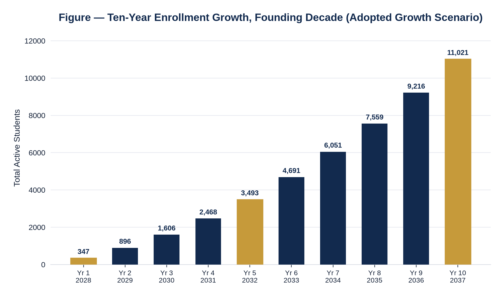
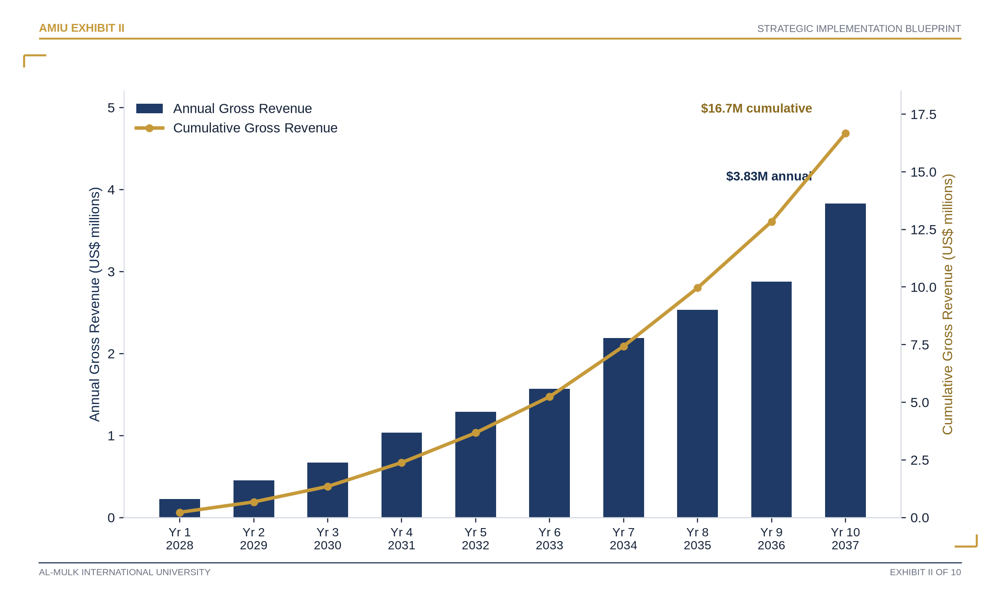
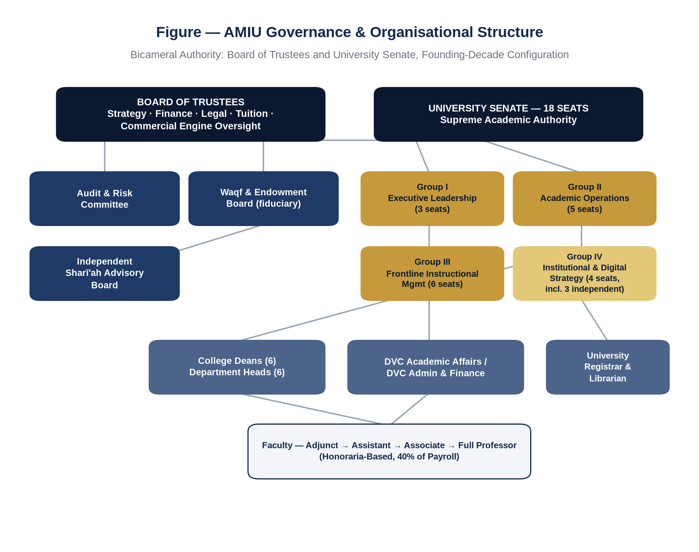
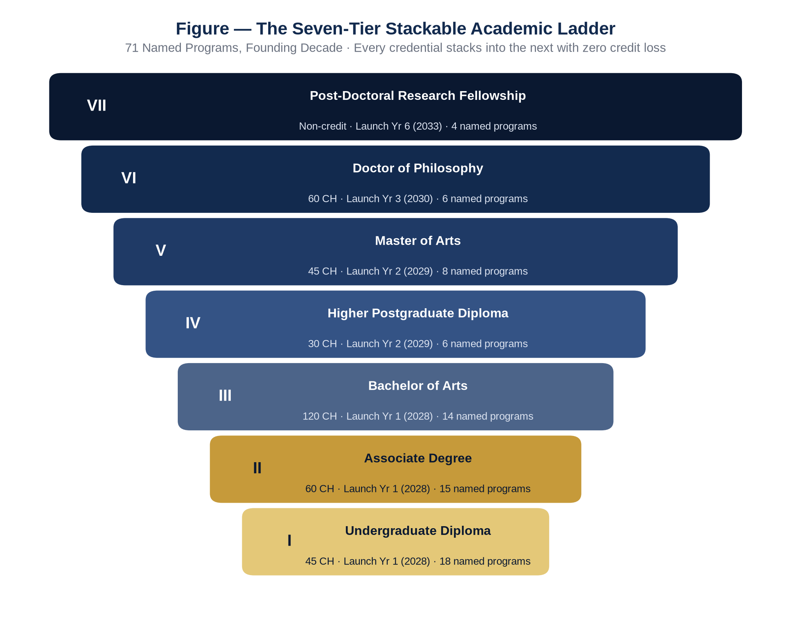
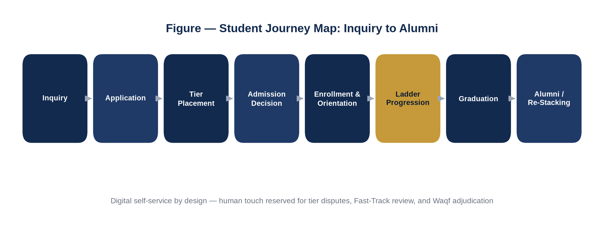
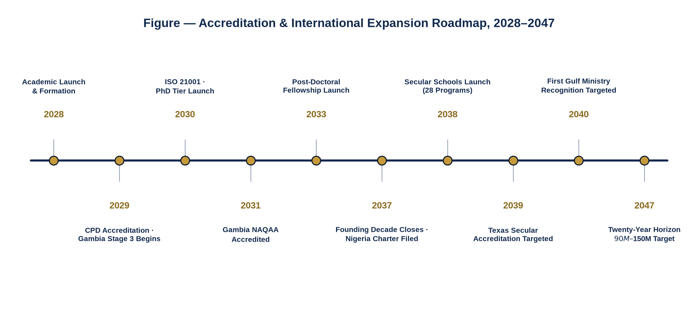
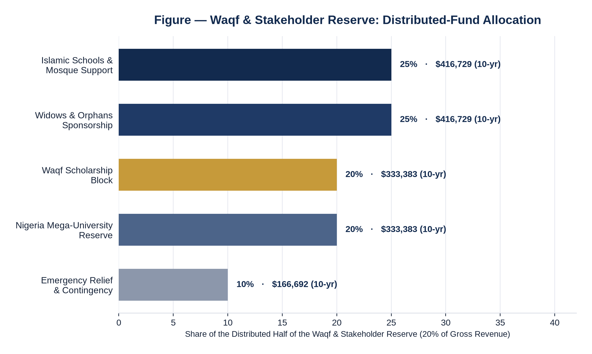
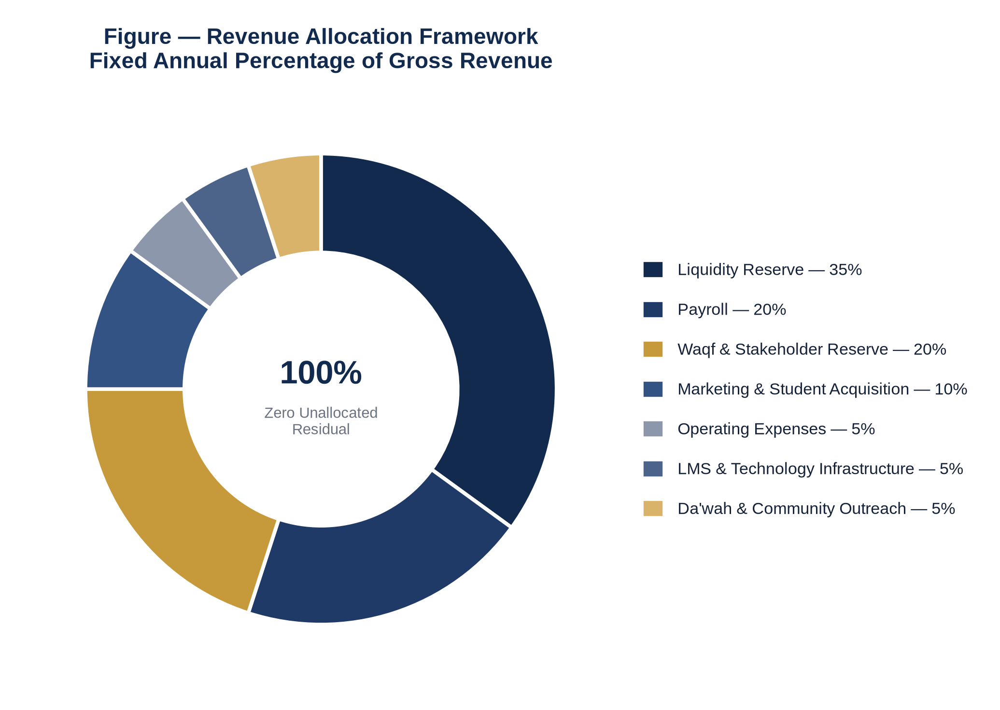
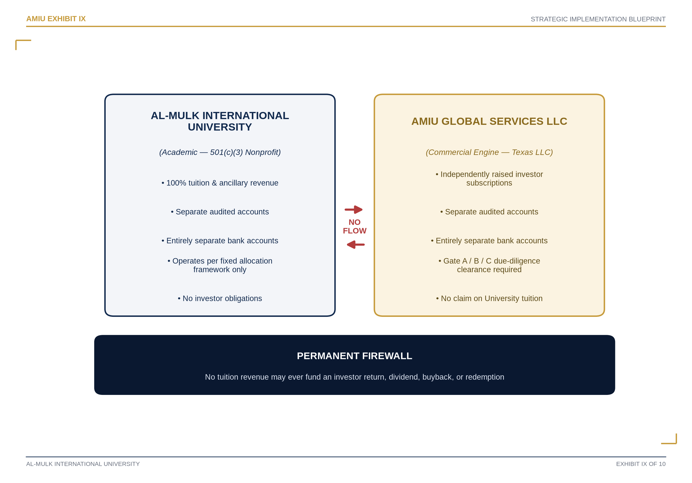
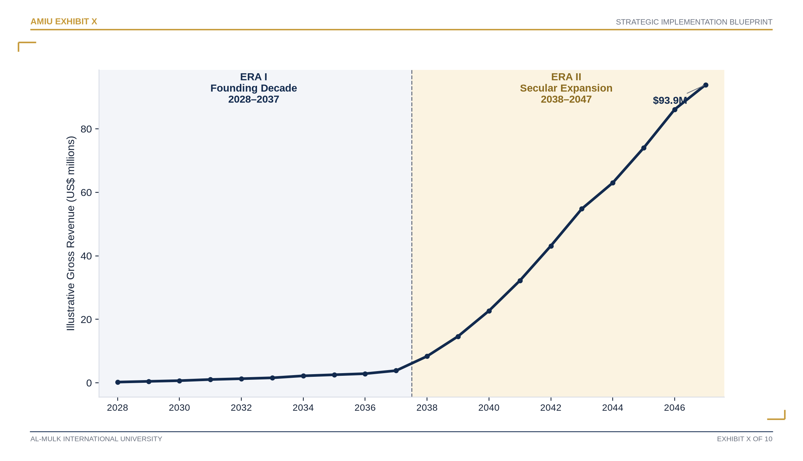

```{=openxml}
<w:tbl>
  <w:tblPr>
    <w:tblW w:w="9350" w:type="dxa"/>
    <w:tblBorders>
      <w:top w:val="single" w:sz="12" w:space="0" w:color="B08625"/>
      <w:left w:val="none" w:sz="0" w:space="0" w:color="auto"/>
      <w:bottom w:val="single" w:sz="12" w:space="0" w:color="B08625"/>
      <w:right w:val="none" w:sz="0" w:space="0" w:color="auto"/>
      <w:insideH w:val="none" w:sz="0" w:space="0" w:color="auto"/>
      <w:insideV w:val="none" w:sz="0" w:space="0" w:color="auto"/>
    </w:tblBorders>
  </w:tblPr>
  <w:tblGrid><w:gridCol w:w="9350"/></w:tblGrid>
  <w:tr>
    <w:trPr><w:trHeight w:val="13200" w:hRule="atLeast"/></w:trPr>
    <w:tc>
      <w:tcPr>
        <w:tcW w:w="9350" w:type="dxa"/>
        <w:shd w:val="clear" w:color="auto" w:fill="122A4E"/>
        <w:vAlign w:val="center"/>
      </w:tcPr>
      <w:p><w:pPr><w:jc w:val="center"/><w:spacing w:before="0" w:after="900"/></w:pPr>
        <w:r><w:rPr><w:rFonts w:ascii="Source Serif 4" w:hAnsi="Source Serif 4"/><w:i/><w:smallCaps/><w:color w:val="8C97AB"/><w:sz w:val="19"/><w:spacing w:val="16"/></w:rPr><w:t>Supreme Strategic Planning Council &#183; Founding-Decade Edition</w:t></w:r>
      </w:p>
      <w:p><w:pPr><w:jc w:val="center"/><w:spacing w:before="0" w:after="60"/></w:pPr>
        <w:r><w:rPr><w:rFonts w:ascii="Source Serif 4" w:hAnsi="Source Serif 4"/><w:b/><w:smallCaps/><w:color w:val="B08625"/><w:sz w:val="26"/><w:spacing w:val="12"/></w:rPr><w:t>Al-Mulk International University</w:t></w:r>
      </w:p>
      <w:p><w:pPr><w:jc w:val="center"/><w:spacing w:before="0" w:after="80"/></w:pPr>
        <w:r><w:rPr><w:rFonts w:ascii="Source Serif 4" w:hAnsi="Source Serif 4"/><w:i/><w:smallCaps/><w:color w:val="DCE3F0"/><w:sz w:val="21"/><w:spacing w:val="10"/></w:rPr><w:t>Strategic Implementation</w:t></w:r></w:p>
      <w:p><w:pPr><w:jc w:val="center"/><w:spacing w:before="0" w:after="200"/><w:pBdr><w:top w:val="single" w:sz="4" w:space="20" w:color="B08625"/><w:bottom w:val="single" w:sz="4" w:space="20" w:color="B08625"/></w:pBdr></w:pPr>
        <w:r><w:rPr><w:rFonts w:ascii="Fraunces Black" w:hAnsi="Fraunces Black"/><w:b/><w:color w:val="FFFFFF"/><w:sz w:val="76"/></w:rPr><w:t>BLUEPRINT</w:t></w:r></w:p>
      <w:p><w:pPr><w:jc w:val="center"/><w:spacing w:before="500" w:after="60"/></w:pPr>
        <w:r><w:rPr><w:rFonts w:ascii="Fraunces" w:hAnsi="Fraunces"/><w:i/><w:color w:val="DCE3F0"/><w:sz w:val="27"/></w:rPr><w:t>2028&#8211;2050</w:t></w:r></w:p>
      <w:p><w:pPr><w:jc w:val="center"/><w:spacing w:before="0" w:after="900"/></w:pPr>
        <w:r><w:rPr><w:rFonts w:ascii="Fraunces" w:hAnsi="Fraunces"/><w:i/><w:color w:val="8C97AB"/><w:sz w:val="19"/></w:rPr><w:t>&#8220;Spreading Islamic Education Worldwide, at Every Pace&#8221;</w:t></w:r>
      </w:p>
      <w:p><w:pPr><w:jc w:val="center"/><w:spacing w:before="0" w:after="60"/></w:pPr>
        <w:r><w:rPr><w:rFonts w:ascii="Source Serif 4" w:hAnsi="Source Serif 4"/><w:i/><w:smallCaps/><w:color w:val="8C97AB"/><w:sz w:val="17"/></w:rPr><w:t xml:space="preserve">Document Reference  </w:t></w:r><w:r><w:rPr><w:rFonts w:ascii="Source Serif 4" w:hAnsi="Source Serif 4"/><w:b/><w:smallCaps/><w:color w:val="B08625"/><w:sz w:val="17"/></w:rPr><w:t>AMIU-SB-002</w:t></w:r>
      </w:p>
      <w:p><w:pPr><w:jc w:val="center"/><w:spacing w:before="0" w:after="0"/></w:pPr>
        <w:r><w:rPr><w:rFonts w:ascii="Source Serif 4" w:hAnsi="Source Serif 4"/><w:i/><w:color w:val="8C97AB"/><w:sz w:val="15"/></w:rPr><w:t>edu.amiu.com  ·  Texas-Domiciled, Religiously Exempt  ·  Incorporated 6 December 2027</w:t></w:r>
      </w:p>
    </w:tc>
  </w:tr>
</w:tbl>
```

::: {custom-style="PartKicker"}
AMIU-SB-002
:::

# Strategic Implementation Blueprint {.unnumbered}

## 2028–2050 {.unnumbered}

```{=openxml}
<w:p><w:r><w:br w:type="page"/></w:r></w:p>
```

# Al-Mulk International University {.unnumbered}

## Strategic Implementation Blueprint 2028–2050 {.unnumbered}

### A Companion Implementation Volume to the Ten-Year Master Plan & Strategic Charter (AMIU-MP-001) {.unnumbered}

<br/>

**Prepared by the Supreme Strategic Planning Council**, convened across the Board of Trustees, the University Senate, the Executive Leadership Council, the Academic Excellence Council, the Global University Consulting Council, and the Premium Document Design Council.

**Document Reference:** AMIU-SB-002
**Series:** Founding-Decade Edition, Volume II
**Companion To:** AMIU-MP-001 — Ten-Year Master Plan & Strategic Charter (2028–2037)
**Prepared For:** Board of Trustees · University Senate · International Accreditation Bodies · Government & Ministry Partners · Institutional Donors & Waqf Contributors
**Status:** Institutional planning document for governance, accreditation, and partnership decision-making. Not a certified financial audit, actuarial forecast, or offer of investment.
**Publication Date:** Founding-Decade Edition, 2028
**Contact:** edu.amiu.com · info@edu.amiu.com
**Domicile:** Texas Nonprofit Corporation, 501(c)(3) Religiously Exempt · Incorporated 6 December 2027

```{=openxml}
<w:p><w:r><w:br w:type="page"/></w:r></w:p>
```

## Copyright & Publication Notice {.unnumbered}

© 2028 Al-Mulk International University. All rights reserved.

This Blueprint (AMIU-SB-002) and its companion Ten-Year Master Plan & Strategic Charter (AMIU-MP-001) are internal institutional planning instruments prepared for the Board of Trustees, the University Senate, prospective accreditation bodies, government and ministry partners, and institutional donors of Al-Mulk International University. No part of this publication may be reproduced, redistributed, or cited as an offer of securities, an investment prospectus, or a certified financial audit without the express written consent of the AMIU Board of Trustees.

All financial figures, enrollment projections, and revenue trajectories beyond the audited founding-decade baseline are explicitly labeled as illustrative, directional, and contingent on the accreditation and enrollment milestones described herein. Nothing in this document constitutes a guarantee of future financial performance, accreditation outcome, or regulatory approval in any jurisdiction, including but not limited to The Gambia, the Federal Republic of Nigeria, or any Gulf Cooperation Council member state.

The Al-Mulk International University name, wordmark, tagline "Spreading Islamic Education Worldwide, at Every Pace," and the seven-tier ISLAMIC values framework are institutional assets of Al-Mulk International University, filed for trademark protection under USPTO Class 41.

**Typesetting & Publication Design:** Prepared in-house by the AMIU Office of Institutional Planning, using the AMIU institutional style system — a three-role editorial type system (Fraunces display, Source Serif 4 reading, Archivo structural), navy/gold institutional palette.

**Document control:** AMIU-SB-002 · Version 1.0 · Founding-Decade Edition · Confidential — Institutional Planning Document

```{=openxml}
<w:p><w:r><w:br w:type="page"/></w:r></w:p>
```

::: {custom-style="PartThesis"}
In memory of every seeker of knowledge turned away for want of means —
:::

::: {custom-style="PartThesis"}
and in service of every seeker still to come.
:::

<br/>
<br/>

This Blueprint is dedicated to the founding cohort of 2028: the first 347 students who trusted a one-year-old institution with their education, and the first eighteen Senate seat-holders who trusted a fixed governance charter over their own discretion. Their record — audited, public, and unbroken — is the only foundation on which the twenty-three years that follow may credibly be built.

```{=openxml}
<w:p><w:r><w:br w:type="page"/></w:r></w:p>
```

## Endorsement & Approval {.unnumbered}

This Blueprint is presented for formal review, endorsement, and approval by Al-Mulk International University's founding governance bodies, in accordance with the constitutional provisions of the AMIU Constitution and consistent with the Delegation of Authority Matrix adopted in AMIU-MP-001 §11.3.

| Endorsing Authority | Role in Endorsement | Signature |
|---|---|---|
| Chairman, Board of Trustees | Approves institutional strategy and this Blueprint's financial and governance framework | _________________________ |
| President & Vice-Chancellor | Approves this Blueprint as the University's operative implementation instrument | _________________________ |
| Deputy Vice-Chancellor, Academic Affairs — Dr. Muhammad Al-Qumash | Endorses academic, curricular, and accreditation content | _________________________ |
| Deputy Vice-Chancellor, Admin & Finance — Dr. Abdullah Turki | Endorses financial, staffing, and budgetary content | _________________________ |
| Secretary, University Senate | Certifies Senate review of all academic-authority provisions | _________________________ |
| Chair, Waqf & Endowment Board | Endorses all Waqf allocation, scholarship, and endowment content | _________________________ |

*Endorsement of this Blueprint does not, by itself, amend any figure, seat, or percentage fixed in AMIU-MP-001. Any such amendment requires the specific governance pathway named in the relevant section.*

```{=openxml}
<w:p><w:r><w:br w:type="page"/></w:r></w:p>
```

## Publication Certification Statement {.unnumbered}

Prior to publication, this Blueprint underwent two structured, independent quality assurance reviews by the AMIU Office of Institutional Planning, with oversight from the Board Audit & Risk Committee (Section 36) and the University Senate. The second review was conducted as a fresh, adversarial re-read — auditors were not shown the first review's findings and were instructed to verify the document as though encountering it for the first time, rather than to confirm that earlier corrections held:

- **Structural integrity** — every Section-to-Part assignment, Section kicker label, figure and table numbering sequence, Table of Contents entry, and Index cross-reference was checked programmatically against the document's own numbering system across all forty-one sections, in both review rounds.
- **Financial consistency** — every dollar figure, percentage, and enrollment number cited in this Blueprint was checked against the canonical figures adopted in AMIU-MP-001, against every other citation of the same figure elsewhere in this Blueprint, and — in the second round — against the arithmetic each figure is supposed to satisfy (component breakdowns summing to their stated total, reconciliation statements checked by calculation rather than by reading).
- **Editorial review** — prose across the front matter, all forty-one sections, and the back matter was read in full, independently, in both rounds, for grammar, spelling, punctuation, capitalization consistency of institutional terms, and cross-reference accuracy.
- **Design consistency** — typography, running headers and footers, table styling, and page-level hierarchy are applied through a single shared style system rather than formatted page by page, so consistency is structural by construction; the second round specifically re-examined the front and back covers independently of the interior, and every page class (chapter openers, section openers, tables, captions, the Table of Contents) for hierarchy and layout defects the first round's narrower sampling could plausibly have missed.

The first review identified and corrected: several stale references to the document's section count following a later structural addition, dollar-figure rounding inconsistencies between sections discussing the same reserve line at different points, two internal cross-references that pointed to the wrong section, and a number of spelling-convention and capitalization inconsistencies. The second, independent review — deliberately re-examining decisions the first round had already made, rather than assuming them settled — found and corrected a further set of issues the first round had missed: a Table of Contents entry that hyphenated mid-word, an inconsistent header/footer treatment between the front and back covers, an arithmetic reconciliation in the Waqf & Stakeholder Reserve narrative that did not sum correctly, a certification-cost line item whose components did not add to its stated ceiling, three misordered Index entries, a governance-responsibility line that misattributed a University-funded activity to the Commercial Engine, one internally contradictory college-pairing assignment, one cross-reference to a faculty title that did not exist elsewhere in the document, and a further round of spelling-convention, terminology, and cross-reference corrections of the same kinds the first review addressed.

This statement certifies that both reviews described above were performed as described and that every issue either one identified was corrected before publication. It does not certify — and no review of a document this length can reasonably certify — the complete absence of any error whatsoever; a second independent pass finding issues the first missed is itself evidence that a third pass would likely do the same. A reader who identifies a further issue is asked to report it to info@edu.amiu.com for correction in the next revision.

**Certified for Executive Release** — AMIU Office of Institutional Planning, Founding-Decade Edition.

```{=openxml}
<w:p><w:r><w:br w:type="page"/></w:r></w:p>
```

## Foreword {.unnumbered}

::: {custom-style="MessageByline"}
By the Supreme Strategic Planning Council
:::

```{=openxml}
<w:p>
  <w:pPr>
    <w:framePr w:dropCap="drop" w:lines="3" w:wrap="around" w:vAnchor="text" w:hAnchor="text"/>
    <w:spacing w:before="0" w:after="0"/>
  </w:pPr>
  <w:r><w:rPr><w:rFonts w:ascii="Fraunces" w:hAnsi="Fraunces"/><w:b/><w:color w:val="B08625"/><w:sz w:val="88"/></w:rPr><w:t>A</w:t></w:r>
</w:p>
```
university's first document is usually a mission statement. Its second is usually a budget. Al-Mulk International University is unusual only in how seriously it has tried to make those two documents agree with each other — and this Blueprint exists because agreeing with each other once, at incorporation, is not the same as agreeing with each other for twenty-three years.

AMIU-MP-001, the founding Ten-Year Master Plan, did the hard arithmetic: a four-tier tuition structure that prices a degree in Lagos differently from a degree in Doha without pricing either student out of a serious education; a seven-category Revenue Allocation Framework that reconciles to the dollar in every year of every modeled scenario; a Waqf reserve that turns twenty percent of gross revenue into scholarships, mosque support, and a still-unbuilt university in Nigeria. What that Master Plan could not do — because no ten-year plan can — was specify how a Senate with eighteen fixed seats, under AMIU's bicameral governance, actually runs a faculty-recruitment cycle, or how an admissions office with an eleven-thousand-dollar annual budget actually processes a disputed country-tier claim, or what happens to twenty-eight new secular programs the day after they launch in 2038.

That is the work of this Blueprint. It is deliberately unglamorous in places — staffing tables, compliance calendars, a topical index — because an institution that promises "financial capacity shall never be a barrier to knowledge" owes its Board, its Senate, its accreditors, and its students more than a promise. It owes them a plan for the Tuesday after the promise is made.

We have tried, section by section, to hold two disciplines in tension without letting either win outright: the discipline of ambition, because a university that will not say what it hopes to become by 2050 has already decided to become nothing in particular; and the discipline of arithmetic, because every ambition in this Blueprint is priced against a revenue line AMIU has actually adopted, not a revenue line we wished it had. Where the two disciplines could not be reconciled — where an aspiration would have required inventing a budget line that does not exist — we have said so plainly and named the governance vote that would be required to create one.

We commend this Blueprint to the Board of Trustees, the University Senate, and every accreditation body, government partner, and donor who reads it next, in the hope that it reads less like a pitch and more like what it is: a working plan, written by people who expect to be held to it.

```{=openxml}
<w:p><w:r><w:br w:type="page"/></w:r></w:p>
```

## Founder's Message {.unnumbered}

```{=openxml}
<w:p>
  <w:pPr>
    <w:framePr w:dropCap="drop" w:lines="3" w:wrap="around" w:vAnchor="text" w:hAnchor="text"/>
    <w:spacing w:before="0" w:after="0"/>
  </w:pPr>
  <w:r><w:rPr><w:rFonts w:ascii="Fraunces" w:hAnsi="Fraunces"/><w:b/><w:color w:val="B08625"/><w:sz w:val="88"/></w:rPr><w:t>W</w:t></w:r>
</w:p>
```
hen we incorporated Al-Mulk International University on 6 December 2027, the entire institution consisted of a mission statement, a Texas filing fee of twenty-five dollars, and a conviction that had outlived every reason to abandon it: that a Muslim student's distance from a mosque, a border, or a bank account should never be the reason they never study Qur'ānic sciences, Sharī'ah, or Islamic finance at a serious, credentialed level.

I did not want to build a university that made that promise and then quietly broke it in the fine print — a scholarship program that ran out of money in year three, an accreditation timeline that slipped without explanation, a Board that paid itself first and the mission second. So the Master Plan we adopted fixed the arithmetic before we fixed anything else: twenty percent of every dollar of revenue to the Waqf, permanently; founder compensation that cannot be approved without the unanimous vote of four Senate seats no founder controls; a tuition-to-Commercial-Engine firewall that no future Board can quietly dissolve.

This Blueprint is the next layer of that same discipline, extended from ten years to twenty-three. It is not a rebrand of the Master Plan and not a wish list bolted onto it — it is the operating detail underneath the numbers we already committed to in public. I am proud that when this document needed a research strategy for a university with an eighteen-thousand-dollar founding-year faculty budget, it did not invent a research office we could not afford; it said, plainly, that mentored research rides inside existing Ph.D. honoraria until the day our own revenue says otherwise. That is the standard I want held against every page that follows, including the ones I have not yet written.

::: {custom-style="MessageByline"}
Ahmad Sulaimiy
:::

::: {custom-style="MessageByline"}
Founder & Vision Architect, Al-Mulk International University
:::

```{=openxml}
<w:p><w:r><w:br w:type="page"/></w:r></w:p>
```

## Chairman's Message {.unnumbered}

::: {custom-style="MessageByline"}
From the Chairman, Board of Trustees
:::

```{=openxml}
<w:p>
  <w:pPr>
    <w:framePr w:dropCap="drop" w:lines="3" w:wrap="around" w:vAnchor="text" w:hAnchor="text"/>
    <w:spacing w:before="0" w:after="0"/>
  </w:pPr>
  <w:r><w:rPr><w:rFonts w:ascii="Fraunces" w:hAnsi="Fraunces"/><w:b/><w:color w:val="B08625"/><w:sz w:val="88"/></w:rPr><w:t>T</w:t></w:r>
</w:p>
```
he Board of Trustees holds a narrow but consequential mandate under the AMIU Constitution: strategy, finance, legal compliance, tuition, and the permanent firewall between this University's tuition revenue and any commercial capital raised in its name. Reading this Blueprint as Chairman, I looked for one thing above all others — whether every page respected the boundary of that mandate, or quietly wandered into territory that belongs to the Senate, to the Waqf & Endowment Board, or to no one at all until a vote creates it.

It does. Forty-one sections, ten dimensions each, and not once does a budget figure appear that was not first traced to a percentage the Board itself adopted in AMIU-MP-001's Revenue Allocation Framework. Not once does a staffing table assume a Chief Officer role this institution's actual payroll could not fund in the year cited. That discipline is what makes this document usable by the Board rather than merely readable by it — we can hand it to an external auditor, a Gulf ministry official, or a prospective donor and stand behind every number in it, because every number already had to survive a governance vote before it reached this page.

The Board's endorsement of this Blueprint, recorded on the signature page preceding this message, is not a rubber stamp. It is a statement that the Trustees have reviewed the financial architecture extending our founding decade into a twenty-three-year horizon and found it consistent with the fiduciary obligations we accepted at incorporation.

::: {custom-style="MessageByline"}
Chairman, Board of Trustees
:::

```{=openxml}
<w:p><w:r><w:br w:type="page"/></w:r></w:p>
```

## President's Message {.unnumbered}

::: {custom-style="MessageByline"}
From the President & Vice-Chancellor
:::

```{=openxml}
<w:p>
  <w:pPr>
    <w:framePr w:dropCap="drop" w:lines="3" w:wrap="around" w:vAnchor="text" w:hAnchor="text"/>
    <w:spacing w:before="0" w:after="0"/>
  </w:pPr>
  <w:r><w:rPr><w:rFonts w:ascii="Fraunces" w:hAnsi="Fraunces"/><w:b/><w:color w:val="B08625"/><w:sz w:val="88"/></w:rPr><w:t>A</w:t></w:r>
</w:p>
```
President reads a document like this one differently than a Board or a founder does — I read it looking for the Tuesday-morning version of every ambition. Section 15 does not just say AMIU will recruit isnād-verified religious scholars from a global diaspora; it says who verifies the chain of transmission, which committee signs off, and what happens when a promising scholar cannot be reached except by WhatsApp across nine time zones. Section 33 does not just promise student support "without condition"; it admits, honestly, that our entire non-academic administrative budget in the founding decade is smaller than a single mid-sized university's parking-services line item, and designs a digital-first support model around that constraint rather than around a fantasy of it.

That honesty is, I think, this Blueprint's real contribution. Ambitious plans are common; ambitious plans that tell you exactly which of their promises are already funded and which ones are still waiting on a Board vote are not. As the officer who will answer for the gap between this document and what actually happens between 2028 and 2050, I would rather defend a plan that admits its own limits than one that hides them until an accreditor finds them for us.

I commend every Dean, Head of Department, and future colleague who will work inside these pages to read them not as instructions handed down, but as the record of what we have already promised each other — a promise this Blueprint intends to help us keep.

::: {custom-style="MessageByline"}
President & Vice-Chancellor, Al-Mulk International University
:::

```{=openxml}
<w:p><w:r><w:br w:type="page"/></w:r></w:p>
```

## Executive Summary {.unnumbered}

Al-Mulk International University (AMIU) is a Texas-domiciled, religiously-exempt 501(c)(3) nonprofit university, incorporated 6 December 2027, with academic operations commencing 1 January 2028. Its Ten-Year Master Plan & Strategic Charter (AMIU-MP-001) fixes the institution's founding-decade academic ladder (seven stackable tiers, seventy-one named programs across six colleges), its bicameral governance (an eighteen-seat University Senate holding supreme academic authority; a Board of Trustees holding supreme strategic, financial, and legal authority), and — most distinctively — a fixed, published Revenue Allocation Framework under which one hundred percent of Gross Revenue is distributed across seven categories every year, with zero unallocated residual and zero deficit in any year of any modeled scenario.

This Blueprint (AMIU-SB-002) does not amend that architecture. It operationalizes it, extending the founding decade's financial and governance discipline across a twenty-three-year arc — the Founding Decade (2028–2037), a Secular Expansion era (2038–2047) opening twenty-eight new secular programs across seven new schools, and a conservative Global Maturity horizon (2048–2050) — through forty-one sections spanning institutional vision, governance structure, academic architecture, digital infrastructure, financial strategy, regional expansion, risk management, and the founding access philosophy that grounds all of it.

**The founding-decade numbers, unchanged from AMIU-MP-001:** 347 active students and $224,747 in Gross Revenue in Year 1 (2028), growing to 11,021 students and $3,830,549 in Year 10 (2037); $16,669,190 cumulative ten-year revenue under the adopted Growth Scenario; a $5,834,215 ten-year cumulative Liquidity Reserve and a $3,333,838 ten-year cumulative Waqf & Stakeholder Reserve; zero deficit in any year, of any of the three modeled scenarios (Conservative, Expected, Growth).

**What this Blueprint adds is operating detail, not new commitments.** Where the Master Plan fixes *that* eighteen percent of Payroll funds Senate Stipends, this Blueprint specifies *how* Senate elections, terms, and succession actually run (Section 4). Where the Master Plan fixes *that* the Waqf Reserve funds a Nigeria Mega-University Reserve sub-line, this Blueprint specifies the feasibility-study-to-charter-application sequence that sub-line is meant to fund (Section 31). Every budget figure in every one of the forty-one sections traces to one of the seven fixed allocation percentages, a named Waqf sub-line, or an already-adopted certification-cost figure (ISO 21001, CPD, Gambia NAQAA) — never to an invented category.

**Four disciplines recur across all forty-one sections.** First, *proportionate staffing*: no section proposes a dedicated office, coordinator, or C-suite role earlier than the fiscal year in which the relevant allocation line could actually afford it — most dedicated non-honoraria functions do not appear before Year 6–10. Second, *sequencing discipline*: the accreditation roadmap (CPD Year 2, ISO 21001 Year 3, Gambia NAQAA Years 2–4, Nigeria NUC charter application Year 10, Texas secular accreditation Years 11–12, first Gulf ministry recognition Year 13) is never accelerated for narrative convenience. Third, *the capital firewall*: no section proposes any transaction in which University tuition revenue funds, guarantees, or de-risks the separately-capitalized Commercial Engine (AMIU Global Services LLC), or vice versa. Fourth, *honest contingency*: initiatives dependent on sovereign or third-party action outside AMIU's control — the Nigeria Mega-University charter, Gulf ministry recognition — are explicitly framed as funding targets, never guarantees, with delay scenarios that do not threaten institutional solvency.

**Illustrative twenty-year trajectory (Years 11–20, explicitly contingent, not adopted):** revenue growing from $8.36M in Year 11 (2038) to $93.9M in Year 20 (2047), within a directional $90M–$150M twenty-year institutional-economy target — figures that this Blueprint repeatedly labels as planning estimates subject to re-forecast, not as commitments comparable to the audited Founding Decade figures above.

This document is organized in eight parts — Governance & Institutional Foundations; Organizational & Academic Structure; Curriculum & Student Journey; Research, Publishing, Partnerships & Accreditation; Digital Infrastructure, AI & Waqf Development; Financial Growth, Marketing & Branding; Regional Campuses & Student Lifecycle; and Risk, Compliance, Sustainability & the 20-Year Roadmap — each addressing, section by section, rationale, global best practice, implementation phasing, staffing, budget, KPIs, risk, timeline, governance responsibility, and measurable success indicators. It closes with a consolidated year-by-year milestone table spanning 2028 to 2050, cross-referenced to every section that contributes to it.

```{=openxml}
<w:p><w:r><w:br w:type="page"/></w:r></w:p>
```

## AMIU at a Glance {.unnumbered}

*The founding-decade record, audited against the adopted Growth Scenario (AMIU-MP-001).*

```{=openxml}
<w:tbl>
  <w:tblPr>
    <w:tblW w:w="9350" w:type="dxa"/>
    <w:tblLayout w:type="fixed"/>
    <w:tblBorders>
      <w:top w:val="none" w:sz="0" w:space="0" w:color="auto"/>
      <w:left w:val="none" w:sz="0" w:space="0" w:color="auto"/>
      <w:bottom w:val="none" w:sz="0" w:space="0" w:color="auto"/>
      <w:right w:val="none" w:sz="0" w:space="0" w:color="auto"/>
    </w:tblBorders>
    <w:tblCellSpacing w:w="60" w:type="dxa"/>
  </w:tblPr>
  <w:tblGrid><w:gridCol w:w="4675"/><w:gridCol w:w="4675"/></w:tblGrid>
  <w:tr>
<w:tc>
      <w:tcPr>
        <w:tcW w:w="4675" w:type="dxa"/>
        <w:tcBorders>
          <w:top w:val="single" w:sz="16" w:space="0" w:color="B08625"/>
          <w:left w:val="single" w:sz="2" w:space="0" w:color="D8DCE5"/>
          <w:bottom w:val="single" w:sz="2" w:space="0" w:color="D8DCE5"/>
          <w:right w:val="single" w:sz="2" w:space="0" w:color="D8DCE5"/>
        </w:tcBorders>
        <w:shd w:val="clear" w:color="auto" w:fill="F6F7FA"/>
        <w:tcMar><w:top w:w="380" w:type="dxa"/><w:left w:w="380" w:type="dxa"/><w:bottom w:w="380" w:type="dxa"/><w:right w:w="380" w:type="dxa"/></w:tcMar>
        <w:vAlign w:val="center"/>
      </w:tcPr>
      <w:p><w:pPr><w:spacing w:before="0" w:after="90"/></w:pPr>
        <w:r><w:rPr><w:rFonts w:ascii="Fraunces Black" w:hAnsi="Fraunces Black"/><w:b/><w:color w:val="122A4E"/><w:sz w:val="52"/></w:rPr><w:t>11,021</w:t></w:r></w:p>
      <w:p><w:pPr><w:spacing w:before="0" w:after="0"/></w:pPr>
        <w:r><w:rPr><w:rFonts w:ascii="Archivo" w:hAnsi="Archivo"/><w:color w:val="5B6372"/><w:sz w:val="15"/><w:spacing w:val="8"/></w:rPr><w:t>ACTIVE STUDENTS BY YEAR 10 (2037)</w:t></w:r></w:p>
    </w:tc>
<w:tc>
      <w:tcPr>
        <w:tcW w:w="4675" w:type="dxa"/>
        <w:tcBorders>
          <w:top w:val="single" w:sz="16" w:space="0" w:color="B08625"/>
          <w:left w:val="single" w:sz="2" w:space="0" w:color="D8DCE5"/>
          <w:bottom w:val="single" w:sz="2" w:space="0" w:color="D8DCE5"/>
          <w:right w:val="single" w:sz="2" w:space="0" w:color="D8DCE5"/>
        </w:tcBorders>
        <w:shd w:val="clear" w:color="auto" w:fill="F6F7FA"/>
        <w:tcMar><w:top w:w="380" w:type="dxa"/><w:left w:w="380" w:type="dxa"/><w:bottom w:w="380" w:type="dxa"/><w:right w:w="380" w:type="dxa"/></w:tcMar>
        <w:vAlign w:val="center"/>
      </w:tcPr>
      <w:p><w:pPr><w:spacing w:before="0" w:after="90"/></w:pPr>
        <w:r><w:rPr><w:rFonts w:ascii="Fraunces Black" w:hAnsi="Fraunces Black"/><w:b/><w:color w:val="122A4E"/><w:sz w:val="52"/></w:rPr><w:t>$16.7M</w:t></w:r></w:p>
      <w:p><w:pPr><w:spacing w:before="0" w:after="0"/></w:pPr>
        <w:r><w:rPr><w:rFonts w:ascii="Archivo" w:hAnsi="Archivo"/><w:color w:val="5B6372"/><w:sz w:val="15"/><w:spacing w:val="8"/></w:rPr><w:t>TEN-YEAR CUMULATIVE GROSS REVENUE</w:t></w:r></w:p>
    </w:tc>
  </w:tr>
  <w:tr>
<w:tc>
      <w:tcPr>
        <w:tcW w:w="4675" w:type="dxa"/>
        <w:tcBorders>
          <w:top w:val="single" w:sz="16" w:space="0" w:color="B08625"/>
          <w:left w:val="single" w:sz="2" w:space="0" w:color="D8DCE5"/>
          <w:bottom w:val="single" w:sz="2" w:space="0" w:color="D8DCE5"/>
          <w:right w:val="single" w:sz="2" w:space="0" w:color="D8DCE5"/>
        </w:tcBorders>
        <w:shd w:val="clear" w:color="auto" w:fill="F6F7FA"/>
        <w:tcMar><w:top w:w="380" w:type="dxa"/><w:left w:w="380" w:type="dxa"/><w:bottom w:w="380" w:type="dxa"/><w:right w:w="380" w:type="dxa"/></w:tcMar>
        <w:vAlign w:val="center"/>
      </w:tcPr>
      <w:p><w:pPr><w:spacing w:before="0" w:after="90"/></w:pPr>
        <w:r><w:rPr><w:rFonts w:ascii="Fraunces Black" w:hAnsi="Fraunces Black"/><w:b/><w:color w:val="122A4E"/><w:sz w:val="52"/></w:rPr><w:t>$0</w:t></w:r></w:p>
      <w:p><w:pPr><w:spacing w:before="0" w:after="0"/></w:pPr>
        <w:r><w:rPr><w:rFonts w:ascii="Archivo" w:hAnsi="Archivo"/><w:color w:val="5B6372"/><w:sz w:val="15"/><w:spacing w:val="8"/></w:rPr><w:t>DEFICIT IN ANY YEAR, ANY SCENARIO</w:t></w:r></w:p>
    </w:tc>
<w:tc>
      <w:tcPr>
        <w:tcW w:w="4675" w:type="dxa"/>
        <w:tcBorders>
          <w:top w:val="single" w:sz="16" w:space="0" w:color="B08625"/>
          <w:left w:val="single" w:sz="2" w:space="0" w:color="D8DCE5"/>
          <w:bottom w:val="single" w:sz="2" w:space="0" w:color="D8DCE5"/>
          <w:right w:val="single" w:sz="2" w:space="0" w:color="D8DCE5"/>
        </w:tcBorders>
        <w:shd w:val="clear" w:color="auto" w:fill="F6F7FA"/>
        <w:tcMar><w:top w:w="380" w:type="dxa"/><w:left w:w="380" w:type="dxa"/><w:bottom w:w="380" w:type="dxa"/><w:right w:w="380" w:type="dxa"/></w:tcMar>
        <w:vAlign w:val="center"/>
      </w:tcPr>
      <w:p><w:pPr><w:spacing w:before="0" w:after="90"/></w:pPr>
        <w:r><w:rPr><w:rFonts w:ascii="Fraunces Black" w:hAnsi="Fraunces Black"/><w:b/><w:color w:val="122A4E"/><w:sz w:val="52"/></w:rPr><w:t>71</w:t></w:r></w:p>
      <w:p><w:pPr><w:spacing w:before="0" w:after="0"/></w:pPr>
        <w:r><w:rPr><w:rFonts w:ascii="Archivo" w:hAnsi="Archivo"/><w:color w:val="5B6372"/><w:sz w:val="15"/><w:spacing w:val="8"/></w:rPr><w:t>NAMED FOUNDING-DECADE PROGRAMS</w:t></w:r></w:p>
    </w:tc>
  </w:tr>
  <w:tr>
<w:tc>
      <w:tcPr>
        <w:tcW w:w="4675" w:type="dxa"/>
        <w:tcBorders>
          <w:top w:val="single" w:sz="16" w:space="0" w:color="B08625"/>
          <w:left w:val="single" w:sz="2" w:space="0" w:color="D8DCE5"/>
          <w:bottom w:val="single" w:sz="2" w:space="0" w:color="D8DCE5"/>
          <w:right w:val="single" w:sz="2" w:space="0" w:color="D8DCE5"/>
        </w:tcBorders>
        <w:shd w:val="clear" w:color="auto" w:fill="F6F7FA"/>
        <w:tcMar><w:top w:w="380" w:type="dxa"/><w:left w:w="380" w:type="dxa"/><w:bottom w:w="380" w:type="dxa"/><w:right w:w="380" w:type="dxa"/></w:tcMar>
        <w:vAlign w:val="center"/>
      </w:tcPr>
      <w:p><w:pPr><w:spacing w:before="0" w:after="90"/></w:pPr>
        <w:r><w:rPr><w:rFonts w:ascii="Fraunces Black" w:hAnsi="Fraunces Black"/><w:b/><w:color w:val="122A4E"/><w:sz w:val="52"/></w:rPr><w:t>$5.8M</w:t></w:r></w:p>
      <w:p><w:pPr><w:spacing w:before="0" w:after="0"/></w:pPr>
        <w:r><w:rPr><w:rFonts w:ascii="Archivo" w:hAnsi="Archivo"/><w:color w:val="5B6372"/><w:sz w:val="15"/><w:spacing w:val="8"/></w:rPr><w:t>TEN-YEAR LIQUIDITY RESERVE</w:t></w:r></w:p>
    </w:tc>
<w:tc>
      <w:tcPr>
        <w:tcW w:w="4675" w:type="dxa"/>
        <w:tcBorders>
          <w:top w:val="single" w:sz="16" w:space="0" w:color="B08625"/>
          <w:left w:val="single" w:sz="2" w:space="0" w:color="D8DCE5"/>
          <w:bottom w:val="single" w:sz="2" w:space="0" w:color="D8DCE5"/>
          <w:right w:val="single" w:sz="2" w:space="0" w:color="D8DCE5"/>
        </w:tcBorders>
        <w:shd w:val="clear" w:color="auto" w:fill="F6F7FA"/>
        <w:tcMar><w:top w:w="380" w:type="dxa"/><w:left w:w="380" w:type="dxa"/><w:bottom w:w="380" w:type="dxa"/><w:right w:w="380" w:type="dxa"/></w:tcMar>
        <w:vAlign w:val="center"/>
      </w:tcPr>
      <w:p><w:pPr><w:spacing w:before="0" w:after="90"/></w:pPr>
        <w:r><w:rPr><w:rFonts w:ascii="Fraunces Black" w:hAnsi="Fraunces Black"/><w:b/><w:color w:val="122A4E"/><w:sz w:val="52"/></w:rPr><w:t>$3.3M</w:t></w:r></w:p>
      <w:p><w:pPr><w:spacing w:before="0" w:after="0"/></w:pPr>
        <w:r><w:rPr><w:rFonts w:ascii="Archivo" w:hAnsi="Archivo"/><w:color w:val="5B6372"/><w:sz w:val="15"/><w:spacing w:val="8"/></w:rPr><w:t>TEN-YEAR WAQF &amp; STAKEHOLDER RESERVE</w:t></w:r></w:p>
    </w:tc>
  </w:tr>
  <w:tr>
<w:tc>
      <w:tcPr>
        <w:tcW w:w="4675" w:type="dxa"/>
        <w:tcBorders>
          <w:top w:val="single" w:sz="16" w:space="0" w:color="B08625"/>
          <w:left w:val="single" w:sz="2" w:space="0" w:color="D8DCE5"/>
          <w:bottom w:val="single" w:sz="2" w:space="0" w:color="D8DCE5"/>
          <w:right w:val="single" w:sz="2" w:space="0" w:color="D8DCE5"/>
        </w:tcBorders>
        <w:shd w:val="clear" w:color="auto" w:fill="F6F7FA"/>
        <w:tcMar><w:top w:w="380" w:type="dxa"/><w:left w:w="380" w:type="dxa"/><w:bottom w:w="380" w:type="dxa"/><w:right w:w="380" w:type="dxa"/></w:tcMar>
        <w:vAlign w:val="center"/>
      </w:tcPr>
      <w:p><w:pPr><w:spacing w:before="0" w:after="90"/></w:pPr>
        <w:r><w:rPr><w:rFonts w:ascii="Fraunces Black" w:hAnsi="Fraunces Black"/><w:b/><w:color w:val="122A4E"/><w:sz w:val="52"/></w:rPr><w:t>18</w:t></w:r></w:p>
      <w:p><w:pPr><w:spacing w:before="0" w:after="0"/></w:pPr>
        <w:r><w:rPr><w:rFonts w:ascii="Archivo" w:hAnsi="Archivo"/><w:color w:val="5B6372"/><w:sz w:val="15"/><w:spacing w:val="8"/></w:rPr><w:t>FIXED SENATE SEATS, UNALTERED SINCE INCORPORATION</w:t></w:r></w:p>
    </w:tc>
<w:tc>
      <w:tcPr>
        <w:tcW w:w="4675" w:type="dxa"/>
        <w:tcBorders>
          <w:top w:val="single" w:sz="16" w:space="0" w:color="B08625"/>
          <w:left w:val="single" w:sz="2" w:space="0" w:color="D8DCE5"/>
          <w:bottom w:val="single" w:sz="2" w:space="0" w:color="D8DCE5"/>
          <w:right w:val="single" w:sz="2" w:space="0" w:color="D8DCE5"/>
        </w:tcBorders>
        <w:shd w:val="clear" w:color="auto" w:fill="F6F7FA"/>
        <w:tcMar><w:top w:w="380" w:type="dxa"/><w:left w:w="380" w:type="dxa"/><w:bottom w:w="380" w:type="dxa"/><w:right w:w="380" w:type="dxa"/></w:tcMar>
        <w:vAlign w:val="center"/>
      </w:tcPr>
      <w:p><w:pPr><w:spacing w:before="0" w:after="90"/></w:pPr>
        <w:r><w:rPr><w:rFonts w:ascii="Fraunces Black" w:hAnsi="Fraunces Black"/><w:b/><w:color w:val="122A4E"/><w:sz w:val="52"/></w:rPr><w:t>$90&#8211;150M</w:t></w:r></w:p>
      <w:p><w:pPr><w:spacing w:before="0" w:after="0"/></w:pPr>
        <w:r><w:rPr><w:rFonts w:ascii="Archivo" w:hAnsi="Archivo"/><w:color w:val="5B6372"/><w:sz w:val="15"/><w:spacing w:val="8"/></w:rPr><w:t>DIRECTIONAL TWENTY-YEAR REVENUE TARGET (2047)</w:t></w:r></w:p>
    </w:tc>
  </w:tr>
</w:tbl>
```

*Figures reflect the adopted Growth Scenario. Years 11–20 are explicitly directional planning estimates — see Section 1 and Section 40.*

```{=openxml}
<w:p><w:r><w:br w:type="page"/></w:r></w:p>
<w:tbl>
  <w:tblPr>
    <w:tblW w:w="9350" w:type="dxa"/>
    <w:tblBorders>
      <w:top w:val="single" w:sz="10" w:space="0" w:color="B08625"/>
      <w:bottom w:val="single" w:sz="10" w:space="0" w:color="B08625"/>
    </w:tblBorders>
  </w:tblPr>
  <w:tblGrid><w:gridCol w:w="9350"/></w:tblGrid>
  <w:tr>
    <w:trPr><w:trHeight w:val="8600" w:hRule="atLeast"/><w:cantSplit/></w:trPr>
    <w:tc>
      <w:tcPr>
        <w:tcW w:w="9350" w:type="dxa"/>
        <w:shd w:val="clear" w:color="auto" w:fill="122A4E"/>
        <w:tcMar><w:top w:w="500" w:type="dxa"/><w:left w:w="900" w:type="dxa"/><w:bottom w:w="500" w:type="dxa"/><w:right w:w="900" w:type="dxa"/></w:tcMar>
        <w:vAlign w:val="center"/>
      </w:tcPr>
      <w:p><w:pPr><w:jc w:val="center"/><w:spacing w:before="0" w:after="260"/></w:pPr>
        <w:r><w:rPr><w:rFonts w:ascii="Fraunces" w:hAnsi="Fraunces"/><w:color w:val="B08625"/><w:sz w:val="64"/></w:rPr><w:t>&#8220;</w:t></w:r>
      </w:p>
      <w:p><w:pPr><w:jc w:val="center"/><w:spacing w:before="0" w:after="320"/></w:pPr>
        <w:r><w:rPr><w:rFonts w:ascii="Fraunces" w:hAnsi="Fraunces"/><w:i/><w:color w:val="FFFFFF"/><w:sz w:val="34"/></w:rPr><w:t>Financial capacity shall never be a barrier to knowledge.</w:t></w:r>
      </w:p>
      <w:p><w:pPr><w:jc w:val="center"/><w:spacing w:before="0" w:after="0"/></w:pPr>
        <w:r><w:rPr><w:rFonts w:ascii="Source Serif 4" w:hAnsi="Source Serif 4"/><w:i/><w:smallCaps/><w:color w:val="B08625"/><w:b/><w:sz w:val="18"/><w:spacing w:val="10"/></w:rPr><w:t>AMIU Mission Principle · AMIU-MP-001 § 3</w:t></w:r>
      </w:p>
    </w:tc>
  </w:tr>
</w:tbl>
```


```{=openxml}
<w:p><w:r><w:br w:type="page"/></w:r></w:p>
```


## Table of Contents {.unnumbered}

| | |
|---|---:|
| **Foreword** | **10** |
| **Founder's Message** | **12** |
| **Chairman's Message** | **13** |
| **President's Message** | **14** |
| **Executive Summary** | **15** |
| **AMIU at a Glance** | **17** |
| **List of Figures** | **25** |
| **List of Charts** | **26** |
| **List of Diagrams** | **27** |
| **List of Flowcharts** | **27** |
| **List of Tables** | **28** |
| **List of Abbreviations** | **32** |
| **Glossary** | **36** |
| **Part I — Governance & Institutional Foundations** | **43** |
| &nbsp;&nbsp;&nbsp;&nbsp;Section 1: Institutional Vision | 44 |
| &nbsp;&nbsp;&nbsp;&nbsp;Section 2: Mission, Values, and Identity | 48 |
| &nbsp;&nbsp;&nbsp;&nbsp;Section 3: Governance Framework | 51 |
| &nbsp;&nbsp;&nbsp;&nbsp;Section 4: Senate Structure | 55 |
| &nbsp;&nbsp;&nbsp;&nbsp;Section 5: Board Structure | 59 |
| **Part II — Organizational & Academic Structure** | **64** |
| &nbsp;&nbsp;&nbsp;&nbsp;Section 6: Organizational Chart | 65 |
| &nbsp;&nbsp;&nbsp;&nbsp;Section 7: Academic Master Plan | 69 |
| &nbsp;&nbsp;&nbsp;&nbsp;Section 8: College Structure | 73 |
| &nbsp;&nbsp;&nbsp;&nbsp;Section 9: Faculty Structure | 76 |
| &nbsp;&nbsp;&nbsp;&nbsp;Section 10: Department Structure | 80 |
| **Part III — Curriculum & Student Journey** | **84** |
| &nbsp;&nbsp;&nbsp;&nbsp;Section 11: Program Portfolio | 85 |
| &nbsp;&nbsp;&nbsp;&nbsp;Section 12: Curriculum Architecture | 88 |
| &nbsp;&nbsp;&nbsp;&nbsp;Section 13: Student Journey Map | 93 |
| &nbsp;&nbsp;&nbsp;&nbsp;Section 14: Admission Policies | 97 |
| &nbsp;&nbsp;&nbsp;&nbsp;Section 15: Faculty Recruitment Strategy | 101 |
| **Part IV — Research, Publishing, Partnerships & Accreditation** | **106** |
| &nbsp;&nbsp;&nbsp;&nbsp;Section 16: Research Strategy | 107 |
| &nbsp;&nbsp;&nbsp;&nbsp;Section 17: Publishing Strategy | 110 |
| &nbsp;&nbsp;&nbsp;&nbsp;Section 18: Global Partnerships Strategy | 113 |
| &nbsp;&nbsp;&nbsp;&nbsp;Section 19: Accreditation Roadmap | 117 |
| &nbsp;&nbsp;&nbsp;&nbsp;Section 20: ISO 21001 Roadmap | 120 |
| **Part V — Digital Infrastructure, AI & Waqf Development** | **126** |
| &nbsp;&nbsp;&nbsp;&nbsp;Section 21: LMS Ecosystem | 127 |
| &nbsp;&nbsp;&nbsp;&nbsp;Section 22: AI Strategy | 130 |
| &nbsp;&nbsp;&nbsp;&nbsp;Section 23: Digital Transformation Strategy | 133 |
| &nbsp;&nbsp;&nbsp;&nbsp;Section 24: Library Strategy | 136 |
| &nbsp;&nbsp;&nbsp;&nbsp;Section 25: Waqf Development Strategy | 139 |
| **Part VI — Financial Growth, Marketing & Branding** | **145** |
| &nbsp;&nbsp;&nbsp;&nbsp;Section 26: Scholarship Strategy | 146 |
| &nbsp;&nbsp;&nbsp;&nbsp;Section 27: Revenue Diversification Strategy | 149 |
| &nbsp;&nbsp;&nbsp;&nbsp;Section 28: Marketing Strategy | 152 |
| &nbsp;&nbsp;&nbsp;&nbsp;Section 29: Branding Strategy | 155 |
| &nbsp;&nbsp;&nbsp;&nbsp;Section 30: International Expansion Strategy | 158 |
| **Part VII — Regional Campuses & Student Lifecycle** | **162** |
| &nbsp;&nbsp;&nbsp;&nbsp;Section 31: Nigeria Campus Strategy | 163 |
| &nbsp;&nbsp;&nbsp;&nbsp;Section 32: Gulf Cooperation Strategy | 166 |
| &nbsp;&nbsp;&nbsp;&nbsp;Section 33: Student Support Framework | 169 |
| &nbsp;&nbsp;&nbsp;&nbsp;Section 34: Alumni Framework | 172 |
| &nbsp;&nbsp;&nbsp;&nbsp;Section 35: Career Development Framework | 175 |
| **Part VIII — Risk, Compliance, Sustainability & the 20-Year Roadmap** | **179** |
| &nbsp;&nbsp;&nbsp;&nbsp;Section 36: Risk Management Framework | 180 |
| &nbsp;&nbsp;&nbsp;&nbsp;Section 37: Compliance Framework | 185 |
| &nbsp;&nbsp;&nbsp;&nbsp;Section 38: Financial Sustainability Framework | 191 |
| &nbsp;&nbsp;&nbsp;&nbsp;Section 39: Capital Development Framework | 196 |
| &nbsp;&nbsp;&nbsp;&nbsp;Section 40: Twenty-Year Strategic Roadmap | 203 |
| &nbsp;&nbsp;&nbsp;&nbsp;Section 41: Founding Access & Waqf-First Strategy | 210 |
| **Appendix A — Cross-Reference to the Ten-Year Master Plan (AMIU-MP-001)** | **221** |
| **Appendix B — Master Plan Exhibit Checklist** | **223** |
| **Appendix C — Fixed Revenue Allocation Framework: Quick Reference** | **224** |
| **Appendix D — Program Catalog Reference** | **225** |
| **References** | **229** |
| **Index** | **229** |

```{=openxml}
<w:p><w:r><w:br w:type="page"/></w:r></w:p>
```


## List of Figures {.unnumbered}

| Figure | Title | Section |
|---|---|---|
| Figure 1 | Ten-Year Enrollment Growth, Founding Decade (Adopted Growth Scenario) | Section 1 |
| Figure 2 | Ten-Year Gross Revenue Trajectory, Founding Decade (2028–2037) | Section 1 |
| Figure 3 | AMIU Governance & Organizational Structure | Section 6 |
| Figure 4 | The Seven-Tier Stackable Academic Ladder | Section 7 |
| Figure 5 | Student Journey Map: Inquiry to Alumni | Section 13 |
| Figure 6 | Accreditation & International Expansion Roadmap, 2028–2047 | Section 19 |
| Figure 7 | Waqf & Stakeholder Reserve: Distributed-Fund Allocation | Section 25 |
| Figure 8 | Revenue Allocation Framework — Fixed Annual Percentage of Gross Revenue | Section 38 |
| Figure 9 | Capital Architecture: The Tuition Firewall | Section 39 |
| Figure 10 | Twenty-Year Illustrative Revenue Trajectory, 2028–2047 | Section 40 |


## List of Charts {.unnumbered}

*Data visualizations presenting quantitative institutional figures.*

| Figure | Title | Section |
|---|---|---|
| Figure 1 | Ten-Year Enrollment Growth, Founding Decade (Adopted Growth Scenario) | Section 1 |
| Figure 2 | Ten-Year Gross Revenue Trajectory, Founding Decade (2028–2037) | Section 1 |
| Figure 7 | Waqf & Stakeholder Reserve: Distributed-Fund Allocation | Section 25 |
| Figure 8 | Revenue Allocation Framework — Fixed Annual Percentage of Gross Revenue | Section 38 |
| Figure 10 | Twenty-Year Illustrative Revenue Trajectory, 2028–2047 | Section 40 |


## List of Diagrams {.unnumbered}

*Structural diagrams presenting institutional architecture.*

| Figure | Title | Section |
|---|---|---|
| Figure 3 | AMIU Governance & Organizational Structure | Section 6 |
| Figure 4 | The Seven-Tier Stackable Academic Ladder | Section 7 |
| Figure 9 | Capital Architecture: The Tuition Firewall | Section 39 |


## List of Flowcharts {.unnumbered}

*Process flows presenting sequenced institutional activity.*

| Figure | Title | Section |
|---|---|---|
| Figure 5 | Student Journey Map: Inquiry to Alumni | Section 13 |
| Figure 6 | Accreditation & International Expansion Roadmap, 2028–2047 | Section 19 |


## List of Tables {.unnumbered}

This Blueprint contains 101 tables across its forty-one sections. The thirty tables below carry distinctive institutional content — structures, registers, and named schedules — and are indexed individually. Recurring structural tables that appear once per section under a standard heading (*Implementation Phases*, *Staffing Requirements*, *Annual Budget*, *Risks & Mitigation*, *Governance Responsibilities*) are not indexed separately here for readability; they follow the same ten-dimension structure in every section and are reachable directly from the Table of Contents.

| Table | Title | Section |
|---|---|---|
| Table 1 | Values-to-Practice Mapping | Section 2 |
| Table 2 | Committee Structure Beneath the Two Chambers | Section 3 |
| Table 3 | Annual Governance Calendar | Section 3 |
| Table 4 | The 18-Seat Structure (Canon, Unaltered) | Section 4 |
| Table 5 | Quorum and Voting Thresholds | Section 4 |
| Table 6 | Board Composition (Advisory/Committee Roles Under the Board) | Section 5 |
| Table 7 | Staffing, Budget, KPIs | Section 6 |
| Table 8 | Rollout Phases (Target Years) | Section 7 |
| Table 9 | The Six Founding Colleges (Year 1 Leadership, per Senate Group II) | Section 8 |
| Table 10 | Year-11+ Secular Schools | Section 8 |
| Table 11 | Ranks & Titles | Section 9 |
| Table 12 | The Six Founding Departments (Group III, Year 1) | Section 10 |
| Table 13 | Department-Level Budget & Staffing by Phase | Section 10 |
| Table 14 | Curriculum Composition by Tier | Section 12 |
| Table 15 | Journey Stages & Touchpoints | Section 13 |
| Table 16 | Eligibility by Tier | Section 14 |
| Table 17 | Admission Cycles | Section 14 |
| Table 18 | Sourcing (Faculty Recruitment Channels) | Section 15 |
| Table 19 | Full Accreditation Timeline | Section 19 |
| Table 20 | AI Use Cases & Sharī'ah Gate | Section 22 |
| Table 21 | Core Digital Stack Components & Phasing | Section 23 |
| Table 22 | Waqf & Stakeholder Reserve — Fixed Mechanics | Section 25 |
| Table 23 | Scholarship Architecture (Five Standing Instruments) | Section 26 |
| Table 24 | Legitimate Revenue Diversification Avenues | Section 27 |
| Table 25 | Country-Tier Messaging & Channels | Section 28 |
| Table 26 | Sequenced Geography (Exact Canon Sequence) | Section 30 |
| Table 27 | Risk Register — 14 Adopted Risks (from AMIU-MP-001) | Section 36 |
| Table 28 | Annual Compliance Calendar (Steady-State, Recurring) | Section 37 |
| Table 29 | Capital Projects and Their Funding Sources | Section 39 |
| Table 30 | Consolidated Milestone Table, 2028–2050 | Section 40 |


```{=openxml}
<w:p><w:r><w:br w:type="page"/></w:r></w:p>
```


## List of Abbreviations {.unnumbered}

| Abbreviation | Meaning |
|---|---|
| AMIU | Al-Mulk International University |
| AGB | Association of Governing Boards (nonprofit/university governance standards) |
| AI | Artificial Intelligence |
| API | Application Programming Interface |
| ASSC | Admissions & Student Success Committee |
| BA | Bachelor of Arts |
| CAC | Curriculum & Assessment Committee (AMIU); also Corporate Affairs Commission (Nigeria, Section 31 context) |
| CEFR | Common European Framework of Reference for Languages |
| CH | Credit Hour(s) |
| COSO | Committee of Sponsoring Organizations of the Treadway Commission (Enterprise Risk Management framework) |
| CPD | Continuing Professional Development (accreditation) |
| CRM | Customer/Constituent Relationship Management |
| DOAJ | Directory of Open Access Journals |
| DOI | Digital Object Identifier |
| DVC | Deputy Vice-Chancellor |
| EIN | Employer Identification Number (US) |
| EMI | English-Medium Instruction |
| EOMS | Educational Organizations Management System(s) (ISO 21001 scope) |
| ERM | Enterprise Risk Management |
| FACC | Faculty Affairs & Credentialing Committee |
| FTE | Full-Time Equivalent (staffing measure) |
| FX | Foreign Exchange (currency) |
| GCC | Gulf Cooperation Council |
| GDPR | General Data Protection Regulation (EU; used here as a compliance benchmark) |
| HoD | Head of Department |
| IAF | International Accreditation Forum |
| ILO | Institutional Learning Outcome |
| INQAAHE | International Network for Quality Assurance Agencies in Higher Education |
| IRS | Internal Revenue Service (United States) |
| ISO | International Organization for Standardization |
| KOR | Kernel Outturn Ratio (cashew-export quality metric, Commercial Engine Gate A) |
| KPI | Key Performance Indicator |
| LLB | Bachelor of Laws |
| LLC | Limited Liability Company |
| LLM | Master of Laws |
| LMS | Learning Management System |
| LTI | Learning Tools Interoperability (LMS integration standard) |
| MA | Master of Arts |
| MBA | Master of Business Administration |
| MFA | Multi-Factor Authentication |
| MOU | Memorandum of Understanding |
| MPH | Master of Public Health |
| NAQAA | National Accreditation and Quality Assurance Authority (The Gambia) |
| NUC | National Universities Commission (Nigeria) |
| OCR | Optical Character Recognition |
| OJS | Open Journal Systems (open-access publishing platform) |
| OpEx | Operating Expenses |
| PCI-DSS | Payment Card Industry Data Security Standard |
| Ph.D. | Doctor of Philosophy |
| PGD | Postgraduate Diploma |
| PLO | Program Learning Outcome |
| PPC | Program Portfolio Committee |
| PWA | Progressive Web Application |
| RAG | Retrieval-Augmented Generation (AI architecture) |
| SACSCOC | Southern Association of Colleges and Schools Commission on Colleges (illustrative US regional accreditor reference) |
| SCORM | Sharable Content Object Reference Model (e-learning content standard) |
| SIS | Student Information System |
| SOP | Standard Operating Procedure |
| SSL | Secure Sockets Layer |
| TOC | Table of Contents |
| TWC | Texas Workforce Commission |
| USPTO | United States Patent and Trademark Office |
| xAPI | Experience API (e-learning data-tracking standard) |

## Glossary {.unnumbered}

*Islamic-studies terminology is presented with standard transliteration; institutional terms are presented as used throughout this Blueprint. Where a term is defined operationally in the Master Plan (AMIU-MP-001), that definition governs.*

| Term | Definition |
|---|---|
| Aqeedah | Islamic theology and creed; the study of foundational Islamic belief. |
| Waqf | An Islamic endowment: an asset or revenue stream permanently dedicated to a charitable or religious purpose, with its corpus preserved and only its yield (or a defined distribution share) spent. |
| Sadaqah Jāriyah | "Ongoing charity" — a voluntary Islamic gift structured to provide continuing benefit (e.g., a named scholarship or endowment fund) beyond the moment of giving. |
| Isnād | The chain of transmission by which a piece of religious knowledge (e.g., a hadith, or a scholar's authority to teach) is traced back, narrator by narrator, to its original source. |
| Ijāza | A certificate or license traditionally granted by a qualified scholar authorizing a student to transmit a specific text or body of knowledge, evidencing an unbroken isnād. |
| Sanad | Used in this Blueprint as shorthand for the broader discipline of chain-of-transmission verification and authenticity certification; also one of the seven ISLAMIC core values. |
| Fiqh | Islamic jurisprudence — the human scholarly effort to derive practical legal rulings from the Qur'ān and Sunnah. |
| Uṣūl al-Fiqh | The methodology and theoretical principles underlying the derivation of Islamic legal rulings (the "roots of jurisprudence"). |
| Sharī'ah | The body of Islamic religious law derived from the Qur'ān and the Sunnah (Prophetic tradition). |
| Tafsīr | The scholarly discipline of Qur'ānic exegesis and interpretation. |
| Tajweed | The set of rules governing the correct phonetic pronunciation and recitation of the Qur'ān. |
| Qirā'āt | The canonical variant modes/readings of Qur'ānic recitation. |
| Hifz | The memorization of the Qur'ān in its entirety. |
| Hadith | A recorded saying, action, or approval attributed to the Prophet Muhammad ﷺ, transmitted via an isnād. |
| Da'wah | The act of inviting or calling others to Islam, or to a deeper practice of it, through education, communication, and example. |
| Madhhab (pl. madhāhib) | A school of Islamic jurisprudence; AMIU recruits faculty across the four major Sunni madhāhib (Ḥanafī, Mālikī, Shāfiʿī, Ḥanbalī). |
| Zakāt | The obligatory Islamic almsgiving levied on qualifying wealth, distinct from but administratively related to Waqf and Sadaqah in Islamic finance. |
| Seerah | The biographical study of the life of the Prophet Muhammad ﷺ. |
| Akhlāq | Islamic ethics; the study and cultivation of moral character. |
| ISLAMIC Framework | AMIU's seven-value institutional framework: Illumination, Sanad, Love, Access, Morality, Inquiry, Calling — see Section 2. |
| Waqf & Stakeholder Reserve | The fixed 20%-of-Gross-Revenue allocation category funding scholarships, mosque/school support, the Nigeria Mega-University Reserve, and emergency relief (AMIU-MP-001 §6). |
| Liquidity Reserve | The fixed 35%-of-Gross-Revenue allocation category funding institutional resilience, expansion, and accreditation costs (AMIU-MP-001 §5.7). |
| AMIU Strategic Business Reserve | The retained (non-distributed) half of the Waqf & Stakeholder Reserve, held in Sharī'ah-compliant investment instruments only. |
| Capital Firewall | The permanent, non-negotiable structural separation between AMIU's tuition-funded academic operations and AMIU Global Services LLC's independently-capitalized Commercial Engine (AMIU-MP-001 §7). |
| Commercial Engine | AMIU Global Services LLC — the University's legally and financially separate, investor-capitalized commercial affiliate. |
| Fast-Track | AMIU's institution-wide, no-additional-fee right allowing any student who demonstrates mastery to accelerate through the credential ladder. |
| Tier 1–4 (Tuition Tiers) | AMIU's four purchasing-power-adjusted global tuition tiers, from "Very Developed — Premium Rate" (Tier 1) to "Underdeveloped/Conflict-Affected — Sponsored Rate" (Tier 4). |
| Stackable Credential | A credential explicitly designed so its completed credit hours carry forward with zero loss into the next tier of the seven-tier academic ladder. |


```{=openxml}
<w:p><w:r><w:br w:type="page"/></w:r></w:p>
```


# Main Contents {.unnumbered}


```{=openxml}
<w:p><w:r><w:br w:type="page"/></w:r></w:p>
<w:tbl>
  <w:tblPr>
    <w:tblW w:w="9350" w:type="dxa"/>
    <w:tblBorders>
      <w:top w:val="single" w:sz="10" w:space="0" w:color="B08625"/>
      <w:bottom w:val="single" w:sz="10" w:space="0" w:color="B08625"/>
    </w:tblBorders>
  </w:tblPr>
  <w:tblGrid><w:gridCol w:w="9350"/></w:tblGrid>
  <w:tr>
    <w:trPr><w:trHeight w:val="12200" w:hRule="atLeast"/><w:cantSplit/></w:trPr>
    <w:tc>
      <w:tcPr>
        <w:tcW w:w="9350" w:type="dxa"/>
        <w:shd w:val="clear" w:color="auto" w:fill="122A4E"/>
        <w:tcMar><w:top w:w="620" w:type="dxa"/><w:left w:w="620" w:type="dxa"/><w:bottom w:w="620" w:type="dxa"/><w:right w:w="620" w:type="dxa"/></w:tcMar>
        <w:vAlign w:val="center"/>
      </w:tcPr>
<w:p><w:pPr><w:spacing w:before="0" w:after="120"/></w:pPr>
      <w:r><w:rPr><w:rFonts w:ascii="Source Serif 4" w:hAnsi="Source Serif 4"/><w:i/><w:smallCaps/><w:color w:val="8C97AB"/><w:sz w:val="19"/><w:spacing w:val="14"/></w:rPr><w:t>Part One of Eight</w:t></w:r></w:p>
<w:p><w:pPr><w:spacing w:before="0" w:after="60"/></w:pPr>
      <w:r><w:rPr><w:rFonts w:ascii="Fraunces Black" w:hAnsi="Fraunces Black"/><w:color w:val="B08625"/><w:b/><w:sz w:val="108"/></w:rPr><w:t>I</w:t></w:r></w:p>
<w:p><w:pPr><w:spacing w:before="120" w:after="80"/></w:pPr>
      <w:r><w:rPr><w:rFonts w:ascii="Fraunces" w:hAnsi="Fraunces"/><w:color w:val="FFFFFF"/><w:b/><w:sz w:val="60"/></w:rPr><w:t>Governance &amp; Institutional Foundations</w:t></w:r></w:p>
<w:p><w:pPr><w:spacing w:before="0" w:after="260"/><w:pBdr><w:bottom w:val="single" w:sz="10" w:space="8" w:color="B08625"/></w:pBdr></w:pPr>
      <w:r><w:rPr><w:rFonts w:ascii="Source Serif 4" w:hAnsi="Source Serif 4"/><w:i/><w:smallCaps/><w:color w:val="8C97AB"/><w:sz w:val="19"/><w:spacing w:val="10"/></w:rPr><w:t>Sections 1–5</w:t></w:r></w:p>
<w:p><w:pPr><w:spacing w:before="0" w:after="360"/><w:ind w:right="700"/></w:pPr>
      <w:r><w:rPr><w:rFonts w:ascii="Fraunces" w:hAnsi="Fraunces"/><w:i/><w:color w:val="DCE3F0"/><w:sz w:val="25"/></w:rPr><w:t>&#8220;The bicameral architecture — Board of Trustees and University Senate — that lets AMIU govern honestly at $224,747 in Year-1 revenue and still govern honestly at $93.9M in Year 20.&#8221;</w:t></w:r></w:p>
<w:p><w:pPr><w:spacing w:before="0" w:after="140"/></w:pPr>
      <w:r><w:rPr><w:rFonts w:ascii="Source Serif 4" w:hAnsi="Source Serif 4"/><w:i/><w:smallCaps/><w:b/><w:color w:val="B08625"/><w:sz w:val="18"/><w:spacing w:val="12"/></w:rPr><w:t>Contents of this Part</w:t></w:r></w:p>
<w:p><w:pPr><w:spacing w:before="0" w:after="130"/></w:pPr>
      <w:r><w:rPr><w:rFonts w:ascii="Archivo SemiBold" w:hAnsi="Archivo SemiBold"/><w:color w:val="B08625"/><w:b/><w:sz w:val="21"/></w:rPr><w:t>01&#8194;</w:t></w:r><w:r><w:rPr><w:rFonts w:ascii="Archivo" w:hAnsi="Archivo"/><w:color w:val="FFFFFF"/><w:sz w:val="20"/></w:rPr><w:t>Institutional Vision 2028–2050</w:t></w:r></w:p>
<w:p><w:pPr><w:spacing w:before="0" w:after="130"/></w:pPr>
      <w:r><w:rPr><w:rFonts w:ascii="Archivo SemiBold" w:hAnsi="Archivo SemiBold"/><w:color w:val="B08625"/><w:b/><w:sz w:val="21"/></w:rPr><w:t>02&#8194;</w:t></w:r><w:r><w:rPr><w:rFonts w:ascii="Archivo" w:hAnsi="Archivo"/><w:color w:val="FFFFFF"/><w:sz w:val="20"/></w:rPr><w:t>Mission, Values, and Identity</w:t></w:r></w:p>
<w:p><w:pPr><w:spacing w:before="0" w:after="130"/></w:pPr>
      <w:r><w:rPr><w:rFonts w:ascii="Archivo SemiBold" w:hAnsi="Archivo SemiBold"/><w:color w:val="B08625"/><w:b/><w:sz w:val="21"/></w:rPr><w:t>03&#8194;</w:t></w:r><w:r><w:rPr><w:rFonts w:ascii="Archivo" w:hAnsi="Archivo"/><w:color w:val="FFFFFF"/><w:sz w:val="20"/></w:rPr><w:t>Governance Framework</w:t></w:r></w:p>
<w:p><w:pPr><w:spacing w:before="0" w:after="130"/></w:pPr>
      <w:r><w:rPr><w:rFonts w:ascii="Archivo SemiBold" w:hAnsi="Archivo SemiBold"/><w:color w:val="B08625"/><w:b/><w:sz w:val="21"/></w:rPr><w:t>04&#8194;</w:t></w:r><w:r><w:rPr><w:rFonts w:ascii="Archivo" w:hAnsi="Archivo"/><w:color w:val="FFFFFF"/><w:sz w:val="20"/></w:rPr><w:t>Senate Structure</w:t></w:r></w:p>
<w:p><w:pPr><w:spacing w:before="0" w:after="130"/></w:pPr>
      <w:r><w:rPr><w:rFonts w:ascii="Archivo SemiBold" w:hAnsi="Archivo SemiBold"/><w:color w:val="B08625"/><w:b/><w:sz w:val="21"/></w:rPr><w:t>05&#8194;</w:t></w:r><w:r><w:rPr><w:rFonts w:ascii="Archivo" w:hAnsi="Archivo"/><w:color w:val="FFFFFF"/><w:sz w:val="20"/></w:rPr><w:t>Board Structure</w:t></w:r></w:p>
    </w:tc>
  </w:tr>
</w:tbl>
<w:p><w:r><w:br w:type="page"/></w:r></w:p>
```


::: {custom-style="SectionKicker"}
Part I · Section 01
:::

## Section 1: Institutional Vision 2028–2050


{width=92%}

*Source: AMIU-MP-001 §5.1, adopted Growth Scenario.*


{width=92%}

*Source: AMIU-MP-001 §5.1/§5.8, adopted Growth Scenario.*

**Rationale**

The adopted Master Plan (AMIU-MP-001) commits AMIU to Vision 2037 — financial independence, jurisdiction-by-jurisdiction accreditation, and near-zero-cost access for the world's poorest students. A blueprint that stops at 2037 leaves the institution without a bridge into the secular-expansion decade already scheduled in Section 16 of the Master Plan (Programs 72-99, Year 11/2038) or a horizon beyond it. This section extends the Vision into three honest horizons rather than one aspirational leap: a Founding Decade that proves the model works at small scale, a Secular Expansion decade that diversifies revenue and accreditation footprint, and a 2048-2050 Maturity window that consolidates rather than reinvents. Every figure beyond Year 10 (2037) is explicitly labeled illustrative and contingent, consistent with the Master Plan's own framing of its 20-year trajectory.

**Global Best Practices**

Comparable religious and mission-driven universities that scaled sustainably (e.g., faith-affiliated liberal-arts colleges that later added secular schools, and waqf-funded institutions in the Gulf and Southeast Asia) share three disciplines AMIU adopts: (1) sequencing — do not chase secular accreditation before the religious core has an audited multi-year track record; (2) firewalling — keep commercial/investment capital structurally separate from tuition and religious-exemption status; (3) staged internationalization — one branch campus proven before a second is attempted. AMIU's Gambia-first, Nigeria-later pipeline mirrors this.

**Implementation Phases (Target Years)**

| Phase | Years | Core Thrust |
|---|---|---|
| I — Founding Decade | 2028–2037 | Six founding colleges, 71 programs, Texas + Gambia footprint, $224,747 → $3,830,549 annual revenue, 347 → 11,021 active students (all per adopted Master Plan) |
| II — Secular Expansion & Global Accreditation | 2038–2047 | Programs 72-99 (28 secular programs, 7 new schools) launch Year 11; Texas secular accreditation targeted Year 12 (2039); Gulf ministry recognition targeted Year 13 (2040); revenue trajectory $8.36M (2038) → $93.9M (2047) illustrative |
| III — Global Maturity & Legacy | 2048–2050 | Consolidation of multi-campus network, Nigeria Mega-University reaching operating maturity, endowment/Waqf reserves reaching institutional scale, sustained (not necessarily accelerating) growth within the $90M-$150M band already contemplated for Year 20 |

**Staffing Requirements**

Phase I stays lean and multi-hat: 3 founders, ~9-14 honoraria-based Senate seat-holders, department heads doubling as instructors. Phase II is the first point at which dedicated non-honoraria staff (registrars, secular-school administrators, compliance officers) become affordable, funded from the Core Admin Staff sub-line (18% of the 20% Payroll allocation) as it grows past $137,900/yr (Year 10) toward multi-million-dollar Payroll totals by the mid-2040s. Phase III staffing is not sized here — it depends on Senate resolutions adjusting sub-allocations as actual Year 11-20 revenue is realized, not on projections drafted in 2028.

**Annual Budget**

No new allocation category is created for "Vision" work — it is funded across all seven fixed percentages as the institution executes its plans. Illustrative anchors already adopted: Year 1 total revenue $224,747; Year 5 $1,290,784; Year 10 $3,830,549 (10-yr cumulative $16,669,190, $0 deficit in any year of any scenario). Phase II/III figures ($8.36M in 2038 through $93.9M in 2047, and a conservative continuation in that band through 2050) remain directional; any structural change to how the seven percentages are split requires a Board-approved Senate resolution, not a unilateral blueprint amendment.

**KPIs**

- Active enrollment vs. Master Plan targets (347 / 3,493 / 11,021 at Years 1/5/10)
- Number of jurisdictions holding active accreditation or recognition
- Ratio of secular-program revenue to religious-program revenue post-2038 (monitor for mission-drift)
- Waqf & Stakeholder Reserve balance growth (target: real institutional scale by 2048-2050, not merely nominal growth)

**Risks & Mitigation**

Premature secular pivot risking the Texas religious exemption is mitigated by the fixed Year-11 sequencing already in the Master Plan (Risk Register items on IRS commingling scrutiny and accreditation candidacy delay). Over-promising Phase III figures is mitigated by explicitly labeling 2048-2050 numbers as non-binding extrapolations, reviewed and re-forecast no later than Year 15 (2042) against actual results. Nigeria approval risk (sovereign process, outside AMIU's control) means Phase III "Nigeria fully operational" language is conditioned on NUC/National Assembly action, not guaranteed by this blueprint.

**Timeline**

2028 incorporation and academic launch → 2029-2030 ISO 21001/CPD milestones → 2037 close of Founding Decade → 2038 secular program launch → 2039 Texas secular accreditation target → 2040 Gulf recognition target → 2042 mid-course trajectory review → 2047 close of Secular Expansion decade → 2048-2050 consolidation window with a mandated strategic-plan refresh due no later than 2049 to produce AMIU-MP-002 or its successor.

**Governance Responsibilities**

The Board of Trustees holds ultimate authority over Institutional Strategy (per the Delegation of Authority Matrix) and must formally ratify any Phase III horizon revision. The Senate's Group I (President & VC, DVC Academic Affairs, DVC Admin & Finance) owns operational translation of Vision into annual academic and administrative planning. Group IV (Director of Academic Planning & LMS Infrastructure plus the three independent faculty seats) is tasked with the Year-15 (2042) trajectory review to keep Phase III grounded in evidence rather than aspiration.

**Measurable Success Indicators**

By 2037: Vision 2037 targets met as adopted (financial independence achieved, multi-jurisdiction accreditation pursuit underway, $0 cumulative deficit). By 2047: secular schools operating in at least Texas with recognition progress in at least one Gulf jurisdiction. By 2050: Nigeria Mega-University holding its own independent accreditation status (or a clearly documented reason for delay), and Waqf & Stakeholder Reserve cumulative balance demonstrably funding Islamic schools, widows/orphans, scholarships, and emergency relief at a scale proportionate to realized (not merely projected) revenue.

::: {custom-style="SectionKicker"}
Part I · Section 02
:::

## Section 2: Mission, Values, and Identity

**Rationale**

A mission statement that promises rigor, universal access, and financial self-sufficiency simultaneously is only credible if each of the seven ISLAMIC values has an operational home — a named office, a budget line, or an audit checkpoint — rather than remaining rhetorical. This section specifies exactly where each value lives inside AMIU's actual governance and financial machinery.

**Global Best Practices**

Leading mission-driven universities (both secular civic-mission institutions and Islamic universities such as those accredited under GCC and Southeast Asian frameworks) embed values through three mechanisms AMIU replicates: annual mission-fidelity audits presented to the governing board; values tied to specific committee mandates rather than left as marketing copy; and public reporting of tension points (e.g., where access commitments strain finances) rather than silence about trade-offs.

**Implementation Phases (Target Years)**

Year 1 (2028): baseline mission-fidelity metrics established at launch. Year 2-3 (2029-2030): first Independent Sharī'ah Advisory Board review cycle operationalized alongside ISO 21001/CPD milestones. Year 5 (2032): first full external mission-audit at 3,493-student scale. Year 10 (2037): mission-fidelity report becomes a standing annual Board agenda item ahead of the Programs 72-99 secular launch, to confirm the religious core is not diluted.

**Staffing Requirements**

No new dedicated "values office" is created in the Founding Decade — mission stewardship is distributed: the DVC Academic Affairs (Muhammad Al-Qumash) supervises Illumination/Inquiry through curriculum; the Independent Sharī'ah Advisory Board (volunteer/honoraria, drawn from qualified scholars, meeting cadence tied to Senate calendar) supervises Sanad/Morality; the Waqf & Endowment Board (existing structure) supervises Love/Access via scholarship deployment; the DVC Admin & Finance (Abdullah Turki) supervises Calling/financial-sustainability tension monitoring. This is FTE-neutral in Phase I, riding on existing Senate-stipend and honoraria lines.

**Annual Budget**

Values enforcement is not a standalone allocation; it is audited spend inside existing categories: Access is measured through the Waqf Scholarship Block (20% of the 20% Waqf allocation — roughly $8,990 Year 1, $51,631 Year 5, $153,222 Year 10); Calling/outreach through the fixed 5% Da'wah & Community Outreach line ($11,237 / $64,539 / $191,527 at Years 1/5/10); Sanad (authenticated chain of transmission/credential integrity) through curriculum-approval cost already inside Senate operating norms, no separate budget.

**Values-to-Practice Mapping**

| Value | Operational Home | Audit Mechanism |
|---|---|---|
| Illumination | Curriculum design, DVC Academic Affairs | Senate Group II annual curriculum review |
| Sanad | Faculty credentialing, ijāzah/chain verification | Independent Sharī'ah Advisory Board sign-off before program approval |
| Love | Waqf Scholarship Block, community outreach | Waqf & Endowment Board quarterly disbursement report |
| Access | Four-tier tuition, 15% upfront discount, Tier-4 built-in waivers | Board of Trustees tuition-tier review (exclusive authority) |
| Morality | Sharī'ah-compliance screening of all revenue/investment activity | Independent Sharī'ah Advisory Board + Audit & Risk Committee joint review |
| Inquiry | Research tracks, Post-Doctoral Fellowship (Tier VII, Year 6) | Senate degree-conferral and academic-standards process |
| Calling | Financial self-sufficiency discipline, $0-deficit rule | Board annual budget approval; DVC Admin & Finance reporting |

**KPIs**

Percentage of Tier-4/sponsored students enrolled (Access); number of Sharī'ah-compliance exceptions flagged and resolved (Morality); faculty ijāzah/credential verification completion rate (Sanad); Waqf disbursement-to-allocation ratio (Love, target ~100% of the fixed 20% deployed, not hoarded or diverted).

**Risks & Mitigation**

Chief risk is "mission drift" once secular Programs 72-99 launch in 2038 generating larger absolute revenue — mitigated by the canon rule that the 5% Da'wah allocation and Waqf policy extend automatically to secular-program revenue, and by mandating the Group IV independent seats review this ratio annually. A second risk is values becoming purely rhetorical without audit teeth — mitigated by tying Morality and Sanad explicitly to Senate degree-conferral authority, meaning no program proceeds without sign-off.

**Timeline**

2028: baseline metrics. 2029-2030: Sharī'ah Advisory Board and ISO/CPD cycles begin. 2032: first external mission audit. 2037: pre-secular-launch mission-fidelity report to Board. 2038 onward: annual reporting embedded permanently.

**Governance Responsibilities**

Senate (academic authority) owns Illumination, Sanad, Inquiry through curriculum and degree conferral. Board of Trustees owns Access and Morality's financial dimension through exclusive tuition-setting and Commercial Engine firewall enforcement. The Independent Sharī'ah Advisory Board reports to both bodies but holds no unilateral authority — consistent with the bicameral design.

**Measurable Success Indicators**

By Year 5: documented mission-audit with no unresolved Sharī'ah-compliance exceptions. By Year 10: Tier-4/sponsored enrollment share sustained without breaching the $0-deficit rule. By 2038: secular-program revenue observably funding the same 5% Da'wah and 20% Waqf ratios as religious-program revenue, evidencing the mission survived diversification.

::: {custom-style="SectionKicker"}
Part I · Section 03
:::

## Section 3: Governance Framework

**Rationale**

AMIU's bicameral split (Board = strategy/finance/legal/tuition/Commercial Engine; Senate = academic authority) prevents the two most common Islamic-university failure modes: financial capture of academic decisions, and academic bodies overspending without fiduciary accountability. This section specifies the committee layer beneath both chambers and how information flows between them, since the Master Plan establishes the chambers but this blueprint must operationalize their interlock.

**Global Best Practices**

Mature nonprofit and university governance (AGB standards, INQAAHE-aligned quality frameworks, waqf-governance codes from Gulf endowment regulators) converge on four standing committees regardless of institutional size: an Audit & Risk Committee independent of management; a dedicated endowment/waqf oversight body; an independent religious/ethics advisory board with no employment stake in outcomes; and a faculty affairs body protecting academic due process. AMIU adopts all four rather than inventing bespoke structures.

**Committee Structure Beneath the Two Chambers**

| Committee | Reports To | Core Mandate |
|---|---|---|
| Audit & Risk Committee | Board of Trustees | Internal Audit oversight, Risk Register (14 items) monitoring, IRS nonprofit-compliance review |
| Waqf & Endowment Board | Board (fiduciary) + Senate (2/3+2-independent vote on >$250k/yr deployment) | Administers 20% Waqf allocation and five sub-categories; 14-day adjudication on Scholarship Block awards |
| Independent Sharī'ah Advisory Board | Senate (academic) with Board notification rights | Sharī'ah-compliance sign-off on curriculum, finance products, Commercial Engine ventures |
| Faculty Affairs Committee | Senate Group III (Heads of Department) | Faculty grievances, appointment due process, attrition/burnout monitoring (Risk Register item) |

**Implementation Phases (Target Years)**

Year 1 (2028): Audit & Risk Committee and Waqf & Endowment Board seated concurrently with Senate formation (both required for Year-1 disbursements to be lawful). Year 2 (2029): Faculty Affairs Committee formalized as first cohort of faculty is hired at scale. Year 3 (2030): Independent Sharī'ah Advisory Board formal charter finalized alongside ISO 21001 target; succession plans for founder-held Senate seats 2-4 due this year per Risk Register. Year 5 (2032): first full external audit cycle at 3,493-student scale. Year 10 (2037): governance structure stress-tested ahead of Programs 72-99 secular launch.

**Staffing Requirements**

All four committees are Founding-Decade honoraria/volunteer bodies drawn from the existing 18 Senate seats plus external independent experts (Sharī'ah scholars, a CPA/auditor for Audit & Risk) — no dedicated FTE headcount in Phase I. A part-time Internal Audit function (contracted, not employee) becomes affordable inside the Core Admin Staff sub-line (18% of Payroll) around Year 3-5 as Payroll grows from $44,949 (Year 1) to $258,157 (Year 5).

**Annual Budget**

Committee operating costs are absorbed inside the Senate Stipends sub-line (18% of the 20% Payroll allocation: $8,091 Year 1 → $46,468 Year 5 → $137,900 Year 10) plus the Operating Expenses fixed 5% line for external audit fees ($11,237 Year 1 → $64,539 Year 5 → $191,527 Year 10). No committee should be budgeted beyond these existing envelopes without a Board-approved sub-allocation adjustment.

**KPIs**

Committee meeting-completion rate against annual calendar; number of Risk Register items with current mitigation status vs. stale/unreviewed; average Waqf Scholarship Block adjudication time (target: at or under the 14-day standard); Audit & Risk findings closed within the fiscal year.

**Risks & Mitigation**

Overlapping mandates (e.g., Sharī'ah Advisory Board vs. Waqf & Endowment Board both touching Waqf deployment) are mitigated by the explicit fiduciary/academic split in the table above. Committee capture by founders is structurally prevented by the independence safeguard: founder compensation requires all four independent seats' approval, and large Waqf deployments require 2/3 Senate plus ≥2 independent seats — no committee recommendation can bypass this.

**Annual Governance Calendar**

| Quarter | Board Activity | Senate/Committee Activity |
|---|---|---|
| Q1 | Prior-year audited financials review | Waqf & Endowment Board annual disbursement report |
| Q2 | Tuition-tier review (exclusive authority) | Faculty Affairs annual review; Sharī'ah Advisory curriculum sign-off |
| Q3 | Commercial Engine oversight review (firewall compliance) | Academic program review, degree-conferral cycle |
| Q4 | Annual budget approval for coming fiscal year | Risk Register full review; succession-plan status check |

**Governance Responsibilities**

The Delegation of Authority Matrix already fixes Approving Authority/Executing Office pairs (e.g., Tuition/Fee Setting → Board exclusive; Degree Conferral → Senate exclusive; Waqf Allocation → joint per thresholds; Internal Audit → Audit & Risk Committee reporting to Board). This blueprint adds only the committee reporting lines above it; it does not alter any Matrix assignment.

**Measurable Success Indicators**

By Year 3: all four committees operating on documented charters with succession plans filed for founder-held seats. By Year 5: zero unresolved Audit & Risk findings older than 12 months. By Year 10: governance structure has survived a full decade including at least one founder-succession event without disruption to Senate quorum or Board fiduciary continuity.

::: {custom-style="SectionKicker"}
Part I · Section 04
:::

## Section 4: Senate Structure

**Rationale**

The Senate is AMIU's supreme academic authority, strictly capped at 18 seats to keep decision-making fast at small scale while remaining representative. This blueprint operationalizes — without altering — the canon seat count, groupings, quorum, and supermajority thresholds already adopted, and adds the procedural detail (elections, terms, succession) the Master Plan references but does not fully specify.

**Global Best Practices**

Small-institution academic senates that function well (as opposed to the 40-80-seat senates common at large research universities, which are frequently gridlocked) keep membership under 20, mix ex officio and elected seats, and reserve a fixed independent bloc immune from executive influence — exactly AMIU's design with seats 8, 16, 17, 18 held independent.

**The 18-Seat Structure (Canon, Unaltered)**

| Group | Seats | Composition |
|---|---|---|
| I — Executive Leadership | 3 | President & VC (Chair); DVC Academic Affairs, Muhammad Al-Qumash PhD (Vice-Chair); DVC Admin & Finance, Abdullah Turki PhD (Secretary) |
| II — Academic Operations | 5 | 4 College Deans (covering 6 colleges in paired/single assignments) + University Librarian (independent seat) |
| III — Frontline Instructional Management | 6 | Heads of Department: Qur'ānic Studies & Tafsīr, Hadith Sciences, Sharī'ah & Fiqh, Aqeedah & Islamic Philosophy, Arabic Language & Linguistics, Da'wah & Islamic Communication |
| IV — Institutional & Digital Strategy | 4 | Director of Academic Planning & LMS Infrastructure + 3 fully independent elected faculty representatives (no founder/executive role) |

**Election/Appointment Procedures**

Group I and Group IV's Director seat are executive appointments confirmed by Board ratification. Group II Deans and Group III Department Heads are appointed by the DVC Academic Affairs subject to Senate confirmation vote (simple majority). The four fully independent seats (Librarian = Seat 8; three Group IV faculty reps = Seats 16-18) are filled by faculty-body election, one-member-one-vote among active instructional faculty, explicitly excluding founders and any Group I/II/III office-holder from candidacy — this is what makes them "independent." Elections are administered by the Director of Academic Planning & LMS Infrastructure as a neutral returning officer, with results certified by the Audit & Risk Committee to prevent self-dealing.

**Terms**

Ex officio seats (Groups I-III, Seat 15 Director) run concurrent with the underlying office/appointment. Independent elected seats (8, 16, 17, 18) serve staggered 3-year terms, renewable once consecutively, to balance continuity against entrenchment; a seat-holder may not serve more than two consecutive terms without a one-term gap.

**Quorum and Voting Thresholds**

| Decision Type | Threshold |
|---|---|
| Ordinary business (curriculum, standard academic matters) | Simple majority of seated members, quorum = 10 of 18 |
| Waqf deployment above $250,000/yr | 2/3 Senate vote (12 of 18) including ≥2 of the 4 independent seats |
| Founders' compensation | Unanimous affirmative approval from all 4 independent seats (8, 16, 17, 18) — no exceptions, no proxy override |
| Degree conferral / new program approval | Simple majority with mandatory Independent Sharī'ah Advisory Board sign-off precondition |

**Implementation Phases (Target Years)**

Year 1 (2028): full 18-seat Senate seated at launch — all Group I-III positions filled given the university cannot operate academically without them, and the four independent seats (8, 16-18) filled by founding interim appointment so no seat sits vacant at launch. Year 2-3 (2029-2030): the interim independent seat-holders stand for the first genuine, contested independent-seat elections once the faculty body reaches sufficient size to hold one (not a formality); succession plans filed for Seats 2-4 (the founder-linked executive seats) per Risk Register key-person mitigation. Year 5 (2032): first staggered-term rotation of independent seats. Year 10 (2037): Senate structure reviewed for adequacy ahead of Programs 72-99, though the 18-seat cap itself is canon and not proposed for change here — any expansion would require a future Master Plan amendment, not this blueprint.

**Staffing Requirements**

All 18 seats are honoraria-based in the Founding Decade, funded from the Senate Stipends sub-line (18% of Payroll: $8,091 Year 1 / $46,468 Year 5 / $137,900 Year 10). No seat is a full-time salaried position in Phase I; several seat-holders (Deans, Department Heads) are also teaching faculty drawing separately from the 40% Faculty Honoraria sub-line.

**Annual Budget**

Senate operation (stipends, election administration, meeting logistics) draws exclusively from the 18% Senate Stipends sub-line of the fixed 20% Payroll allocation — no separate line exists or should be created without Board-approved resolution.

**Risks & Mitigation**

Key-person risk (3 founders occupying influence over Seats 2-4) is the most material Senate-specific risk on the Register; mitigation is the Year-3 (2030) mandatory succession-plan filing, reviewed annually by the Audit & Risk Committee. Independent-seat capture risk is mitigated by returning-officer neutrality and Audit & Risk certification of election results. Quorum failure risk (small faculty body in Year 1-2) is mitigated by ex officio seats (Groups I-III) being immediately fillable regardless of election timing, ensuring the Senate can convene from Day 1 even before independent elections mature.

**Timeline**

2028: full seating. 2029: succession-plan drafting begins. 2030: succession plans filed (Risk Register deadline); first genuine independent elections targeted. 2032: first staggered rotation. 2037: decade-mark structural review (no seat-count change without formal amendment).

**Governance Responsibilities**

The Senate holds supreme academic authority: curriculum, standards, degree conferral (per the Delegation of Authority Matrix). It has no authority over tuition, Commercial Engine matters, or annual budget approval — those remain Board-exclusive. Its sole financial powers are the two supermajority votes above (large Waqf deployment concurrence, founder-compensation approval), both designed as checks on the Board/founders rather than independent spending authority.

**Measurable Success Indicators**

By Year 3: succession plans filed and independent elections held without contested-result disputes. By Year 5: zero quorum failures recorded. By Year 10: at least one full staggered-term rotation cycle completed for all four independent seats with documented continuity of institutional knowledge.

::: {custom-style="SectionKicker"}
Part I · Section 05
:::

## Section 5: Board Structure

**Rationale**

The Board of Trustees is AMIU's supreme authority over strategy, finance, legal compliance, and holds exclusive, non-delegable power over tuition/fee-setting and Commercial Engine oversight — the firewall that keeps investor capital in AMIU Global Services LLC permanently separated from tuition revenue and religious-exemption status. This section details Board composition, powers, and the recruitment/term discipline needed to keep that firewall credible for decades, not just at incorporation.

**Global Best Practices**

Nonprofit governance codes (BoardSource, AGB) and waqf-endowment regulatory codes converge on: skills-based (not purely honorary) trustee recruitment; fixed term limits with staggered rotation to avoid founder-board ossification; a standing conflict-of-interest policy with mandatory annual disclosure; and clear separation between founder/visionary roles and independent fiduciary oversight roles on the same board. AMIU's advisory/committee-role composition follows this pattern.

**Board Composition (Advisory/Committee Roles Under the Board)**

| Role | Function |
|---|---|
| Chairman | Presides over Board meetings, tie-breaking authority, primary liaison to the Senate Chair (President & VC) |
| Vision Architect / Founder | Strategic continuity, mission-fidelity input; subject to the same conflict-of-interest and compensation-approval constraints as any founder (Senate 4-independent-seat unanimity required for compensation) |
| Governance Specialist | Board policy, bylaws maintenance, committee-charter oversight |
| Accreditation Consultant | Guides the multi-jurisdiction accreditation pipeline (Texas → Gambia/NAQAA → ISO 21001 → CPD → future Gulf/Nigeria) |
| Legal Affairs Director | Texas nonprofit compliance, IRS 501(c)(3) religious-exemption maintenance, Commercial Engine firewall legal enforcement |
| Nonprofit/Endowment Governance Expert | Waqf & Endowment Board liaison, fiduciary best-practice oversight |

**Exclusive Board Powers**

Per the Delegation of Authority Matrix, three powers are Board-exclusive and cannot be delegated to the Senate or any committee: (1) Tuition/Fee Setting across all four global purchasing-power tiers and all scholarship-discount structures; (2) Commercial Engine Oversight — enforcing the legal/financial firewall between AMIU (100% tuition-funded nonprofit) and AMIU Global Services LLC (investor-capitalized, Gate A agribusiness/Gate B real estate); (3) Annual Budget Approval, confirming allocation across the seven fixed percentages before each fiscal year.

**Implementation Phases (Target Years)**

Year 1 (2028): Board seated concurrently with incorporation (6 December 2027) and academic launch (1 January 2028); Chairman, Founder role(s), and at minimum Legal Affairs Director must be filled before first tuition dollar is collected. Year 2-3 (2029-2030): Accreditation Consultant role activated ahead of ISO 21001 (2030) and CPD (2029) targets; Governance Specialist formalizes committee charters (Audit & Risk, Waqf & Endowment). Year 5 (2032): first full trustee-term rotation begins. Year 10 (2037): Board composition reviewed for adequacy ahead of the Programs 72-99 secular launch and its added legal/accreditation complexity (7 new schools, Texas secular accreditation targeted 2039).

**Staffing Requirements**

Trustee roles are non-employee governance positions (typically uncompensated or modest per-meeting honoraria, distinct from the Senate Stipends line) in the Founding Decade — this is standard nonprofit-board practice and keeps Board service structurally separate from the Payroll allocation that funds Senate/faculty/admin. If any trustee role converts to paid staff (e.g., a compliance officer supporting the Legal Affairs Director) as complexity grows post-2038, that cost is drawn from Core Admin Staff (18% of Payroll), not created as a new category.

**Annual Budget**

Board operations (meeting logistics, external legal/accreditation-consultant fees where trustees are advisory rather than staff) draw from the fixed 5% Operating Expenses line ($11,237 Year 1 → $64,539 Year 5 → $191,527 Year 10). Texas formation costs (~$1,015 one-time) were already absorbed in Year-1 OpEx per the Master Plan. ISO 21001 ($12,000 initial + $3,500/yr) and CPD ($4,000 initial + $1,200/yr) accreditation costs likewise sit inside this same 5% OpEx envelope and must be sequenced so cumulative Year 1-3 OpEx draws do not exceed what 5% of actual revenue supports at that scale.

**KPIs**

Trustee meeting attendance rate; conflict-of-interest disclosures filed on schedule (annual, 100% compliance target); Commercial Engine firewall audit findings (target: zero commingling findings per fiscal year); tuition-tier decisions made within Board-exclusive process with no Senate encroachment recorded.

**Risks & Mitigation**

The Commercial Engine underperformance and credibility/offering risks (Risk Register items) are mitigated structurally: no tuition revenue may ever fund investor returns, no shared bank accounts exist, and any future amendment reopening that path requires full Senate independent-seat supermajority plus independent legal counsel opinion — a Board cannot unilaterally weaken the firewall. IRS nonprofit/for-profit commingling scrutiny risk is mitigated by the Legal Affairs Director's standing mandate to certify firewall integrity annually to the Audit & Risk Committee. Trustee entrenchment risk is mitigated by term limits and staggered rotation (below).

**Trustee Recruitment, Term Limits, and Conflict-of-Interest Policy**

Recruitment is skills-based against the six named roles above, not honorary; candidates are vetted by the Governance Specialist function and confirmed by existing trustees. Standard term is 3 years, renewable up to two consecutive terms (6 years), then a mandatory one-term gap before eligibility to serve again — mirroring the Senate independent-seat discipline for consistency across the bicameral structure. Founder/Vision Architect continuity is the one role permitted longer tenure given key-person considerations, but founder compensation remains subject to the Senate's 4-independent-seat unanimous-approval check regardless of Board term length, preventing the founder role from becoming self-dealing by default. All trustees file annual written conflict-of-interest disclosures, reviewed by the Audit & Risk Committee, with mandatory recusal on any vote where a disclosed interest exists (particularly relevant for Commercial Engine oversight votes involving the Founder role).

**Timeline**

2027 (Dec): incorporation, initial Board seated. 2028: academic launch, tuition tiers first set. 2029-2030: Accreditation Consultant activated for CPD/ISO milestones. 2032: first trustee-term rotation. 2037: Board composition review ahead of secular expansion. 2039: Board oversight of Texas secular accreditation completion (targeted).

**Governance Responsibilities**

Per the Delegation of Authority Matrix, the Board is Approving Authority for Institutional Strategy, Annual Budget, Tuition/Fee Setting, and Commercial Engine Oversight, with the Executing Office typically being DVC Admin & Finance (Abdullah Turki) for budget/finance execution and the Legal Affairs Director for firewall compliance execution. The Board's relationship to the Senate is strictly non-overlapping by design: the Board never sets curriculum or confers degrees, and the Senate never sets tuition or governs the Commercial Engine — each chamber checks the other only at the specific junctures the Matrix defines (e.g., Waqf deployment above $250,000/yr requiring Senate supermajority concurrence even though Waqf sits within Board fiduciary oversight).

**Measurable Success Indicators**

By Year 3: all six advisory/committee roles filled with documented skills-based rationale and first conflict-of-interest disclosure cycle complete. By Year 5: zero Commercial Engine firewall breaches recorded, first trustee rotation completed on schedule. By Year 10: Board has successfully overseen four full tuition-tier review cycles and at least one full accreditation-pipeline milestone sequence (Gambia/NAQAA, ISO 21001, CPD) without a single instance of tuition revenue crossing into Commercial Engine accounts.

---

```{=openxml}
<w:p><w:r><w:br w:type="page"/></w:r></w:p>
<w:tbl>
  <w:tblPr>
    <w:tblW w:w="9350" w:type="dxa"/>
    <w:tblBorders>
      <w:top w:val="single" w:sz="10" w:space="0" w:color="B08625"/>
      <w:bottom w:val="single" w:sz="10" w:space="0" w:color="B08625"/>
    </w:tblBorders>
  </w:tblPr>
  <w:tblGrid><w:gridCol w:w="9350"/></w:tblGrid>
  <w:tr>
    <w:trPr><w:trHeight w:val="12200" w:hRule="atLeast"/><w:cantSplit/></w:trPr>
    <w:tc>
      <w:tcPr>
        <w:tcW w:w="9350" w:type="dxa"/>
        <w:shd w:val="clear" w:color="auto" w:fill="122A4E"/>
        <w:tcMar><w:top w:w="620" w:type="dxa"/><w:left w:w="620" w:type="dxa"/><w:bottom w:w="620" w:type="dxa"/><w:right w:w="620" w:type="dxa"/></w:tcMar>
        <w:vAlign w:val="center"/>
      </w:tcPr>
<w:p><w:pPr><w:spacing w:before="0" w:after="120"/></w:pPr>
      <w:r><w:rPr><w:rFonts w:ascii="Source Serif 4" w:hAnsi="Source Serif 4"/><w:i/><w:smallCaps/><w:color w:val="8C97AB"/><w:sz w:val="19"/><w:spacing w:val="14"/></w:rPr><w:t>Part Two of Eight</w:t></w:r></w:p>
<w:p><w:pPr><w:spacing w:before="0" w:after="60"/></w:pPr>
      <w:r><w:rPr><w:rFonts w:ascii="Fraunces Black" w:hAnsi="Fraunces Black"/><w:color w:val="B08625"/><w:b/><w:sz w:val="108"/></w:rPr><w:t>II</w:t></w:r></w:p>
<w:p><w:pPr><w:spacing w:before="120" w:after="80"/></w:pPr>
      <w:r><w:rPr><w:rFonts w:ascii="Fraunces" w:hAnsi="Fraunces"/><w:color w:val="FFFFFF"/><w:b/><w:sz w:val="60"/></w:rPr><w:t>Organizational &amp; Academic Structure</w:t></w:r></w:p>
<w:p><w:pPr><w:spacing w:before="0" w:after="260"/><w:pBdr><w:bottom w:val="single" w:sz="10" w:space="8" w:color="B08625"/></w:pBdr></w:pPr>
      <w:r><w:rPr><w:rFonts w:ascii="Source Serif 4" w:hAnsi="Source Serif 4"/><w:i/><w:smallCaps/><w:color w:val="8C97AB"/><w:sz w:val="19"/><w:spacing w:val="10"/></w:rPr><w:t>Sections 6–10</w:t></w:r></w:p>
<w:p><w:pPr><w:spacing w:before="0" w:after="360"/><w:ind w:right="700"/></w:pPr>
      <w:r><w:rPr><w:rFonts w:ascii="Fraunces" w:hAnsi="Fraunces"/><w:i/><w:color w:val="DCE3F0"/><w:sz w:val="25"/></w:rPr><w:t>&#8220;How six founding colleges, six departments, and an honoraria-based faculty scale from a lone Head of Department in 2028 to a fully staffed secular-school network by the 2040s — without ever redesigning the org chart.&#8221;</w:t></w:r></w:p>
<w:p><w:pPr><w:spacing w:before="0" w:after="140"/></w:pPr>
      <w:r><w:rPr><w:rFonts w:ascii="Source Serif 4" w:hAnsi="Source Serif 4"/><w:i/><w:smallCaps/><w:b/><w:color w:val="B08625"/><w:sz w:val="18"/><w:spacing w:val="12"/></w:rPr><w:t>Contents of this Part</w:t></w:r></w:p>
<w:p><w:pPr><w:spacing w:before="0" w:after="130"/></w:pPr>
      <w:r><w:rPr><w:rFonts w:ascii="Archivo SemiBold" w:hAnsi="Archivo SemiBold"/><w:color w:val="B08625"/><w:b/><w:sz w:val="21"/></w:rPr><w:t>06&#8194;</w:t></w:r><w:r><w:rPr><w:rFonts w:ascii="Archivo" w:hAnsi="Archivo"/><w:color w:val="FFFFFF"/><w:sz w:val="20"/></w:rPr><w:t>Organizational Chart</w:t></w:r></w:p>
<w:p><w:pPr><w:spacing w:before="0" w:after="130"/></w:pPr>
      <w:r><w:rPr><w:rFonts w:ascii="Archivo SemiBold" w:hAnsi="Archivo SemiBold"/><w:color w:val="B08625"/><w:b/><w:sz w:val="21"/></w:rPr><w:t>07&#8194;</w:t></w:r><w:r><w:rPr><w:rFonts w:ascii="Archivo" w:hAnsi="Archivo"/><w:color w:val="FFFFFF"/><w:sz w:val="20"/></w:rPr><w:t>Academic Master Plan</w:t></w:r></w:p>
<w:p><w:pPr><w:spacing w:before="0" w:after="130"/></w:pPr>
      <w:r><w:rPr><w:rFonts w:ascii="Archivo SemiBold" w:hAnsi="Archivo SemiBold"/><w:color w:val="B08625"/><w:b/><w:sz w:val="21"/></w:rPr><w:t>08&#8194;</w:t></w:r><w:r><w:rPr><w:rFonts w:ascii="Archivo" w:hAnsi="Archivo"/><w:color w:val="FFFFFF"/><w:sz w:val="20"/></w:rPr><w:t>College Structure</w:t></w:r></w:p>
<w:p><w:pPr><w:spacing w:before="0" w:after="130"/></w:pPr>
      <w:r><w:rPr><w:rFonts w:ascii="Archivo SemiBold" w:hAnsi="Archivo SemiBold"/><w:color w:val="B08625"/><w:b/><w:sz w:val="21"/></w:rPr><w:t>09&#8194;</w:t></w:r><w:r><w:rPr><w:rFonts w:ascii="Archivo" w:hAnsi="Archivo"/><w:color w:val="FFFFFF"/><w:sz w:val="20"/></w:rPr><w:t>Faculty Structure</w:t></w:r></w:p>
<w:p><w:pPr><w:spacing w:before="0" w:after="130"/></w:pPr>
      <w:r><w:rPr><w:rFonts w:ascii="Archivo SemiBold" w:hAnsi="Archivo SemiBold"/><w:color w:val="B08625"/><w:b/><w:sz w:val="21"/></w:rPr><w:t>10&#8194;</w:t></w:r><w:r><w:rPr><w:rFonts w:ascii="Archivo" w:hAnsi="Archivo"/><w:color w:val="FFFFFF"/><w:sz w:val="20"/></w:rPr><w:t>Department Structure</w:t></w:r></w:p>
    </w:tc>
  </w:tr>
</w:tbl>
<w:p><w:r><w:br w:type="page"/></w:r></w:p>
```


::: {custom-style="SectionKicker"}
Part II · Section 06
:::

## Section 6: Organizational Chart


{width=92%}

*Bicameral authority: Board of Trustees and University Senate, founding-decade configuration.*

**Rationale**

AMIU's mission demands governance that stays credible at $224,747 in annual revenue and still scales to $93.9M without re-engineering its constitution. A single fixed bicameral structure — Board of Trustees for money/law, 18-seat Senate for academic authority — is designed to absorb 30x enrollment growth by adding *people under* fixed seats rather than *adding seats*, preserving auditability and avoiding governance creep.

**Global Best Practices**

Lean founding-era Islamic and faith-based institutions (e.g., early-stage seminaries and waqf-funded colleges) typically over-index on unpaid/honorary leadership before hiring administration; secular accreditation bodies (SACSCOC-model) expect a documented chain from Board → academic senate → dean → department chair regardless of institution size — AMIU's Delegation of Authority Matrix satisfies this from Year 1 rather than retrofitting it at accreditation time.

**Year 1 (2028) — Snapshot: 347 students, Total Payroll $44,949**

```
Board of Trustees (strategy · finance · legal · tuition)
└── University Senate (18 seats — full academic authority)
    ├── Group I – Executive Leadership (3)
    │   ├── President & Vice-Chancellor (Senate Chair)
    │   ├── DVC Academic Affairs — Dr. Muhammad Al-Qumash (Vice-Chair)
    │   └── DVC Admin & Finance — Dr. Abdullah Turki (Secretary)
    ├── Group II – Academic Operations (5)
    │   ├── Dean, Qur'ānic & Hadith Sciences + Sharī'ah & Islamic Law (paired)
    │   ├── Dean, Theology & Philosophy + Da'wah, Communication & Chaplaincy (paired)
    │   ├── Dean, Arabic Language & Linguistics
    │   ├── Dean, Islamic Finance, Economics & Waqf Administration
    │   └── University Librarian (independent seat)
    ├── Group III – Frontline Instructional Mgmt (6 HoDs)
    │   └── Qur'ānic Studies & Tafsīr · Hadith Sciences · Sharī'ah & Fiqh ·
    │       Aqeedah & Islamic Philosophy · Arabic Language & Linguistics ·
    │       Da'wah & Islamic Communication
    └── Group IV – Institutional & Digital Strategy (4)
        ├── Director, Academic Planning & LMS Infrastructure
        └── 3 × Independent Elected Faculty Representatives

Operational layer (non-Senate, Year 1):
├── University Registrar (issues conferrals per Senate ratification)
├── ~8–12 honoraria adjunct/visiting scholars (attached to HoDs, teach Diploma→BA of their spine)
└── 1 shared Admin/Ops generalist (HR+Finance+IT+Admissions) under DVC Admin & Finance
```

The 18 Senate seat-holders **are** the org chart; Deans and HoDs are teaching scholars holding governance seats part-time, not office-bearing bureaucrats.

**Year 5 (2032) — Snapshot: 3,493 students, Total Payroll $258,157**

Senate structure unchanged (governance is fixed by charter). Growth occurs below it: adjunct/visiting pool grows to ~30–35 scholars now spanning MA (Yr2) and early PhD (Yr3) cohorts; Registrar's Office adds 1–2 Assistant Registrars; Admin/Ops grows to 3–4 part-time-leaning staff; the longest-serving honoraria faculty begin the credential-verification and service-tenure track toward the first formal Assistant Professor promotions (see Section 9).

**Year 15 (2042) — Snapshot: post-secular-launch (2038), illustrative revenue ≈$43.1M**

```
Board of Trustees
└── University Senate (still 18 seats — charter unchanged)
    ├── Group II Deans — now each with a small Dean's Office
    │   (1 Associate Dean + 1 Faculty Affairs Officer per college)
    ├── Group III HoDs — now lead full Departments (Section 10)
    ├── Group IV Director, Academic Planning & LMS — liaises to:
    │   └── 7 Secular Schools' Heads (Business & Economics, CS & Technology,
    │       Law, Health Sciences, Engineering, Education, Social & Political
    │       Sciences) — administrative line to DVC Academic Affairs; curriculum
    │       still requires Senate ratification per Delegation Matrix
    └── Registrar's Office — Registrar + Deputy + tier-specific officers

Shared services (under DVC Admin & Finance): HR, Finance, IT/LMS, Admissions —
each a dedicated 3–6 FTE team
```

Secular Schools deliberately do **not** receive new Senate seats — they integrate through the Group IV / DVC Academic Affairs line, preventing uncontrolled Senate expansion while still routing every new program through Senate approval.

**Staffing, Budget, KPIs**

| Phase | Payroll (20% of Gross Rev) | Admin/Ops FTE | Registrar staff | Key cost driver |
|---|---|---|---|---|
| Yr1 | $44,949 | 1 (shared) | 1 | Core Admin sub-split 18% = $8,091 |
| Yr5 | $258,157 | 3–4 | 2–3 | Core Admin = $46,468 |
| Yr15 (illustrative) | ≈$8.62M | 20–30 | 6–8 | Core Admin ≈$1.55M (18% of payroll) |

**KPIs:** span-of-control ratio (students per Senate seat), time-to-fill vacant HoD/Dean roles, Registrar conferral turnaround (days), % administrative cost vs. 18% Core Admin ceiling.

**Risks & Mitigation**

- **Founder over-concentration** (Group I holds Chair/Vice-Chair/Secretary) → mitigated by Group IV's 3 independent elected reps and Board's separate legal authority.
- **Bureaucratic creep as revenue scales** → each Dean's Office/School Head addition is gated to a funded-phase trigger (Section 8), not automatic.
- **Secular-school authority ambiguity** → resolved explicitly: academic authority stays with Senate; Schools are administrative, not governance, units.

**Timeline & Governance Mapping**

Year 1 org stands up at incorporation (Dec 2027)/launch (Jan 2028); Year 5 staffing growth is continuous, not phase-gated; Year 11 (2038) adds the Secular Schools layer coincident with Program #72–99 launch; Year 15 snapshot reflects Dean's Office maturity funded by Payroll growth. All appointments trace to the Delegation Matrix: Faculty Appointment → Senate Faculty Affairs Committee approves, Deans onboard; Degree Conferral → Senate ratifies, Registrar issues.

**Measurable Success Indicators**

No Senate seat added outside charter amendment through 2050; Core Admin spend stays ≤18% of Payroll in every audited year; Registrar conferral backlog <30 days by Year 10.

::: {custom-style="SectionKicker"}
Part II · Section 07
:::

## Section 7: Academic Master Plan


{width=92%}

*71 named programs, founding decade; every credential stacks into the next with zero credit loss.*

**Rationale**

The seven-tier ladder is AMIU's core product. This section governs *how* 71 founding programs and 28 secular programs are sequenced, paced, and quality-assured over 23 years without ever breaking the "no credit loss at any transition" guarantee that defines the institution's academic seriousness.

**Global Best Practices**

The model borrows the US 2+2 associate-to-bachelor's articulation convention (Tier II→III), the UK/Gulf postgraduate-diploma bridge for career-changers (Tier IV), and Carnegie-unit credit portability — combined with a traditional ijāza-chain seriousness standard rarely paired with stackable Western credit architecture. Staged multi-decade rollout (found core discipline first, add secular breadth after a decade of financial proof) mirrors how mature Islamic universities (e.g., al-Azhar's historical faculty expansion) added secular faculties only after theological foundations matured.

**Rollout Phases (target years)**

| Phase | Years | Tier(s) launched | Programs |
|---|---|---|---|
| 1 | Yr1 (2028) | I Diploma, II Associate, III BA | #1–47 (47 programs) |
| 2 | Yr2 (2029) | IV Higher PG Diploma, V MA | #48–61 (14 programs) |
| 3 | Yr3 (2030) | VI PhD | #62–67 (6 programs) |
| 4 | Yr6 (2033) | VII Post-Doctoral Fellowship (non-credit) | #68–71 (4 tracks) |
| 5 | Yr11 (2038) | 7 Secular Schools | #72–99 (28 programs) |
| 6 | Yr12–20 (2039–2047) | Maturation, dual Islamic/secular gen-ed bridges | no new numbered programs w/o Senate |
| 7 | Yr21–23 (2048–2050) | Steady-state consolidation & accreditation deepening | — |

All 71+28 = 99 programs are Senate-approved by charter; no addition/modification/discontinuation occurs without Senate vote (Delegation Matrix: Academic Programs & Curriculum → Senate approves, DVC Academic Affairs implements).

**Academic Calendar / Semester Model**

Two anchor semesters (Fall Aug–Dec, Spring Jan–May) plus an optional Summer intersession used for Accelerated-track and Fast-Track completion. Three pacing tracks run in parallel every tier: **Accelerated** (e.g., BA in 6 semesters), **Standard/full-time** (8), **Extended/part-time** (12) — same for Diploma, Associate, HPGD, MA, PhD proportionally. Fast-Track acceleration (moving faster than one's declared track) is a standing right at no fee, verified each term by the HoD against 3-CH block completion, with the Registrar logging credit-hour transcripts centrally to guarantee zero credit loss at Diploma→Associate→BA→HPGD→MA→PhD transitions.

**Staffing Requirements**

| Phase | Faculty Honoraria pool | Approx. teaching scholars | Notes |
|---|---|---|---|
| Yr1 | $17,980 | 8–12 | multi-hat, cover Diploma–BA of one spine each |
| Yr5 | $103,263 | 30–35 | now cover through early PhD |
| Yr10 | $306,444 | 60–90 | full ladder + first Post-Doc fellows as mentors |
| Yr11+ | scales with secular Payroll | +40–60 secular faculty by Yr12 | terminal-degree hires per School |

**Annual Budget (fixed allocation ties)**

Curriculum development and QA cycles are funded from **Operating Expenses (5% of Gross Revenue)**: Yr1 $11,237; Yr5 $64,539; Yr10 $191,527. LMS-hosted course delivery infrastructure draws from **LMS & Technology Infrastructure (5%)** at identical dollar figures per year.

**Quality Assurance Cycle**

Annual: each HoD reviews course-level outcomes for their department → escalates to College Dean. Biennial: Dean-level program review against Senate-approved learning outcomes, reported to DVC Academic Affairs. Quinquennial (5-year): full external-benchmarked program review per college, presented to Senate for ratification/renewal — modeled on regional-accreditor cycles even prior to formal accreditation. Every Fast-Track and tier-transition credit transfer is audited annually by the Registrar for zero-loss compliance.

**KPIs & Measurable Success Indicators**

Program completion rate by track; Fast-Track utilization rate; zero-credit-loss audit pass rate (target 100%); cumulative enrollments vs. 18,333 ten-year target; secular-program enrollment share post-2038; 5-year external review completion rate per college.

**Risks & Mitigation**

- **Overexpansion before financial proof** → secular launch hard-gated to Year 11, not accelerated regardless of demand.
- **Credit-loss disputes** → Registrar-held master transcript ledger, audited annually, is the single source of truth.
- **QA understaffing at small scale** → Yr1–5 QA performed by the same Senate seat-holders already reviewing curriculum (Group II/III), avoiding a separate QA office until Yr10+.

**Governance Responsibilities**

Program approval/change: Senate (full body). Implementation: DVC Academic Affairs (Group I). Quality review escalation: HoD (Group III) → Dean (Group II) → DVC Academic Affairs → Senate. Calendar and tracking is a Group IV (Director, Academic Planning & LMS) function.

**Timeline**

2028 Phase 1 → 2029 Phase 2 → 2030 Phase 3 → 2033 Phase 4 → 2038 Phase 5 → 2039–2047 Phase 6 → 2048–2050 Phase 7.

::: {custom-style="SectionKicker"}
Part II · Section 08
:::

## Section 8: College Structure

**Rationale**

Each college must be operable on its honoraria-scale share of the Faculty Honoraria pool while sharing scarce resources (Arabic instruction, Islamic Studies gen-ed) across colleges rather than duplicating capacity — essential at $17,980 total Year-1 faculty spend.

**Global Best Practices**

Shared "service departments" (a central language institute serving every faculty; a mandatory ethics/worldview gen-ed core serving every school) are standard at both Islamic universities (shared Arabic/Qur'ān core) and Western liberal-arts institutions (shared writing/gen-ed core) — AMIU adopts both patterns simultaneously.

**The Six Founding Colleges (Year 1 leadership, per Senate Group II)**

| College | Dean (Senate seat) | Programs | Core spine |
|---|---|---|---|
| I. Qur'ānic & Hadith Sciences | paired Dean (with II) | Tafsīr, Qirā'āt, Hadith | shares HoDs w/ Group II |
| II. Sharī'ah & Islamic Law | paired Dean (with I) | Fiqh, Uṣūl al-Fiqh | |
| III. Islamic Theology & Philosophy | paired Dean (with V) | Aqeedah | |
| V. Da'wah, Communication & Chaplaincy | paired Dean (with III) | Chaplaincy, Communication | |
| IV. Arabic Language & Linguistics | solo Dean | services all colleges | shared core |
| VI. Islamic Finance, Economics & Waqf | solo Dean | Zakāt/Waqf admin | |

*(Roman numerals here follow the Master Plan's six-college numbering; Dean pairing exactly matches AMIU-MP-001.)*

**Inter-College Shared Services**

1. **Shared Arabic-Language Core** — every Diploma/Associate/BA student across all six colleges takes foundational Arabic through College IV, staffed centrally rather than duplicated per college; funded from the same Faculty Honoraria pool but budgeted as a shared line, reducing redundant hires.
2. **Shared Islamic Studies Gen-Ed Core (Year 11+)** — every secular-school student (Programs #72–99) takes a mandatory Islamic worldview/ethics gen-ed sequence delivered by College I/III faculty, directly operationalizing the mission ("spread Islamic education all over the world") inside the secular curriculum rather than segregating it.

**Year-11+ Secular Schools (leadership matures per Section 6)**

| School | Programs | Launch |
|---|---|---|
| Business & Economics | BBA, BSc Acct&Fin, BSc Econ, MBA, MSc Finance | 2038 |
| Computer Science & Technology | BSc CS, Data Science, Cybersecurity, IS, MSc AI/ML | 2038 |
| Law | LLB, LLM Int'l Law, LLM Comparative & Islamic-Civil Law | 2038 |
| Health Sciences | BSc Public Health, Nursing, Health Admin, MPH | 2038 |
| Engineering | BEng Civil, EE, Computer, Mechanical | 2038 |
| Education | BEd, MEd, PhD Ed Leadership | 2038 |
| Social & Political Sciences | Pol Sci, IR & Diplomacy, Psych, Sociology | 2038 |

**Staffing Requirements**

Yr1–5: each Islamic college run by its Dean + relevant HoD(s), no separate college staff — Dean IS the administrator. Yr10: Deans gain a part-time Faculty Affairs Officer as Faculty Honoraria approaches $306,444. Yr11–15: each of the 6 Islamic colleges gets an Associate Dean (per Section 6); each of the 7 secular Schools stands up with a Head of School + 3–6 terminal-degree faculty hires funded from post-2038 Payroll growth (illustrative Yr12 revenue $14.6M → Payroll ≈$2.92M).

**Annual Budget**

College-level instructional cost draws from **Faculty Honoraria (40% of Payroll)**, apportioned pro-rata by enrolled credit hours per college. Shared-core staffing (Arabic, Islamic gen-ed) is budgeted as a fixed cross-charge before per-college apportionment to prevent double-funding. Secular Schools' 2038 stand-up costs draw from the same mechanism at the much larger post-Yr11 revenue base.

**KPIs**

Cost-per-credit-hour by college; shared-core utilization rate (% of eligible students enrolled); secular-school gen-ed completion rate; college-level enrollment share vs. Master Plan targets.

**Risks & Mitigation**

- **Shared-core underfunding as a "nobody's budget" line** → explicitly cross-charged before college apportionment, reviewed annually by DVC Admin & Finance.
- **Secular Schools diluting Islamic identity** → gen-ed core is a hard graduation requirement, Senate-enforced, not elective.

**Governance Responsibilities**

Each college's Dean sits in Senate Group II; each School Head (Yr11+) reports administratively to DVC Academic Affairs; program-level curriculum changes still require full Senate approval regardless of college/school.

**Timeline & Success Indicators**

2028: 6 colleges operational. 2038: 7 Schools operational with shared gen-ed live. 2042: all colleges/schools carry dedicated Associate Dean/Head tier. Success: 100% secular-student gen-ed core completion; shared Arabic core cost-per-student declining year over year as enrollment scales.

::: {custom-style="SectionKicker"}
Part II · Section 09
:::

## Section 9: Faculty Structure

**Rationale**

AMIU cannot pay Western full-time salaries in the founding decade ($17,980 total Yr1 faculty spend), so its rank system must dignify and credential honoraria-based, multi-hat teaching from day one while providing a genuine promotion pathway as Faculty Honoraria scales "with no ceiling."

**Global Best Practices**

Traditional ijāza/isnād chains (unbroken teacher-to-teacher transmission) remain the gold-standard credential for Qur'ān/Hadith/Fiqh instruction across the Muslim world, verified independently of Western terminal degrees; this is paired here with standard PhD/terminal-degree verification for Arabic linguistics, Islamic Finance, and (Yr11+) secular fields — a dual-track credentialing model used by hybrid seminaries.

**Ranks & Titles**

| Rank | Compensation basis | Typical phase |
|---|---|---|
| Honorary/Visiting Scholar | Token/unpaid, guest lectures | Yr1+ |
| Adjunct Instructor | Per-CH honorarium (Faculty Honoraria pool) | Yr1+ — dominant Yr1–10 |
| Assistant Professor | Small fixed honorarium premium over adjunct rate | emerges Yr5+ as pool grows |
| Associate Professor | Higher fixed premium, tenure-track service recognized | emerges Yr8–10 |
| Full Professor | Top honorarium/salary band | emerges Yr10+ (secular hires largely salaried Yr11+) |
| Senate-Seat Professor | Ex officio via Group II/III seat (Dean/HoD), Senate Stipend sub-split | Yr1 (fixed 18 seats) |

**Promotion Pathway**

Adjunct Instructor → (credential verification + ≥2 years teaching service) → Assistant Professor → Associate → Full, tracked by the HoD and reviewed by the Senate Faculty Affairs Committee. Per the Delegation Matrix: **Faculty Appointment = Senate's Faculty Affairs Committee approves, College Deans onboard.** Senate-seat elevation (e.g., to a future HoD/Dean vacancy) requires both faculty rank standing and Senate election/appointment per Group III/II rules — rank alone does not confer a seat.

**Credentialing Standards**

- **Religious faculty** (Colleges I, II, III, V): isnād/ijāza chain audited by the relevant HoD plus Faculty Affairs Committee; academic degree (where held) recorded but not required at Adjunct tier — seriousness is chain-verified, not degree-gated, consistent with the mission's "rigorous... never sacrifices academic seriousness."
- **Arabic Language faculty** (College IV): native/near-native competency + academic linguistics credential.
- **Islamic Finance faculty** (College VI): terminal degree or recognized professional certification (e.g., AAOIFI) plus Sharī'ah-compliance literacy.
- **Secular-school faculty** (Yr11+): standard terminal-degree/professional-license verification (PhD, CPA, PE, RN, bar admission, etc.), reviewed to conventional accreditation-readiness standard.

**Workload Model**

Tied directly to the stackable ladder: the same faculty member typically teaches Diploma through PhD tier of one subject spine (per canon), workload measured in CH-equivalents/semester, weighted by pacing track (Accelerated sections run more intensively per term than Extended). Honoraria are paid per CH taught, drawn from the Faculty Honoraria sub-split (40% of Payroll), which scales with revenue with no fixed ceiling — the only Payroll sub-split without a hard cap.

**Staffing Requirements & Annual Budget by Phase**

| Phase | Faculty Honoraria pool | Avg. per-scholar honorarium | Rank mix |
|---|---|---|---|
| Yr1 | $17,980 | ~$1,500–2,200 (8–12 scholars) | ~100% Adjunct/Honorary |
| Yr5 | $103,263 | ~$2,900–3,400 (30–35 scholars) | mostly Adjunct, first Assistant Professors |
| Yr10 | $306,444 | ~$3,400–5,100 (60–90 scholars) | Adjunct–Full Professor spread |
| Yr11+ (secular) | scales with new-school Payroll | salaried terminal-degree hires | conventional FT/adjunct mix |

**KPIs**

Faculty-to-student ratio by college; % faculty with verified credentials on file; promotion cycle completion time; honorarium-per-CH trend vs. revenue growth (should track proportionally, not lag).

**Risks & Mitigation**

- **Credential fraud in isnād verification** → dual sign-off (HoD + Faculty Affairs Committee), documented chain retained in personnel file.
- **Faculty burnout from multi-hat, low-honorarium load in Yr1–5** → Fast-Track's "no extra fee" design keeps student course-load manageable, indirectly capping faculty section counts; workload audited annually by HoDs.
- **Secular hires undermining honoraria-based religious faculty morale** → published, transparent rank/pay bands communicated at first secular hire (2038).

**Governance Responsibilities & Timeline**

Faculty Affairs Committee (subset of Senate) approves appointments/promotions throughout 2028–2050; Deans onboard; HoDs manage day-to-day workload and credential files. Full-rank ladder (Assistant→Full) is substantially populated by Year 10; secular-school conventional faculty ranks stand up from 2038.

**Measurable Success Indicators**

100% of religious faculty with documented isnād/ijāza on file by Yr2; Faculty Honoraria per-CH rate rising year-over-year through Yr10; secular faculty terminal-degree verification rate 100% at each School's launch.

::: {custom-style="SectionKicker"}
Part II · Section 10
:::

## Section 10: Department Structure

**Rationale**

Group III of the Senate — the 6 HoDs — is where curriculum meets classroom. Departments must be resourced from Yr1 at honoraria scale, then grow into full department units only as secular expansion (Yr11+) brings the Payroll base that can sustain it.

**Global Best Practices**

Department-as-cost-center budgeting (each unit funded pro-rata by CH delivered) is standard in both Islamic seminary administration and Western university department funding formulas, and scales cleanly from a one-person HoD-led unit to a full department without restructuring — the model AMIU adopts explicitly to avoid a Year-11 redesign.

**The Six Founding Departments (Group III, Year 1)**

| Department (HoD) | Colleges served | Founding-phase staffing |
|---|---|---|
| Qur'ānic Studies & Tafsīr | College I | HoD + 2–3 adjunct scholars |
| Hadith Sciences | College I | HoD + 1–2 adjunct scholars |
| Sharī'ah & Fiqh | College II | HoD + 2–3 adjunct scholars |
| Aqeedah & Islamic Philosophy | College III | HoD + 1–2 adjunct scholars |
| Arabic Language & Linguistics | College IV (+ shared core) | HoD + 2–3 adjunct scholars |
| Da'wah & Islamic Communication | College V | HoD + 1–2 adjunct scholars |

Each HoD is simultaneously a teaching scholar and the department's sole administrator in Years 1–5 — there is no department office beyond the HoD until enrollment/revenue justifies one.

**Department-Level Budget & Staffing by Phase**

| Phase | Total dept. staffing budget source | Approx. per-department honoraria pool (Yr1/Yr5/Yr10, 6 depts sharing $17,980/$103,263/$306,444) |
|---|---|---|
| Yr1 | Faculty Honoraria (40% of $44,949 Payroll) | ≈$3,000 avg/dept |
| Yr5 | Faculty Honoraria (40% of $258,157 Payroll) | ≈$17,200 avg/dept |
| Yr10 | Faculty Honoraria (40% of $766,110 Payroll) | ≈$51,000 avg/dept |

Apportionment is not equal-split in practice — it follows enrolled CH per department's subject spine (e.g., Sharī'ah & Fiqh and Qur'ānic Studies typically carry higher enrollment share and thus larger pro-rata pools).

**New Departments Under the Year-11 Secular Schools**

Standing up mirrors the existing governance path exactly: **School Head proposes → DVC Academic Affairs vets → Senate approves** (Delegation Matrix: Academic Programs & Curriculum = Senate approves, DVC Academic Affairs implements). Each of the 7 Schools stands up its own department set at 2038 launch (e.g., School of Computer Science & Technology stands up Computer Science, Data Science & Analytics, Cybersecurity, Information Systems departments), funded from the post-2038 Payroll base (Yr11 illustrative revenue $8.36M → Payroll ≈$1.67M) rather than diverting from the six founding departments' pool.

**Reporting Line**

Department (HoD, Group III) → College Dean (Group II) → DVC Academic Affairs (Group I) → full Senate. Degree conferral cuts across all departments to the Registrar upon Senate ratification. Secular-school departments follow the identical chain, substituting Head of School for Dean at the intermediate layer.

**KPIs**

Cost-per-CH by department; adjunct-to-HoD ratio; department-level program completion rate; time from School proposal to Senate approval for new secular departments (target <2 semesters).

**Risks & Mitigation**

- **HoD single-point-of-failure** in Yr1–5 (no deputy) → Group IV's Director of Academic Planning maintains a continuity file per department; Faculty Affairs Committee can appoint an acting HoD from the adjunct pool if needed.
- **Secular departments proliferating faster than governance capacity** → hard-gated to post-2038 launch with Senate approval required per department, not blanket School-level approval.
- **Pro-rata funding starving small departments** (e.g., Aqeedah & Islamic Philosophy) → Senate Faculty Affairs Committee reviews minimum-viable funding floor annually regardless of CH share.

**Timeline & Governance Responsibilities**

2028: 6 departments live under lone HoDs. 2032–2037: departments add adjunct depth as Faculty Honoraria grows past $100K then $300K. 2038: first secular departments stand up under new Schools. 2039–2050: department count grows incrementally per Senate approval only, never automatically.

**Measurable Success Indicators**

Every department's CH-based budget reconciles annually to the Faculty Honoraria sub-split with zero unallocated residual (consistent with the fixed allocation framework); 100% of new secular departments (2038+) trace to a Senate approval record before first course offering; no department goes fully unstaffed (zero active adjuncts) in any academic year through 2050.

---

```{=openxml}
<w:p><w:r><w:br w:type="page"/></w:r></w:p>
<w:tbl>
  <w:tblPr>
    <w:tblW w:w="9350" w:type="dxa"/>
    <w:tblBorders>
      <w:top w:val="single" w:sz="10" w:space="0" w:color="B08625"/>
      <w:bottom w:val="single" w:sz="10" w:space="0" w:color="B08625"/>
    </w:tblBorders>
  </w:tblPr>
  <w:tblGrid><w:gridCol w:w="9350"/></w:tblGrid>
  <w:tr>
    <w:trPr><w:trHeight w:val="12200" w:hRule="atLeast"/><w:cantSplit/></w:trPr>
    <w:tc>
      <w:tcPr>
        <w:tcW w:w="9350" w:type="dxa"/>
        <w:shd w:val="clear" w:color="auto" w:fill="122A4E"/>
        <w:tcMar><w:top w:w="620" w:type="dxa"/><w:left w:w="620" w:type="dxa"/><w:bottom w:w="620" w:type="dxa"/><w:right w:w="620" w:type="dxa"/></w:tcMar>
        <w:vAlign w:val="center"/>
      </w:tcPr>
<w:p><w:pPr><w:spacing w:before="0" w:after="120"/></w:pPr>
      <w:r><w:rPr><w:rFonts w:ascii="Source Serif 4" w:hAnsi="Source Serif 4"/><w:i/><w:smallCaps/><w:color w:val="8C97AB"/><w:sz w:val="19"/><w:spacing w:val="14"/></w:rPr><w:t>Part Three of Eight</w:t></w:r></w:p>
<w:p><w:pPr><w:spacing w:before="0" w:after="60"/></w:pPr>
      <w:r><w:rPr><w:rFonts w:ascii="Fraunces Black" w:hAnsi="Fraunces Black"/><w:color w:val="B08625"/><w:b/><w:sz w:val="108"/></w:rPr><w:t>III</w:t></w:r></w:p>
<w:p><w:pPr><w:spacing w:before="120" w:after="80"/></w:pPr>
      <w:r><w:rPr><w:rFonts w:ascii="Fraunces" w:hAnsi="Fraunces"/><w:color w:val="FFFFFF"/><w:b/><w:sz w:val="68"/></w:rPr><w:t>Curriculum &amp; Student Journey</w:t></w:r></w:p>
<w:p><w:pPr><w:spacing w:before="0" w:after="260"/><w:pBdr><w:bottom w:val="single" w:sz="10" w:space="8" w:color="B08625"/></w:pBdr></w:pPr>
      <w:r><w:rPr><w:rFonts w:ascii="Source Serif 4" w:hAnsi="Source Serif 4"/><w:i/><w:smallCaps/><w:color w:val="8C97AB"/><w:sz w:val="19"/><w:spacing w:val="10"/></w:rPr><w:t>Sections 11–15</w:t></w:r></w:p>
<w:p><w:pPr><w:spacing w:before="0" w:after="360"/><w:ind w:right="700"/></w:pPr>
      <w:r><w:rPr><w:rFonts w:ascii="Fraunces" w:hAnsi="Fraunces"/><w:i/><w:color w:val="DCE3F0"/><w:sz w:val="25"/></w:rPr><w:t>&#8220;The seventy-one-program portfolio, its credit-hour architecture, and the digital-first student journey that lets a Tier-4 applicant enroll, learn, and graduate without ever needing a campus.&#8221;</w:t></w:r></w:p>
<w:p><w:pPr><w:spacing w:before="0" w:after="140"/></w:pPr>
      <w:r><w:rPr><w:rFonts w:ascii="Source Serif 4" w:hAnsi="Source Serif 4"/><w:i/><w:smallCaps/><w:b/><w:color w:val="B08625"/><w:sz w:val="18"/><w:spacing w:val="12"/></w:rPr><w:t>Contents of this Part</w:t></w:r></w:p>
<w:p><w:pPr><w:spacing w:before="0" w:after="130"/></w:pPr>
      <w:r><w:rPr><w:rFonts w:ascii="Archivo SemiBold" w:hAnsi="Archivo SemiBold"/><w:color w:val="B08625"/><w:b/><w:sz w:val="21"/></w:rPr><w:t>11&#8194;</w:t></w:r><w:r><w:rPr><w:rFonts w:ascii="Archivo" w:hAnsi="Archivo"/><w:color w:val="FFFFFF"/><w:sz w:val="20"/></w:rPr><w:t>Program Portfolio</w:t></w:r></w:p>
<w:p><w:pPr><w:spacing w:before="0" w:after="130"/></w:pPr>
      <w:r><w:rPr><w:rFonts w:ascii="Archivo SemiBold" w:hAnsi="Archivo SemiBold"/><w:color w:val="B08625"/><w:b/><w:sz w:val="21"/></w:rPr><w:t>12&#8194;</w:t></w:r><w:r><w:rPr><w:rFonts w:ascii="Archivo" w:hAnsi="Archivo"/><w:color w:val="FFFFFF"/><w:sz w:val="20"/></w:rPr><w:t>Curriculum Architecture</w:t></w:r></w:p>
<w:p><w:pPr><w:spacing w:before="0" w:after="130"/></w:pPr>
      <w:r><w:rPr><w:rFonts w:ascii="Archivo SemiBold" w:hAnsi="Archivo SemiBold"/><w:color w:val="B08625"/><w:b/><w:sz w:val="21"/></w:rPr><w:t>13&#8194;</w:t></w:r><w:r><w:rPr><w:rFonts w:ascii="Archivo" w:hAnsi="Archivo"/><w:color w:val="FFFFFF"/><w:sz w:val="20"/></w:rPr><w:t>Student Journey Map</w:t></w:r></w:p>
<w:p><w:pPr><w:spacing w:before="0" w:after="130"/></w:pPr>
      <w:r><w:rPr><w:rFonts w:ascii="Archivo SemiBold" w:hAnsi="Archivo SemiBold"/><w:color w:val="B08625"/><w:b/><w:sz w:val="21"/></w:rPr><w:t>14&#8194;</w:t></w:r><w:r><w:rPr><w:rFonts w:ascii="Archivo" w:hAnsi="Archivo"/><w:color w:val="FFFFFF"/><w:sz w:val="20"/></w:rPr><w:t>Admission Policies</w:t></w:r></w:p>
<w:p><w:pPr><w:spacing w:before="0" w:after="130"/></w:pPr>
      <w:r><w:rPr><w:rFonts w:ascii="Archivo SemiBold" w:hAnsi="Archivo SemiBold"/><w:color w:val="B08625"/><w:b/><w:sz w:val="21"/></w:rPr><w:t>15&#8194;</w:t></w:r><w:r><w:rPr><w:rFonts w:ascii="Archivo" w:hAnsi="Archivo"/><w:color w:val="FFFFFF"/><w:sz w:val="20"/></w:rPr><w:t>Faculty Recruitment Strategy</w:t></w:r></w:p>
    </w:tc>
  </w:tr>
</w:tbl>
<w:p><w:r><w:br w:type="page"/></w:r></w:p>
```


::: {custom-style="SectionKicker"}
Part III · Section 11
:::

## Section 11: Program Portfolio

**Rationale**

AMIU's 71 founding programs (Colleges I–VI) plus the 28 secular programs launching in Year 11 (2038, seven new Schools) are the operational expression of the Master Plan's mission: rigorous, stackable credentials at minimum cost. A portfolio this size, growing over a 23-year horizon (2028–2050), requires disciplined lifecycle management so that program proliferation never outruns the fixed-percentage financial model, and so that the 7-tier ladder stays balanced rather than top- or bottom-heavy.

**Global Best Practices**

Peer institutions (e.g., Al-Azhar's affiliated colleges, Islamic Online University, UK Access-to-HE consortia) show three transferable disciplines: (1) a standing portfolio committee separate from day-to-day curriculum committees; (2) minimum-viable-cohort thresholds before a program is greenlit; (3) mandatory periodic review (typically 3–5 years) with an explicit sunset/merge/continue decision, never silent neglect.

**Implementation Phases**

| Phase | Years | Focus |
|---|---|---|
| 0 – Founding | 2027 | Senate ratifies the 71-program catalog and permanent numbering (1–71) |
| 1 – Stabilization | 2028–2030 | Launch monitoring; no new programs; fix early-cohort defects |
| 2 – Consolidation | 2031–2034 | First 3-year reviews; balance checks across tiers/colleges |
| 3 – Pre-Expansion | 2035–2037 | Readiness audit for secular expansion; capacity planning |
| 4 – Secular Launch | 2038–2041 | Onboard 28 programs (#72–99), 7 new Schools |
| 5 – Maturity | 2042–2050 | Steady-state renewal, selective new-program proposals, sunset review cycle |

**Staffing Requirements** (phase-scaled, thin by design)

| Phase | Portfolio-related staffing |
|---|---|
| 1 (Yr1–3) | No dedicated role; Senate Secretary + DVC Academic Affairs track portfolio part-time |
| 2 (Yr4–7) | Program Portfolio Analyst, 0.5 FTE |
| 3 (Yr8–10) | Analyst to 1.0 FTE; College Curriculum Liaisons (volunteer, 1 per college) |
| 4 (Yr11–14) | Program Portfolio Office, 2 FTE, incl. secular-schools liaison |
| 5 (Yr15–23) | 2–3 FTE, steady-state, succession-planned |

**Annual Budget**

Portfolio administration is an institutional-effectiveness function funded from the fixed 5% OpEx allocation, not a standalone line. Illustrative ceilings: Year 1 OpEx pool = $11,237 (portfolio work a token share, <$2,000); Year 5 OpEx pool = $64,539 (supports the 0.5 FTE Analyst); Year 10 OpEx pool = $191,527 (supports 1.0 FTE plus review-cycle costs). Post-Year-10 figures are extension-period planning assumptions pending annual Board ratification, not Master Plan commitments.

**KPIs**

- No single tier exceeds ~45% of total enrolled headcount (ladder-balance guardrail)
- 100% of active programs reviewed on a rolling 3–5-year cycle
- Median Senate turnaround on new-program proposals < 180 days
- ≤5% of programs below minimum-viable-cohort threshold for 2 consecutive years without a corrective plan

**Risks & Mitigation**

| Risk | Mitigation |
|---|---|
| Program proliferation dilutes faculty/marketing capacity | Minimum-viable-cohort gate before Senate approval; sunset trigger after 3 sub-threshold years |
| Secular Schools (Yr11) cannibalize religious-college enrollment/marketing share | Separate marketing sub-budgets and KPIs per college/school within the 10% Marketing allocation |
| Senate becomes a bottleneck as catalog grows to 99 programs | Program Portfolio Committee pre-screens and batches routine reviews; only substantive changes go to full Senate |
| Permanent numbering (1–71) creates confusion when a program is sunset | Sunset = status flag ("inactive/teach-out"), never renumbering or reuse |

**Timeline**

2028 catalog live → 2031 first triennial review → 2034 balance audit → 2037 expansion readiness certified → 2038 Schools 72–99 launch → 2041 secular-portfolio first review → 2050 full-catalog maturity review.

**Governance Responsibilities**

| Body | Role |
|---|---|
| Board of Trustees | Approves creation of new Colleges/Schools (capital & fiduciary dimension) |
| University Senate | Supreme authority: approves every program addition, modification, discontinuation |
| Program Portfolio Committee (PPC, Senate subcommittee) | Conducts reviews, recommends sunset/launch, monitors tier/college balance |
| DVC Academic Affairs (Al-Qumash) | Implements Senate decisions, chairs PPC coordination |
| University Registrar | Maintains authoritative program catalog and permanent numbering |

**Measurable Success Indicators**

By 2037: 71 programs fully stabilized, ≥90% passing triennial review without corrective action. By 2041: 28 secular programs onboarded with balanced enrollment across all 13 colleges/schools. By 2050: portfolio-wide sunset/launch cadence operating on autopilot with <5% Senate-escalation rate.

::: {custom-style="SectionKicker"}
Part III · Section 12
:::

## Section 12: Curriculum Architecture

**Rationale**

The Master Plan fixes credit-hour totals per tier (Diploma 45CH → Associate 60CH → BA 120CH → HPGD 30CH → MA 45CH → PhD 60CH → Post-Doc non-credit) and mandates zero credit loss at any transition. This section specifies *how* those hours are composed — gen-ed/core/elective mix, religious-authenticity verification, English-medium standards, and Fast-Track mechanics — without altering any canon total.

**Global Best Practices**

Carnegie-unit transparency (US regional accreditors), isnād-preservation protocols used by Al-Azhar and traditional ijāza-granting institutions, and CEFR-anchored English-medium instruction (EMI) benchmarks used by transnational universities are the three reference frameworks blended here.

**Curriculum Composition by Tier (illustrative allocation within fixed CH totals)**

| Tier | Total CH | Gen-Ed | Core/Major | Elective/Research |
|---|---|---|---|---|
| I Diploma | 45 | 9 (20%) | 36 (80%) | — |
| II Associate | 60 | 12 (20%) | 42 (70%) | 6 (10%) |
| III BA | 120 | 24 (20%) | 72 (60%) | 24 (20%) |
| IV HPGD (bridge) | 30 | — | 24 (80%) | 6 (20%) |
| V MA | 45 | — | 33 core/specialization | 12 thesis/elective |
| VI PhD | 60 | — | 18 coursework | 42 comprehensive + dissertation |
| VII Post-Doc | non-credit | — | mentored research | — |

HPGD carries no gen-ed block by design — it is the bridge for secular degree-holders, so general education is presumed satisfied by their prior degree.

**Sanad Verification Protocol**

Every religious-content course in Colleges I (Qur'ānic & Hadith Sciences) and II (Sharī'ah) must document the isnād/ijāza chain of the instructor and the primary sources taught. Each syllabus carries a Sanad Audit log, reviewed by the Curriculum & Assessment Committee (CAC) before Senate ratification; transfer or Fast-Track credit can never substitute for a live isnād-based oral certification where the source discipline requires it (e.g., Hifz/Qirā'āt).

**English-Medium Instruction Standards**

All instruction is delivered in English; entry benchmark CEFR B2 (or institutional placement equivalent) at BA and above, with academic-English support embedded in the Diploma/Associate gen-ed block for students below threshold. Faculty undergo an EMI-readiness check as part of credentialing (see Section 15).

**Fast-Track (Competency-Based) Assessment Mechanics**

Fast-Track is a standing right, not a promotional offer, available institution-wide at no fee: (1) Student petitions via LMS at any point in any tier. (2) Faculty mentor + CAC administer a competency exam/portfolio review against the mapped Program Learning Outcomes (PLOs). (3) On pass, Registrar reclassifies pacing (Accelerated column) and credits are banked with zero loss. (4) Assessment windows run each term to avoid staffing an always-on office.

**Curriculum Mapping to Outcomes**

Every course maps to PLOs and Institutional Learning Outcomes (ILOs) in a matrix maintained by CAC and reviewed on the same 3-year cycle as portfolio review (Section 11), feeding external program review evidence.

**Implementation Phases / Timeline**

| Phase | Years | Action |
|---|---|---|
| 1 | 2028–2029 | Publish curriculum maps for all 71 programs; Sanad Audit baseline |
| 2 | 2030–2033 | First Fast-Track cohort data collected; EMI support pipeline built |
| 3 | 2034–2037 | External-reviewer-ready curriculum-map matrices; accreditation prep |
| 4 | 2038–2040 | Design gen-ed/core/elective architecture for 28 secular programs |
| 5 | 2041–2050 | Continuous mapping refresh on 3-year cadence |

**Staffing**

Yr1–3: DVC Academic Affairs plus volunteer scholar subcommittee, part-time. Yr4–7: Curriculum Coordinator, 1 FTE. Yr8–10: add Assessment/Accreditation Officer, 1 FTE. Yr11+: add secular-curriculum specialists per new School.

**Annual Budget**

Faculty curriculum-mapping and Sanad-audit work is compensated through the Faculty Honoraria line (fixed at 40% of Payroll), scaling automatically with revenue growth ($224,747 Yr1 → $1,290,784 Yr5 → $3,830,549 Yr10). Administrative tooling (LMS curriculum-mapping module, EMI diagnostic licenses) draws from the 5% OpEx allocation ($11,237/$64,539/$191,527 in Yr1/5/10 respectively).

**KPIs**

100% Sanad Audit completion before course activation; 100% programs with a current curriculum map; Fast-Track uptake rate tracked but capped by pass-rate integrity (no volume target); EMI placement-test pass rate trend.

**Risks & Mitigation**

| Risk | Mitigation |
|---|---|
| Isnād-verified faculty bottleneck limits course activation | Diaspora scholar network, partner-institution MOUs (Section 15) |
| Fast-Track overuse erodes rigor | Competency exam standard fixed by Senate, audited annually by CAC |
| Curriculum drift from fixed CH totals | Registrar cross-checks every catalog change against Master Plan canon before Senate submission |

**Governance Responsibilities:** Senate holds supreme authority over curriculum standards and PLO/ILO frameworks; CAC (chaired under DVC Al-Qumash) executes technical mapping and Sanad audits; Registrar certifies transcripts against the fixed credit-hour architecture.

**Measurable Success Indicators**

By 2030: all 71 programs fully mapped with Sanad Audit complete. By 2037: external-review-ready documentation for accreditation. By 2040: secular curriculum architecture published without disturbing existing tier CH totals.

::: {custom-style="SectionKicker"}
Part III · Section 13
:::

## Section 13: Student Journey Map


{width=92%}

*Digital self-service by design; human touch reserved for exceptions.*

**Rationale**

With admissions/advising staffing deliberately thin in the founding decade (funded from a 5% OpEx allocation that is only $11,237 in Year 1), the student journey must be engineered for maximum digital self-service, reserving human attention for exceptions — tier disputes, Fast-Track review, Waqf adjudication.

**Global Best Practices**

Distance-learning leaders (Open University UK, Islamic Online University) and low-touch admissions models (community-college rolling intake) both show that a well-designed applicant portal with automated document checklists and self-paced placement tools can carry >80% of routine volume without added headcount.

**Journey Stages & Touchpoints**

| Stage | Channel | Human Touch? |
|---|---|---|
| Inquiry | LMS/website, mosque-network referral, WhatsApp/SMS chatbot | No |
| Application | Online portal, automated document checklist | No (exceptions escalate) |
| Tier Placement | Self-service country-tier calculator + document upload | Only on dispute (Section 14) |
| Admission Decision | Automated for Diploma/Associate/HPGD rolling tiers; committee-reviewed for cohort tiers | Partial |
| Enrollment & Orientation | Self-service enrollment agreement, onboarding module | Minimal |
| Ladder Progression | Automated progress dashboard; Fast-Track petition gate | Yes, at Fast-Track review |
| Graduation | Registrar-certified upon Senate ratification | Yes |
| Alumni / Re-stacking | Automated "next tier" offer at credential completion | No, unless aid re-adjudication needed |

**Key Decision Gates:** (1) Country-tier verification/appeal; (2) English-proficiency and Islamic-studies-readiness placement; (3) Fast-Track eligibility review at any tier; (4) tier-to-tier stacking gate at credential completion; (5) Waqf Scholarship Block adjudication for Tier4 students, guaranteed within 14 days by the Waqf & Endowment Board.

**Implementation Phases**

| Phase | Years | Milestone |
|---|---|---|
| 1 | 2028–2029 | Core self-service portal live; single dual-hatted Admissions/Registrar Officer |
| 2 | 2030–2033 | Dedicated Admissions Coordinator; chatbot/FAQ tier added |
| 3 | 2034–2037 | Regional community-referral liaisons (part-time/volunteer per mosque network) |
| 4 | 2038–2041 | Parallel admissions tracks stood up for 7 secular Schools |
| 5 | 2042–2050 | Full advising office; predictive attrition dashboards |

**Staffing Requirements**

| Phase | Roles |
|---|---|
| 1 (Yr1–3) | 1 shared Admissions/Registrar Officer + DVC oversight |
| 2 (Yr4–7) | + Admissions Coordinator (1 FTE), part-time Student Success Advisor |
| 3 (Yr8–10) | + regional referral liaisons (stipend-based, volunteer-adjacent) |
| 4 (Yr11+) | + per-School admissions leads (secular intake) |

**Annual Budget**

All funded from the fixed 5% OpEx allocation: Year 1 $11,237 (LMS subscription + minimal contract hours); Year 5 $64,539 (Coordinator salary + LMS + referral stipends); Year 10 $191,527 (fuller admissions/advising office). Post-2037 figures are extension-period estimates pending Board ratification.

**KPIs**

Inquiry-to-enrollment conversion rate; application-processing SLA (<10 business days); Fast-Track review turnaround; retention consistent with modeled attrition (8%/yr BA & MA, 5%/yr PhD, low-attrition single-cycle for Diploma/Associate/HPGD/Post-Doc); alumni re-stacking rate to next tier.

**Risks & Mitigation**

| Risk | Mitigation |
|---|---|
| Thin staffing causes application backlog at peak cycles | LMS automation + surge part-time contractors funded within OpEx ceiling |
| Poor self-service UX in low-bandwidth regions | Mobile-first, offline-tolerant design; WhatsApp/SMS fallback channel |
| Journey-stage drop-off undetected without dedicated advising | Automated progress dashboards flag inactivity for light-touch outreach |

**Timeline:** 2028 portal launch → 2030 chatbot tier → 2033 Coordinator hired → 2037 pre-expansion readiness → 2038 secular-school journey tracks → 2050 full lifecycle analytics maturity.

**Governance Responsibilities:** Admissions & Student Success Committee (ASSC, under DVC Academic Affairs) owns operational journey design within Senate-approved admission policy; Registrar owns official enrollment and degree records; Waqf & Endowment Board adjudicates Tier4 aid within 14 days.

**Measurable Success Indicators**

By 2032: >80% of routine journey volume handled without human intervention. By 2037: documented conversion and retention metrics matching Master Plan enrollment curve (3,493 students by Year 5, 11,021 by Year 10). By 2041: parallel journeys operating cleanly for both religious and secular portfolios.

::: {custom-style="SectionKicker"}
Part III · Section 14
:::

## Section 14: Admission Policies

**Rationale**

Admission policy operationalizes "covering the needy without condition" while protecting academic seriousness and the integrity of the four-tier tuition system. This section fixes eligibility per ladder tier, proficiency assessment, the country-tier verification/appeal process flagged in the Master Plan's risk register, admission cycles, and transfer credit rules.

**Eligibility by Tier**

| Tier | Entry Requirement |
|---|---|
| I Diploma | Secondary completion or equivalent; no prior Islamic study required |
| II Associate | Diploma (stacked) or equivalent; English placement benchmark |
| III BA | Associate (60CH) or equivalent; CEFR B2 English |
| IV HPGD (bridge) | Accredited secular bachelor's degree; B2+ English; Islamic-studies-readiness diagnostic (placement, not exclusionary) |
| V MA | BA (120CH) or HPGD (30CH); research-readiness assessment |
| VI PhD | MA (45CH); scholarly readiness review; thesis-proposal defense |
| VII Post-Doc | PhD completion; competitive nomination, non-credit |

**English Proficiency & Islamic-Studies Readiness**

Self-service online placement test or accepted external scores (IELTS/TOEFL) with a waiver pathway for demonstrated prior EMI study. Islamic-studies-readiness is diagnostic — it routes HPGD entrants into appropriate support, never a barrier to entry, consistent with the "no condition" mission.

**Country-Tier Verification & Appeal Process**

Applicants self-declare country of residence/citizenship with documentary proof (ID/passport, residency evidence), cross-checked against the published Tier 1–4 list. Disputed or dual-domicile cases route first to the Admissions & Student Success Committee (ASSC); unresolved cases escalate to a standing **Country-Tier Verification Appeals Panel** (joint ASSC + Waqf & Endowment Board representation, given financial-aid stakes), with a published 10-business-day initial ruling SLA and escalation to DVC Academic Affairs if unresolved. This directly answers the tier-misclassification risk flagged in the Master Plan's risk register.

**Admission Cycles**

| Tier group | Cycle |
|---|---|
| Diploma / Associate / HPGD | Rolling, multiple entry points/year (accessibility-first, self-service) |
| BA / MA / PhD | Cohort-based, 2–3 intakes/year (Fall/Spring, Summer added as scale permits) |
| Post-Doc | Rolling/invitation |

**Transfer Credit Policy**

Accredited transfer credit accepted at Associate/BA tiers per a Senate-approved articulation table, capped so at least the final 25% of program CH is completed at AMIU. Religious-core courses tied to isnād-verified competencies (Qur'ān/Hadith transmission) cannot be transfer-credited regardless of source institution — they require internal Sanad certification. Registrar administers transfer decisions; appeals go to the Curriculum & Assessment Committee (Section 12).

**Implementation Phases / Timeline**

| Phase | Years | Action |
|---|---|---|
| 1 | 2028–2029 | Publish tier list, placement instruments, appeals SLA |
| 2 | 2030–2033 | First appeal-volume data reviewed; SLA tuned |
| 3 | 2034–2037 | Transfer-articulation table expanded ahead of scale |
| 4 | 2038–2041 | Secular-program admission standards (terminal-degree-agnostic entry) published |
| 5 | 2042–2050 | Periodic policy refresh, audit sampling for tier-declaration integrity |

**Staffing & Budget**

Same OpEx-funded operational base as Section 13 ($11,237 / $64,539 / $191,527 in Yr1/5/10); the Appeals Panel operates as a standing committee with modest per-case honoraria rather than dedicated headcount through Phase 3.

**KPIs:** appeal-resolution SLA compliance (target 100% within 10 business days); tier-misclassification rate; transfer-credit processing time; cohort fill rate for BA/MA/PhD intakes.

**Risks & Mitigation**

| Risk | Mitigation |
|---|---|
| Gaming of tier system via false country claims | Documentary requirement + random audit sampling + Appeals Panel |
| Cohort bottleneck limits accessibility | Rolling admission preserved at Diploma/Associate/HPGD |
| Perception risk to religious-exemption status from admission disputes | Uniform, published, nondiscriminatory policy applied identically regardless of tuition tier |

**Governance Responsibilities:** Senate approves all admission standards and the articulation table; DVC Academic Affairs issues implementing procedures; Registrar administers verification and transfer credit; ASSC handles operational triage; Country-Tier Verification Appeals Panel adjudicates disputes; Waqf & Endowment Board co-adjudicates Tier4 financial matters within its 14-day SLA.

**Measurable Success Indicators**

By 2030: appeals process fully operational with documented SLA adherence. By 2037: transfer-articulation table covering major partner-region qualifications. By 2041: secular-school admission standards live without diluting religious-tier rigor.

::: {custom-style="SectionKicker"}
Part III · Section 15
:::

## Section 15: Faculty Recruitment Strategy

**Rationale**

AMIU's academic credibility rests on two distinct faculty pipelines: classically-trained religious scholars with verifiable isnād/ijāza chains for the six founding colleges, and terminal-degree holders for the seven secular Schools launching in Year 11. Both must be recruited within a fixed-ratio, honoraria-based compensation model that keeps the institution financially self-sufficient at low tuition.

**Global Best Practices**

Traditional ijāza-granting networks (Al-Azhar-affiliated, Umm Al-Qura-trained scholars) demonstrate that remote/diaspora scholarly engagement can preserve chain-of-transmission integrity without physical campus presence; distance-learning universities (Islamic Online University, Open University UK) demonstrate viable adjunct-heavy, honoraria/per-course compensation models at scale.

**Sourcing**

| Faculty type | Source | Vetting focus |
|---|---|---|
| Religious (Colleges I–VI) | Global scholarly networks, partner madāris, diaspora communities, DVC's Umm Al-Qura network | Verified isnād/ijāza chain, teaching demonstration |
| Secular (Schools, Yr11+) | Standard academic recruitment channels, adjunct/affiliate postings | Terminal degree from accredited institution, field-appropriate credential (PhD, JD, etc.) |

**Honoraria-Based Compensation Model**

Faculty Honoraria is fixed at 40% of the Payroll allocation in every fiscal year — a ratio, not a dollar target — so the pool grows automatically as Gross Revenue grows ($224,747 Yr1 → $1,290,784 Yr5 → $3,830,549 Yr10, extension-period growth beyond Yr10 pending annual Board ratification). Per-course honoraria bands are differentiated by rank (Adjunct Scholar / Senior Scholar / Distinguished Chair) and by tier taught (higher bands for MA/PhD supervision), not by student tuition tier — preserving equal instructional quality regardless of a cohort's pricing tier. Most appointments are part-time/remote by design, avoiding full campus-payroll overhead.

**Remote/Diaspora Scholar Engagement Model**

Instruction delivered via LMS (synchronous + asynchronous across time zones); regional teaching nodes co-located with partner mosques handle proctoring and in-person isnād/ijāza oral certification where required; periodic in-person intensives and ijāza ceremonies anchor the otherwise-virtual relationship.

**Vetting/Credentialing Process**

A Faculty Affairs & Credentialing Committee (FACC) verifies isnād/ijāza chains (religious) or terminal-degree accreditation (secular), conducts reference checks and a teaching demonstration, and records madhhab/doctrinal-tradition disclosure for transparency. DVC Academic Affairs approves standard adjunct appointments under Senate-approved criteria; Senate ratifies Senior Scholar/Chair appointments.

**Madhhab & Doctrinal Diversity**

As a global English-medium Sunni-mainstream institution, AMIU recruits across the four Sunni madhāhib (Ḥanafī, Mālikī, Shāfiʿī, Ḥanbalī) and mainstream Ashʿarī/Māturīdī/Athari theological traditions, proportionate to global Muslim demographic representation, under a published Faculty Diversity & Doctrinal Transparency Policy ratified by Senate — avoiding sectarian exclusivism, consistent with the "no condition" mission.

**Implementation Phases / Timeline**

| Phase | Years | Focus |
|---|---|---|
| 1 | 2028–2030 | Founding faculty core via DVC's personal scholarly network; largely volunteer/low-honoraria |
| 2 | 2031–2034 | Scale adjunct pool with enrollment growth; FACC formalized |
| 3 | 2035–2037 | Build Senior Scholar/Chair tier ahead of secular expansion |
| 4 | 2038–2041 | Recruit terminal-degree faculty for 7 new Schools |
| 5 | 2042–2050 | Steady-state renewal, succession planning, Waqf-endowed chairs |

**Staffing Requirements** (recruitment function itself)

| Phase | Roles |
|---|---|
| 1 (Yr1–3) | DVC Academic Affairs + volunteer Faculty Affairs subcommittee |
| 2 (Yr4–7) | + part-time Faculty Affairs Coordinator |
| 3 (Yr8–10) | FACC fully staffed with dedicated credentialing specialist |
| 4 (Yr11+) | + secular-faculty recruiter per new School |

**Annual Budget**

Honoraria pool = 40% of Payroll (scales with revenue, see above). Recruitment/vetting administration (credential verification, occasional in-person vetting travel) draws from the 5% OpEx allocation: a modest slice of $11,237 (Yr1), $64,539 (Yr5), $191,527 (Yr10).

**KPIs**

100% isnād/ijāza (or terminal-degree) verification completed before appointment; faculty:student ratio maintained per tier; madhhab-representation balance tracked annually; Honoraria budget adherence to the 40%-of-Payroll ratio; faculty retention rate.

**Risks & Mitigation**

| Risk | Mitigation |
|---|---|
| Shortage of classically-verified scholars willing to teach remotely at honoraria rates | Diaspora networks, partner-institution MOUs, prestige of ijāza-ceremony affiliation |
| Doctrinal/sectarian tension among faculty of different madhāhib | Published Diversity & Doctrinal Transparency Policy; Senate oversight |
| Secular faculty (Yr11+) recruited away by better-paying institutions | Mission-driven recruiting messaging, flexible remote/part-time affiliate model |

**Governance Responsibilities:** Board of Trustees sets overall compensation philosophy and fiscal ceilings; Senate ratifies appointment standards, Senior Scholar/Chair appointments, and the Diversity & Doctrinal Transparency Policy; DVC Academic Affairs (Al-Qumash) implements recruitment policy and approves standard hires; FACC conducts vetting; Registrar records faculty-of-record for degree-conferral integrity.

**Measurable Success Indicators**

By 2030: founding faculty core fully isnād-verified. By 2037: Senior Scholar/Chair tier established across all six colleges. By 2041: terminal-degree faculty fully staffed for all seven secular Schools without breaching the 40%-of-Payroll honoraria ratio.

---

```{=openxml}
<w:p><w:r><w:br w:type="page"/></w:r></w:p>
<w:tbl>
  <w:tblPr>
    <w:tblW w:w="9350" w:type="dxa"/>
    <w:tblBorders>
      <w:top w:val="single" w:sz="10" w:space="0" w:color="B08625"/>
      <w:bottom w:val="single" w:sz="10" w:space="0" w:color="B08625"/>
    </w:tblBorders>
  </w:tblPr>
  <w:tblGrid><w:gridCol w:w="9350"/></w:tblGrid>
  <w:tr>
    <w:trPr><w:trHeight w:val="12200" w:hRule="atLeast"/><w:cantSplit/></w:trPr>
    <w:tc>
      <w:tcPr>
        <w:tcW w:w="9350" w:type="dxa"/>
        <w:shd w:val="clear" w:color="auto" w:fill="122A4E"/>
        <w:tcMar><w:top w:w="620" w:type="dxa"/><w:left w:w="620" w:type="dxa"/><w:bottom w:w="620" w:type="dxa"/><w:right w:w="620" w:type="dxa"/></w:tcMar>
        <w:vAlign w:val="center"/>
      </w:tcPr>
<w:p><w:pPr><w:spacing w:before="0" w:after="120"/></w:pPr>
      <w:r><w:rPr><w:rFonts w:ascii="Source Serif 4" w:hAnsi="Source Serif 4"/><w:i/><w:smallCaps/><w:color w:val="8C97AB"/><w:sz w:val="19"/><w:spacing w:val="14"/></w:rPr><w:t>Part Four of Eight</w:t></w:r></w:p>
<w:p><w:pPr><w:spacing w:before="0" w:after="60"/></w:pPr>
      <w:r><w:rPr><w:rFonts w:ascii="Fraunces Black" w:hAnsi="Fraunces Black"/><w:color w:val="B08625"/><w:b/><w:sz w:val="108"/></w:rPr><w:t>IV</w:t></w:r></w:p>
<w:p><w:pPr><w:spacing w:before="120" w:after="80"/></w:pPr>
      <w:r><w:rPr><w:rFonts w:ascii="Fraunces" w:hAnsi="Fraunces"/><w:color w:val="FFFFFF"/><w:b/><w:sz w:val="52"/></w:rPr><w:t>Research, Publishing, Partnerships &amp; Accreditation</w:t></w:r></w:p>
<w:p><w:pPr><w:spacing w:before="0" w:after="260"/><w:pBdr><w:bottom w:val="single" w:sz="10" w:space="8" w:color="B08625"/></w:pBdr></w:pPr>
      <w:r><w:rPr><w:rFonts w:ascii="Source Serif 4" w:hAnsi="Source Serif 4"/><w:i/><w:smallCaps/><w:color w:val="8C97AB"/><w:sz w:val="19"/><w:spacing w:val="10"/></w:rPr><w:t>Sections 16–20</w:t></w:r></w:p>
<w:p><w:pPr><w:spacing w:before="0" w:after="360"/><w:ind w:right="700"/></w:pPr>
      <w:r><w:rPr><w:rFonts w:ascii="Fraunces" w:hAnsi="Fraunces"/><w:i/><w:color w:val="DCE3F0"/><w:sz w:val="25"/></w:rPr><w:t>&#8220;Mentored research and open-access publishing built on existing faculty honoraria, and the exact, dated accreditation sequence that never gets reordered for convenience.&#8221;</w:t></w:r></w:p>
<w:p><w:pPr><w:spacing w:before="0" w:after="140"/></w:pPr>
      <w:r><w:rPr><w:rFonts w:ascii="Source Serif 4" w:hAnsi="Source Serif 4"/><w:i/><w:smallCaps/><w:b/><w:color w:val="B08625"/><w:sz w:val="18"/><w:spacing w:val="12"/></w:rPr><w:t>Contents of this Part</w:t></w:r></w:p>
<w:p><w:pPr><w:spacing w:before="0" w:after="130"/></w:pPr>
      <w:r><w:rPr><w:rFonts w:ascii="Archivo SemiBold" w:hAnsi="Archivo SemiBold"/><w:color w:val="B08625"/><w:b/><w:sz w:val="21"/></w:rPr><w:t>16&#8194;</w:t></w:r><w:r><w:rPr><w:rFonts w:ascii="Archivo" w:hAnsi="Archivo"/><w:color w:val="FFFFFF"/><w:sz w:val="20"/></w:rPr><w:t>Research Strategy</w:t></w:r></w:p>
<w:p><w:pPr><w:spacing w:before="0" w:after="130"/></w:pPr>
      <w:r><w:rPr><w:rFonts w:ascii="Archivo SemiBold" w:hAnsi="Archivo SemiBold"/><w:color w:val="B08625"/><w:b/><w:sz w:val="21"/></w:rPr><w:t>17&#8194;</w:t></w:r><w:r><w:rPr><w:rFonts w:ascii="Archivo" w:hAnsi="Archivo"/><w:color w:val="FFFFFF"/><w:sz w:val="20"/></w:rPr><w:t>Publishing Strategy</w:t></w:r></w:p>
<w:p><w:pPr><w:spacing w:before="0" w:after="130"/></w:pPr>
      <w:r><w:rPr><w:rFonts w:ascii="Archivo SemiBold" w:hAnsi="Archivo SemiBold"/><w:color w:val="B08625"/><w:b/><w:sz w:val="21"/></w:rPr><w:t>18&#8194;</w:t></w:r><w:r><w:rPr><w:rFonts w:ascii="Archivo" w:hAnsi="Archivo"/><w:color w:val="FFFFFF"/><w:sz w:val="20"/></w:rPr><w:t>Global Partnerships Strategy</w:t></w:r></w:p>
<w:p><w:pPr><w:spacing w:before="0" w:after="130"/></w:pPr>
      <w:r><w:rPr><w:rFonts w:ascii="Archivo SemiBold" w:hAnsi="Archivo SemiBold"/><w:color w:val="B08625"/><w:b/><w:sz w:val="21"/></w:rPr><w:t>19&#8194;</w:t></w:r><w:r><w:rPr><w:rFonts w:ascii="Archivo" w:hAnsi="Archivo"/><w:color w:val="FFFFFF"/><w:sz w:val="20"/></w:rPr><w:t>Accreditation Roadmap</w:t></w:r></w:p>
<w:p><w:pPr><w:spacing w:before="0" w:after="130"/></w:pPr>
      <w:r><w:rPr><w:rFonts w:ascii="Archivo SemiBold" w:hAnsi="Archivo SemiBold"/><w:color w:val="B08625"/><w:b/><w:sz w:val="21"/></w:rPr><w:t>20&#8194;</w:t></w:r><w:r><w:rPr><w:rFonts w:ascii="Archivo" w:hAnsi="Archivo"/><w:color w:val="FFFFFF"/><w:sz w:val="20"/></w:rPr><w:t>ISO 21001 Roadmap</w:t></w:r></w:p>
    </w:tc>
  </w:tr>
</w:tbl>
<w:p><w:r><w:br w:type="page"/></w:r></w:p>
```


::: {custom-style="SectionKicker"}
Part IV · Section 16
:::

## Section 16: Research Strategy

**Rationale**

AMIU's mission commits the University to rigor without sacrificing accessibility or solvency. Research is therefore not a freestanding pillar in the founding decade — it is a *function embedded inside the existing Doctor of Philosophy tier (6 programs, Year 3/2030) and Post-Doctoral Research Fellowship tier (4 non-credit mentored tracks, Year 6/2033)*, both of which already carry mentored-research time inside Faculty Honoraria (40% of the 20% Payroll allocation). A dedicated Research budget line does not exist in the adopted seven-category fixed allocation, and none is proposed here; instead this strategy defines how mentorship, ethics review, and dissemination operate *within* existing lines until revenue justifies a Board/Senate-approved new sub-allocation, as the risk register anticipates.

**Global Best Practices**

- Chain-of-transmission (isnād) supervision models from classical Islamic scholarship map directly onto modern doctoral mentorship — AMIU formalizes this rather than importing a Western grant-office model.
- Digital-first, low-marginal-cost repositories (arXiv/SSRN-style preprint logic) let a small institution produce credible output without labs or print runs.
- Peer faith-based universities (e.g., international Islamic university networks) scale research administratively before scaling it financially — governance and ethics infrastructure precede budget.

**Implementation Phases**

| Phase | Years | Focus |
|---|---|---|
| 0 – Foundational | Yr1–2 (2028–29) | Senate establishes an unpaid Research & Publications Committee; drafts research-ethics and isnād-authenticity protocol; no incremental budget beyond existing Admin time. |
| 1 – Ph.D. Launch | Yr3–5 (2030–32) | 6 Ph.D. programs begin; dissertation supervision funded via Faculty Honoraria; Sharī'ah Advisory Board isnād-certification activated for religious-content dissertations. |
| 2 – Post-Doc Launch | Yr6–10 (2033–37) | 4 Post-Doc tracks begin; cross-college research agenda formalized by Senate; low-cost digital repository built on the existing LMS & Tech (5%) infrastructure. |
| 3 – Secular Extension | Yr11–20 (2038–47) | Post-secular-accreditation schools extend research scope beyond religious disciplines; Board/Senate evaluate a standalone Research sub-allocation once revenue clears the Year 15 (~$43.1M) mark. |

**Staffing Requirements**

Yr1–2: volunteer Senate committee, no new hire. Yr3–5: supervision absorbed by Ph.D.-tier faculty already paid under Honoraria. Yr6+: a 0.5-FTE Research Coordinator role carved from the Admin 18% Payroll sub-line. Yr11+: potential full Research Office, contingent on new Board/Senate allocation — not committed in this founding-decade budget.

**Annual Budget (tied to fixed allocation)**

| Item | Funding Source | Notes |
|---|---|---|
| Mentored dissertation/fellowship supervision | Faculty Honoraria (40% of 20% Payroll) | Already budgeted, no incremental cost |
| Ethics/isnād review administration | OpEx (5%) | Minor — committee logistics, digital tools |
| Research dissemination events, symposia | Da'wah & Community Outreach (5%) | Shared with wider outreach calendar |
| Future dedicated Research line | *Not yet allocated* | Requires new Board/Senate vote, flagged per risk register |

**KPIs**: dissertations/fellowship outputs completed on schedule; isnād-certification pass rate; mentored-research load per faculty within Honoraria capacity; zero deficit maintained institution-wide.

**Risks & Mitigation**

| Risk | Mitigation |
|---|---|
| Research budget creep beyond fixed allocation | Hard cap within existing lines; new spend requires Board/Senate vote |
| Authenticity/credibility risk in religious scholarship | Mandatory Sharī'ah Advisory Board isnād certification pre-publication |
| Mission drift toward prestige research over accessibility | Senate charter ties research agenda explicitly to mission statement |

**Timeline**: Yr1–2 committee/protocol → Yr3 Ph.D. mentorship begins → Yr6 Post-Doc mentorship begins → Yr10 repository maturity → Yr11+ secular-schools extension review.

**Governance Responsibilities** — Senate: approves research agenda, curriculum linkage, and any formal publishing series (supreme academic authority). Sharī'ah Advisory Board: certifies isnād/authenticity of religious scholarship. Board of Trustees: approves budget allocation and any future standalone Research line. Waqf & Endowment Board: no direct role unless Waqf Scholarship Block funds are proposed for student research stipends, in which case fiduciary review applies.

**Measurable Success Indicators**: first Ph.D. cohort producing isnād-certified dissertations by Year 5; first Post-Doc fellowship outputs by Year 8; research function fully self-funded within existing allocations through Year 10 with no deficit attributable to research activity.

::: {custom-style="SectionKicker"}
Part IV · Section 17
:::

## Section 17: Publishing Strategy

**Rationale**

Publishing converts mentored research into public, citable scholarship at near-zero marginal cost, reinforcing AMIU's credibility with regulators, philanthropic stakeholders, and Gulf ministries well before secular accreditation begins in Year 11. Because there is no standalone Research or Publishing budget line, the model must ride entirely on open-source infrastructure (LMS & Tech), existing Honoraria-funded faculty time, and Waqf-funded incentive stipends — never a commercial journal-operations budget.

**Global Best Practices**

- Open Journal Systems (OJS)-class free software lets small institutions run peer-reviewed e-journals at effectively $0 licensing cost.
- DOAJ (Directory of Open Access Journals) listing is the recognized low-cost credibility marker for young open-access journals.
- Classical isnād verification is the direct Islamic analogue of modern peer review — AMIU formalizes both together rather than treating them as separate systems.

**Implementation Phases**

| Phase | Years | Milestone |
|---|---|---|
| Planning | Yr1–2 (2028–29) | Senate drafts journal charter, editorial policy, isnād-verification workflow. |
| Cluster 1 Launch | Yr3 (2030, aligned with ISO 21001) | *Journal of Qur'ānic, Ḥadīth & Theological Studies* (Colleges 1 & 3) launches on OJS hosted via LMS & Tech. |
| Cluster 2 & 3 Launch | Yr4–5 (2031–32) | *Journal of Sharī'ah, Law, Finance & Waqf* (Colleges 2 & 6) and *Journal of Arabic Studies & Da'wah* (Colleges 4 & 5) launch. |
| Scaling | Yr6–10 (2033–37) | Post-Doc Fellowship output integrated; DOAJ indexing pursued. |
| Secular Extension | Yr11+ (2038+) | Additional journals for post-accreditation secular schools; Scopus/Web of Science indexing pursued once accreditation track record exists. |

**Staffing Requirements**: Yr1–3 volunteer Senate-appointed faculty editors (time already covered by Honoraria/teaching load). Yr6+: managing-editor duties folded into the same 0.5-FTE coordinator role funded from Admin 18% of Payroll (shared with Research Coordinator function — no duplicate hire).

**Annual Budget**

| Item | Funding Source | Est. Cost |
|---|---|---|
| OJS hosting, digital infrastructure | LMS & Tech (5%) | Marginal — shared with LMS |
| DOI registration (Crossref) | OpEx (5%) | ~$1–2/article |
| Editorial stipends | Faculty Honoraria (40% of Payroll) | Already budgeted |
| Student/faculty publication incentive stipends | Waqf Scholarship Block (20% of Waqf 20%) | Tied to Merit Scholarship criteria |

**KPIs**: articles published per journal per year; isnād-certification pass rate; time from submission to decision; DOAJ listing achieved by target year; incentive-stipend uptake among Ph.D./Post-Doc students.

**Risks & Mitigation**

| Risk | Mitigation |
|---|---|
| Predatory/low-credibility journal perception | Senate-set editorial standards + mandatory Sharī'ah Advisory Board isnād certification for religious-content articles |
| Low early submission volume | Publication requirement embedded in Ph.D./Post-Doc candidacy expectations |
| Waqf incentive spend exceeding fiduciary limits | Waqf & Endowment Board review; deployment above $250,000/yr requires 2/3 Senate vote incl. ≥2 independent seats |

**Timeline**: Yr1–2 policy → Yr3 first journal → Yr5 all three clusters live → Yr6–10 Post-Doc integration and DOAJ push → Yr11+ secular expansion.

**Governance Responsibilities** — Senate: owns editorial policy, journal charters, and formal publishing series approval (academic authority). Sharī'ah Advisory Board: certifies isnād/authenticity of every religious-discipline publication. Board of Trustees: approves any budget beyond existing lines. Waqf & Endowment Board: fiduciary oversight of Scholarship Block-funded incentive stipends.

**Measurable Success Indicators**: three functioning peer-reviewed e-journals by Year 5; first DOAJ listing by Year 8; publication-linked Merit Scholarship incentives active and self-funded within Waqf sub-lines with zero deficit impact.

::: {custom-style="SectionKicker"}
Part IV · Section 18
:::

## Section 18: Global Partnerships Strategy

**Rationale**

AMIU's scholarship pipeline, international expansion (Gambia, Nigeria, Gulf), and diaspora fundraising all depend on structured external relationships rather than ad hoc contact. This section sequences MOUs, articulation agreements, and donor channels to feed the Community & Institutional Scholarship nomination pipeline and to support — without altering — the Gambia/Nigeria/Gulf timeline already fixed in the Master Plan.

**Global Best Practices**

- Faith-based university networks build feeder relationships with mosques/schools years before formal accreditation, converting community trust into enrollment pipelines.
- Sadaqah Jāriyah ("ongoing charity") framing is a proven Islamic-finance vehicle for sustained, low-friction diaspora donor relationships distinct from one-time gifts.
- Articulation agreements are typically signed only after a partner institution's first graduating cohort demonstrates credential integrity — AMIU should not pre-commit before Ph.D. output exists.

**Implementation Phases**

| Phase | Years | Activity |
|---|---|---|
| 1 – Local Roots | Yr1–2 (2028–29) | MOUs with US mosques/Islamic schools feeding the Community & Institutional Scholarship nomination pipeline; diaspora outreach via Da'wah allocation. |
| 2 – Gambia Support | Yr2–4 (2029–31) | Local mosque/school MOUs in The Gambia supporting NAQAA-track students; legal counsel drawn from the $50,000 Stage 3 ceiling ($5,000 sub-line). |
| 3 – Academic Peer Network | Yr5–9 (2032–36) | Articulation/credit-transfer agreements with peer Islamic universities once Ph.D. tier has graduates; diaspora scholar mentorship network formalized. |
| 4 – Sovereign Expansion Support | Yr10–13 (2037–40) | Relationship-building ahead of Nigeria NUC charter presentation (Yr10) and first Gulf ministry recognition agreements (Yr13 target). |
| 5 – Secular Widening | Yr11–20 (2038–47) | Post-US-accreditation articulation with secular institutions. |

**Staffing Requirements**: Yr1–2 handled by Founders (within Founders 24% of Payroll) — no new hire. Yr5+: part-time External Relations/Partnerships Coordinator from Admin 18% sub-line. Gambia-specific liaison funded strictly within the $50,000 board-approved Gambia ceiling, not from general Payroll.

**Annual Budget**

| Item | Funding Source |
|---|---|
| Partnership outreach materials, travel | Marketing (10%) |
| Mosque/school engagement events | Da'wah & Community Outreach (5%) |
| Direct partner mosque/school support | Waqf sub-line: Islamic Schools/Mosque Support (25% of Waqf 20%) |
| Sadaqah Jāriyah donor channel administration | Waqf & Endowment Board fiduciary oversight; >$250,000/yr requires 2/3 Senate vote incl. ≥2 independent seats |
| Gambia legal/local MOU support | Gambia Stage 3 ceiling ($5,000 of $50,000) |

**KPIs**: active MOU count; scholarship nominations sourced via partner pipeline; articulation agreements signed; diaspora donor retention rate; Sadaqah Jāriyah channel growth.

**Risks & Mitigation**

| Risk | Mitigation |
|---|---|
| Partner MOU non-performance | Annual renewal review, sunset clauses |
| Nigeria NUC / Gulf recognition delay | Already framed in risk register as funding target, not guarantee — partnerships continue regardless of sovereign timeline |
| Reputational exposure from unvetted religious partners | Sharī'ah Advisory Board vets religious legitimacy of partner institutions |

**Timeline**: Yr1–2 local MOUs → Yr2–4 Gambia network → Yr5–9 academic peer agreements → Yr10 Nigeria engagement intensifies → Yr13 Gulf recognition target.

**Governance Responsibilities** — Board of Trustees: approves major partnership and financial commitments (strategy/finance authority). Senate: approves academic content of articulation/credit-transfer agreements. Waqf & Endowment Board: fiduciary oversight of Sadaqah Jāriyah and Waqf-funded partnership sub-lines. Sharī'ah Advisory Board: certifies religious legitimacy of partner institutions.

**Measurable Success Indicators**: 10+ active mosque/school MOUs by Year 3; first articulation agreement with a peer Islamic university by Year 8; documented diaspora Sadaqah Jāriyah channel operating within Waqf Board fiduciary limits with zero deficit impact.

::: {custom-style="SectionKicker"}
Part IV · Section 19
:::

## Section 19: Accreditation Roadmap


{width=92%}

*Milestone dates are targets adopted in AMIU-MP-001 and Sections 19/30/32 of this Blueprint.*

**Rationale**

AMIU's accreditation sequence is deliberately staged, not accelerated: religious-exemption validity from incorporation is never contingent on external accreditation. The order — CPD, ISO 21001, Gambia NAQAA, Nigeria NUC, secular US accreditation, Gulf ministry recognition — exists because (1) ten years of audited zero-deficit operation must precede secular accreditation pursuit; (2) the Texas religious exemption is legally scoped to religious/theological instruction, so premature secular accreditation creates legal ambiguity; (3) Gulf ministry recognition is realistically accessible only to institutions with an established accreditation track record.

**Global Best Practices**: faith-based institutions worldwide typically sequence a management-systems certification (quality credibility) before subject-specific or national accreditation; branch campuses pursue host-country accreditation independently of the parent; sovereign charter processes (legislative/ministerial) are treated as external dependencies, never guaranteed timelines.

**Full Accreditation Timeline**

| Year | Milestone | Cost | Funding Source | Independence |
|---|---|---|---|---|
| Yr2 (2029) | CPD Accreditation target | $4,000 initial + $1,200/yr | OpEx (5%) | N/A |
| Yr2–4 (2029–31) | Gambia NAQAA accreditation (Stage 3) | $50,000 ceiling ($10k trust/endowment capitalization, $35k application/review/site-visits, $5k local legal counsel) | Board-approved Gambia ceiling | Independent of Texas parent |
| Yr3 (2030) | ISO 21001 (EOMS) target | $12,000 initial + $3,500/yr | OpEx (5%) | N/A |
| Yr10 (2037) | Nigeria Mega-University: formal charter presentation to National Assembly/NUC | Variable, sovereign-controlled | Waqf Nigeria Mega-University Reserve (20% of Waqf 20%) | Independent of Texas parent; sovereign process outside AMIU control |
| Yr11–12 (2038–39) | Texas/US secular (regional/national) accreditation process begins | TBD, funded from retained reserve | OpEx / Liquidity Reserve draw, Board-approved | Not a survival dependency |
| Yr13 (2040) | First Gulf ministry recognition agreements targeted | Administrative, minimal direct cost | OpEx / Marketing (outreach) | Contingent on prior track record |

**Staffing Requirements**: Yr1–2: Founders/Senate handle CPD and ISO groundwork directly. Yr3+: Admin 18% sub-line absorbs a part-time Accreditation/Compliance function. Yr10+: as Nigeria and US processes mature, this may formalize into a dedicated Accreditation Officer role, subject to future Board/Senate budget review — not committed in the founding decade.

**Annual Budget Summary**: CPD ($1,200/yr from Yr2) + ISO 21001 ($3,500/yr from Yr3) both recur from OpEx (5%) indefinitely; Gambia NAQAA is a one-time $50,000 ceiling inside Stage 3 (Yr2–4); Nigeria and Gulf processes draw from Waqf's Nigeria Reserve sub-line and general OpEx respectively, not from a shared pool with the Texas-side certifications.

**KPIs**: CPD/ISO certifications achieved on target year; Gambia NAQAA candidacy status; Nigeria charter application filed by Yr10; US accreditation candidacy initiated Yr11–12; first Gulf ministry MOU by Yr13.

**Risks & Mitigation** (per existing risk register): "Accreditation candidacy delay beyond Year 5" — programs remain religious-exemption-valid regardless; funded from retained reserve, not survival-dependent. "Nigeria Mega-University delay or non-approval" — framed as funding target, not guarantee. Gulf recognition delay — mitigated by not conditioning any operating budget on its arrival.

**Timeline (condensed)**: 2029 CPD → 2029–31 Gambia NAQAA → 2030 ISO 21001 → 2037 Nigeria NUC filing → 2038–39 US secular accreditation begins → 2040 Gulf recognition target.

**Governance Responsibilities** — Board of Trustees: approves all accreditation-cost budgets and exclusive authority over which accreditation to pursue and when (strategy/finance/legal/accreditation-cost authority). Senate: supplies academic/curriculum documentation for every accreditation gate. Waqf & Endowment Board: fiduciary oversight of the Nigeria Reserve sub-line. Sharī'ah Advisory Board: not a direct accreditation gatekeeper but consulted where accreditation reviewers assess religious program integrity.

**Measurable Success Indicators**: full CPD/ISO 21001/Gambia NAQAA sequence complete by Year 4; Nigeria charter application filed on schedule Year 10; US secular accreditation candidacy opened Year 11–12 with ten consecutive audited zero-deficit years on record; first Gulf ministry agreement by Year 13.

::: {custom-style="SectionKicker"}
Part IV · Section 20
:::

## Section 20: ISO 21001 Roadmap

**Rationale**

ISO 21001:2018 (Educational Organizations Management Systems) is the second certification in AMIU's sequence (after CPD, Year 2) and the first to certify institutional *management quality* rather than a specific program. Targeted for Year 3 (2030) at $12,000 initial + $3,500/yr, it strengthens credibility with regulators and philanthropic stakeholders across the US, Europe, and the Gulf — directly supporting the Year 13 Gulf ministry recognition target — without requiring any deviation from the religious-exemption operating basis.

**Global Best Practices**: ISO 21001 implementation follows the Plan-Do-Check-Act cycle common to all ISO management-system standards; certification requires an IAF (International Accreditation Forum)-accredited certification body, a two-stage external audit (documentation review, then on-site/remote verification), and annual surveillance audits with recertification every three years.

**Implementation Phases**

| Phase | Timing | Activity |
|---|---|---|
| Awareness & Gap Analysis | Yr1–2 (2028–29) | Board/Senate-sponsored internal working group conducts desktop gap analysis against ISO 21001:2018 clauses; inventories existing governance/policy documents. |
| Documentation Build | Yr3 H1 (early 2030) | Quality Manual and EOMS policy drafted; processes mapped for the six colleges, Senate, Board, Waqf Board, and Sharī'ah Advisory Board; procedures documented for admissions, curriculum approval, and financial controls. |
| Internal Audit | Yr3 H1–H2 (2030) | Senate-appointed internal auditor (trained faculty/staff, low-cost external contractor if needed) conducts internal audit; Board management review of findings. |
| External Certification | Yr3 H2 (2030, target completion) | Certification body selected (IAF-accredited, competitive quote within $12,000 budget); Stage 1 (documentation) and Stage 2 (on-site/remote) audits conducted; certificate issued. |
| Surveillance Cycle | Yr4–20 (2031–47) | Annual surveillance audits (~$3,500/yr); full recertification audit every 3 years within the same annual fee envelope. |

**Staffing Requirements**: no new FTE for initial certification — the Quality/Compliance function is assigned to the existing Admin 18% Payroll sub-line role on a part-time basis. The internal auditor is a trained existing faculty/staff member compensated via a modest OpEx stipend. From Year 6 onward this may consolidate with the Research/Accreditation Coordinator role described in Sections 16 and 19, avoiding duplicate hires.

**Annual Budget**

| Item | Year | Cost | Funding Source |
|---|---|---|---|
| Initial certification (Stage 1 + Stage 2 audits, cert body fees) | Yr3 (2030) | $12,000 one-time | OpEx (5%); Board-approved reserve draw only if a single year's OpEx is insufficient |
| Annual surveillance audit | Yr4+ (2031+) | $3,500/yr | OpEx (5%) |
| Internal audit training/contractor | Yr2–3 | Modest, within OpEx | OpEx (5%) |
| Documentation tooling | Ongoing | Near-zero (shared drive/existing LMS) | LMS & Tech (5%), incidental |

Feasibility check: Year 1 (2028) OpEx is $11,237 (5% of $224,747 revenue) alone; by Year 3, with revenue tracking toward the Year 5 (2032) figure of $1,290,784, the 5% OpEx allocation comfortably covers the $12,000 initial fee without touching other lines.

**KPIs**: certification achieved on schedule (2030); zero major nonconformities at Stage 2; 100% surveillance-audit pass rate; ISO 21001 status actively cited in Gulf/European philanthropic and regulatory outreach materials.

**Risks & Mitigation**

| Risk | Mitigation |
|---|---|
| Cost overrun beyond $12,000/$3,500 | Hard-capped within OpEx; Board approval gate before any reserve draw |
| Documentation burden diverting Founder/Senate time | Gap analysis begins Yr1, spreading workload over two years before the Yr3 deadline |
| Failed Stage 2 audit | Buffer built into Yr3 H2 schedule; internal audit precedes external audit by a full quarter |
| Surveillance lapse causing certificate suspension | Admin sub-line owns a standing annual compliance calendar |

**Timeline**: 2028–29 gap analysis → early 2030 documentation → mid-2030 internal audit → late 2030 external certification → 2031 onward annual surveillance, recertification every three years through 2047.

**Governance Responsibilities** — Board of Trustees: approves certification-body selection and full budget (accreditation-cost authority). Senate: supplies academic/curriculum process documentation since EOMS scope covers educational management. Sharī'ah Advisory Board and Waqf & Endowment Board: no direct role — ISO 21001 is a secular quality-management standard distinct from religious-content or Waqf-fund review, and this distinction should be stated explicitly to avoid governance confusion.

**Measurable Success Indicators**: ISO 21001 certificate issued in 2030 as targeted; zero certification-related deficit impact; unbroken surveillance-audit record through at least the first recertification cycle (2033); certification actively referenced in at least one Gulf-facing or philanthropic partnership document by Year 13.

---

```{=openxml}
<w:p><w:r><w:br w:type="page"/></w:r></w:p>
<w:p><w:pPr><w:spacing w:before="3800" w:after="0"/><w:pBdr><w:top w:val="single" w:sz="6" w:space="24" w:color="B08625"/></w:pBdr></w:pPr></w:p>
<w:p><w:pPr><w:jc w:val="center"/><w:spacing w:before="0" w:after="360"/><w:ind w:left="1000" w:right="1000"/></w:pPr>
  <w:r><w:rPr><w:rFonts w:ascii="Fraunces" w:hAnsi="Fraunces"/><w:i/><w:color w:val="122A4E"/><w:sz w:val="30"/></w:rPr><w:t>A plan for the Tuesday after the promise is made.</w:t></w:r>
</w:p>
<w:p><w:pPr><w:jc w:val="center"/><w:spacing w:before="0" w:after="0"/></w:pPr>
  <w:r><w:rPr><w:rFonts w:ascii="Source Serif 4" w:hAnsi="Source Serif 4"/><w:i/><w:smallCaps/><w:color w:val="B08625"/><w:b/><w:sz w:val="18"/><w:spacing w:val="10"/></w:rPr><w:t>The Supreme Strategic Planning Council · Foreword</w:t></w:r>
</w:p>
<w:p><w:pPr><w:spacing w:before="360" w:after="0"/><w:pBdr><w:bottom w:val="single" w:sz="6" w:space="24" w:color="B08625"/></w:pBdr></w:pPr></w:p>
<w:p><w:r><w:br w:type="page"/></w:r></w:p>
<w:tbl>
  <w:tblPr>
    <w:tblW w:w="9350" w:type="dxa"/>
    <w:tblBorders>
      <w:top w:val="single" w:sz="10" w:space="0" w:color="B08625"/>
      <w:bottom w:val="single" w:sz="10" w:space="0" w:color="B08625"/>
    </w:tblBorders>
  </w:tblPr>
  <w:tblGrid><w:gridCol w:w="9350"/></w:tblGrid>
  <w:tr>
    <w:trPr><w:trHeight w:val="12200" w:hRule="atLeast"/><w:cantSplit/></w:trPr>
    <w:tc>
      <w:tcPr>
        <w:tcW w:w="9350" w:type="dxa"/>
        <w:shd w:val="clear" w:color="auto" w:fill="122A4E"/>
        <w:tcMar><w:top w:w="620" w:type="dxa"/><w:left w:w="620" w:type="dxa"/><w:bottom w:w="620" w:type="dxa"/><w:right w:w="620" w:type="dxa"/></w:tcMar>
        <w:vAlign w:val="center"/>
      </w:tcPr>
<w:p><w:pPr><w:spacing w:before="0" w:after="120"/></w:pPr>
      <w:r><w:rPr><w:rFonts w:ascii="Source Serif 4" w:hAnsi="Source Serif 4"/><w:i/><w:smallCaps/><w:color w:val="8C97AB"/><w:sz w:val="19"/><w:spacing w:val="14"/></w:rPr><w:t>Part Five of Eight</w:t></w:r></w:p>
<w:p><w:pPr><w:spacing w:before="0" w:after="60"/></w:pPr>
      <w:r><w:rPr><w:rFonts w:ascii="Fraunces Black" w:hAnsi="Fraunces Black"/><w:color w:val="B08625"/><w:b/><w:sz w:val="108"/></w:rPr><w:t>V</w:t></w:r></w:p>
<w:p><w:pPr><w:spacing w:before="120" w:after="80"/></w:pPr>
      <w:r><w:rPr><w:rFonts w:ascii="Fraunces" w:hAnsi="Fraunces"/><w:color w:val="FFFFFF"/><w:b/><w:sz w:val="60"/></w:rPr><w:t>Digital Infrastructure, AI &amp; Waqf Development</w:t></w:r></w:p>
<w:p><w:pPr><w:spacing w:before="0" w:after="260"/><w:pBdr><w:bottom w:val="single" w:sz="10" w:space="8" w:color="B08625"/></w:pBdr></w:pPr>
      <w:r><w:rPr><w:rFonts w:ascii="Source Serif 4" w:hAnsi="Source Serif 4"/><w:i/><w:smallCaps/><w:color w:val="8C97AB"/><w:sz w:val="19"/><w:spacing w:val="10"/></w:rPr><w:t>Sections 21–25</w:t></w:r></w:p>
<w:p><w:pPr><w:spacing w:before="0" w:after="360"/><w:ind w:right="700"/></w:pPr>
      <w:r><w:rPr><w:rFonts w:ascii="Fraunces" w:hAnsi="Fraunces"/><w:i/><w:color w:val="DCE3F0"/><w:sz w:val="25"/></w:rPr><w:t>&#8220;The Moodle-based LMS ecosystem, a Sharī’ah-gated AI strategy, and the Waqf &amp; Stakeholder Reserve’s evolution into a diversified, perpetual Islamic endowment.&#8221;</w:t></w:r></w:p>
<w:p><w:pPr><w:spacing w:before="0" w:after="140"/></w:pPr>
      <w:r><w:rPr><w:rFonts w:ascii="Source Serif 4" w:hAnsi="Source Serif 4"/><w:i/><w:smallCaps/><w:b/><w:color w:val="B08625"/><w:sz w:val="18"/><w:spacing w:val="12"/></w:rPr><w:t>Contents of this Part</w:t></w:r></w:p>
<w:p><w:pPr><w:spacing w:before="0" w:after="130"/></w:pPr>
      <w:r><w:rPr><w:rFonts w:ascii="Archivo SemiBold" w:hAnsi="Archivo SemiBold"/><w:color w:val="B08625"/><w:b/><w:sz w:val="21"/></w:rPr><w:t>21&#8194;</w:t></w:r><w:r><w:rPr><w:rFonts w:ascii="Archivo" w:hAnsi="Archivo"/><w:color w:val="FFFFFF"/><w:sz w:val="20"/></w:rPr><w:t>LMS Ecosystem</w:t></w:r></w:p>
<w:p><w:pPr><w:spacing w:before="0" w:after="130"/></w:pPr>
      <w:r><w:rPr><w:rFonts w:ascii="Archivo SemiBold" w:hAnsi="Archivo SemiBold"/><w:color w:val="B08625"/><w:b/><w:sz w:val="21"/></w:rPr><w:t>22&#8194;</w:t></w:r><w:r><w:rPr><w:rFonts w:ascii="Archivo" w:hAnsi="Archivo"/><w:color w:val="FFFFFF"/><w:sz w:val="20"/></w:rPr><w:t>AI Strategy</w:t></w:r></w:p>
<w:p><w:pPr><w:spacing w:before="0" w:after="130"/></w:pPr>
      <w:r><w:rPr><w:rFonts w:ascii="Archivo SemiBold" w:hAnsi="Archivo SemiBold"/><w:color w:val="B08625"/><w:b/><w:sz w:val="21"/></w:rPr><w:t>23&#8194;</w:t></w:r><w:r><w:rPr><w:rFonts w:ascii="Archivo" w:hAnsi="Archivo"/><w:color w:val="FFFFFF"/><w:sz w:val="20"/></w:rPr><w:t>Digital Transformation Strategy</w:t></w:r></w:p>
<w:p><w:pPr><w:spacing w:before="0" w:after="130"/></w:pPr>
      <w:r><w:rPr><w:rFonts w:ascii="Archivo SemiBold" w:hAnsi="Archivo SemiBold"/><w:color w:val="B08625"/><w:b/><w:sz w:val="21"/></w:rPr><w:t>24&#8194;</w:t></w:r><w:r><w:rPr><w:rFonts w:ascii="Archivo" w:hAnsi="Archivo"/><w:color w:val="FFFFFF"/><w:sz w:val="20"/></w:rPr><w:t>Library Strategy</w:t></w:r></w:p>
<w:p><w:pPr><w:spacing w:before="0" w:after="130"/></w:pPr>
      <w:r><w:rPr><w:rFonts w:ascii="Archivo SemiBold" w:hAnsi="Archivo SemiBold"/><w:color w:val="B08625"/><w:b/><w:sz w:val="21"/></w:rPr><w:t>25&#8194;</w:t></w:r><w:r><w:rPr><w:rFonts w:ascii="Archivo" w:hAnsi="Archivo"/><w:color w:val="FFFFFF"/><w:sz w:val="20"/></w:rPr><w:t>Waqf Development Strategy</w:t></w:r></w:p>
    </w:tc>
  </w:tr>
</w:tbl>
<w:p><w:r><w:br w:type="page"/></w:r></w:p>
```


::: {custom-style="SectionKicker"}
Part V · Section 21
:::

## Section 21: LMS Ecosystem

**Rationale**

AMIU's mission — global Islamic education "at the minimum possible cost" — is only economically viable because the institution is digital-first. With four purchasing-power tuition tiers, a seven-tier stackable credential ladder, and a projected 347 → 11,021 student base across Years 1–10, the Learning Management System (LMS) is not a support tool but the primary delivery infrastructure, analogous to a physical campus for a conventional university. Every dollar of the fixed 5% LMS & Technology Infrastructure allocation must therefore be treated as core-mission capital, not IT overhead.

**Global Best Practices**

Moodle (or a Moodle-enterprise-comparable platform such as MoodleCloud/IOMAD for multi-tenant institutions) remains the dominant open-source LMS for distributed Islamic and OER-heavy institutions because of its low licensing cost, plugin ecosystem, SCORM/xAPI compatibility, and multilingual (including RTL Arabic) support. Best-practice peers combine: (1) competency-based course architecture mapped to stackable credentials, (2) mobile-first/Progressive Web App delivery with offline caching for low-bandwidth regions, (3) redundant multi-gateway payment stacks with manual fallback, and (4) templated content-authoring pipelines that let subject-matter faculty (not developers) populate large catalogs quickly.

**Implementation Phases**

| Phase | Years | Scope |
|---|---|---|
| 1 — Foundation | 2028–2029 | Single-instance Moodle on managed cloud hosting; 2 payment gateways + bank-transfer fallback; manual content upload for initial course slate |
| 2 — Stabilization | 2030–2032 | Mobile-first PWA; plugin ecosystem (quiz banks, gradebook automation); multi-currency automation; Gambia branch blended-learning integration |
| 3 — Scale | 2033–2037 | Redundant/CDN-backed hosting for 11,000+ concurrent users; API bridge to SIS; regional gateway expansion per risk-register mitigation; full 71+28 catalog live |
| 4 — Secular-Expansion Maturity | 2038+ | Multi-tenant architecture supporting Nigeria and future branches; LMS&Tech budget crosses six figures, enabling dedicated DevOps capacity |

**Staffing Requirements**

- Year 1: part-time/contract LMS Administrator (Payroll line, ~0.5 FTE)
- Year 3–5: full-time LMS Manager
- Year 6–10: LMS Manager + 1–2 junior support technicians + content-conversion coordinator (all Payroll-funded; tooling/hosting on LMS&Tech line)
- The "Director, Academic Planning & LMS Infrastructure" is a governance seat (Group IV Senate), not a separate salary line — it may be held by the LMS Manager or a senior academic administrator.

**Annual Budget** (5% LMS & Technology Infrastructure line — exact Master Plan figures)

| Year | LMS & Tech Budget | Primary Use |
|---|---|---|
| 1 (2028) | $11,237 | Hosting, base plugins, gateway integration fees |
| 5 (2032) | $64,539 | Mobile/PWA build-out, CDN, plugin licensing |
| 10 (2037) | $191,527/yr | Redundant infrastructure, API/SIS integration, catalog completion |
| 10-yr cumulative | $833,460 | — |

Staffing above is drawn from the separate 20% Payroll line, not from LMS & Tech, to keep the technology budget dedicated to platform/infrastructure per Master Plan intent.

**KPIs**

Platform uptime (target ≥99% by Year 5); course-completion rate by tuition tier; mobile session share (target majority in Tier 3/4 regions); payment success rate per gateway; course-authoring throughput against the 71+28 catalog target.

**Risks & Mitigation**

Regional payment-gateway disruption (existing register risk, MODERATE/MEDIUM) — mitigated by redundant regional gateways plus bank-transfer fallback, already codified. Single-host failure risk in Year 1 — mitigated by managed-hosting SLA and scheduled backups. Low-bandwidth attrition in Tier 3/4 regions — mitigated by mobile-first, text/audio-prioritized content design. Vendor lock-in — mitigated by open-source core (Moodle) with data portability requirements in any hosting contract.

**Timeline**

2028: core platform live. 2030: mobile-first release. 2033: full catalog + SIS bridge. 2037: platform proven at 11,021-student scale. 2038+: multi-tenant readiness for Nigeria and secular-expansion programs.

**Governance Responsibilities**

Formal Senate authority sits with **Group IV — Institutional & Digital Strategy** (Director, Academic Planning & LMS Infrastructure + 3 independent elected faculty), which approves platform roadmap, major vendor contracts, and budget allocation within the fixed 5% line. The **Board of Trustees** ratifies capital commitments above delegated thresholds and any contract with multi-year financial exposure. The Waqf & Endowment Board has no standing role unless Waqf funds are ever proposed for Nigeria-specific LMS extension, which would require the standard $250,000 deployment threshold vote.

**Measurable Success Indicators**

By Year 5: mobile-first platform live, ≥90% payment success rate, catalog ≥50% authored. By Year 10: 71+28 catalog fully live, 99% uptime, LMS&Tech spend on track at $191,527/yr, zero unmitigated gateway-disruption incidents.

::: {custom-style="SectionKicker"}
Part V · Section 22
:::

## Section 22: AI Strategy

**Rationale**

AMIU's founding-decade staffing is deliberately thin; AI tools are a force-multiplier to cover admissions, advising, and tutoring gaps without inflating Payroll. But AI must never be mistaken for religious authority — every tool touching Qur'ānic, Tajweed, or fiqh-adjacent content is assistive only and subject to a hard Sharī'ah-appropriateness review gate before deployment, mirroring the existing Commercial Engine Sharī'ah-compliance risk mitigation (Independent Sharī'ah Advisory Board review/certification, biennial re-certification).

**Global Best Practices**

Peer institutions use low-cost, off-the-shelf AI rather than custom research labs: LMS-embedded chatbots for FAQ/advising triage (e.g., Georgia State's Pounce-style deployment), OCR-based document verification for admissions, third-party recitation-analysis APIs (comparable to existing Tajweed-feedback consumer apps) rather than building speech models in-house, and LLM-assisted (human-reviewed) content drafting for faculty. The common thread: usage-based API pricing scaled to a few hundred–thousand students, not fixed infrastructure spend.

**Use Cases & Sharī'ah Gate**

| Use Case | Nature | Sharī'ah Review Required? |
|---|---|---|
| Arabic/Qur'ānic-text-aware tutoring support | RAG assistant over faculty-curated corpus, human-supervised | Yes — mandatory pre-deployment + biennial re-cert |
| Automated Tajweed/recitation feedback | Licensed third-party speech-analysis API | Yes |
| Admissions document verification | OCR + fraud-flagging for tier eligibility | No (administrative, non-religious) |
| Faculty content-authoring assistance | LLM-drafted quiz banks/translations, faculty-reviewed | Yes if religious-studies content |
| Student support chatbot (FAQ/advising) | Off-the-shelf/free-tier chatbot, non-religious scope | No, unless scope expands to religious Q&A |

**Implementation Phases**

- **Y1–2 (2028–29):** pilot FAQ chatbot only (administrative scope, no religious content), free/low-cost tier.
- **Y3–5 (2030–32):** licensed Tajweed-feedback tool integration; admissions OCR pilot.
- **Y6–10 (2033–37):** curated Qur'ānic-tutoring RAG assistant (post Sharī'ah certification); chatbot scaled institution-wide.
- **Y11+ (2038+):** secular-expansion phase may justify a dedicated Digital Learning & AI Coordinator as revenue scales toward $8.36M–$93.9M.

**Staffing Requirements**

No dedicated AI hire in Years 1–5; tool configuration handled by the LMS Administrator. Years 6–10: part-time (~0.5 FTE) Digital Learning & AI Coordinator, Payroll-funded. The Independent Sharī'ah Advisory Board (existing volunteer/stipend body) performs certification reviews as an extension of its current mandate — not a new governance structure.

**Annual Budget** (carved from the 5% LMS & Tech line, not a separate allocation)

| Year | Total LMS & Tech | Illustrative AI Tooling Share |
|---|---|---|
| 1 | $11,237 | ~$0–1,000 (free-tier chatbot) |
| 5 | $64,539 | ~$3,000–6,000 (Tajweed API, OCR licensing) |
| 10 | $191,527 | ~$15,000–25,000 (RAG tutoring assistant, scaled chatbot) |

No standalone "AI budget line" exists outside the fixed 5% allocation; any request exceeding this share competes with core LMS hosting needs and must be prioritized by Group IV Senate.

**KPIs**

Chatbot query-resolution rate; Tajweed-tool adoption % among enrolled reciters; admissions processing-time reduction; faculty hours saved on content drafting; zero confirmed Sharī'ah-compliance violations.

**Risks & Mitigation**

Theological error/hallucination in religious-content tools (HIGH impact) — mitigated by mandatory Sharī'ah Advisory Board certification, human-in-the-loop review, and an explicit prohibition on autonomous fatwa- or tafsīr-generation. Voice-data privacy in recitation tools — mitigated by data-minimization and consent policy. Vendor dependency/API price shifts — mitigated by preferring usage-based, cancellable contracts. Budget overrun against the fixed 5% line — mitigated by Group IV pre-approval of any AI spend above $2,000/yr in Years 1–5.

**Governance Responsibilities**

**Group IV Senate** owns AI-in-LMS strategy and budget prioritization within the fixed 5% line. Any AI tool touching religious content requires **Independent Sharī'ah Advisory Board** certification before Group IV can authorize deployment. **Board of Trustees** is briefed on any AI vendor contract with multi-year commitment.

**Timeline**

2028: chatbot pilot. 2031: Tajweed tool live. 2034: RAG tutoring assistant certified and launched. 2037: AI use cases fully integrated across all seven tiers. 2038+: coordinator role formalized as revenue scales.

**Measurable Success Indicators**

By Year 5: two AI tools live (chatbot + Tajweed), zero Sharī'ah findings. By Year 10: three to four AI use cases operational, measurable staffing-efficiency gain (e.g., admissions turnaround cut by a defined %), 100% of religious-content AI tools re-certified on schedule.

::: {custom-style="SectionKicker"}
Part V · Section 23
:::

## Section 23: Digital Transformation Strategy

**Rationale**

AMIU is a single digital operating model, not a bundle of separate IT projects. LMS, AI, payments, registrar/SIS, and cybersecurity must function as one coherent stack so a student in a Tier 4 low-bandwidth region can enroll, pay, learn, and be advised through the same lean infrastructure that a Year-10 secular-expansion learner will use on a far larger scale. The strategy explicitly phases from a minimal Year-1 stack to a mature Year-10+/Year-11+ stack as the LMS & Tech budget grows from $11,237 to $191,527/yr and beyond.

**Global Best Practices**

Composable, cloud-first SaaS stacks (avoiding capex-heavy custom builds); PCI-DSS-aligned payment handling; baseline "zero-trust-lite" practices (MFA, encrypted backups, least-privilege access) appropriate to institutional scale rather than enterprise security-operations centers; data-governance policies modeled on GDPR-equivalent principles for a globally distributed student population handling payment and identity data across jurisdictions.

**Core Stack Components & Phasing**

| Component | Y1–2 (Lean) | Y3–5 (Growth) | Y6–10 (Scale) | Y11+ (Secular-Expansion) |
|---|---|---|---|---|
| LMS | Single Moodle instance | Mobile/PWA + plugins | API-integrated, redundant hosting | Multi-tenant |
| SIS/Registrar | Spreadsheet/manual | Dedicated light SIS software | LMS-SIS API integration | Full SIS platform |
| Payments | 2 gateways + bank transfer | Regional gateway expansion | Automated multi-currency reconciliation | Enterprise payment orchestration |
| Comms | Email + WhatsApp (Tier 3/4) | CRM/admissions tracking | Integrated support ticketing | Omnichannel support |
| Security | Basic MFA, SSL, backups | Formal data-governance policy | Annual third-party security audit | Dedicated security function |

**Staffing Requirements**

Year 1: LMS Administrator doubles as digital-operations lead (Payroll line). Year 3: dedicated Registrar/SIS Coordinator. Year 5: part-time IT/Data Governance Officer. Year 10: small Digital Operations unit — LMS Manager, SIS Coordinator, Cybersecurity/Data Governance Officer, AI/Digital Learning Coordinator — all Payroll-funded, with tools/hosting on the LMS & Tech line.

**Annual Budget**

Tied to the same fixed 5% LMS & Tech figures ($11,237 / $64,539 / $191,527 at Years 1/5/10; $833,460 ten-year cumulative). Cybersecurity tooling (backups, MFA, monitoring, SSL) is estimated at roughly 10–15% of the LMS & Tech line in early years, growing in absolute terms with the base. Payment-gateway processing fees are netted against gross transaction revenue prior to booking, not charged against this line.

**KPIs**

System uptime; zero confirmed data-breach incidents; payment success rate; SIS-LMS data-integrity accuracy; average admissions processing time; annual security-audit pass rate (from Year 6 onward).

**Risks & Mitigation**

Cybersecurity breach exposing global student PII/payment data — mitigated by encryption at rest/in transit, MFA, PCI-compliant payment vendors, and a documented incident-response plan. Regional payment-gateway disruption (existing register risk) — mitigated by redundant gateways plus bank-transfer fallback. Thin-staffing talent scarcity — mitigated by outsourcing hosting/security-monitoring to managed providers in Years 1–7 rather than building in-house capacity prematurely. Technical debt/vendor lock-in as the stack matures — mitigated by preferring open standards (LTI, SCORM/xAPI, open APIs).

**Timeline**

2028: lean MVP stack live. 2030: dedicated SIS + regional gateway expansion. 2032: formal data-governance policy adopted. 2033: first third-party security audit. 2037: fully integrated, redundant Year-10 stack. 2038+: secular-expansion architecture build-out begins.

**Governance Responsibilities**

**Group IV Senate** holds formal authority over the overall digital strategy and system-integration roadmap. **Board of Trustees** ratifies major system contracts and the institutional data-governance/cybersecurity policy. Data-governance policy execution is monitored operationally by the Digital Operations unit and reported to Group IV annually. The **Waqf & Endowment Board** engages only if Waqf funds are proposed for Nigeria-specific digital infrastructure, subject to the standard $250,000 two-thirds/two-independent-seat deployment threshold.

**Measurable Success Indicators**

By Year 5: dedicated SIS live, formal data-governance policy adopted, zero breach incidents to date. By Year 10: full LMS-SIS-payments integration, annual security audits passing, Digital Operations unit fully staffed within Payroll budget, stack proven at 11,021-student scale ahead of secular-expansion phase.

::: {custom-style="SectionKicker"}
Part V · Section 24
:::

## Section 24: Library Strategy

**Rationale**

Consistent with AMIU's digital-first model, the founding-decade library is a curated digital collection, not a physical building — the only physical library contemplated in the Master Plan is the Nigeria Mega-University's "central library," targeted alongside the Year-10 (2037) charter application. Until then, library strategy must deliver rigorous research and primary-source access (Qur'ān, hadith corpora, Islamic jurisprudence, academic journals) at near-zero marginal cost.

**Global Best Practices**

Peer digital-first Islamic institutions rely on open-access Islamic-studies repositories (e.g., large public-domain hadith/tafsīr digital libraries, Internet Archive Islamic collections, open institutional repositories) supplemented by modest, targeted licensed-database subscriptions rather than broad expensive journal bundles; consortium/shared licensing lowers per-institution cost; digital library access is embedded directly into the LMS via LTI-style integration; content is delivered in low-bandwidth-friendly formats (text-first, compressed PDF/ePub) for Tier 3/4 regions.

**Implementation Phases**

| Phase | Years | Focus |
|---|---|---|
| 1 | 2028–29 | Curate open-access Islamic-studies digital collection; minimal licensed-database spend |
| 2 | 2030–32 | Modest expansion of licensed subscriptions (regional/Arabic-language databases); LMS integration |
| 3 | 2033–36 | Institutional repository for faculty publications; digitization of AMIU's own curriculum materials |
| 4 | 2037+ | Nigeria Mega-University central physical library planning, contingent on charter/NUC approval — scoped and funded separately from this digital budget |

**Staffing Requirements**

Years 1–4: no dedicated librarian FTE; the University Librarian Senate seat is held by a qualified faculty member/scholar on a modest stipend (Payroll line, minimal hours). Year 5: part-time (~0.5 FTE) Digital Librarian. Year 10: Digital Librarian plus a library assistant. Physical-library staffing for Nigeria is out of scope for this founding-decade budget and would be planned once the Nigeria charter is secured.

**Annual Budget**

Library digital collections/subscriptions are funded as a sub-allocation within the 5% LMS & Tech line (library systems are, functionally, part of digital infrastructure).

| Year | Total LMS & Tech | Illustrative Library Sub-Share (~10%) |
|---|---|---|
| 1 | $11,237 | ~$1,100 |
| 5 | $64,539 | ~$6,450 |
| 10 | $191,527 | ~$19,150 |

The Nigeria central physical library's capital cost is **not** part of this budget; it would be scoped separately under Nigeria Mega-University capital planning, drawing on the Nigeria Mega-University Reserve sub-line ($333,383 ten-year cumulative) plus future dedicated fundraising, contingent on sovereign charter approval.

**KPIs**

Digital catalog size (titles/volumes); monthly active library usage per student; subscription cost-per-active-user; faculty repository submission count; student research-skills assessment scores.

**Risks & Mitigation**

Licensing cost creep against a thin budget — mitigated by an open-access-first acquisition policy and consortium negotiation before any paid subscription. Arabic-script digitization/OCR quality issues — mitigated by prioritizing vendor-digitized sources over in-house OCR in early years. Low-bandwidth access barriers — mitigated by text-first, compressed formats. Nigeria physical library timing depends on sovereign NUC/National Assembly processes outside AMIU's control (existing register risk) — mitigated by treating the Year-10 target as milestone-contingent while the digital collection continues uninterrupted regardless of charter timing.

**Timeline**

2028: open-access core collection live. 2030: first licensed subscriptions. 2033: institutional repository launched. 2037: Nigeria central-library planning begins (charter-contingent).

**Governance Responsibilities**

The **University Librarian** (Group II independent Senate seat) holds formal Senate authority over "digital and physical library systems." **Group IV Senate** coordinates on LMS-library technical integration. **Board of Trustees** ratifies major capital library decisions, including any future Nigeria central-library capital budget, and licensing contracts above delegated thresholds. The **Waqf & Endowment Board** is engaged only if Waqf funds are proposed for the Nigeria physical library, subject to the $250,000 two-thirds/two-independent-seat threshold and Sharī'ah-compliant-investment constraints.

**Measurable Success Indicators**

By Year 5: digital catalog operational and LMS-integrated, part-time Digital Librarian in place. By Year 10: institutional repository active, library sub-budget tracking at ~$19,150/yr, Nigeria central-library plan initiated in step with charter (not before).

::: {custom-style="SectionKicker"}
Part V · Section 25
:::

## Section 25: Waqf Development Strategy


{width=92%}

*Fixed sub-split of the 50% distributed half of the 20%-of-Gross-Revenue Waqf & Stakeholder Reserve.*

**Rationale**

The Waqf & Stakeholder Reserve is both a mission instrument ("covering the needy without condition") and the seed of a genuine long-horizon Islamic endowment. This strategy operates strictly within the fixed, non-negotiable 20%-of-Gross-Revenue mechanic already adopted in the Master Plan; no new sub-category or altered percentage split is proposed here. Any future change to the mechanic itself would require a formal Senate-ratified amendment to the Master Plan's fixed allocation framework — explicitly out of scope for this Blueprint.

**Fixed Mechanics (recap, unchanged)**

| Element | Value |
|---|---|
| Waqf & Stakeholder Reserve | 20% of Gross Revenue, every year, fixed |
| Distributed (annually spent) | 50% of the 20% line |
| Retained (AMIU Strategic Business Reserve) | 50% of the 20% line, Sharī'ah-compliant investment only |
| Distributed sub-split | 25% Islamic Schools/Mosque Support, 25% Widows & Orphans, 20% Waqf Scholarship Block, 20% Nigeria Mega-University Reserve, 10% Emergency Relief |
| Ten-year cumulative (distributed sub-lines) | $416,729 / $416,729 / $333,383 / $333,383 / $166,692 respectively |
| Strategic Business Reserve, Year-10 cumulative balance | $1,240,527 |
| Deployment threshold | Any deployment above $250,000/yr requires two-thirds Senate vote, including at least 2 of the 4 fully independent seats |

**Global Best Practices**

Classical waqf principle: preserve corpus, spend only designated returns/distributions. Modern Islamic endowment governance diversifies into Sharī'ah-compliant instruments — sukuk, Islamic equity funds, ijāra-based real assets — never interest-bearing debt or conventional insurance, consistent with AMIU's existing Sharī'ah-compliance risk mitigation for the Commercial Engine. Leading waqf-linked universities publish annual impact reporting and use an independent Sharī'ah Advisory Board to certify investment instruments, mirroring AMIU's existing biennial re-certification practice.

**Implementation Phases (2028–2050)**

| Phase | Years | Milestone |
|---|---|---|
| 1 — Establishment | 2028–29 | Reserve mechanics operationalized; seed Strategic Business Reserve in conservative, low-risk Sharī'ah-compliant instruments given small initial balances |
| 2 — Formalization | 2030–32 | Waqf & Endowment Board adopts formal Investment Policy Statement; begins modest diversification as balance grows |
| 3 — Scale-Up | 2033–37 | Nigeria Mega-University Reserve sub-line builds toward Year-10 charter application; Strategic Business Reserve reaches $1,240,527 cumulative |
| 4 — Endowment Maturation | 2038–47 | Secular-expansion revenue ($8.36M Y11 → $93.9M Y20) drives proportional Waqf growth; professional Sharī'ah-compliant asset management introduced; possible formal Waqf trust/foundation structuring |
| 5 — Perpetual Endowment | 2048–2050 | Reserve operates as a mature, long-horizon Islamic endowment supporting scholarships, Nigeria and future branch campuses, the mosque/school network, and global emergency relief |

**Staffing Requirements**

Years 1–5: no dedicated Waqf staff; the Board is a volunteer fiduciary body, supported by existing Payroll-funded administrative staff for meeting/reporting logistics. Years 6–10: part-time (~0.5 FTE) Waqf Operations Officer (Payroll line) to support Board reporting and compliance. Year 11+: scale toward a full Waqf/Endowment Office as distributed sub-lines and the retained reserve grow into the millions under secular-expansion revenue.

**Annual Budget**

The Waqf line is 20% of Gross Revenue: $44,951 in Year 1 (2028), $258,158 in Year 5, $766,111 in Year 10 — consistent with the Master Plan's ten-year cumulative Waqf flow of roughly $3.33M (20% of $16,669,190), split evenly at inflow into the distributed half (~$1.67M cumulative, fully disbursed across the five sub-lines below) and the retained half (~$1.67M cumulative inflow into the Strategic Business Reserve, net of the Reserve's own Sharī'ah-compliant deployment activity across the decade to a reported $1,240,527 Year-10 balance, per Sections 38–39). Administrative cost of running the Waqf & Endowment Board itself is funded from the Payroll/OpEx lines, never from the Waqf corpus, preserving the full 20% for mission distribution and investment and avoiding the commingling concerns already flagged in the risk register.

**KPIs**

Beneficiaries served (schools/mosques, widows/orphans, scholarship recipients); Strategic Business Reserve annual Sharī'ah-compliant return rate; reserve balance trajectory versus the $1,240,527 Year-10 benchmark; 100% compliance rate on the >$250,000 deployment-vote threshold; zero Sharī'ah non-compliance findings.

**Risks & Mitigation**

Sharī'ah-compliance risk in retained-reserve investment (existing register pattern, LOW likelihood/HIGH impact) — mitigated by Independent Sharī'ah Advisory Board biennial re-certification of all instruments. Concentration risk while the reserve is small — mitigated by conservative, low-risk Islamic instruments until scale supports diversification. Ad hoc/undisciplined deployment — mitigated by the fixed $250,000 two-thirds/two-independent-seat vote threshold. Nigeria Mega-University Reserve dependent on sovereign Nigerian accreditation processes outside AMIU's control (existing register risk) — mitigated by ring-fencing the sub-line regardless of charter timing, with Senate-vote redeployment to scholarship/emergency lines possible if the Nigeria timeline slips. Nonprofit/for-profit commingling scrutiny (existing register risk) — mitigated by strict account segregation from any Commercial Engine activity and arm's-length documentation for any shared services.

**Timeline**

2028: mechanics live, Board seeded. 2032: Investment Policy Statement formalized. 2037: Reserve at $1,240,527 cumulative; Nigeria charter application filed. 2042: Waqf flow scaling with $43.1M revenue base. 2047: Waqf flow scaling with $93.9M revenue base. 2050: mature perpetual endowment structure in place.

**Governance Responsibilities**

**Waqf & Endowment Board** holds fiduciary responsibility over the Reserve, restricted to Sharī'ah-compliant instruments only. Deployments above $250,000/yr require a two-thirds Senate vote including at least two of the four fully independent seats. **Board of Trustees** ratifies the Investment Policy Statement and retains ultimate fiduciary oversight of institutional finances. Any amendment to the fixed 20% mechanic, the 25/25/20/20/10 sub-split, or the 50/50 distribution/retention split is explicitly reserved for a future Senate-ratified Master Plan amendment, not this Blueprint.

**Measurable Success Indicators**

By Year 10 (2037): Strategic Business Reserve at $1,240,527 cumulative, all five distributed sub-lines fully funded on schedule, zero governance-threshold violations. By 2050: Waqf Reserve functioning as a diversified, professionally managed, perpetual Sharī'ah-compliant endowment materially exceeding founding-decade scale, directly funding scholarships, mosque/school networks, and campus expansion across multiple countries.

---

```{=openxml}
<w:p><w:r><w:br w:type="page"/></w:r></w:p>
<w:tbl>
  <w:tblPr>
    <w:tblW w:w="9350" w:type="dxa"/>
    <w:tblBorders>
      <w:top w:val="single" w:sz="10" w:space="0" w:color="B08625"/>
      <w:bottom w:val="single" w:sz="10" w:space="0" w:color="B08625"/>
    </w:tblBorders>
  </w:tblPr>
  <w:tblGrid><w:gridCol w:w="9350"/></w:tblGrid>
  <w:tr>
    <w:trPr><w:trHeight w:val="12200" w:hRule="atLeast"/><w:cantSplit/></w:trPr>
    <w:tc>
      <w:tcPr>
        <w:tcW w:w="9350" w:type="dxa"/>
        <w:shd w:val="clear" w:color="auto" w:fill="122A4E"/>
        <w:tcMar><w:top w:w="620" w:type="dxa"/><w:left w:w="620" w:type="dxa"/><w:bottom w:w="620" w:type="dxa"/><w:right w:w="620" w:type="dxa"/></w:tcMar>
        <w:vAlign w:val="center"/>
      </w:tcPr>
<w:p><w:pPr><w:spacing w:before="0" w:after="120"/></w:pPr>
      <w:r><w:rPr><w:rFonts w:ascii="Source Serif 4" w:hAnsi="Source Serif 4"/><w:i/><w:smallCaps/><w:color w:val="8C97AB"/><w:sz w:val="19"/><w:spacing w:val="14"/></w:rPr><w:t>Part Six of Eight</w:t></w:r></w:p>
<w:p><w:pPr><w:spacing w:before="0" w:after="60"/></w:pPr>
      <w:r><w:rPr><w:rFonts w:ascii="Fraunces Black" w:hAnsi="Fraunces Black"/><w:color w:val="B08625"/><w:b/><w:sz w:val="108"/></w:rPr><w:t>VI</w:t></w:r></w:p>
<w:p><w:pPr><w:spacing w:before="120" w:after="80"/></w:pPr>
      <w:r><w:rPr><w:rFonts w:ascii="Fraunces" w:hAnsi="Fraunces"/><w:color w:val="FFFFFF"/><w:b/><w:sz w:val="60"/></w:rPr><w:t>Financial Growth, Marketing &amp; Branding</w:t></w:r></w:p>
<w:p><w:pPr><w:spacing w:before="0" w:after="260"/><w:pBdr><w:bottom w:val="single" w:sz="10" w:space="8" w:color="B08625"/></w:pBdr></w:pPr>
      <w:r><w:rPr><w:rFonts w:ascii="Source Serif 4" w:hAnsi="Source Serif 4"/><w:i/><w:smallCaps/><w:color w:val="8C97AB"/><w:sz w:val="19"/><w:spacing w:val="10"/></w:rPr><w:t>Sections 26–30</w:t></w:r></w:p>
<w:p><w:pPr><w:spacing w:before="0" w:after="360"/><w:ind w:right="700"/></w:pPr>
      <w:r><w:rPr><w:rFonts w:ascii="Fraunces" w:hAnsi="Fraunces"/><w:i/><w:color w:val="DCE3F0"/><w:sz w:val="25"/></w:rPr><w:t>&#8220;Scholarships as designed policy rather than promise, grassroots near-zero-CAC marketing, and a branded-house architecture that lets expansion extend — never dilute — the AMIU name.&#8221;</w:t></w:r></w:p>
<w:p><w:pPr><w:spacing w:before="0" w:after="140"/></w:pPr>
      <w:r><w:rPr><w:rFonts w:ascii="Source Serif 4" w:hAnsi="Source Serif 4"/><w:i/><w:smallCaps/><w:b/><w:color w:val="B08625"/><w:sz w:val="18"/><w:spacing w:val="12"/></w:rPr><w:t>Contents of this Part</w:t></w:r></w:p>
<w:p><w:pPr><w:spacing w:before="0" w:after="130"/></w:pPr>
      <w:r><w:rPr><w:rFonts w:ascii="Archivo SemiBold" w:hAnsi="Archivo SemiBold"/><w:color w:val="B08625"/><w:b/><w:sz w:val="21"/></w:rPr><w:t>26&#8194;</w:t></w:r><w:r><w:rPr><w:rFonts w:ascii="Archivo" w:hAnsi="Archivo"/><w:color w:val="FFFFFF"/><w:sz w:val="20"/></w:rPr><w:t>Scholarship Strategy</w:t></w:r></w:p>
<w:p><w:pPr><w:spacing w:before="0" w:after="130"/></w:pPr>
      <w:r><w:rPr><w:rFonts w:ascii="Archivo SemiBold" w:hAnsi="Archivo SemiBold"/><w:color w:val="B08625"/><w:b/><w:sz w:val="21"/></w:rPr><w:t>27&#8194;</w:t></w:r><w:r><w:rPr><w:rFonts w:ascii="Archivo" w:hAnsi="Archivo"/><w:color w:val="FFFFFF"/><w:sz w:val="20"/></w:rPr><w:t>Revenue Diversification Strategy</w:t></w:r></w:p>
<w:p><w:pPr><w:spacing w:before="0" w:after="130"/></w:pPr>
      <w:r><w:rPr><w:rFonts w:ascii="Archivo SemiBold" w:hAnsi="Archivo SemiBold"/><w:color w:val="B08625"/><w:b/><w:sz w:val="21"/></w:rPr><w:t>28&#8194;</w:t></w:r><w:r><w:rPr><w:rFonts w:ascii="Archivo" w:hAnsi="Archivo"/><w:color w:val="FFFFFF"/><w:sz w:val="20"/></w:rPr><w:t>Marketing Strategy</w:t></w:r></w:p>
<w:p><w:pPr><w:spacing w:before="0" w:after="130"/></w:pPr>
      <w:r><w:rPr><w:rFonts w:ascii="Archivo SemiBold" w:hAnsi="Archivo SemiBold"/><w:color w:val="B08625"/><w:b/><w:sz w:val="21"/></w:rPr><w:t>29&#8194;</w:t></w:r><w:r><w:rPr><w:rFonts w:ascii="Archivo" w:hAnsi="Archivo"/><w:color w:val="FFFFFF"/><w:sz w:val="20"/></w:rPr><w:t>Branding Strategy</w:t></w:r></w:p>
<w:p><w:pPr><w:spacing w:before="0" w:after="130"/></w:pPr>
      <w:r><w:rPr><w:rFonts w:ascii="Archivo SemiBold" w:hAnsi="Archivo SemiBold"/><w:color w:val="B08625"/><w:b/><w:sz w:val="21"/></w:rPr><w:t>30&#8194;</w:t></w:r><w:r><w:rPr><w:rFonts w:ascii="Archivo" w:hAnsi="Archivo"/><w:color w:val="FFFFFF"/><w:sz w:val="20"/></w:rPr><w:t>International Expansion Strategy</w:t></w:r></w:p>
    </w:tc>
  </w:tr>
</w:tbl>
<w:p><w:r><w:br w:type="page"/></w:r></w:p>
```


::: {custom-style="SectionKicker"}
Part VI · Section 26
:::

## Section 26: Scholarship Strategy

**Rationale**

AMIU's mission commits it to spreading Islamic education "at the minimum possible cost, covering the needy without condition" while "never sacrific[ing] financial self-sufficiency for good intentions." Scholarships are therefore not a compliance afterthought but a designed growth, retention, and da'wah instrument: they operationalize the public promise that "financial capacity shall never be a barrier to knowledge" while remaining fully funded through the adopted revenue architecture — never through unbudgeted goodwill.

**Global Best Practices**

Classical Islamic waqf-funded madrasah education (free tuition financed by endowment income, not current cash) is the direct model for AMIU's Waqf Scholarship Block. Modern parallels include cash-waqf certificate programs (Malaysia, Turkey, Indonesia) that let small donors fund perpetual named scholarships, and U.S. 501(c)(3) practice requiring published, nondiscriminatory selection criteria for any means-tested or merit aid to preserve tax-exempt status.

**Architecture (Five Standing Instruments)**

| Instrument | Mechanism | Funding Source |
|---|---|---|
| Waqf Scholarship Block | Discretionary awards drawn annually from distributed Waqf income | Waqf & Stakeholder Reserve (20% of gross revenue) |
| Merit / Hifz Scholarships | Published academic and Qur'ān-memorization criteria, Senate-approved | Waqf & Stakeholder Reserve |
| Tier-4 Built-in Waivers | Structural, not discretionary — embedded in the Sponsored/conflict-affected tuition tier | Tuition pricing architecture (revenue-side, Board-set) |
| Community & Institutional Nominated Seats | Partner mosques/organizations nominate 1–2 students/year | Waqf & Stakeholder Reserve (administrative overlay, no incremental cost) |
| Named Sadaqah Jāriyah Scholarships | Donor-endowed, permanently named, publicly reported | Philanthropic inflow to Waqf & Stakeholder Reserve (additive to tuition revenue) |

**Implementation Phases**

- **Phase 1 (2028–2029):** Tier-4 waivers operative from Day 1 (already embedded in tuition tiers). Waqf Scholarship Block runs informally, Board/Waqf Board-approved case-by-case.
- **Phase 2 (2030–2032):** Publish formal Merit/Hifz criteria; launch first 3–5 Named Sadaqah Jāriyah scholarships tied to the Growth Scenario's Year-5 enrollment base (3,493 students).
- **Phase 3 (2033–2037):** Formalize Community & Institutional Nominated Seats with Gambia and early Nigeria-facing mosque partners; scale named endowments in step with Waqf Reserve maturity ahead of the Year-10 Nigeria charter push.
- **Phase 4 (2038–2050):** Transition toward principal-protected perpetual endowment funds (true waqf) as the reserve base compounds through the 20-year, $90–150M trajectory, reducing dependence on current-year distribution.

**Staffing**

| Year | Role | FTE | Funding |
|---|---|---|---|
| 1 | Scholarship duties held by Registrar/Admissions | 0 dedicated | Payroll — Core Admin Staff (18%) |
| 3–5 | Scholarship & Financial Aid Officer | 0.5 | Payroll — Core Admin Staff |
| 10 | Scholarship Officer + Waqf Donor Relations Coordinator | 1.5 | Payroll — Core Admin Staff (18% of $766,110 Yr10 payroll pool) |

**Annual Budget (illustrative Waqf & Stakeholder Reserve pool, 20% of gross revenue)**

Year 1: $44,951 · Year 5: $258,158 · Year 10: $766,111 (10-year cumulative $3,333,838). The Waqf & Endowment Board designates a Board-approved share of this pool to the Scholarship Block each year (illustratively 15–25%, rising as named-endowment income supplements distribution); the remainder funds the Nigeria Reserve sub-line and general endowment growth. Tier-4 waivers are not a cash line at all — they are structural revenue reductions already priced into the Growth Scenario figures.

**KPIs:** % of enrolled students on any aid instrument; Tier-4 share of total enrollment vs. plan; number of active Named Sadaqah Jāriyah scholarships; aided-student retention/graduation rate vs. cohort average; cost-per-named-scholarship-funded.

**Risks & Mitigation:** (1) Donor concentration on a handful of named funds — mitigated by broad small-dollar cash-waqf-style campaigns. (2) Adverse selection diluting tuition revenue — mitigated by the fixed-percentage allocation ceiling on the Waqf Block, never drawing beyond distributed reserve. (3) IRS/501(c)(3) nondiscrimination exposure — mitigated by Senate-published, race/national-origin-neutral criteria and Waqf & Endowment Board documentation. (4) Mission drift toward "aid-only" institution — mitigated by the built-in 15% upfront-payment discount and tier pricing continuing to carry the bulk of revenue.

**Timeline:** 2028 Tier-4 live → 2030 Merit/Hifz published, first named funds → 2033 nominated-seats program → 2037 endowment scaling parallel to Nigeria charter → 2042+ perpetual-fund transition underway.

**Governance:** Board of Trustees retains exclusive authority over any tuition-tier discount percentage; Waqf & Endowment Board governs Scholarship Block distributions and named-fund stewardship; DVC Admin & Finance administers disbursement, compliance, and reporting; Senate sets and certifies Merit/Hifz academic criteria.

**Measurable Success Indicators:** By Year 5, ≥5 active named scholarships and Tier-4 enrollment tracking the Growth Scenario's tier mix; by Year 10, a dedicated Scholarship Officer in place, Waqf Scholarship Block fully formalized, and aided-student retention at or above institutional average.

::: {custom-style="SectionKicker"}
Part VI · Section 27
:::

## Section 27: Revenue Diversification Strategy

**Rationale**

AMIU (the University) is, by design and by the permanent firewall separating it from AMIU Global Services LLC (the Commercial Engine), 100% tuition-funded. Diversification therefore cannot mean new capital sources — it means reducing single-point dependency *within* the tuition-funded model: growing tuition volume across tiers, capturing philanthropic Sadaqah Jāriyah inflows, and adding low-cost ancillary revenue that reinforces rather than competes with the core academic mission.

**Explicitly Out of Scope**

The Commercial Engine (agribusiness/cashew-export Gate A, real-estate Gate B) is independently capitalized by investor subscriptions under separate offering documents, exists for founders/investors, and is barred — "absolute, permanent, non-negotiable" — from ever funding or receiving University tuition revenue. It is not a diversification lever for AMIU and is excluded from this section entirely beyond this notice.

**Global Best Practices**

U.S. nonprofit higher education relies heavily on auxiliary/continuing-education (CPD) revenue as a high-margin, low-capital diversification layer. Islamic finance offers the cash-waqf/endowment-certificate model as a philanthropic-inflow mechanism distinct from operating revenue. Both fit AMIU's firewalled, mission-bound structure without requiring new legal vehicles.

**Legitimate Diversification Avenues**

| Avenue | Mechanism | Allocation Category |
|---|---|---|
| Tiered tuition volume growth | Core driver: 347 (Yr1) → 3,493 (Yr5) → 11,021 (Yr10) students across 4 tiers | Gross Revenue base |
| Sadaqah Jāriyah / philanthropic Waqf inflows | Donor gifts additive to tuition, not tuition itself | Waqf & Stakeholder Reserve (20%) |
| CPD / short-course / digital-certificate revenue | Low-cost, LMS-delivered, non-degree offerings for working professionals and community learners | LMS & Technology Infrastructure (5%) for delivery; Payroll/Core Admin for coordination |
| Liquidity-Reserve-funded resilience initiatives | Reserve-funded forward investment (campus expansion, accreditation costs), not new revenue but risk buffer enabling growth | Liquidity Reserve (35%) |

**Implementation Phases**

- **Phase 1 (2028–2029):** Tuition-volume growth is the sole active lever; informal small-dollar Sadaqah appeals begin.
- **Phase 2 (2030–2032):** Launch a CPD catalog (5–10 short Islamic-studies, Arabic, and professional-development courses) on the existing LMS; formalize the first structured Sadaqah Jāriyah campaign (feeding Section 26's named scholarships).
- **Phase 3 (2033–2037):** Scale CPD enrollment alongside Tier-3 growth markets; Nigeria Reserve sub-line philanthropy grows ahead of the Year-10 charter push.
- **Phase 4 (2038–2050):** Post-secular-accreditation surge (Year 11–12) broadens the CPD audience; diversification avenues mature but remain supplementary — tuition stays the core per canon.

**Staffing**

CPD Program Coordinator (0.5 FTE from Year 3, scaling to 1.0 FTE by Year 10) and a Development/Waqf Fundraising Officer (0.5 FTE from Year 5) — both funded via Payroll's Core Admin Staff sub-line (18% of the 20% Payroll allocation: $8,091 Yr1 pool, $137,900 Yr10 pool, shared across all Core Admin roles).

**Annual Budget**

CPD content development and LMS hosting draw from LMS & Technology Infrastructure (5%): Year 1 $11,237, Year 5 $64,539, Year 10 $191,527. Donor-campaign costs for Sadaqah Jāriyah appeals fold into Da'wah & Community Outreach (5%), the same figures per year, since donor engagement overlaps with community outreach. No new allocation bucket is created — diversification is deliberately funded from existing lean lines, consistent with the fixed seven-category model.

**KPIs:** CPD revenue as % of total revenue (target modest, 1–3% by Year 10 — additive, not core); Sadaqah Jāriyah dollars raised per year; donor count and repeat-donor rate; Waqf Reserve growth vs. the $3,333,838 ten-year plan.

**Risks & Mitigation:** Mission dilution if CPD behaves like a for-profit venture — mitigated by Board oversight and mission-bound course selection. Reputational confusion with the Commercial Engine — mitigated by strict firewall disclosure language on all fundraising and CPD materials. Donor fatigue in resource-constrained Muslim communities — mitigated by modest ask sizes and Sadaqah Jāriyah framed as ongoing reward, not one-time extraction. Overreliance risk — explicitly bounded: diversification stays supplementary to the tuition core.

**Timeline:** 2028 tuition-only → 2030 CPD pilot + first Sadaqah campaign → 2033 CPD scaling → 2038+ diversification mature but proportionally minor.

**Governance:** Board of Trustees retains exclusive tuition/fee-setting authority governing volume-growth pricing decisions; Waqf & Endowment Board governs all philanthropic inflows; DVC Admin & Finance owns CPD P&L and LMS/Operating budget execution; the Commercial Engine remains entirely outside AMIU governance, reinforcing the firewall boundary.

**Measurable Success Indicators:** By Year 5, an active CPD catalog and first named Sadaqah Jāriyah funds; by Year 10, diversified inflows measurably reducing single-year tuition-shock exposure while tuition remains >95% of gross revenue.

::: {custom-style="SectionKicker"}
Part VI · Section 28
:::

## Section 28: Marketing Strategy

**Rationale**

The entire global Marketing & Student Acquisition budget is $22,475 in Year 1, rising to $383,055/year by Year 10 — a bootstrapping, near-zero-CAC constraint that mandates grassroots, referral-driven acquisition over paid advertising. This is a strength, not a limitation: it mirrors how existing large-scale Islamic online education has actually grown — through mosque networks, community trust, and word-of-mouth — rather than brand-agency campaigns.

**Global Best Practices**

Low-CAC growth models rely on ambassador/referral programs, WhatsApp and Facebook community groups, and mosque-partnership networks — proven channels in online Islamic education and diaspora community organizing. EdTech funnel discipline (inquiry → advising → enrollment → referral) applies directly, using lightweight CRM tooling rather than expensive marketing automation suites.

**Country-Tier Messaging & Channels**

| Tier | Emphasis | Primary Channels |
|---|---|---|
| Tier 1 (Premium) | Rigor, credential trajectory, global recognition | LinkedIn, diaspora mosque boards, email, alumni networks |
| Tier 2 (Standard) | Balanced value + accessibility | Social media, community referral |
| Tier 3 (Accessible: Nigeria/Pakistan/Bangladesh/India/Indonesia) | Affordability, stackable ladder, scholarship | WhatsApp/Facebook groups, local ambassadors, mosque partners, local-language content |
| Tier 4 (Sponsored/conflict-affected) | Zero/near-zero barrier | NGO/relief-partner channels, community leaders — never paid ads |

**Conversion Funnel:** Awareness (mosque referral, community content) → Inquiry (WhatsApp/web form) → Advising (admissions counselor call, tier placement, scholarship match) → Application → Enrollment → the enrolled student becomes the next ambassador, closing the loop at near-zero marginal cost.

**Implementation Phases**

- **Phase 1 (2028, $22,475):** Pure grassroots — founder-led mosque visits, WhatsApp/Facebook community groups, free organic content, small referral micro-stipends; no paid advertising.
- **Phase 2 (2029–2032, scaling to $129,078 by Yr5):** Formalize a regional ambassador stipend program, add multilingual content (Arabic, English, Urdu, Bahasa, Hausa), introduce a lightweight CRM, light paid social boosting.
- **Phase 3 (2033–2037, scaling to $383,055 by Yr10):** Country-tier segmented campaigns, expanded ambassador network, in-house video/content production, small education-fair presence in Tier 1/2 markets.
- **Phase 4 (2038+):** Marketing scales with the 20-year revenue trajectory but stays fixed at 10% of a much larger base.

**Staffing**

| Year | Role | FTE | Funding |
|---|---|---|---|
| 1 | Founders + volunteer ambassadors | 0 dedicated FTE | Marketing 10% line (stipends only) |
| 3–5 | Marketing & Admissions Outreach Coordinator | 0.5–1.0 | Payroll — Core Admin Staff sub-line |
| 10 | Regional marketing/admissions liaisons (one per major tier region) | 2–3 | Payroll — Core Admin Staff sub-line |

Coordinator/liaison salaries are deliberately funded from Payroll (Core Admin, 18%), not the Marketing line, so the Marketing budget itself is preserved for stipends, tools, and content.

**Annual Budget:** Year 1 $22,475 (ambassador micro-stipends, basic digital/social tools, local print materials, contingency); Year 5 $129,078 (expanded ambassador network, modest paid social, content production, regional travel); Year 10 $383,055 (multi-region campaigns, content studio, larger referral incentive pool, CRM/analytics tooling).

**KPIs:** Cost per enrolled student (target declining CAC); inquiry-to-enrollment conversion rate; % of new students from referral/ambassador channels (target majority); lead tier-mix vs. the Growth Scenario's enrollment assumptions.

**Risks & Mitigation:** Budget too thin for paid channels — mitigated by referral-first design assuming near-zero CAC. Message inconsistency across volunteer ambassadors — mitigated by an ambassador toolkit tied to the Section 29 brand guide. Measurement difficulty in informal channels — mitigated by unique referral codes and CRM adoption from Year 2. Ambassador overpromising on scholarships — mitigated by mandatory training and Board-approved messaging only.

**Timeline:** 2028 grassroots launch → 2030 ambassador formalization + CRM → 2032 multilingual scale-up → 2037 regionalized campaigns → 2038+ proportional scaling with revenue growth.

**Governance:** DVC Admin & Finance owns marketing budget execution and CAC reporting; Board of Trustees approves the fixed 10% allocation and reviews tier-messaging to ensure consistency with Board-approved tuition pricing; Waqf & Endowment Board is consulted where marketing content promotes Sadaqah Jāriyah giving.

**Measurable Success Indicators:** By Year 5, referral/ambassador channels driving the majority of new enrollments at CAC well under $40/student; by Year 10, tier-segmented campaigns operating within $383,055 while sustaining enrollment growth toward 11,021 students.

::: {custom-style="SectionKicker"}
Part VI · Section 29
:::

## Section 29: Branding Strategy

**Rationale**

AMIU's brand assets — the name, tagline ("Spreading Islamic Education Worldwide, at Every Pace"), the ISLAMIC seven-value message architecture, the domain, and the filed USPTO trademark — are already adopted and constitute the institution's core strategic asset. As AMIU scales across geography (Gambia, Nigeria, Gulf), tuition tiers, and eventually a secular-school pathway (Year 11+), the brand must extend consistently without dilution or the appearance of unequal quality.

**Global Best Practices**

A "branded house" architecture — one master brand with disciplined sub-brand lockups (as opposed to disconnected local brands) — preserves trademark value and donor/student trust as institutions internationalize. Faith-based and mission-driven universities typically govern brand through a centrally maintained style guide with Board-level sign-off on any core-asset change (name, tagline, mark).

**Visual Identity Guidelines**

- **Architecture:** AMIU as master brand; regional entities use disciplined sub-brand lockups (e.g., "AMIU – Gambia Branch Campus," "AMIU – Nigeria," "AMIU – Gulf Programs") — never independent branding.
- **Core Elements:** Wordmark + tagline lockup; a palette and typography system finalized in the Phase 1 style guide, paired for both Latin and Arabic-script legibility.
- **Values Motif:** The seven ISLAMIC values (Illumination, Sanad, Love, Access, Morality, Inquiry, Calling) recur as a visual/icon system across scholarship materials, marketing collateral, and campus signage — reinforcing mission over geography.

**Tier Differentiation Without Appearing to Price-Discriminate**

All tiers receive identical academic quality, credentials, and brand presentation — the only visible difference is transparently named as a "Partial Regional Scholarship," never as a lesser product. Marketing messaging (Section 28) is uniform in academic-standard language across tiers, varying only in channel and tone, so the brand communicates "one university, one credential ladder, adaptive pricing."

**Implementation Phases**

- **Phase 1 (2028):** Formalize Brand Style Guide v1 and an ambassador/marketing toolkit building on already-adopted core assets.
- **Phase 2 (2029–2032):** Develop the Gambia Branch Campus sub-brand lockup.
- **Phase 3 (2033–2037):** Nigeria Mega-University sub-brand; multilingual adaptation (Hausa, French for West Africa; Arabic for Gulf-facing outreach).
- **Phase 4 (2038–2050):** Gulf-facing formal identity for ministry recognition; a deliberate Board-level decision point (flagged, not yet resolved) on how the Year 11+ secular-school pathway relates to the AMIU master brand; 20-year brand-equity review.

**Staffing**

| Year | Role | FTE | Funding |
|---|---|---|---|
| 1 | Brand/comms duties held by Founders/DVC Admin & Finance | 0 dedicated | Payroll — Core Admin Staff (nominal) |
| 5 | Brand & Communications Officer | 0.5 | Payroll — Core Admin Staff |
| 10 | Brand/Communications Officer + regional brand liaisons (part-time) | 1.0 + | Payroll — Core Admin Staff (18% of $766,110 Yr10 pool) |

**Annual Budget**

Branding is not a standalone allocation category. Trademark maintenance and brand-adjacent legal costs draw from Operating Expenses (5%): Year 1 $11,237, Year 5 $64,539, Year 10 $191,527. Brand collateral production (templates, style guide design) is jointly funded from Operating Expenses and the Marketing 10% line, since collateral directly supports acquisition. This is intentional — branding stays folded into existing lean lines rather than becoming an eighth bucket.

**KPIs:** Trademark good-standing status; brand-consistency audit score across regions; qualitative brand-recognition survey results in target mosque-network communities (from Year 5); sub-brand rollout adherence rate.

**Risks & Mitigation:** Brand dilution as branches multiply — mitigated by strict sub-brand lockup rules and Board sign-off. Perceived tier unfairness — mitigated by unified quality messaging and transparent scholarship naming (Section 26). Trademark infringement risk in Nigeria/Gulf markets — mitigated by local trademark filing consideration funded from Operating Expenses as expansion proceeds. Founder-dependent brand voice — mitigated by the style guide and the Year-5 dedicated FTE.

**Timeline:** 2028 style guide v1 → 2030 Gambia sub-brand → 2037 Nigeria sub-brand → 2040 Gulf-facing identity → 2038–41 secular-school brand decision point.

**Governance:** Board of Trustees owns the brand as a strategic/legal asset (trademark, name, tagline changes require Board approval); DVC Admin & Finance manages day-to-day brand enforcement; Waqf & Endowment Board governs donor-recognition branding (named scholarships must conform to the style guide); Senate advises on academic-identity elements (credential-ladder naming, seven-tier presentation).

**Measurable Success Indicators:** By Year 5, a published style guide governing all regional materials; by Year 10, full sub-brand compliance across Gambia and Nigeria with trademark protection extended into at least one additional jurisdiction.

::: {custom-style="SectionKicker"}
Part VI · Section 30
:::

## Section 30: International Expansion Strategy

**Rationale**

AMIU's mission demands worldwide reach "at the minimum possible cost" — a constraint that makes digital-first delivery the primary expansion vector and physical campuses the exception, reserved only where regulatory legitimacy or strategic necessity requires local presence. The four-tier tuition model already reaches Tier-3 markets (Nigeria, Pakistan, Bangladesh, India, Indonesia) with zero campus infrastructure; physical expansion (Gambia, eventually Nigeria) is additive, not foundational.

**Global Best Practices**

Transnational/branch-campus literature consistently shows high capital and regulatory risk relative to digital/distance models; a "recognition-before-presence" approach (securing Gulf ministry recognition without a Gulf campus) reduces sunk-cost exposure while preserving market access. Phased "test–market–then–commit" sequencing, as used by established distance-education universities, matches AMIU's capital-constrained, $0-deficit mandate.

**Sequenced Geography (exact canon sequence)**

| Initiative | Timing | Mechanism | Funding |
|---|---|---|---|
| Digital four-tier global reach | Ongoing from Year 1 (2028) | Core tuition model, no campus required | Gross tuition revenue |
| Gambia Branch Campus | Stage 3, Years 2–4 (2029–2031) | $50,000 Board-approved ceiling; independent NAQAA accreditation pursuit | Liquidity Reserve (35%) |
| Nigeria Mega-University Initiative | Target Year 10 (2037) charter application to National Assembly/NUC | Physical charter for public legitimacy in largest Tier-3 market | Waqf Nigeria Reserve sub-line ($333,383 10-yr cumulative, within Waqf & Stakeholder Reserve 20%) |
| First Gulf ministry recognition | Target Year 13 (2040) | Recognition agreement, not a physical campus | Liquidity Reserve — accreditation costs |

**Implementation Phases**

- **Phase 1 (2028–2029):** Digital global reach established across all four tiers; Gambia site planning begins.
- **Phase 2 (2029–2031, Stage 3):** Gambia Branch Campus built out within the hard $50,000 ceiling; NAQAA accreditation process pursued independently of the Texas religious-exemption status.
- **Phase 3 (2032–2037):** Consolidate Gambia operations; grow Tier-3 digital enrollment as the demand base for the Nigeria charter; submit the Nigeria charter application to the National Assembly/NUC in Year 10.
- **Phase 4 (2038–2050):** Year 11–12 Texas secular accreditation launch broadens reach through a parallel, non-Islamic-specific pathway; Year 13 first Gulf ministry recognition agreement secured; continued digital scaling toward the $90–150M twenty-year institutional economy, with physical footprint remaining a minority of total delivery capacity throughout.

**Staffing**

| Initiative | Role | Timing | Funding |
|---|---|---|---|
| Gambia | Campus Director/Registrar (1 FTE) + 1–2 local admin hires | From Year 2 | Payroll — Founders' Compensation / Core Admin Staff |
| Nigeria | Charter Liaison/Government Relations Officer (part-time) | Years 7–10 | Waqf Nigeria Reserve sub-line administrative allowance |
| Gulf | Ministry Relations Officer (part-time contract) | Years 11–13 | Liquidity Reserve — accreditation costs |

**Annual Budget**

Gambia's $50,000 ceiling is a hard, Board-approved cap drawn from the Liquidity Reserve, which accumulates $78,661 in Year 1 alone (35% of $224,747) — comfortably covering the ceiling within the first one to two years of reserve build-up, well inside the Years 2–4 window. Nigeria draws exclusively from its ring-fenced $333,383 ten-year Waqf sub-line, covering charter, legal, and government-relations costs without touching general tuition revenue. Gulf recognition costs draw from the Liquidity Reserve's "accreditation costs" purpose from Year 11 onward, by which point the reserve's ten-year cumulative base ($5,834,215) plus continued 35% draws on the much larger post-secular-accreditation revenue base make this affordable.

**KPIs:** Gambia enrollment and NAQAA milestone completion within Years 2–4; on-time Nigeria charter submission in Year 10 (binary milestone); count of signed Gulf recognition agreements from Year 13; ratio of digital (no-campus) to physical-campus enrollment, expected to remain digital-majority throughout, confirming the digital-first thesis.

**Risks & Mitigation:** Gambia budget overrun — mitigated by the hard $50,000 Board ceiling and phased drawdown. NAQAA/NUC/Gulf ministry regulatory delay or rejection — mitigated by the recognition-before-presence approach, which keeps the digital model's growth independent of any single jurisdiction's regulatory timeline. Political/currency risk in Gambia, Nigeria, and Gulf jurisdictions — mitigated by reserve-funding (not revenue-dependent) and the Nigeria sub-line's ring-fencing. Secular-accreditation surge diverting focus from the Islamic core mission — mitigated by Senate oversight of academic identity across all pathways.

**Timeline:** 2028 digital reach live → 2029–2031 Gambia build-out and NAQAA pursuit → 2037 Nigeria charter submitted → 2038–39 Texas secular accreditation → 2040 first Gulf recognition → 2047 twenty-year, $90–150M institutional economy target.

**Governance:** Board of Trustees approves all campus/charter capital ceilings (already exercised for Gambia's $50,000) and any tuition-tier implications of new markets; Waqf & Endowment Board governs the Nigeria Reserve sub-line; DVC Admin & Finance executes Liquidity Reserve draws for Gambia and Gulf accreditation costs and reports budget variance; Senate advises on cross-jurisdictional academic and accreditation-standard consistency.

**Measurable Success Indicators:** By Year 4, Gambia campus operational with NAQAA milestone progress on record; by Year 10, Nigeria charter application formally submitted; by Year 13, at least one signed Gulf ministry recognition agreement; throughout, digital-first delivery remaining the dominant channel by enrollment share.

---

```{=openxml}
<w:p><w:r><w:br w:type="page"/></w:r></w:p>
<w:tbl>
  <w:tblPr>
    <w:tblW w:w="9350" w:type="dxa"/>
    <w:tblBorders>
      <w:top w:val="single" w:sz="10" w:space="0" w:color="B08625"/>
      <w:bottom w:val="single" w:sz="10" w:space="0" w:color="B08625"/>
    </w:tblBorders>
  </w:tblPr>
  <w:tblGrid><w:gridCol w:w="9350"/></w:tblGrid>
  <w:tr>
    <w:trPr><w:trHeight w:val="12200" w:hRule="atLeast"/><w:cantSplit/></w:trPr>
    <w:tc>
      <w:tcPr>
        <w:tcW w:w="9350" w:type="dxa"/>
        <w:shd w:val="clear" w:color="auto" w:fill="122A4E"/>
        <w:tcMar><w:top w:w="620" w:type="dxa"/><w:left w:w="620" w:type="dxa"/><w:bottom w:w="620" w:type="dxa"/><w:right w:w="620" w:type="dxa"/></w:tcMar>
        <w:vAlign w:val="center"/>
      </w:tcPr>
<w:p><w:pPr><w:spacing w:before="0" w:after="120"/></w:pPr>
      <w:r><w:rPr><w:rFonts w:ascii="Source Serif 4" w:hAnsi="Source Serif 4"/><w:i/><w:smallCaps/><w:color w:val="8C97AB"/><w:sz w:val="19"/><w:spacing w:val="14"/></w:rPr><w:t>Part Seven of Eight</w:t></w:r></w:p>
<w:p><w:pPr><w:spacing w:before="0" w:after="60"/></w:pPr>
      <w:r><w:rPr><w:rFonts w:ascii="Fraunces Black" w:hAnsi="Fraunces Black"/><w:color w:val="B08625"/><w:b/><w:sz w:val="108"/></w:rPr><w:t>VII</w:t></w:r></w:p>
<w:p><w:pPr><w:spacing w:before="120" w:after="80"/></w:pPr>
      <w:r><w:rPr><w:rFonts w:ascii="Fraunces" w:hAnsi="Fraunces"/><w:color w:val="FFFFFF"/><w:b/><w:sz w:val="60"/></w:rPr><w:t>Regional Campuses &amp; Student Lifecycle</w:t></w:r></w:p>
<w:p><w:pPr><w:spacing w:before="0" w:after="260"/><w:pBdr><w:bottom w:val="single" w:sz="10" w:space="8" w:color="B08625"/></w:pBdr></w:pPr>
      <w:r><w:rPr><w:rFonts w:ascii="Source Serif 4" w:hAnsi="Source Serif 4"/><w:i/><w:smallCaps/><w:color w:val="8C97AB"/><w:sz w:val="19"/><w:spacing w:val="10"/></w:rPr><w:t>Sections 31–35</w:t></w:r></w:p>
<w:p><w:pPr><w:spacing w:before="0" w:after="360"/><w:ind w:right="700"/></w:pPr>
      <w:r><w:rPr><w:rFonts w:ascii="Fraunces" w:hAnsi="Fraunces"/><w:i/><w:color w:val="DCE3F0"/><w:sz w:val="25"/></w:rPr><w:t>&#8220;The Nigeria Mega-University and Gulf cooperation strategies, framed honestly as funding targets rather than guarantees, alongside the student-support, alumni, and career frameworks a lean budget can actually carry.&#8221;</w:t></w:r></w:p>
<w:p><w:pPr><w:spacing w:before="0" w:after="140"/></w:pPr>
      <w:r><w:rPr><w:rFonts w:ascii="Source Serif 4" w:hAnsi="Source Serif 4"/><w:i/><w:smallCaps/><w:b/><w:color w:val="B08625"/><w:sz w:val="18"/><w:spacing w:val="12"/></w:rPr><w:t>Contents of this Part</w:t></w:r></w:p>
<w:p><w:pPr><w:spacing w:before="0" w:after="130"/></w:pPr>
      <w:r><w:rPr><w:rFonts w:ascii="Archivo SemiBold" w:hAnsi="Archivo SemiBold"/><w:color w:val="B08625"/><w:b/><w:sz w:val="21"/></w:rPr><w:t>31&#8194;</w:t></w:r><w:r><w:rPr><w:rFonts w:ascii="Archivo" w:hAnsi="Archivo"/><w:color w:val="FFFFFF"/><w:sz w:val="20"/></w:rPr><w:t>Nigeria Campus Strategy</w:t></w:r></w:p>
<w:p><w:pPr><w:spacing w:before="0" w:after="130"/></w:pPr>
      <w:r><w:rPr><w:rFonts w:ascii="Archivo SemiBold" w:hAnsi="Archivo SemiBold"/><w:color w:val="B08625"/><w:b/><w:sz w:val="21"/></w:rPr><w:t>32&#8194;</w:t></w:r><w:r><w:rPr><w:rFonts w:ascii="Archivo" w:hAnsi="Archivo"/><w:color w:val="FFFFFF"/><w:sz w:val="20"/></w:rPr><w:t>Gulf Cooperation Strategy</w:t></w:r></w:p>
<w:p><w:pPr><w:spacing w:before="0" w:after="130"/></w:pPr>
      <w:r><w:rPr><w:rFonts w:ascii="Archivo SemiBold" w:hAnsi="Archivo SemiBold"/><w:color w:val="B08625"/><w:b/><w:sz w:val="21"/></w:rPr><w:t>33&#8194;</w:t></w:r><w:r><w:rPr><w:rFonts w:ascii="Archivo" w:hAnsi="Archivo"/><w:color w:val="FFFFFF"/><w:sz w:val="20"/></w:rPr><w:t>Student Support Framework</w:t></w:r></w:p>
<w:p><w:pPr><w:spacing w:before="0" w:after="130"/></w:pPr>
      <w:r><w:rPr><w:rFonts w:ascii="Archivo SemiBold" w:hAnsi="Archivo SemiBold"/><w:color w:val="B08625"/><w:b/><w:sz w:val="21"/></w:rPr><w:t>34&#8194;</w:t></w:r><w:r><w:rPr><w:rFonts w:ascii="Archivo" w:hAnsi="Archivo"/><w:color w:val="FFFFFF"/><w:sz w:val="20"/></w:rPr><w:t>Alumni Framework</w:t></w:r></w:p>
<w:p><w:pPr><w:spacing w:before="0" w:after="130"/></w:pPr>
      <w:r><w:rPr><w:rFonts w:ascii="Archivo SemiBold" w:hAnsi="Archivo SemiBold"/><w:color w:val="B08625"/><w:b/><w:sz w:val="21"/></w:rPr><w:t>35&#8194;</w:t></w:r><w:r><w:rPr><w:rFonts w:ascii="Archivo" w:hAnsi="Archivo"/><w:color w:val="FFFFFF"/><w:sz w:val="20"/></w:rPr><w:t>Career Development Framework</w:t></w:r></w:p>
    </w:tc>
  </w:tr>
</w:tbl>
<w:p><w:r><w:br w:type="page"/></w:r></w:p>
```


::: {custom-style="SectionKicker"}
Part VII · Section 31
:::

## Section 31: Nigeria Campus Strategy

**Rationale**

The Nigeria Mega-University Initiative operationalizes AMIU's mission — "spreading Islamic education... at the minimum possible cost" — at institutional scale in the world's largest Muslim-majority population outside the Arab world. It is deliberately structured as a *funding target, not a guarantee*: a physical campus with residential colleges, a central library, and six faculties mirroring AMIU's Texas colleges (Qur'ānic & Hadith Sciences; Sharī'ah & Islamic Law; Islamic Theology & Philosophy; Arabic Language & Linguistics; Da'wah, Islamic Communication & Chaplaincy; Islamic Finance, Economics & Waqf Administration), pursuing its own accreditation independent of the Texas parent's Commercial Engine and solvency.

**Global Best Practices**

Diaspora-funded university build-outs (e.g., faith-based endowment campuses in Sub-Saharan Africa) succeed when they (1) decouple capital accumulation from regulatory approval timing, (2) commission independent feasibility/land-tenure studies before any statutory filing, and (3) build local statutory relationships years ahead of formal charter submission rather than treating government engagement as a single event.

**Implementation Phases**

| Phase | Years | Focus |
|---|---|---|
| 0 — Groundwork | 2028–2030 | Desk research, Nigerian diaspora/community consultation, no physical footprint or committed spend |
| 1 — Feasibility | 2031–2033 | Commissioned site/feasibility study, informal contact with state-level education authorities, Nigerian legal-entity scoping (CAC registration groundwork) |
| 2 — Statutory Sequencing | 2034–2036 | Preliminary NUC consultations, National Assembly liaison relationship-building, site option agreement(s), local advisory council formed |
| 3 — Charter Application | **Year 10 / 2037** | Formal presentation and charter application to Nigeria's National Assembly and NUC (sovereign processes outside AMIU control) |
| 4 — Contingent Build-Out | 2038+ (Year 11+) | Residential colleges, central library, faculty hiring — **only** upon charter approval; scope and budget subject to fresh Board approval, not pre-committed |

**Staffing Requirements**

Years 1–9: no dedicated headcount; a part-time/contract Nigeria Project Coordinator (Nigeria-based, contract fee funded from the Reserve, not the Texas Core Admin Staff sub-line) engaged from Phase 1 onward for local liaison and feasibility logistics. Year 10: coordination scales to support charter-application logistics (legal counsel, travel, document preparation). Post-charter staffing (registrar, faculty deans, librarian, residential-college wardens) is explicitly deferred to a future Board-approved staffing plan contingent on approval — not funded today.

**Annual Budget**

Funded exclusively from the **Nigeria Mega-University Reserve**: a fixed 20% sub-line of the 50%-distributed half of the 20%-of-Gross-Revenue Waqf & Stakeholder Reserve (i.e., 2% of Gross Revenue). Year 1 draw ≈ $4,495; Year 10 draw ≈ $76,611; ten-year cumulative **$333,383** (2028–2037), covering feasibility studies, legal/regulatory fees, coordinator fees, and travel only — no construction capital is committed pre-charter. In the Year 11–20 secular-expansion phase the sub-line grows substantially with the $8M–$94M revenue base (illustratively ≈$167,200/yr at Year 11 revenue, ≈$1.88M/yr at Year 20 revenue), providing the eventual capital base for contingent build-out.

**KPIs**

Feasibility study completed (Year 3); CAC entity registered (Year 5); ≥3 documented NUC pre-consultation meetings (by Year 8); site option agreement(s) signed (Year 8); charter application formally submitted (Year 10); Reserve balance tracked against $333,383 cumulative target.

**Risks & Mitigation**

Per the adopted risk register: "Nigeria Mega-University delay or non-approval — MODERATE/MEDIUM." Mitigation: framed as funding target not guarantee; Reserve accumulates regardless of approval timing; delay/rejection does not affect AMIU Texas solvency (fully firewalled from Commercial Engine). Secondary risk: local political/regulatory turnover — mitigated by multi-year relationship-building rather than single-point engagement.

**Timeline**

2028–2030 groundwork → 2031–2033 feasibility → 2034–2036 statutory sequencing → **2037 charter application** → 2038+ contingent build-out.

**Governance Responsibilities**

- **Board of Trustees**: strategic ownership, approves all Reserve draws and any future capital-commitment decision post-charter.
- **Waqf & Endowment Board**: fiduciary authority over Reserve disbursement; draws remain well under the $250,000/yr threshold through Year 10 (avg. ~$33,338/yr), but Year 11–20 sub-line draws (e.g., ~$1.88M/yr by Year 20) will require the 2/3 Senate vote including ≥2 independent seats once that threshold is crossed.
- **University Senate**: academic authority over curriculum mirroring for the six Nigerian faculties, exercised only if/when charter is granted.

**Measurable Success Indicators**

Charter application submitted on schedule (Year 10); zero Reserve overdraw; feasibility and statutory milestones met without diverting funds from Texas operations; Reserve fully funded to $333,383 cumulative by 2037 regardless of political outcome.

::: {custom-style="SectionKicker"}
Part VII · Section 32
:::

## Section 32: Gulf Cooperation Strategy

**Rationale**

Gulf & Middle East countries (Qatar, UAE, Saudi Arabia, Kuwait, Bahrain, Oman, Israel) occupy Tier 1 "Very Developed — Premium Rate" and are the adopted "primary cross-subsidy engine funding Partial Regional Scholarships for Tiers 2–4." Growing Gulf enrollment and Gulf-origin philanthropy directly expands the pool available for need-based access elsewhere — the strategy is therefore a *revenue and donor-relationship* strategy first, and a *recognition-seeking* strategy second, sequenced deliberately behind Texas secular accreditation (targeted complete Year 12/2039).

**Global Best Practices**

Successful diaspora/premium-market recruitment by distance-capable religious and professional universities relies on: Arabic/English bilingual digital content, mosque and Islamic-school network partnerships (not paid agents, which raise accreditation-recognition friction), ambassador/referral-based trust-building, and treating ministry recognition as a multi-year relationship built on demonstrated track record — never a first-contact ask.

**Implementation Phases**

| Phase | Years | Focus |
|---|---|---|
| 1 — Digital Presence | 2028–2031 | Arabic-English bilingual marketing, Gulf-targeted social/digital campaigns, mosque community engagement (informal) |
| 2 — Relationship Building | 2032–2035 | Gulf student ambassador program, informal contact with individual scholars/mosques, early donor cultivation conversations |
| 3 — Pre-Recognition Groundwork | 2036–2039 | Formal MOUs with Gulf mosque/Islamic-school networks; delegation visits; positioning built on completed Texas secular accreditation (Year 12/2039) |
| 4 — Ministry Recognition | **Year 13 / 2040** | First Gulf ministry recognition/accreditation agreement(s) targeted |
| 5 — Scaled Cross-Subsidy | 2041+ | Deepen Gulf enrollment share and recognition-enabled pathways as track record compounds |

**Staffing Requirements**

Years 1–9: no dedicated Gulf office; Gulf-market digital marketing handled by a contracted bilingual specialist funded from the fixed Marketing allocation; admissions processing folded into the Core Admin Staff sub-line. Years 10–12: specialist role scales to near-full-time as Gulf enrollment share grows. A dedicated Gulf Relations function (for ministry diplomacy) is a Year 13+ decision requiring explicit Board approval, not pre-funded.

**Annual Budget**

Drawn from the fixed **10% Marketing allocation** (Gulf campaigns are a Board-approved portion of this line, not a separate budget): Year 1 ceiling $22,475; Year 5 $129,078; Year 10 $383,055 total Marketing spend institution-wide, of which Gulf-focused digital campaigns take a growing but bounded share. Gulf donor cultivation flows into the **Waqf & Stakeholder Reserve** via named Sadaqah Jāriyah scholarships — additive philanthropic gifts, not drawn from fixed allocations, subject to Waqf & Endowment Board stewardship.

**KPIs**

Gulf-origin enrollment as % of Tier 1 total; Gulf revenue contribution to Tier 2–4 cross-subsidy pool; number of mosque/Islamic-school MOUs signed; count and value of Gulf-origin Sadaqah Jāriyah gifts; ministry engagement meetings logged; first recognition agreement secured Year 13.

**Risks & Mitigation**

Geopolitical/travel disruption in any single Gulf state — mitigated by targeting seven countries, not one. Competition from established Gulf-region universities — mitigated by AMIU's stackable low-cost ladder as a differentiator. Recognition delay — mitigated identically to the Nigeria model: cross-subsidy tuition revenue and admissions operate independent of ministry recognition; delay does not threaten solvency.

**Timeline**

2028–2031 digital presence → 2032–2035 relationship building → 2036–2039 pre-recognition groundwork (post Year-12 Texas secular accreditation) → **2040 first ministry recognition** → 2041+ scaled cross-subsidy.

**Governance Responsibilities**

- **Board of Trustees**: exclusive tuition-setting authority (sets/maintains Tier 1 premium pricing), general Commercial Engine oversight per the standing firewall, approves any future Gulf Relations staffing.
- **DVC Admin & Finance**: owns Gulf marketing budget execution, drawn from the fixed 10% Marketing allocation.
- **Waqf & Endowment Board**: fiduciary authority over Gulf-origin Waqf/Sadaqah Jāriyah gifts; 2/3 Senate vote with ≥2 independent seats required once any single deployment exceeds $250,000/yr.
- **University Senate**: reviews academic-partnership implications of any Gulf ministry recognition agreement before adoption.

**Measurable Success Indicators**

Sustained or growing Tier 1 revenue share funding Tier 2–4 scholarships; first ministry recognition agreement by 2040; Gulf donor pipeline demonstrably additive to (not substituting for) the fixed Waqf allocation.

::: {custom-style="SectionKicker"}
Part VII · Section 33
:::

## Section 33: Student Support Framework

**Rationale**

AMIU's mission demands access "without condition" while never sacrificing rigor — but the fixed Payroll structure leaves no standalone Student Affairs budget: the Core Admin Staff sub-line (18% of the 20% Payroll allocation) is the *entire* institution-wide non-academic administrative budget. Support must therefore be digital-first, self-service by design, and leverage existing capacity (the Da'wah, Islamic Communication & Chaplaincy college's pastoral expertise) rather than assume dedicated offices that the model cannot yet afford.

**Global Best Practices**

Scalable distance/online universities (competency-based and open models) achieve high student-support ratios through tiered self-service: knowledge-base/LMS-embedded advising, peer-mentor networks, and async triage — reserving human staff time for genuine escalations. Seminary and religious-education institutions additionally draw on faculty-led pastoral care as a built-in, low-marginal-cost function.

**Implementation Phases**

| Phase | Years | Focus |
|---|---|---|
| 1 — Digital Foundation | 2028–2030 | LMS self-service advising portal, FAQ/knowledge base, async email support (Core Admin Staff), volunteer chaplaincy-faculty pastoral care |
| 2 — Structured Peer Support | 2031–2033 | Peer-mentor program (senior students/early alumni volunteers), scheduled group advising webinars, documented case-by-case accommodation process |
| 3 — Formalized Escalation | 2034–2037 | Hardship-to-Waqf-Scholarship-Block SOP fully formalized (existing 14-day adjudication standard); first fractional Student Support Coordinator role within Admin sub-line |
| 4 — Dedicated Function | 2038+ (Year 11+) | Board proposal for a dedicated, multi-function Student Support office, contingent on secular-expansion revenue scale |

**Staffing Requirements**

Years 1–5: zero dedicated headcount — folded into Core Admin Staff duties plus volunteer Da'wah & Chaplaincy college faculty. Years 6–9: a fractional (e.g., 0.25–0.5 FTE) coordinator role emerges as the Admin sub-line grows. Year 10: Admin sub-line reaches $137,900 institution-wide, enabling a modest blended coordinator role alongside HR/Finance/IT/Admissions duties — still not a dedicated office. Year 11+: dedicated hire is an explicit future Board staffing decision, not automatic.

**Annual Budget**

Entirely bounded by the **Core Admin Staff sub-line** (18% of the 20% Payroll allocation): Year 1 ≈ $8,091; Year 5 ≈ $46,468; Year 10 ≈ $137,900 — shared across HR, Finance, IT, Admissions, *and* whatever student-support function exists. No separate line item; any expansion beyond this ceiling requires an explicit Board-approved budget change.

**KPIs**

LMS advising-portal usage rate; email/ticket response-time SLA (target: under 72 hours); hardship referrals resolved within the Waqf Scholarship Block's 14-day adjudication window; accommodation requests processed; periodic student-satisfaction pulse survey participation.

**Risks & Mitigation**

Understaffing/burnout on volunteer chaplaincy faculty — mitigated by rotation and cap on volunteer hours. Inequitable access for low-connectivity students — mitigated with offline/print-friendly LMS materials. Premature promises of full-service support — mitigated by publishing the phased roadmap transparently to students so expectations match actual capacity at each phase.

**Timeline**

2028–2030 digital foundation → 2031–2033 peer support → 2034–2037 formalized escalation → 2038+ dedicated function (Board-contingent).

**Governance Responsibilities**

- **University Senate**: owns academic advising policy and accommodation academic standards.
- **Waqf & Endowment Board**: fiduciary oversight of hardship-fund disbursement via the Waqf Scholarship Block; 2/3 Senate vote with ≥2 independent seats for any deployment exceeding $250,000/yr.
- **Board of Trustees**: approves any staffing/budget expansion beyond the fixed Admin sub-line.

**Measurable Success Indicators**

100% of hardship escalations resolved within the 14-day standard; advising-portal adoption trending upward year-over-year; no Admin sub-line overrun; Year 10+ Board decision point reached with clear data to justify (or defer) dedicated staffing.

::: {custom-style="SectionKicker"}
Part VII · Section 34
:::

## Section 34: Alumni Framework

**Rationale**

Because Diploma and Associate credentials are single-cycle, AMIU produces its first graduating cohorts within Year 1–2 (2028–2029) — an unusually early opportunity to build alumni identity. Alumni matter structurally: they feed the Marketing referral funnel, the mosque-nomination pipeline for Community & Institutional Scholarships (1–2 fully-sponsored seats/year per partner), and long-run Waqf/Sadaqah Jāriyah giving — all without requiring dedicated staff in the founding decade.

**Global Best Practices**

Low-cost alumni engagement at scale (used by large distance-learning and diaspora-serving institutions) favors free/existing tools over dedicated CRM platforms: LMS-linked alumni spaces, WhatsApp broadcast/community groups, volunteer regional "class ambassadors," and automatic opt-in at graduation rather than post-hoc recruitment.

**Implementation Phases**

| Phase | Years | Focus |
|---|---|---|
| 1 — Identity Formation | 2028–2029 | First Diploma/Associate completers auto-enrolled into LMS-linked alumni space + WhatsApp group; managed as a part-time task within Marketing/Admin, no new spend |
| 2 — Ambassador Network | 2030–2032 | Volunteer regional alumni reps; referral-incentive ambassador program tied to Marketing funnel; alumni-to-mosque nomination linkage for Community & Institutional Scholarships |
| 3 — Structured Engagement | 2033–2036 | Annual virtual alumni gathering; alumni giving campaign into the Sadaqah Jāriyah channel; lightweight alumni database integrated into the LMS |
| 4 — First Paid Role | 2037–2040 (Year 10+) | Fractional Alumni Coordinator role within the Admin sub-line; alumni segmentation begins to reflect Nigeria-campus and Gulf-recognition cohorts |
| 5 — Dedicated Function | 2041+ (Year 11+) | Dedicated Alumni Relations function as secular-expansion revenue scale allows |

**Staffing Requirements**

Years 1–9: entirely volunteer/community-led (class ambassadors, faculty coordination) — no incremental headcount. Year 10: first fractional paid Alumni Coordinator role, shared within the $137,900 Admin sub-line ceiling. Year 11+: a standalone office is a future Board decision, explicitly not funded today (no standalone Alumni Relations office exists in current fixed line items).

**Annual Budget**

Near-zero incremental cost Years 1–5: LMS and WhatsApp are existing/free tools; staff time absorbed by Core Admin Staff and Marketing. Referral/ambassador incentives are drawn from the fixed **10% Marketing allocation** (not a separate line) — bounded by the same Year 1 ($22,475) to Year 10 ($383,055) Marketing ceilings cited in Section 32. Alumni giving flows into the Waqf & Stakeholder Reserve's Sadaqah Jāriyah channel as additive philanthropy.

**KPIs**

% of each graduating cohort joining the alumni community; alumni-referral-driven new enrollments; alumni giving participation rate; mosque nominations sourced through alumni ambassadors; number of active regional alumni chapters/reps.

**Risks & Mitigation**

Early-cohort disengagement (small numbers, no track record) — mitigated by automatic LMS/WhatsApp opt-in at graduation rather than opt-in recruitment. CRM/data sprawl — mitigated by a single lightweight tool integrated into the existing LMS rather than a separate platform. Volunteer-ambassador burnout — mitigated by modest referral incentives funded from Marketing.

**Timeline**

2028–2029 identity formation → 2030–2032 ambassador network → 2033–2036 structured engagement → 2037–2040 first paid role → 2041+ dedicated function.

**Governance Responsibilities**

- **Board of Trustees**: oversees Marketing/Commercial Engine budget funding referral incentives and any future Alumni Relations staffing.
- **Waqf & Endowment Board**: fiduciary oversight of the Sadaqah Jāriyah alumni-giving channel.
- **University Senate**: no direct authority but consulted on academic-credibility signaling of alumni outcomes.

**Measurable Success Indicators**

Alumni community established from Cohort 1 (2028–2029) onward; measurable referral and mosque-nomination flow attributable to alumni by Year 5; first paid coordinator role justified by Year 10 engagement data, not assumption.

::: {custom-style="SectionKicker"}
Part VII · Section 35
:::

## Section 35: Career Development Framework

**Rationale**

AMIU's founding-decade graduates are products of a religious-education curriculum; realistic placement pathways run through imam/chaplaincy roles, Islamic school teaching, mosque/da'wah organization employment, Islamic finance sector entry (via the Islamic Finance, Economics & Waqf Administration college), and — centrally — further study up the stackable seven-tier credential ladder itself. This differs fundamentally from a corporate career-services model and must be resourced accordingly until the Year 11+ secular schools (Business, CS, Law, Health, Engineering, Education, Social Sciences) introduce mainstream-labor-market placement needs.

**Global Best Practices**

Seminaries and religious-education institutions place graduates primarily through mosque/employer-network referral and faculty relationships rather than corporate-style career centers; embedding career-readiness content directly into curriculum (rather than a separate service) is standard for lean distance-learning institutions.

**Implementation Phases**

| Phase | Years | Focus |
|---|---|---|
| 1 — Embedded & Informal | 2028–2030 | Career-readiness content embedded in curriculum; informal mosque/employer-network referral; free LMS job-postings board |
| 2 — Partnership Formalization | 2031–2033 | MOUs with mosque associations, Islamic schools, Islamic finance institutions — faculty/Admin relationship-building, no new spend |
| 3 — Fractional Liaison | 2034–2037 (Year 10) | Fractional Career Liaison role within the Admin sub-line; structured "further study up the ladder" advising; outcome tracking begins |
| 4 — Dual-Track Expansion | 2038–2040 (Year 11–13) | As secular schools launch, mainstream-labor-market placement needs emerge — new employer-relations function is an explicit future Board-approved budget decision, not automatically funded |
| 5 — Dedicated Dual Office | 2041+ | Career Development office split between religious-vocation placement and secular/professional placement tracks |

**Staffing Requirements**

Years 1–9: zero dedicated headcount; embedded curriculum content plus faculty/Admin relationship-building. Year 10: fractional Career Liaison role, shared within the Admin sub-line. Year 11+: illustrative capacity grows with the payroll base — Year 11 Admin sub-line ≈ $301,000 (18% of $1.672M Payroll at $8.36M revenue), Year 20 ≈ $3.38M (18% of $18.78M Payroll at $93.9M revenue) — enabling real capacity, but each expansion step still requires explicit Board approval, not automatic scaling.

**Annual Budget**

Bounded entirely by the **Core Admin Staff sub-line** through Year 10 ($137,900 ceiling, shared with HR/Finance/IT/Admissions and other support functions). Secular-phase expansion (Year 11+) draws on the larger Payroll base but remains a future Board staffing/budget decision, not a pre-committed line.

**KPIs**

Placement rate within 6/12 months, tracked separately for religious-vocation vs. secular tracks; count of mosque/employer/Islamic-finance MOUs; further-study conversion rate up the credential ladder; Waqf Administration college graduate placements in Islamic finance; post-Year-11 secular placement rate as that data becomes available.

**Risks & Mitigation**

Limited labor-market data for religious-vocation roles — mitigated by direct outcome surveys of graduates rather than reliance on external labor statistics. Thin secular-market employer relationships at each new school's launch — mitigated by beginning employer-partnership building *before* each secular school's first cohort graduates, and by leveraging the alumni network (Section 34) as an early referral source.

**Timeline**

2028–2030 embedded/informal → 2031–2033 partnership formalization → 2034–2037 fractional liaison → 2038–2040 dual-track expansion → 2041+ dedicated dual office.

**Governance Responsibilities**

- **University Senate**: curriculum integration of career-readiness content and further-study advising standards.
- **Board of Trustees**: approves any secular-phase career-office budget/staffing expansion (Year 11+ decision).
- **Waqf & Endowment Board**: relevant only where scholarship-linked placement support intersects Tier 4/Waqf-sponsored graduates.

**Measurable Success Indicators**

Documented placement outcomes from Cohort 1 onward; MOU network growth year-over-year; further-study conversion demonstrably reinforcing the stackable-ladder mission; secular-track placement infrastructure stood up in step with, not ahead of, Year 11+ revenue realities.

---

```{=openxml}
<w:p><w:r><w:br w:type="page"/></w:r></w:p>
<w:tbl>
  <w:tblPr>
    <w:tblW w:w="9350" w:type="dxa"/>
    <w:tblBorders>
      <w:top w:val="single" w:sz="10" w:space="0" w:color="B08625"/>
      <w:bottom w:val="single" w:sz="10" w:space="0" w:color="B08625"/>
    </w:tblBorders>
  </w:tblPr>
  <w:tblGrid><w:gridCol w:w="9350"/></w:tblGrid>
  <w:tr>
    <w:trPr><w:trHeight w:val="12200" w:hRule="atLeast"/><w:cantSplit/></w:trPr>
    <w:tc>
      <w:tcPr>
        <w:tcW w:w="9350" w:type="dxa"/>
        <w:shd w:val="clear" w:color="auto" w:fill="122A4E"/>
        <w:tcMar><w:top w:w="620" w:type="dxa"/><w:left w:w="620" w:type="dxa"/><w:bottom w:w="620" w:type="dxa"/><w:right w:w="620" w:type="dxa"/></w:tcMar>
        <w:vAlign w:val="center"/>
      </w:tcPr>
<w:p><w:pPr><w:spacing w:before="0" w:after="120"/></w:pPr>
      <w:r><w:rPr><w:rFonts w:ascii="Source Serif 4" w:hAnsi="Source Serif 4"/><w:i/><w:smallCaps/><w:color w:val="8C97AB"/><w:sz w:val="19"/><w:spacing w:val="14"/></w:rPr><w:t>Part Eight of Eight</w:t></w:r></w:p>
<w:p><w:pPr><w:spacing w:before="0" w:after="60"/></w:pPr>
      <w:r><w:rPr><w:rFonts w:ascii="Fraunces Black" w:hAnsi="Fraunces Black"/><w:color w:val="B08625"/><w:b/><w:sz w:val="108"/></w:rPr><w:t>VIII</w:t></w:r></w:p>
<w:p><w:pPr><w:spacing w:before="120" w:after="80"/></w:pPr>
      <w:r><w:rPr><w:rFonts w:ascii="Fraunces" w:hAnsi="Fraunces"/><w:color w:val="FFFFFF"/><w:b/><w:sz w:val="52"/></w:rPr><w:t>Risk, Compliance, Sustainability &amp; the 20-Year Roadmap</w:t></w:r></w:p>
<w:p><w:pPr><w:spacing w:before="0" w:after="260"/><w:pBdr><w:bottom w:val="single" w:sz="10" w:space="8" w:color="B08625"/></w:pBdr></w:pPr>
      <w:r><w:rPr><w:rFonts w:ascii="Source Serif 4" w:hAnsi="Source Serif 4"/><w:i/><w:smallCaps/><w:color w:val="8C97AB"/><w:sz w:val="19"/><w:spacing w:val="10"/></w:rPr><w:t>Sections 36–41</w:t></w:r></w:p>
<w:p><w:pPr><w:spacing w:before="0" w:after="360"/><w:ind w:right="700"/></w:pPr>
      <w:r><w:rPr><w:rFonts w:ascii="Fraunces" w:hAnsi="Fraunces"/><w:i/><w:color w:val="DCE3F0"/><w:sz w:val="25"/></w:rPr><w:t>&#8220;The fourteen-risk register, the full compliance calendar, the zero-deficit sustainability doctrine, the single consolidated milestone table that ties 2028 to 2050 &#8212; and the founding promise all of it exists to keep.&#8221;</w:t></w:r></w:p>
<w:p><w:pPr><w:spacing w:before="0" w:after="140"/></w:pPr>
      <w:r><w:rPr><w:rFonts w:ascii="Source Serif 4" w:hAnsi="Source Serif 4"/><w:i/><w:smallCaps/><w:b/><w:color w:val="B08625"/><w:sz w:val="18"/><w:spacing w:val="12"/></w:rPr><w:t>Contents of this Part</w:t></w:r></w:p>
<w:p><w:pPr><w:spacing w:before="0" w:after="130"/></w:pPr>
      <w:r><w:rPr><w:rFonts w:ascii="Archivo SemiBold" w:hAnsi="Archivo SemiBold"/><w:color w:val="B08625"/><w:b/><w:sz w:val="21"/></w:rPr><w:t>36&#8194;</w:t></w:r><w:r><w:rPr><w:rFonts w:ascii="Archivo" w:hAnsi="Archivo"/><w:color w:val="FFFFFF"/><w:sz w:val="20"/></w:rPr><w:t>Risk Management Framework</w:t></w:r></w:p>
<w:p><w:pPr><w:spacing w:before="0" w:after="130"/></w:pPr>
      <w:r><w:rPr><w:rFonts w:ascii="Archivo SemiBold" w:hAnsi="Archivo SemiBold"/><w:color w:val="B08625"/><w:b/><w:sz w:val="21"/></w:rPr><w:t>37&#8194;</w:t></w:r><w:r><w:rPr><w:rFonts w:ascii="Archivo" w:hAnsi="Archivo"/><w:color w:val="FFFFFF"/><w:sz w:val="20"/></w:rPr><w:t>Compliance Framework</w:t></w:r></w:p>
<w:p><w:pPr><w:spacing w:before="0" w:after="130"/></w:pPr>
      <w:r><w:rPr><w:rFonts w:ascii="Archivo SemiBold" w:hAnsi="Archivo SemiBold"/><w:color w:val="B08625"/><w:b/><w:sz w:val="21"/></w:rPr><w:t>38&#8194;</w:t></w:r><w:r><w:rPr><w:rFonts w:ascii="Archivo" w:hAnsi="Archivo"/><w:color w:val="FFFFFF"/><w:sz w:val="20"/></w:rPr><w:t>Financial Sustainability Framework</w:t></w:r></w:p>
<w:p><w:pPr><w:spacing w:before="0" w:after="130"/></w:pPr>
      <w:r><w:rPr><w:rFonts w:ascii="Archivo SemiBold" w:hAnsi="Archivo SemiBold"/><w:color w:val="B08625"/><w:b/><w:sz w:val="21"/></w:rPr><w:t>39&#8194;</w:t></w:r><w:r><w:rPr><w:rFonts w:ascii="Archivo" w:hAnsi="Archivo"/><w:color w:val="FFFFFF"/><w:sz w:val="20"/></w:rPr><w:t>Capital Development Framework</w:t></w:r></w:p>
<w:p><w:pPr><w:spacing w:before="0" w:after="130"/></w:pPr>
      <w:r><w:rPr><w:rFonts w:ascii="Archivo SemiBold" w:hAnsi="Archivo SemiBold"/><w:color w:val="B08625"/><w:b/><w:sz w:val="21"/></w:rPr><w:t>40&#8194;</w:t></w:r><w:r><w:rPr><w:rFonts w:ascii="Archivo" w:hAnsi="Archivo"/><w:color w:val="FFFFFF"/><w:sz w:val="20"/></w:rPr><w:t>Twenty-Year Strategic Roadmap</w:t></w:r></w:p>
<w:p><w:pPr><w:spacing w:before="0" w:after="130"/></w:pPr>
      <w:r><w:rPr><w:rFonts w:ascii="Archivo SemiBold" w:hAnsi="Archivo SemiBold"/><w:color w:val="B08625"/><w:b/><w:sz w:val="21"/></w:rPr><w:t>41&#8194;</w:t></w:r><w:r><w:rPr><w:rFonts w:ascii="Archivo" w:hAnsi="Archivo"/><w:color w:val="FFFFFF"/><w:sz w:val="20"/></w:rPr><w:t>Founding Access &amp; Waqf-First Strategy</w:t></w:r></w:p>
    </w:tc>
  </w:tr>
</w:tbl>
<w:p><w:r><w:br w:type="page"/></w:r></w:p>
```


::: {custom-style="SectionKicker"}
Part VIII · Section 36
:::

## Section 36: Risk Management Framework

**Rationale**

AMIU's Ten-Year Master Plan (AMIU-MP-001) adopted a 14-risk register as a condition of its zero-deficit financial architecture: every fixed-percentage allocation line is only as credible as the institution's ability to see trouble coming and respond before it becomes solvency-threatening. Because the University is contractually barred from ever using tuition revenue to backstop the separate Commercial Engine (AMIU Global Services LLC), and because payroll and program costs are variable percentages of actual receipts rather than fixed obligations, AMIU's structural risk profile is unusually resilient for a founding-decade nonprofit — but that resilience is only real if the risk register is actively managed, not filed away. Section 36 establishes the operating model that keeps the 14 adopted risks under continuous review, defines how new risks are identified and added as the institution grows into secular accreditation, Nigeria, and the Gulf, and scopes staffing/budget realistically to what a bootstrapping religious-exempt university can actually afford in its first ten years.

**Global Best Practices**

- COSO Enterprise Risk Management framework (risk appetite statements, likelihood/impact scoring, board-level ownership) adapted for a two-entity nonprofit/commercial firewall structure.
- Higher-education sector norms: risk registers owned by an Audit & Risk Committee of the Board (not by Administration), with the internal-audit function reporting independently to the Board — already AMIU's adopted governance design.
- Faith-based institutional practice: a standing Sharī'ah Advisory Board with veto/certification authority over any risk mitigation touching investment structures, consistent with AMIU's Independent Sharī'ah Advisory Board.
- Proportionate risk resourcing: small institutions embed risk oversight in existing part-time trustee committees until revenue scale genuinely justifies dedicated staff — the model this section follows explicitly, rejecting premature C-suite risk roles.

**Implementation Phases**

| Phase | Years | Focus |
|---|---|---|
| I — Founding Oversight | 2028–2029 (Yr 1–2) | Register formalized; Audit & Risk Committee seated; external CPA engaged |
| II — Embedded Coordination | 2030–2032 (Yr 3–5) | Fractional risk/compliance coordination folded into Core Admin Staff; Gambia-specific risk lines active |
| III — Systematic Monitoring | 2033–2037 (Yr 6–10) | Full-time coordinator; quarterly heat-map reporting to Board; register closes founding decade at 14+ risks reviewed |
| IV — Secular-Era Expansion | 2038+ (Yr 11+) | New risk categories (licensure, NUC, Gulf recognition) added; dedicated Director-level role considered |

**Staffing Requirements**

No Chief Risk Officer exists in the founding decade. Risk ownership sits with the **Board Audit & Risk Committee** (3 trustees, part-time, unpaid or covered under existing Senate/Founders' stipend lines — no incremental cost) plus an **independent external auditor** engaged annually. From Year 3 (2030), a **0.25–0.5 FTE Risk & Compliance Coordinator** is folded into the existing Core Admin Staff line (18% of Payroll — HR, Finance, IT, Admissions) rather than created as a new budget category. This scales to 1.0 FTE by Year 6–9 as Core Admin Staff payroll grows with revenue. A dedicated **Director of Risk & Compliance** is only contemplated from Year 10+ (2037+), coinciding with the Year-11 secular-program launch (Section 40), and would be funded from the by-then-substantial OpEx and Core Admin lines, not a new allocation category.

**Annual Budget**

Risk management draws from two existing lines, never a new one: the 5% Operating Expenses allocation (legal compliance/general overhead — $11,237 in Year 1, growing to $191,527 by Year 10) covers routine register maintenance, external audit fees, and coordinator time once embedded in Core Admin Staff (18% of the 20% Payroll line). One-off resilience costs — e.g., a legal opinion ahead of any firewall-adjacent decision, or crisis response — draw from the 35% Liquidity Reserve at Board Audit & Risk Committee direction, consistent with that reserve's stated purpose of funding resilience, expansion, and accreditation costs. No risk-management line item may exceed what its funding category can afford in the cited year.

**Risk Register — 14 Adopted Risks (from AMIU-MP-001)**

| # | Risk | Likelihood/Impact | Primary Mitigation |
|---|---|---|---|
| 1 | Commercial Engine project underperforms/fails Gate clearance | Moderate/Low | Gate A/B/C due-diligence clearance required before capital deployment |
| 2 | Credibility risk in a future CE offering | Moderate/Medium | Offering documents, disclosure discipline, arm's-length firewall |
| 3 | Sharī'ah-compliance risk in the CE | Low/High | Independent Sharī'ah Advisory Board biennial re-certification |
| 4 | Waqf Strategic Business Reserve deployment governance | Low/Medium | 2/3 Senate vote + 2 independent seats above $250,000/yr |
| 5 | Founder/Senate self-compensation governance | Low/Medium | All 4 independent Senate seats' affirmative approval, published annually |
| 6 | Nigeria Mega-University delay/non-approval | Moderate/Medium | Framed as funding target, not guarantee; doesn't affect solvency |
| 7 | Faculty attrition/burnout during founding growth | Moderate/Medium | Faculty Honoraria contractually 40% of Payroll, no ceiling, scales with revenue |
| 8 | Nonprofit/for-profit commingling scrutiny (IRS) | Low/High | University costs never touch CE obligations; fair-market-value shared services; independent legal counsel before any firewall amendment |
| 9 | Regional payment-gateway disruption | Moderate/Medium | Redundant gateways per region + bank-transfer fallback |
| 10 | Country tier misclassification disputes | Low/Low | Transparent published tier list; appeal via info@edu.amiu.com |
| 11 | Accreditation candidacy delay beyond Year 5 | Moderate/Medium | Programs remain religious-exemption-valid; candidacy funded from retained reserve, not survival-dependent |
| 12 | Key-person risk (three founders) | Moderate/High | Senate succession policy; documented successor plans for seats 2–4 by Year 3 |
| 13 | Currency/FX exposure across four pricing tiers | Moderate/Medium | Multi-currency collection converted to USD on rolling basis |
| 14 | Geopolitical disruption in Tier-4 weighted regions | Moderate/Low-Medium | No single region exceeds 10% of Tier-4 population-weighted share |

**Register Evolution & New Risk Categories (Year 11+)**

The register is not static. New risks are identified through quarterly Audit & Risk Committee review, Senate academic-affairs escalation, and Sharī'ah Advisory Board flagging, then scored on the same likelihood/impact scale and added with a mitigation owner. As the Year-11 secular expansion (28 programs, 7 new schools — Section 40) and the Nigeria/Gulf footprint mature, expected additions include: **Risk 15 — Professional-licensure risk** for Health Sciences, Engineering, and Law secular programs (graduates unable to sit licensure exams pending program-specific accreditation); **Risk 16 — Nigeria NUC compliance risk** (National Universities Commission approval separate from NAQAA/Texas tracks); **Risk 17 — Gulf ministry-recognition risk** (Year-13 target dependent on an established Texas secular-accreditation track record, per the adopted 20-year sequencing rationale). These follow the same scoring and mitigation-ownership discipline as Risks 1–14, keeping one register, not a competing list.

**KPIs**

- 100% of the 14 (growing to 17+) risks reviewed at least quarterly by the Audit & Risk Committee.
- Zero unremediated "High" likelihood/impact risks carried more than two consecutive quarters.
- Annual external audit completed with no material findings.
- Founder/Senate compensation disclosure published annually, on schedule, every year.

**Risks & Mitigation**

Covered exhaustively in the table above; the meta-risk is register atrophy (the register itself going stale as the institution scales) — mitigated by mandatory quarterly refresh and a standing Board agenda item.

**Timeline**

2028: register formalized, Committee seated. 2029–2030: external audit cadence established. 2030 (Yr 3): succession plans documented (Risk 12 closes). 2033 (Yr 6): coordinator reaches 1.0 FTE. 2037 (Yr 10): founding-decade risk retrospective delivered to Board. 2038 (Yr 11): Risks 15–17 formally added.

**Governance Responsibilities**

| Body | Role |
|---|---|
| Board of Trustees | Ultimate risk-appetite owner; approves Liquidity Reserve draws for resilience |
| Audit & Risk Committee | Operational register owner; quarterly review; independent of Administration |
| University Senate | Escalates academic/program risk; 4 independent seats safeguard compensation-risk items |
| Waqf & Endowment Board | Owns Risks 4 and 6 (Waqf deployment, Nigeria Reserve) |
| Sharī'ah Advisory Board | Owns Risk 3; biennial re-certification authority |

**Measurable Success Indicators**

Ten consecutive years (2028–2037) of zero-deficit operation with a fully current risk register; zero firewall breaches; zero uncorrected IRS commingling findings; successor plans on file for all founder-linked Senate seats by 2030.

::: {custom-style="SectionKicker"}
Part VIII · Section 37
:::

## Section 37: Compliance Framework

**Rationale**

AMIU operates — or will operate — under an unusually layered compliance stack for an institution its size: US federal tax-exempt law, Texas nonprofit corporate law, a state religious-education exemption, an emerging West African accreditation regime, a future Nigerian regulator, a future US secular accreditor, an international quality-management standard, a professional-development accreditation, a faith-based investment-structure certifier, and data-protection expectations from a genuinely global online student body spanning four pricing tiers. None of these obligations are optional, and several (IRS 501(c)(3) status, TWC Chapter 132) are the legal foundation the entire Mission depends on. Section 37 sets the compliance operating model, jurisdiction by jurisdiction, and the recurring calendar that keeps AMIU current without over-resourcing a function the founding decade cannot yet justify staffing heavily.

**Global Best Practices**

- Single compliance calendar maintained centrally (not per-department), reviewed by the Board Audit & Risk Committee — standard nonprofit governance practice.
- "Compliance by design" for data protection: adopt the strictest applicable common-denominator standard (GDPR-equivalent consent/retention/deletion rights) globally rather than maintaining fragmented per-country policies, appropriate for a distributed online student body.
- Accreditation bodies (ISO, CPD, NAQAA) expect a named institutional compliance contact and a document-of-record system — satisfied at AMIU's scale by the Core Admin Staff function, not a separate department.
- Firewall-adjacent compliance (IRS commingling scrutiny) benefits from an annual independent legal-counsel letter, a light-touch practice common among nonprofit/for-profit sibling structures.

**Implementation Phases**

| Phase | Years | Focus |
|---|---|---|
| I — Formation Compliance | 2027–2028 | Texas Certificate of Formation, EIN, IRS Form 1023, TX tax exemption, TWC Ch.132, USPTO Class 41 trademark |
| II — Accreditation Onboarding | 2029–2031 (Yr 2–4) | CPD (Yr 2), ISO 21001 (Yr 3), Gambia NAQAA registration and site visits |
| III — Steady-State Cycle | 2032–2037 (Yr 5–10) | Annual 990 filings, ISO surveillance audits, CPD renewals, NAQAA reporting |
| IV — Secular/Regulatory Expansion | 2038+ (Yr 11+) | US secular accreditor candidacy, Nigeria NUC, Gulf ministry recognition |

**Staffing Requirements**

Formation-era compliance (2027–2028) is handled directly by the founding trustees and outside counsel engaged for the $1,015 formation pipeline. From Year 2, compliance calendar maintenance is added to the same fractional Risk & Compliance Coordinator role described in Section 36 (Core Admin Staff, 18% of Payroll) — this is one shared role covering both risk and compliance, not two. Gambia-specific compliance (registered office, statutory trust administration, NAQAA liaison) is contracted locally through the $5,000 local-legal-counsel line within the $50,000 Gambia ceiling. A dedicated Compliance Officer is not created before Year 10+, mirroring Section 36's staffing discipline.

**Annual Budget**

| Item | Cost | Funding Source |
|---|---|---|
| Texas formation (one-time) | ~$1,015 | Year-1 OpEx ($11,237) |
| Registered agent | ~$150/yr | OpEx |
| CPD accreditation | $4,000 initial (Yr 2) + $1,200/yr | OpEx |
| ISO 21001 | $12,000 initial (Yr 3) + $3,500/yr | OpEx |
| Gambia registration/trust/NAQAA (Stage 3 ceiling) | $50,000 total (Yr 2–4) | Liquidity Reserve (35%) |
| Compliance coordinator time | Embedded, no separate line | Core Admin Staff (18% of Payroll) |
| Future secular-accreditor candidacy fees (Yr 11+) | Sized to that era's OpEx/Liquidity Reserve | OpEx + Liquidity Reserve |

Combined certification budget ($16,000 initial + $4,700/yr) fits comfortably inside the 5% OpEx line, which grows from $11,237 (Yr 1) to $191,527 (Yr 10) — by the CPD and ISO target years the OpEx line has already grown well past the initial certification costs.

**Annual Compliance Calendar (steady-state, recurring)**

| Period | Action |
|---|---|
| Q1 | IRS Form 990 preparation; TX registered-agent renewal confirmation |
| Q2 | ISO 21001 surveillance audit window (post-Yr 3); CPD renewal filing |
| Q3 | Sharī'ah Advisory Board biennial re-certification (odd-numbered cycles) of Commercial Engine structures |
| Q4 | Board Audit & Risk Committee annual compliance-posture review; Gambia NAQAA annual reporting (post Stage 3); data-protection policy refresh |
| Ongoing | TWC Ch.132 status monitored for any change in scope of instruction; trademark renewal tracked (10-yr USPTO cycle) |

**KPIs**

100% on-time regulatory filings across all active jurisdictions; zero lapses in 501(c)(3) or TWC Ch.132 status; ISO 21001 and CPD certifications maintained without gap from their target years onward; zero data-protection incidents involving student records.

**Risks & Mitigation**

Directly overlaps Risk 8 (nonprofit/for-profit commingling scrutiny — mitigated by arm's-length shared-services pricing and independent counsel before any firewall amendment) and Risk 11 (accreditation candidacy delay — mitigated by framing candidacy as reserve-funded, not survival-dependent). Data-protection risk (unlisted in the original 14 but material given a global online student body) is managed operationally under the LMS & Technology Infrastructure line (5%) rather than treated as a freestanding institutional risk, since it is a technical-control matter, not a solvency matter.

**Timeline**

2027: incorporation. 2028: full US formation stack complete. 2029: CPD achieved. 2030: ISO 21001 achieved. 2029–2031: Gambia NAQAA registration complete. 2037: ten-year clean compliance record marks founding-decade close. 2038–2039: US secular accreditor candidacy opens (targeted complete Yr 12/2039, per the adopted 20-year sequencing). 2040: first Gulf ministry recognition targeted.

**Governance Responsibilities**

| Body | Role |
|---|---|
| Board of Trustees | Ultimate compliance accountability; approves Liquidity Reserve draws for Gambia/accreditation costs |
| Audit & Risk Committee | Monitors calendar adherence; commissions independent legal-counsel opinions |
| University Senate | Owns academic-content compliance (TWC Ch.132 scope, future licensure-adjacent curricula) |
| Waqf & Endowment Board | N/A directly, but reviewed for compliance of Waqf fund administration |
| Sharī'ah Advisory Board | Owns Commercial Engine Sharī'ah-compliance certification cycle |

**Measurable Success Indicators**

Unbroken federal/state compliance record 2028–2037; both target certifications (CPD, ISO 21001) achieved in their canon target years; Gambia campus operating under valid NAQAA registration by end of Stage 3 (2031); zero IRS commingling findings across the founding decade.

::: {custom-style="SectionKicker"}
Part VIII · Section 38
:::

## Section 38: Financial Sustainability Framework


{width=92%}

*The seven-category fixed allocation adopted in AMIU-MP-001 §5.4; zero unallocated residual in any year.*

**Rationale**

AMIU's Mission demands accessibility "at the minimum possible cost" while never sacrificing "financial self-sufficiency for good intentions." The Master Plan resolves this tension structurally, not aspirationally: every cost category is a fixed percentage of actual gross revenue, with zero unallocated residual and zero fixed-dollar obligations that could outrun a bad year. This section states the long-run sustainability doctrine that follows from that design, explains the three-scenario sensitivity logic already adopted, and specifies exactly how the institution behaves under a genuine downside shock — the question every serious funder, regulator, and Senate independent seat will eventually ask.

**Global Best Practices**

- Percentage-of-revenue budgeting (used by mission-driven organizations with volatile income) structurally eliminates deficit risk, unlike fixed-dollar-obligation budgeting common in traditional universities.
- Dual-reserve architecture — a short-horizon liquidity buffer plus a long-horizon, mission-restricted growth reserve — mirrors best practice in endowment management (spending-rate discipline paired with a separate corpus-preservation vehicle).
- Scenario planning (conservative/expected/growth bands around one structural model, not three different budgets) is standard in nonprofit financial resilience planning.
- Automatic-stabilizer compensation design (Faculty Honoraria scaling with revenue, no ceiling but also no fixed floor) is a recognized technique for aligning payroll cost with actual capacity to pay.

**The Doctrine, Stated Plainly**

Because Payroll (20%), Marketing (10%), OpEx (5%), LMS & Technology (5%), Da'wah & Outreach (5%), and Waqf & Stakeholder (20%) are all percentages of *actual received* revenue, AMIU cannot structurally run a deficit in any scenario — a slower year produces smaller absolute payments in every category, not unpaid obligations. This is why the adopted model shows $0 deficit in any year of any of the three scenarios (Conservative +27% = $14.25M ten-year cumulative; Expected +45% = $15.41M; Growth/adopted +65% = $16.67M). The only variable across scenarios is the *pace* of absolute reserve accumulation and expansion — never solvency.

**The Two-Reserve Architecture**

- **Liquidity Reserve (35% of gross revenue):** the University's short-to-medium-horizon solvency and expansion buffer, explicitly available for resilience, campus expansion, and accreditation costs. Ten-year cumulative inflow: $5,834,215. After funding items such as the Gambia $50,000 ceiling and accreditation candidacy costs across the decade, the retained Year-10 balance is $4,341,842.
- **AMIU Strategic Business Reserve (50% of the Waqf & Stakeholder Reserve, i.e. 10% of gross revenue):** the long-horizon, Sharī'ah-compliant-investment-only growth vehicle, Year-10 balance $1,240,527, fiduciary-managed by the Waqf & Endowment Board.
- **Combined Year-10 Retained Institutional Position:** $4,341,842 + $1,240,527 = **$5,582,369**, entirely independent of the Commercial Engine — the number that answers "what does AMIU own, free and clear, after ten years."

**Implementation Phases**

| Phase | Years | Focus |
|---|---|---|
| I — Model Validation | 2028–2029 | Confirm actual revenue tracks within Conservative–Growth band |
| II — Reserve Build | 2030–2034 | Liquidity Reserve and Strategic Business Reserve compound; first Gambia/accreditation draws |
| III — Decade Audit | 2035–2037 | Ten-year audited zero-deficit track record completed — precondition for Year-11 secular accreditation |
| IV — Scaled Sustainability | 2038+ | Model re-validated at $8M–$94M+ revenue scale through 2047 |

**Staffing Requirements**

No dedicated CFO-level hire is warranted purely for sustainability modeling in the founding decade; financial oversight is a function of the Board (finance authority), the Audit & Risk Committee (independent audit review), and Core Admin Staff (Finance sub-function within the 18% Core Admin Staff line), supported by the same external CPA engaged for annual audit (Section 36). Dedicated treasury/investment staff for the Strategic Business Reserve is a Waqf & Endowment Board fiduciary responsibility, exercised through appointed Sharī'ah-compliant investment managers rather than in-house hires, funded from the Reserve's own returns, not a new payroll line.

**Annual Budget**

Sustainability monitoring itself is a governance activity, not a budget line — its cost is the marginal time of the Audit & Risk Committee and the annual audit fee already counted under OpEx (Section 36/37). The substantive "budget" this section governs is the allocation framework itself: $16,669,190 ten-year cumulative gross revenue under the adopted Growth scenario, distributed across the seven fixed categories with zero residual.

**KPIs**

- Actual annual revenue vs. the Conservative/Expected/Growth trendlines (tracked quarterly).
- Reserve balances vs. modeled targets ($4,341,842 Liquidity / $1,240,527 Strategic Business Reserve at Yr 10).
- Allocation-reconciliation audit: 100% of revenue accounted for to the dollar, every year, in every scenario.
- Zero deficit years, cumulative, 2028–2037 and beyond.

**Sensitivity Analysis Logic**

The three scenarios are not three separate budgets but one structural model run at three enrollment-growth assumptions (+27%, +45%, +65% relative growth trajectories). Because allocation percentages are identical across all three, the *shape* of institutional spending never changes — only its absolute scale. This is why all three scenarios independently reconcile to $0 deficit.

**Downside Shock Response**

A genuine shock — enrollment growth falling even below the Conservative band — does not create deficit risk, because every major cost line contracts proportionally with actual revenue. What compresses under a downside shock is (a) the absolute dollar pace of reserve accumulation, and (b) the timing of discretionary, sequenceable spending (marketing campaign intensity, Da'wah outreach programming, pace of Gambia/Nigeria capital deployment — Section 39). The Board Audit & Risk Committee's trigger: if trailing-twelve-month revenue falls more than 15% below the Conservative-scenario trendline for two consecutive quarters, a formal Downside Review is convened, examining discretionary-spending sequencing and reserve-draw governance — not payroll or Waqf obligations, which remain proportionally self-adjusting by design.

**Risks & Mitigation**

Primarily Risk 6 (Nigeria delay — doesn't affect solvency, only pace), Risk 9 (payment-gateway disruption — mitigated by redundancy), and Risk 13 (FX exposure — mitigated by rolling USD conversion). The meta-risk — model complacency — is mitigated by the annual Decade Audit checkpoint (Phase III) forcing re-validation against real results.

**Timeline**

2028–2037: founding-decade model validation and reserve build. 2037: ten-year audited zero-deficit record complete — the explicit precondition (per the adopted 20-year sequencing rationale) for Year-11 secular accreditation. 2038–2047: model re-validated at scale through the $93.9M Year-20 revenue target.

**Governance Responsibilities**

| Body | Role |
|---|---|
| Board of Trustees | Exclusive tuition-setting authority; approves Liquidity Reserve draws |
| Audit & Risk Committee | Monitors reconciliation-to-the-dollar; triggers Downside Review |
| University Senate | Reviews Payroll-line implications (Faculty Honoraria, Senate Stipends) |
| Waqf & Endowment Board | Fiduciary over Strategic Business Reserve investment discipline |
| Sharī'ah Advisory Board | Certifies Strategic Business Reserve investment vehicles as Sharī'ah-compliant |

**Measurable Success Indicators**

Zero deficit years 2028–2037 (audited); Year-10 combined retained position at or above $5,582,369; all three scenario bands remain within adopted ranges through the decade; Downside Review mechanism never triggered — or, if triggered, resolved without a deficit event.

::: {custom-style="SectionKicker"}
Part VIII · Section 39
:::

## Section 39: Capital Development Framework


{width=92%}

*Permanent structural separation between academic revenue and commercial capital (AMIU-MP-001 §7).*

**Rationale**

AMIU will need real, physical capital over its twenty-year arc: a Gambia branch campus, eventually residential colleges and a library for a Nigeria Mega-University, and possibly future facilities in Tier-1 regions. The Capital Firewall adopted in AMIU-MP-001 is described as "absolute, permanent, non-negotiable" precisely because hard capital is where a nonprofit/commercial hybrid is most tempted to blur lines — construction financing, land acquisition, and building operations look like normal commercial real estate activity even when one side of the ledger is 501(c)(3) tuition money that can never fund an investor return. Section 39 specifies, capital project by capital project, exactly which entity and which allocation line pays for what, with no ambiguity.

**Global Best Practices**

- "Source of funds" documentation discipline: every capital project tagged at inception to a single funding source, auditable independently, standard practice for nonprofit/for-profit sibling structures under IRS scrutiny (Risk 8).
- Phased capital ceilings (a board-approved not-to-exceed figure before groundbreaking) rather than open-ended construction budgets — exactly the Gambia $50,000 model.
- Waqf-specific capital practice: physical assets built with Waqf capital are typically held for perpetual religious/educational use, never as investor-return-bearing collateral — consistent with the Nigeria Reserve's design.
- Arm's-length shared-services pricing for any facility that might serve both University and Commercial Engine functions, fair-market-value documented, to preserve firewall integrity (Risk 8 mitigation).

**Capital Projects and Their Funding Sources**

| Project | Years | Funding Source | Notes |
|---|---|---|---|
| Gambia Branch Campus build-out | Yr 2–4 (2029–2031) | University Liquidity Reserve (35% line) | $50,000 board-approved ceiling: registration $3,000, office lease $2,000, statutory trust capitalization $10,000, NAQAA accreditation $30,000, local counsel $5,000 |
| Nigeria Mega-University land/seed capital | Yr 6+ (2033+), target maturity 2040s | Waqf Nigeria Mega-University Reserve sub-line (20% of the 50% distributed Waqf pool = 2% of gross revenue; 10-yr cumulative ≈ $333,383) | Framed per Risk 6 as a funding target, not a guarantee; delay does not affect University solvency |
| Nigeria residential colleges/library (full build-out) | Post Yr 11 (2038+) | Waqf Nigeria Reserve continuing accrual + possible dedicated Waqf capital campaign | If scale exceeds University-side accrual, supplemental Commercial Engine investment (Gate B) may co-locate under a strict arm's-length lease/shared-services structure — never equity co-investment with University funds |
| Future Tier-1-region facilities | Yr 15+ (2042+), illustrative only | Primarily Commercial Engine (Gate B real-estate acquisition, independently raised investor capital) | University may only participate via fair-market-value lease-back, never capital contribution |
| Accreditation-linked capital costs (ISO surveillance, future US secular-accreditor site visits) | Ongoing / Yr 11–12 | OpEx (5%) for recurring; Liquidity Reserve for larger one-off candidacy costs | See Section 37 |

**The Firewall, Restated for Capital**

No Commercial Engine capital — however raised, under whatever offering document — may fund, guarantee, subsidize, or de-risk any University hard-capital project. No University Liquidity Reserve or Waqf capital may fund, guarantee, collateralize, or backstop any Commercial Engine investor return, dividend, buyback, or redemption. Where a facility might plausibly serve both (e.g., a shared administrative building near a Gate B property), the only permitted interaction is an arm's-length, fair-market-value lease or services agreement, documented and available to the independent auditor. Any proposal to alter this requires a full Senate independent-seat-supermajority vote plus a prior written independent legal counsel opinion — the same threshold as any other firewall amendment.

**Implementation Phases**

| Phase | Years | Focus |
|---|---|---|
| I — Gambia Build-out | 2029–2031 | $50,000 ceiling spent, NAQAA accreditation earned independently of Texas parent |
| II — Nigeria Reserve Accrual | 2033–2037 | Waqf Nigeria sub-line compounds; feasibility study conducted, funded from OpEx |
| III — Nigeria Capital Deployment | 2038–2044 (indicative) | Land/seed capital deployed if Reserve + campaign sufficient; framed as target throughout |
| IV — Tier-1 Facilities (illustrative) | 2042+ | Commercial-Engine-led, University firewall-observant participation only |

**Staffing Requirements**

No dedicated capital-projects office exists before Year 10. Gambia build-out is managed by the founding trustees plus contracted local counsel ($5,000, within the $50,000 ceiling). Nigeria feasibility work is a Waqf & Endowment Board-directed function, using the same fractional Core Admin Staff capacity described in Sections 36–37. A dedicated Capital Development Officer is appropriate only once Nigeria deployment moves from Reserve-accrual to active construction — realistically Year 11+, funded from the by-then-larger OpEx/Core Admin base, never invented as a founding-decade role.

**Annual Budget**

Gambia: $50,000 total ceiling across Years 2–4, from Liquidity Reserve (which accrues far more than this — roughly $78,661 in Year 1 alone at 35% of $224,747 — comfortably affording the ceiling). Nigeria Reserve: accrues at 2% of gross revenue annually (Year 1 ≈ $4,495; Year 10 ≈ $76,611; ten-year cumulative ≈ $333,383) — explicitly a target-building sub-line, not a construction-ready budget on its own.

**KPIs**

Gambia campus operational within the $50,000 ceiling and Year-2–4 window; Nigeria Reserve balance tracked against its own accrual model; zero firewall-crossing capital transactions (audited annually); any Commercial Engine co-location arrangement priced at documented fair market value.

**Risks & Mitigation**

Directly governed by Risk 6 (Nigeria delay/non-approval — doesn't affect solvency), Risk 8 (commingling scrutiny — mitigated by strict source-of-funds tagging), and Risk 4 (Strategic Business Reserve deployment governance — 2/3 Senate vote + 2 independent seats above $250,000/yr, applicable if the Reserve is ever tapped for a capital co-investment).

**Timeline**

2029–2031: Gambia built and accredited. 2033: Nigeria feasibility study initiated. 2037: founding-decade capital review (paired with Section 38's Decade Audit). 2038+: Nigeria deployment phase begins, contingent on Reserve sufficiency and NUC approval (Section 37).

**Governance Responsibilities**

| Body | Role |
|---|---|
| Board of Trustees | Approves all capital ceilings; enforces firewall on every project |
| Audit & Risk Committee | Audits source-of-funds tagging annually |
| University Senate | No direct capital authority; informed of academic-capacity implications |
| Waqf & Endowment Board | Fiduciary owner of the Nigeria Reserve sub-line and any Waqf capital campaign |
| Sharī'ah Advisory Board | Certifies any Commercial-Engine-side real estate structure (Gate B) as Sharī'ah-compliant |

**Measurable Success Indicators**

Gambia campus delivered within ceiling and accredited by NAQAA independently of the Texas parent (by 2031); Nigeria Reserve on its 2%-of-revenue accrual track through 2037; zero instances of cross-entity capital funding across the entire 2028–2050 horizon.

::: {custom-style="SectionKicker"}
Part VIII · Section 40
:::

## Section 40: Twenty-Year Strategic Roadmap


{width=92%}

*Years 11–20 are directional planning estimates, contingent on the adopted accreditation sequencing.*

**Rationale**

This capstone section knits Sections 1–39 into a single chronological arc, 2028–2050. It introduces no new dollar figures beyond what AMIU-MP-001 and Sections 36–39 have already adopted; it exists to show *how the pieces interlock in time* — which governance body matures when, which accreditation gate opens after which financial precondition, and how the Waqf and Liquidity reserves compound alongside program and campus rollout. For orientation, milestones below cross-reference the blueprint's broader structure by cluster: Sections 1–5 (Foundational Identity: Mission, Credential Ladder), 6–10 (Academic Architecture), 11–15 (Curriculum & Student Journey), 16–20 (Research, Publishing & Accreditation), 21–25 (Digital, AI & Waqf), 26–30 (Financial Growth, Marketing & Branding), 31–35 (Regional Campuses & Student Lifecycle), and 36–40 (this Part's Institutional Operating Systems).

**Global Best Practices**

Twenty-year institutional roadmaps in higher education typically sequence in decade-scale eras rather than uniform annual detail — dense near-term milestones, coarser long-range bands — which is the structure AMIU-MP-001 itself already adopted for its Year 11–20 revenue trajectory and which this roadmap follows.

**Consolidated Milestone Table, 2028–2050**

| Year | Milestone | Sections |
|---|---|---|
| 2027 (Dec 6) | Incorporation, Texas Nonprofit Corp, 501(c)(3) religious-exempt | 3–5; 37 |
| 2028 (Yr 1) | Academic operations commence (Jan 1); 347 students / $224,747 revenue; full US legal/formation stack complete (~$1,015); all five governance bodies constituted (Board, Senate, Audit & Risk Committee, Waqf & Endowment Board, Sharī'ah Advisory Board) | 1–5; 36–38 |
| 2029 (Yr 2) | CPD accreditation achieved ($4,000 initial); Gambia Branch Campus Stage 3 begins ($50,000 ceiling) | 19–20; 30; 37; 39 |
| 2030 (Yr 3) | ISO 21001 achieved ($12,000 initial); PhD tier launches; Senate succession plans documented for founder-linked seats 2–4 (Risk 12 closes) | 7; 16; 19–20; 36–37 |
| 2031 (Yr 4) | Gambia Branch Campus NAQAA-accredited, independent of Texas parent | 30; 39 |
| 2032 (Yr 5) | 3,493 students / $1,290,784 revenue; reserves compounding on schedule | 1; 38 |
| 2033 (Yr 6) | Post-Doctoral Fellowship tier launches | 7; 16 |
| 2033–2036 (Yr 6–9) | Risk/Compliance coordinator scales to 1.0 FTE; Nigeria feasibility study initiated; steady-state compliance cycle in force | 31; 36–39 |
| 2037 (Yr 10) | Founding decade closes: 11,021 students / $3,830,549/yr; $16,669,190 ten-year cumulative revenue (Growth scenario); Liquidity Reserve Year-10 balance $4,341,842; Strategic Business Reserve $1,240,527; combined retained position $5,582,369; ten-year audited zero-deficit record complete — Nigeria charter application submitted to National Assembly/NUC | 1; 31; 38–39 |
| 2038 (Yr 11) | Secular accreditation era begins: 28 secular programs (#72–99), 7 new schools, launch; revenue $8.36M; Risks 15–17 (licensure, NUC, Gulf recognition) formally added to register | 6–11; 19; 36–37 |
| 2039 (Yr 12) | Revenue $14.6M; Texas secular accreditation targeted complete | 19; 37 |
| 2040 (Yr 13) | Revenue $22.7M; first Gulf ministry recognition targeted | 19; 32 |
| 2041 (Yr 14) | Revenue $32.2M; Nigeria capital-deployment phase evaluated against Reserve sufficiency | 31; 39 |
| 2042 (Yr 15) | Revenue $43.1M; Vision trajectory re-forecast checkpoint; illustrative Tier-1-region Commercial Engine facilities phase begins (firewall-observant) | 1; 39 |
| 2043–2046 (Yr 16–19) | Revenue trajectory $54.8M → $86.1M; Nigeria Mega-University residential colleges/library targeted toward operational maturity | 31; 39 |
| 2047 (Yr 20) | Revenue $93.9M, within the $90–150M institutional-economy target; twenty-year audited firewall track record complete | 1; 38 |
| 2048–2050 | Global Maturity & Legacy: institutional economy stabilizes within the $90–150M band already targeted for Year 20 (no new figures introduced); dedicated Director-level Risk & Compliance and Capital Development roles fully established from mature OpEx/Core Admin lines; Waqf sub-lines all operating at 20+ years of continuous distribution; governance succession (Senate seats 2–4) tested through at least one full generational transition; mandated strategic-plan refresh (AMIU-MP-002 or successor) due no later than 2049 | 1; 36–39 |

**Implementation Phases**

Era I — Founding Solvency Proof (2028–2037): every structural claim in Sections 36–39 is tested against real audited results. Era II — Secular Expansion (2038–2047): the reward for a clean decade — new schools, new geographies, new regulators — funded entirely from the same fixed-percentage model, now operating at ten to forty times its founding scale. Era III — Mature Institutional Economy (2048–2050): consolidation, not new invention; the roadmap deliberately declines to project beyond the adopted $90–150M Year-20 band.

**Staffing Requirements**

Staffing scales in lockstep with the phases already specified throughout this Blueprint: part-time trustee oversight and fractional Core Admin roles through Year 9; first full-time Risk/Compliance and eventually Capital Development roles from Year 10–11; no premature C-suite creation at any point in the twenty-year arc, consistent with the realism constraint governing this entire document.

**Annual Budget**

No new budget figures are introduced in this section; it is a chronological index over the allocation framework, Liquidity Reserve, and Strategic Business Reserve figures established in Sections 38–39 and AMIU-MP-001.

**KPIs**

Ten-year and twenty-year audited zero-deficit records achieved on schedule; all accreditation/recognition targets (CPD 2029, ISO 2030, NAQAA 2031, Nigeria charter 2037, Texas secular 2039, Gulf ministry 2040) hit within their canon target years or transparently re-forecast without altering the underlying financial model; register (Section 36) never allowed to lapse across the full horizon.

**Risks & Mitigation**

The roadmap's central risk is sequencing risk — any era-II milestone arriving before its era-I precondition (e.g., secular accreditation attempted before the ten-year audited record) would violate the adopted rationale. Mitigation is structural: Year-11 secular accreditation is gated explicitly on the Year-10 audit (Section 38), not on calendar date alone.

**Timeline**

As tabulated above — the single consolidated table is this section's timeline.

**Governance Responsibilities**

All five governance bodies (Board, Senate, Audit & Risk Committee, Waqf & Endowment Board, Sharī'ah Advisory Board) hold standing responsibility for the milestones tagged to their domains throughout; the Board of Trustees holds overall roadmap stewardship, reviewing progress against this table annually.

**Measurable Success Indicators**

Twenty consecutive audited zero-deficit years (2028–2047); founding-decade retained position of $5,582,369 achieved on schedule; Year-20 revenue landing within the adopted $90–150M institutional-economy target; unbroken Capital Firewall across the entire 2028–2050 horizon, with zero instances of tuition revenue funding an investor return at any point in the twenty-three-year arc.

::: {custom-style="SectionKicker"}
Part VIII · Section 41
:::

## Section 41: Founding Access & Waqf-First Strategy

**Rationale**

Forty sections of this Blueprint operationalize discipline — fixed allocation percentages, a 14-risk register, a zero-deficit doctrine tested against three scenarios. This closing section returns, deliberately, to the reason that discipline exists. AMIU's own Mission Statement commits it to "spread Islamic education all over the world at the minimum possible cost, covering the needy without condition"; its ISLAMIC values framework names Access as a standing value: "financial capacity shall never be a barrier to knowledge" (AMIU-MP-001, Mission; Section 2 of this Blueprint). A Founding Council review challenged this Blueprint to treat that commitment as more than an operational footnote — as an admissions philosophy, a brand position, and a donor and community-engagement strategy in its own right. Section 41 is positioned last, not as an afterthought, but as the section every preceding one exists to make possible: forty sections of financial and governance discipline are what make it *safe* for AMIU to open its doors before it has a track record, a brand, or a single dollar of external validation.

**Global Best Practices**

Classical waqf-funded madrasah education — free tuition financed by endowment income committed in advance, never by hoped-for future giving — is the direct historical model for what follows. Modern cash-waqf certificate programs (Malaysia, Turkey, Indonesia) show the same principle at institutional scale: small, perpetual endowment contributions fund guaranteed seats, not promotional discounts. Mission-driven founding institutions generally build enrollment and community trust before they build brand recognition or revenue scale — "access precedes revenue" is a sequencing observation about how such institutions actually grow, not a departure from financial discipline; the two are compatible only when access is paid for out of committed, already-adopted funds, which is the standard this section holds itself to throughout.

**The Founding Years, Read Honestly: Investment, Not Failure**

| Year | Calendar | Phase | Status | What This Means |
|---|---|---|---|---|
| 1 | 2028 | Foundation & Struggle | RED | The smallest cohort (347) and lowest revenue ($224,747) of the entire ten-year plan, absorbing the heaviest proportional share of one-time formation cost. Not a shortfall against a plan — this *is* the plan's floor. |
| 2 | 2029 | Stabilization & Survival | RED | Revenue nearly doubles ($451,397) while the institution is still pre-track-record: first accreditation candidacy (CPD), Gambia registration begins, risk-governance bodies newly seated (Sections 36–37). |
| 3 | 2030 | Controlled Growth | AMBER | Formation stack complete; still zero tuition increase assumed (AMIU-MP-001 §5.8 — no fee review before Year 4). |
| 4–5 | 2031–2032 | Institutional Consolidation | AMBER→GREEN | First governance-approved fee review; Liquidity Reserve crosses $1.29M cumulative. |
| 6–10 | 2033–2037 | Expansion | GREEN | Reserves compound to $5.83M (Liquidity) and $3.33M (Waqf) by Year 10; founding decade closes with a ten-year audited zero-deficit record (Section 38). |

These are investment years, described in language a Board, a donor, and an accreditation reviewer can all trust: every dollar spent in Years 1–2 is spent against a plan that already assumed those years would be the leanest, not against a plan that failed to anticipate them.

**Implementation Phases — The Founding Registration Sequence**

*Grounding note.* AMIU-MP-001 fixes incorporation at 6 December 2027 and academic operations commencing 1 January 2028. A campaign beginning January 2027 would run for most of a year before the University exists as a legal entity able to accept binding applications, hold funds, or issue admissions decisions. The sequence below is compressed into what is actually available before incorporation and modeled explicitly as **Founding Committee** activity — not University action — until 6 December 2027.

| Window | Designation | Acting Party | Cost to Registrant | Purpose |
|---|---|---|---|---|
| ~Mid-2027 – 6 Dec 2027 | Founding Registration & Outreach | Founding Committee (pre-incorporation; trustees-designate, in a founding rather than institutional capacity) | Free — registration of interest only; no admission decision issued | Build a qualified applicant pipeline, mailing list, and ambassador network ahead of Day 1; success measured in qualified registrants and geographic reach, not revenue |
| 6 Dec 2027 – 31 Dec 2027 | Incorporation-to-Launch Bridge | AMIU (newly incorporated) | Illustrative $20–$140 application-processing fee, tiered by region (mirroring §2.1's four-tier logic) — **not yet adopted in AMIU-MP-001**, subject to Board ratification (§11.3) | Convert the registration pipeline into verified, fee-eligible applications; fund admissions-office setup ahead of Day 1 |
| 1 Jan 2028 → | Founding Academic Year | AMIU | Full Section 2 tuition architecture; the Founding Cohort incentive stack of AMIU-MP-001 §15 (15% upfront discount, 10%→15% affiliate commission in the first 90 days) | Formal matriculation begins |

The Founding Registration phase carries no revenue and no cost by design — a genuinely free, RED-status, pre-revenue window. Its true cost is not zero in an accounting sense but close to it: a landing page, a mailing list, and Founding Committee volunteer time, well within what the eventual Year-1 Marketing allocation (10% of revenue, Section 28) would in any case need to spend on pre-launch brand-building. It requires no new dollar figure and no change to any adopted percentage. The bridge-phase fee is illustrative only, offered for Board consideration in the same spirit as the External Waqf Donor Contributions in §6.3, and would need to be reconciled into the Section 5 revenue waterfall — not treated as a founding-decade side fund — if ever adopted.

**The No-Investment Baseline**

The Founding Council asked what happens if no investor, donor, grant, or government intervention arrives. AMIU-MP-001 already models exactly this as its default, not as a downside case: the Capital Firewall (Section 39) means University operations carry zero dependency on Commercial Engine investor capital; External Waqf Donor Contributions (§6.3) are illustrative, additive, and assumed at $0 in Years 1–3; and because every cost category in Section 38's Financial Sustainability Framework is a percentage of *actual received* revenue rather than a fixed obligation, the model cannot run a deficit under slower-than-planned growth. The Conservative scenario ($14.25M ten-year cumulative, versus $16.67M adopted) already models a materially slower path with zero deficit in any year. No revision to any adopted figure is required to answer this question.

**Maximum Sustainable Generosity**

The Founding Scholarship Reweighting Model below is the evidence the Founding Council asked for — not a refusal, and not an invented percentage, but a model built entirely from dollars AMIU-MP-001 has already adopted.

The Waqf Reserve's Distributed Half divides across five categories (§6.2): Physical Schools & Mosque Support 25%, Widows & Orphans Sponsorship 25%, Waqf Scholarship Block 20%, Nigeria Mega-University Reserve 20%, Emergency Relief & Contingency 10%. Two of these five have no near-term funding need in Years 1–2: the Nigeria Reserve's target milestone is Year 10 (§6.2.1), and the Emergency Relief sub-line's Year 1–2 balance is trivial in absolute terms ($2,248–$4,514) either way, while the University-side Liquidity Reserve — 35% of gross revenue, $78,661 in Year 1 alone — already exists as the institution's primary resilience buffer (Section 38). Temporarily folding both sub-lines' shares (20% + 10% = 30%) into the Waqf Scholarship Block for Years 1–2 only, then reverting to the standard split from Year 3 onward, is a governance-level reweighting within the Waqf & Endowment Board's ordinary fiduciary discretion (§6.1) — it is well under the $250,000/yr threshold that would require a two-thirds Senate supermajority (§6, §14.2 Risk 4), and it changes no adopted percentage of gross revenue.

| | Standard Split (20% of Distributed Half) | Reweighted for Yrs 1–2 (50% of Distributed Half) |
|---|---|---|
| Year 1 Scholarship Block ($22,475 distributed) | $4,495 | $11,238 |
| Year 2 Scholarship Block ($45,139 distributed) | $9,028 | $22,570 |
| Two-Year Total | $13,523 | $33,808 |

Applied to representative Year-1/2 entry-tier pricing — the Diploma and Associate tiers a needy, first-generation, or refugee applicant is most likely to enter (Sections 2.4, 3.1) — Tier 3/4 Grand Totals range from $80 (Tier 4 Diploma) to $340 (Tier 3 Associate, full price). At a blended $150–$200 estimated cost per sponsored seat:

| | Low Estimate (Tier 3 Associate, $340/seat) | Blended Estimate ($175/seat) | High Estimate (Tier 4 Diploma, $80/seat) |
|---|---|---|---|
| Year 1 (~33 to ~140 seats) | 33 | 64 | 140 |
| Year 2 (~66 to ~282 seats) | 66 | 129 | 282 |

**Recommendation:** the reweighted model sustainably supports approximately **60–70 fully-sponsored Founding Scholarship seats in Year 1** and **125–135 in Year 2**, funded entirely from the already-adopted 20%-of-revenue Waqf allocation, requiring no change to any percentage in Sections 2, 3, 5, or 6, and no assumption of external giving. This is the Founding Council's question answered with evidence rather than aspiration: not "can we afford generosity," but a specific, board-actionable number for what generosity the adopted model can already sustain.

**Where This Section Declines the Directive**

On scholarship bands: the Founding Council's originally proposed bands (Founding 100%; Merit, Need-Based, Community Leadership, Qur'ān Excellence, and Imam Development scholarships each 50–100%) remain more generous than the architecture funded in AMIU-MP-001 §3 and operationalized in Section 26: a flat 50% Merit discount for the top 5% of any graduating cohort, and a lifetime 25% Hifz discount. Raising those bands into a 50–100% range would change the Waqf Reserve draw-down rate modeled in Sections 6 and 38 in a way the reweighting model above does not — it would require raising the percentage itself, not reallocating within it, and is exactly the kind of proposal the Financial Sustainability Framework's Downside Review trigger (Section 38) exists to test *before* adoption. This section does not adopt the higher bands. It names the reweighting model above as the sustainable lever available today, and leaves the broader question — whether Section 26's architecture itself should change — as a standing agenda item for the Waqf & Endowment Board and Board of Trustees, to be modeled against multi-year Waqf Reserve capacity, not decided by how inspiring a number sounds.

**Staffing**

No dedicated staff role is created for the Founding Registration phase — it runs on Founding Committee volunteer capacity, the same trustees-designate who staff every other pre-incorporation formation activity (Section 37). From 1 January 2028, Founding Scholarship administration is absorbed into the existing Registrar/Admissions function (Section 14) and the Waqf & Endowment Board's existing Scholarship Block adjudication process (Section 26, 14-day SLA), consistent with this Blueprint's staffing discipline of never creating a role ahead of the revenue year that funds it.

**Annual Budget**

No new budget line. The Founding Registration phase costs approximately $0 in direct outlay. The Founding Scholarship reweighting draws exclusively from the already-adopted 20%-of-revenue Waqf & Stakeholder Reserve (Section 6, Appendix C); the illustrative bridge-phase application fee, if adopted by the Board, would be sized at Board discretion and reconciled into the Section 5 revenue waterfall rather than budgeted here.

**KPIs**

Qualified Founding Registration pipeline size and geographic reach (pre-incorporation, not revenue-measured); Founding Scholarship seats funded vs. the 60–70 (Yr 1) / 125–135 (Yr 2) modeled range; conversion rate from Founding Registration to formal Year-1 application; Waqf Scholarship Block reweighting reverted to the standard 20% split on schedule from Year 3.

**Risks & Mitigation**

| Risk | Mitigation |
|---|---|
| Emergency Relief sub-line deferred in Years 1–2 leaves a mission-specific buffer thin | Absolute Year 1–2 balances are trivial either way ($2,248–$4,514); the University-side Liquidity Reserve ($78,661 in Year 1 alone) is already the institution's primary resilience buffer (Section 38) |
| Nigeria Reserve deferred in Years 1–2 | No effect on the funding target, which is Year 10 (§6.2.1) — eight years of runway remain to rebuild the sub-line from Year 3 |
| Founding Registration pipeline overperforms, creating expectations the Founding Scholarship pool cannot meet at launch | Registration explicitly issues no admission decision and is marketed as interest-registration only, consistent with the "no automatic waiver" principle already governing every tier (§2.5) |
| Bridge-phase fee, if adopted, perceived as contradicting "free registration" messaging | Fee applies only after incorporation, is illustrative and Board-ratified, and funds admissions-office setup, not a revenue target — communicated as distinct from the free pre-incorporation phase |

**Timeline**

~Mid-2027: Founding Registration opens. 6 Dec 2027: incorporation; Incorporation-to-Launch Bridge opens if Board-ratified. 1 Jan 2028: Founding Academic Year begins; Waqf Scholarship Block reweighting takes effect. 2029 (Yr 2): reweighting continues at 50% of Distributed Half. 2030 (Yr 3): reweighting reverts to the standard 20%/20%/10% split; Nigeria and Emergency sub-lines resume standard accrual.

**Governance Responsibilities**

| Body | Role |
|---|---|
| Board of Trustees | Ratifies (or declines) the illustrative bridge-phase fee; retains exclusive tuition-setting authority (§11.3) |
| Waqf & Endowment Board | Approves the Years 1–2 Scholarship Block reweighting, within its ordinary fiduciary discretion (under the $250,000/yr supermajority threshold) |
| Registrar / Admissions (Section 14) | Administers Founding Registration and the transition to formal admissions |
| University Senate | No pricing authority; may advise on the academic-quality implications of the Founding Cohort, consistent with §11.4 |

**Measurable Success Indicators**

A documented Founding Registration pipeline ahead of 1 January 2028; the Waqf Scholarship Block reweighting formally approved by the Waqf & Endowment Board before Year 1 begins; Founding Scholarship seats funded within the modeled 60–140 seat range across Years 1–2; standard Waqf sub-line allocation resumed on schedule at Year 3; zero change to any adopted percentage in Sections 2, 3, 5, or 6.

---


```{=openxml}
<w:p><w:r><w:br w:type="page"/></w:r></w:p>
<w:tbl>
  <w:tblPr>
    <w:tblW w:w="9350" w:type="dxa"/>
    <w:tblBorders>
      <w:top w:val="single" w:sz="10" w:space="0" w:color="B08625"/>
      <w:bottom w:val="single" w:sz="10" w:space="0" w:color="B08625"/>
    </w:tblBorders>
  </w:tblPr>
  <w:tblGrid><w:gridCol w:w="9350"/></w:tblGrid>
  <w:tr>
    <w:trPr><w:trHeight w:val="8600" w:hRule="atLeast"/><w:cantSplit/></w:trPr>
    <w:tc>
      <w:tcPr>
        <w:tcW w:w="9350" w:type="dxa"/>
        <w:shd w:val="clear" w:color="auto" w:fill="122A4E"/>
        <w:tcMar><w:top w:w="500" w:type="dxa"/><w:left w:w="900" w:type="dxa"/><w:bottom w:w="500" w:type="dxa"/><w:right w:w="900" w:type="dxa"/></w:tcMar>
        <w:vAlign w:val="center"/>
      </w:tcPr>
      <w:p><w:pPr><w:jc w:val="center"/><w:spacing w:before="0" w:after="260"/></w:pPr>
        <w:r><w:rPr><w:rFonts w:ascii="Fraunces" w:hAnsi="Fraunces"/><w:color w:val="B08625"/><w:sz w:val="64"/></w:rPr><w:t>&#8220;</w:t></w:r>
      </w:p>
      <w:p><w:pPr><w:jc w:val="center"/><w:spacing w:before="0" w:after="320"/></w:pPr>
        <w:r><w:rPr><w:rFonts w:ascii="Fraunces" w:hAnsi="Fraunces"/><w:i/><w:color w:val="FFFFFF"/><w:sz w:val="34"/></w:rPr><w:t>Every ambition in this Blueprint is priced against a revenue line AMIU has actually adopted — never a revenue line we wished it had.</w:t></w:r>
      </w:p>
      <w:p><w:pPr><w:jc w:val="center"/><w:spacing w:before="0" w:after="0"/></w:pPr>
        <w:r><w:rPr><w:rFonts w:ascii="Source Serif 4" w:hAnsi="Source Serif 4"/><w:i/><w:smallCaps/><w:color w:val="B08625"/><w:b/><w:sz w:val="18"/><w:spacing w:val="10"/></w:rPr><w:t>Foreword · The Supreme Strategic Planning Council</w:t></w:r>
      </w:p>
    </w:tc>
  </w:tr>
</w:tbl>
```

```{=openxml}
<w:p><w:r><w:br w:type="page"/></w:r></w:p>
```

# Appendices {.unnumbered}

## Appendix A — Cross-Reference to the Ten-Year Master Plan (AMIU-MP-001) {.unnumbered}

This Blueprint (AMIU-SB-002) is a companion volume, not a replacement, for the adopted Ten-Year Master Plan & Strategic Charter (AMIU-MP-001). The table below maps each Part of this Blueprint to the Master Plan section(s) that established the canon figures, governance seats, and program counts it operationalizes.

| This Blueprint | AMIU-MP-001 Reference | Relationship |
|---|---|---|
| **Part I** (Governance & Institutional Foundations) | §10–11 (Governance: University Senate & Delegation of Authority) | Operationalizes committee structure, elections, and succession beneath the fixed 18-seat charter |
| **Part II** (Organizational & Academic Structure) | §1 (Academic Credit-Hour Architecture) | Operationalizes staffing, college, department, and faculty-rank structure beneath the 71-program catalog |
| **Part III** (Curriculum & Student Journey) | §1–3 (Academic Architecture, Tuition & Fees, Scholarships) | Operationalizes admissions, curriculum mapping, and recruitment beneath fixed CH totals and tuition tiers |
| **Part IV** (Research, Publishing, Partnerships & Accreditation) | §9.4 (ISO 21001 & CPD), §9.3 (Gambia), §16 (Twenty-Year Horizon) | Operationalizes the accreditation pipeline within its adopted sequencing and cost figures |
| **Part V** (Digital Infrastructure, AI & Waqf Development) | §5.4 (LMS & Tech allocation), §6 (Waqf & Endowment) | Operationalizes digital infrastructure and Waqf development within fixed allocation lines |
| **Part VI** (Financial Growth, Marketing & Branding) | §2–3 (Tuition & Fees, Scholarships), §5.4 (Marketing allocation) | Operationalizes scholarship, marketing, and branding execution within fixed tuition and allocation architecture |
| **Part VII** (Regional Campuses & Student Lifecycle) | §6.2.1 (Nigeria Mega-University), §9.3 (Gambia Branch) | Operationalizes regional expansion within Waqf & Stakeholder Reserve sub-lines and Board-approved ceilings |
| **Part VIII** (Risk, Compliance, Sustainability, the 20-Year Roadmap & the Founding Access Philosophy) | §14 (Risk Register), §5 (Financial Audit), §16 (Twenty-Year Horizon), §3 & §6.3 (Scholarship & External Waqf Donor Contributions) | Extends the 14-risk register and financial model into a full risk/compliance operating system and 2050 roadmap, closing with a founding-access strategy modeled entirely from the adopted Waqf allocation |

## Appendix B — Master Plan Exhibit Checklist (AMIU-MP-001 §17) {.unnumbered}

The following exhibits are constitutional and legal instruments referenced throughout both AMIU-MP-001 and this Blueprint. They are attached separately to the Master Plan and are not reproduced in this volume.

| Exhibit | Document | Status |
|---|---|---|
| A | AMIU Constitution and Bylaws | Attached to AMIU-MP-001 |
| B | Institutional Governance Compendium | Attached to AMIU-MP-001 |
| C | Academic Program Syllabi — All 71 Named Programs | Attached to AMIU-MP-001 |
| D | AMIU Global Services LLC — Offering Documents | Attached to AMIU-MP-001 |
| E | Waqf & Endowment Board Charter | Attached to AMIU-MP-001 |
| F–G | Certificates of Formation — University & LLC (Texas) | Attached to AMIU-MP-001 |
| H | IRS Form 1023 Application — 501(c)(3) Status | Filed / pending confirmation |
| I | Financial Model — Full Audited Workbook | Attached to AMIU-MP-001 |
| J | NAQAA Accreditation Application — Gambia Branch Campus | Stage 3 preparation |
| K | Nigeria NUC Charter Application | Preparation begins Year 8 |
| L–M | ISO 21001 / CPD Accreditation Application Documentation | Preparation per Blueprint Sections 19–20 |
| N | Independent Sharī'ah Advisory Board Charter | Attached to AMIU-MP-001 |
| O | Student Handbook, Grading Policy & Grievance Procedures | Attached to AMIU-MP-001 |
| P | Faculty Handbook & Honoraria Schedule | Attached to AMIU-MP-001 |

## Appendix C — Fixed Revenue Allocation Framework: Quick Reference {.unnumbered}

| Category | % of Gross Revenue | Governing Body |
|---|---|---|
| Liquidity Reserve | 35% | Board of Trustees |
| Payroll (Faculty Honoraria 40% · Founders 24% · Senate 18% · Core Admin 18%) | 20% | Board (budget) / Senate (stipends, 4-independent-seat compensation check) |
| Waqf & Stakeholder Reserve | 20% | Waqf & Endowment Board (fiduciary) |
| Marketing & Student Acquisition | 10% | DVC Admin & Finance |
| Operating Expenses | 5% | DVC Admin & Finance |
| LMS & Technology Infrastructure | 5% | Senate Group IV |
| Da'wah & Community Outreach | 5% | DVC Admin & Finance |
| **Total** | **100%, zero unallocated residual** | — |

## Appendix D — Program Catalog Reference {.unnumbered}

The complete 71-program founding-decade catalog (Programs 1–71, Undergraduate Diploma through Post-Doctoral Research Fellowship) and the 28-program secular catalog (Programs 72–99, Year 11+) are codified in AMIU-MP-001 §1 and §16.3 respectively, and are not reprinted in full in this Blueprint. Section 11 (Program Portfolio) of this Blueprint governs the lifecycle management — review cycle, sunset policy, balance guardrails — under which that catalog operates, and Section 7 (Academic Master Plan) governs its rollout sequencing.

---

```{=openxml}
<w:p><w:r><w:br w:type="page"/></w:r></w:p>
```

# References {.unnumbered}

This Blueprint draws on the following publicly recognized frameworks, standards, and bodies of practice as its global-best-practice benchmarks. Citation here indicates the framework informed the relevant section's design; it does not indicate AMIU holds certification against any standard not explicitly named as adopted (ISO 21001, CPD) in AMIU-MP-001.

- Association of Governing Boards of Universities and Colleges (AGB). *Board governance standards for nonprofit higher education institutions* — trustee recruitment, term limits, and conflict-of-interest practice (Sections 3, 5).
- BoardSource. *Nonprofit board governance practice standards* — committee structure and fiduciary oversight (Section 3).
- Committee of Sponsoring Organizations of the Treadway Commission (COSO). *Enterprise Risk Management — Integrating with Strategy and Performance* — risk register methodology and likelihood/impact scoring (Section 36).
- International Network for Quality Assurance Agencies in Higher Education (INQAAHE). *Guidelines of Good Practice* — quality-assurance cycle design (Section 19).
- International Organization for Standardization. *ISO 21001:2018 — Educational Organizations Management Systems* (Section 20).
- International Accreditation Forum (IAF). *Accreditation body recognition standards* — certification-body selection criteria (Section 20).
- Directory of Open Access Journals (DOAJ). *Journal indexing criteria* (Section 17).
- Open Journal Systems (OJS) / Public Knowledge Project. *Open-source scholarly publishing infrastructure* (Section 17).
- Moodle Pty Ltd / IOMAD. *Open-source learning management system documentation* (Sections 21, 23).
- Southern Association of Colleges and Schools Commission on Colleges (SACSCOC) and comparable US regional accreditors. *Institutional accreditation standards*, cited illustratively as the model for future Texas secular accreditation candidacy (Section 19).
- Carnegie Foundation for the Advancement of Teaching. *Carnegie Unit credit-hour standard*, as adopted institution-wide in AMIU-MP-001 §1.
- Common European Framework of Reference for Languages (CEFR). *Language proficiency benchmarking standard* (Sections 12, 14).
- Payment Card Industry Security Standards Council. *PCI-DSS payment security standard* (Section 23).
- European Union. *General Data Protection Regulation (GDPR)*, cited as a data-governance benchmark, not a jurisdictional obligation (Sections 23, 37).
- AAOIFI (Accounting and Auditing Organization for Islamic Financial Institutions). *Sharī'ah-compliance and Islamic finance standards*, cited as a professional-certification benchmark for Islamic Finance faculty (Section 15).
- Al-Mulk International University. *Ten-Year Master Plan & Strategic Charter* (AMIU-MP-001), 2028–2037. Founding-Decade Edition. The controlling source document for every canon figure referenced throughout this Blueprint.

---

```{=openxml}
<w:p><w:r><w:br w:type="page"/></w:r></w:p>
```

# Index {.unnumbered}

*This index references Sections (1–41) and front-matter pages, not final print page numbers, consistent with this Blueprint's status as a living planning document subject to re-pagination on revision.*

**A**
Abbreviations, List of · Admission Policies, Section 14 · Admissions cycles, Section 14 · AI Strategy, Section 22 · Alumni Framework, Section 34 · Appeals Panel (country-tier), Section 14 · Arabic Language & Linguistics (College IV), Sections 8–9 · Audit & Risk Committee, Sections 3, 36–39

**B**
Board composition & term limits, Section 5 · Board of Trustees, Sections 3, 5 · Branding Strategy, Section 29

**C**
Capital Development Framework, Section 39 · Capital Firewall, Sections 5, 27, 39; Figure 9 · Career Development Framework, Section 35 · College Structure, Section 8 · Commercial Engine (AMIU Global Services LLC), Sections 5, 27, 39 · Compliance calendar, Section 37 · Compliance Framework, Section 37 · CPD Accreditation, Sections 19–20 · Curriculum Architecture, Section 12

**D**
Da'wah & Community Outreach allocation, Sections 2, 18, 25 · Delegation of Authority Matrix, Sections 3, 5 · Department Structure, Section 10 · Digital Transformation Strategy, Section 23

**E**
Endowment (see Waqf & Stakeholder Reserve) · English-Medium Instruction, Sections 12, 14 · Executive Summary

**F**
Faculty Recruitment Strategy, Section 15 · Faculty Structure & ranks, Section 9 · Fast-Track policy, Sections 7, 12 · Financial Sustainability Framework, Section 38 · Firewall (see Capital Firewall) · Founding Access & Waqf-First Strategy, Section 41 · Founding Registration & Pre-Incorporation Outreach, Section 41 · Founding Scholarship Reweighting Model, Section 41

**G**
Gambia Branch Campus, Sections 18–19, 30, 39 · Global Partnerships Strategy, Section 18 · Glossary · Governance Framework, Section 3 · Gulf Cooperation Strategy, Section 32 · Gulf ministry recognition, Sections 19, 32

**H**
Head of Department (HoD) structure, Section 10 · Honoraria (Faculty), Sections 9, 15

**I**
Independent Sharī'ah Advisory Board, Sections 2–3, 16–17, 22, 25 · International Expansion Strategy, Section 30 · Islamic Values Framework, Section 2 · ISO 21001 Roadmap, Section 20

**K**
KPIs (see individual section headers — every section, Sections 1–41)

**L**
Library Strategy, Section 24 · Liquidity Reserve, Sections 5, 30, 38–39 · LMS Ecosystem, Section 21

**M**
Marketing Strategy, Section 28 · Master Plan cross-reference, Appendix A · Mission, Values, and Identity, Section 2

**N**
Nigeria Mega-University Initiative, Sections 18–19, 25, 31, 39 · Nigeria NUC charter, Sections 19, 31

**O**
Organizational Chart, Section 6

**P**
Payroll allocation (sub-splits), Sections 5, 9, 15 · Post-Doctoral Research Fellowship (Tier VII), Sections 7, 16 · Program Portfolio, Section 11 · Publishing Strategy, Section 17

**R**
Research Strategy, Section 16 · Revenue Allocation Framework, Appendix C; Figure 8 · Revenue Diversification Strategy, Section 27 · Risk Management Framework & 14-risk register, Section 36 · Risk Phase Classification (Years 1–10, RAG), Section 41 · Risk register (Years 11+ additions), Section 36

**S**
Sadaqah Jāriyah, Sections 18, 26–28, 34; Glossary · Scholarship Strategy, Section 26 · Senate Structure (18 seats), Section 4 · Seven-Tier Academic Ladder, Section 7; Figure 4 · Sharī'ah Advisory Board (see Independent Sharī'ah Advisory Board) · Student Journey Map, Section 13; Figure 5 · Student Support Framework, Section 33 · Succession policy (Senate), Section 4

**T**
Tables, List of · Tier system (tuition), Sections 14, 28; Glossary · Twenty-Year Strategic Roadmap, Section 40; Figure 10

**W**
Waqf Development Strategy, Section 25 · Waqf Scholarship Block, Sections 25–26 · Waqf & Stakeholder Reserve, Sections 2, 25–26, 31, 38–39; Figure 7

---

```{=openxml}
<w:p><w:r><w:br w:type="page"/></w:r></w:p>
```

# Closing Statement {.unnumbered}

This Blueprint (AMIU-SB-002) does not supersede the Ten-Year Master Plan & Strategic Charter (AMIU-MP-001); it operationalizes it. Every dollar figure, program count, governance seat, and accreditation date cited across its forty-one sections traces back to a canon figure already adopted in the Master Plan, or to an explicitly labeled illustrative extension of it. Where this Blueprint identifies a gap the current fixed allocation framework does not yet fund — a dedicated Research line, a standalone Student Support office, a Capital Development Officer — it says so plainly and names the governance pathway required to close that gap, rather than quietly assuming resources the model does not yet generate.

Presented for review by the Board of Trustees, the University Senate, and the Supreme Strategic Planning Council in accordance with the constitutional provisions of the AMIU Constitution.

```{=openxml}
<w:p><w:r><w:br w:type="page"/></w:r></w:p>
```

```{=openxml}
<w:tbl>
  <w:tblPr>
    <w:tblW w:w="9350" w:type="dxa"/>
    <w:tblBorders>
      <w:top w:val="single" w:sz="12" w:space="0" w:color="B08625"/>
      <w:bottom w:val="single" w:sz="12" w:space="0" w:color="B08625"/>
    </w:tblBorders>
  </w:tblPr>
  <w:tblGrid><w:gridCol w:w="9350"/></w:tblGrid>
  <w:tr>
    <w:trPr><w:trHeight w:val="6200" w:hRule="atLeast"/></w:trPr>
    <w:tc>
      <w:tcPr><w:tcW w:w="9350" w:type="dxa"/><w:shd w:val="clear" w:color="auto" w:fill="122A4E"/><w:vAlign w:val="center"/></w:tcPr>
      <w:p><w:pPr><w:jc w:val="center"/><w:spacing w:before="0" w:after="300"/></w:pPr>
        <w:r><w:rPr><w:rFonts w:ascii="Fraunces Black" w:hAnsi="Fraunces Black"/><w:color w:val="FFFFFF"/><w:b/><w:sz w:val="34"/></w:rPr><w:t>AL-MULK INTERNATIONAL UNIVERSITY</w:t></w:r>
      </w:p>
      <w:p><w:pPr><w:jc w:val="center"/><w:spacing w:before="0" w:after="500"/></w:pPr>
        <w:r><w:rPr><w:rFonts w:ascii="Fraunces" w:hAnsi="Fraunces"/><w:i/><w:color w:val="DCE3F0"/><w:sz w:val="22"/></w:rPr><w:t>&#8220;Spreading Islamic Education Worldwide, at Every Pace&#8221;</w:t></w:r>
      </w:p>
      <w:p><w:pPr><w:jc w:val="center"/><w:spacing w:before="0" w:after="80"/></w:pPr>
        <w:r><w:rPr><w:rFonts w:ascii="Source Serif 4" w:hAnsi="Source Serif 4"/><w:i/><w:smallCaps/><w:color w:val="B08625"/><w:sz w:val="18"/><w:spacing w:val="8"/></w:rPr><w:t>Strategic Implementation Blueprint · 2028–2050 · AMIU-SB-002</w:t></w:r>
      </w:p>
      <w:p><w:pPr><w:jc w:val="center"/><w:spacing w:before="0" w:after="0"/></w:pPr>
        <w:r><w:rPr><w:rFonts w:ascii="Source Serif 4" w:hAnsi="Source Serif 4"/><w:i/><w:smallCaps/><w:color w:val="8C97AB"/><w:sz w:val="16"/><w:spacing w:val="8"/></w:rPr><w:t>edu.amiu.com  ·  info@edu.amiu.com  ·  Texas-Domiciled, Religiously Exempt  ·  Incorporated 6 December 2027</w:t></w:r>
      </w:p>
      <w:p><w:pPr><w:jc w:val="center"/><w:spacing w:before="240" w:after="0"/></w:pPr>
        <w:r><w:rPr><w:rFonts w:ascii="Source Serif 4" w:hAnsi="Source Serif 4"/><w:i/><w:smallCaps/><w:color w:val="8C97AB"/><w:sz w:val="15"/></w:rPr><w:t>This document is a strategic planning model prepared for Board, Senate, and accreditation-body decision-making.</w:t></w:r>
      </w:p>
      <w:p><w:pPr><w:jc w:val="center"/><w:spacing w:before="0" w:after="0"/></w:pPr>
        <w:r><w:rPr><w:rFonts w:ascii="Source Serif 4" w:hAnsi="Source Serif 4"/><w:i/><w:smallCaps/><w:color w:val="8C97AB"/><w:sz w:val="15"/></w:rPr><w:t>It does not constitute a certified financial audit or an offer of investment.</w:t></w:r>
      </w:p>
    </w:tc>
  </w:tr>
</w:tbl>
```
