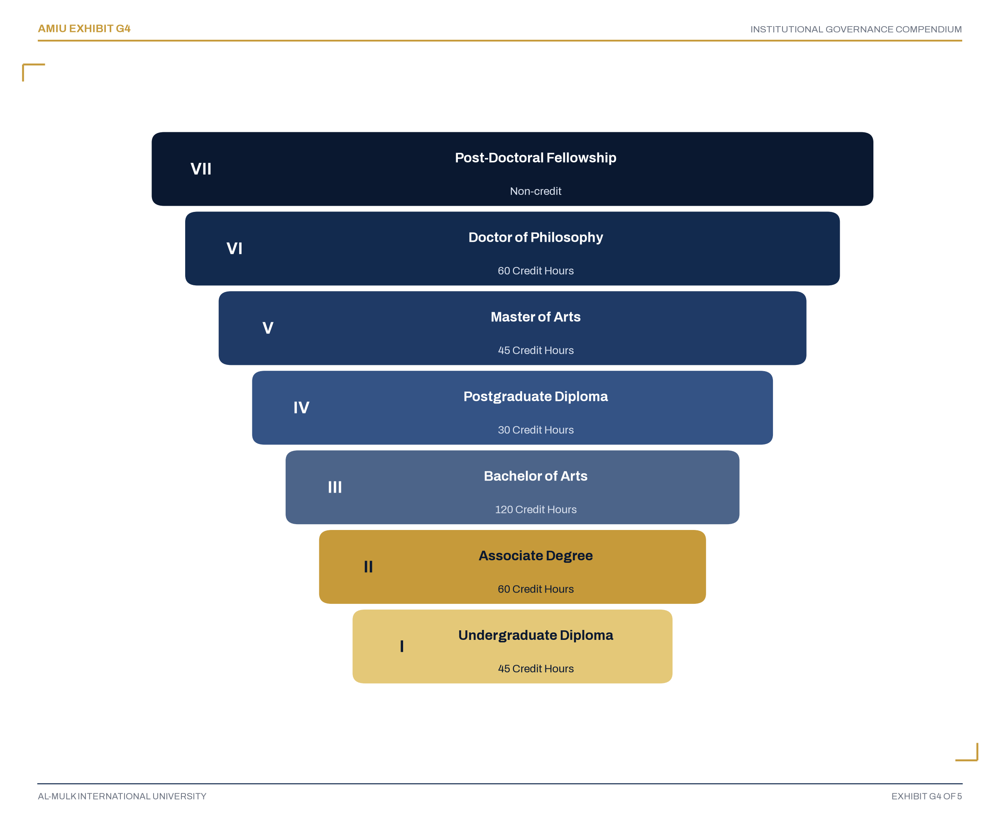
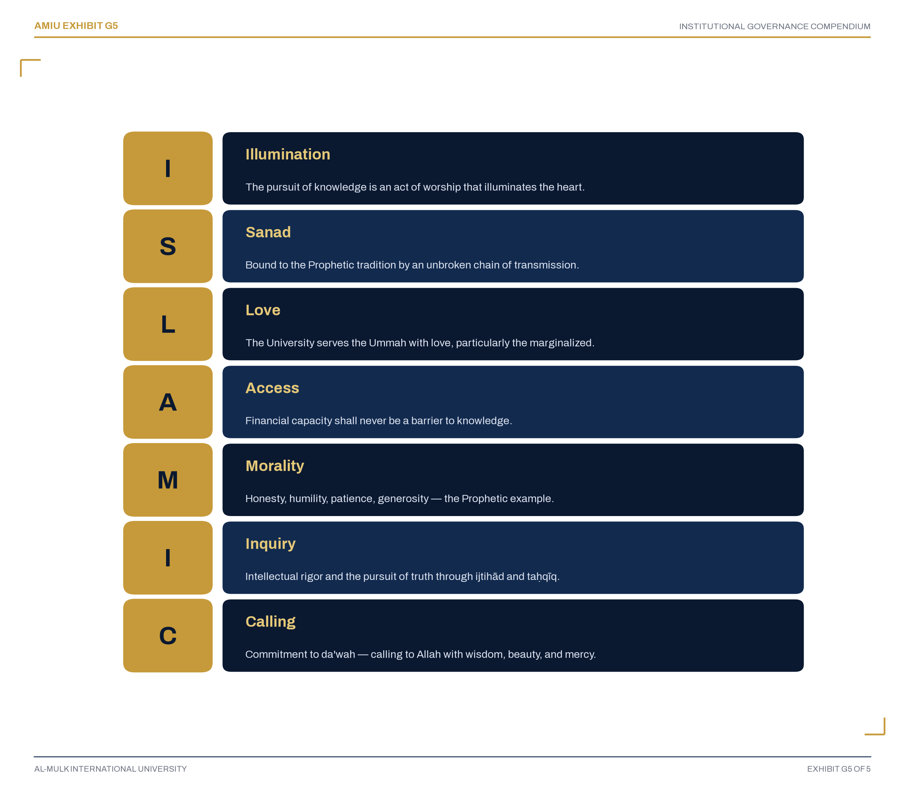

```{=openxml}
<w:p><w:r><w:br w:type="page"/></w:r></w:p>
<w:p><w:pPr><w:pStyle w:val="Heading2"/><w:spacing w:before="0" w:after="0"/><w:keepNext w:val="0"/><w:keepLines w:val="0"/><w:pBdr><w:bottom w:val="none" w:sz="0" w:space="0" w:color="auto"/></w:pBdr><w:rPr><w:vanish/><w:sz w:val="2"/></w:rPr></w:pPr><w:r><w:rPr><w:vanish/><w:sz w:val="2"/></w:rPr><w:t>Section 1: Introduction &amp; Purpose</w:t></w:r></w:p>
<w:tbl>
  <w:tblPr>
    <w:tblW w:w="9350" w:type="dxa"/>
    <w:tblBorders>
      <w:top w:val="single" w:sz="10" w:space="0" w:color="B08625"/>
      <w:bottom w:val="single" w:sz="10" w:space="0" w:color="B08625"/>
    </w:tblBorders>
  </w:tblPr>
  <w:tblGrid><w:gridCol w:w="9350"/></w:tblGrid>
  <w:tr>
    <w:trPr><w:trHeight w:val="11850" w:hRule="atLeast"/><w:cantSplit/></w:trPr>
    <w:tc>
      <w:tcPr>
        <w:tcW w:w="9350" w:type="dxa"/>
        <w:shd w:val="clear" w:color="auto" w:fill="122A4E"/>
        <w:tcMar><w:top w:w="620" w:type="dxa"/><w:left w:w="620" w:type="dxa"/><w:bottom w:w="620" w:type="dxa"/><w:right w:w="620" w:type="dxa"/></w:tcMar>
        <w:vAlign w:val="center"/>
      </w:tcPr>
<w:p><w:pPr><w:spacing w:before="0" w:after="120"/></w:pPr>
      <w:r><w:rPr><w:rFonts w:ascii="Source Serif 4" w:hAnsi="Source Serif 4"/><w:i/><w:smallCaps/><w:color w:val="8C97AB"/><w:sz w:val="19"/><w:spacing w:val="14"/></w:rPr><w:t>Section 1 of 25</w:t></w:r></w:p>
<w:p><w:pPr><w:spacing w:before="0" w:after="60"/></w:pPr>
      <w:r><w:rPr><w:rFonts w:ascii="Fraunces Black" w:hAnsi="Fraunces Black"/><w:color w:val="B08625"/><w:b/><w:sz w:val="108"/></w:rPr><w:t>01</w:t></w:r></w:p>
<w:p><w:pPr><w:spacing w:before="120" w:after="80"/></w:pPr>
      <w:r><w:rPr><w:rFonts w:ascii="Fraunces Black" w:hAnsi="Fraunces Black"/><w:color w:val="FFFFFF"/><w:b/><w:sz w:val="88"/></w:rPr><w:t>Introduction &amp; Purpose</w:t></w:r></w:p>
<w:p><w:pPr><w:spacing w:before="0" w:after="260"/><w:pBdr><w:bottom w:val="single" w:sz="10" w:space="8" w:color="B08625"/></w:pBdr></w:pPr>
      <w:r><w:rPr><w:rFonts w:ascii="Source Serif 4" w:hAnsi="Source Serif 4"/><w:i/><w:smallCaps/><w:color w:val="8C97AB"/><w:sz w:val="19"/><w:spacing w:val="10"/></w:rPr><w:t>Subsections 1.1–1.5</w:t></w:r></w:p>
<w:p><w:pPr><w:spacing w:before="0" w:after="360"/><w:ind w:right="700"/></w:pPr>
      <w:r><w:rPr><w:rFonts w:ascii="Fraunces" w:hAnsi="Fraunces"/><w:i/><w:color w:val="DCE3F0"/><w:sz w:val="25"/></w:rPr><w:t>&#8220;One authoritative reference for every institutional governance and policy matter the University will face.&#8221;</w:t></w:r></w:p>
<w:p><w:pPr><w:spacing w:before="0" w:after="140"/></w:pPr>
      <w:r><w:rPr><w:rFonts w:ascii="Source Serif 4" w:hAnsi="Source Serif 4"/><w:i/><w:smallCaps/><w:color w:val="B08625"/><w:b/><w:sz w:val="18"/><w:spacing w:val="12"/></w:rPr><w:t>Subsections</w:t></w:r></w:p>
<w:p><w:pPr><w:spacing w:before="0" w:after="110"/></w:pPr>
      <w:r><w:rPr><w:rFonts w:ascii="Archivo SemiBold" w:hAnsi="Archivo SemiBold"/><w:color w:val="B08625"/><w:b/><w:sz w:val="19"/></w:rPr><w:t>1.1&#8194;</w:t></w:r><w:r><w:rPr><w:rFonts w:ascii="Archivo" w:hAnsi="Archivo"/><w:color w:val="FFFFFF"/><w:sz w:val="18"/></w:rPr><w:t>Preamble</w:t></w:r></w:p>
<w:p><w:pPr><w:spacing w:before="0" w:after="110"/></w:pPr>
      <w:r><w:rPr><w:rFonts w:ascii="Archivo SemiBold" w:hAnsi="Archivo SemiBold"/><w:color w:val="B08625"/><w:b/><w:sz w:val="19"/></w:rPr><w:t>1.2&#8194;</w:t></w:r><w:r><w:rPr><w:rFonts w:ascii="Archivo" w:hAnsi="Archivo"/><w:color w:val="FFFFFF"/><w:sz w:val="18"/></w:rPr><w:t>Purpose of This Compendium</w:t></w:r></w:p>
<w:p><w:pPr><w:spacing w:before="0" w:after="110"/></w:pPr>
      <w:r><w:rPr><w:rFonts w:ascii="Archivo SemiBold" w:hAnsi="Archivo SemiBold"/><w:color w:val="B08625"/><w:b/><w:sz w:val="19"/></w:rPr><w:t>1.3&#8194;</w:t></w:r><w:r><w:rPr><w:rFonts w:ascii="Archivo" w:hAnsi="Archivo"/><w:color w:val="FFFFFF"/><w:sz w:val="18"/></w:rPr><w:t>Scope of This Compendium</w:t></w:r></w:p>
<w:p><w:pPr><w:spacing w:before="0" w:after="110"/></w:pPr>
      <w:r><w:rPr><w:rFonts w:ascii="Archivo SemiBold" w:hAnsi="Archivo SemiBold"/><w:color w:val="B08625"/><w:b/><w:sz w:val="19"/></w:rPr><w:t>1.4&#8194;</w:t></w:r><w:r><w:rPr><w:rFonts w:ascii="Archivo" w:hAnsi="Archivo"/><w:color w:val="FFFFFF"/><w:sz w:val="18"/></w:rPr><w:t>Governance Principles</w:t></w:r></w:p>
<w:p><w:pPr><w:spacing w:before="0" w:after="110"/></w:pPr>
      <w:r><w:rPr><w:rFonts w:ascii="Archivo SemiBold" w:hAnsi="Archivo SemiBold"/><w:color w:val="B08625"/><w:b/><w:sz w:val="19"/></w:rPr><w:t>1.5&#8194;</w:t></w:r><w:r><w:rPr><w:rFonts w:ascii="Archivo" w:hAnsi="Archivo"/><w:color w:val="FFFFFF"/><w:sz w:val="18"/></w:rPr><w:t>Document Numbering System</w:t></w:r></w:p>
    </w:tc>
  </w:tr>
</w:tbl>
<w:p><w:r><w:br w:type="page"/></w:r></w:p>
```


::: {custom-style="SectionKicker"}
Section 1 &#183; 1.1
:::

## 1.1 Preamble

```{=openxml}
<w:p><w:pPr><w:jc w:val="center"/><w:spacing w:before="0" w:after="300"/></w:pPr>
  <w:r><w:rPr><w:rFonts w:ascii="Fraunces" w:hAnsi="Fraunces"/><w:i/><w:color w:val="122A4E"/><w:sz w:val="26"/></w:rPr><w:t>In the Name of Allah, the Most Gracious, the Most Merciful.</w:t></w:r></w:p>
```

Al-Mulk International University (AMIU) is established as a Texas-registered, religiously-exempt institution of higher Islamic learning. Its founding purpose is the dissemination of authentic Islamic knowledge across the globe at the minimum possible cost, ensuring that no sincere seeker of knowledge is turned away due to financial constraint.

The University operates primarily as an online and distance learning institution, serving students across all time zones and continents. This mode of delivery is integral to the University's mission of spreading Islamic education worldwide without barriers.

This Institutional Governance Compendium constitutes the definitive governance and policy framework for the University. It establishes the institutional structure, articulates the core values, defines the roles and responsibilities of all governing bodies, and provides a comprehensive inventory of all policies, procedures, and governance instruments required for the operation of the University.

::: {custom-style="SectionKicker"}
Section 1 &#183; 1.2
:::

## 1.2 Purpose of This Compendium

This Compendium serves as the authoritative reference for all institutional governance and policy matters. It:

**1.2.1** Articulates the University's mission, vision, and core values;

**1.2.2** Establishes the institutional governance structure;

**1.2.3** Defines the roles and responsibilities of all governing bodies;

**1.2.4** Lists all 108 institutional policies, procedures, and governance instruments;

**1.2.5** Assigns clear accountability for each document;

**1.2.6** Provides a phased growth framework for offices and committees;

**1.2.7** Sets forth the compensation philosophy and framework;

**1.2.8** Establishes governance provisions for online and distance learning.

::: {custom-style="SectionKicker"}
Section 1 &#183; 1.3
:::

## 1.3 Scope of This Compendium

**1.3.1** This Compendium applies to all institutional documents, policies, procedures, and governance instruments of Al-Mulk International University.

**1.3.2** This Compendium covers documents across all seven handbook categories as approved by the University Senate.

**1.3.3** This Compendium is effective as of 1 January 2028 and shall be reviewed annually by the University Senate.

**1.3.4** This Compendium is the authoritative source for institutional governance, policy status, and responsibility assignment.

::: {custom-style="SectionKicker"}
Section 1 &#183; 1.4
:::

## 1.4 Governance Principles

This Compendium is founded upon the following governance principles:

| Principle | Application |
|---|---|
| Phased Growth | Institutional structure expands strategically as enrollment and faculty grow. |
| Separation of Powers | No single individual serves as both Policy Steward and sole Approval Authority. |
| Accountability | Every document has a clearly designated steward. |
| Transparency | All documents are publicly available, except where legally restricted. |
| Mission-Driven Service | All contributions are framed as service to the Ummah. |
| Revenue-Linked Sustainability | Compensation and operations scale with institutional revenue. |
| Online-First Delivery | All governance and operations assume a primarily online delivery model. |
| Global Accessibility | All policies accommodate students across time zones and regions. |
| Knowledge Without Barriers | The University is committed to removing all barriers to Islamic education. |

::: {custom-style="SectionKicker"}
Section 1 &#183; 1.5
:::

## 1.5 Document Numbering System

Each document is assigned a unique identifier following this convention:

| Element | Format | Example |
|---|---|---|
| Prefix | AMIU | AMIU |
| Category Code | GOV, ACA, STU, OPS, LEG, MKT, WAQ | AMIU-GOV |
| Sequential Number | 001-999, counted within its own category | AMIU-GOV-001 |
| Version | V-1.0 | AMIU-GOV-001-V1.0 |

**Category Codes**

| Code | Category | Description |
|---|---|---|
| GOV | Governance | Board, Senate, and institutional governance documents |
| ACA | Academic | Program, curriculum, faculty, and academic policy documents |
| STU | Student | Student conduct, services, and support documents |
| OPS | Operations | Finance, HR, IT, facilities, and operational documents |
| LEG | Legal & Compliance | Legal, regulatory, and compliance documents |
| MKT | Marketing | Brand, communications, and marketing documents |
| WAQ | Waqf & Research | Endowment, fundraising, research, and risk documents |

*Note: the Sequential Number in a document's code (e.g. the "003" in AMIU-GOV-003) counts only within that document's own category — it is not the same as the flat 1-108 numbering used for reference in Sections 17 and 20. Section 17's "Doc Code" column gives both side by side for every document, so the two schemes are never in doubt.*

```{=openxml}
<w:p><w:r><w:br w:type="page"/></w:r></w:p>
```

```{=openxml}
<w:p><w:r><w:br w:type="page"/></w:r></w:p>
<w:p><w:pPr><w:pStyle w:val="Heading2"/><w:spacing w:before="0" w:after="0"/><w:keepNext w:val="0"/><w:keepLines w:val="0"/><w:pBdr><w:bottom w:val="none" w:sz="0" w:space="0" w:color="auto"/></w:pBdr><w:rPr><w:vanish/><w:sz w:val="2"/></w:rPr></w:pPr><w:r><w:rPr><w:vanish/><w:sz w:val="2"/></w:rPr><w:t>Section 2: Institutional Identity</w:t></w:r></w:p>
<w:tbl>
  <w:tblPr>
    <w:tblW w:w="9350" w:type="dxa"/>
    <w:tblBorders>
      <w:top w:val="single" w:sz="10" w:space="0" w:color="B08625"/>
      <w:bottom w:val="single" w:sz="10" w:space="0" w:color="B08625"/>
    </w:tblBorders>
  </w:tblPr>
  <w:tblGrid><w:gridCol w:w="9350"/></w:tblGrid>
  <w:tr>
    <w:trPr><w:trHeight w:val="12270" w:hRule="atLeast"/><w:cantSplit/></w:trPr>
    <w:tc>
      <w:tcPr>
        <w:tcW w:w="9350" w:type="dxa"/>
        <w:shd w:val="clear" w:color="auto" w:fill="122A4E"/>
        <w:tcMar><w:top w:w="620" w:type="dxa"/><w:left w:w="620" w:type="dxa"/><w:bottom w:w="620" w:type="dxa"/><w:right w:w="620" w:type="dxa"/></w:tcMar>
        <w:vAlign w:val="center"/>
      </w:tcPr>
<w:p><w:pPr><w:spacing w:before="0" w:after="120"/></w:pPr>
      <w:r><w:rPr><w:rFonts w:ascii="Source Serif 4" w:hAnsi="Source Serif 4"/><w:i/><w:smallCaps/><w:color w:val="8C97AB"/><w:sz w:val="19"/><w:spacing w:val="14"/></w:rPr><w:t>Section 2 of 25</w:t></w:r></w:p>
<w:p><w:pPr><w:spacing w:before="0" w:after="60"/></w:pPr>
      <w:r><w:rPr><w:rFonts w:ascii="Fraunces Black" w:hAnsi="Fraunces Black"/><w:color w:val="B08625"/><w:b/><w:sz w:val="108"/></w:rPr><w:t>02</w:t></w:r></w:p>
<w:p><w:pPr><w:spacing w:before="120" w:after="80"/></w:pPr>
      <w:r><w:rPr><w:rFonts w:ascii="Fraunces Black" w:hAnsi="Fraunces Black"/><w:color w:val="FFFFFF"/><w:b/><w:sz w:val="88"/></w:rPr><w:t>Institutional Identity</w:t></w:r></w:p>
<w:p><w:pPr><w:spacing w:before="0" w:after="260"/><w:pBdr><w:bottom w:val="single" w:sz="10" w:space="8" w:color="B08625"/></w:pBdr></w:pPr>
      <w:r><w:rPr><w:rFonts w:ascii="Source Serif 4" w:hAnsi="Source Serif 4"/><w:i/><w:smallCaps/><w:color w:val="8C97AB"/><w:sz w:val="19"/><w:spacing w:val="10"/></w:rPr><w:t>Subsections 2.1–2.7</w:t></w:r></w:p>
<w:p><w:pPr><w:spacing w:before="0" w:after="360"/><w:ind w:right="700"/></w:pPr>
      <w:r><w:rPr><w:rFonts w:ascii="Fraunces" w:hAnsi="Fraunces"/><w:i/><w:color w:val="DCE3F0"/><w:sz w:val="25"/></w:rPr><w:t>&#8220;A Texas-domiciled religious university built on a seven-tier academic ladder and six founding colleges.&#8221;</w:t></w:r></w:p>
<w:p><w:pPr><w:spacing w:before="0" w:after="140"/></w:pPr>
      <w:r><w:rPr><w:rFonts w:ascii="Source Serif 4" w:hAnsi="Source Serif 4"/><w:i/><w:smallCaps/><w:color w:val="B08625"/><w:b/><w:sz w:val="18"/><w:spacing w:val="12"/></w:rPr><w:t>Subsections</w:t></w:r></w:p>
<w:p><w:pPr><w:spacing w:before="0" w:after="110"/></w:pPr>
      <w:r><w:rPr><w:rFonts w:ascii="Archivo SemiBold" w:hAnsi="Archivo SemiBold"/><w:color w:val="B08625"/><w:b/><w:sz w:val="19"/></w:rPr><w:t>2.1&#8194;</w:t></w:r><w:r><w:rPr><w:rFonts w:ascii="Archivo" w:hAnsi="Archivo"/><w:color w:val="FFFFFF"/><w:sz w:val="18"/></w:rPr><w:t>Legal Identity</w:t></w:r></w:p>
<w:p><w:pPr><w:spacing w:before="0" w:after="110"/></w:pPr>
      <w:r><w:rPr><w:rFonts w:ascii="Archivo SemiBold" w:hAnsi="Archivo SemiBold"/><w:color w:val="B08625"/><w:b/><w:sz w:val="19"/></w:rPr><w:t>2.2&#8194;</w:t></w:r><w:r><w:rPr><w:rFonts w:ascii="Archivo" w:hAnsi="Archivo"/><w:color w:val="FFFFFF"/><w:sz w:val="18"/></w:rPr><w:t>Mission</w:t></w:r></w:p>
<w:p><w:pPr><w:spacing w:before="0" w:after="110"/></w:pPr>
      <w:r><w:rPr><w:rFonts w:ascii="Archivo SemiBold" w:hAnsi="Archivo SemiBold"/><w:color w:val="B08625"/><w:b/><w:sz w:val="19"/></w:rPr><w:t>2.3&#8194;</w:t></w:r><w:r><w:rPr><w:rFonts w:ascii="Archivo" w:hAnsi="Archivo"/><w:color w:val="FFFFFF"/><w:sz w:val="18"/></w:rPr><w:t>Vision (2037)</w:t></w:r></w:p>
<w:p><w:pPr><w:spacing w:before="0" w:after="110"/></w:pPr>
      <w:r><w:rPr><w:rFonts w:ascii="Archivo SemiBold" w:hAnsi="Archivo SemiBold"/><w:color w:val="B08625"/><w:b/><w:sz w:val="19"/></w:rPr><w:t>2.4&#8194;</w:t></w:r><w:r><w:rPr><w:rFonts w:ascii="Archivo" w:hAnsi="Archivo"/><w:color w:val="FFFFFF"/><w:sz w:val="18"/></w:rPr><w:t>Tagline</w:t></w:r></w:p>
<w:p><w:pPr><w:spacing w:before="0" w:after="110"/></w:pPr>
      <w:r><w:rPr><w:rFonts w:ascii="Archivo SemiBold" w:hAnsi="Archivo SemiBold"/><w:color w:val="B08625"/><w:b/><w:sz w:val="19"/></w:rPr><w:t>2.5&#8194;</w:t></w:r><w:r><w:rPr><w:rFonts w:ascii="Archivo" w:hAnsi="Archivo"/><w:color w:val="FFFFFF"/><w:sz w:val="18"/></w:rPr><w:t>The AMIU Commitment</w:t></w:r></w:p>
<w:p><w:pPr><w:spacing w:before="0" w:after="110"/></w:pPr>
      <w:r><w:rPr><w:rFonts w:ascii="Archivo SemiBold" w:hAnsi="Archivo SemiBold"/><w:color w:val="B08625"/><w:b/><w:sz w:val="19"/></w:rPr><w:t>2.6&#8194;</w:t></w:r><w:r><w:rPr><w:rFonts w:ascii="Archivo" w:hAnsi="Archivo"/><w:color w:val="FFFFFF"/><w:sz w:val="18"/></w:rPr><w:t>The Academic Ladder</w:t></w:r></w:p>
<w:p><w:pPr><w:spacing w:before="0" w:after="110"/></w:pPr>
      <w:r><w:rPr><w:rFonts w:ascii="Archivo SemiBold" w:hAnsi="Archivo SemiBold"/><w:color w:val="B08625"/><w:b/><w:sz w:val="19"/></w:rPr><w:t>2.7&#8194;</w:t></w:r><w:r><w:rPr><w:rFonts w:ascii="Archivo" w:hAnsi="Archivo"/><w:color w:val="FFFFFF"/><w:sz w:val="18"/></w:rPr><w:t>The Six Colleges</w:t></w:r></w:p>
    </w:tc>
  </w:tr>
</w:tbl>
<w:p><w:r><w:br w:type="page"/></w:r></w:p>
```


::: {custom-style="SectionKicker"}
Section 2 &#183; 2.1
:::

## 2.1 Legal Identity

| Attribute | Detail |
|---|---|
| Legal Name | Al-Mulk International University |
| Acronym | AMIU |
| Tagline | Knowledge Without Barriers |
| Legal Status | Texas Nonprofit Religious Educational Corporation |
| Legal Domicile | State of Texas, United States of America |
| Date of Incorporation | 6 December 2027 |
| Academic Operations Commence | 1 January 2028 |
| Primary Mode of Delivery | Online and Distance Learning |

::: {custom-style="SectionKicker"}
Section 2 &#183; 2.2
:::

## 2.2 Mission

*"To spread Islamic education all over the world at the minimum possible cost, covering the needy without condition, through a rigorous, stackable, seven-tier credential ladder that never sacrifices academic seriousness for accessibility, and never sacrifices financial self-sufficiency for good intentions."*

::: {custom-style="SectionKicker"}
Section 2 &#183; 2.3
:::

## 2.3 Vision (2037)

*"For Al-Mulk International University to be internationally recognized as a leading English-medium Islamic university — financially independent, fully accredited in every jurisdiction in which it operates, and proof that a religious university can serve the poorest students in the world at near-zero cost while remaining permanently self-sustaining."*

::: {custom-style="SectionKicker"}
Section 2 &#183; 2.4
:::

## 2.4 Tagline

*"Knowledge Without Barriers"*

::: {custom-style="SectionKicker"}
Section 2 &#183; 2.5
:::

## 2.5 The AMIU Commitment

*"AMIU is not a commercial institution. Its aim is not money. It is a vehicle for spreading Islamic education worldwide without barriers. Those who serve AMIU do so as a contribution to the Ummah — a form of Jihad through knowledge. Compensation is provided as a means of sustaining service, not as a market-driven wage. The University grows with its mission, and its people grow with it."*

::: {custom-style="SectionKicker"}
Section 2 &#183; 2.6
:::

## 2.6 The Academic Ladder

AMIU offers a fully stacked seven-tier academic ladder, with every credential stacking directly into the next:



**Exhibit G4. The Academic Ladder**

*Every credential stacks directly into the next tier with no credit lost in the climb — from the Undergraduate Diploma at the entry point to the Post-Doctoral Fellowship at its summit. This is the same ladder governed in full by Article X of the Constitution (AMIU-CON-001).*

::: {custom-style="SectionKicker"}
Section 2 &#183; 2.7
:::

## 2.7 The Six Colleges

| Number | College |
|---:|---|
| 1 | College of Qur'anic & Hadith Sciences |
| 2 | College of Shari'ah & Islamic Law |
| 3 | College of Islamic Theology & Philosophy (Aqeedah) |
| 4 | College of Arabic Language & Linguistics |
| 5 | College of Da'wah, Islamic Communication & Chaplaincy |
| 6 | College of Islamic Finance, Economics & Waqf Administration |

```{=openxml}
<w:p><w:r><w:br w:type="page"/></w:r></w:p>
```

```{=openxml}
<w:p><w:r><w:br w:type="page"/></w:r></w:p>
<w:p><w:pPr><w:pStyle w:val="Heading2"/><w:spacing w:before="0" w:after="0"/><w:keepNext w:val="0"/><w:keepLines w:val="0"/><w:pBdr><w:bottom w:val="none" w:sz="0" w:space="0" w:color="auto"/></w:pBdr><w:rPr><w:vanish/><w:sz w:val="2"/></w:rPr></w:pPr><w:r><w:rPr><w:vanish/><w:sz w:val="2"/></w:rPr><w:t>Section 3: The ISLAMIC Framework — Core Values</w:t></w:r></w:p>
<w:tbl>
  <w:tblPr>
    <w:tblW w:w="9350" w:type="dxa"/>
    <w:tblBorders>
      <w:top w:val="single" w:sz="10" w:space="0" w:color="B08625"/>
      <w:bottom w:val="single" w:sz="10" w:space="0" w:color="B08625"/>
    </w:tblBorders>
  </w:tblPr>
  <w:tblGrid><w:gridCol w:w="9350"/></w:tblGrid>
  <w:tr>
    <w:trPr><w:trHeight w:val="11640" w:hRule="atLeast"/><w:cantSplit/></w:trPr>
    <w:tc>
      <w:tcPr>
        <w:tcW w:w="9350" w:type="dxa"/>
        <w:shd w:val="clear" w:color="auto" w:fill="122A4E"/>
        <w:tcMar><w:top w:w="620" w:type="dxa"/><w:left w:w="620" w:type="dxa"/><w:bottom w:w="620" w:type="dxa"/><w:right w:w="620" w:type="dxa"/></w:tcMar>
        <w:vAlign w:val="center"/>
      </w:tcPr>
<w:p><w:pPr><w:spacing w:before="0" w:after="120"/></w:pPr>
      <w:r><w:rPr><w:rFonts w:ascii="Source Serif 4" w:hAnsi="Source Serif 4"/><w:i/><w:smallCaps/><w:color w:val="8C97AB"/><w:sz w:val="19"/><w:spacing w:val="14"/></w:rPr><w:t>Section 3 of 25</w:t></w:r></w:p>
<w:p><w:pPr><w:spacing w:before="0" w:after="60"/></w:pPr>
      <w:r><w:rPr><w:rFonts w:ascii="Fraunces Black" w:hAnsi="Fraunces Black"/><w:color w:val="B08625"/><w:b/><w:sz w:val="108"/></w:rPr><w:t>03</w:t></w:r></w:p>
<w:p><w:pPr><w:spacing w:before="120" w:after="80"/></w:pPr>
      <w:r><w:rPr><w:rFonts w:ascii="Fraunces Black" w:hAnsi="Fraunces Black"/><w:color w:val="FFFFFF"/><w:b/><w:sz w:val="72"/></w:rPr><w:t>The ISLAMIC Framework — Core Values</w:t></w:r></w:p>
<w:p><w:pPr><w:spacing w:before="0" w:after="260"/><w:pBdr><w:bottom w:val="single" w:sz="10" w:space="8" w:color="B08625"/></w:pBdr></w:pPr>
      <w:r><w:rPr><w:rFonts w:ascii="Source Serif 4" w:hAnsi="Source Serif 4"/><w:i/><w:smallCaps/><w:color w:val="8C97AB"/><w:sz w:val="19"/><w:spacing w:val="10"/></w:rPr><w:t>Subsections 3.1–3.4</w:t></w:r></w:p>
<w:p><w:pPr><w:spacing w:before="0" w:after="360"/><w:ind w:right="700"/></w:pPr>
      <w:r><w:rPr><w:rFonts w:ascii="Fraunces" w:hAnsi="Fraunces"/><w:i/><w:color w:val="DCE3F0"/><w:sz w:val="25"/></w:rPr><w:t>&#8220;Illumination, Sanad, Love, Access, Morality, Inquiry, Calling — seven values, one binding pledge.&#8221;</w:t></w:r></w:p>
<w:p><w:pPr><w:spacing w:before="0" w:after="140"/></w:pPr>
      <w:r><w:rPr><w:rFonts w:ascii="Source Serif 4" w:hAnsi="Source Serif 4"/><w:i/><w:smallCaps/><w:color w:val="B08625"/><w:b/><w:sz w:val="18"/><w:spacing w:val="12"/></w:rPr><w:t>Subsections</w:t></w:r></w:p>
<w:p><w:pPr><w:spacing w:before="0" w:after="110"/></w:pPr>
      <w:r><w:rPr><w:rFonts w:ascii="Archivo SemiBold" w:hAnsi="Archivo SemiBold"/><w:color w:val="B08625"/><w:b/><w:sz w:val="19"/></w:rPr><w:t>3.1&#8194;</w:t></w:r><w:r><w:rPr><w:rFonts w:ascii="Archivo" w:hAnsi="Archivo"/><w:color w:val="FFFFFF"/><w:sz w:val="18"/></w:rPr><w:t>Introduction</w:t></w:r></w:p>
<w:p><w:pPr><w:spacing w:before="0" w:after="110"/></w:pPr>
      <w:r><w:rPr><w:rFonts w:ascii="Archivo SemiBold" w:hAnsi="Archivo SemiBold"/><w:color w:val="B08625"/><w:b/><w:sz w:val="19"/></w:rPr><w:t>3.2&#8194;</w:t></w:r><w:r><w:rPr><w:rFonts w:ascii="Archivo" w:hAnsi="Archivo"/><w:color w:val="FFFFFF"/><w:sz w:val="18"/></w:rPr><w:t>The ISLAMIC Framework</w:t></w:r></w:p>
<w:p><w:pPr><w:spacing w:before="0" w:after="110"/></w:pPr>
      <w:r><w:rPr><w:rFonts w:ascii="Archivo SemiBold" w:hAnsi="Archivo SemiBold"/><w:color w:val="B08625"/><w:b/><w:sz w:val="19"/></w:rPr><w:t>3.3&#8194;</w:t></w:r><w:r><w:rPr><w:rFonts w:ascii="Archivo" w:hAnsi="Archivo"/><w:color w:val="FFFFFF"/><w:sz w:val="18"/></w:rPr><w:t>The ISLAMIC Framework — Detailed</w:t></w:r></w:p>
<w:p><w:pPr><w:spacing w:before="0" w:after="110"/></w:pPr>
      <w:r><w:rPr><w:rFonts w:ascii="Archivo SemiBold" w:hAnsi="Archivo SemiBold"/><w:color w:val="B08625"/><w:b/><w:sz w:val="19"/></w:rPr><w:t>3.4&#8194;</w:t></w:r><w:r><w:rPr><w:rFonts w:ascii="Archivo" w:hAnsi="Archivo"/><w:color w:val="FFFFFF"/><w:sz w:val="18"/></w:rPr><w:t>The ISLAMIC Pledge</w:t></w:r></w:p>
    </w:tc>
  </w:tr>
</w:tbl>
<w:p><w:r><w:br w:type="page"/></w:r></w:p>
```


::: {custom-style="SectionKicker"}
Section 3 &#183; 3.1
:::

## 3.1 Introduction

The University is guided by the ISLAMIC framework — a foundation upon which all institutional decisions, policies, and practices are built.

::: {custom-style="SectionKicker"}
Section 3 &#183; 3.2
:::

## 3.2 The ISLAMIC Framework



**Exhibit G5. The ISLAMIC Framework**

*Illumination, Sanad, Love, Access, Morality, Inquiry, Calling — the same seven values Article III of the Constitution (AMIU-CON-001) makes binding on every person acting in the University's name. Section 3.3 below sets out each in full.*

::: {custom-style="SectionKicker"}
Section 3 &#183; 3.3
:::

## 3.3 The ISLAMIC Framework — Detailed

**I — Illumination.** The pursuit of knowledge is an act of worship that illuminates the heart and draws the seeker closer to Allah. At AMIU, education is not merely the acquisition of information; it is the cultivation of faith, the refinement of the soul, and the awakening of the intellect to the signs of Allah. All academic pursuits are grounded in the Qur'an and Sunnah, and all scholarship is directed toward the service of Allah and the betterment of humanity.

**S — Sanad.** AMIU is bound to the Prophetic tradition by an unbroken golden chain of transmission (sanad). Every faculty appointment is traceable to a documented chain of study, training, and authorization. This sacred chain ensures that the knowledge imparted is authentic, trustworthy, and rooted in the tradition.

**L — Love.** The University exists to serve the Ummah with love and dedication. Its primary purpose is the dissemination of Islamic knowledge to every corner of the world, with particular attention to those who are marginalized, impoverished, or otherwise deprived of access to authentic Islamic education.

**A — Access.** Guided by the Qur'anic principles of compassion (rahmah) and justice (ʿadl), AMIU ensures that financial capacity shall never be a barrier to knowledge. The University opens its doors to all, regardless of economic status, nationality, or circumstance.

**M — Morality.** AMIU cultivates not only knowledgeable scholars but also virtuous human beings. The University is committed to the purification of character (tazkiyah) and the inculcation of noble virtues (akhlāq) — honesty, humility, patience, generosity, and compassion.

**I — Inquiry.** AMIU encourages intellectual rigor, critical inquiry, and the pursuit of truth. The University cultivates scholars who are both deeply rooted in the Islamic tradition and equipped to engage with contemporary challenges through ijtihād (independent reasoning) and taḥqīq (critical investigation).

**C — Calling.** AMIU is committed to the noble mission of da'wah — calling to Allah with wisdom, beauty, and mercy. Through its graduates, publications, and outreach programs, the University spreads the message of Islam with compassion, excellence, and profound respect for all humanity.

::: {custom-style="SectionKicker"}
Section 3 &#183; 3.4
:::

## 3.4 The ISLAMIC Pledge

*"As members of Al-Mulk International University, we commit ourselves to:*

*Illumination — that our knowledge may be light;*
*Sanad — that our scholarship may be authentic;*
*Love — that our service may be devoted;*
*Access — that no soul may be denied;*
*Morality — that our character may reflect the Prophet, peace be upon him;*
*Inquiry — that our thought may be rigorous;*
*Calling — that our da'wah may be with wisdom.*

*These are our values. This is our promise to the Ummah."*

```{=openxml}
<w:p><w:r><w:br w:type="page"/></w:r></w:p>
```

```{=openxml}
<w:p><w:r><w:br w:type="page"/></w:r></w:p>
<w:p><w:pPr><w:pStyle w:val="Heading2"/><w:spacing w:before="0" w:after="0"/><w:keepNext w:val="0"/><w:keepLines w:val="0"/><w:pBdr><w:bottom w:val="none" w:sz="0" w:space="0" w:color="auto"/></w:pBdr><w:rPr><w:vanish/><w:sz w:val="2"/></w:rPr></w:pPr><w:r><w:rPr><w:vanish/><w:sz w:val="2"/></w:rPr><w:t>Section 4: Governance Hierarchy &amp; Roles</w:t></w:r></w:p>
<w:tbl>
  <w:tblPr>
    <w:tblW w:w="9350" w:type="dxa"/>
    <w:tblBorders>
      <w:top w:val="single" w:sz="10" w:space="0" w:color="B08625"/>
      <w:bottom w:val="single" w:sz="10" w:space="0" w:color="B08625"/>
    </w:tblBorders>
  </w:tblPr>
  <w:tblGrid><w:gridCol w:w="9350"/></w:tblGrid>
  <w:tr>
    <w:trPr><w:trHeight w:val="11640" w:hRule="atLeast"/><w:cantSplit/></w:trPr>
    <w:tc>
      <w:tcPr>
        <w:tcW w:w="9350" w:type="dxa"/>
        <w:shd w:val="clear" w:color="auto" w:fill="122A4E"/>
        <w:tcMar><w:top w:w="620" w:type="dxa"/><w:left w:w="620" w:type="dxa"/><w:bottom w:w="620" w:type="dxa"/><w:right w:w="620" w:type="dxa"/></w:tcMar>
        <w:vAlign w:val="center"/>
      </w:tcPr>
<w:p><w:pPr><w:spacing w:before="0" w:after="120"/></w:pPr>
      <w:r><w:rPr><w:rFonts w:ascii="Source Serif 4" w:hAnsi="Source Serif 4"/><w:i/><w:smallCaps/><w:color w:val="8C97AB"/><w:sz w:val="19"/><w:spacing w:val="14"/></w:rPr><w:t>Section 4 of 25</w:t></w:r></w:p>
<w:p><w:pPr><w:spacing w:before="0" w:after="60"/></w:pPr>
      <w:r><w:rPr><w:rFonts w:ascii="Fraunces Black" w:hAnsi="Fraunces Black"/><w:color w:val="B08625"/><w:b/><w:sz w:val="108"/></w:rPr><w:t>04</w:t></w:r></w:p>
<w:p><w:pPr><w:spacing w:before="120" w:after="80"/></w:pPr>
      <w:r><w:rPr><w:rFonts w:ascii="Fraunces Black" w:hAnsi="Fraunces Black"/><w:color w:val="FFFFFF"/><w:b/><w:sz w:val="72"/></w:rPr><w:t>Governance Hierarchy &amp; Roles</w:t></w:r></w:p>
<w:p><w:pPr><w:spacing w:before="0" w:after="260"/><w:pBdr><w:bottom w:val="single" w:sz="10" w:space="8" w:color="B08625"/></w:pBdr></w:pPr>
      <w:r><w:rPr><w:rFonts w:ascii="Source Serif 4" w:hAnsi="Source Serif 4"/><w:i/><w:smallCaps/><w:color w:val="8C97AB"/><w:sz w:val="19"/><w:spacing w:val="10"/></w:rPr><w:t>Subsections 4.1–4.4</w:t></w:r></w:p>
<w:p><w:pPr><w:spacing w:before="0" w:after="360"/><w:ind w:right="700"/></w:pPr>
      <w:r><w:rPr><w:rFonts w:ascii="Fraunces" w:hAnsi="Fraunces"/><w:i/><w:color w:val="DCE3F0"/><w:sz w:val="25"/></w:rPr><w:t>&#8220;The Senate teaches and the Administration executes — parallel authorities, not a chain of command.&#8221;</w:t></w:r></w:p>
<w:p><w:pPr><w:spacing w:before="0" w:after="140"/></w:pPr>
      <w:r><w:rPr><w:rFonts w:ascii="Source Serif 4" w:hAnsi="Source Serif 4"/><w:i/><w:smallCaps/><w:color w:val="B08625"/><w:b/><w:sz w:val="18"/><w:spacing w:val="12"/></w:rPr><w:t>Subsections</w:t></w:r></w:p>
<w:p><w:pPr><w:spacing w:before="0" w:after="110"/></w:pPr>
      <w:r><w:rPr><w:rFonts w:ascii="Archivo SemiBold" w:hAnsi="Archivo SemiBold"/><w:color w:val="B08625"/><w:b/><w:sz w:val="19"/></w:rPr><w:t>4.1&#8194;</w:t></w:r><w:r><w:rPr><w:rFonts w:ascii="Archivo" w:hAnsi="Archivo"/><w:color w:val="FFFFFF"/><w:sz w:val="18"/></w:rPr><w:t>The Governance Hierarchy</w:t></w:r></w:p>
<w:p><w:pPr><w:spacing w:before="0" w:after="110"/></w:pPr>
      <w:r><w:rPr><w:rFonts w:ascii="Archivo SemiBold" w:hAnsi="Archivo SemiBold"/><w:color w:val="B08625"/><w:b/><w:sz w:val="19"/></w:rPr><w:t>4.2&#8194;</w:t></w:r><w:r><w:rPr><w:rFonts w:ascii="Archivo" w:hAnsi="Archivo"/><w:color w:val="FFFFFF"/><w:sz w:val="18"/></w:rPr><w:t>The Board-Senate Relationship</w:t></w:r></w:p>
<w:p><w:pPr><w:spacing w:before="0" w:after="110"/></w:pPr>
      <w:r><w:rPr><w:rFonts w:ascii="Archivo SemiBold" w:hAnsi="Archivo SemiBold"/><w:color w:val="B08625"/><w:b/><w:sz w:val="19"/></w:rPr><w:t>4.3&#8194;</w:t></w:r><w:r><w:rPr><w:rFonts w:ascii="Archivo" w:hAnsi="Archivo"/><w:color w:val="FFFFFF"/><w:sz w:val="18"/></w:rPr><w:t>Senate Authority — Defined</w:t></w:r></w:p>
<w:p><w:pPr><w:spacing w:before="0" w:after="110"/></w:pPr>
      <w:r><w:rPr><w:rFonts w:ascii="Archivo SemiBold" w:hAnsi="Archivo SemiBold"/><w:color w:val="B08625"/><w:b/><w:sz w:val="19"/></w:rPr><w:t>4.4&#8194;</w:t></w:r><w:r><w:rPr><w:rFonts w:ascii="Archivo" w:hAnsi="Archivo"/><w:color w:val="FFFFFF"/><w:sz w:val="18"/></w:rPr><w:t>Governance Structure — Exhibit G1</w:t></w:r></w:p>
    </w:tc>
  </w:tr>
</w:tbl>
<w:p><w:r><w:br w:type="page"/></w:r></w:p>
```


::: {custom-style="SectionKicker"}
Section 4 &#183; 4.1
:::

## 4.1 The Governance Hierarchy

The University operates under a clear governance hierarchy, reflecting the standard bicameral model of higher education. The Board and Senate are supreme in their own domains rather than ranked one above the other — Exhibit G1 and Section 4.2 govern how the two chambers relate in full.

| Tier | Body | Role |
|---|---|---|
| 1 | Board of Trustees | Supreme Governing Authority — responsible for the long-term strategy, financial health, and legal integrity of the University. |
| 2 | President & Vice-Chancellor | Chief Executive Officer — the single operational link between the Board and the Senate. |
| 3 | University Senate | Supreme Academic Authority — responsible for curriculum, standards, examinations, and degrees. |
| 3 | Administration | Executive Management — the administrative arm that implements policies under the leadership of the President. |

*Note: the Senate and the Administration are placed at the same Tier 3 deliberately. Both report through the President as Tier 2, but neither is subordinate to the other — Section 4.2's non-interference principle and Exhibit G1's diagram both establish them as parallel, co-equal bodies, not a fourth link in a single chain.*

::: {custom-style="SectionKicker"}
Section 4 &#183; 4.2
:::

## 4.2 The Board-Senate Relationship

The Board and Senate maintain a relationship of mutual respect and separation of powers:

| Principle | Application |
|---|---|
| Strategic vs. Academic | The Board governs; the Senate teaches. |
| Non-Interference | The Board shall not interfere in curriculum or grading. The Senate shall not interfere in budget allocation or external strategy. |
| Advisory Role | The Senate advises the Board on academic matters. The Board consults the Senate on financial matters affecting academic quality. |
| The President as Link | The President ensures the Board's vision and the Senate's standards are executed efficiently. |

::: {custom-style="SectionKicker"}
Section 4 &#183; 4.3
:::

## 4.3 Senate Authority — Defined

| Area | Authority |
|---|---|
| Academic Programs | Full authority to approve, modify, or discontinue academic programs. |
| Academic Standards | Full authority to set and enforce academic standards. |
| Faculty Appointments | Full authority to approve faculty appointments through the Faculty Affairs Committee. |
| Faculty Promotions | Full authority to approve faculty promotions through the Faculty Affairs Committee. |
| Degree Conferrals | Full authority to ratify all degrees and certificates. |
| Academic Budget | Advisory authority — recommends allocation to the Board through the President. |
| Tuition Setting | No authority — this is the Board's exclusive responsibility. |
| Staff Hiring | No authority — this is the Administration's responsibility. |
| Non-Academic Budget | No authority — this is the Board's and Administration's responsibility. |

::: {custom-style="SectionKicker"}
Section 4 &#183; 4.4
:::

## 4.4 Governance Structure — Exhibit G1

The University's governance structure is presented in full in **Exhibit G1** (Governance Architecture, preceding the Table of Contents): the Board of Trustees at the apex, the President & Vice-Chancellor as the single operational link beneath it, and the University Senate and Administration as parallel, co-equal bodies beneath the President — each supreme within its own domain, neither subordinate to the other.

```{=openxml}
<w:p><w:r><w:br w:type="page"/></w:r></w:p>
```

```{=openxml}
<w:p><w:r><w:br w:type="page"/></w:r></w:p>
<w:p><w:pPr><w:pStyle w:val="Heading2"/><w:spacing w:before="0" w:after="0"/><w:keepNext w:val="0"/><w:keepLines w:val="0"/><w:pBdr><w:bottom w:val="none" w:sz="0" w:space="0" w:color="auto"/></w:pBdr><w:rPr><w:vanish/><w:sz w:val="2"/></w:rPr></w:pPr><w:r><w:rPr><w:vanish/><w:sz w:val="2"/></w:rPr><w:t>Section 5: Board of Trustees — Composition, Roles &amp; Requirements</w:t></w:r></w:p>
<w:tbl>
  <w:tblPr>
    <w:tblW w:w="9350" w:type="dxa"/>
    <w:tblBorders>
      <w:top w:val="single" w:sz="10" w:space="0" w:color="B08625"/>
      <w:bottom w:val="single" w:sz="10" w:space="0" w:color="B08625"/>
    </w:tblBorders>
  </w:tblPr>
  <w:tblGrid><w:gridCol w:w="9350"/></w:tblGrid>
  <w:tr>
    <w:trPr><w:trHeight w:val="12060" w:hRule="atLeast"/><w:cantSplit/></w:trPr>
    <w:tc>
      <w:tcPr>
        <w:tcW w:w="9350" w:type="dxa"/>
        <w:shd w:val="clear" w:color="auto" w:fill="122A4E"/>
        <w:tcMar><w:top w:w="620" w:type="dxa"/><w:left w:w="620" w:type="dxa"/><w:bottom w:w="620" w:type="dxa"/><w:right w:w="620" w:type="dxa"/></w:tcMar>
        <w:vAlign w:val="center"/>
      </w:tcPr>
<w:p><w:pPr><w:spacing w:before="0" w:after="120"/></w:pPr>
      <w:r><w:rPr><w:rFonts w:ascii="Source Serif 4" w:hAnsi="Source Serif 4"/><w:i/><w:smallCaps/><w:color w:val="8C97AB"/><w:sz w:val="19"/><w:spacing w:val="14"/></w:rPr><w:t>Section 5 of 25</w:t></w:r></w:p>
<w:p><w:pPr><w:spacing w:before="0" w:after="60"/></w:pPr>
      <w:r><w:rPr><w:rFonts w:ascii="Fraunces Black" w:hAnsi="Fraunces Black"/><w:color w:val="B08625"/><w:b/><w:sz w:val="108"/></w:rPr><w:t>05</w:t></w:r></w:p>
<w:p><w:pPr><w:spacing w:before="120" w:after="80"/></w:pPr>
      <w:r><w:rPr><w:rFonts w:ascii="Fraunces Black" w:hAnsi="Fraunces Black"/><w:color w:val="FFFFFF"/><w:b/><w:sz w:val="48"/></w:rPr><w:t>Board of Trustees — Composition, Roles &amp; Requirements</w:t></w:r></w:p>
<w:p><w:pPr><w:spacing w:before="0" w:after="260"/><w:pBdr><w:bottom w:val="single" w:sz="10" w:space="8" w:color="B08625"/></w:pBdr></w:pPr>
      <w:r><w:rPr><w:rFonts w:ascii="Source Serif 4" w:hAnsi="Source Serif 4"/><w:i/><w:smallCaps/><w:color w:val="8C97AB"/><w:sz w:val="19"/><w:spacing w:val="10"/></w:rPr><w:t>Subsections 5.1–5.6</w:t></w:r></w:p>
<w:p><w:pPr><w:spacing w:before="0" w:after="360"/><w:ind w:right="700"/></w:pPr>
      <w:r><w:rPr><w:rFonts w:ascii="Fraunces" w:hAnsi="Fraunces"/><w:i/><w:color w:val="DCE3F0"/><w:sz w:val="25"/></w:rPr><w:t>&#8220;Five to nine Trustees, three-year terms, and fiduciary responsibility for the institution's long-term health.&#8221;</w:t></w:r></w:p>
<w:p><w:pPr><w:spacing w:before="0" w:after="140"/></w:pPr>
      <w:r><w:rPr><w:rFonts w:ascii="Source Serif 4" w:hAnsi="Source Serif 4"/><w:i/><w:smallCaps/><w:color w:val="B08625"/><w:b/><w:sz w:val="18"/><w:spacing w:val="12"/></w:rPr><w:t>Subsections</w:t></w:r></w:p>
<w:p><w:pPr><w:spacing w:before="0" w:after="110"/></w:pPr>
      <w:r><w:rPr><w:rFonts w:ascii="Archivo SemiBold" w:hAnsi="Archivo SemiBold"/><w:color w:val="B08625"/><w:b/><w:sz w:val="19"/></w:rPr><w:t>5.1&#8194;</w:t></w:r><w:r><w:rPr><w:rFonts w:ascii="Archivo" w:hAnsi="Archivo"/><w:color w:val="FFFFFF"/><w:sz w:val="18"/></w:rPr><w:t>Role &amp; Authority</w:t></w:r></w:p>
<w:p><w:pPr><w:spacing w:before="0" w:after="110"/></w:pPr>
      <w:r><w:rPr><w:rFonts w:ascii="Archivo SemiBold" w:hAnsi="Archivo SemiBold"/><w:color w:val="B08625"/><w:b/><w:sz w:val="19"/></w:rPr><w:t>5.2&#8194;</w:t></w:r><w:r><w:rPr><w:rFonts w:ascii="Archivo" w:hAnsi="Archivo"/><w:color w:val="FFFFFF"/><w:sz w:val="18"/></w:rPr><w:t>Composition</w:t></w:r></w:p>
<w:p><w:pPr><w:spacing w:before="0" w:after="110"/></w:pPr>
      <w:r><w:rPr><w:rFonts w:ascii="Archivo SemiBold" w:hAnsi="Archivo SemiBold"/><w:color w:val="B08625"/><w:b/><w:sz w:val="19"/></w:rPr><w:t>5.3&#8194;</w:t></w:r><w:r><w:rPr><w:rFonts w:ascii="Archivo" w:hAnsi="Archivo"/><w:color w:val="FFFFFF"/><w:sz w:val="18"/></w:rPr><w:t>Chairperson of the Board</w:t></w:r></w:p>
<w:p><w:pPr><w:spacing w:before="0" w:after="110"/></w:pPr>
      <w:r><w:rPr><w:rFonts w:ascii="Archivo SemiBold" w:hAnsi="Archivo SemiBold"/><w:color w:val="B08625"/><w:b/><w:sz w:val="19"/></w:rPr><w:t>5.4&#8194;</w:t></w:r><w:r><w:rPr><w:rFonts w:ascii="Archivo" w:hAnsi="Archivo"/><w:color w:val="FFFFFF"/><w:sz w:val="18"/></w:rPr><w:t>Trustee Requirements</w:t></w:r></w:p>
<w:p><w:pPr><w:spacing w:before="0" w:after="110"/></w:pPr>
      <w:r><w:rPr><w:rFonts w:ascii="Archivo SemiBold" w:hAnsi="Archivo SemiBold"/><w:color w:val="B08625"/><w:b/><w:sz w:val="19"/></w:rPr><w:t>5.5&#8194;</w:t></w:r><w:r><w:rPr><w:rFonts w:ascii="Archivo" w:hAnsi="Archivo"/><w:color w:val="FFFFFF"/><w:sz w:val="18"/></w:rPr><w:t>Board of Trustees Key Responsibilities</w:t></w:r></w:p>
<w:p><w:pPr><w:spacing w:before="0" w:after="110"/></w:pPr>
      <w:r><w:rPr><w:rFonts w:ascii="Archivo SemiBold" w:hAnsi="Archivo SemiBold"/><w:color w:val="B08625"/><w:b/><w:sz w:val="19"/></w:rPr><w:t>5.6&#8194;</w:t></w:r><w:r><w:rPr><w:rFonts w:ascii="Archivo" w:hAnsi="Archivo"/><w:color w:val="FFFFFF"/><w:sz w:val="18"/></w:rPr><w:t>Board of Trustees — Summary</w:t></w:r></w:p>
    </w:tc>
  </w:tr>
</w:tbl>
<w:p><w:r><w:br w:type="page"/></w:r></w:p>
```


::: {custom-style="SectionKicker"}
Section 5 &#183; 5.1
:::

## 5.1 Role & Authority

The Board of Trustees is the supreme governing authority of Al-Mulk International University. It holds fiduciary responsibility for the institution's long-term health, strategic direction, and legal compliance.

::: {custom-style="SectionKicker"}
Section 5 &#183; 5.2
:::

## 5.2 Composition

| Category | Number | Description |
|---|---|---|
| Trustees | 5-9 | External members with expertise in finance, law, education, business, and community leadership |
| Ex-Officio Members | 2 | President & Vice-Chancellor; Secretary to the Board |
| **Total** | **7-11** | |

::: {custom-style="SectionKicker"}
Section 5 &#183; 5.3
:::

## 5.3 Chairperson of the Board

| Attribute | Detail |
|---|---|
| Role | The Chairperson is the principal officer of the Board and the highest-ranking governance official of the University. |
| Appointment | Elected by the Board of Trustees from among its members. |
| Term | Three years, renewable once. |
| Responsibilities | Presides over Board meetings; sets Board agenda; represents the Board externally; ensures Board effectiveness; leads Board evaluation. |
| Succession | Vice-Chairperson assumes role in case of vacancy until election. |

::: {custom-style="SectionKicker"}
Section 5 &#183; 5.4
:::

## 5.4 Trustee Requirements

| Requirement | Detail |
|---|---|
| Qualification | Demonstrated expertise in at least one of: finance, law, education, business, nonprofit governance, or community leadership. |
| Faith Commitment | Must be a practicing Muslim with commitment to the University's Islamic mission. This is permitted under Texas religious exemption and ensures spiritual alignment with the University's purpose. |
| Term | Three years, renewable once, for a maximum of six years. |
| Age | Minimum 30 years. |
| Residency | No residency requirement; meetings may be held virtually. |
| Conflict of Interest | Must disclose all potential conflicts annually. |
| Attendance | Must attend at least 75% of Board meetings annually. |

::: {custom-style="SectionKicker"}
Section 5 &#183; 5.5
:::

## 5.5 Board of Trustees Key Responsibilities

| Responsibility | Detail |
|---|---|
| Appointment | Appoints and evaluates the President & Vice-Chancellor |
| Budget | Approves the annual budget and major financial decisions |
| Strategy | Sets institutional strategy and long-term vision |
| Sustainability | Ensures financial sustainability and legal compliance |
| Policy Approval | Approves major policies and governance documents |
| Oversight | Oversees the University Senate through the President |
| Audit | Ensures proper financial audit and internal controls |

::: {custom-style="SectionKicker"}
Section 5 &#183; 5.6
:::

## 5.6 Board of Trustees — Summary

| Attribute | Detail |
|---|---|
| Chairperson | Elected from among Trustees; 3-year term; renewable once |
| Members | 5-9 Trustees plus 2 Ex-Officio |
| Term | 3 years; renewable once, maximum 6 years |
| Meeting Frequency | Quarterly, minimum |
| Meeting Format | In-person or virtual |

```{=openxml}
<w:p><w:r><w:br w:type="page"/></w:r></w:p>
```

```{=openxml}
<w:p><w:r><w:br w:type="page"/></w:r></w:p>
<w:p><w:pPr><w:pStyle w:val="Heading2"/><w:spacing w:before="0" w:after="0"/><w:keepNext w:val="0"/><w:keepLines w:val="0"/><w:pBdr><w:bottom w:val="none" w:sz="0" w:space="0" w:color="auto"/></w:pBdr><w:rPr><w:vanish/><w:sz w:val="2"/></w:rPr></w:pPr><w:r><w:rPr><w:vanish/><w:sz w:val="2"/></w:rPr><w:t>Section 6: President &amp; Vice-Chancellor — Role &amp; Authority</w:t></w:r></w:p>
<w:tbl>
  <w:tblPr>
    <w:tblW w:w="9350" w:type="dxa"/>
    <w:tblBorders>
      <w:top w:val="single" w:sz="10" w:space="0" w:color="B08625"/>
      <w:bottom w:val="single" w:sz="10" w:space="0" w:color="B08625"/>
    </w:tblBorders>
  </w:tblPr>
  <w:tblGrid><w:gridCol w:w="9350"/></w:tblGrid>
  <w:tr>
    <w:trPr><w:trHeight w:val="11430" w:hRule="atLeast"/><w:cantSplit/></w:trPr>
    <w:tc>
      <w:tcPr>
        <w:tcW w:w="9350" w:type="dxa"/>
        <w:shd w:val="clear" w:color="auto" w:fill="122A4E"/>
        <w:tcMar><w:top w:w="620" w:type="dxa"/><w:left w:w="620" w:type="dxa"/><w:bottom w:w="620" w:type="dxa"/><w:right w:w="620" w:type="dxa"/></w:tcMar>
        <w:vAlign w:val="center"/>
      </w:tcPr>
<w:p><w:pPr><w:spacing w:before="0" w:after="120"/></w:pPr>
      <w:r><w:rPr><w:rFonts w:ascii="Source Serif 4" w:hAnsi="Source Serif 4"/><w:i/><w:smallCaps/><w:color w:val="8C97AB"/><w:sz w:val="19"/><w:spacing w:val="14"/></w:rPr><w:t>Section 6 of 25</w:t></w:r></w:p>
<w:p><w:pPr><w:spacing w:before="0" w:after="60"/></w:pPr>
      <w:r><w:rPr><w:rFonts w:ascii="Fraunces Black" w:hAnsi="Fraunces Black"/><w:color w:val="B08625"/><w:b/><w:sz w:val="108"/></w:rPr><w:t>06</w:t></w:r></w:p>
<w:p><w:pPr><w:spacing w:before="120" w:after="80"/></w:pPr>
      <w:r><w:rPr><w:rFonts w:ascii="Fraunces Black" w:hAnsi="Fraunces Black"/><w:color w:val="FFFFFF"/><w:b/><w:sz w:val="56"/></w:rPr><w:t>President &amp; Vice-Chancellor — Role &amp; Authority</w:t></w:r></w:p>
<w:p><w:pPr><w:spacing w:before="0" w:after="260"/><w:pBdr><w:bottom w:val="single" w:sz="10" w:space="8" w:color="B08625"/></w:pBdr></w:pPr>
      <w:r><w:rPr><w:rFonts w:ascii="Source Serif 4" w:hAnsi="Source Serif 4"/><w:i/><w:smallCaps/><w:color w:val="8C97AB"/><w:sz w:val="19"/><w:spacing w:val="10"/></w:rPr><w:t>Subsections 6.1–6.3</w:t></w:r></w:p>
<w:p><w:pPr><w:spacing w:before="0" w:after="360"/><w:ind w:right="700"/></w:pPr>
      <w:r><w:rPr><w:rFonts w:ascii="Fraunces" w:hAnsi="Fraunces"/><w:i/><w:color w:val="DCE3F0"/><w:sz w:val="25"/></w:rPr><w:t>&#8220;The single operational link between the Board's strategy and the Senate's standards.&#8221;</w:t></w:r></w:p>
<w:p><w:pPr><w:spacing w:before="0" w:after="140"/></w:pPr>
      <w:r><w:rPr><w:rFonts w:ascii="Source Serif 4" w:hAnsi="Source Serif 4"/><w:i/><w:smallCaps/><w:color w:val="B08625"/><w:b/><w:sz w:val="18"/><w:spacing w:val="12"/></w:rPr><w:t>Subsections</w:t></w:r></w:p>
<w:p><w:pPr><w:spacing w:before="0" w:after="110"/></w:pPr>
      <w:r><w:rPr><w:rFonts w:ascii="Archivo SemiBold" w:hAnsi="Archivo SemiBold"/><w:color w:val="B08625"/><w:b/><w:sz w:val="19"/></w:rPr><w:t>6.1&#8194;</w:t></w:r><w:r><w:rPr><w:rFonts w:ascii="Archivo" w:hAnsi="Archivo"/><w:color w:val="FFFFFF"/><w:sz w:val="18"/></w:rPr><w:t>Role &amp; Authority</w:t></w:r></w:p>
<w:p><w:pPr><w:spacing w:before="0" w:after="110"/></w:pPr>
      <w:r><w:rPr><w:rFonts w:ascii="Archivo SemiBold" w:hAnsi="Archivo SemiBold"/><w:color w:val="B08625"/><w:b/><w:sz w:val="19"/></w:rPr><w:t>6.2&#8194;</w:t></w:r><w:r><w:rPr><w:rFonts w:ascii="Archivo" w:hAnsi="Archivo"/><w:color w:val="FFFFFF"/><w:sz w:val="18"/></w:rPr><w:t>President Requirements</w:t></w:r></w:p>
<w:p><w:pPr><w:spacing w:before="0" w:after="110"/></w:pPr>
      <w:r><w:rPr><w:rFonts w:ascii="Archivo SemiBold" w:hAnsi="Archivo SemiBold"/><w:color w:val="B08625"/><w:b/><w:sz w:val="19"/></w:rPr><w:t>6.3&#8194;</w:t></w:r><w:r><w:rPr><w:rFonts w:ascii="Archivo" w:hAnsi="Archivo"/><w:color w:val="FFFFFF"/><w:sz w:val="18"/></w:rPr><w:t>President Key Responsibilities</w:t></w:r></w:p>
    </w:tc>
  </w:tr>
</w:tbl>
<w:p><w:r><w:br w:type="page"/></w:r></w:p>
```


::: {custom-style="SectionKicker"}
Section 6 &#183; 6.1
:::

## 6.1 Role & Authority

The President & Vice-Chancellor is the chief executive officer of the University, responsible for the overall leadership, administration, and execution of the Board's strategic vision.

::: {custom-style="SectionKicker"}
Section 6 &#183; 6.2
:::

## 6.2 President Requirements

| Requirement | Detail |
|---|---|
| Qualification | Doctoral degree (Ph.D. or equivalent) from a recognized university. |
| Experience | Minimum 10 years of senior leadership experience in higher education or a related field. |
| Faith Commitment | Practicing Muslim with demonstrated commitment to Islamic education. |
| Term | Five years, renewable once, for a maximum of ten years. |
| Age | Minimum 40 years. |
| Residency | Must reside in the United States or be willing to relocate. |
| Accountability | Reports to the Board of Trustees. |

::: {custom-style="SectionKicker"}
Section 6 &#183; 6.3
:::

## 6.3 President Key Responsibilities

| Responsibility | Detail |
|---|---|
| Implementation | Implements Board decisions and policies |
| Leadership | Leads the University's administration |
| Senate | Chairs the University Senate |
| Representation | Represents the University externally |
| Effectiveness | Ensures institutional effectiveness and efficiency |

```{=openxml}
<w:p><w:r><w:br w:type="page"/></w:r></w:p>
```

```{=openxml}
<w:p><w:r><w:br w:type="page"/></w:r></w:p>
<w:p><w:pPr><w:pStyle w:val="Heading2"/><w:spacing w:before="0" w:after="0"/><w:keepNext w:val="0"/><w:keepLines w:val="0"/><w:pBdr><w:bottom w:val="none" w:sz="0" w:space="0" w:color="auto"/></w:pBdr><w:rPr><w:vanish/><w:sz w:val="2"/></w:rPr></w:pPr><w:r><w:rPr><w:vanish/><w:sz w:val="2"/></w:rPr><w:t>Section 7: University Senate — Composition, Rules &amp; Procedures</w:t></w:r></w:p>
<w:tbl>
  <w:tblPr>
    <w:tblW w:w="9350" w:type="dxa"/>
    <w:tblBorders>
      <w:top w:val="single" w:sz="10" w:space="0" w:color="B08625"/>
      <w:bottom w:val="single" w:sz="10" w:space="0" w:color="B08625"/>
    </w:tblBorders>
  </w:tblPr>
  <w:tblGrid><w:gridCol w:w="9350"/></w:tblGrid>
  <w:tr>
    <w:trPr><w:trHeight w:val="12690" w:hRule="atLeast"/><w:cantSplit/></w:trPr>
    <w:tc>
      <w:tcPr>
        <w:tcW w:w="9350" w:type="dxa"/>
        <w:shd w:val="clear" w:color="auto" w:fill="122A4E"/>
        <w:tcMar><w:top w:w="620" w:type="dxa"/><w:left w:w="620" w:type="dxa"/><w:bottom w:w="620" w:type="dxa"/><w:right w:w="620" w:type="dxa"/></w:tcMar>
        <w:vAlign w:val="center"/>
      </w:tcPr>
<w:p><w:pPr><w:spacing w:before="0" w:after="120"/></w:pPr>
      <w:r><w:rPr><w:rFonts w:ascii="Source Serif 4" w:hAnsi="Source Serif 4"/><w:i/><w:smallCaps/><w:color w:val="8C97AB"/><w:sz w:val="19"/><w:spacing w:val="14"/></w:rPr><w:t>Section 7 of 25</w:t></w:r></w:p>
<w:p><w:pPr><w:spacing w:before="0" w:after="60"/></w:pPr>
      <w:r><w:rPr><w:rFonts w:ascii="Fraunces Black" w:hAnsi="Fraunces Black"/><w:color w:val="B08625"/><w:b/><w:sz w:val="108"/></w:rPr><w:t>07</w:t></w:r></w:p>
<w:p><w:pPr><w:spacing w:before="120" w:after="80"/></w:pPr>
      <w:r><w:rPr><w:rFonts w:ascii="Fraunces Black" w:hAnsi="Fraunces Black"/><w:color w:val="FFFFFF"/><w:b/><w:sz w:val="56"/></w:rPr><w:t>University Senate — Composition, Rules &amp; Procedures</w:t></w:r></w:p>
<w:p><w:pPr><w:spacing w:before="0" w:after="260"/><w:pBdr><w:bottom w:val="single" w:sz="10" w:space="8" w:color="B08625"/></w:pBdr></w:pPr>
      <w:r><w:rPr><w:rFonts w:ascii="Source Serif 4" w:hAnsi="Source Serif 4"/><w:i/><w:smallCaps/><w:color w:val="8C97AB"/><w:sz w:val="19"/><w:spacing w:val="10"/></w:rPr><w:t>Subsections 7.1–7.9</w:t></w:r></w:p>
<w:p><w:pPr><w:spacing w:before="0" w:after="360"/><w:ind w:right="700"/></w:pPr>
      <w:r><w:rPr><w:rFonts w:ascii="Fraunces" w:hAnsi="Fraunces"/><w:i/><w:color w:val="DCE3F0"/><w:sz w:val="25"/></w:rPr><w:t>&#8220;Eighteen voting seats across four groups, meeting monthly, deciding by simple majority.&#8221;</w:t></w:r></w:p>
<w:p><w:pPr><w:spacing w:before="0" w:after="140"/></w:pPr>
      <w:r><w:rPr><w:rFonts w:ascii="Source Serif 4" w:hAnsi="Source Serif 4"/><w:i/><w:smallCaps/><w:color w:val="B08625"/><w:b/><w:sz w:val="18"/><w:spacing w:val="12"/></w:rPr><w:t>Subsections</w:t></w:r></w:p>
<w:p><w:pPr><w:spacing w:before="0" w:after="110"/></w:pPr>
      <w:r><w:rPr><w:rFonts w:ascii="Archivo SemiBold" w:hAnsi="Archivo SemiBold"/><w:color w:val="B08625"/><w:b/><w:sz w:val="19"/></w:rPr><w:t>7.1&#8194;</w:t></w:r><w:r><w:rPr><w:rFonts w:ascii="Archivo" w:hAnsi="Archivo"/><w:color w:val="FFFFFF"/><w:sz w:val="18"/></w:rPr><w:t>Role &amp; Authority</w:t></w:r></w:p>
<w:p><w:pPr><w:spacing w:before="0" w:after="110"/></w:pPr>
      <w:r><w:rPr><w:rFonts w:ascii="Archivo SemiBold" w:hAnsi="Archivo SemiBold"/><w:color w:val="B08625"/><w:b/><w:sz w:val="19"/></w:rPr><w:t>7.2&#8194;</w:t></w:r><w:r><w:rPr><w:rFonts w:ascii="Archivo" w:hAnsi="Archivo"/><w:color w:val="FFFFFF"/><w:sz w:val="18"/></w:rPr><w:t>Senate Composition (18 Voting Seats)</w:t></w:r></w:p>
<w:p><w:pPr><w:spacing w:before="0" w:after="110"/></w:pPr>
      <w:r><w:rPr><w:rFonts w:ascii="Archivo SemiBold" w:hAnsi="Archivo SemiBold"/><w:color w:val="B08625"/><w:b/><w:sz w:val="19"/></w:rPr><w:t>7.3&#8194;</w:t></w:r><w:r><w:rPr><w:rFonts w:ascii="Archivo" w:hAnsi="Archivo"/><w:color w:val="FFFFFF"/><w:sz w:val="18"/></w:rPr><w:t>Senate Member Requirements</w:t></w:r></w:p>
<w:p><w:pPr><w:spacing w:before="0" w:after="110"/></w:pPr>
      <w:r><w:rPr><w:rFonts w:ascii="Archivo SemiBold" w:hAnsi="Archivo SemiBold"/><w:color w:val="B08625"/><w:b/><w:sz w:val="19"/></w:rPr><w:t>7.4&#8194;</w:t></w:r><w:r><w:rPr><w:rFonts w:ascii="Archivo" w:hAnsi="Archivo"/><w:color w:val="FFFFFF"/><w:sz w:val="18"/></w:rPr><w:t>Senate Officers</w:t></w:r></w:p>
<w:p><w:pPr><w:spacing w:before="0" w:after="110"/></w:pPr>
      <w:r><w:rPr><w:rFonts w:ascii="Archivo SemiBold" w:hAnsi="Archivo SemiBold"/><w:color w:val="B08625"/><w:b/><w:sz w:val="19"/></w:rPr><w:t>7.5&#8194;</w:t></w:r><w:r><w:rPr><w:rFonts w:ascii="Archivo" w:hAnsi="Archivo"/><w:color w:val="FFFFFF"/><w:sz w:val="18"/></w:rPr><w:t>Senate Key Responsibilities</w:t></w:r></w:p>
<w:p><w:pPr><w:spacing w:before="0" w:after="110"/></w:pPr>
      <w:r><w:rPr><w:rFonts w:ascii="Archivo SemiBold" w:hAnsi="Archivo SemiBold"/><w:color w:val="B08625"/><w:b/><w:sz w:val="19"/></w:rPr><w:t>7.6&#8194;</w:t></w:r><w:r><w:rPr><w:rFonts w:ascii="Archivo" w:hAnsi="Archivo"/><w:color w:val="FFFFFF"/><w:sz w:val="18"/></w:rPr><w:t>Senate Ex-Officio Members (Non-Voting)</w:t></w:r></w:p>
<w:p><w:pPr><w:spacing w:before="0" w:after="110"/></w:pPr>
      <w:r><w:rPr><w:rFonts w:ascii="Archivo SemiBold" w:hAnsi="Archivo SemiBold"/><w:color w:val="B08625"/><w:b/><w:sz w:val="19"/></w:rPr><w:t>7.7&#8194;</w:t></w:r><w:r><w:rPr><w:rFonts w:ascii="Archivo" w:hAnsi="Archivo"/><w:color w:val="FFFFFF"/><w:sz w:val="18"/></w:rPr><w:t>Senate Meetings</w:t></w:r></w:p>
<w:p><w:pPr><w:spacing w:before="0" w:after="110"/></w:pPr>
      <w:r><w:rPr><w:rFonts w:ascii="Archivo SemiBold" w:hAnsi="Archivo SemiBold"/><w:color w:val="B08625"/><w:b/><w:sz w:val="19"/></w:rPr><w:t>7.8&#8194;</w:t></w:r><w:r><w:rPr><w:rFonts w:ascii="Archivo" w:hAnsi="Archivo"/><w:color w:val="FFFFFF"/><w:sz w:val="18"/></w:rPr><w:t>Quorum</w:t></w:r></w:p>
<w:p><w:pPr><w:spacing w:before="0" w:after="110"/></w:pPr>
      <w:r><w:rPr><w:rFonts w:ascii="Archivo SemiBold" w:hAnsi="Archivo SemiBold"/><w:color w:val="B08625"/><w:b/><w:sz w:val="19"/></w:rPr><w:t>7.9&#8194;</w:t></w:r><w:r><w:rPr><w:rFonts w:ascii="Archivo" w:hAnsi="Archivo"/><w:color w:val="FFFFFF"/><w:sz w:val="18"/></w:rPr><w:t>Voting Procedures</w:t></w:r></w:p>
    </w:tc>
  </w:tr>
</w:tbl>
<w:p><w:r><w:br w:type="page"/></w:r></w:p>
```


::: {custom-style="SectionKicker"}
Section 7 &#183; 7.1
:::

## 7.1 Role & Authority

The University Senate is the supreme academic authority of the University, responsible for all matters relating to curriculum, instruction, examinations, and the ratification of all degree programs.

::: {custom-style="SectionKicker"}
Section 7 &#183; 7.2
:::

## 7.2 Senate Composition (18 Voting Seats)

**Group I — Executive Leadership (3 Seats)**

| Seat | Role | Appointment |
|---:|---|---|
| 1 | President & Vice-Chancellor (Chairperson) | Ex-Officio |
| 2 | Deputy Vice-Chancellor, Academic Affairs (Vice-Chairperson) | Appointed by President |
| 3 | Deputy Vice-Chancellor, Administration & Finance (Secretary) | Appointed by President |

**Group II — Academic Operations (5 Seats)**

| Seat | Role | Appointment |
|---:|---|---|
| 4 | Dean, Qur'anic & Hadith Sciences / Shari'ah & Islamic Law | Appointed by President |
| 5 | Dean, Islamic Theology & Philosophy / Da'wah, Communication & Chaplaincy | Appointed by President |
| 6 | Dean, Arabic Language & Linguistics | Appointed by President |
| 7 | Dean, Islamic Finance, Economics & Waqf Administration | Appointed by President |
| 8 | University Librarian | Appointed by President |

**Group III — Frontline Instructional Management (6 Seats)**

| Seat | Role | Appointment |
|---:|---|---|
| 9 | Head of Department, Qur'anic Studies & Tafsir | Appointed by DVC Academic |
| 10 | Head of Department, Hadith Sciences | Appointed by DVC Academic |
| 11 | Head of Department, Shari'ah & Fiqh | Appointed by DVC Academic |
| 12 | Head of Department, Aqeedah & Islamic Philosophy | Appointed by DVC Academic |
| 13 | Head of Department, Arabic Language & Linguistics | Appointed by DVC Academic |
| 14 | Head of Department, Da'wah & Islamic Communication | Appointed by DVC Academic |

**Group IV — Institutional & Digital Strategy (4 Seats)**

| Seat | Role | Appointment |
|---:|---|---|
| 15 | Director of Academic Planning & LMS Infrastructure | Appointed by President |
| 16 | Elected Faculty Representative | Elected by Faculty |
| 17 | Elected Faculty Representative | Elected by Faculty |
| 18 | Elected Faculty Representative | Elected by Faculty |

::: {custom-style="SectionKicker"}
Section 7 &#183; 7.3
:::

## 7.3 Senate Member Requirements

| Requirement | Detail |
|---|---|
| Qualification | Must hold a doctoral degree (Ph.D. or equivalent) or have equivalent scholarly achievement. |
| Faith Commitment | Practicing Muslim with commitment to Islamic scholarship. |
| Term | Three years for appointed members; two years for elected faculty representatives. |
| Renewal | Appointed members may be reappointed; elected members may seek re-election. |
| Attendance | Must attend at least 75% of Senate meetings annually. |
| Disqualification | Members who fail to meet attendance requirements may be removed by Senate resolution. |

::: {custom-style="SectionKicker"}
Section 7 &#183; 7.4
:::

## 7.4 Senate Officers

| Officer | Role | Appointment |
|---|---|---|
| Chairperson | President & Vice-Chancellor | Ex-Officio |
| Vice-Chairperson | Deputy Vice-Chancellor, Academic Affairs | Appointed by President |
| Secretary | Deputy Vice-Chancellor, Administration & Finance | Appointed by President |

::: {custom-style="SectionKicker"}
Section 7 &#183; 7.5
:::

## 7.5 Senate Key Responsibilities

| Responsibility | Detail |
|---|---|
| Academic Programs | Approves all academic programs and courses |
| Academic Standards | Sets academic standards and policies |
| Degree Ratification | Ratifies all degrees and certificates |
| Faculty Quality | Oversees faculty quality and development |
| Advice | Advises the President on academic matters |

::: {custom-style="SectionKicker"}
Section 7 &#183; 7.6
:::

## 7.6 Senate Ex-Officio Members (Non-Voting)

| Member | Role |
|---|---|
| Undergraduate Student Representative | Appointed by Student Council |
| Postgraduate Student Representative | Appointed by Graduate Student Association |
| Staff Representative | Appointed by Staff Council |

::: {custom-style="SectionKicker"}
Section 7 &#183; 7.7
:::

## 7.7 Senate Meetings

**7.7.1** The Senate shall meet at least once per month during the academic semester.

**7.7.2** Special meetings may be called by the Chairperson or by written request of any five voting members.

**7.7.3** Notice of meetings shall be sent at least seven days in advance.

**7.7.4** Meetings may be conducted virtually or in person.

**7.7.5** Minutes of all meetings shall be maintained by the Secretary to the Senate.

::: {custom-style="SectionKicker"}
Section 7 &#183; 7.8
:::

## 7.8 Quorum

**7.8.1** A quorum shall consist of a simple majority of ten of the eighteen voting members.

**7.8.2** Ex-officio and observer members do not count toward the quorum requirement.

::: {custom-style="SectionKicker"}
Section 7 &#183; 7.9
:::

## 7.9 Voting Procedures

**7.9.1** All decisions shall be made by a simple majority of voting members present, provided a quorum exists.

**7.9.2** Voting may be conducted by voice vote, show of hands, roll call vote, or secret ballot.

**7.9.3** Voting may also be conducted electronically in virtual meetings.

**7.9.4** The Chairperson shall vote only in the case of a tie.

**7.9.5** Proxy voting is not permitted.

```{=openxml}
<w:p><w:r><w:br w:type="page"/></w:r></w:p>
```

```{=openxml}
<w:p><w:r><w:br w:type="page"/></w:r></w:p>
<w:p><w:pPr><w:pStyle w:val="Heading2"/><w:spacing w:before="0" w:after="0"/><w:keepNext w:val="0"/><w:keepLines w:val="0"/><w:pBdr><w:bottom w:val="none" w:sz="0" w:space="0" w:color="auto"/></w:pBdr><w:rPr><w:vanish/><w:sz w:val="2"/></w:rPr></w:pPr><w:r><w:rPr><w:vanish/><w:sz w:val="2"/></w:rPr><w:t>Section 8: Advisory &amp; Proposing Framework</w:t></w:r></w:p>
<w:tbl>
  <w:tblPr>
    <w:tblW w:w="9350" w:type="dxa"/>
    <w:tblBorders>
      <w:top w:val="single" w:sz="10" w:space="0" w:color="B08625"/>
      <w:bottom w:val="single" w:sz="10" w:space="0" w:color="B08625"/>
    </w:tblBorders>
  </w:tblPr>
  <w:tblGrid><w:gridCol w:w="9350"/></w:tblGrid>
  <w:tr>
    <w:trPr><w:trHeight w:val="11430" w:hRule="atLeast"/><w:cantSplit/></w:trPr>
    <w:tc>
      <w:tcPr>
        <w:tcW w:w="9350" w:type="dxa"/>
        <w:shd w:val="clear" w:color="auto" w:fill="122A4E"/>
        <w:tcMar><w:top w:w="620" w:type="dxa"/><w:left w:w="620" w:type="dxa"/><w:bottom w:w="620" w:type="dxa"/><w:right w:w="620" w:type="dxa"/></w:tcMar>
        <w:vAlign w:val="center"/>
      </w:tcPr>
<w:p><w:pPr><w:spacing w:before="0" w:after="120"/></w:pPr>
      <w:r><w:rPr><w:rFonts w:ascii="Source Serif 4" w:hAnsi="Source Serif 4"/><w:i/><w:smallCaps/><w:color w:val="8C97AB"/><w:sz w:val="19"/><w:spacing w:val="14"/></w:rPr><w:t>Section 8 of 25</w:t></w:r></w:p>
<w:p><w:pPr><w:spacing w:before="0" w:after="60"/></w:pPr>
      <w:r><w:rPr><w:rFonts w:ascii="Fraunces Black" w:hAnsi="Fraunces Black"/><w:color w:val="B08625"/><w:b/><w:sz w:val="108"/></w:rPr><w:t>08</w:t></w:r></w:p>
<w:p><w:pPr><w:spacing w:before="120" w:after="80"/></w:pPr>
      <w:r><w:rPr><w:rFonts w:ascii="Fraunces Black" w:hAnsi="Fraunces Black"/><w:color w:val="FFFFFF"/><w:b/><w:sz w:val="72"/></w:rPr><w:t>Advisory &amp; Proposing Framework</w:t></w:r></w:p>
<w:p><w:pPr><w:spacing w:before="0" w:after="260"/><w:pBdr><w:bottom w:val="single" w:sz="10" w:space="8" w:color="B08625"/></w:pBdr></w:pPr>
      <w:r><w:rPr><w:rFonts w:ascii="Source Serif 4" w:hAnsi="Source Serif 4"/><w:i/><w:smallCaps/><w:color w:val="8C97AB"/><w:sz w:val="19"/><w:spacing w:val="10"/></w:rPr><w:t>Subsections 8.1–8.3</w:t></w:r></w:p>
<w:p><w:pPr><w:spacing w:before="0" w:after="360"/><w:ind w:right="700"/></w:pPr>
      <w:r><w:rPr><w:rFonts w:ascii="Fraunces" w:hAnsi="Fraunces"/><w:i/><w:color w:val="DCE3F0"/><w:sz w:val="25"/></w:rPr><w:t>&#8220;Every stakeholder, from Trustee to student, has a defined channel to advise and to propose.&#8221;</w:t></w:r></w:p>
<w:p><w:pPr><w:spacing w:before="0" w:after="140"/></w:pPr>
      <w:r><w:rPr><w:rFonts w:ascii="Source Serif 4" w:hAnsi="Source Serif 4"/><w:i/><w:smallCaps/><w:color w:val="B08625"/><w:b/><w:sz w:val="18"/><w:spacing w:val="12"/></w:rPr><w:t>Subsections</w:t></w:r></w:p>
<w:p><w:pPr><w:spacing w:before="0" w:after="110"/></w:pPr>
      <w:r><w:rPr><w:rFonts w:ascii="Archivo SemiBold" w:hAnsi="Archivo SemiBold"/><w:color w:val="B08625"/><w:b/><w:sz w:val="19"/></w:rPr><w:t>8.1&#8194;</w:t></w:r><w:r><w:rPr><w:rFonts w:ascii="Archivo" w:hAnsi="Archivo"/><w:color w:val="FFFFFF"/><w:sz w:val="18"/></w:rPr><w:t>Purpose</w:t></w:r></w:p>
<w:p><w:pPr><w:spacing w:before="0" w:after="110"/></w:pPr>
      <w:r><w:rPr><w:rFonts w:ascii="Archivo SemiBold" w:hAnsi="Archivo SemiBold"/><w:color w:val="B08625"/><w:b/><w:sz w:val="19"/></w:rPr><w:t>8.2&#8194;</w:t></w:r><w:r><w:rPr><w:rFonts w:ascii="Archivo" w:hAnsi="Archivo"/><w:color w:val="FFFFFF"/><w:sz w:val="18"/></w:rPr><w:t>Advisory and Proposing Framework</w:t></w:r></w:p>
<w:p><w:pPr><w:spacing w:before="0" w:after="110"/></w:pPr>
      <w:r><w:rPr><w:rFonts w:ascii="Archivo SemiBold" w:hAnsi="Archivo SemiBold"/><w:color w:val="B08625"/><w:b/><w:sz w:val="19"/></w:rPr><w:t>8.3&#8194;</w:t></w:r><w:r><w:rPr><w:rFonts w:ascii="Archivo" w:hAnsi="Archivo"/><w:color w:val="FFFFFF"/><w:sz w:val="18"/></w:rPr><w:t>The Governance Principle</w:t></w:r></w:p>
    </w:tc>
  </w:tr>
</w:tbl>
<w:p><w:r><w:br w:type="page"/></w:r></w:p>
```


::: {custom-style="SectionKicker"}
Section 8 &#183; 8.1
:::

## 8.1 Purpose

The University operates on the principle that informed decisions require input from all stakeholders. This section establishes the advisory and proposing framework through which expertise is channeled to decision-making bodies.

::: {custom-style="SectionKicker"}
Section 8 &#183; 8.2
:::

## 8.2 Advisory and Proposing Framework

| Body | Can Advise? | Can Propose? | To Whom? |
|---|---|---|---|
| Board of Trustees | Yes | Yes | To itself, for internal deliberation |
| President & Vice-Chancellor | Yes | Yes | To the Board |
| University Senate | Yes | Yes | To the Board, through the President |
| Deputy Vice-Chancellors | Yes | Yes | To the President |
| College Deans | Yes | Yes | To the DVC, Academic Affairs |
| Faculty | Yes | Yes | To the Senate or Deans |
| Students | Yes | Yes | To the Senate or Student Affairs |
| Staff | Yes | Yes | To the Administration |

::: {custom-style="SectionKicker"}
Section 8 &#183; 8.3
:::

## 8.3 The Governance Principle

*"The Senate advises the Board on all matters affecting academic quality and proposes academic initiatives through the President. The Board, in turn, consults the Senate on financial decisions that affect academic delivery. This ensures that academic expertise informs strategic decisions, and strategic decisions support academic excellence."*

```{=openxml}
<w:p><w:r><w:br w:type="page"/></w:r></w:p>
```

```{=openxml}
<w:p><w:r><w:br w:type="page"/></w:r></w:p>
<w:p><w:pPr><w:pStyle w:val="Heading2"/><w:spacing w:before="0" w:after="0"/><w:keepNext w:val="0"/><w:keepLines w:val="0"/><w:pBdr><w:bottom w:val="none" w:sz="0" w:space="0" w:color="auto"/></w:pBdr><w:rPr><w:vanish/><w:sz w:val="2"/></w:rPr></w:pPr><w:r><w:rPr><w:vanish/><w:sz w:val="2"/></w:rPr><w:t>Section 9: Administration — Deputy Vice-Chancellors, Deans &amp; Directors</w:t></w:r></w:p>
<w:tbl>
  <w:tblPr>
    <w:tblW w:w="9350" w:type="dxa"/>
    <w:tblBorders>
      <w:top w:val="single" w:sz="10" w:space="0" w:color="B08625"/>
      <w:bottom w:val="single" w:sz="10" w:space="0" w:color="B08625"/>
    </w:tblBorders>
  </w:tblPr>
  <w:tblGrid><w:gridCol w:w="9350"/></w:tblGrid>
  <w:tr>
    <w:trPr><w:trHeight w:val="12270" w:hRule="atLeast"/><w:cantSplit/></w:trPr>
    <w:tc>
      <w:tcPr>
        <w:tcW w:w="9350" w:type="dxa"/>
        <w:shd w:val="clear" w:color="auto" w:fill="122A4E"/>
        <w:tcMar><w:top w:w="620" w:type="dxa"/><w:left w:w="620" w:type="dxa"/><w:bottom w:w="620" w:type="dxa"/><w:right w:w="620" w:type="dxa"/></w:tcMar>
        <w:vAlign w:val="center"/>
      </w:tcPr>
<w:p><w:pPr><w:spacing w:before="0" w:after="120"/></w:pPr>
      <w:r><w:rPr><w:rFonts w:ascii="Source Serif 4" w:hAnsi="Source Serif 4"/><w:i/><w:smallCaps/><w:color w:val="8C97AB"/><w:sz w:val="19"/><w:spacing w:val="14"/></w:rPr><w:t>Section 9 of 25</w:t></w:r></w:p>
<w:p><w:pPr><w:spacing w:before="0" w:after="60"/></w:pPr>
      <w:r><w:rPr><w:rFonts w:ascii="Fraunces Black" w:hAnsi="Fraunces Black"/><w:color w:val="B08625"/><w:b/><w:sz w:val="108"/></w:rPr><w:t>09</w:t></w:r></w:p>
<w:p><w:pPr><w:spacing w:before="120" w:after="80"/></w:pPr>
      <w:r><w:rPr><w:rFonts w:ascii="Fraunces Black" w:hAnsi="Fraunces Black"/><w:color w:val="FFFFFF"/><w:b/><w:sz w:val="48"/></w:rPr><w:t>Administration — Deputy Vice-Chancellors, Deans &amp; Directors</w:t></w:r></w:p>
<w:p><w:pPr><w:spacing w:before="0" w:after="260"/><w:pBdr><w:bottom w:val="single" w:sz="10" w:space="8" w:color="B08625"/></w:pBdr></w:pPr>
      <w:r><w:rPr><w:rFonts w:ascii="Source Serif 4" w:hAnsi="Source Serif 4"/><w:i/><w:smallCaps/><w:color w:val="8C97AB"/><w:sz w:val="19"/><w:spacing w:val="10"/></w:rPr><w:t>Subsections 9.1–9.7</w:t></w:r></w:p>
<w:p><w:pPr><w:spacing w:before="0" w:after="360"/><w:ind w:right="700"/></w:pPr>
      <w:r><w:rPr><w:rFonts w:ascii="Fraunces" w:hAnsi="Fraunces"/><w:i/><w:color w:val="DCE3F0"/><w:sz w:val="25"/></w:rPr><w:t>&#8220;Two Deputy Vice-Chancellors, six College Deans, and ten functional Directors execute the University's daily operations.&#8221;</w:t></w:r></w:p>
<w:p><w:pPr><w:spacing w:before="0" w:after="140"/></w:pPr>
      <w:r><w:rPr><w:rFonts w:ascii="Source Serif 4" w:hAnsi="Source Serif 4"/><w:i/><w:smallCaps/><w:color w:val="B08625"/><w:b/><w:sz w:val="18"/><w:spacing w:val="12"/></w:rPr><w:t>Subsections</w:t></w:r></w:p>
<w:p><w:pPr><w:spacing w:before="0" w:after="110"/></w:pPr>
      <w:r><w:rPr><w:rFonts w:ascii="Archivo SemiBold" w:hAnsi="Archivo SemiBold"/><w:color w:val="B08625"/><w:b/><w:sz w:val="19"/></w:rPr><w:t>9.1&#8194;</w:t></w:r><w:r><w:rPr><w:rFonts w:ascii="Archivo" w:hAnsi="Archivo"/><w:color w:val="FFFFFF"/><w:sz w:val="18"/></w:rPr><w:t>DVC, Academic Affairs</w:t></w:r></w:p>
<w:p><w:pPr><w:spacing w:before="0" w:after="110"/></w:pPr>
      <w:r><w:rPr><w:rFonts w:ascii="Archivo SemiBold" w:hAnsi="Archivo SemiBold"/><w:color w:val="B08625"/><w:b/><w:sz w:val="19"/></w:rPr><w:t>9.2&#8194;</w:t></w:r><w:r><w:rPr><w:rFonts w:ascii="Archivo" w:hAnsi="Archivo"/><w:color w:val="FFFFFF"/><w:sz w:val="18"/></w:rPr><w:t>DVC, Administration &amp; Finance</w:t></w:r></w:p>
<w:p><w:pPr><w:spacing w:before="0" w:after="110"/></w:pPr>
      <w:r><w:rPr><w:rFonts w:ascii="Archivo SemiBold" w:hAnsi="Archivo SemiBold"/><w:color w:val="B08625"/><w:b/><w:sz w:val="19"/></w:rPr><w:t>9.3&#8194;</w:t></w:r><w:r><w:rPr><w:rFonts w:ascii="Archivo" w:hAnsi="Archivo"/><w:color w:val="FFFFFF"/><w:sz w:val="18"/></w:rPr><w:t>College Deans</w:t></w:r></w:p>
<w:p><w:pPr><w:spacing w:before="0" w:after="110"/></w:pPr>
      <w:r><w:rPr><w:rFonts w:ascii="Archivo SemiBold" w:hAnsi="Archivo SemiBold"/><w:color w:val="B08625"/><w:b/><w:sz w:val="19"/></w:rPr><w:t>9.4&#8194;</w:t></w:r><w:r><w:rPr><w:rFonts w:ascii="Archivo" w:hAnsi="Archivo"/><w:color w:val="FFFFFF"/><w:sz w:val="18"/></w:rPr><w:t>University Registrar</w:t></w:r></w:p>
<w:p><w:pPr><w:spacing w:before="0" w:after="110"/></w:pPr>
      <w:r><w:rPr><w:rFonts w:ascii="Archivo SemiBold" w:hAnsi="Archivo SemiBold"/><w:color w:val="B08625"/><w:b/><w:sz w:val="19"/></w:rPr><w:t>9.5&#8194;</w:t></w:r><w:r><w:rPr><w:rFonts w:ascii="Archivo" w:hAnsi="Archivo"/><w:color w:val="FFFFFF"/><w:sz w:val="18"/></w:rPr><w:t>Dean of Students</w:t></w:r></w:p>
<w:p><w:pPr><w:spacing w:before="0" w:after="110"/></w:pPr>
      <w:r><w:rPr><w:rFonts w:ascii="Archivo SemiBold" w:hAnsi="Archivo SemiBold"/><w:color w:val="B08625"/><w:b/><w:sz w:val="19"/></w:rPr><w:t>9.6&#8194;</w:t></w:r><w:r><w:rPr><w:rFonts w:ascii="Archivo" w:hAnsi="Archivo"/><w:color w:val="FFFFFF"/><w:sz w:val="18"/></w:rPr><w:t>Directors (Functional Areas)</w:t></w:r></w:p>
<w:p><w:pPr><w:spacing w:before="0" w:after="110"/></w:pPr>
      <w:r><w:rPr><w:rFonts w:ascii="Archivo SemiBold" w:hAnsi="Archivo SemiBold"/><w:color w:val="B08625"/><w:b/><w:sz w:val="19"/></w:rPr><w:t>9.7&#8194;</w:t></w:r><w:r><w:rPr><w:rFonts w:ascii="Archivo" w:hAnsi="Archivo"/><w:color w:val="FFFFFF"/><w:sz w:val="18"/></w:rPr><w:t>Summary Table — All Key Roles</w:t></w:r></w:p>
    </w:tc>
  </w:tr>
</w:tbl>
<w:p><w:r><w:br w:type="page"/></w:r></w:p>
```


::: {custom-style="SectionKicker"}
Section 9 &#183; 9.1
:::

## 9.1 Deputy Vice-Chancellor, Academic Affairs

| Attribute | Detail |
|---|---|
| Role | Chief Academic Officer |
| Qualification | Doctoral degree (Ph.D. or equivalent) |
| Experience | Minimum 7 years of academic leadership experience |
| Term | Five years, renewable |
| Key Responsibilities | Academic strategy, curriculum, faculty affairs, quality assurance |
| Reports To | President & Vice-Chancellor |

::: {custom-style="SectionKicker"}
Section 9 &#183; 9.2
:::

## 9.2 Deputy Vice-Chancellor, Administration & Finance

| Attribute | Detail |
|---|---|
| Role | Chief Operating Officer |
| Qualification | Master's degree, minimum; professional certification preferred |
| Experience | Minimum 7 years of administrative and financial leadership experience |
| Term | Five years, renewable |
| Key Responsibilities | Finance, HR, operations, facilities, risk management |
| Reports To | President & Vice-Chancellor |

::: {custom-style="SectionKicker"}
Section 9 &#183; 9.3
:::

## 9.3 College Deans

**Dean Requirements**

| Requirement | Detail |
|---|---|
| Qualification | Doctoral degree (Ph.D. or equivalent) in a relevant field |
| Experience | Minimum 5 years of academic or administrative experience |
| Faith Commitment | Practicing Muslim with demonstrated commitment to Islamic scholarship |
| Term | Four years, renewable |
| Key Responsibilities | College leadership, faculty management, program quality |
| Reports To | Deputy Vice-Chancellor, Academic Affairs |

**College Deans (6 Colleges)**

| Number | College | Dean |
|---:|---|---|
| 1 | College of Qur'anic & Hadith Sciences | To be appointed |
| 2 | College of Shari'ah & Islamic Law | To be appointed |
| 3 | College of Islamic Theology & Philosophy | To be appointed |
| 4 | College of Arabic Language & Linguistics | To be appointed |
| 5 | College of Da'wah, Islamic Communication & Chaplaincy | To be appointed |
| 6 | College of Islamic Finance, Economics & Waqf Administration | To be appointed |

::: {custom-style="SectionKicker"}
Section 9 &#183; 9.4
:::

## 9.4 University Registrar

| Attribute | Detail |
|---|---|
| Role | Chief Academic Records Officer |
| Qualification | Master's degree, minimum |
| Experience | Minimum 5 years of academic records or registry experience |
| Term | Four years, renewable |
| Key Responsibilities | Student records, enrollment, examinations, graduation |
| Reports To | Deputy Vice-Chancellor, Academic Affairs |

::: {custom-style="SectionKicker"}
Section 9 &#183; 9.5
:::

## 9.5 Dean of Students

| Attribute | Detail |
|---|---|
| Role | Chief Student Affairs Officer |
| Qualification | Master's degree, minimum |
| Experience | Minimum 5 years of student affairs or counseling experience |
| Term | Four years, renewable |
| Key Responsibilities | Student conduct, welfare, support services |
| Reports To | Deputy Vice-Chancellor, Academic Affairs |

::: {custom-style="SectionKicker"}
Section 9 &#183; 9.6
:::

## 9.6 Directors (Functional Areas)

| Number | Position | Reports To |
|---:|---|---|
| 1 | Director of Human Resources | DVC, Administration & Finance |
| 2 | Director of Information Technology | DVC, Administration & Finance |
| 3 | Director of Facilities | DVC, Administration & Finance |
| 4 | Director of Admissions | DVC, Academic Affairs |
| 5 | Director of Communications | DVC, Academic Affairs |
| 6 | Director of Waqf & Philanthropy | DVC, Administration & Finance |
| 7 | Director of Institutional Research | DVC, Academic Affairs |
| 8 | Director of Career Services | Dean of Students |
| 9 | Director of International Operations | DVC, Administration & Finance |
| 10 | Director of Internal Audit & Risk | Board of Trustees, functionally |

::: {custom-style="SectionKicker"}
Section 9 &#183; 9.7
:::

## 9.7 Summary Table — All Key Roles

| Number | Role | Qualification | Term | Reports To |
|---:|---|---|---|---|
| 1 | Chairperson, Board of Trustees | Trustee; elected by Board | 3 years | Board |
| 2 | Trustee | Expertise in finance, law, education, or leadership | 3 years | Board |
| 3 | President & Vice-Chancellor | Ph.D.; 10+ years leadership | 5 years | Board |
| 4 | DVC, Academic Affairs | Ph.D.; 7+ years academic leadership | 5 years | President |
| 5 | DVC, Administration & Finance | Master's; 7+ years admin leadership | 5 years | President |
| 6 | College Dean | Ph.D.; 5+ years academic experience | 4 years | DVC Academic |
| 7 | University Registrar | Master's; 5+ years registry experience | 4 years | DVC Academic |
| 8 | Dean of Students | Master's; 5+ years student affairs experience | 4 years | DVC Academic |
| 9 | Director | Master's or Bachelor's; 5+ years experience | 4 years | Respective DVC |

```{=openxml}
<w:p><w:r><w:br w:type="page"/></w:r></w:p>
```

```{=openxml}
<w:p><w:r><w:br w:type="page"/></w:r></w:p>
<w:p><w:pPr><w:pStyle w:val="Heading2"/><w:spacing w:before="0" w:after="0"/><w:keepNext w:val="0"/><w:keepLines w:val="0"/><w:pBdr><w:bottom w:val="none" w:sz="0" w:space="0" w:color="auto"/></w:pBdr><w:rPr><w:vanish/><w:sz w:val="2"/></w:rPr></w:pPr><w:r><w:rPr><w:vanish/><w:sz w:val="2"/></w:rPr><w:t>Section 10: Online &amp; Distance Learning Governance</w:t></w:r></w:p>
<w:tbl>
  <w:tblPr>
    <w:tblW w:w="9350" w:type="dxa"/>
    <w:tblBorders>
      <w:top w:val="single" w:sz="10" w:space="0" w:color="B08625"/>
      <w:bottom w:val="single" w:sz="10" w:space="0" w:color="B08625"/>
    </w:tblBorders>
  </w:tblPr>
  <w:tblGrid><w:gridCol w:w="9350"/></w:tblGrid>
  <w:tr>
    <w:trPr><w:trHeight w:val="11640" w:hRule="atLeast"/><w:cantSplit/></w:trPr>
    <w:tc>
      <w:tcPr>
        <w:tcW w:w="9350" w:type="dxa"/>
        <w:shd w:val="clear" w:color="auto" w:fill="122A4E"/>
        <w:tcMar><w:top w:w="620" w:type="dxa"/><w:left w:w="620" w:type="dxa"/><w:bottom w:w="620" w:type="dxa"/><w:right w:w="620" w:type="dxa"/></w:tcMar>
        <w:vAlign w:val="center"/>
      </w:tcPr>
<w:p><w:pPr><w:spacing w:before="0" w:after="120"/></w:pPr>
      <w:r><w:rPr><w:rFonts w:ascii="Source Serif 4" w:hAnsi="Source Serif 4"/><w:i/><w:smallCaps/><w:color w:val="8C97AB"/><w:sz w:val="19"/><w:spacing w:val="14"/></w:rPr><w:t>Section 10 of 25</w:t></w:r></w:p>
<w:p><w:pPr><w:spacing w:before="0" w:after="60"/></w:pPr>
      <w:r><w:rPr><w:rFonts w:ascii="Fraunces Black" w:hAnsi="Fraunces Black"/><w:color w:val="B08625"/><w:b/><w:sz w:val="108"/></w:rPr><w:t>10</w:t></w:r></w:p>
<w:p><w:pPr><w:spacing w:before="120" w:after="80"/></w:pPr>
      <w:r><w:rPr><w:rFonts w:ascii="Fraunces Black" w:hAnsi="Fraunces Black"/><w:color w:val="FFFFFF"/><w:b/><w:sz w:val="72"/></w:rPr><w:t>Online &amp; Distance Learning Governance</w:t></w:r></w:p>
<w:p><w:pPr><w:spacing w:before="0" w:after="260"/><w:pBdr><w:bottom w:val="single" w:sz="10" w:space="8" w:color="B08625"/></w:pBdr></w:pPr>
      <w:r><w:rPr><w:rFonts w:ascii="Source Serif 4" w:hAnsi="Source Serif 4"/><w:i/><w:smallCaps/><w:color w:val="8C97AB"/><w:sz w:val="19"/><w:spacing w:val="10"/></w:rPr><w:t>Subsections 10.1–10.4</w:t></w:r></w:p>
<w:p><w:pPr><w:spacing w:before="0" w:after="360"/><w:ind w:right="700"/></w:pPr>
      <w:r><w:rPr><w:rFonts w:ascii="Fraunces" w:hAnsi="Fraunces"/><w:i/><w:color w:val="DCE3F0"/><w:sz w:val="25"/></w:rPr><w:t>&#8220;The University's primary mode of delivery, governed as a first-class discipline, not an afterthought.&#8221;</w:t></w:r></w:p>
<w:p><w:pPr><w:spacing w:before="0" w:after="140"/></w:pPr>
      <w:r><w:rPr><w:rFonts w:ascii="Source Serif 4" w:hAnsi="Source Serif 4"/><w:i/><w:smallCaps/><w:color w:val="B08625"/><w:b/><w:sz w:val="18"/><w:spacing w:val="12"/></w:rPr><w:t>Subsections</w:t></w:r></w:p>
<w:p><w:pPr><w:spacing w:before="0" w:after="110"/></w:pPr>
      <w:r><w:rPr><w:rFonts w:ascii="Archivo SemiBold" w:hAnsi="Archivo SemiBold"/><w:color w:val="B08625"/><w:b/><w:sz w:val="19"/></w:rPr><w:t>10.1&#8194;</w:t></w:r><w:r><w:rPr><w:rFonts w:ascii="Archivo" w:hAnsi="Archivo"/><w:color w:val="FFFFFF"/><w:sz w:val="18"/></w:rPr><w:t>Purpose</w:t></w:r></w:p>
<w:p><w:pPr><w:spacing w:before="0" w:after="110"/></w:pPr>
      <w:r><w:rPr><w:rFonts w:ascii="Archivo SemiBold" w:hAnsi="Archivo SemiBold"/><w:color w:val="B08625"/><w:b/><w:sz w:val="19"/></w:rPr><w:t>10.2&#8194;</w:t></w:r><w:r><w:rPr><w:rFonts w:ascii="Archivo" w:hAnsi="Archivo"/><w:color w:val="FFFFFF"/><w:sz w:val="18"/></w:rPr><w:t>Technology Governance</w:t></w:r></w:p>
<w:p><w:pPr><w:spacing w:before="0" w:after="110"/></w:pPr>
      <w:r><w:rPr><w:rFonts w:ascii="Archivo SemiBold" w:hAnsi="Archivo SemiBold"/><w:color w:val="B08625"/><w:b/><w:sz w:val="19"/></w:rPr><w:t>10.3&#8194;</w:t></w:r><w:r><w:rPr><w:rFonts w:ascii="Archivo" w:hAnsi="Archivo"/><w:color w:val="FFFFFF"/><w:sz w:val="18"/></w:rPr><w:t>Virtual Governance Provisions</w:t></w:r></w:p>
<w:p><w:pPr><w:spacing w:before="0" w:after="110"/></w:pPr>
      <w:r><w:rPr><w:rFonts w:ascii="Archivo SemiBold" w:hAnsi="Archivo SemiBold"/><w:color w:val="B08625"/><w:b/><w:sz w:val="19"/></w:rPr><w:t>10.4&#8194;</w:t></w:r><w:r><w:rPr><w:rFonts w:ascii="Archivo" w:hAnsi="Archivo"/><w:color w:val="FFFFFF"/><w:sz w:val="18"/></w:rPr><w:t>Global Accessibility</w:t></w:r></w:p>
    </w:tc>
  </w:tr>
</w:tbl>
<w:p><w:r><w:br w:type="page"/></w:r></w:p>
```


::: {custom-style="SectionKicker"}
Section 10 &#183; 10.1
:::

## 10.1 Purpose

This section establishes the governance framework for the University's primary mode of delivery: online and distance learning.

::: {custom-style="SectionKicker"}
Section 10 &#183; 10.2
:::

## 10.2 Technology Governance

**10.2.1** The University shall maintain a robust Learning Management System (LMS) as the primary platform for all academic activities.

**10.2.2** The Director of Information Technology shall oversee the LMS and ensure its reliability, security, and accessibility.

**10.2.3** The University shall maintain data privacy and security standards in accordance with applicable laws.

**10.2.4** The University shall provide technology support to students and faculty.

::: {custom-style="SectionKicker"}
Section 10 &#183; 10.3
:::

## 10.3 Virtual Governance Provisions

**10.3.1** All meetings of the Board of Trustees, University Senate, and committees may be conducted virtually.

**10.3.2** Virtual meetings shall be conducted using secure video conferencing technology.

**10.3.3** Notice of virtual meetings shall be sent at least seven days in advance, with the meeting link included.

**10.3.4** Voting in virtual meetings shall be conducted using secure electronic voting systems.

**10.3.5** Minutes of virtual meetings shall be recorded and maintained in the same manner as in-person meetings.

**10.3.6** All participants in virtual meetings must have their cameras on unless excused for exceptional circumstances.

::: {custom-style="SectionKicker"}
Section 10 &#183; 10.4
:::

## 10.4 Global Accessibility

**10.4.1** All policies and procedures shall accommodate students across all time zones.

**10.4.2** Course materials shall be accessible to students with low bandwidth.

**10.4.3** Recorded sessions shall be available within 24 hours of live sessions.

**10.4.4** Students shall have access to resources regardless of their location.

```{=openxml}
<w:p><w:r><w:br w:type="page"/></w:r></w:p>
```

```{=openxml}
<w:p><w:r><w:br w:type="page"/></w:r></w:p>
<w:p><w:pPr><w:pStyle w:val="Heading2"/><w:spacing w:before="0" w:after="0"/><w:keepNext w:val="0"/><w:keepLines w:val="0"/><w:pBdr><w:bottom w:val="none" w:sz="0" w:space="0" w:color="auto"/></w:pBdr><w:rPr><w:vanish/><w:sz w:val="2"/></w:rPr></w:pPr><w:r><w:rPr><w:vanish/><w:sz w:val="2"/></w:rPr><w:t>Section 11: Phased Institutional Growth Framework</w:t></w:r></w:p>
<w:tbl>
  <w:tblPr>
    <w:tblW w:w="9350" w:type="dxa"/>
    <w:tblBorders>
      <w:top w:val="single" w:sz="10" w:space="0" w:color="B08625"/>
      <w:bottom w:val="single" w:sz="10" w:space="0" w:color="B08625"/>
    </w:tblBorders>
  </w:tblPr>
  <w:tblGrid><w:gridCol w:w="9350"/></w:tblGrid>
  <w:tr>
    <w:trPr><w:trHeight w:val="11640" w:hRule="atLeast"/><w:cantSplit/></w:trPr>
    <w:tc>
      <w:tcPr>
        <w:tcW w:w="9350" w:type="dxa"/>
        <w:shd w:val="clear" w:color="auto" w:fill="122A4E"/>
        <w:tcMar><w:top w:w="620" w:type="dxa"/><w:left w:w="620" w:type="dxa"/><w:bottom w:w="620" w:type="dxa"/><w:right w:w="620" w:type="dxa"/></w:tcMar>
        <w:vAlign w:val="center"/>
      </w:tcPr>
<w:p><w:pPr><w:spacing w:before="0" w:after="120"/></w:pPr>
      <w:r><w:rPr><w:rFonts w:ascii="Source Serif 4" w:hAnsi="Source Serif 4"/><w:i/><w:smallCaps/><w:color w:val="8C97AB"/><w:sz w:val="19"/><w:spacing w:val="14"/></w:rPr><w:t>Section 11 of 25</w:t></w:r></w:p>
<w:p><w:pPr><w:spacing w:before="0" w:after="60"/></w:pPr>
      <w:r><w:rPr><w:rFonts w:ascii="Fraunces Black" w:hAnsi="Fraunces Black"/><w:color w:val="B08625"/><w:b/><w:sz w:val="108"/></w:rPr><w:t>11</w:t></w:r></w:p>
<w:p><w:pPr><w:spacing w:before="120" w:after="80"/></w:pPr>
      <w:r><w:rPr><w:rFonts w:ascii="Fraunces Black" w:hAnsi="Fraunces Black"/><w:color w:val="FFFFFF"/><w:b/><w:sz w:val="72"/></w:rPr><w:t>Phased Institutional Growth Framework</w:t></w:r></w:p>
<w:p><w:pPr><w:spacing w:before="0" w:after="260"/><w:pBdr><w:bottom w:val="single" w:sz="10" w:space="8" w:color="B08625"/></w:pBdr></w:pPr>
      <w:r><w:rPr><w:rFonts w:ascii="Source Serif 4" w:hAnsi="Source Serif 4"/><w:i/><w:smallCaps/><w:color w:val="8C97AB"/><w:sz w:val="19"/><w:spacing w:val="10"/></w:rPr><w:t>Subsections 11.1–11.4</w:t></w:r></w:p>
<w:p><w:pPr><w:spacing w:before="0" w:after="360"/><w:ind w:right="700"/></w:pPr>
      <w:r><w:rPr><w:rFonts w:ascii="Fraunces" w:hAnsi="Fraunces"/><w:i/><w:color w:val="DCE3F0"/><w:sz w:val="25"/></w:rPr><w:t>&#8220;Fifteen institutional units at launch, forty-eight a decade later — growth that is triggered, not guessed at.&#8221;</w:t></w:r></w:p>
<w:p><w:pPr><w:spacing w:before="0" w:after="140"/></w:pPr>
      <w:r><w:rPr><w:rFonts w:ascii="Source Serif 4" w:hAnsi="Source Serif 4"/><w:i/><w:smallCaps/><w:color w:val="B08625"/><w:b/><w:sz w:val="18"/><w:spacing w:val="12"/></w:rPr><w:t>Subsections</w:t></w:r></w:p>
<w:p><w:pPr><w:spacing w:before="0" w:after="110"/></w:pPr>
      <w:r><w:rPr><w:rFonts w:ascii="Archivo SemiBold" w:hAnsi="Archivo SemiBold"/><w:color w:val="B08625"/><w:b/><w:sz w:val="19"/></w:rPr><w:t>11.1&#8194;</w:t></w:r><w:r><w:rPr><w:rFonts w:ascii="Archivo" w:hAnsi="Archivo"/><w:color w:val="FFFFFF"/><w:sz w:val="18"/></w:rPr><w:t>Overview</w:t></w:r></w:p>
<w:p><w:pPr><w:spacing w:before="0" w:after="110"/></w:pPr>
      <w:r><w:rPr><w:rFonts w:ascii="Archivo SemiBold" w:hAnsi="Archivo SemiBold"/><w:color w:val="B08625"/><w:b/><w:sz w:val="19"/></w:rPr><w:t>11.2&#8194;</w:t></w:r><w:r><w:rPr><w:rFonts w:ascii="Archivo" w:hAnsi="Archivo"/><w:color w:val="FFFFFF"/><w:sz w:val="18"/></w:rPr><w:t>Office Growth Projection</w:t></w:r></w:p>
<w:p><w:pPr><w:spacing w:before="0" w:after="110"/></w:pPr>
      <w:r><w:rPr><w:rFonts w:ascii="Archivo SemiBold" w:hAnsi="Archivo SemiBold"/><w:color w:val="B08625"/><w:b/><w:sz w:val="19"/></w:rPr><w:t>11.3&#8194;</w:t></w:r><w:r><w:rPr><w:rFonts w:ascii="Archivo" w:hAnsi="Archivo"/><w:color w:val="FFFFFF"/><w:sz w:val="18"/></w:rPr><w:t>Committee Growth Projection</w:t></w:r></w:p>
<w:p><w:pPr><w:spacing w:before="0" w:after="110"/></w:pPr>
      <w:r><w:rPr><w:rFonts w:ascii="Archivo SemiBold" w:hAnsi="Archivo SemiBold"/><w:color w:val="B08625"/><w:b/><w:sz w:val="19"/></w:rPr><w:t>11.4&#8194;</w:t></w:r><w:r><w:rPr><w:rFonts w:ascii="Archivo" w:hAnsi="Archivo"/><w:color w:val="FFFFFF"/><w:sz w:val="18"/></w:rPr><w:t>Growth Triggers</w:t></w:r></w:p>
    </w:tc>
  </w:tr>
</w:tbl>
<w:p><w:r><w:br w:type="page"/></w:r></w:p>
```


::: {custom-style="SectionKicker"}
Section 11 &#183; 11.1
:::

## 11.1 Overview

AMIU's institutional structure grows strategically over ten years in proportion to enrollment, faculty, and operational complexity.

**Growth Summary**

| Phase | Year | Enrollment | Offices | Committees | Total Units | Faculty (Est.) |
|---|---:|---:|---:|---:|---:|---|
| Launch | 1 | 347 | 10 | 5 | 15 | 15-20 |
| Growth | 3 | 1,606 | 16 | 9 | 25 | 40-50 |
| Mature | 5 | 3,493 | 22 | 14 | 36 | 70-90 |
| Full | 10 | 11,021 | 29 | 19 | 48 | 150-200 |

::: {custom-style="SectionKicker"}
Section 11 &#183; 11.2
:::

## 11.2 Office Growth Projection

| Category | Year 1 | Year 3 | Year 5 | Year 10 |
|---|---:|---:|---:|---:|
| Executive Offices | 4 | 5 | 5 | 6 |
| Academic Offices | 3 | 5 | 6 | 8 |
| Student Affairs Offices | 2 | 3 | 4 | 5 |
| Administrative & Operational Offices | 1 | 3 | 4 | 5 |
| Institutional Advancement Offices | 0 | 0 | 3 | 5 |
| **TOTAL OFFICES** | **10** | **16** | **22** | **29** |

::: {custom-style="SectionKicker"}
Section 11 &#183; 11.3
:::

## 11.3 Committee Growth Projection

| Category | Year 1 | Year 3 | Year 5 | Year 10 |
|---|---:|---:|---:|---:|
| Board-Level Committees | 2 | 3 | 3 | 4 |
| Senate-Level Committees | 3 | 5 | 9 | 11 |
| Administrative Committees | 0 | 1 | 2 | 4 |
| **TOTAL COMMITTEES** | **5** | **9** | **14** | **19** |

::: {custom-style="SectionKicker"}
Section 11 &#183; 11.4
:::

## 11.4 Growth Triggers

| Trigger | Condition | Action |
|---|---|---|
| Enrollment Growth | Enrollment exceeds 1,500 | Expand from Year 1 to Year 3 structure |
| Enrollment Growth | Enrollment exceeds 3,000 | Expand from Year 3 to Year 5 structure |
| Enrollment Growth | Enrollment exceeds 10,000 | Expand from Year 5 to Year 10 structure |
| Faculty Growth | Faculty exceeds 30 | Add appropriate committees |
| Program Growth | New colleges established | Add appropriate deans and committees |

The Senate shall review institutional structure annually and recommend adjustments. Any expansion requires approval by the University Senate.

```{=openxml}
<w:p><w:r><w:br w:type="page"/></w:r></w:p>
```

```{=openxml}
<w:p><w:r><w:br w:type="page"/></w:r></w:p>
<w:p><w:pPr><w:pStyle w:val="Heading2"/><w:spacing w:before="0" w:after="0"/><w:keepNext w:val="0"/><w:keepLines w:val="0"/><w:pBdr><w:bottom w:val="none" w:sz="0" w:space="0" w:color="auto"/></w:pBdr><w:rPr><w:vanish/><w:sz w:val="2"/></w:rPr></w:pPr><w:r><w:rPr><w:vanish/><w:sz w:val="2"/></w:rPr><w:t>Section 12: Year 1 — Core Institutional Structure</w:t></w:r></w:p>
<w:tbl>
  <w:tblPr>
    <w:tblW w:w="9350" w:type="dxa"/>
    <w:tblBorders>
      <w:top w:val="single" w:sz="10" w:space="0" w:color="B08625"/>
      <w:bottom w:val="single" w:sz="10" w:space="0" w:color="B08625"/>
    </w:tblBorders>
  </w:tblPr>
  <w:tblGrid><w:gridCol w:w="9350"/></w:tblGrid>
  <w:tr>
    <w:trPr><w:trHeight w:val="11430" w:hRule="atLeast"/><w:cantSplit/></w:trPr>
    <w:tc>
      <w:tcPr>
        <w:tcW w:w="9350" w:type="dxa"/>
        <w:shd w:val="clear" w:color="auto" w:fill="122A4E"/>
        <w:tcMar><w:top w:w="620" w:type="dxa"/><w:left w:w="620" w:type="dxa"/><w:bottom w:w="620" w:type="dxa"/><w:right w:w="620" w:type="dxa"/></w:tcMar>
        <w:vAlign w:val="center"/>
      </w:tcPr>
<w:p><w:pPr><w:spacing w:before="0" w:after="120"/></w:pPr>
      <w:r><w:rPr><w:rFonts w:ascii="Source Serif 4" w:hAnsi="Source Serif 4"/><w:i/><w:smallCaps/><w:color w:val="8C97AB"/><w:sz w:val="19"/><w:spacing w:val="14"/></w:rPr><w:t>Section 12 of 25</w:t></w:r></w:p>
<w:p><w:pPr><w:spacing w:before="0" w:after="60"/></w:pPr>
      <w:r><w:rPr><w:rFonts w:ascii="Fraunces Black" w:hAnsi="Fraunces Black"/><w:color w:val="B08625"/><w:b/><w:sz w:val="108"/></w:rPr><w:t>12</w:t></w:r></w:p>
<w:p><w:pPr><w:spacing w:before="120" w:after="80"/></w:pPr>
      <w:r><w:rPr><w:rFonts w:ascii="Fraunces Black" w:hAnsi="Fraunces Black"/><w:color w:val="FFFFFF"/><w:b/><w:sz w:val="72"/></w:rPr><w:t>Year 1 — Core Institutional Structure</w:t></w:r></w:p>
<w:p><w:pPr><w:spacing w:before="0" w:after="260"/><w:pBdr><w:bottom w:val="single" w:sz="10" w:space="8" w:color="B08625"/></w:pBdr></w:pPr>
      <w:r><w:rPr><w:rFonts w:ascii="Source Serif 4" w:hAnsi="Source Serif 4"/><w:i/><w:smallCaps/><w:color w:val="8C97AB"/><w:sz w:val="19"/><w:spacing w:val="10"/></w:rPr><w:t>Subsections 12.1–12.3</w:t></w:r></w:p>
<w:p><w:pPr><w:spacing w:before="0" w:after="360"/><w:ind w:right="700"/></w:pPr>
      <w:r><w:rPr><w:rFonts w:ascii="Fraunces" w:hAnsi="Fraunces"/><w:i/><w:color w:val="DCE3F0"/><w:sz w:val="25"/></w:rPr><w:t>&#8220;Ten offices, five committees, and 347 students — the lean structure the University actually launches with.&#8221;</w:t></w:r></w:p>
<w:p><w:pPr><w:spacing w:before="0" w:after="140"/></w:pPr>
      <w:r><w:rPr><w:rFonts w:ascii="Source Serif 4" w:hAnsi="Source Serif 4"/><w:i/><w:smallCaps/><w:color w:val="B08625"/><w:b/><w:sz w:val="18"/><w:spacing w:val="12"/></w:rPr><w:t>Subsections</w:t></w:r></w:p>
<w:p><w:pPr><w:spacing w:before="0" w:after="110"/></w:pPr>
      <w:r><w:rPr><w:rFonts w:ascii="Archivo SemiBold" w:hAnsi="Archivo SemiBold"/><w:color w:val="B08625"/><w:b/><w:sz w:val="19"/></w:rPr><w:t>12.1&#8194;</w:t></w:r><w:r><w:rPr><w:rFonts w:ascii="Archivo" w:hAnsi="Archivo"/><w:color w:val="FFFFFF"/><w:sz w:val="18"/></w:rPr><w:t>Overview</w:t></w:r></w:p>
<w:p><w:pPr><w:spacing w:before="0" w:after="110"/></w:pPr>
      <w:r><w:rPr><w:rFonts w:ascii="Archivo SemiBold" w:hAnsi="Archivo SemiBold"/><w:color w:val="B08625"/><w:b/><w:sz w:val="19"/></w:rPr><w:t>12.2&#8194;</w:t></w:r><w:r><w:rPr><w:rFonts w:ascii="Archivo" w:hAnsi="Archivo"/><w:color w:val="FFFFFF"/><w:sz w:val="18"/></w:rPr><w:t>Year 1 Offices (10)</w:t></w:r></w:p>
<w:p><w:pPr><w:spacing w:before="0" w:after="110"/></w:pPr>
      <w:r><w:rPr><w:rFonts w:ascii="Archivo SemiBold" w:hAnsi="Archivo SemiBold"/><w:color w:val="B08625"/><w:b/><w:sz w:val="19"/></w:rPr><w:t>12.3&#8194;</w:t></w:r><w:r><w:rPr><w:rFonts w:ascii="Archivo" w:hAnsi="Archivo"/><w:color w:val="FFFFFF"/><w:sz w:val="18"/></w:rPr><w:t>Year 1 Committees (5)</w:t></w:r></w:p>
    </w:tc>
  </w:tr>
</w:tbl>
<w:p><w:r><w:br w:type="page"/></w:r></w:p>
```


::: {custom-style="SectionKicker"}
Section 12 &#183; 12.1
:::

## 12.1 Overview

| Metric | Year 1 Value |
|---|---|
| Academic Year | 2028 |
| Projected Enrollment | 347 students |
| Projected Faculty | 15-20 |
| Offices | 10 |
| Committees | 5 |
| Total Units | 15 |
| Rationale | Lean structure focused on essential operations only |

::: {custom-style="SectionKicker"}
Section 12 &#183; 12.2
:::

## 12.2 Year 1 Offices (10 Offices)

| Number | Office | Head Title | Primary Function |
|---:|---|---|---|
| 1 | Office of the President & Vice-Chancellor | President & Vice-Chancellor | Chief Executive Officer; overall institutional leadership |
| 2 | Office of Academic Affairs | Deputy Vice-Chancellor, Academic Affairs | Academic strategy, curriculum, faculty affairs |
| 3 | Office of Administration & Finance | Deputy Vice-Chancellor, Administration & Finance | Financial management, HR, operations |
| 4 | Office of the Registrar | University Registrar | Student records, enrollment, examinations, graduation |
| 5 | Office of Student Affairs | Dean of Students | Student conduct, welfare, support services |
| 6 | Office of Admissions | Director of Admissions | Student recruitment, application processing, enrollment |
| 7 | Office of Information Technology | Director, IT | LMS, systems, data security, technical support |
| 8 | Office of Waqf & Philanthropy | Director | Fundraising, donor relations, Waqf endowment management |
| 9 | Office of Communications | Director, Communications | Brand management, media relations, marketing |
| 10 | Office of Legal Counsel | General Counsel | Legal advisory, compliance, regulatory affairs |

*Total: 10 Offices*

::: {custom-style="SectionKicker"}
Section 12 &#183; 12.3
:::

## 12.3 Year 1 Committees (5 Committees)

| Number | Committee | Chair | Function | Members |
|---:|---|---|---|---|
| 1 | University Senate | President & Vice-Chancellor | Supreme academic authority; curriculum, instruction, degrees (18 seats) | 18 Seats |
| 2 | Academic Standards Committee | Dean | Curriculum quality, academic policies, student standards | 5 Faculty |
| 3 | Curriculum Committee | Dean | New course and program approval; curriculum review | 5 Faculty |
| 4 | Student Affairs Committee | Dean of Students | Student conduct, welfare, extracurricular activities | 3 Faculty + Staff |
| 5 | Audit & Risk Committee | Trustee (External) | Financial audits, internal controls, risk oversight | 3 Trustees |

*Total: 5 Committees*

```{=openxml}
<w:p><w:r><w:br w:type="page"/></w:r></w:p>
```

```{=openxml}
<w:p><w:r><w:br w:type="page"/></w:r></w:p>
<w:p><w:pPr><w:pStyle w:val="Heading2"/><w:spacing w:before="0" w:after="0"/><w:keepNext w:val="0"/><w:keepLines w:val="0"/><w:pBdr><w:bottom w:val="none" w:sz="0" w:space="0" w:color="auto"/></w:pBdr><w:rPr><w:vanish/><w:sz w:val="2"/></w:rPr></w:pPr><w:r><w:rPr><w:vanish/><w:sz w:val="2"/></w:rPr><w:t>Section 13: Year 3 — Expanded Institutional Structure</w:t></w:r></w:p>
<w:tbl>
  <w:tblPr>
    <w:tblW w:w="9350" w:type="dxa"/>
    <w:tblBorders>
      <w:top w:val="single" w:sz="10" w:space="0" w:color="B08625"/>
      <w:bottom w:val="single" w:sz="10" w:space="0" w:color="B08625"/>
    </w:tblBorders>
  </w:tblPr>
  <w:tblGrid><w:gridCol w:w="9350"/></w:tblGrid>
  <w:tr>
    <w:trPr><w:trHeight w:val="11430" w:hRule="atLeast"/><w:cantSplit/></w:trPr>
    <w:tc>
      <w:tcPr>
        <w:tcW w:w="9350" w:type="dxa"/>
        <w:shd w:val="clear" w:color="auto" w:fill="122A4E"/>
        <w:tcMar><w:top w:w="620" w:type="dxa"/><w:left w:w="620" w:type="dxa"/><w:bottom w:w="620" w:type="dxa"/><w:right w:w="620" w:type="dxa"/></w:tcMar>
        <w:vAlign w:val="center"/>
      </w:tcPr>
<w:p><w:pPr><w:spacing w:before="0" w:after="120"/></w:pPr>
      <w:r><w:rPr><w:rFonts w:ascii="Source Serif 4" w:hAnsi="Source Serif 4"/><w:i/><w:smallCaps/><w:color w:val="8C97AB"/><w:sz w:val="19"/><w:spacing w:val="14"/></w:rPr><w:t>Section 13 of 25</w:t></w:r></w:p>
<w:p><w:pPr><w:spacing w:before="0" w:after="60"/></w:pPr>
      <w:r><w:rPr><w:rFonts w:ascii="Fraunces Black" w:hAnsi="Fraunces Black"/><w:color w:val="B08625"/><w:b/><w:sz w:val="108"/></w:rPr><w:t>13</w:t></w:r></w:p>
<w:p><w:pPr><w:spacing w:before="120" w:after="80"/></w:pPr>
      <w:r><w:rPr><w:rFonts w:ascii="Fraunces Black" w:hAnsi="Fraunces Black"/><w:color w:val="FFFFFF"/><w:b/><w:sz w:val="56"/></w:rPr><w:t>Year 3 — Expanded Institutional Structure</w:t></w:r></w:p>
<w:p><w:pPr><w:spacing w:before="0" w:after="260"/><w:pBdr><w:bottom w:val="single" w:sz="10" w:space="8" w:color="B08625"/></w:pBdr></w:pPr>
      <w:r><w:rPr><w:rFonts w:ascii="Source Serif 4" w:hAnsi="Source Serif 4"/><w:i/><w:smallCaps/><w:color w:val="8C97AB"/><w:sz w:val="19"/><w:spacing w:val="10"/></w:rPr><w:t>Subsections 13.1–13.3</w:t></w:r></w:p>
<w:p><w:pPr><w:spacing w:before="0" w:after="360"/><w:ind w:right="700"/></w:pPr>
      <w:r><w:rPr><w:rFonts w:ascii="Fraunces" w:hAnsi="Fraunces"/><w:i/><w:color w:val="DCE3F0"/><w:sz w:val="25"/></w:rPr><w:t>&#8220;Sixteen offices and nine committees, expanded to match 1,606 students and the University's first two colleges.&#8221;</w:t></w:r></w:p>
<w:p><w:pPr><w:spacing w:before="0" w:after="140"/></w:pPr>
      <w:r><w:rPr><w:rFonts w:ascii="Source Serif 4" w:hAnsi="Source Serif 4"/><w:i/><w:smallCaps/><w:color w:val="B08625"/><w:b/><w:sz w:val="18"/><w:spacing w:val="12"/></w:rPr><w:t>Subsections</w:t></w:r></w:p>
<w:p><w:pPr><w:spacing w:before="0" w:after="110"/></w:pPr>
      <w:r><w:rPr><w:rFonts w:ascii="Archivo SemiBold" w:hAnsi="Archivo SemiBold"/><w:color w:val="B08625"/><w:b/><w:sz w:val="19"/></w:rPr><w:t>13.1&#8194;</w:t></w:r><w:r><w:rPr><w:rFonts w:ascii="Archivo" w:hAnsi="Archivo"/><w:color w:val="FFFFFF"/><w:sz w:val="18"/></w:rPr><w:t>Overview</w:t></w:r></w:p>
<w:p><w:pPr><w:spacing w:before="0" w:after="110"/></w:pPr>
      <w:r><w:rPr><w:rFonts w:ascii="Archivo SemiBold" w:hAnsi="Archivo SemiBold"/><w:color w:val="B08625"/><w:b/><w:sz w:val="19"/></w:rPr><w:t>13.2&#8194;</w:t></w:r><w:r><w:rPr><w:rFonts w:ascii="Archivo" w:hAnsi="Archivo"/><w:color w:val="FFFFFF"/><w:sz w:val="18"/></w:rPr><w:t>Year 3 Offices (16)</w:t></w:r></w:p>
<w:p><w:pPr><w:spacing w:before="0" w:after="110"/></w:pPr>
      <w:r><w:rPr><w:rFonts w:ascii="Archivo SemiBold" w:hAnsi="Archivo SemiBold"/><w:color w:val="B08625"/><w:b/><w:sz w:val="19"/></w:rPr><w:t>13.3&#8194;</w:t></w:r><w:r><w:rPr><w:rFonts w:ascii="Archivo" w:hAnsi="Archivo"/><w:color w:val="FFFFFF"/><w:sz w:val="18"/></w:rPr><w:t>Year 3 Committees (9)</w:t></w:r></w:p>
    </w:tc>
  </w:tr>
</w:tbl>
<w:p><w:r><w:br w:type="page"/></w:r></w:p>
```


::: {custom-style="SectionKicker"}
Section 13 &#183; 13.1
:::

## 13.1 Overview

| Metric | Year 3 Value |
|---|---|
| Academic Year | 2030 |
| Projected Enrollment | 1,606 students |
| Projected Faculty | 40-50 |
| Offices | 16 |
| Committees | 9 |
| Total Units | 25 |

::: {custom-style="SectionKicker"}
Section 13 &#183; 13.2
:::

## 13.2 Year 3 Offices (16 Offices)

*Retain all Year 1 Offices (10) and add the following 6:*

| Number | New Office | Head Title | Primary Function |
|---:|---|---|---|
| 11 | Office of Institutional Research & Accreditation | Director | Data management, institutional research, accreditation preparation |
| 12 | Office of Career Services | Director | Career counseling, job placement, alumni engagement |
| 13 | Office of International Student Services | Director | Visa support, orientation, international student support |
| 14 | Office of Human Resources | Director of Human Resources | Staff recruitment, compensation, benefits, policy administration |
| 15 | College of Qur'anic & Hadith Sciences | Dean | Academic programs in Qur'anic and Hadith disciplines |
| 16 | College of Shari'ah & Islamic Law | Dean | Academic programs in Islamic law and jurisprudence |

*Total: 16 Offices*

::: {custom-style="SectionKicker"}
Section 13 &#183; 13.3
:::

## 13.3 Year 3 Committees (9 Committees)

*Retain all Year 1 Committees (5) and add the following 4:*

| Number | New Committee | Chair | Function | Members |
|---:|---|---|---|---|
| 6 | Faculty Affairs Committee | Dean | Faculty evaluation, promotion, professional development | 5 Faculty |
| 7 | Admissions & Scholarships Committee | Director of Admissions | Admissions policies and scholarship awards | 3 Faculty + Staff |
| 8 | Waqf & Endowment Committee | Director, Waqf & Philanthropy | Waqf governance, donor stewardship, fund allocation | 5 Members |
| 9 | Finance & Investment Committee | Trustee | Budget oversight, investment policy, financial sustainability | 3 Trustees |

*Total: 9 Committees*

```{=openxml}
<w:p><w:r><w:br w:type="page"/></w:r></w:p>
```

```{=openxml}
<w:p><w:r><w:br w:type="page"/></w:r></w:p>
<w:p><w:pPr><w:pStyle w:val="Heading2"/><w:spacing w:before="0" w:after="0"/><w:keepNext w:val="0"/><w:keepLines w:val="0"/><w:pBdr><w:bottom w:val="none" w:sz="0" w:space="0" w:color="auto"/></w:pBdr><w:rPr><w:vanish/><w:sz w:val="2"/></w:rPr></w:pPr><w:r><w:rPr><w:vanish/><w:sz w:val="2"/></w:rPr><w:t>Section 14: Year 5 — Mature Institutional Structure</w:t></w:r></w:p>
<w:tbl>
  <w:tblPr>
    <w:tblW w:w="9350" w:type="dxa"/>
    <w:tblBorders>
      <w:top w:val="single" w:sz="10" w:space="0" w:color="B08625"/>
      <w:bottom w:val="single" w:sz="10" w:space="0" w:color="B08625"/>
    </w:tblBorders>
  </w:tblPr>
  <w:tblGrid><w:gridCol w:w="9350"/></w:tblGrid>
  <w:tr>
    <w:trPr><w:trHeight w:val="11430" w:hRule="atLeast"/><w:cantSplit/></w:trPr>
    <w:tc>
      <w:tcPr>
        <w:tcW w:w="9350" w:type="dxa"/>
        <w:shd w:val="clear" w:color="auto" w:fill="122A4E"/>
        <w:tcMar><w:top w:w="620" w:type="dxa"/><w:left w:w="620" w:type="dxa"/><w:bottom w:w="620" w:type="dxa"/><w:right w:w="620" w:type="dxa"/></w:tcMar>
        <w:vAlign w:val="center"/>
      </w:tcPr>
<w:p><w:pPr><w:spacing w:before="0" w:after="120"/></w:pPr>
      <w:r><w:rPr><w:rFonts w:ascii="Source Serif 4" w:hAnsi="Source Serif 4"/><w:i/><w:smallCaps/><w:color w:val="8C97AB"/><w:sz w:val="19"/><w:spacing w:val="14"/></w:rPr><w:t>Section 14 of 25</w:t></w:r></w:p>
<w:p><w:pPr><w:spacing w:before="0" w:after="60"/></w:pPr>
      <w:r><w:rPr><w:rFonts w:ascii="Fraunces Black" w:hAnsi="Fraunces Black"/><w:color w:val="B08625"/><w:b/><w:sz w:val="108"/></w:rPr><w:t>14</w:t></w:r></w:p>
<w:p><w:pPr><w:spacing w:before="120" w:after="80"/></w:pPr>
      <w:r><w:rPr><w:rFonts w:ascii="Fraunces Black" w:hAnsi="Fraunces Black"/><w:color w:val="FFFFFF"/><w:b/><w:sz w:val="56"/></w:rPr><w:t>Year 5 — Mature Institutional Structure</w:t></w:r></w:p>
<w:p><w:pPr><w:spacing w:before="0" w:after="260"/><w:pBdr><w:bottom w:val="single" w:sz="10" w:space="8" w:color="B08625"/></w:pBdr></w:pPr>
      <w:r><w:rPr><w:rFonts w:ascii="Source Serif 4" w:hAnsi="Source Serif 4"/><w:i/><w:smallCaps/><w:color w:val="8C97AB"/><w:sz w:val="19"/><w:spacing w:val="10"/></w:rPr><w:t>Subsections 14.1–14.3</w:t></w:r></w:p>
<w:p><w:pPr><w:spacing w:before="0" w:after="360"/><w:ind w:right="700"/></w:pPr>
      <w:r><w:rPr><w:rFonts w:ascii="Fraunces" w:hAnsi="Fraunces"/><w:i/><w:color w:val="DCE3F0"/><w:sz w:val="25"/></w:rPr><w:t>&#8220;All six colleges seated, 3,493 students enrolled, and international operations formally established.&#8221;</w:t></w:r></w:p>
<w:p><w:pPr><w:spacing w:before="0" w:after="140"/></w:pPr>
      <w:r><w:rPr><w:rFonts w:ascii="Source Serif 4" w:hAnsi="Source Serif 4"/><w:i/><w:smallCaps/><w:color w:val="B08625"/><w:b/><w:sz w:val="18"/><w:spacing w:val="12"/></w:rPr><w:t>Subsections</w:t></w:r></w:p>
<w:p><w:pPr><w:spacing w:before="0" w:after="110"/></w:pPr>
      <w:r><w:rPr><w:rFonts w:ascii="Archivo SemiBold" w:hAnsi="Archivo SemiBold"/><w:color w:val="B08625"/><w:b/><w:sz w:val="19"/></w:rPr><w:t>14.1&#8194;</w:t></w:r><w:r><w:rPr><w:rFonts w:ascii="Archivo" w:hAnsi="Archivo"/><w:color w:val="FFFFFF"/><w:sz w:val="18"/></w:rPr><w:t>Overview</w:t></w:r></w:p>
<w:p><w:pPr><w:spacing w:before="0" w:after="110"/></w:pPr>
      <w:r><w:rPr><w:rFonts w:ascii="Archivo SemiBold" w:hAnsi="Archivo SemiBold"/><w:color w:val="B08625"/><w:b/><w:sz w:val="19"/></w:rPr><w:t>14.2&#8194;</w:t></w:r><w:r><w:rPr><w:rFonts w:ascii="Archivo" w:hAnsi="Archivo"/><w:color w:val="FFFFFF"/><w:sz w:val="18"/></w:rPr><w:t>Year 5 Offices (22)</w:t></w:r></w:p>
<w:p><w:pPr><w:spacing w:before="0" w:after="110"/></w:pPr>
      <w:r><w:rPr><w:rFonts w:ascii="Archivo SemiBold" w:hAnsi="Archivo SemiBold"/><w:color w:val="B08625"/><w:b/><w:sz w:val="19"/></w:rPr><w:t>14.3&#8194;</w:t></w:r><w:r><w:rPr><w:rFonts w:ascii="Archivo" w:hAnsi="Archivo"/><w:color w:val="FFFFFF"/><w:sz w:val="18"/></w:rPr><w:t>Year 5 Committees (14)</w:t></w:r></w:p>
    </w:tc>
  </w:tr>
</w:tbl>
<w:p><w:r><w:br w:type="page"/></w:r></w:p>
```


::: {custom-style="SectionKicker"}
Section 14 &#183; 14.1
:::

## 14.1 Overview

| Metric | Year 5 Value |
|---|---|
| Academic Year | 2032 |
| Projected Enrollment | 3,493 students |
| Projected Faculty | 70-90 |
| Offices | 22 |
| Committees | 14 |
| Total Units | 36 |

::: {custom-style="SectionKicker"}
Section 14 &#183; 14.2
:::

## 14.2 Year 5 Offices (22 Offices)

*Retain all Year 3 Offices (16) and add the following 6:*

| Number | New Office | Head Title | Primary Function |
|---:|---|---|---|
| 17 | College of Islamic Theology & Philosophy | Dean | Academic programs in Aqeedah and Islamic philosophy |
| 18 | College of Arabic Language & Linguistics | Dean | Academic programs in Arabic language and literature |
| 19 | College of Da'wah, Islamic Communication & Chaplaincy | Dean | Academic programs in Da'wah, communication, and chaplaincy |
| 20 | College of Islamic Finance, Economics & Waqf Administration | Dean | Academic programs in Islamic finance, economics, and Waqf |
| 21 | Office of Facilities & Operations | Director of Facilities | Campus maintenance, health, safety, emergency preparedness |
| 22 | Office of International Operations | Director | International partnerships and branch campus coordination |

*Total: 22 Offices*

::: {custom-style="SectionKicker"}
Section 14 &#183; 14.3
:::

## 14.3 Year 5 Committees (14 Committees)

*Retain all Year 3 Committees (9) and add the following 5:*

| Number | New Committee | Chair | Function | Members |
|---:|---|---|---|---|
| 10 | Research & Publication Committee | Dean of Graduate Studies | Research policy, ethics, and publication support | 5 Faculty |
| 11 | Library & Learning Resources Committee | University Librarian | Library services, digital resources, LMS oversight | 3 Faculty |
| 12 | Information Technology Committee | Director, Information Technology | IT strategy, LMS, data security oversight | 5 Members |
| 13 | Health, Safety & Emergency Response Committee | Director of Facilities | Campus safety, health standards, emergency planning | Multi-departmental |
| 14 | Internationalization Committee | Director, International Operations | International partnerships and branch campus strategy | 5 Members |

*Total: 14 Committees*

```{=openxml}
<w:p><w:r><w:br w:type="page"/></w:r></w:p>
```

```{=openxml}
<w:p><w:r><w:br w:type="page"/></w:r></w:p>
<w:p><w:pPr><w:pStyle w:val="Heading2"/><w:spacing w:before="0" w:after="0"/><w:keepNext w:val="0"/><w:keepLines w:val="0"/><w:pBdr><w:bottom w:val="none" w:sz="0" w:space="0" w:color="auto"/></w:pBdr><w:rPr><w:vanish/><w:sz w:val="2"/></w:rPr></w:pPr><w:r><w:rPr><w:vanish/><w:sz w:val="2"/></w:rPr><w:t>Section 15: Year 10 — Full Institutional Structure</w:t></w:r></w:p>
<w:tbl>
  <w:tblPr>
    <w:tblW w:w="9350" w:type="dxa"/>
    <w:tblBorders>
      <w:top w:val="single" w:sz="10" w:space="0" w:color="B08625"/>
      <w:bottom w:val="single" w:sz="10" w:space="0" w:color="B08625"/>
    </w:tblBorders>
  </w:tblPr>
  <w:tblGrid><w:gridCol w:w="9350"/></w:tblGrid>
  <w:tr>
    <w:trPr><w:trHeight w:val="11430" w:hRule="atLeast"/><w:cantSplit/></w:trPr>
    <w:tc>
      <w:tcPr>
        <w:tcW w:w="9350" w:type="dxa"/>
        <w:shd w:val="clear" w:color="auto" w:fill="122A4E"/>
        <w:tcMar><w:top w:w="620" w:type="dxa"/><w:left w:w="620" w:type="dxa"/><w:bottom w:w="620" w:type="dxa"/><w:right w:w="620" w:type="dxa"/></w:tcMar>
        <w:vAlign w:val="center"/>
      </w:tcPr>
<w:p><w:pPr><w:spacing w:before="0" w:after="120"/></w:pPr>
      <w:r><w:rPr><w:rFonts w:ascii="Source Serif 4" w:hAnsi="Source Serif 4"/><w:i/><w:smallCaps/><w:color w:val="8C97AB"/><w:sz w:val="19"/><w:spacing w:val="14"/></w:rPr><w:t>Section 15 of 25</w:t></w:r></w:p>
<w:p><w:pPr><w:spacing w:before="0" w:after="60"/></w:pPr>
      <w:r><w:rPr><w:rFonts w:ascii="Fraunces Black" w:hAnsi="Fraunces Black"/><w:color w:val="B08625"/><w:b/><w:sz w:val="108"/></w:rPr><w:t>15</w:t></w:r></w:p>
<w:p><w:pPr><w:spacing w:before="120" w:after="80"/></w:pPr>
      <w:r><w:rPr><w:rFonts w:ascii="Fraunces Black" w:hAnsi="Fraunces Black"/><w:color w:val="FFFFFF"/><w:b/><w:sz w:val="72"/></w:rPr><w:t>Year 10 — Full Institutional Structure</w:t></w:r></w:p>
<w:p><w:pPr><w:spacing w:before="0" w:after="260"/><w:pBdr><w:bottom w:val="single" w:sz="10" w:space="8" w:color="B08625"/></w:pBdr></w:pPr>
      <w:r><w:rPr><w:rFonts w:ascii="Source Serif 4" w:hAnsi="Source Serif 4"/><w:i/><w:smallCaps/><w:color w:val="8C97AB"/><w:sz w:val="19"/><w:spacing w:val="10"/></w:rPr><w:t>Subsections 15.1–15.3</w:t></w:r></w:p>
<w:p><w:pPr><w:spacing w:before="0" w:after="360"/><w:ind w:right="700"/></w:pPr>
      <w:r><w:rPr><w:rFonts w:ascii="Fraunces" w:hAnsi="Fraunces"/><w:i/><w:color w:val="DCE3F0"/><w:sz w:val="25"/></w:rPr><w:t>&#8220;Twenty-nine offices, nineteen committees, 11,021 students — the full institutional structure this Compendium plans toward.&#8221;</w:t></w:r></w:p>
<w:p><w:pPr><w:spacing w:before="0" w:after="140"/></w:pPr>
      <w:r><w:rPr><w:rFonts w:ascii="Source Serif 4" w:hAnsi="Source Serif 4"/><w:i/><w:smallCaps/><w:color w:val="B08625"/><w:b/><w:sz w:val="18"/><w:spacing w:val="12"/></w:rPr><w:t>Subsections</w:t></w:r></w:p>
<w:p><w:pPr><w:spacing w:before="0" w:after="110"/></w:pPr>
      <w:r><w:rPr><w:rFonts w:ascii="Archivo SemiBold" w:hAnsi="Archivo SemiBold"/><w:color w:val="B08625"/><w:b/><w:sz w:val="19"/></w:rPr><w:t>15.1&#8194;</w:t></w:r><w:r><w:rPr><w:rFonts w:ascii="Archivo" w:hAnsi="Archivo"/><w:color w:val="FFFFFF"/><w:sz w:val="18"/></w:rPr><w:t>Overview</w:t></w:r></w:p>
<w:p><w:pPr><w:spacing w:before="0" w:after="110"/></w:pPr>
      <w:r><w:rPr><w:rFonts w:ascii="Archivo SemiBold" w:hAnsi="Archivo SemiBold"/><w:color w:val="B08625"/><w:b/><w:sz w:val="19"/></w:rPr><w:t>15.2&#8194;</w:t></w:r><w:r><w:rPr><w:rFonts w:ascii="Archivo" w:hAnsi="Archivo"/><w:color w:val="FFFFFF"/><w:sz w:val="18"/></w:rPr><w:t>Year 10 Offices (29)</w:t></w:r></w:p>
<w:p><w:pPr><w:spacing w:before="0" w:after="110"/></w:pPr>
      <w:r><w:rPr><w:rFonts w:ascii="Archivo SemiBold" w:hAnsi="Archivo SemiBold"/><w:color w:val="B08625"/><w:b/><w:sz w:val="19"/></w:rPr><w:t>15.3&#8194;</w:t></w:r><w:r><w:rPr><w:rFonts w:ascii="Archivo" w:hAnsi="Archivo"/><w:color w:val="FFFFFF"/><w:sz w:val="18"/></w:rPr><w:t>Year 10 Committees (19)</w:t></w:r></w:p>
    </w:tc>
  </w:tr>
</w:tbl>
<w:p><w:r><w:br w:type="page"/></w:r></w:p>
```


::: {custom-style="SectionKicker"}
Section 15 &#183; 15.1
:::

## 15.1 Overview

| Metric | Year 10 Value |
|---|---|
| Academic Year | 2037 |
| Projected Enrollment | 11,021 students |
| Projected Faculty | 150-200 |
| Offices | 29 |
| Committees | 19 |
| Total Units | 48 |

::: {custom-style="SectionKicker"}
Section 15 &#183; 15.2
:::

## 15.2 Year 10 Offices (29 Offices)

*Retain all Year 5 Offices (22) and add the following 7:*

| Number | New Office | Head Title | Primary Function |
|---:|---|---|---|
| 23 | AMIU Graduate School | Dean of Graduate Studies | Coordination of all postgraduate programs |
| 24 | Office of Institutional Planning | Director | Strategic planning, policy coordination, performance monitoring |
| 25 | Office of Internal Audit & Risk | Chair, Audit & Risk Committee | Risk management, internal audit, compliance monitoring |
| 26 | Office of Procurement & Contracts | Director | Purchasing, vendor management, contract administration |
| 27 | Office of Student Support Services | Director | Student counseling, mental health, disability services |
| 28 | Office of the University Secretary | Secretary to the Senate | Governance support; secretariat to the Senate and Board |
| 29 | Office of the Deputy Vice-Chancellor, Administration & Finance | Deputy Vice-Chancellor, Administration & Finance | Full financial and administrative leadership |

*Total: 29 Offices*

::: {custom-style="SectionKicker"}
Section 15 &#183; 15.3
:::

## 15.3 Year 10 Committees (19 Committees)

*Retain all Year 5 Committees (14) and add the following 5:*

| Number | New Committee | Chair | Function | Members |
|---:|---|---|---|---|
| 15 | Accreditation & Quality Assurance Committee | Director, Institutional Research | Accreditation readiness and institutional quality enhancement | 5 Members |
| 16 | Executive Committee | Chair, Board of Trustees | Acts on behalf of the Board between meetings | Board Officers |
| 17 | Governance & Nominating Committee | Trustee | Board governance, trustee nomination, policy review | 3 Trustees |
| 18 | Staff Welfare Committee | Director of Human Resources | Staff wellness, professional development, engagement | Staff Representatives |
| 19 | Budget & Planning Committee | Deputy Vice-Chancellor, Administration & Finance | Budget planning, resource allocation, financial reporting | Multi-departmental |

*Total: 19 Committees*

```{=openxml}
<w:p><w:r><w:br w:type="page"/></w:r></w:p>
```

```{=openxml}
<w:p><w:r><w:br w:type="page"/></w:r></w:p>
<w:p><w:pPr><w:pStyle w:val="Heading2"/><w:spacing w:before="0" w:after="0"/><w:keepNext w:val="0"/><w:keepLines w:val="0"/><w:pBdr><w:bottom w:val="none" w:sz="0" w:space="0" w:color="auto"/></w:pBdr><w:rPr><w:vanish/><w:sz w:val="2"/></w:rPr></w:pPr><w:r><w:rPr><w:vanish/><w:sz w:val="2"/></w:rPr><w:t>Section 16: Compensation Philosophy &amp; Framework</w:t></w:r></w:p>
<w:tbl>
  <w:tblPr>
    <w:tblW w:w="9350" w:type="dxa"/>
    <w:tblBorders>
      <w:top w:val="single" w:sz="10" w:space="0" w:color="B08625"/>
      <w:bottom w:val="single" w:sz="10" w:space="0" w:color="B08625"/>
    </w:tblBorders>
  </w:tblPr>
  <w:tblGrid><w:gridCol w:w="9350"/></w:tblGrid>
  <w:tr>
    <w:trPr><w:trHeight w:val="12480" w:hRule="atLeast"/><w:cantSplit/></w:trPr>
    <w:tc>
      <w:tcPr>
        <w:tcW w:w="9350" w:type="dxa"/>
        <w:shd w:val="clear" w:color="auto" w:fill="122A4E"/>
        <w:tcMar><w:top w:w="620" w:type="dxa"/><w:left w:w="620" w:type="dxa"/><w:bottom w:w="620" w:type="dxa"/><w:right w:w="620" w:type="dxa"/></w:tcMar>
        <w:vAlign w:val="center"/>
      </w:tcPr>
<w:p><w:pPr><w:spacing w:before="0" w:after="120"/></w:pPr>
      <w:r><w:rPr><w:rFonts w:ascii="Source Serif 4" w:hAnsi="Source Serif 4"/><w:i/><w:smallCaps/><w:color w:val="8C97AB"/><w:sz w:val="19"/><w:spacing w:val="14"/></w:rPr><w:t>Section 16 of 25</w:t></w:r></w:p>
<w:p><w:pPr><w:spacing w:before="0" w:after="60"/></w:pPr>
      <w:r><w:rPr><w:rFonts w:ascii="Fraunces Black" w:hAnsi="Fraunces Black"/><w:color w:val="B08625"/><w:b/><w:sz w:val="108"/></w:rPr><w:t>16</w:t></w:r></w:p>
<w:p><w:pPr><w:spacing w:before="120" w:after="80"/></w:pPr>
      <w:r><w:rPr><w:rFonts w:ascii="Fraunces Black" w:hAnsi="Fraunces Black"/><w:color w:val="FFFFFF"/><w:b/><w:sz w:val="72"/></w:rPr><w:t>Compensation Philosophy &amp; Framework</w:t></w:r></w:p>
<w:p><w:pPr><w:spacing w:before="0" w:after="260"/><w:pBdr><w:bottom w:val="single" w:sz="10" w:space="8" w:color="B08625"/></w:pBdr></w:pPr>
      <w:r><w:rPr><w:rFonts w:ascii="Source Serif 4" w:hAnsi="Source Serif 4"/><w:i/><w:smallCaps/><w:color w:val="8C97AB"/><w:sz w:val="19"/><w:spacing w:val="10"/></w:rPr><w:t>Subsections 16.1–16.8</w:t></w:r></w:p>
<w:p><w:pPr><w:spacing w:before="0" w:after="360"/><w:ind w:right="700"/></w:pPr>
      <w:r><w:rPr><w:rFonts w:ascii="Fraunces" w:hAnsi="Fraunces"/><w:i/><w:color w:val="DCE3F0"/><w:sz w:val="25"/></w:rPr><w:t>&#8220;Compensation as service to the Ummah, not a market wage — and growing only as revenue grows.&#8221;</w:t></w:r></w:p>
<w:p><w:pPr><w:spacing w:before="0" w:after="140"/></w:pPr>
      <w:r><w:rPr><w:rFonts w:ascii="Source Serif 4" w:hAnsi="Source Serif 4"/><w:i/><w:smallCaps/><w:color w:val="B08625"/><w:b/><w:sz w:val="18"/><w:spacing w:val="12"/></w:rPr><w:t>Subsections</w:t></w:r></w:p>
<w:p><w:pPr><w:spacing w:before="0" w:after="110"/></w:pPr>
      <w:r><w:rPr><w:rFonts w:ascii="Archivo SemiBold" w:hAnsi="Archivo SemiBold"/><w:color w:val="B08625"/><w:b/><w:sz w:val="19"/></w:rPr><w:t>16.1&#8194;</w:t></w:r><w:r><w:rPr><w:rFonts w:ascii="Archivo" w:hAnsi="Archivo"/><w:color w:val="FFFFFF"/><w:sz w:val="18"/></w:rPr><w:t>Purpose</w:t></w:r></w:p>
<w:p><w:pPr><w:spacing w:before="0" w:after="110"/></w:pPr>
      <w:r><w:rPr><w:rFonts w:ascii="Archivo SemiBold" w:hAnsi="Archivo SemiBold"/><w:color w:val="B08625"/><w:b/><w:sz w:val="19"/></w:rPr><w:t>16.2&#8194;</w:t></w:r><w:r><w:rPr><w:rFonts w:ascii="Archivo" w:hAnsi="Archivo"/><w:color w:val="FFFFFF"/><w:sz w:val="18"/></w:rPr><w:t>Guiding Principles</w:t></w:r></w:p>
<w:p><w:pPr><w:spacing w:before="0" w:after="110"/></w:pPr>
      <w:r><w:rPr><w:rFonts w:ascii="Archivo SemiBold" w:hAnsi="Archivo SemiBold"/><w:color w:val="B08625"/><w:b/><w:sz w:val="19"/></w:rPr><w:t>16.3&#8194;</w:t></w:r><w:r><w:rPr><w:rFonts w:ascii="Archivo" w:hAnsi="Archivo"/><w:color w:val="FFFFFF"/><w:sz w:val="18"/></w:rPr><w:t>Compensation Components</w:t></w:r></w:p>
<w:p><w:pPr><w:spacing w:before="0" w:after="110"/></w:pPr>
      <w:r><w:rPr><w:rFonts w:ascii="Archivo SemiBold" w:hAnsi="Archivo SemiBold"/><w:color w:val="B08625"/><w:b/><w:sz w:val="19"/></w:rPr><w:t>16.4&#8194;</w:t></w:r><w:r><w:rPr><w:rFonts w:ascii="Archivo" w:hAnsi="Archivo"/><w:color w:val="FFFFFF"/><w:sz w:val="18"/></w:rPr><w:t>Revenue Allocation for Compensation</w:t></w:r></w:p>
<w:p><w:pPr><w:spacing w:before="0" w:after="110"/></w:pPr>
      <w:r><w:rPr><w:rFonts w:ascii="Archivo SemiBold" w:hAnsi="Archivo SemiBold"/><w:color w:val="B08625"/><w:b/><w:sz w:val="19"/></w:rPr><w:t>16.5&#8194;</w:t></w:r><w:r><w:rPr><w:rFonts w:ascii="Archivo" w:hAnsi="Archivo"/><w:color w:val="FFFFFF"/><w:sz w:val="18"/></w:rPr><w:t>Compensation Philosophy</w:t></w:r></w:p>
<w:p><w:pPr><w:spacing w:before="0" w:after="110"/></w:pPr>
      <w:r><w:rPr><w:rFonts w:ascii="Archivo SemiBold" w:hAnsi="Archivo SemiBold"/><w:color w:val="B08625"/><w:b/><w:sz w:val="19"/></w:rPr><w:t>16.6&#8194;</w:t></w:r><w:r><w:rPr><w:rFonts w:ascii="Archivo" w:hAnsi="Archivo"/><w:color w:val="FFFFFF"/><w:sz w:val="18"/></w:rPr><w:t>Incentive &amp; Award Framework</w:t></w:r></w:p>
<w:p><w:pPr><w:spacing w:before="0" w:after="110"/></w:pPr>
      <w:r><w:rPr><w:rFonts w:ascii="Archivo SemiBold" w:hAnsi="Archivo SemiBold"/><w:color w:val="B08625"/><w:b/><w:sz w:val="19"/></w:rPr><w:t>16.7&#8194;</w:t></w:r><w:r><w:rPr><w:rFonts w:ascii="Archivo" w:hAnsi="Archivo"/><w:color w:val="FFFFFF"/><w:sz w:val="18"/></w:rPr><w:t>Governance Oversight</w:t></w:r></w:p>
<w:p><w:pPr><w:spacing w:before="0" w:after="110"/></w:pPr>
      <w:r><w:rPr><w:rFonts w:ascii="Archivo SemiBold" w:hAnsi="Archivo SemiBold"/><w:color w:val="B08625"/><w:b/><w:sz w:val="19"/></w:rPr><w:t>16.8&#8194;</w:t></w:r><w:r><w:rPr><w:rFonts w:ascii="Archivo" w:hAnsi="Archivo"/><w:color w:val="FFFFFF"/><w:sz w:val="18"/></w:rPr><w:t>Annual Review</w:t></w:r></w:p>
    </w:tc>
  </w:tr>
</w:tbl>
<w:p><w:r><w:br w:type="page"/></w:r></w:p>
```


::: {custom-style="SectionKicker"}
Section 16 &#183; 16.1
:::

## 16.1 Purpose

This section establishes the guiding principles for compensation, incentives, and awards at Al-Mulk International University. It reflects the University's commitment to mission-driven service while ensuring fair and sustainable compensation for all contributors.

::: {custom-style="SectionKicker"}
Section 16 &#183; 16.2
:::

## 16.2 Guiding Principles

| Principle | Description |
|---|---|
| 1. Mission-Driven Service | The University's primary mission is the dissemination of Islamic knowledge. All compensation is framed as a contribution to this noble cause rather than market maximization. |
| 2. Revenue-Linked Growth | Compensation grows directly with institutional revenue, ensuring sustainability and alignment. |
| 3. Fairness & Transparency | Compensation is transparent and published annually. |
| 4. Sustainability | Compensation structures are designed to be sustainable over the long term. |
| 5. Recognition | Incentives and awards recognize exceptional contributions. |

::: {custom-style="SectionKicker"}
Section 16 &#183; 16.3
:::

## 16.3 Compensation Components

Compensation at AMIU consists of the following components:

| Component | Description |
|---|---|
| Base Honoraria | Monthly stipend for foundational contributions |
| Semester Incentives | Additional compensation for exceptional performance |
| Annual Awards | Recognition for outstanding service |
| Grants & Offers | Project-specific funding for academic initiatives |
| Service Opportunities | Compensation for specific service roles |
| Promotions | Advancement through academic ranks |

::: {custom-style="SectionKicker"}
Section 16 &#183; 16.4
:::

## 16.4 Revenue Allocation for Compensation

| Component | Percentage | Source |
|---|---|---|
| Payroll Allocation | 20% of Gross Revenue | Tuition Revenue |
| Faculty Honoraria | 40% of Payroll | Tuition Revenue |
| Founders' Compensation | 24% of Payroll | Tuition Revenue |
| Senate Stipends | 18% of Payroll | Tuition Revenue |
| Core Administration | 18% of Payroll | Tuition Revenue |

*Note: Compensation may be supplemented by revenue from the Independent Commercial Engine (AMIU Global Services LLC) at the discretion of the Board, subject to governance approval.*

::: {custom-style="SectionKicker"}
Section 16 &#183; 16.5
:::

## 16.5 Compensation Philosophy

**Mission-Driven Approach**

*"AMIU is not a commercial institution. Its aim is not money. It is a vehicle for spreading Islamic education worldwide without barriers. Those who serve AMIU do so as a contribution to the Ummah — a form of Jihad through knowledge."*

| Element | Application |
|---|---|
| Founding Faculty | Serves initially with nominal honoraria, motivated by the mission |
| Mission-Aligned Scholars | Prioritized in recruitment |
| Compensation as Service | Framed as acknowledgment of service, not market wage |
| Growth-Linked | Compensation increases with institutional revenue |

::: {custom-style="SectionKicker"}
Section 16 &#183; 16.6
:::

## 16.6 Incentive & Award Framework

| Type | Purpose | Frequency |
|---|---|---|
| Semester Incentives | Recognize exceptional teaching or service | Per Semester |
| Annual Awards | Distinguished contributions | Annually |
| Service Grants | Project-based funding for initiatives | As Needed |
| Promotion Awards | Recognition of advancement through ranks | As Needed |

::: {custom-style="SectionKicker"}
Section 16 &#183; 16.7
:::

## 16.7 Governance Oversight

| Body | Role |
|---|---|
| University Senate | Approves compensation philosophy and major adjustments |
| Board of Trustees | Approves overall compensation framework |
| Deputy Vice-Chancellor, Administration & Finance | Oversees implementation |

::: {custom-style="SectionKicker"}
Section 16 &#183; 16.8
:::

## 16.8 Annual Review

Compensation structures shall be reviewed annually by the Deputy Vice-Chancellor, Administration & Finance, with recommendations submitted to the University Senate for approval.

```{=openxml}
<w:p><w:r><w:br w:type="page"/></w:r></w:p>
```

```{=openxml}
<w:p><w:r><w:br w:type="page"/></w:r></w:p>
<w:p><w:pPr><w:pStyle w:val="Heading2"/><w:spacing w:before="0" w:after="0"/><w:keepNext w:val="0"/><w:keepLines w:val="0"/><w:pBdr><w:bottom w:val="none" w:sz="0" w:space="0" w:color="auto"/></w:pBdr><w:rPr><w:vanish/><w:sz w:val="2"/></w:rPr></w:pPr><w:r><w:rPr><w:vanish/><w:sz w:val="2"/></w:rPr><w:t>Section 17: Complete Document Inventory</w:t></w:r></w:p>
<w:tbl>
  <w:tblPr>
    <w:tblW w:w="9350" w:type="dxa"/>
    <w:tblBorders>
      <w:top w:val="single" w:sz="10" w:space="0" w:color="B08625"/>
      <w:bottom w:val="single" w:sz="10" w:space="0" w:color="B08625"/>
    </w:tblBorders>
  </w:tblPr>
  <w:tblGrid><w:gridCol w:w="9350"/></w:tblGrid>
  <w:tr>
    <w:trPr><w:trHeight w:val="11010" w:hRule="atLeast"/><w:cantSplit/></w:trPr>
    <w:tc>
      <w:tcPr>
        <w:tcW w:w="9350" w:type="dxa"/>
        <w:shd w:val="clear" w:color="auto" w:fill="122A4E"/>
        <w:tcMar><w:top w:w="620" w:type="dxa"/><w:left w:w="620" w:type="dxa"/><w:bottom w:w="620" w:type="dxa"/><w:right w:w="620" w:type="dxa"/></w:tcMar>
        <w:vAlign w:val="center"/>
      </w:tcPr>
<w:p><w:pPr><w:spacing w:before="0" w:after="120"/></w:pPr>
      <w:r><w:rPr><w:rFonts w:ascii="Source Serif 4" w:hAnsi="Source Serif 4"/><w:i/><w:smallCaps/><w:color w:val="8C97AB"/><w:sz w:val="19"/><w:spacing w:val="14"/></w:rPr><w:t>Section 17 of 25</w:t></w:r></w:p>
<w:p><w:pPr><w:spacing w:before="0" w:after="60"/></w:pPr>
      <w:r><w:rPr><w:rFonts w:ascii="Fraunces Black" w:hAnsi="Fraunces Black"/><w:color w:val="B08625"/><w:b/><w:sz w:val="108"/></w:rPr><w:t>17</w:t></w:r></w:p>
<w:p><w:pPr><w:spacing w:before="120" w:after="80"/></w:pPr>
      <w:r><w:rPr><w:rFonts w:ascii="Fraunces Black" w:hAnsi="Fraunces Black"/><w:color w:val="FFFFFF"/><w:b/><w:sz w:val="72"/></w:rPr><w:t>Complete Document Inventory</w:t></w:r></w:p>
<w:p><w:pPr><w:spacing w:before="0" w:after="260"/><w:pBdr><w:bottom w:val="single" w:sz="10" w:space="8" w:color="B08625"/></w:pBdr></w:pPr>
      <w:r><w:rPr><w:rFonts w:ascii="Source Serif 4" w:hAnsi="Source Serif 4"/><w:i/><w:smallCaps/><w:color w:val="8C97AB"/><w:sz w:val="19"/><w:spacing w:val="10"/></w:rPr><w:t>Subsection 17.1</w:t></w:r></w:p>
<w:p><w:pPr><w:spacing w:before="0" w:after="360"/><w:ind w:right="700"/></w:pPr>
      <w:r><w:rPr><w:rFonts w:ascii="Fraunces" w:hAnsi="Fraunces"/><w:i/><w:color w:val="DCE3F0"/><w:sz w:val="25"/></w:rPr><w:t>&#8220;One hundred and eight documents, each with a category, a priority, a status, and a named steward.&#8221;</w:t></w:r></w:p>
<w:p><w:pPr><w:spacing w:before="0" w:after="140"/></w:pPr>
      <w:r><w:rPr><w:rFonts w:ascii="Source Serif 4" w:hAnsi="Source Serif 4"/><w:i/><w:smallCaps/><w:color w:val="B08625"/><w:b/><w:sz w:val="18"/><w:spacing w:val="12"/></w:rPr><w:t>Subsections</w:t></w:r></w:p>
<w:p><w:pPr><w:spacing w:before="0" w:after="110"/></w:pPr>
      <w:r><w:rPr><w:rFonts w:ascii="Archivo SemiBold" w:hAnsi="Archivo SemiBold"/><w:color w:val="B08625"/><w:b/><w:sz w:val="19"/></w:rPr><w:t>17.1&#8194;</w:t></w:r><w:r><w:rPr><w:rFonts w:ascii="Archivo" w:hAnsi="Archivo"/><w:color w:val="FFFFFF"/><w:sz w:val="18"/></w:rPr><w:t>All 108 Documents at a Glance</w:t></w:r></w:p>
    </w:tc>
  </w:tr>
</w:tbl>
<w:p><w:r><w:br w:type="page"/></w:r></w:p>
```


::: {custom-style="SectionKicker"}
Section 17 &#183; 17.1
:::

## 17.1 All 108 Documents at a Glance

*The "Doc Code" column gives each document's category-relative identifier under the Section 1.5 numbering convention (e.g. GOV-003), alongside the flat 1-108 reference number used throughout this Compendium in Sections 17, 20, and 22.*

| # | Doc Code | Document | Category | Priority | Policy Steward |
|---:|---|---|---|---|---|
| 1 | GOV-001 | Strategic Plan | GOV | Complete | President & Vice-Chancellor |
| 2 | GOV-002 | Strategic Plan Implementation Roadmap | GOV | Critical | DVC, Administration & Finance |
| 3 | GOV-003 | Bylaws | GOV | Critical | Secretary to the Board |
| 4 | GOV-004 | Certificate of Formation | GOV | Complete | Office of Legal Counsel |
| 5 | GOV-005 | Board of Trustees Charter | GOV | Critical | Chair, Board of Trustees |
| 6 | GOV-006 | Annual Report Template | GOV | Important | President & Vice-Chancellor |
| 7 | GOV-007 | Senate Standing Rules | GOV | Critical | Secretary to the Senate |
| 8 | GOV-008 | Succession Planning Policy | GOV | Important | DVC, Administration & Finance |
| 9 | GOV-009 | Committee Charters | GOV | Critical | Secretary to the Senate |
| 10 | GOV-010 | Conflict of Interest Policy | GOV | Critical | Office of Legal Counsel |
| 11 | GOV-011 | Whistleblower Policy | GOV | Important | Chair, Audit & Risk Committee |
| 12 | ACA-001 | Academic Catalog | ACA | Complete | DVC, Academic Affairs |
| 13 | ACA-002 | Curriculum Development Process | ACA | Critical | DVC, Academic Affairs |
| 14 | ACA-003 | Program Assessment & Review Policy | ACA | Critical | DVC, Academic Affairs |
| 15 | ACA-004 | Course Syllabi Template | ACA | Critical | DVC, Academic Affairs |
| 16 | ACA-005 | Faculty Evaluation System | ACA | Critical | DVC, Academic Affairs |
| 17 | ACA-006 | Course Evaluation System | ACA | Critical | DVC, Academic Affairs |
| 18 | ACA-007 | Academic Standards Committee Charter | ACA | Critical | Chair, Academic Standards Committee |
| 19 | ACA-008 | Accreditation Preparation Plan | ACA | Important | DVC, Academic Affairs |
| 20 | ACA-009 | Transfer Credit Policy | ACA | Important | University Registrar |
| 21 | ACA-010 | Credit-Hour Definition Policy | ACA | Important | University Registrar |
| 22 | ACA-011 | Academic Calendar Policy | ACA | Important | University Registrar |
| 23 | ACA-012 | Graduation Requirements Policy | ACA | Important | University Registrar |
| 24 | ACA-013 | Academic Integrity Policy | ACA | Important | DVC, Academic Affairs |
| 25 | ACA-014 | Program Learning Outcomes Assessment Policy | ACA | Important | DVC, Academic Affairs |
| 26 | ACA-015 | Online Attendance Policy | ACA | Critical | DVC, Academic Affairs |
| 27 | ACA-016 | Remote Proctoring & Online Examinations Policy | ACA | Critical | DVC, Academic Affairs |
| 28 | ACA-017 | Technology Requirements Policy | ACA | Critical | Director, IT |
| 29 | ACA-018 | Synchronous/Asynchronous Learning Policy | ACA | Critical | DVC, Academic Affairs |
| 30 | ACA-019 | Virtual Faculty & Student Support Policy | ACA | Important | DVC, Academic Affairs |
| 31 | STU-001 | Student Code of Conduct | STU | Critical | Dean of Students |
| 32 | STU-002 | Student Grievance Policy | STU | Critical | Dean of Students |
| 33 | STU-003 | Student Recruitment Plan | STU | Important | DVC, Academic Affairs |
| 34 | STU-004 | Student Orientation Program | STU | Important | Dean of Students |
| 35 | STU-005 | Student Retention Strategy | STU | Important | Dean of Students |
| 36 | STU-006 | Attendance Policy | STU | Critical | Dean of Students |
| 37 | STU-007 | Academic Probation & Dismissal Policy | STU | Critical | Dean of Students |
| 38 | STU-008 | Grade Appeal Policy | STU | Critical | Dean of Students |
| 39 | STU-009 | Mental Health Support Policy | STU | Important | Dean of Students |
| 40 | STU-010 | Career Services Policy | STU | Important | Dean of Students |
| 41 | STU-011 | Disability Services Policy | STU | Important | Dean of Students |
| 42 | STU-012 | Student Activities Policy | STU | Important | Dean of Students |
| 43 | STU-013 | International Student Support Policy | STU | Important | Dean of Students |
| 44 | STU-014 | Digital Citizenship & Online Conduct Policy | STU | Critical | Dean of Students |
| 45 | STU-015 | Islamic Dress Code Policy for Online Learning | STU | Critical | Dean of Students |
| 46 | STU-016 | Online Classroom Etiquette & Noise Policy | STU | Critical | Dean of Students |
| 47 | STU-017 | International Time Zone Policy | STU | Important | Dean of Students |
| 48 | STU-018 | Virtual Campus Life Policy | STU | Important | Dean of Students |
| 49 | STU-019 | Digital Accessibility Policy | STU | Important | Dean of Students |
| 50 | STU-020 | Student ID Card Policy | STU | Important | University Registrar |
| 51 | STU-021 | Virtual Graduation Policy | STU | Important | University Registrar |
| 52 | STU-022 | Faculty-Student Relationship Policy | STU | Critical | DVC, Academic Affairs |
| 53 | STU-023 | Comprehensive Disciplinary & Negative Reinforcement Policy | STU | Critical | Dean of Students |
| 54 | OPS-001 | Financial Model | OPS | Complete | DVC, Administration & Finance |
| 55 | OPS-002 | Financial Operations Manual | OPS | Critical | DVC, Administration & Finance |
| 56 | OPS-003 | Budgeting Policy | OPS | Important | DVC, Administration & Finance |
| 57 | OPS-004 | Procurement Policy | OPS | Important | DVC, Administration & Finance |
| 58 | OPS-005 | Tuition Collection & Refund Policy | OPS | Critical | DVC, Administration & Finance |
| 59 | OPS-006 | Payroll Policy | OPS | Critical | DVC, Administration & Finance |
| 60 | OPS-007 | HR Policies & Procedures Manual | OPS | Critical | DVC, Administration & Finance |
| 61 | OPS-008 | Recruitment & Hiring Policy | OPS | Critical | Director, Human Resources |
| 62 | OPS-009 | Employee Contract Template | OPS | Important | Director, Human Resources |
| 63 | OPS-010 | Compensation Policy | OPS | Important | Director, Human Resources |
| 64 | OPS-011 | Leave Policy | OPS | Important | Director, Human Resources |
| 65 | OPS-012 | Performance Review Policy | OPS | Important | Director, Human Resources |
| 66 | OPS-013 | Termination Policy | OPS | Important | Director, Human Resources |
| 67 | OPS-014 | IT Infrastructure Plan | OPS | Important | Director, Information Technology |
| 68 | OPS-015 | LMS Technical Specifications | OPS | Important | Director, Information Technology |
| 69 | OPS-016 | Data Privacy & Security Policy | OPS | Critical | Director, Information Technology |
| 70 | OPS-017 | Backup & Disaster Recovery Plan | OPS | Important | Director, Information Technology |
| 71 | OPS-018 | IT Support Policy | OPS | Important | Director, Information Technology |
| 72 | OPS-019 | Acceptable Use Policy | OPS | Important | Director, Information Technology |
| 73 | OPS-020 | Facilities Management Policy | OPS | Important | Director, Facilities |
| 74 | OPS-021 | Health & Safety Policy | OPS | Important | Director, Facilities |
| 75 | OPS-022 | Emergency Response Plan | OPS | Important | Director, Facilities |
| 76 | OPS-023 | Learning Management System (LMS) Policy | OPS | Critical | Director, Information Technology |
| 77 | OPS-024 | Online Pedagogy Training Policy | OPS | Critical | DVC, Academic Affairs |
| 78 | OPS-025 | Virtual Office Hours Policy | OPS | Important | DVC, Academic Affairs |
| 79 | OPS-026 | Digital Resources & Library Policy | OPS | Important | University Librarian |
| 80 | OPS-027 | Social Media & Student Communication Policy | OPS | Important | Director, Communications |
| 81 | LEG-001 | FERPA Compliance Policy | LEG | Critical | University Registrar |
| 82 | LEG-002 | GDPR Compliance Policy | LEG | Critical | Director, Information Technology |
| 83 | LEG-003 | Texas State Regulatory Filings Policy | LEG | Critical | Office of Legal Counsel |
| 84 | LEG-004 | Intellectual Property Policy | LEG | Critical | Office of Legal Counsel |
| 85 | LEG-005 | Non-Discrimination & Title IX Policy | LEG | Important | DVC, Administration & Finance |
| 86 | LEG-006 | Gambia Branch Operational Plan | LEG | Critical | DVC, Administration & Finance |
| 87 | LEG-007 | Nigeria Campus Development Plan | LEG | Critical | DVC, Administration & Finance |
| 88 | LEG-008 | Country-Specific Regulatory Compliance | LEG | Critical | Office of Legal Counsel |
| 89 | LEG-009 | Cross-Border Payment Systems Policy | LEG | Critical | DVC, Administration & Finance |
| 90 | LEG-010 | International Faculty Recruitment Policy | LEG | Important | Director, Human Resources |
| 91 | LEG-011 | International Student Support Policy | LEG | Important | Dean of Students |
| 92 | MKT-001 | Brand Style Guide | MKT | Critical | Director, Communications |
| 93 | MKT-002 | Website Content Plan | MKT | Critical | Director, Communications |
| 94 | MKT-003 | Content Creation Policy | MKT | Important | Director, Communications |
| 95 | MKT-004 | Social Media Policy | MKT | Important | Director, Communications |
| 96 | MKT-005 | Media Relations Policy | MKT | Important | Director, Communications |
| 97 | MKT-006 | Crisis Communications Plan | MKT | Important | Director, Communications |
| 98 | MKT-007 | Marketing Plan | MKT | Critical | Director, Communications |
| 99 | WAQ-001 | Waqf & Endowment Board Charter | WAQ | Critical | Chair, Waqf & Endowment Board |
| 100 | WAQ-002 | Donor Stewardship Plan | WAQ | Critical | Chair, Waqf & Endowment Board |
| 101 | WAQ-003 | Fundraising Campaign Plan | WAQ | Critical | Chair, Waqf & Endowment Board |
| 102 | WAQ-004 | Research Policy | WAQ | Important | DVC, Academic Affairs |
| 103 | WAQ-005 | Publication & Conference Policy | WAQ | Important | DVC, Academic Affairs |
| 104 | WAQ-006 | Research Ethics Policy | WAQ | Important | DVC, Academic Affairs |
| 105 | WAQ-007 | Risk Register | WAQ | Complete | Chair, Audit & Risk Committee |
| 106 | WAQ-008 | Crisis Management Policy | WAQ | Critical | Chair, Audit & Risk Committee |
| 107 | WAQ-009 | Business Continuity & Insurance Policy | WAQ | Important | DVC, Administration & Finance |
| 108 | OPS-028 | Institutional Effectiveness & Administrative Unit Assessment Framework | OPS | Critical | DVC, Administration & Finance |

```{=openxml}
<w:p><w:r><w:br w:type="page"/></w:r></w:p>
```

```{=openxml}
<w:p><w:r><w:br w:type="page"/></w:r></w:p>
<w:p><w:pPr><w:pStyle w:val="Heading2"/><w:spacing w:before="0" w:after="0"/><w:keepNext w:val="0"/><w:keepLines w:val="0"/><w:pBdr><w:bottom w:val="none" w:sz="0" w:space="0" w:color="auto"/></w:pBdr><w:rPr><w:vanish/><w:sz w:val="2"/></w:rPr></w:pPr><w:r><w:rPr><w:vanish/><w:sz w:val="2"/></w:rPr><w:t>Section 18: Document Registry by Category</w:t></w:r></w:p>
<w:tbl>
  <w:tblPr>
    <w:tblW w:w="9350" w:type="dxa"/>
    <w:tblBorders>
      <w:top w:val="single" w:sz="10" w:space="0" w:color="B08625"/>
      <w:bottom w:val="single" w:sz="10" w:space="0" w:color="B08625"/>
    </w:tblBorders>
  </w:tblPr>
  <w:tblGrid><w:gridCol w:w="9350"/></w:tblGrid>
  <w:tr>
    <w:trPr><w:trHeight w:val="12270" w:hRule="atLeast"/><w:cantSplit/></w:trPr>
    <w:tc>
      <w:tcPr>
        <w:tcW w:w="9350" w:type="dxa"/>
        <w:shd w:val="clear" w:color="auto" w:fill="122A4E"/>
        <w:tcMar><w:top w:w="620" w:type="dxa"/><w:left w:w="620" w:type="dxa"/><w:bottom w:w="620" w:type="dxa"/><w:right w:w="620" w:type="dxa"/></w:tcMar>
        <w:vAlign w:val="center"/>
      </w:tcPr>
<w:p><w:pPr><w:spacing w:before="0" w:after="120"/></w:pPr>
      <w:r><w:rPr><w:rFonts w:ascii="Source Serif 4" w:hAnsi="Source Serif 4"/><w:i/><w:smallCaps/><w:color w:val="8C97AB"/><w:sz w:val="19"/><w:spacing w:val="14"/></w:rPr><w:t>Section 18 of 25</w:t></w:r></w:p>
<w:p><w:pPr><w:spacing w:before="0" w:after="60"/></w:pPr>
      <w:r><w:rPr><w:rFonts w:ascii="Fraunces Black" w:hAnsi="Fraunces Black"/><w:color w:val="B08625"/><w:b/><w:sz w:val="108"/></w:rPr><w:t>18</w:t></w:r></w:p>
<w:p><w:pPr><w:spacing w:before="120" w:after="80"/></w:pPr>
      <w:r><w:rPr><w:rFonts w:ascii="Fraunces Black" w:hAnsi="Fraunces Black"/><w:color w:val="FFFFFF"/><w:b/><w:sz w:val="72"/></w:rPr><w:t>Document Registry by Category</w:t></w:r></w:p>
<w:p><w:pPr><w:spacing w:before="0" w:after="260"/><w:pBdr><w:bottom w:val="single" w:sz="10" w:space="8" w:color="B08625"/></w:pBdr></w:pPr>
      <w:r><w:rPr><w:rFonts w:ascii="Source Serif 4" w:hAnsi="Source Serif 4"/><w:i/><w:smallCaps/><w:color w:val="8C97AB"/><w:sz w:val="19"/><w:spacing w:val="10"/></w:rPr><w:t>Subsections 18.1–18.7</w:t></w:r></w:p>
<w:p><w:pPr><w:spacing w:before="0" w:after="360"/><w:ind w:right="700"/></w:pPr>
      <w:r><w:rPr><w:rFonts w:ascii="Fraunces" w:hAnsi="Fraunces"/><w:i/><w:color w:val="DCE3F0"/><w:sz w:val="25"/></w:rPr><w:t>&#8220;The same 108 documents, regrouped into the seven handbook categories the Senate has approved.&#8221;</w:t></w:r></w:p>
<w:p><w:pPr><w:spacing w:before="0" w:after="140"/></w:pPr>
      <w:r><w:rPr><w:rFonts w:ascii="Source Serif 4" w:hAnsi="Source Serif 4"/><w:i/><w:smallCaps/><w:color w:val="B08625"/><w:b/><w:sz w:val="18"/><w:spacing w:val="12"/></w:rPr><w:t>Subsections</w:t></w:r></w:p>
<w:p><w:pPr><w:spacing w:before="0" w:after="110"/></w:pPr>
      <w:r><w:rPr><w:rFonts w:ascii="Archivo SemiBold" w:hAnsi="Archivo SemiBold"/><w:color w:val="B08625"/><w:b/><w:sz w:val="19"/></w:rPr><w:t>18.1&#8194;</w:t></w:r><w:r><w:rPr><w:rFonts w:ascii="Archivo" w:hAnsi="Archivo"/><w:color w:val="FFFFFF"/><w:sz w:val="18"/></w:rPr><w:t>Governance Handbook (11)</w:t></w:r></w:p>
<w:p><w:pPr><w:spacing w:before="0" w:after="110"/></w:pPr>
      <w:r><w:rPr><w:rFonts w:ascii="Archivo SemiBold" w:hAnsi="Archivo SemiBold"/><w:color w:val="B08625"/><w:b/><w:sz w:val="19"/></w:rPr><w:t>18.2&#8194;</w:t></w:r><w:r><w:rPr><w:rFonts w:ascii="Archivo" w:hAnsi="Archivo"/><w:color w:val="FFFFFF"/><w:sz w:val="18"/></w:rPr><w:t>Academic Handbook (19)</w:t></w:r></w:p>
<w:p><w:pPr><w:spacing w:before="0" w:after="110"/></w:pPr>
      <w:r><w:rPr><w:rFonts w:ascii="Archivo SemiBold" w:hAnsi="Archivo SemiBold"/><w:color w:val="B08625"/><w:b/><w:sz w:val="19"/></w:rPr><w:t>18.3&#8194;</w:t></w:r><w:r><w:rPr><w:rFonts w:ascii="Archivo" w:hAnsi="Archivo"/><w:color w:val="FFFFFF"/><w:sz w:val="18"/></w:rPr><w:t>Student Handbook (23)</w:t></w:r></w:p>
<w:p><w:pPr><w:spacing w:before="0" w:after="110"/></w:pPr>
      <w:r><w:rPr><w:rFonts w:ascii="Archivo SemiBold" w:hAnsi="Archivo SemiBold"/><w:color w:val="B08625"/><w:b/><w:sz w:val="19"/></w:rPr><w:t>18.4&#8194;</w:t></w:r><w:r><w:rPr><w:rFonts w:ascii="Archivo" w:hAnsi="Archivo"/><w:color w:val="FFFFFF"/><w:sz w:val="18"/></w:rPr><w:t>Operations Handbook (28)</w:t></w:r></w:p>
<w:p><w:pPr><w:spacing w:before="0" w:after="110"/></w:pPr>
      <w:r><w:rPr><w:rFonts w:ascii="Archivo SemiBold" w:hAnsi="Archivo SemiBold"/><w:color w:val="B08625"/><w:b/><w:sz w:val="19"/></w:rPr><w:t>18.5&#8194;</w:t></w:r><w:r><w:rPr><w:rFonts w:ascii="Archivo" w:hAnsi="Archivo"/><w:color w:val="FFFFFF"/><w:sz w:val="18"/></w:rPr><w:t>Legal &amp; Compliance Handbook (11)</w:t></w:r></w:p>
<w:p><w:pPr><w:spacing w:before="0" w:after="110"/></w:pPr>
      <w:r><w:rPr><w:rFonts w:ascii="Archivo SemiBold" w:hAnsi="Archivo SemiBold"/><w:color w:val="B08625"/><w:b/><w:sz w:val="19"/></w:rPr><w:t>18.6&#8194;</w:t></w:r><w:r><w:rPr><w:rFonts w:ascii="Archivo" w:hAnsi="Archivo"/><w:color w:val="FFFFFF"/><w:sz w:val="18"/></w:rPr><w:t>Marketing &amp; Communications Handbook (7)</w:t></w:r></w:p>
<w:p><w:pPr><w:spacing w:before="0" w:after="110"/></w:pPr>
      <w:r><w:rPr><w:rFonts w:ascii="Archivo SemiBold" w:hAnsi="Archivo SemiBold"/><w:color w:val="B08625"/><w:b/><w:sz w:val="19"/></w:rPr><w:t>18.7&#8194;</w:t></w:r><w:r><w:rPr><w:rFonts w:ascii="Archivo" w:hAnsi="Archivo"/><w:color w:val="FFFFFF"/><w:sz w:val="18"/></w:rPr><w:t>Waqf &amp; Research Handbook (9)</w:t></w:r></w:p>
    </w:tc>
  </w:tr>
</w:tbl>
<w:p><w:r><w:br w:type="page"/></w:r></w:p>
```


::: {custom-style="SectionKicker"}
Section 18 &#183; 18.1
:::

## 18.1 Governance Handbook (11 Documents)

| # | Doc Code | Document | Priority | Policy Steward |
|---:|---|---|---|---|
| 1 | GOV-001 | Strategic Plan | Complete | President & Vice-Chancellor |
| 2 | GOV-002 | Strategic Plan Implementation Roadmap | Critical | DVC, Administration & Finance |
| 3 | GOV-003 | Bylaws | Critical | Secretary to the Board |
| 4 | GOV-004 | Certificate of Formation | Complete | Office of Legal Counsel |
| 5 | GOV-005 | Board of Trustees Charter | Critical | Chair, Board of Trustees |
| 6 | GOV-006 | Annual Report Template | Important | President & Vice-Chancellor |
| 7 | GOV-007 | Senate Standing Rules | Critical | Secretary to the Senate |
| 8 | GOV-008 | Succession Planning Policy | Important | DVC, Administration & Finance |
| 9 | GOV-009 | Committee Charters | Critical | Secretary to the Senate |
| 10 | GOV-010 | Conflict of Interest Policy | Critical | Office of Legal Counsel |
| 11 | GOV-011 | Whistleblower Policy | Important | Chair, Audit & Risk Committee |

::: {custom-style="SectionKicker"}
Section 18 &#183; 18.2
:::

## 18.2 Academic Handbook (19 Documents)

| # | Doc Code | Document | Priority | Policy Steward |
|---:|---|---|---|---|
| 12 | ACA-001 | Academic Catalog | Complete | DVC, Academic Affairs |
| 13 | ACA-002 | Curriculum Development Process | Critical | DVC, Academic Affairs |
| 14 | ACA-003 | Program Assessment & Review Policy | Critical | DVC, Academic Affairs |
| 15 | ACA-004 | Course Syllabi Template | Critical | DVC, Academic Affairs |
| 16 | ACA-005 | Faculty Evaluation System | Critical | DVC, Academic Affairs |
| 17 | ACA-006 | Course Evaluation System | Critical | DVC, Academic Affairs |
| 18 | ACA-007 | Academic Standards Committee Charter | Critical | Chair, Academic Standards Committee |
| 19 | ACA-008 | Accreditation Preparation Plan | Important | DVC, Academic Affairs |
| 20 | ACA-009 | Transfer Credit Policy | Important | University Registrar |
| 21 | ACA-010 | Credit-Hour Definition Policy | Important | University Registrar |
| 22 | ACA-011 | Academic Calendar Policy | Important | University Registrar |
| 23 | ACA-012 | Graduation Requirements Policy | Important | University Registrar |
| 24 | ACA-013 | Academic Integrity Policy | Important | DVC, Academic Affairs |
| 25 | ACA-014 | Program Learning Outcomes Assessment Policy | Important | DVC, Academic Affairs |
| 26 | ACA-015 | Online Attendance Policy | Critical | DVC, Academic Affairs |
| 27 | ACA-016 | Remote Proctoring & Online Examinations Policy | Critical | DVC, Academic Affairs |
| 28 | ACA-017 | Technology Requirements Policy | Critical | Director, IT |
| 29 | ACA-018 | Synchronous/Asynchronous Learning Policy | Critical | DVC, Academic Affairs |
| 30 | ACA-019 | Virtual Faculty & Student Support Policy | Important | DVC, Academic Affairs |

::: {custom-style="SectionKicker"}
Section 18 &#183; 18.3
:::

## 18.3 Student Handbook (23 Documents)

| # | Doc Code | Document | Priority | Policy Steward |
|---:|---|---|---|---|
| 31 | STU-001 | Student Code of Conduct | Critical | Dean of Students |
| 32 | STU-002 | Student Grievance Policy | Critical | Dean of Students |
| 33 | STU-003 | Student Recruitment Plan | Important | DVC, Academic Affairs |
| 34 | STU-004 | Student Orientation Program | Important | Dean of Students |
| 35 | STU-005 | Student Retention Strategy | Important | Dean of Students |
| 36 | STU-006 | Attendance Policy | Critical | Dean of Students |
| 37 | STU-007 | Academic Probation & Dismissal Policy | Critical | Dean of Students |
| 38 | STU-008 | Grade Appeal Policy | Critical | Dean of Students |
| 39 | STU-009 | Mental Health Support Policy | Important | Dean of Students |
| 40 | STU-010 | Career Services Policy | Important | Dean of Students |
| 41 | STU-011 | Disability Services Policy | Important | Dean of Students |
| 42 | STU-012 | Student Activities Policy | Important | Dean of Students |
| 43 | STU-013 | International Student Support Policy | Important | Dean of Students |
| 44 | STU-014 | Digital Citizenship & Online Conduct Policy | Critical | Dean of Students |
| 45 | STU-015 | Islamic Dress Code Policy for Online Learning | Critical | Dean of Students |
| 46 | STU-016 | Online Classroom Etiquette & Noise Policy | Critical | Dean of Students |
| 47 | STU-017 | International Time Zone Policy | Important | Dean of Students |
| 48 | STU-018 | Virtual Campus Life Policy | Important | Dean of Students |
| 49 | STU-019 | Digital Accessibility Policy | Important | Dean of Students |
| 50 | STU-020 | Student ID Card Policy | Important | University Registrar |
| 51 | STU-021 | Virtual Graduation Policy | Important | University Registrar |
| 52 | STU-022 | Faculty-Student Relationship Policy | Critical | DVC, Academic Affairs |
| 53 | STU-023 | Comprehensive Disciplinary & Negative Reinforcement Policy | Critical | Dean of Students |

::: {custom-style="SectionKicker"}
Section 18 &#183; 18.4
:::

## 18.4 Operations Handbook (28 Documents)

| # | Doc Code | Document | Priority | Policy Steward |
|---:|---|---|---|---|
| 54 | OPS-001 | Financial Model | Complete | DVC, Administration & Finance |
| 55 | OPS-002 | Financial Operations Manual | Critical | DVC, Administration & Finance |
| 56 | OPS-003 | Budgeting Policy | Important | DVC, Administration & Finance |
| 57 | OPS-004 | Procurement Policy | Important | DVC, Administration & Finance |
| 58 | OPS-005 | Tuition Collection & Refund Policy | Critical | DVC, Administration & Finance |
| 59 | OPS-006 | Payroll Policy | Critical | DVC, Administration & Finance |
| 60 | OPS-007 | HR Policies & Procedures Manual | Critical | DVC, Administration & Finance |
| 61 | OPS-008 | Recruitment & Hiring Policy | Critical | Director, Human Resources |
| 62 | OPS-009 | Employee Contract Template | Important | Director, Human Resources |
| 63 | OPS-010 | Compensation Policy | Important | Director, Human Resources |
| 64 | OPS-011 | Leave Policy | Important | Director, Human Resources |
| 65 | OPS-012 | Performance Review Policy | Important | Director, Human Resources |
| 66 | OPS-013 | Termination Policy | Important | Director, Human Resources |
| 67 | OPS-014 | IT Infrastructure Plan | Important | Director, Information Technology |
| 68 | OPS-015 | LMS Technical Specifications | Important | Director, Information Technology |
| 69 | OPS-016 | Data Privacy & Security Policy | Critical | Director, Information Technology |
| 70 | OPS-017 | Backup & Disaster Recovery Plan | Important | Director, Information Technology |
| 71 | OPS-018 | IT Support Policy | Important | Director, Information Technology |
| 72 | OPS-019 | Acceptable Use Policy | Important | Director, Information Technology |
| 73 | OPS-020 | Facilities Management Policy | Important | Director, Facilities |
| 74 | OPS-021 | Health & Safety Policy | Important | Director, Facilities |
| 75 | OPS-022 | Emergency Response Plan | Important | Director, Facilities |
| 76 | OPS-023 | Learning Management System (LMS) Policy | Critical | Director, Information Technology |
| 77 | OPS-024 | Online Pedagogy Training Policy | Critical | DVC, Academic Affairs |
| 78 | OPS-025 | Virtual Office Hours Policy | Important | DVC, Academic Affairs |
| 79 | OPS-026 | Digital Resources & Library Policy | Important | University Librarian |
| 80 | OPS-027 | Social Media & Student Communication Policy | Important | Director, Communications |
| 108 | OPS-028 | Institutional Effectiveness & Administrative Unit Assessment Framework | Critical | DVC, Administration & Finance |

::: {custom-style="SectionKicker"}
Section 18 &#183; 18.5
:::

## 18.5 Legal & Compliance Handbook (11 Documents)

| # | Doc Code | Document | Priority | Policy Steward |
|---:|---|---|---|---|
| 81 | LEG-001 | FERPA Compliance Policy | Critical | University Registrar |
| 82 | LEG-002 | GDPR Compliance Policy | Critical | Director, Information Technology |
| 83 | LEG-003 | Texas State Regulatory Filings Policy | Critical | Office of Legal Counsel |
| 84 | LEG-004 | Intellectual Property Policy | Critical | Office of Legal Counsel |
| 85 | LEG-005 | Non-Discrimination & Title IX Policy | Important | DVC, Administration & Finance |
| 86 | LEG-006 | Gambia Branch Operational Plan | Critical | DVC, Administration & Finance |
| 87 | LEG-007 | Nigeria Campus Development Plan | Critical | DVC, Administration & Finance |
| 88 | LEG-008 | Country-Specific Regulatory Compliance | Critical | Office of Legal Counsel |
| 89 | LEG-009 | Cross-Border Payment Systems Policy | Critical | DVC, Administration & Finance |
| 90 | LEG-010 | International Faculty Recruitment Policy | Important | Director, Human Resources |
| 91 | LEG-011 | International Student Support Policy | Important | Dean of Students |

::: {custom-style="SectionKicker"}
Section 18 &#183; 18.6
:::

## 18.6 Marketing & Communications Handbook (7 Documents)

| # | Doc Code | Document | Priority | Policy Steward |
|---:|---|---|---|---|
| 92 | MKT-001 | Brand Style Guide | Critical | Director, Communications |
| 93 | MKT-002 | Website Content Plan | Critical | Director, Communications |
| 94 | MKT-003 | Content Creation Policy | Important | Director, Communications |
| 95 | MKT-004 | Social Media Policy | Important | Director, Communications |
| 96 | MKT-005 | Media Relations Policy | Important | Director, Communications |
| 97 | MKT-006 | Crisis Communications Plan | Important | Director, Communications |
| 98 | MKT-007 | Marketing Plan | Critical | Director, Communications |

::: {custom-style="SectionKicker"}
Section 18 &#183; 18.7
:::

## 18.7 Waqf & Research Handbook (9 Documents)

| # | Doc Code | Document | Priority | Policy Steward |
|---:|---|---|---|---|
| 99 | WAQ-001 | Waqf & Endowment Board Charter | Critical | Chair, Waqf & Endowment Board |
| 100 | WAQ-002 | Donor Stewardship Plan | Critical | Chair, Waqf & Endowment Board |
| 101 | WAQ-003 | Fundraising Campaign Plan | Critical | Chair, Waqf & Endowment Board |
| 102 | WAQ-004 | Research Policy | Important | DVC, Academic Affairs |
| 103 | WAQ-005 | Publication & Conference Policy | Important | DVC, Academic Affairs |
| 104 | WAQ-006 | Research Ethics Policy | Important | DVC, Academic Affairs |
| 105 | WAQ-007 | Risk Register | Complete | Chair, Audit & Risk Committee |
| 106 | WAQ-008 | Crisis Management Policy | Critical | Chair, Audit & Risk Committee |
| 107 | WAQ-009 | Business Continuity & Insurance Policy | Important | DVC, Administration & Finance |

```{=openxml}
<w:p><w:r><w:br w:type="page"/></w:r></w:p>
```

```{=openxml}
<w:p><w:r><w:br w:type="page"/></w:r></w:p>
<w:p><w:pPr><w:pStyle w:val="Heading2"/><w:spacing w:before="0" w:after="0"/><w:keepNext w:val="0"/><w:keepLines w:val="0"/><w:pBdr><w:bottom w:val="none" w:sz="0" w:space="0" w:color="auto"/></w:pBdr><w:rPr><w:vanish/><w:sz w:val="2"/></w:rPr></w:pPr><w:r><w:rPr><w:vanish/><w:sz w:val="2"/></w:rPr><w:t>Section 19: Priority Ranking &amp; Development Urgency</w:t></w:r></w:p>
<w:tbl>
  <w:tblPr>
    <w:tblW w:w="9350" w:type="dxa"/>
    <w:tblBorders>
      <w:top w:val="single" w:sz="10" w:space="0" w:color="B08625"/>
      <w:bottom w:val="single" w:sz="10" w:space="0" w:color="B08625"/>
    </w:tblBorders>
  </w:tblPr>
  <w:tblGrid><w:gridCol w:w="9350"/></w:tblGrid>
  <w:tr>
    <w:trPr><w:trHeight w:val="11430" w:hRule="atLeast"/><w:cantSplit/></w:trPr>
    <w:tc>
      <w:tcPr>
        <w:tcW w:w="9350" w:type="dxa"/>
        <w:shd w:val="clear" w:color="auto" w:fill="122A4E"/>
        <w:tcMar><w:top w:w="620" w:type="dxa"/><w:left w:w="620" w:type="dxa"/><w:bottom w:w="620" w:type="dxa"/><w:right w:w="620" w:type="dxa"/></w:tcMar>
        <w:vAlign w:val="center"/>
      </w:tcPr>
<w:p><w:pPr><w:spacing w:before="0" w:after="120"/></w:pPr>
      <w:r><w:rPr><w:rFonts w:ascii="Source Serif 4" w:hAnsi="Source Serif 4"/><w:i/><w:smallCaps/><w:color w:val="8C97AB"/><w:sz w:val="19"/><w:spacing w:val="14"/></w:rPr><w:t>Section 19 of 25</w:t></w:r></w:p>
<w:p><w:pPr><w:spacing w:before="0" w:after="60"/></w:pPr>
      <w:r><w:rPr><w:rFonts w:ascii="Fraunces Black" w:hAnsi="Fraunces Black"/><w:color w:val="B08625"/><w:b/><w:sz w:val="108"/></w:rPr><w:t>19</w:t></w:r></w:p>
<w:p><w:pPr><w:spacing w:before="120" w:after="80"/></w:pPr>
      <w:r><w:rPr><w:rFonts w:ascii="Fraunces Black" w:hAnsi="Fraunces Black"/><w:color w:val="FFFFFF"/><w:b/><w:sz w:val="72"/></w:rPr><w:t>Priority Ranking &amp; Development Urgency</w:t></w:r></w:p>
<w:p><w:pPr><w:spacing w:before="0" w:after="260"/><w:pBdr><w:bottom w:val="single" w:sz="10" w:space="8" w:color="B08625"/></w:pBdr></w:pPr>
      <w:r><w:rPr><w:rFonts w:ascii="Source Serif 4" w:hAnsi="Source Serif 4"/><w:i/><w:smallCaps/><w:color w:val="8C97AB"/><w:sz w:val="19"/><w:spacing w:val="10"/></w:rPr><w:t>Subsections 19.1–19.3</w:t></w:r></w:p>
<w:p><w:pPr><w:spacing w:before="0" w:after="360"/><w:ind w:right="700"/></w:pPr>
      <w:r><w:rPr><w:rFonts w:ascii="Fraunces" w:hAnsi="Fraunces"/><w:i/><w:color w:val="DCE3F0"/><w:sz w:val="25"/></w:rPr><w:t>&#8220;Fifty Critical, fifty-three Important, five already Complete — recomputed directly from the registry.&#8221;</w:t></w:r></w:p>
<w:p><w:pPr><w:spacing w:before="0" w:after="140"/></w:pPr>
      <w:r><w:rPr><w:rFonts w:ascii="Source Serif 4" w:hAnsi="Source Serif 4"/><w:i/><w:smallCaps/><w:color w:val="B08625"/><w:b/><w:sz w:val="18"/><w:spacing w:val="12"/></w:rPr><w:t>Subsections</w:t></w:r></w:p>
<w:p><w:pPr><w:spacing w:before="0" w:after="110"/></w:pPr>
      <w:r><w:rPr><w:rFonts w:ascii="Archivo SemiBold" w:hAnsi="Archivo SemiBold"/><w:color w:val="B08625"/><w:b/><w:sz w:val="19"/></w:rPr><w:t>19.1&#8194;</w:t></w:r><w:r><w:rPr><w:rFonts w:ascii="Archivo" w:hAnsi="Archivo"/><w:color w:val="FFFFFF"/><w:sz w:val="18"/></w:rPr><w:t>Priority Definitions</w:t></w:r></w:p>
<w:p><w:pPr><w:spacing w:before="0" w:after="110"/></w:pPr>
      <w:r><w:rPr><w:rFonts w:ascii="Archivo SemiBold" w:hAnsi="Archivo SemiBold"/><w:color w:val="B08625"/><w:b/><w:sz w:val="19"/></w:rPr><w:t>19.2&#8194;</w:t></w:r><w:r><w:rPr><w:rFonts w:ascii="Archivo" w:hAnsi="Archivo"/><w:color w:val="FFFFFF"/><w:sz w:val="18"/></w:rPr><w:t>Summary by Priority</w:t></w:r></w:p>
<w:p><w:pPr><w:spacing w:before="0" w:after="110"/></w:pPr>
      <w:r><w:rPr><w:rFonts w:ascii="Archivo SemiBold" w:hAnsi="Archivo SemiBold"/><w:color w:val="B08625"/><w:b/><w:sz w:val="19"/></w:rPr><w:t>19.3&#8194;</w:t></w:r><w:r><w:rPr><w:rFonts w:ascii="Archivo" w:hAnsi="Archivo"/><w:color w:val="FFFFFF"/><w:sz w:val="18"/></w:rPr><w:t>Pre-Launch Essentials (9)</w:t></w:r></w:p>
    </w:tc>
  </w:tr>
</w:tbl>
<w:p><w:r><w:br w:type="page"/></w:r></w:p>
```


::: {custom-style="SectionKicker"}
Section 19 &#183; 19.1
:::

## 19.1 Priority Definitions

| Priority | Definition | Timeline |
|---|---|---|
| Critical | Must be developed before launch or within Year 1 | Pre-Launch to Year 1 |
| Important | Should be developed within Years 2-3 | Year 2-3 |
| Complete | Already developed and approved | Done |

::: {custom-style="SectionKicker"}
Section 19 &#183; 19.2
:::

## 19.2 Summary by Priority

*Generated directly from the itemized registry in Section 17, so this summary and that registry can never diverge.*

| Priority | Count | Percentage |
|---|---:|---:|
| Critical | 50 | 46.3% |
| Important | 53 | 49.1% |
| Complete | 5 | 4.6% |
| **TOTAL** | **108** | **100.0%** |

::: {custom-style="SectionKicker"}
Section 19 &#183; 19.3
:::

## 19.3 Pre-Launch Essentials (9 Documents)

| Number | Document | Category | Policy Steward |
|---:|---|---|---|
| 3 | Bylaws | Governance | Secretary to the Board |
| 5 | Board of Trustees Charter | Governance | Chair, Board of Trustees |
| 10 | Conflict of Interest Policy | Governance | Office of Legal Counsel |
| 55 | Financial Operations Manual | Operations | DVC, Administration & Finance |
| 60 | HR Policies & Procedures Manual | Operations | DVC, Administration & Finance |
| 69 | Data Privacy & Security Policy | Operations | Director, Information Technology |
| 31 | Student Code of Conduct | Student | Dean of Students |
| 36 | Attendance Policy | Student | Dean of Students |
| 58 | Tuition Collection & Refund Policy | Operations | DVC, Administration & Finance |

```{=openxml}
<w:p><w:r><w:br w:type="page"/></w:r></w:p>
```

```{=openxml}
<w:p><w:r><w:br w:type="page"/></w:r></w:p>
<w:p><w:pPr><w:pStyle w:val="Heading2"/><w:spacing w:before="0" w:after="0"/><w:keepNext w:val="0"/><w:keepLines w:val="0"/><w:pBdr><w:bottom w:val="none" w:sz="0" w:space="0" w:color="auto"/></w:pBdr><w:rPr><w:vanish/><w:sz w:val="2"/></w:rPr></w:pPr><w:r><w:rPr><w:vanish/><w:sz w:val="2"/></w:rPr><w:t>Section 20: Responsibility Assignment Matrix</w:t></w:r></w:p>
<w:tbl>
  <w:tblPr>
    <w:tblW w:w="9350" w:type="dxa"/>
    <w:tblBorders>
      <w:top w:val="single" w:sz="10" w:space="0" w:color="B08625"/>
      <w:bottom w:val="single" w:sz="10" w:space="0" w:color="B08625"/>
    </w:tblBorders>
  </w:tblPr>
  <w:tblGrid><w:gridCol w:w="9350"/></w:tblGrid>
  <w:tr>
    <w:trPr><w:trHeight w:val="12270" w:hRule="atLeast"/><w:cantSplit/></w:trPr>
    <w:tc>
      <w:tcPr>
        <w:tcW w:w="9350" w:type="dxa"/>
        <w:shd w:val="clear" w:color="auto" w:fill="122A4E"/>
        <w:tcMar><w:top w:w="620" w:type="dxa"/><w:left w:w="620" w:type="dxa"/><w:bottom w:w="620" w:type="dxa"/><w:right w:w="620" w:type="dxa"/></w:tcMar>
        <w:vAlign w:val="center"/>
      </w:tcPr>
<w:p><w:pPr><w:spacing w:before="0" w:after="120"/></w:pPr>
      <w:r><w:rPr><w:rFonts w:ascii="Source Serif 4" w:hAnsi="Source Serif 4"/><w:i/><w:smallCaps/><w:color w:val="8C97AB"/><w:sz w:val="19"/><w:spacing w:val="14"/></w:rPr><w:t>Section 20 of 25</w:t></w:r></w:p>
<w:p><w:pPr><w:spacing w:before="0" w:after="60"/></w:pPr>
      <w:r><w:rPr><w:rFonts w:ascii="Fraunces Black" w:hAnsi="Fraunces Black"/><w:color w:val="B08625"/><w:b/><w:sz w:val="108"/></w:rPr><w:t>20</w:t></w:r></w:p>
<w:p><w:pPr><w:spacing w:before="120" w:after="80"/></w:pPr>
      <w:r><w:rPr><w:rFonts w:ascii="Fraunces Black" w:hAnsi="Fraunces Black"/><w:color w:val="FFFFFF"/><w:b/><w:sz w:val="72"/></w:rPr><w:t>Responsibility Assignment Matrix</w:t></w:r></w:p>
<w:p><w:pPr><w:spacing w:before="0" w:after="260"/><w:pBdr><w:bottom w:val="single" w:sz="10" w:space="8" w:color="B08625"/></w:pBdr></w:pPr>
      <w:r><w:rPr><w:rFonts w:ascii="Source Serif 4" w:hAnsi="Source Serif 4"/><w:i/><w:smallCaps/><w:color w:val="8C97AB"/><w:sz w:val="19"/><w:spacing w:val="10"/></w:rPr><w:t>Subsections 20.1–20.7</w:t></w:r></w:p>
<w:p><w:pPr><w:spacing w:before="0" w:after="360"/><w:ind w:right="700"/></w:pPr>
      <w:r><w:rPr><w:rFonts w:ascii="Fraunces" w:hAnsi="Fraunces"/><w:i/><w:color w:val="DCE3F0"/><w:sz w:val="25"/></w:rPr><w:t>&#8220;For every document: who stewards it, who implements it, and who has final authority to approve it.&#8221;</w:t></w:r></w:p>
<w:p><w:pPr><w:spacing w:before="0" w:after="140"/></w:pPr>
      <w:r><w:rPr><w:rFonts w:ascii="Source Serif 4" w:hAnsi="Source Serif 4"/><w:i/><w:smallCaps/><w:color w:val="B08625"/><w:b/><w:sz w:val="18"/><w:spacing w:val="12"/></w:rPr><w:t>Subsections</w:t></w:r></w:p>
<w:p><w:pPr><w:spacing w:before="0" w:after="110"/></w:pPr>
      <w:r><w:rPr><w:rFonts w:ascii="Archivo SemiBold" w:hAnsi="Archivo SemiBold"/><w:color w:val="B08625"/><w:b/><w:sz w:val="19"/></w:rPr><w:t>20.1&#8194;</w:t></w:r><w:r><w:rPr><w:rFonts w:ascii="Archivo" w:hAnsi="Archivo"/><w:color w:val="FFFFFF"/><w:sz w:val="18"/></w:rPr><w:t>Governance Documents</w:t></w:r></w:p>
<w:p><w:pPr><w:spacing w:before="0" w:after="110"/></w:pPr>
      <w:r><w:rPr><w:rFonts w:ascii="Archivo SemiBold" w:hAnsi="Archivo SemiBold"/><w:color w:val="B08625"/><w:b/><w:sz w:val="19"/></w:rPr><w:t>20.2&#8194;</w:t></w:r><w:r><w:rPr><w:rFonts w:ascii="Archivo" w:hAnsi="Archivo"/><w:color w:val="FFFFFF"/><w:sz w:val="18"/></w:rPr><w:t>Academic Documents</w:t></w:r></w:p>
<w:p><w:pPr><w:spacing w:before="0" w:after="110"/></w:pPr>
      <w:r><w:rPr><w:rFonts w:ascii="Archivo SemiBold" w:hAnsi="Archivo SemiBold"/><w:color w:val="B08625"/><w:b/><w:sz w:val="19"/></w:rPr><w:t>20.3&#8194;</w:t></w:r><w:r><w:rPr><w:rFonts w:ascii="Archivo" w:hAnsi="Archivo"/><w:color w:val="FFFFFF"/><w:sz w:val="18"/></w:rPr><w:t>Student Documents</w:t></w:r></w:p>
<w:p><w:pPr><w:spacing w:before="0" w:after="110"/></w:pPr>
      <w:r><w:rPr><w:rFonts w:ascii="Archivo SemiBold" w:hAnsi="Archivo SemiBold"/><w:color w:val="B08625"/><w:b/><w:sz w:val="19"/></w:rPr><w:t>20.4&#8194;</w:t></w:r><w:r><w:rPr><w:rFonts w:ascii="Archivo" w:hAnsi="Archivo"/><w:color w:val="FFFFFF"/><w:sz w:val="18"/></w:rPr><w:t>Operations Documents</w:t></w:r></w:p>
<w:p><w:pPr><w:spacing w:before="0" w:after="110"/></w:pPr>
      <w:r><w:rPr><w:rFonts w:ascii="Archivo SemiBold" w:hAnsi="Archivo SemiBold"/><w:color w:val="B08625"/><w:b/><w:sz w:val="19"/></w:rPr><w:t>20.5&#8194;</w:t></w:r><w:r><w:rPr><w:rFonts w:ascii="Archivo" w:hAnsi="Archivo"/><w:color w:val="FFFFFF"/><w:sz w:val="18"/></w:rPr><w:t>Legal &amp; Compliance Documents</w:t></w:r></w:p>
<w:p><w:pPr><w:spacing w:before="0" w:after="110"/></w:pPr>
      <w:r><w:rPr><w:rFonts w:ascii="Archivo SemiBold" w:hAnsi="Archivo SemiBold"/><w:color w:val="B08625"/><w:b/><w:sz w:val="19"/></w:rPr><w:t>20.6&#8194;</w:t></w:r><w:r><w:rPr><w:rFonts w:ascii="Archivo" w:hAnsi="Archivo"/><w:color w:val="FFFFFF"/><w:sz w:val="18"/></w:rPr><w:t>Marketing &amp; Communications Documents</w:t></w:r></w:p>
<w:p><w:pPr><w:spacing w:before="0" w:after="110"/></w:pPr>
      <w:r><w:rPr><w:rFonts w:ascii="Archivo SemiBold" w:hAnsi="Archivo SemiBold"/><w:color w:val="B08625"/><w:b/><w:sz w:val="19"/></w:rPr><w:t>20.7&#8194;</w:t></w:r><w:r><w:rPr><w:rFonts w:ascii="Archivo" w:hAnsi="Archivo"/><w:color w:val="FFFFFF"/><w:sz w:val="18"/></w:rPr><w:t>Waqf &amp; Research Documents</w:t></w:r></w:p>
    </w:tc>
  </w:tr>
</w:tbl>
<w:p><w:r><w:br w:type="page"/></w:r></w:p>
```


::: {custom-style="SectionKicker"}
Section 20 &#183; 20.1
:::

## 20.1 Governance Documents

| # | Doc Code | Document | Policy Steward | Implementation Owner | Approval Authority |
|---:|---|---|---|---|---|
| 1 | GOV-001 | Strategic Plan | President & Vice-Chancellor | Office of Institutional Planning | Board of Trustees |
| 2 | GOV-002 | Strategic Plan Implementation Roadmap | DVC, Administration & Finance | Office of Institutional Planning | University Senate |
| 3 | GOV-003 | Bylaws | Secretary to the Board | Office of Legal Counsel | Board of Trustees |
| 4 | GOV-004 | Certificate of Formation | Office of Legal Counsel | Office of Legal Counsel | Board of Trustees |
| 5 | GOV-005 | Board of Trustees Charter | Chair, Board of Trustees | Secretary to the Board | Board of Trustees |
| 6 | GOV-006 | Annual Report Template | President & Vice-Chancellor | Office of Communications | Board of Trustees |
| 7 | GOV-007 | Senate Standing Rules | Secretary to the Senate | Secretary to the Senate | University Senate |
| 8 | GOV-008 | Succession Planning Policy | DVC, Administration & Finance | Office of Human Resources | Board of Trustees |
| 9 | GOV-009 | Committee Charters | Secretary to the Senate | Secretary to the Senate | University Senate |
| 10 | GOV-010 | Conflict of Interest Policy | Office of Legal Counsel | Office of Legal Counsel | Board of Trustees |
| 11 | GOV-011 | Whistleblower Policy | Chair, Audit & Risk Committee | Office of Internal Audit | Board of Trustees |

::: {custom-style="SectionKicker"}
Section 20 &#183; 20.2
:::

## 20.2 Academic Documents

| # | Doc Code | Document | Policy Steward | Implementation Owner | Approval Authority |
|---:|---|---|---|---|---|
| 12 | ACA-001 | Academic Catalog | DVC, Academic Affairs | Office of the Registrar | University Senate |
| 13 | ACA-002 | Curriculum Development Process | DVC, Academic Affairs | Office of Academic Affairs | University Senate |
| 14 | ACA-003 | Program Assessment & Review Policy | DVC, Academic Affairs | Office of Institutional Research | University Senate |
| 15 | ACA-004 | Course Syllabi Template | DVC, Academic Affairs | Office of Academic Affairs | Academic Standards Committee |
| 16 | ACA-005 | Faculty Evaluation System | DVC, Academic Affairs | College Deans | University Senate |
| 17 | ACA-006 | Course Evaluation System | DVC, Academic Affairs | Office of Institutional Research | University Senate |
| 18 | ACA-007 | Academic Standards Committee Charter | Chair, Academic Standards Committee | Secretary to the Senate | University Senate |
| 19 | ACA-008 | Accreditation Preparation Plan | DVC, Academic Affairs | Office of Institutional Research | University Senate |
| 20 | ACA-009 | Transfer Credit Policy | University Registrar | Office of the Registrar | University Senate |
| 21 | ACA-010 | Credit-Hour Definition Policy | University Registrar | Office of the Registrar | University Senate |
| 22 | ACA-011 | Academic Calendar Policy | University Registrar | Office of the Registrar | University Senate |
| 23 | ACA-012 | Graduation Requirements Policy | University Registrar | Office of the Registrar | University Senate |
| 24 | ACA-013 | Academic Integrity Policy | DVC, Academic Affairs | College Deans | University Senate |
| 25 | ACA-014 | Program Learning Outcomes Assessment Policy | DVC, Academic Affairs | Office of Institutional Research | University Senate |
| 26 | ACA-015 | Online Attendance Policy | DVC, Academic Affairs | Office of Academic Affairs | University Senate |
| 27 | ACA-016 | Remote Proctoring & Online Examinations Policy | DVC, Academic Affairs | Office of Academic Affairs | University Senate |
| 28 | ACA-017 | Technology Requirements Policy | Director, IT | Office of IT | DVC, Academic Affairs |
| 29 | ACA-018 | Synchronous/Asynchronous Learning Policy | DVC, Academic Affairs | Office of Academic Affairs | University Senate |
| 30 | ACA-019 | Virtual Faculty & Student Support Policy | DVC, Academic Affairs | Office of Student Affairs | University Senate |

::: {custom-style="SectionKicker"}
Section 20 &#183; 20.3
:::

## 20.3 Student Documents

| # | Doc Code | Document | Policy Steward | Implementation Owner | Approval Authority |
|---:|---|---|---|---|---|
| 31 | STU-001 | Student Code of Conduct | Dean of Students | Office of Student Affairs | University Senate |
| 32 | STU-002 | Student Grievance Policy | Dean of Students | Office of Student Affairs | University Senate |
| 33 | STU-003 | Student Recruitment Plan | DVC, Academic Affairs | Office of Admissions | University Senate |
| 34 | STU-004 | Student Orientation Program | Dean of Students | Office of Student Affairs | DVC, Academic Affairs |
| 35 | STU-005 | Student Retention Strategy | Dean of Students | Office of Student Affairs | University Senate |
| 36 | STU-006 | Attendance Policy | Dean of Students | Office of the Registrar | University Senate |
| 37 | STU-007 | Academic Probation & Dismissal Policy | Dean of Students | Office of the Registrar | University Senate |
| 38 | STU-008 | Grade Appeal Policy | Dean of Students | Office of the Registrar | University Senate |
| 39 | STU-009 | Mental Health Support Policy | Dean of Students | Office of Student Affairs | DVC, Administration & Finance |
| 40 | STU-010 | Career Services Policy | Dean of Students | Office of Career Services | University Senate |
| 41 | STU-011 | Disability Services Policy | Dean of Students | Office of Student Affairs | University Senate |
| 42 | STU-012 | Student Activities Policy | Dean of Students | Office of Student Affairs | DVC, Academic Affairs |
| 43 | STU-013 | International Student Support Policy | Dean of Students | Office of Student Affairs | University Senate |
| 44 | STU-014 | Digital Citizenship & Online Conduct Policy | Dean of Students | Office of Student Affairs | University Senate |
| 45 | STU-015 | Islamic Dress Code Policy for Online Learning | Dean of Students | Office of Student Affairs | University Senate |
| 46 | STU-016 | Online Classroom Etiquette & Noise Policy | Dean of Students | Office of Student Affairs | University Senate |
| 47 | STU-017 | International Time Zone Policy | Dean of Students | Office of Student Affairs | University Senate |
| 48 | STU-018 | Virtual Campus Life Policy | Dean of Students | Office of Student Affairs | DVC, Academic Affairs |
| 49 | STU-019 | Digital Accessibility Policy | Dean of Students | Office of Student Affairs | University Senate |
| 50 | STU-020 | Student ID Card Policy | University Registrar | Office of the Registrar | DVC, Academic Affairs |
| 51 | STU-021 | Virtual Graduation Policy | University Registrar | Office of Communications | University Senate |
| 52 | STU-022 | Faculty-Student Relationship Policy | DVC, Academic Affairs | Office of Human Resources | University Senate |
| 53 | STU-023 | Comprehensive Disciplinary & Negative Reinforcement Policy | Dean of Students | Office of Student Affairs | University Senate |

::: {custom-style="SectionKicker"}
Section 20 &#183; 20.4
:::

## 20.4 Operations Documents

| # | Doc Code | Document | Policy Steward | Implementation Owner | Approval Authority |
|---:|---|---|---|---|---|
| 54 | OPS-001 | Financial Model | DVC, Administration & Finance | Office of Finance | Board of Trustees |
| 55 | OPS-002 | Financial Operations Manual | DVC, Administration & Finance | Office of Finance | DVC, Administration & Finance |
| 56 | OPS-003 | Budgeting Policy | DVC, Administration & Finance | Office of Finance | Board of Trustees |
| 57 | OPS-004 | Procurement Policy | DVC, Administration & Finance | Office of Procurement | University Senate |
| 58 | OPS-005 | Tuition Collection & Refund Policy | DVC, Administration & Finance | Office of Finance | University Senate |
| 59 | OPS-006 | Payroll Policy | DVC, Administration & Finance | Office of Human Resources | University Senate |
| 60 | OPS-007 | HR Policies & Procedures Manual | DVC, Administration & Finance | Office of Human Resources | University Senate |
| 61 | OPS-008 | Recruitment & Hiring Policy | Director, Human Resources | Office of Human Resources | DVC, Administration & Finance |
| 62 | OPS-009 | Employee Contract Template | Director, Human Resources | Office of Human Resources | DVC, Administration & Finance |
| 63 | OPS-010 | Compensation Policy | Director, Human Resources | Office of Human Resources | University Senate |
| 64 | OPS-011 | Leave Policy | Director, Human Resources | Office of Human Resources | University Senate |
| 65 | OPS-012 | Performance Review Policy | Director, Human Resources | Office of Human Resources | University Senate |
| 66 | OPS-013 | Termination Policy | Director, Human Resources | Office of Human Resources | University Senate |
| 67 | OPS-014 | IT Infrastructure Plan | Director, Information Technology | Office of Information Technology | DVC, Administration & Finance |
| 68 | OPS-015 | LMS Technical Specifications | Director, Information Technology | Office of Information Technology | DVC, Academic Affairs |
| 69 | OPS-016 | Data Privacy & Security Policy | Director, Information Technology | Office of Information Technology | University Senate |
| 70 | OPS-017 | Backup & Disaster Recovery Plan | Director, Information Technology | Office of Information Technology | Director, Information Technology |
| 71 | OPS-018 | IT Support Policy | Director, Information Technology | Office of Information Technology | Director, Information Technology |
| 72 | OPS-019 | Acceptable Use Policy | Director, Information Technology | Office of Information Technology | University Senate |
| 73 | OPS-020 | Facilities Management Policy | Director, Facilities | Office of Facilities | DVC, Administration & Finance |
| 74 | OPS-021 | Health & Safety Policy | Director, Facilities | Office of Facilities | University Senate |
| 75 | OPS-022 | Emergency Response Plan | Director, Facilities | Office of Facilities | DVC, Administration & Finance |
| 76 | OPS-023 | Learning Management System (LMS) Policy | Director, Information Technology | Office of Information Technology | DVC, Academic Affairs |
| 77 | OPS-024 | Online Pedagogy Training Policy | DVC, Academic Affairs | Office of Academic Affairs | University Senate |
| 78 | OPS-025 | Virtual Office Hours Policy | DVC, Academic Affairs | College Deans | DVC, Academic Affairs |
| 79 | OPS-026 | Digital Resources & Library Policy | University Librarian | Library | DVC, Academic Affairs |
| 80 | OPS-027 | Social Media & Student Communication Policy | Director, Communications | Office of Communications | DVC, Academic Affairs |
| 108 | OPS-028 | Institutional Effectiveness & Administrative Unit Assessment Framework | DVC, Administration & Finance | Office of Institutional Research | Board of Trustees |

::: {custom-style="SectionKicker"}
Section 20 &#183; 20.5
:::

## 20.5 Legal & Compliance Documents

| # | Doc Code | Document | Policy Steward | Implementation Owner | Approval Authority |
|---:|---|---|---|---|---|
| 81 | LEG-001 | FERPA Compliance Policy | University Registrar | Office of the Registrar | University Senate |
| 82 | LEG-002 | GDPR Compliance Policy | Director, Information Technology | Office of Information Technology | University Senate |
| 83 | LEG-003 | Texas State Regulatory Filings Policy | Office of Legal Counsel | Office of Legal Counsel | Board of Trustees |
| 84 | LEG-004 | Intellectual Property Policy | Office of Legal Counsel | Office of Legal Counsel | University Senate |
| 85 | LEG-005 | Non-Discrimination & Title IX Policy | DVC, Administration & Finance | Office of Human Resources | University Senate |
| 86 | LEG-006 | Gambia Branch Operational Plan | DVC, Administration & Finance | Office of International Operations | Board of Trustees |
| 87 | LEG-007 | Nigeria Campus Development Plan | DVC, Administration & Finance | Office of International Operations | Board of Trustees |
| 88 | LEG-008 | Country-Specific Regulatory Compliance | Office of Legal Counsel | Office of International Operations | University Senate |
| 89 | LEG-009 | Cross-Border Payment Systems Policy | DVC, Administration & Finance | Office of Finance | University Senate |
| 90 | LEG-010 | International Faculty Recruitment Policy | Director, Human Resources | Office of Human Resources | University Senate |
| 91 | LEG-011 | International Student Support Policy | Dean of Students | Office of Student Affairs | University Senate |

::: {custom-style="SectionKicker"}
Section 20 &#183; 20.6
:::

## 20.6 Marketing & Communications Documents

| # | Doc Code | Document | Policy Steward | Implementation Owner | Approval Authority |
|---:|---|---|---|---|---|
| 92 | MKT-001 | Brand Style Guide | Director, Communications | Office of Communications | DVC, Academic Affairs |
| 93 | MKT-002 | Website Content Plan | Director, Communications | Office of Communications | Director, Communications |
| 94 | MKT-003 | Content Creation Policy | Director, Communications | Office of Communications | DVC, Academic Affairs |
| 95 | MKT-004 | Social Media Policy | Director, Communications | Office of Communications | DVC, Academic Affairs |
| 96 | MKT-005 | Media Relations Policy | Director, Communications | Office of Communications | DVC, Academic Affairs |
| 97 | MKT-006 | Crisis Communications Plan | Director, Communications | Office of Communications | DVC, Academic Affairs |
| 98 | MKT-007 | Marketing Plan | Director, Communications | Office of Communications | DVC, Academic Affairs |

::: {custom-style="SectionKicker"}
Section 20 &#183; 20.7
:::

## 20.7 Waqf & Research Documents

| # | Doc Code | Document | Policy Steward | Implementation Owner | Approval Authority |
|---:|---|---|---|---|---|
| 99 | WAQ-001 | Waqf & Endowment Board Charter | Chair, Waqf & Endowment Board | Secretary, Waqf & Endowment Board | Board of Trustees |
| 100 | WAQ-002 | Donor Stewardship Plan | Chair, Waqf & Endowment Board | Office of Waqf & Philanthropy | Waqf & Endowment Board |
| 101 | WAQ-003 | Fundraising Campaign Plan | Chair, Waqf & Endowment Board | Office of Waqf & Philanthropy | Waqf & Endowment Board |
| 102 | WAQ-004 | Research Policy | DVC, Academic Affairs | Office of Research | University Senate |
| 103 | WAQ-005 | Publication & Conference Policy | DVC, Academic Affairs | Office of Research | DVC, Academic Affairs |
| 104 | WAQ-006 | Research Ethics Policy | DVC, Academic Affairs | Office of Research | University Senate |
| 105 | WAQ-007 | Risk Register | Chair, Audit & Risk Committee | Office of Internal Audit | Board of Trustees |
| 106 | WAQ-008 | Crisis Management Policy | Chair, Audit & Risk Committee | Office of Internal Audit | University Senate |
| 107 | WAQ-009 | Business Continuity & Insurance Policy | DVC, Administration & Finance | Office of Finance | University Senate |

```{=openxml}
<w:p><w:r><w:br w:type="page"/></w:r></w:p>
```

```{=openxml}
<w:p><w:r><w:br w:type="page"/></w:r></w:p>
<w:p><w:pPr><w:pStyle w:val="Heading2"/><w:spacing w:before="0" w:after="0"/><w:keepNext w:val="0"/><w:keepLines w:val="0"/><w:pBdr><w:bottom w:val="none" w:sz="0" w:space="0" w:color="auto"/></w:pBdr><w:rPr><w:vanish/><w:sz w:val="2"/></w:rPr></w:pPr><w:r><w:rPr><w:vanish/><w:sz w:val="2"/></w:rPr><w:t>Section 21: Cross-Reference Matrix</w:t></w:r></w:p>
<w:tbl>
  <w:tblPr>
    <w:tblW w:w="9350" w:type="dxa"/>
    <w:tblBorders>
      <w:top w:val="single" w:sz="10" w:space="0" w:color="B08625"/>
      <w:bottom w:val="single" w:sz="10" w:space="0" w:color="B08625"/>
    </w:tblBorders>
  </w:tblPr>
  <w:tblGrid><w:gridCol w:w="9350"/></w:tblGrid>
  <w:tr>
    <w:trPr><w:trHeight w:val="11220" w:hRule="atLeast"/><w:cantSplit/></w:trPr>
    <w:tc>
      <w:tcPr>
        <w:tcW w:w="9350" w:type="dxa"/>
        <w:shd w:val="clear" w:color="auto" w:fill="122A4E"/>
        <w:tcMar><w:top w:w="620" w:type="dxa"/><w:left w:w="620" w:type="dxa"/><w:bottom w:w="620" w:type="dxa"/><w:right w:w="620" w:type="dxa"/></w:tcMar>
        <w:vAlign w:val="center"/>
      </w:tcPr>
<w:p><w:pPr><w:spacing w:before="0" w:after="120"/></w:pPr>
      <w:r><w:rPr><w:rFonts w:ascii="Source Serif 4" w:hAnsi="Source Serif 4"/><w:i/><w:smallCaps/><w:color w:val="8C97AB"/><w:sz w:val="19"/><w:spacing w:val="14"/></w:rPr><w:t>Section 21 of 25</w:t></w:r></w:p>
<w:p><w:pPr><w:spacing w:before="0" w:after="60"/></w:pPr>
      <w:r><w:rPr><w:rFonts w:ascii="Fraunces Black" w:hAnsi="Fraunces Black"/><w:color w:val="B08625"/><w:b/><w:sz w:val="108"/></w:rPr><w:t>21</w:t></w:r></w:p>
<w:p><w:pPr><w:spacing w:before="120" w:after="80"/></w:pPr>
      <w:r><w:rPr><w:rFonts w:ascii="Fraunces Black" w:hAnsi="Fraunces Black"/><w:color w:val="FFFFFF"/><w:b/><w:sz w:val="88"/></w:rPr><w:t>Cross-Reference Matrix</w:t></w:r></w:p>
<w:p><w:pPr><w:spacing w:before="0" w:after="260"/><w:pBdr><w:bottom w:val="single" w:sz="10" w:space="8" w:color="B08625"/></w:pBdr></w:pPr>
      <w:r><w:rPr><w:rFonts w:ascii="Source Serif 4" w:hAnsi="Source Serif 4"/><w:i/><w:smallCaps/><w:color w:val="8C97AB"/><w:sz w:val="19"/><w:spacing w:val="10"/></w:rPr><w:t>Subsections 21.1–21.2</w:t></w:r></w:p>
<w:p><w:pPr><w:spacing w:before="0" w:after="360"/><w:ind w:right="700"/></w:pPr>
      <w:r><w:rPr><w:rFonts w:ascii="Fraunces" w:hAnsi="Fraunces"/><w:i/><w:color w:val="DCE3F0"/><w:sz w:val="25"/></w:rPr><w:t>&#8220;Which documents depend on which — so no policy is drafted before its own foundation exists.&#8221;</w:t></w:r></w:p>
<w:p><w:pPr><w:spacing w:before="0" w:after="140"/></w:pPr>
      <w:r><w:rPr><w:rFonts w:ascii="Source Serif 4" w:hAnsi="Source Serif 4"/><w:i/><w:smallCaps/><w:color w:val="B08625"/><w:b/><w:sz w:val="18"/><w:spacing w:val="12"/></w:rPr><w:t>Subsections</w:t></w:r></w:p>
<w:p><w:pPr><w:spacing w:before="0" w:after="110"/></w:pPr>
      <w:r><w:rPr><w:rFonts w:ascii="Archivo SemiBold" w:hAnsi="Archivo SemiBold"/><w:color w:val="B08625"/><w:b/><w:sz w:val="19"/></w:rPr><w:t>21.1&#8194;</w:t></w:r><w:r><w:rPr><w:rFonts w:ascii="Archivo" w:hAnsi="Archivo"/><w:color w:val="FFFFFF"/><w:sz w:val="18"/></w:rPr><w:t>Document Dependencies</w:t></w:r></w:p>
<w:p><w:pPr><w:spacing w:before="0" w:after="110"/></w:pPr>
      <w:r><w:rPr><w:rFonts w:ascii="Archivo SemiBold" w:hAnsi="Archivo SemiBold"/><w:color w:val="B08625"/><w:b/><w:sz w:val="19"/></w:rPr><w:t>21.2&#8194;</w:t></w:r><w:r><w:rPr><w:rFonts w:ascii="Archivo" w:hAnsi="Archivo"/><w:color w:val="FFFFFF"/><w:sz w:val="18"/></w:rPr><w:t>Dependency Levels</w:t></w:r></w:p>
    </w:tc>
  </w:tr>
</w:tbl>
<w:p><w:r><w:br w:type="page"/></w:r></w:p>
```


::: {custom-style="SectionKicker"}
Section 21 &#183; 21.1
:::

## 21.1 Document Dependencies

| Document | Depends On | Referenced By |
|---|---|---|
| Bylaws (GOV-003) | Certificate of Formation | All Documents |
| Board Charter (GOV-005) | Bylaws | Committee Charters |
| Senate Rules (GOV-007) | Bylaws | All Academic Policies |
| Conflict of Interest (GOV-010) | Bylaws | All Policies |
| Academic Catalog (ACA-001) | Academic Policies | Student Handbook |
| Student Code (STU-001) | Academic Integrity | All Student Policies |
| Financial Model (OPS-001) | Strategic Plan | All Financial Policies |
| Data Privacy (OPS-016) | FERPA, GDPR | All IT Policies |
| Waqf Charter (WAQ-001) | Bylaws | Donor Stewardship |
| Institutional Effectiveness Framework (OPS-028) | Program Assessment & Review Policy (ACA-003) | All Administrative Units |

::: {custom-style="SectionKicker"}
Section 21 &#183; 21.2
:::

## 21.2 Dependency Levels

*The Certificate of Formation's Doc Code is GOV-004, its category-relative position per Section 17.*

**Level 1: Foundation Documents**

- Certificate of Formation (GOV-004)
- Bylaws (GOV-003)
- Strategic Plan (GOV-001)
- Financial Model (OPS-001)

**Level 2: Governance Documents**

- Board Charter (GOV-005)
- Senate Rules (GOV-007)
- Committee Charters (GOV-009)
- Conflict of Interest (GOV-010)
- HR Policies (OPS-007)

**Level 3: Operational Documents**

- Financial Operations Manual (OPS-002)
- Tuition Collection Policy (OPS-005)
- Payroll Policy (OPS-006)
- IT Infrastructure Plan (OPS-014)
- Data Privacy Policy (OPS-016)
- Facilities Management (OPS-020)
- Institutional Effectiveness Framework (OPS-028)

**Level 4: Academic Documents**

- Academic Catalog (ACA-001)
- Curriculum Development (ACA-002)
- Faculty Evaluation (ACA-005)
- Student Code (STU-001)
- Attendance Policy (STU-006)
- Graduation Requirements (ACA-012)

**Level 5: Student Support Documents**

- Student Grievance (STU-002)
- Mental Health Support (STU-009)
- Disability Services (STU-011)
- International Student Support (STU-013)

**Level 6: International & Marketing**

- Gambia Operational Plan (LEG-006)
- Nigeria Development Plan (LEG-007)
- Brand Style Guide (MKT-001)
- Marketing Plan (MKT-007)
- Waqf Charter (WAQ-001)

**Level 7: Risk & Compliance**

- Risk Register (WAQ-007)
- Crisis Management (WAQ-008)
- FERPA Compliance (LEG-001)
- GDPR Compliance (LEG-002)
- Business Continuity (WAQ-009)

```{=openxml}
<w:p><w:r><w:br w:type="page"/></w:r></w:p>
```

```{=openxml}
<w:p><w:r><w:br w:type="page"/></w:r></w:p>
<w:p><w:pPr><w:pStyle w:val="Heading2"/><w:spacing w:before="0" w:after="0"/><w:keepNext w:val="0"/><w:keepLines w:val="0"/><w:pBdr><w:bottom w:val="none" w:sz="0" w:space="0" w:color="auto"/></w:pBdr><w:rPr><w:vanish/><w:sz w:val="2"/></w:rPr></w:pPr><w:r><w:rPr><w:vanish/><w:sz w:val="2"/></w:rPr><w:t>Section 22: Implementation Roadmap</w:t></w:r></w:p>
<w:tbl>
  <w:tblPr>
    <w:tblW w:w="9350" w:type="dxa"/>
    <w:tblBorders>
      <w:top w:val="single" w:sz="10" w:space="0" w:color="B08625"/>
      <w:bottom w:val="single" w:sz="10" w:space="0" w:color="B08625"/>
    </w:tblBorders>
  </w:tblPr>
  <w:tblGrid><w:gridCol w:w="9350"/></w:tblGrid>
  <w:tr>
    <w:trPr><w:trHeight w:val="11850" w:hRule="atLeast"/><w:cantSplit/></w:trPr>
    <w:tc>
      <w:tcPr>
        <w:tcW w:w="9350" w:type="dxa"/>
        <w:shd w:val="clear" w:color="auto" w:fill="122A4E"/>
        <w:tcMar><w:top w:w="620" w:type="dxa"/><w:left w:w="620" w:type="dxa"/><w:bottom w:w="620" w:type="dxa"/><w:right w:w="620" w:type="dxa"/></w:tcMar>
        <w:vAlign w:val="center"/>
      </w:tcPr>
<w:p><w:pPr><w:spacing w:before="0" w:after="120"/></w:pPr>
      <w:r><w:rPr><w:rFonts w:ascii="Source Serif 4" w:hAnsi="Source Serif 4"/><w:i/><w:smallCaps/><w:color w:val="8C97AB"/><w:sz w:val="19"/><w:spacing w:val="14"/></w:rPr><w:t>Section 22 of 25</w:t></w:r></w:p>
<w:p><w:pPr><w:spacing w:before="0" w:after="60"/></w:pPr>
      <w:r><w:rPr><w:rFonts w:ascii="Fraunces Black" w:hAnsi="Fraunces Black"/><w:color w:val="B08625"/><w:b/><w:sz w:val="108"/></w:rPr><w:t>22</w:t></w:r></w:p>
<w:p><w:pPr><w:spacing w:before="120" w:after="80"/></w:pPr>
      <w:r><w:rPr><w:rFonts w:ascii="Fraunces Black" w:hAnsi="Fraunces Black"/><w:color w:val="FFFFFF"/><w:b/><w:sz w:val="88"/></w:rPr><w:t>Implementation Roadmap</w:t></w:r></w:p>
<w:p><w:pPr><w:spacing w:before="0" w:after="260"/><w:pBdr><w:bottom w:val="single" w:sz="10" w:space="8" w:color="B08625"/></w:pBdr></w:pPr>
      <w:r><w:rPr><w:rFonts w:ascii="Source Serif 4" w:hAnsi="Source Serif 4"/><w:i/><w:smallCaps/><w:color w:val="8C97AB"/><w:sz w:val="19"/><w:spacing w:val="10"/></w:rPr><w:t>Subsections 22.1–22.5</w:t></w:r></w:p>
<w:p><w:pPr><w:spacing w:before="0" w:after="360"/><w:ind w:right="700"/></w:pPr>
      <w:r><w:rPr><w:rFonts w:ascii="Fraunces" w:hAnsi="Fraunces"/><w:i/><w:color w:val="DCE3F0"/><w:sz w:val="25"/></w:rPr><w:t>&#8220;Nine documents before launch, 103 more across three phases that follow — every document scheduled exactly once.&#8221;</w:t></w:r></w:p>
<w:p><w:pPr><w:spacing w:before="0" w:after="140"/></w:pPr>
      <w:r><w:rPr><w:rFonts w:ascii="Source Serif 4" w:hAnsi="Source Serif 4"/><w:i/><w:smallCaps/><w:color w:val="B08625"/><w:b/><w:sz w:val="18"/><w:spacing w:val="12"/></w:rPr><w:t>Subsections</w:t></w:r></w:p>
<w:p><w:pPr><w:spacing w:before="0" w:after="110"/></w:pPr>
      <w:r><w:rPr><w:rFonts w:ascii="Archivo SemiBold" w:hAnsi="Archivo SemiBold"/><w:color w:val="B08625"/><w:b/><w:sz w:val="19"/></w:rPr><w:t>22.1&#8194;</w:t></w:r><w:r><w:rPr><w:rFonts w:ascii="Archivo" w:hAnsi="Archivo"/><w:color w:val="FFFFFF"/><w:sz w:val="18"/></w:rPr><w:t>Phased Development Schedule</w:t></w:r></w:p>
<w:p><w:pPr><w:spacing w:before="0" w:after="110"/></w:pPr>
      <w:r><w:rPr><w:rFonts w:ascii="Archivo SemiBold" w:hAnsi="Archivo SemiBold"/><w:color w:val="B08625"/><w:b/><w:sz w:val="19"/></w:rPr><w:t>22.2&#8194;</w:t></w:r><w:r><w:rPr><w:rFonts w:ascii="Archivo" w:hAnsi="Archivo"/><w:color w:val="FFFFFF"/><w:sz w:val="18"/></w:rPr><w:t>Phase 1: Pre-Launch Essentials (9)</w:t></w:r></w:p>
<w:p><w:pPr><w:spacing w:before="0" w:after="110"/></w:pPr>
      <w:r><w:rPr><w:rFonts w:ascii="Archivo SemiBold" w:hAnsi="Archivo SemiBold"/><w:color w:val="B08625"/><w:b/><w:sz w:val="19"/></w:rPr><w:t>22.3&#8194;</w:t></w:r><w:r><w:rPr><w:rFonts w:ascii="Archivo" w:hAnsi="Archivo"/><w:color w:val="FFFFFF"/><w:sz w:val="18"/></w:rPr><w:t>Phase 2: Year 1 Critical Documents (41)</w:t></w:r></w:p>
<w:p><w:pPr><w:spacing w:before="0" w:after="110"/></w:pPr>
      <w:r><w:rPr><w:rFonts w:ascii="Archivo SemiBold" w:hAnsi="Archivo SemiBold"/><w:color w:val="B08625"/><w:b/><w:sz w:val="19"/></w:rPr><w:t>22.4&#8194;</w:t></w:r><w:r><w:rPr><w:rFonts w:ascii="Archivo" w:hAnsi="Archivo"/><w:color w:val="FFFFFF"/><w:sz w:val="18"/></w:rPr><w:t>Phase 3: Year 2 Important Documents (46)</w:t></w:r></w:p>
<w:p><w:pPr><w:spacing w:before="0" w:after="110"/></w:pPr>
      <w:r><w:rPr><w:rFonts w:ascii="Archivo SemiBold" w:hAnsi="Archivo SemiBold"/><w:color w:val="B08625"/><w:b/><w:sz w:val="19"/></w:rPr><w:t>22.5&#8194;</w:t></w:r><w:r><w:rPr><w:rFonts w:ascii="Archivo" w:hAnsi="Archivo"/><w:color w:val="FFFFFF"/><w:sz w:val="18"/></w:rPr><w:t>Phase 4: Year 3+ Documents (7)</w:t></w:r></w:p>
    </w:tc>
  </w:tr>
</w:tbl>
<w:p><w:r><w:br w:type="page"/></w:r></w:p>
```


::: {custom-style="SectionKicker"}
Section 22 &#183; 22.1
:::

## 22.1 Phased Development Schedule

*Phase 2 and Phase 3's document counts are generated directly from the itemized lists in Sections 22.3–22.4, so this summary and those lists can never diverge.*

| Phase | Description | Documents | Timeline |
|---|---|---:|---|
| Phase 1 | Pre-Launch Essentials | 9 | 4-6 Weeks |
| Phase 2 | Year 1 Critical Documents | 41 | 3-4 Months |
| Phase 3 | Year 2 Important Documents | 46 | 4-5 Months |
| Phase 4 | Year 3+ Documents | 7 | 6-8 Months |
| **TOTAL requiring development** | | **103** | **18-24 Months** |

::: {custom-style="SectionKicker"}
Section 22 &#183; 22.2
:::

## 22.2 Phase 1: Pre-Launch Essentials (9 Documents)

| Number | Document | Policy Steward | Timeline |
|---:|---|---|---|
| 3 | Bylaws | Secretary to the Board | Week 1-2 |
| 5 | Board of Trustees Charter | Chair, Board of Trustees | Week 1-2 |
| 10 | Conflict of Interest Policy | Office of Legal Counsel | Week 2-3 |
| 55 | Financial Operations Manual | DVC, Administration & Finance | Week 2-4 |
| 60 | HR Policies & Procedures Manual | DVC, Administration & Finance | Week 2-4 |
| 69 | Data Privacy & Security Policy | Director, Information Technology | Week 3-4 |
| 31 | Student Code of Conduct | Dean of Students | Week 3-4 |
| 36 | Attendance Policy | Dean of Students | Week 4-5 |
| 58 | Tuition Collection & Refund Policy | DVC, Administration & Finance | Week 4-6 |

::: {custom-style="SectionKicker"}
Section 22 &#183; 22.3
:::

## 22.3 Phase 2: Year 1 Critical Documents (41 Documents)

Document numbers: 2, 7, 9, 13-18, 26-29, 32, 37-38, 44-46, 52-53, 59, 61, 76-77, 81-84, 86-89, 92-93, 98-101, 106, 108 (every Critical-priority document not already scheduled in Phase 1). Timeline: Months 2-5.

::: {custom-style="SectionKicker"}
Section 22 &#183; 22.4
:::

## 22.4 Phase 3: Year 2 Important Documents (46 Documents)

Document numbers: 6, 8, 11, 19-25, 30, 33-35, 39-43, 47-51, 56-57, 62-66, 68, 78-80, 85, 90-91, 94-97, 102-104, 107 (every Important-priority document not deferred to Phase 4). Timeline: Months 6-10.

::: {custom-style="SectionKicker"}
Section 22 &#183; 22.5
:::

## 22.5 Phase 4: Year 3+ Documents (7 Documents)

| Number | Document | Policy Steward | Timeline |
|---:|---|---|---|
| 73 | Facilities Management Policy | Director, Facilities | Month 17-18 |
| 74 | Health & Safety Policy | Director, Facilities | Month 18-19 |
| 75 | Emergency Response Plan | Director, Facilities | Month 18-19 |
| 70 | Backup & Disaster Recovery Plan | Director, IT | Month 19-20 |
| 71 | IT Support Policy | Director, IT | Month 20-21 |
| 72 | Acceptable Use Policy | Director, IT | Month 21-22 |
| 67 | IT Infrastructure Plan | Director, IT | Month 22-23 |

```{=openxml}
<w:p><w:r><w:br w:type="page"/></w:r></w:p>
```

```{=openxml}
<w:p><w:r><w:br w:type="page"/></w:r></w:p>
<w:p><w:pPr><w:pStyle w:val="Heading2"/><w:spacing w:before="0" w:after="0"/><w:keepNext w:val="0"/><w:keepLines w:val="0"/><w:pBdr><w:bottom w:val="none" w:sz="0" w:space="0" w:color="auto"/></w:pBdr><w:rPr><w:vanish/><w:sz w:val="2"/></w:rPr></w:pPr><w:r><w:rPr><w:vanish/><w:sz w:val="2"/></w:rPr><w:t>Section 23: Senate Resolution &amp; Endorsement</w:t></w:r></w:p>
<w:tbl>
  <w:tblPr>
    <w:tblW w:w="9350" w:type="dxa"/>
    <w:tblBorders>
      <w:top w:val="single" w:sz="10" w:space="0" w:color="B08625"/>
      <w:bottom w:val="single" w:sz="10" w:space="0" w:color="B08625"/>
    </w:tblBorders>
  </w:tblPr>
  <w:tblGrid><w:gridCol w:w="9350"/></w:tblGrid>
  <w:tr>
    <w:trPr><w:trHeight w:val="11640" w:hRule="atLeast"/><w:cantSplit/></w:trPr>
    <w:tc>
      <w:tcPr>
        <w:tcW w:w="9350" w:type="dxa"/>
        <w:shd w:val="clear" w:color="auto" w:fill="122A4E"/>
        <w:tcMar><w:top w:w="620" w:type="dxa"/><w:left w:w="620" w:type="dxa"/><w:bottom w:w="620" w:type="dxa"/><w:right w:w="620" w:type="dxa"/></w:tcMar>
        <w:vAlign w:val="center"/>
      </w:tcPr>
<w:p><w:pPr><w:spacing w:before="0" w:after="120"/></w:pPr>
      <w:r><w:rPr><w:rFonts w:ascii="Source Serif 4" w:hAnsi="Source Serif 4"/><w:i/><w:smallCaps/><w:color w:val="8C97AB"/><w:sz w:val="19"/><w:spacing w:val="14"/></w:rPr><w:t>Section 23 of 25</w:t></w:r></w:p>
<w:p><w:pPr><w:spacing w:before="0" w:after="60"/></w:pPr>
      <w:r><w:rPr><w:rFonts w:ascii="Fraunces Black" w:hAnsi="Fraunces Black"/><w:color w:val="B08625"/><w:b/><w:sz w:val="108"/></w:rPr><w:t>23</w:t></w:r></w:p>
<w:p><w:pPr><w:spacing w:before="120" w:after="80"/></w:pPr>
      <w:r><w:rPr><w:rFonts w:ascii="Fraunces Black" w:hAnsi="Fraunces Black"/><w:color w:val="FFFFFF"/><w:b/><w:sz w:val="72"/></w:rPr><w:t>Senate Resolution &amp; Endorsement</w:t></w:r></w:p>
<w:p><w:pPr><w:spacing w:before="0" w:after="260"/><w:pBdr><w:bottom w:val="single" w:sz="10" w:space="8" w:color="B08625"/></w:pBdr></w:pPr>
      <w:r><w:rPr><w:rFonts w:ascii="Source Serif 4" w:hAnsi="Source Serif 4"/><w:i/><w:smallCaps/><w:color w:val="8C97AB"/><w:sz w:val="19"/><w:spacing w:val="10"/></w:rPr><w:t>Subsections 23.1–23.4</w:t></w:r></w:p>
<w:p><w:pPr><w:spacing w:before="0" w:after="360"/><w:ind w:right="700"/></w:pPr>
      <w:r><w:rPr><w:rFonts w:ascii="Fraunces" w:hAnsi="Fraunces"/><w:i/><w:color w:val="DCE3F0"/><w:sz w:val="25"/></w:rPr><w:t>&#8220;Resolution 2028-001: the University Senate's formal endorsement of this Compendium as governing framework.&#8221;</w:t></w:r></w:p>
<w:p><w:pPr><w:spacing w:before="0" w:after="140"/></w:pPr>
      <w:r><w:rPr><w:rFonts w:ascii="Source Serif 4" w:hAnsi="Source Serif 4"/><w:i/><w:smallCaps/><w:color w:val="B08625"/><w:b/><w:sz w:val="18"/><w:spacing w:val="12"/></w:rPr><w:t>Subsections</w:t></w:r></w:p>
<w:p><w:pPr><w:spacing w:before="0" w:after="110"/></w:pPr>
      <w:r><w:rPr><w:rFonts w:ascii="Archivo SemiBold" w:hAnsi="Archivo SemiBold"/><w:color w:val="B08625"/><w:b/><w:sz w:val="19"/></w:rPr><w:t>23.1&#8194;</w:t></w:r><w:r><w:rPr><w:rFonts w:ascii="Archivo" w:hAnsi="Archivo"/><w:color w:val="FFFFFF"/><w:sz w:val="18"/></w:rPr><w:t>Senate Resolution</w:t></w:r></w:p>
<w:p><w:pPr><w:spacing w:before="0" w:after="110"/></w:pPr>
      <w:r><w:rPr><w:rFonts w:ascii="Archivo SemiBold" w:hAnsi="Archivo SemiBold"/><w:color w:val="B08625"/><w:b/><w:sz w:val="19"/></w:rPr><w:t>23.2&#8194;</w:t></w:r><w:r><w:rPr><w:rFonts w:ascii="Archivo" w:hAnsi="Archivo"/><w:color w:val="FFFFFF"/><w:sz w:val="18"/></w:rPr><w:t>Approval Signatures</w:t></w:r></w:p>
<w:p><w:pPr><w:spacing w:before="0" w:after="110"/></w:pPr>
      <w:r><w:rPr><w:rFonts w:ascii="Archivo SemiBold" w:hAnsi="Archivo SemiBold"/><w:color w:val="B08625"/><w:b/><w:sz w:val="19"/></w:rPr><w:t>23.3&#8194;</w:t></w:r><w:r><w:rPr><w:rFonts w:ascii="Archivo" w:hAnsi="Archivo"/><w:color w:val="FFFFFF"/><w:sz w:val="18"/></w:rPr><w:t>Document Control</w:t></w:r></w:p>
<w:p><w:pPr><w:spacing w:before="0" w:after="110"/></w:pPr>
      <w:r><w:rPr><w:rFonts w:ascii="Archivo SemiBold" w:hAnsi="Archivo SemiBold"/><w:color w:val="B08625"/><w:b/><w:sz w:val="19"/></w:rPr><w:t>23.4&#8194;</w:t></w:r><w:r><w:rPr><w:rFonts w:ascii="Archivo" w:hAnsi="Archivo"/><w:color w:val="FFFFFF"/><w:sz w:val="18"/></w:rPr><w:t>Amendment Record</w:t></w:r></w:p>
    </w:tc>
  </w:tr>
</w:tbl>
<w:p><w:r><w:br w:type="page"/></w:r></w:p>
```


::: {custom-style="SectionKicker"}
Section 23 &#183; 23.1
:::

## 23.1 Senate Resolution

**Resolution No. 2028-001**

**Subject:** Approval of the AMIU Institutional Governance Compendium

**Date:** 1 January 2028

Moved By: ______________________ &nbsp;&nbsp;&nbsp; Seconded By: ______________________

*Whereas*, the Al-Mulk International University Senate has reviewed the AMIU Institutional Governance Compendium, a comprehensive governance and policy framework for the University;

*Whereas*, the Compendium establishes the institutional structure, articulates the core values, defines the roles and responsibilities of all governing bodies, and provides a comprehensive inventory of all policies, procedures, and governance instruments;

*Whereas*, the Compendium provides a phased implementation roadmap for the development of all documents;

*Now, Therefore, Be It Resolved*, that the University Senate:

**1.** Approves the AMIU Institutional Governance Compendium as the definitive governance and policy framework;

**2.** Endorses the phased implementation roadmap for document development;

**3.** Authorizes the Office of Institutional Planning to proceed with document development;

**4.** Requires that all Policy Stewards complete their assigned documents in accordance with the phased schedule;

**5.** Requires that the Compendium be reviewed annually by the Senate.

::: {custom-style="SectionKicker"}
Section 23 &#183; 23.2
:::

## 23.2 Approval Signatures

| Capacity | Name | Signature | Date |
|---|---|---|---|
| President & Vice-Chancellor | ______________________ | ______________________ | _________ |
| Deputy Vice-Chancellor, Academic Affairs | Muhammad Al-Qumash, Ph.D. | ______________________ | _________ |
| Deputy Vice-Chancellor, Administration & Finance | Abdullah Turki, Ph.D. | ______________________ | _________ |
| Secretary to the Senate | ______________________ | ______________________ | _________ |
| Chair, Academic Standards Committee | ______________________ | ______________________ | _________ |
| Dean of Students | ______________________ | ______________________ | _________ |
| University Registrar | ______________________ | ______________________ | _________ |

::: {custom-style="SectionKicker"}
Section 23 &#183; 23.3
:::

## 23.3 Document Control

| Field | Value |
|---|---|
| Document | AMIU Institutional Governance Compendium |
| Document Control No. | AMIU-IGC-004 |
| Version | 4.0 (Final Edition) |
| Effective Date | 1 January 2028 |
| Review Date | Annually |
| Classification | Restricted - Senate & Board Distribution |
| Prepared By | Office of Institutional Planning |
| Approved By | University Senate |

::: {custom-style="SectionKicker"}
Section 23 &#183; 23.4
:::

## 23.4 Amendment Record

| Version | Date | Amendment | Approved By |
|---|---|---|---|
| 1.0 | 1 January 2028 | Initial Release | University Senate |
| 2.0 | 1 January 2028 | Online-Ready Edition | University Senate |
| 3.0 | 1 January 2028 | Final Edition with Tagline | University Senate |
| 4.0 | 1 January 2028 | Final Edition with Full Framework | University Senate |

```{=openxml}
<w:p><w:r><w:br w:type="page"/></w:r></w:p>
```

```{=openxml}
<w:p><w:r><w:br w:type="page"/></w:r></w:p>
<w:p><w:pPr><w:pStyle w:val="Heading2"/><w:spacing w:before="0" w:after="0"/><w:keepNext w:val="0"/><w:keepLines w:val="0"/><w:pBdr><w:bottom w:val="none" w:sz="0" w:space="0" w:color="auto"/></w:pBdr><w:rPr><w:vanish/><w:sz w:val="2"/></w:rPr></w:pPr><w:r><w:rPr><w:vanish/><w:sz w:val="2"/></w:rPr><w:t>Section 24: Glossary of Terms</w:t></w:r></w:p>
<w:tbl>
  <w:tblPr>
    <w:tblW w:w="9350" w:type="dxa"/>
    <w:tblBorders>
      <w:top w:val="single" w:sz="10" w:space="0" w:color="B08625"/>
      <w:bottom w:val="single" w:sz="10" w:space="0" w:color="B08625"/>
    </w:tblBorders>
  </w:tblPr>
  <w:tblGrid><w:gridCol w:w="9350"/></w:tblGrid>
  <w:tr>
    <w:trPr><w:trHeight w:val="10800" w:hRule="atLeast"/><w:cantSplit/></w:trPr>
    <w:tc>
      <w:tcPr>
        <w:tcW w:w="9350" w:type="dxa"/>
        <w:shd w:val="clear" w:color="auto" w:fill="122A4E"/>
        <w:tcMar><w:top w:w="620" w:type="dxa"/><w:left w:w="620" w:type="dxa"/><w:bottom w:w="620" w:type="dxa"/><w:right w:w="620" w:type="dxa"/></w:tcMar>
        <w:vAlign w:val="center"/>
      </w:tcPr>
<w:p><w:pPr><w:spacing w:before="0" w:after="120"/></w:pPr>
      <w:r><w:rPr><w:rFonts w:ascii="Source Serif 4" w:hAnsi="Source Serif 4"/><w:i/><w:smallCaps/><w:color w:val="8C97AB"/><w:sz w:val="19"/><w:spacing w:val="14"/></w:rPr><w:t>Section 24 of 25</w:t></w:r></w:p>
<w:p><w:pPr><w:spacing w:before="0" w:after="60"/></w:pPr>
      <w:r><w:rPr><w:rFonts w:ascii="Fraunces Black" w:hAnsi="Fraunces Black"/><w:color w:val="B08625"/><w:b/><w:sz w:val="108"/></w:rPr><w:t>24</w:t></w:r></w:p>
<w:p><w:pPr><w:spacing w:before="120" w:after="80"/></w:pPr>
      <w:r><w:rPr><w:rFonts w:ascii="Fraunces Black" w:hAnsi="Fraunces Black"/><w:color w:val="FFFFFF"/><w:b/><w:sz w:val="88"/></w:rPr><w:t>Glossary of Terms</w:t></w:r></w:p>
<w:p><w:pPr><w:spacing w:before="0" w:after="260"/><w:pBdr><w:bottom w:val="single" w:sz="10" w:space="8" w:color="B08625"/></w:pBdr></w:pPr>
      <w:r><w:rPr><w:rFonts w:ascii="Source Serif 4" w:hAnsi="Source Serif 4"/><w:i/><w:smallCaps/><w:color w:val="8C97AB"/><w:sz w:val="19"/><w:spacing w:val="10"/></w:rPr><w:t>No subsections</w:t></w:r></w:p>
<w:p><w:pPr><w:spacing w:before="0" w:after="360"/><w:ind w:right="700"/></w:pPr>
      <w:r><w:rPr><w:rFonts w:ascii="Fraunces" w:hAnsi="Fraunces"/><w:i/><w:color w:val="DCE3F0"/><w:sz w:val="25"/></w:rPr><w:t>&#8220;Eleven terms, defined once, used consistently across every AMIU governing publication.&#8221;</w:t></w:r></w:p>
<w:p><w:pPr><w:spacing w:before="0" w:after="140"/></w:pPr>
      <w:r><w:rPr><w:rFonts w:ascii="Source Serif 4" w:hAnsi="Source Serif 4"/><w:i/><w:smallCaps/><w:color w:val="B08625"/><w:b/><w:sz w:val="18"/><w:spacing w:val="12"/></w:rPr><w:t>Subsections</w:t></w:r></w:p>
    </w:tc>
  </w:tr>
</w:tbl>
<w:p><w:r><w:br w:type="page"/></w:r></w:p>
```


| Term | Definition |
|---|---|
| Academic Year | The period from 1 August to 31 July of the following year. |
| Board of Trustees | The governing body responsible for the overall direction and oversight of the University. |
| DVC | Deputy Vice-Chancellor. |
| Grand Total | The sum of all mandatory fees payable by a student, as published in the Academic Catalog. |
| ISLAMIC Framework | The University's core values framework: Illumination, Sanad, Love, Access, Morality, Inquiry, Calling. |
| LMS | Learning Management System — the digital platform for course delivery and management. |
| Policy Steward | The senior executive responsible for ensuring a policy is current, accurate, and aligned with strategy. |
| Sanad | A documented chain of study and training tracing a scholar's academic lineage. |
| Senate | The University Senate — the supreme academic authority responsible for curriculum, instruction, and degrees. |
| Tuition Tier | Regional pricing classification based on World Bank income classifications. |
| Waqf | An Islamic charitable endowment established for educational or humanitarian purposes. |

```{=openxml}
<w:p><w:r><w:br w:type="page"/></w:r></w:p>
```

```{=openxml}
<w:p><w:r><w:br w:type="page"/></w:r></w:p>
<w:p><w:pPr><w:pStyle w:val="Heading2"/><w:spacing w:before="0" w:after="0"/><w:keepNext w:val="0"/><w:keepLines w:val="0"/><w:pBdr><w:bottom w:val="none" w:sz="0" w:space="0" w:color="auto"/></w:pBdr><w:rPr><w:vanish/><w:sz w:val="2"/></w:rPr></w:pPr><w:r><w:rPr><w:vanish/><w:sz w:val="2"/></w:rPr><w:t>Section 25: List of Acronyms</w:t></w:r></w:p>
<w:tbl>
  <w:tblPr>
    <w:tblW w:w="9350" w:type="dxa"/>
    <w:tblBorders>
      <w:top w:val="single" w:sz="10" w:space="0" w:color="B08625"/>
      <w:bottom w:val="single" w:sz="10" w:space="0" w:color="B08625"/>
    </w:tblBorders>
  </w:tblPr>
  <w:tblGrid><w:gridCol w:w="9350"/></w:tblGrid>
  <w:tr>
    <w:trPr><w:trHeight w:val="10800" w:hRule="atLeast"/><w:cantSplit/></w:trPr>
    <w:tc>
      <w:tcPr>
        <w:tcW w:w="9350" w:type="dxa"/>
        <w:shd w:val="clear" w:color="auto" w:fill="122A4E"/>
        <w:tcMar><w:top w:w="620" w:type="dxa"/><w:left w:w="620" w:type="dxa"/><w:bottom w:w="620" w:type="dxa"/><w:right w:w="620" w:type="dxa"/></w:tcMar>
        <w:vAlign w:val="center"/>
      </w:tcPr>
<w:p><w:pPr><w:spacing w:before="0" w:after="120"/></w:pPr>
      <w:r><w:rPr><w:rFonts w:ascii="Source Serif 4" w:hAnsi="Source Serif 4"/><w:i/><w:smallCaps/><w:color w:val="8C97AB"/><w:sz w:val="19"/><w:spacing w:val="14"/></w:rPr><w:t>Section 25 of 25</w:t></w:r></w:p>
<w:p><w:pPr><w:spacing w:before="0" w:after="60"/></w:pPr>
      <w:r><w:rPr><w:rFonts w:ascii="Fraunces Black" w:hAnsi="Fraunces Black"/><w:color w:val="B08625"/><w:b/><w:sz w:val="108"/></w:rPr><w:t>25</w:t></w:r></w:p>
<w:p><w:pPr><w:spacing w:before="120" w:after="80"/></w:pPr>
      <w:r><w:rPr><w:rFonts w:ascii="Fraunces Black" w:hAnsi="Fraunces Black"/><w:color w:val="FFFFFF"/><w:b/><w:sz w:val="88"/></w:rPr><w:t>List of Acronyms</w:t></w:r></w:p>
<w:p><w:pPr><w:spacing w:before="0" w:after="260"/><w:pBdr><w:bottom w:val="single" w:sz="10" w:space="8" w:color="B08625"/></w:pBdr></w:pPr>
      <w:r><w:rPr><w:rFonts w:ascii="Source Serif 4" w:hAnsi="Source Serif 4"/><w:i/><w:smallCaps/><w:color w:val="8C97AB"/><w:sz w:val="19"/><w:spacing w:val="10"/></w:rPr><w:t>No subsections</w:t></w:r></w:p>
<w:p><w:pPr><w:spacing w:before="0" w:after="360"/><w:ind w:right="700"/></w:pPr>
      <w:r><w:rPr><w:rFonts w:ascii="Fraunces" w:hAnsi="Fraunces"/><w:i/><w:color w:val="DCE3F0"/><w:sz w:val="25"/></w:rPr><w:t>&#8220;Fifteen acronyms, spelled out once, so no reader is ever left guessing.&#8221;</w:t></w:r></w:p>
<w:p><w:pPr><w:spacing w:before="0" w:after="140"/></w:pPr>
      <w:r><w:rPr><w:rFonts w:ascii="Source Serif 4" w:hAnsi="Source Serif 4"/><w:i/><w:smallCaps/><w:color w:val="B08625"/><w:b/><w:sz w:val="18"/><w:spacing w:val="12"/></w:rPr><w:t>Subsections</w:t></w:r></w:p>
    </w:tc>
  </w:tr>
</w:tbl>
<w:p><w:r><w:br w:type="page"/></w:r></w:p>
```


| Acronym | Full Term |
|---|---|
| ACA | Academic |
| AMIU | Al-Mulk International University |
| DVC | Deputy Vice-Chancellor |
| FERPA | Family Educational Rights and Privacy Act |
| GDPR | General Data Protection Regulation |
| GOV | Governance |
| HR | Human Resources |
| IGC | Institutional Governance Compendium |
| IT | Information Technology |
| LEG | Legal |
| LMS | Learning Management System |
| MKT | Marketing |
| OPS | Operations |
| STU | Student |
| WAQ | Waqf |

```{=openxml}
<w:p><w:r><w:br w:type="page"/></w:r></w:p>
```
